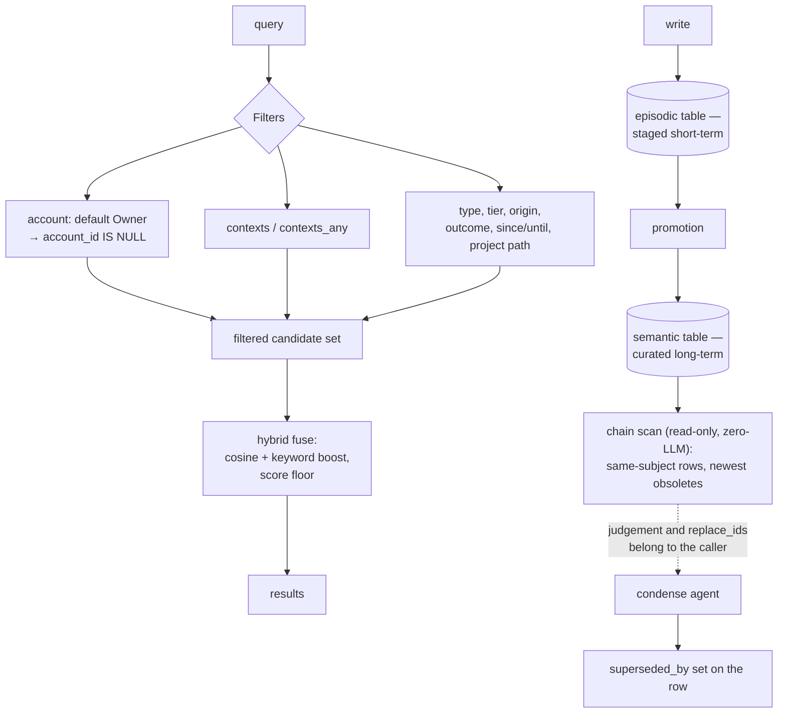

## 1. Executive Summary

Linggen Memory is a local-first memory service — about 14,600 lines of Rust over
LanceDB, with a CLI, an HTTP API, an MCP server and a daemon. Two tables on one
connection: `episodic` for staged short-term material and `semantic` for curated
long-term facts.

One mark, and it is earned on a detail most systems get the other way round.

**The account scope defaults to a closed filter.** `AccountScope` is a three-value
enum whose `#[default]` is `Owner`, and the filter builder compiles it directly
into the query:

```rust
AccountScope::Owner => clauses.push("account_id IS NULL".to_string()),
AccountScope::Id(id) => clauses.push(format!("account_id = ...")),
AccountScope::Any => {}
```

A caller who has never heard of accounts gets the owner's rows, not everyone's.
The comment explains why the default is shaped that way — *"every caller that
never heard of accounts keeps seeing exactly what it saw before the field
existed"* — which is a back-compatibility argument that happens to produce the
safe default. `Any` exists and is documented as being for maintenance that walks
the whole store.

This report has read several systems this week whose scope key is optional, whose
default is unfiltered, or whose boundary lives in whatever query string the caller
composed. Making the enum's default the restrictive variant is a one-word decision
— `#[default]` on `Owner` rather than on `Any` — and it is the difference between
a boundary and a convention.

**The second thing worth reading is a division of labour.**
`src/http/chains.rs` computes supersession chains — *"same-subject rows where the
newest completes or obsoletes the rest"* — and states its own scope precisely:

> This endpoint computes them so the condense mission's agent (which is
> Memory-tools-only and cannot script) never has to page the whole store through
> its context. Read-only, zero-LLM — judgment and the actual `replace_ids` merges
> belong to the caller.

The mechanical part is done by the server because the agent cannot script; the
judgement is left to the agent because the server should not guess. Naming which
half is which, and why, is the part most designs leave implicit.

## 2. Mental Model

A fact is staged, promoted, and eventually condensed — and every read is filtered
by account before anything is scored.



## 3. Architecture

LanceDB, opened once per invocation — the CLI is one-shot in v0.1 — with the table
auto-created on first open. `open_semantic` and `open_episodic` bind the two
tables on the same connection with the same schema and per-table ANN index
isolation.

There is a `doc/memory-spec.md` and a `doc/tech-spec.md`, and the source refers to
them by numbered section (`§2 Condense`), so the code and the specification are
kept in correspondence rather than the specification being a README.

## 4. Essential Implementation Paths

- **Store and filters** — `src/memory/store.rs`: `AccountScope` (37-47), `Filters`
  (85-105), the clause builder (170-172), `MemoryPatch` (275), `MemoryStore` (528).
- **Types** — `src/memory/types.rs`: `Memory` (40), `MemoryType` (210),
  `Outcome` (284), `Origin` (338), `Tier` (398).
- **Schema** — `src/memory/schema.rs`: `superseded_by` (85), encode and decode
  (139, 195, 241).
- **Hybrid retrieval** — `src/memory/hybrid.rs`: `Candidate` (61), `fuse` and the
  floor tests (195-240).
- **Condense** — `src/http/chains.rs:1-12`.
- **Maintenance** — `src/memory/maintenance.rs`: `Footprint` (45), `Report` (170).
- **Surfaces** — `src/cli/mod.rs`, `src/http/memory.rs`, `src/http/mcp.rs`,
  `src/daemon/`.

## 5. Memory Data Model

A fact carries content, an optional vector — *"may briefly be `None` between
insert and embed passes"*, and search ignores rows without one — plus two label
dimensions with a stated difference. `contexts` are hierarchical and path-like
(`code/linggen`, `music/piano`) and are the primary filter dimension; `tags` are
free-form with a prefix convention (`intent:learn`, `topic:coding`,
`person:bob`), and the comment sets a rule for graduating one: *"promote a prefix
to a first-class field only if it becomes heavily filtered in practice."* That is
a schema-evolution policy written down, which is rarer than it should be.

Three enums carry meaning: `MemoryType` (fact, preference, decision and others),
`Outcome` (positive, negative, neutral — *"only meaningful for action-flavored
types"* and nullable for a preference), and `Origin` (user, agent, derived).

**`trust_state` is withheld.** `Origin` records who authored a fact and `Outcome`
records how an action turned out; neither is an epistemic status of the claim, and
neither withholds a fact from a reader. A `derived` fact is retrieved on the same
footing as a `user` one.

**`tombstone` is withheld.** `superseded_by` is a column on the row and the merge
is performed by the caller through `replace_ids`; nothing is keyed on the
superseded content, so the same fact extracted again is a new row.

## 6. Retrieval Mechanics

Filters first, then a hybrid fuse of cosine similarity and a keyword boost against
a score floor. The floor's behaviour is pinned by three adjacent tests: a strong
cosine ranks first, a 0.55 cosine *with* a keyword match is lifted over a 0.6
floor, and a 0.40 cosine with no keyword match is dropped.

**`negative_eval` is withheld**, and the reason is the same distinction this atlas
has had to make elsewhere. `floor_still_drops_low_cosine_non_matches` asserts a
result set is empty, its sibling tests prove `fuse` returns rows for admissible
input, so it is not vacuous — but it is a property of a scoring threshold rather
than a claim that particular material must be withheld from a reader. The mark
asks whether what the mechanism holds could turn out to be false; a candidate
below a cosine floor could not.

The project-path filter is worth a line because it refuses the easy
implementation: it is *"not an equality filter"*, because paths nest and a row
from a subdirectory belongs to the work above it.

## 7. Write Mechanics

Writes land in `episodic` and are promoted to `semantic`. Embedding may lag the
insert, and the read path excludes rows without a vector rather than treating a
missing embedding as a zero.

Condensation is the interesting write. The chain scan is read-only and calls no
model; it hands the agent a list of same-subject chains, and the agent decides
which rows to merge and issues `replace_ids`. The server refuses to be the thing
that decides what obsoletes what.

**`audit_log` is withheld** for absence — there is no append-only record of
mutations:

```sh
grep -rn -iE "append.only|audit|journal|history" src/memory/*.rs src/update/*.rs
```

Nothing outside comments at the pinned commit. A merged-away fact leaves a
`superseded_by` pointer and no record of who merged it or why.

## 8. Agent Integration

Four surfaces — CLI, HTTP, MCP, daemon — over one store, plus a plugins directory.
The condense contract is the notable one: the agent is described in the source as
*"Memory-tools-only and cannot script"*, and the endpoint exists specifically
because of that constraint. Designing an endpoint around what the calling agent
cannot do is a more useful framing than designing around what it can.

## 9. Reliability, Safety, and Trust

The account scope is the safety story and section 1 covers it. Beside it, the
maintenance pass *"picks its person from `distinct_accounts`"* rather than
assuming a single owner, so a multi-account store does not get one person's dream
applied to everyone.

What is missing is any record of change. No audit log, no provenance beyond
`origin`, and supersession that points forward without saying why. For a
local-first personal store that is a defensible position; it means the system can
tell you what it believes and not how it came to stop believing something else.

## 10. Tests, Evals, and Benchmarks

Tests live beside the modules — `hybrid.rs`, `types.rs`, `schema.rs` and
`store.rs` all carry `#[cfg(test)]` blocks — with a `benchmark/` directory and a
`doc/` tree beside them.

The hybrid floor tests are the best-constructed group: three cases that between
them pin what the floor admits, what a keyword boost lifts, and what is dropped,
each with the reasoning in the assertion message.

No paper and no `CITATION.cff`.

Nothing was run. The screen reports dependency manifests changed inside the
seven-day cooldown.

## 11. For Your Own Build

### Steal

**Make the restrictive variant your enum's default.** `#[default]` on `Owner`
rather than on `Any` is one word, and it decides whether a caller who forgot about
scoping sees one person's rows or everyone's. Most scope bugs in this corpus are
this word.

**Say which half of a job is mechanical and which is judgement, in the module that
does the mechanical half.** The chain scan is read-only and zero-LLM and says so;
the merge belongs to the caller and it says that too.

**Design the endpoint around what the caller cannot do.** *"The condense mission's
agent is Memory-tools-only and cannot script"* is why a whole endpoint exists. It
is a better starting point than a list of capabilities.

**Write down when a tag graduates to a column.** *"Promote a prefix to a
first-class field only if it becomes heavily filtered in practice"* is a
schema-evolution policy that stops the metadata blob becoming permanent.

**Make a nested scope filter nest.** A project path that matches by equality gets
the wrong answer the first time a subdirectory has its own rows.

### Avoid

**Supersession that points forward and says nothing.** `superseded_by` records
which row won and not why, who decided, or what was rejected — so a re-extraction
of the losing fact is indistinguishable from a new observation.

**Treating `origin` as trust.** User, agent and derived are useful provenance and
they do not gate anything; a derived fact ranks alongside one a person stated.

### Fit

This suits one person running memory on their own machine across several agent
surfaces, who wants the store to be inspectable, the scope to be right by default,
and the condensing decisions to stay with the agent rather than the server.

It is the wrong fit where a correction has to hold against re-assertion, or where
you need to answer *when did this change and who changed it* — the store keeps the
current belief and the pointer, and nothing else.

## 12. Open Questions

- **Should the condense merge record its reason?** The endpoint already computes
  the chain and the caller already has the judgement; only the write is missing it.
- **What does `Any` cost in practice?** It is the one variant that pushes no
  clause, and it is reachable from maintenance paths.
- **How does a fact get from `episodic` to `semantic`?** The promotion is the
  point at which a staged observation becomes a curated belief and it was not
  traced in full here.
- **Does anything reconcile `superseded_by` against a re-extraction?** The column
  is on the row and the dedup path was not traced to it.

## Appendix: File Index

**Store**

- `src/memory/store.rs` — `AccountScope` (37-47), `Filters` (85-105), clause
  builder (170-172), `MemoryPatch` (275), `MemoryStore` (528)
- `src/memory/schema.rs` — `superseded_by` (85, 139, 195, 241)
- `src/memory/types.rs` — `Memory` (40), enums (210, 284, 338, 398)

**Retrieval and maintenance**

- `src/memory/hybrid.rs` — `Candidate` (61), floor tests (195-240)
- `src/memory/recall.rs`, `src/memory/maintenance.rs` (45, 170)

**Surfaces**

- `src/http/chains.rs` (1-12), `src/http/memory.rs`, `src/http/mcp.rs`,
  `src/cli/mod.rs`, `src/cli/client.rs`, `src/daemon/`

**Specification**

- `doc/memory-spec.md`, `doc/tech-spec.md`

### Commands behind the absence claims

```sh
grep -rn -iE "append.only|audit|journal|history" src/memory/*.rs src/update/*.rs
grep -rn -i "tombstone" src/ --include="*.rs"
grep -rn -i "arxiv\|bibtex\|@article\|citation\|doi" README.md doc/
ls CITATION.cff
```

## History

**2026-09-13** — [`2abbd4ff8f3b847d25e49f5c2a02714dcda995e1`](https://github.com/linggen/linggen-memory/commit/2abbd4ff8f3b847d25e49f5c2a02714dcda995e1) — first reading. Screened first: dependency manifests changed inside the seven-day cooldown, so nothing was installed and no test was run. One mark. `scope_enforced` is earned on an `AccountScope` enum whose `#[default]` is the restrictive variant, compiled into the WHERE clause as `account_id IS NULL`, so a caller who never sets it reads the owner's rows rather than everyone's. `negative_eval` is withheld although a non-vacuous emptiness assertion exists: it pins a cosine floor, which is a property of a scoring threshold rather than a claim that particular material must be withheld. `trust_state` is withheld because `origin` and `outcome` are provenance and result rather than epistemic status, and `tombstone` because `superseded_by` points forward from a row without keying anything on the superseded content.
