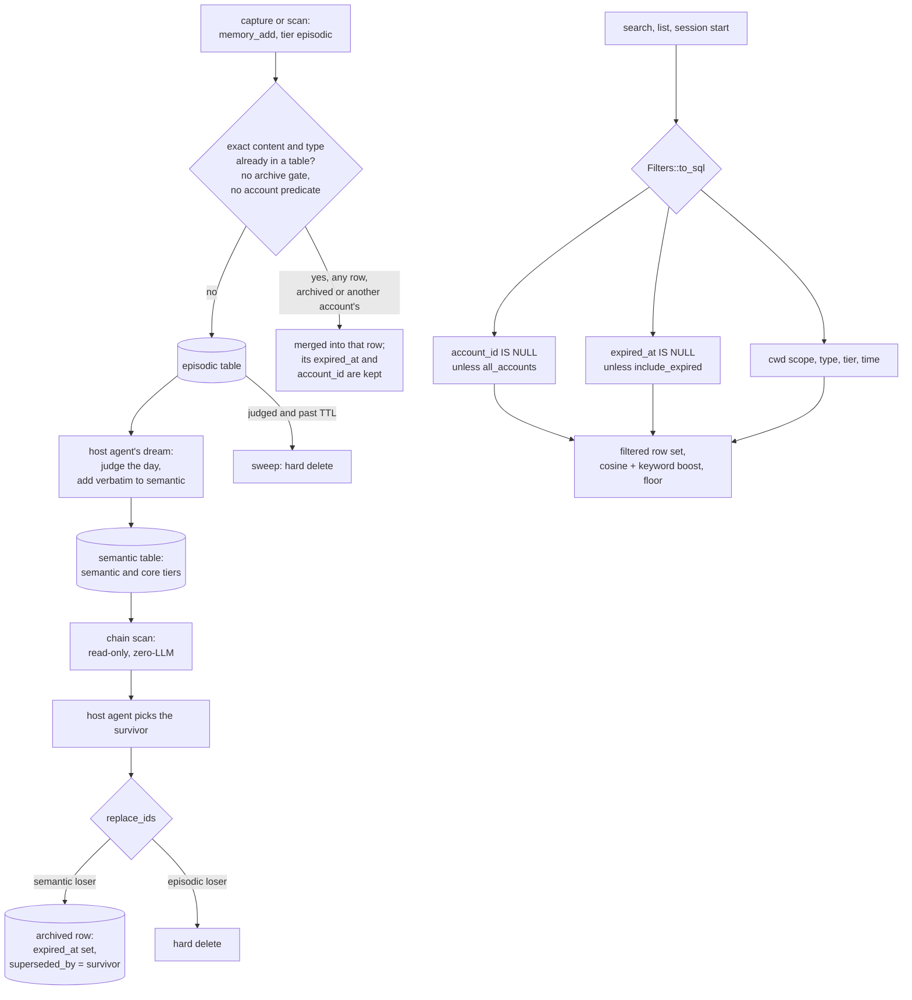

## 1. Executive Summary

Linggen Memory (`ling-mem`) is a local-first memory daemon in Rust over LanceDB,
serving a CLI, an HTTP API, an MCP server and host plugins from one store. Its
account scope defaults to the owner's rows as a WHERE clause, and a merge
archives its losers rather than deleting them. The weak point is where those
two meet the write path. The exact-content dedup lookup carries neither the
archive gate nor the account predicate, so a byte-identical re-statement of an
archived fact is folded back into the archive, and one person's identical write
can land on another person's row.

Three marks: `scope_enforced`, `negative_eval` and `bitemporal`.

**The account scope defaults to a closed filter.** `AccountScope` is a
three-value enum whose `#[default]` is `Owner`, and the filter builder compiles
it directly into the query:

```rust
AccountScope::Owner => clauses.push("account_id IS NULL".to_string()),
AccountScope::Id(id) => clauses.push(format!("account_id = ...")),
AccountScope::Any => {}
```

A caller who has never heard of accounts gets the owner's rows, not everyone's.
The comment gives the reason: *"every caller that never heard of accounts keeps
seeing exactly what it saw before the field existed"*. That is a
back-compatibility argument that happens to produce the safe default
(`src/memory/store.rs:37-47`, `:193-197`).

The widening variant is one boolean away. `all_accounts: true` is accepted by
every filtered HTTP verb, and the MCP server forwards it from a tool call
although no tool schema advertises it. Session start is the one read that
refuses it ([section 6](#6-retrieval-mechanics)).

**A merge keeps what it replaced.** `replace_ids` stamps each semantic loser
with `expired_at` and `superseded_by` and leaves it on disk. Every default read
gates on `expired_at IS NULL`, and a committed test asserts that a superseded
row stays out of a populated list while the survivor is returned
(`src/memory/store.rs:2191-2253`).

**The condense stage separates the mechanical half from the judgement.**
`src/http/chains.rs` computes supersession chains and states its own scope:

> This endpoint computes them so the condense mission's agent (which is
> Memory-tools-only and cannot script) never has to page the whole store through
> its context. Read-only, zero-LLM — judgment and the actual `replace_ids` merges
> belong to the caller.

## 2. Mental Model

A row enters `episodic` as staged capture, is promoted to `semantic` or `core`
when the host agent's nightly dream judges its day, and leaves live memory in
one of three ways. A merge archives a semantic loser under its successor's id.
A sweep deletes a judged episodic row past its TTL. `delete` removes any row
outright.

Nothing in the daemon decides what is true. The dream, the merge and the
choice of survivor belong to the host agent, which drives the store through the
memory verbs. The daemon enforces two floors on that agent: a merge that
replaces a row in the user's voice needs `user_directed: true`, and every read
is filtered by account and by the archive gate before anything is scored.



## 3. Architecture

One daemon, `ling-mem serve`, bound to loopback, holds a LanceDB connection with
two tables of the same schema. The CLI, the HTTP API under `/api/memory/`, the
MCP endpoint at `/mcp` and the web console all reach the same store. The MCP
handler posts each tool call back to the daemon's own HTTP route, so every
surface shares one dispatch path (`src/http/mcp.rs:493-519`).

Embeddings are computed locally with Qwen3-Embedding-0.6B through `fastembed`,
1024 dimensions, with about 1.2 GB of weights fetched on first use. No API key
is needed to store or search anything. No ANN index is built: search scans the
filtered row set and computes cosine in process, which the source says to
revisit past about 100,000 rows (`src/memory/store.rs:1050-1060`).

A wide bind is refused until the machine has paired a device, and an
off-machine request must carry a paired device's token; loopback passes
unchecked (`src/http/gate.rs:79-127`). Usage telemetry to `linggen.dev` is a
default Cargo feature, disabled by `LING_MEM_NO_TELEMETRY=1` or a
`~/.linggen/no-telemetry` file (`src/telemetry/mod.rs:44-50`, `Cargo.toml:16`).

The source cites `linggen/doc/memory-spec.md` by numbered section (`§2
Condense`, the Reconcile contract). That file is in the sibling `linggen`
repository, not in this tree, whose `doc/` holds `tech-spec.md`,
`product-spec.md`, `ui-spec.md`, `schema-versioning.md` and
`release-targets.md`.

## 4. Essential Implementation Paths

- **Scope and filters** — `src/memory/store.rs`: `AccountScope` (37-47),
  `from_args` (53-64), `admits` (69-75), `Filters` (85-136), the account clause
  (193-197), time clauses (238-257), the archive gate (263-270), `cwd_scope`
  and `cwd_lineage` clauses (272-294), `cwd_lineage` (486).
- **Write and dedup** — `src/http/memory.rs`: `add` (642), cross-tier dedup
  (702-742), `guard_user_voice` (849-876), `apply_replace_ids` (898-925);
  `src/memory/store.rs`: `merge_fact` (562-597), `insert_with_dedup`
  (788-809), `find_exact_content` (901-910), `expire` (1214-1223).
- **Retrieval** — `src/http/memory.rs`: `search` (1017), `list` (1078);
  `src/memory/store.rs`: `scored_candidates` (1061), `hybrid_scored` (1099);
  `src/memory/hybrid.rs`: `fuse` (139), floor tests (198-238);
  `src/memory/recall.rs` (both tables).
- **Session start** — `src/http/session.rs`: `session_start` (51-97),
  `rules_filter` (101).
- **Days, sweep and review queue** — `src/http/days.rs`: `sweep` (413-463);
  `src/http/issues.rs`.
- **Condense** — `src/http/chains.rs:1-12`.
- **Types and schema** — `src/memory/types.rs`: `Memory` (40), clocks (88, 102,
  127), `account_id` (144), `MemoryType` (210), `Outcome` (284), `Origin`
  (338), `Tier` (398); `src/memory/schema.rs`: `superseded_by` (85, 139, 195,
  241).
- **Surfaces** — `src/http/mcp.rs`, `src/cli/mod.rs`, `src/daemon/`,
  `plugins/linggen/hooks/`, `plugins/openclaw/src/`.

## 5. Memory Data Model

A fact carries content, an optional vector — *"may briefly be `None` between
insert and embed passes"* — and two label dimensions with a stated difference.
`contexts` are hierarchical and path-like (`code/linggen`, `music/piano`);
`tags` are free-form with a prefix convention (`intent:learn`, `person:bob`).
The comment sets a rule for graduating one: *"promote a prefix to a first-class
field only if it becomes heavily filtered in practice."*

Three enums carry meaning: `MemoryType` (fact, preference, decision, tried,
fixed, learned, built), `Outcome` (positive, negative, neutral, for
action-flavoured types) and `Origin` (user, agent, derived). `cwd` records where
a row was written and doubles as its project scope. `account_id` is null for
the owner and set only on rows from another person's paired device.

**`bitemporal` is awarded.** `occurred_at` is *"when the described thing
happened"*, beside `created_at`, when the row entered, and `expired_at`, when a
merge took it out of live memory (`src/memory/types.rs:88-127`). `since`,
`until` and `day` filter on `COALESCE(occurred_at, created_at)`, and `unjudged`
filters on `created_at` alone (`src/memory/store.rs:238-257`). The scan and
dream flows back-date `occurred_at` to the source session. The sweep uses both
clocks at once: a row's day comes from its event time, and whether that day's
judgement covered it comes from its record time (`src/http/days.rs:429-433`).
The limits: validity is an instant rather than an interval, `update` can
rewrite it, and no read asks what the store held at a past record time.

**`trust_state` is withheld.** `Origin` records who authored a fact and
`Outcome` how an action turned out; neither is an epistemic status, and neither
withholds a fact from a reader. `origin` gates writes — a `from=user` row
cannot be replaced without `user_directed` — and on reads it is a filter a
caller may pass, never a default, so a `derived` fact is retrieved on the same
footing as a `user` one. The `episodic` tier is staging, and search
spans both tables by default, so staged rows are not withheld either.

**`tombstone` is withheld, and the archive comes close by accident.** A
merged-away semantic row stays on disk with `expired_at` and `superseded_by`.
The dedup lookup `find_exact_content` matches `content` and `type` with no
archive gate, and `merge_fact` keeps the existing row's `expired_at`. A
byte-identical re-add of an archived fact is therefore folded into the archived
row and returns `merged` (`src/memory/store.rs:562-597`, `:901-910`). That
blocks a verbatim re-extraction. It is archival keyed on a row, it misses any
paraphrase, it does not apply to episodic losers, which are hard-deleted, and it
also swallows a re-statement the user intends.

## 6. Retrieval Mechanics

Filters first, then a hybrid score over the whole filtered set: cosine plus an
IDF-weighted keyword boost, gated by a floor (`recall_min_score`, 0.6 by
default). The floor tests pin what it admits and drops. A keyword hit at cosine
0.55 is lifted over 0.6 and outranks two non-matching rows with higher cosine,
and a 0.40 row with no keyword match is dropped (`src/memory/hybrid.rs:198-238`).

Per-turn recall comes from a `UserPromptSubmit` hook that calls `memory_search`
over MCP with the session's `cwd_scope` and `exclude_types: ["preference"]`.
Standing rules are loaded once, at session start, by `memory_session_start`.
That route selects `type = preference` rows written globally, at the session's
directory or at one of its ancestors, never deeper and never a sibling sharing
a prefix (`src/http/session.rs:51-108`, `src/memory/store.rs:280-294`).

**`negative_eval` is awarded.** `expire_archives_instead_of_deleting` expires an
`old claim, superseded` row in favour of a `current truth` row. It then asserts
that the default `list` returns exactly one row with the survivor's id and that
the default count is 1 (`src/memory/store.rs:2191-2253`). The survivor's
presence makes the exclusion non-vacuous.
`cwd_lineage_keeps_ancestors_and_globals_only` asserts exact result sets over
six rows, so a sibling project's rule, a deeper rule and a prefix twin stay out
(`:1759-1819`). Both call `list`. The served search path, `scored_candidates`,
shares `Filters::to_sql` and has no exclusion case of its own;
`search_with_context_filter` asserts one on `MemoryStore::search`, a
`vector_search` path no route calls. The cosine-floor tests are not the basis:
they pin a scoring threshold, not material that must be withheld.

**The account scope holds on every default read and widens on request.**
`FilterDTO` and `GetRequest` flatten `AccountScopeDTO`, so `account` and
`all_accounts` are accepted on search, list, count, get, update and delete
(`src/http/memory.rs:268-278`). The MCP loopback drops empty values and
rewrites two known shapes before posting, and passes every other argument
through, so one no tool schema advertises reaches the handler
(`src/http/mcp.rs:392-434`). `session_start` calls `from_args(req.account,
false)` and cannot be widened (`src/http/session.rs:63`).

## 7. Write Mechanics

`add` embeds the content synchronously and inserts it, so a row is searchable
when the call returns. The embedder is the only model in the daemon; nothing
extracts. The MCP tool call waits up to 25 seconds and says on timeout that the
write may have landed (`src/http/mcp.rs:37`, `:483-491`). Episodic capture
skips search; semantic and core adds are search-first by instruction, not by
enforcement.

Dedup is exact, not cosine. The comment gives the reason: *"cat is male"* and
*"cat is female"* score about 0.9, so a cosine merge would corrupt a user fact.
A byte-identical `(content, type)` in the other table is merged when it sits at
the same or a higher tier, and deleted when the new row outranks it. Inside a
table, `insert_with_dedup` merges under a write lock
(`src/http/memory.rs:702-742`, `src/memory/store.rs:788-809`).

**The dedup lookup is unscoped.** `find_exact_content` filters on `content` and
`type` only (`src/memory/store.rs:901-910`). An archived match takes the re-add
into the archive, as section 5 describes. An account match does the same across
people. When the owner adds a sentence a paired phone's person has stored,
`merge_fact` keeps the existing `account_id`. The owner's write lands on the
other person's row, invisible to the owner's scope, and the reverse direction
holds too. No committed test adds content that matches an archived row or
another account's row.

Merges are the host agent's. `replace_ids` expires each semantic loser under the
survivor's id and hard-deletes an episodic one. It runs on every add return path
and checks no row against `admits`, so an owner-scoped call can expire another
account's row by id (`src/http/memory.rs:898-925`). A loser in the user's voice
is refused unless the call carries `user_directed: true`, a flag the calling
agent sets (`:849-876`).

The forget sweep deletes an episodic row only when it is past TTL, its day has
been remembered, and it was created before that day's `remembered_at`, so an
unjudged row is never evicted (`src/http/days.rs:421-436`). Storage compaction
runs in the daemon on a measured fragment condition and rewrites files, not
content (`src/daemon/maintenance.rs`).

**`audit_log` is withheld.** No append-only record of mutations exists in the
store. An archived row names its successor and not who merged it or why. The
review queue's `.issues.json` sidecar records audit findings and resolution
notes, which is a work queue rather than a log of changes to memory.

## 8. Agent Integration

The MCP server registers fifteen tools, among them search, list, get, add,
update, delete, session start, the day verbs, the sweep, the chain scan and
three review-queue verbs (`src/http/mcp.rs:134-342`). A test holds its
instructions under Claude Code's 2048-character cap, because the host drops
the rest silently (`:39-67`, `:691`).

Schemas are narrow by design: `min_score` is left out so a model cannot guess a
threshold, and `cwd`, `host` and `source_session` are marked host-filled. A
`PreToolUse` hook stamps the working directory into `memory_add` and
`memory_search`. The narrowing is advisory past the schema, since the loopback
forwards whatever arguments arrive.

**`human_review` is withheld.** The review queue holds what the dream audit
could not settle, with `open`, `resolved` and `dismissed` states. The same
agent holds `memory_issue_resolve`, and the tool description tells it to solve
each item itself first. The user-voice guard asks for `user_directed: true`,
which the agent supplies. Neither waits on an actor the producing agent cannot
be.

The condense contract is designed around what the calling agent cannot do. The
chain scan exists because that agent *"is Memory-tools-only and cannot
script"*, and each cluster carries `derived_only`, which the tool description
makes the condition for merging unattended.

## 9. Reliability, Safety, and Trust

The account scope covers reads, and it is the safety story for a store that
holds more than one person. It does not cover the write side: the dedup lookup
and `replace_ids` expiry ignore the account. The LAN gate authenticates a
device and does not bind it to an account, so an off-machine request with a
paired token that names another account, or `all_accounts`, reads those rows.
The field comment says the engine mints the account for a phone; that engine
is not in this tree.

`/api/memory/accounts` lists every non-owner account for a per-account
maintenance pass. Nothing in this tree calls it, and the plugins' dream flow
runs under the default owner scope.

Provenance is `origin`, `host`, `source_session` and `cwd`. The archive makes a
merge reversible through the unpack query (`superseded_by = <id>`); `delete`
and the sweep are not reversible. The store can say what it believes and which
row replaced what. It cannot say who decided or why.

Recall fails quiet by design: the hook exits silently when the daemon is down,
and *"recall is an enhancement, never a gate"*.

## 10. Tests, Evals, and Benchmarks

Tests sit beside the modules, most of them in `src/memory/store.rs`, plus a
node test file for the OpenClaw plugin. `.github/workflows/check.yml` runs
`cargo test` on every push to `main` and on pull requests, and
`scripts/check.sh` runs the same locally.

The store tests run against real LanceDB tables in temp directories, so the
rendered SQL is what the engine evaluates. The strongest group is the filter
set: the two default gates as rendered SQL, the account predicate in both
directions, the archive and its unpack query, the ancestor-path rules, and the
event-time and record-time filters.

What is not tested: an `add` whose content matches an archived row or another
account's row, an `all_accounts` read through MCP, and an exclusion on the
served hybrid search path.

`benchmark/` holds a LongMemEval-S retrieval harness (`run_longmemeval.py`).
Its `LONGMEMEVAL.md` results section reads *"Pending"*, and `benchmark/results/`
holds only `.gitkeep`. No paper and no `CITATION.cff`.

Nothing was run. The screen reports `Cargo.toml` and `Cargo.lock` inside the
seven-day cooldown.

## 11. For Your Own Build

### Steal

**Make the restrictive variant your enum's default.** `#[default]` on `Owner`
rather than on `Any` is one word, and it decides whether a caller who forgot
about scoping sees one person's rows or everyone's.

**Archive merge losers under the survivor's id.** An `expired_at` and
`superseded_by` pair, a default read gate and an unpack query make a merge
reversible at the cost of two nullable columns.

**Say which half of a job is mechanical and which is judgement, in the module
that does the mechanical half.** The chain scan is read-only and zero-LLM and
says so; the merge belongs to the caller and it says that too.

**Scope standing rules by ancestor list, not by prefix.** Enumerating a path's
ancestors and matching them exactly keeps `…/linggen-mobile` out of
`…/linggen` without a `LIKE`.

**Write down when a tag graduates to a column.** It stops the metadata blob
becoming permanent.

### Avoid

**A dedup lookup that skips the gates your reads apply.** Every read here
filters on account and archive; the one lookup that decides where a write lands
filters on neither, and the consequence is silent.

**A widening flag any caller can set.** `all_accounts` is documented as
maintenance-only and accepted from every route that takes a filter; the one
route that hardcodes `false` shows the fix.

**Treating `origin` as trust.** It gates who may replace a row; on reads it is
a filter a caller may choose, so a derived fact ranks alongside one a person
stated.

### Fit

This suits one person running memory on their own machine across several
agent hosts, who wants the scope right by default, merges reversible, and the
condensing decisions left to the agent. The daemon, a local 1.2 GB embedding
model and a flat scan are a single-binary cost with a known ceiling.

It is the wrong fit where several people share one store and the boundary must
hold on writes as well as reads, or where you need to answer who changed a fact
and why.

## 12. Open Questions

- **Is folding an exact re-add into the archive intended?** It blocks a
  verbatim re-extraction and also swallows a re-statement the user means. The
  response says `merged` with the archived id, and no caller in this tree
  checks it.
- **Does the engine bind a phone to its account on reads?** The daemon accepts
  whatever account a request names; the pairing record that could bind it lives
  in the `linggen` repository.
- **Should the merge record its reason?** The chain scan computes the cluster
  and the caller has the judgement; only the write omits it.

## Appendix: File Index

**Store**

- `src/memory/store.rs` — `AccountScope` (37-75), `Filters` (85-136), clauses
  (193-294), `merge_fact` (562), `insert_with_dedup` (788),
  `find_exact_content` (901-910), `scored_candidates` (1061), `expire` (1214),
  tests (1608, 1635, 1759, 2032, 2060, 2191)
- `src/memory/types.rs` — `Memory` (40), clocks (88, 102, 127), `account_id`
  (144), enums (210, 284, 338, 398)
- `src/memory/schema.rs` — `superseded_by` (85, 139, 195, 241)

**Retrieval and maintenance**

- `src/memory/hybrid.rs` — `Candidate` (61), `fuse` (139), floor tests
  (198-238)
- `src/memory/recall.rs`, `src/memory/maintenance.rs` (45, 170),
  `src/daemon/maintenance.rs`

**Surfaces**

- `src/http/memory.rs` — DTOs (268-418), `add` (642), `apply_replace_ids`
  (898), `search` (1017), `list` (1078)
- `src/http/session.rs`, `src/http/days.rs`, `src/http/issues.rs`,
  `src/http/chains.rs` (1-12), `src/http/mcp.rs`, `src/http/gate.rs`,
  `src/cli/mod.rs`, `src/daemon/`
- `plugins/linggen/hooks/` (`recall.sh`, `stamp-cwd.sh`, `autostart.sh`),
  `plugins/linggen/skills/linggen/references/dream-flow.md`

**Specification**

- `doc/tech-spec.md`, `doc/product-spec.md`, `doc/ui-spec.md`

### Commands behind the absence claims

Run at the tree root of the pinned commit.

```sh
# audit_log: no append-only mutation record (hits are tool descriptions and a test name)
grep -rn -iE "append.only|audit|journal|history|event.?log" src/ --include='*.rs'
# tombstone: the three hits are LanceDB deletion tombstones in compaction code
grep -rn -i "tombstone" src/ --include='*.rs'
# bitemporal limits: no interval columns and no as-of read
grep -rn -iE "valid_from|valid_to|valid_until|as_of|asof" src/ --include='*.rs'
# the dedup lookup carries no archive or account predicate
grep -n "async fn find_exact_content(" -A9 src/memory/store.rs
# no ANN index is built
grep -rn -E "create_index|IvfPq" src/ --include='*.rs'
# nothing in the tree calls the accounts route or sets all_accounts
grep -rn -E "api/memory/accounts|all_accounts" plugins/ static/ src/cli/
# no model client in the daemon; the embedder is the only model
grep -rn -iE "openai|anthropic|chat/completions|ollama" src/ --include='*.rs'
# MemoryStore::search (vector_search) has no caller outside its own module's tests
grep -rn "\.search(" src/ --include='*.rs'
# the five dedup_* tests use neither expire nor account_id
grep -n "async fn dedup_" src/memory/store.rs
# the engine's pairing code is not in this tree
grep -rn "pair.rs" src/; ls server
# no paper
grep -rn -iE "arxiv|bibtex|@article|@misc|citation|doi\.org" README.md doc/
ls CITATION.cff
ls doc/memory-spec.md
```

## History

**2026-09-26** — [`9e1c03263ab2b7da96e7a37c35f3107570bc7412`](https://github.com/linggen/linggen-memory/commit/9e1c03263ab2b7da96e7a37c35f3107570bc7412) — 13 commits on, through ling-mem 1.9.0: standing rules load at session start through an ancestor-path filter, a `created_since` filter serves the dream's unjudged worklist, and CI runs `cargo test`. Two marks added, both present at the first pin: `negative_eval` on a case that a superseded row stays out of a populated default list ([section 6](#6-retrieval-mechanics)), and `bitemporal` on `occurred_at` filtered beside `created_at` ([section 5](#5-memory-data-model)). The first reading missed the archive: merges expire semantic losers, and the exact-content dedup reaches archived and other-account rows ([section 7](#7-write-mechanics)). `doc/memory-spec.md` is in the sibling `linggen` repository. Screened first: one auto-run surface, `Cargo.toml` and `Cargo.lock` inside the seven-day cooldown. Nothing installed, built or run.

**2026-09-13** — [`2abbd4ff8f3b847d25e49f5c2a02714dcda995e1`](https://github.com/linggen/linggen-memory/commit/2abbd4ff8f3b847d25e49f5c2a02714dcda995e1) — first reading. Screened first: dependency manifests changed inside the seven-day cooldown, so nothing was installed and no test was run. One mark. `scope_enforced` is earned on an `AccountScope` enum whose `#[default]` is the restrictive variant, compiled into the WHERE clause as `account_id IS NULL`, so a caller who never sets it reads the owner's rows rather than everyone's. `negative_eval` is withheld although a non-vacuous emptiness assertion exists: it pins a cosine floor, which is a property of a scoring threshold rather than a claim that particular material must be withheld. `trust_state` is withheld because `origin` and `outcome` are provenance and result rather than epistemic status, and `tombstone` because `superseded_by` points forward from a row without keying anything on the superseded content.
