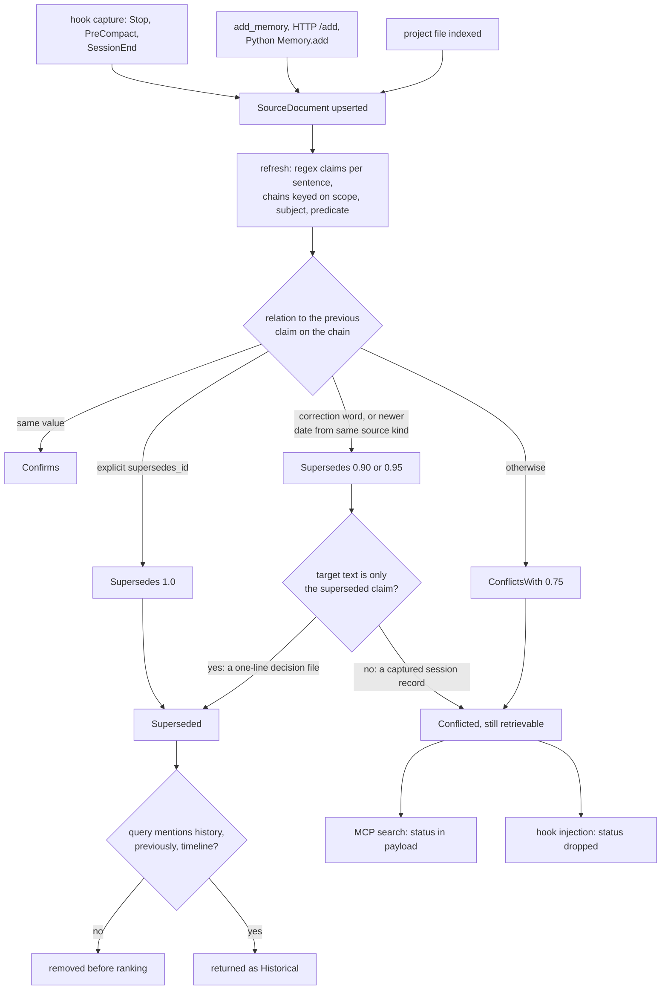

## 1. Executive Summary

Lint-AI is a Rust memory layer for coding agents. Lifecycle hooks in Claude
Code, Codex, Gemini CLI, AGY and OpenClaw capture a short record of each turn
into a project-local store and inject relevant records at the next prompt; MCP
servers expose search over those records and the project's own files.

What is notable is the current-state policy. At every refresh it extracts
claims from each document, links claims on one subject into chains, and marks a
document superseded when an explicit link, a correction word or a newer
timestamp replaces its only claim. A superseded document leaves the candidate
set before ranking, on every entry point, and a history query brings it back
labelled.

What is weak is where that policy reaches. It hides only documents holding a
single claim; a captured session record holds several lines, so it is at most
marked conflicted, and the hook that injects it drops the mark.

The rest of the tree is lint for knowledge bases — orphan pages, missing
cross-references, terminology drift (`src/review.rs`, `src/rules/`) — which is
where the name comes from and is not memory. The memory surface is two stores
per project: `.lint-ai/memory/` for captured sessions and
`.lint-ai/workspace-memory/` for indexed project files.

A second API, shaped like mem0's add and search, serves an HTTP server, Python
bindings and a Hermes Agent plugin with per-user rows, explicit
`supersedes_id`, expiry and delete. It is what the LongMemEval figures in the
README exercise, and by default it does not open the store the hooks write.

Two marks: `scope_enforced` on that API's `memory_user_id` filter, and
`negative_eval` on committed cases asserting superseded material stays out of a
populated result. Section 9 names the five withheld.

## 2. Mental Model

A memory is a `SourceDocument`: a captured turn, an API message, or a project
file. It becomes retrievable the moment it is upserted; there is no candidate
state and no extraction model. Belief is then decided at query time, per
document, by a status the store derives and never stores as authored.

**Claims are regex matches, and chains are keyed on subject and predicate.**
`extract_claims` splits content on newlines and sentence punctuation and tries
four patterns: ownership (*"X owns Y"*), assignment, usage (*"use X for Y"*),
and a scalar setting of the form *"name: 5"* or *"name = true"*
(`src/semantic_relations.rs:993-1040`, `:1096-1163`). Claims sharing scope,
subject and predicate form a chain in timestamp order.

**Three things decide a relation between neighbours on a chain.** An equal
value is `Confirms`. A newer document containing *"instead of"*, *"no
longer"*, *"previously"* or five other cue phrases anywhere is `Supersedes` at
0.95. A strictly newer date from the same source kind is `Supersedes` at 0.90.
Anything else is `ConflictsWith` at 0.75 (`:624-681`, `:1297-1311`). An
explicit `supersedes_id` filter, from Markdown frontmatter or the API, is
`Supersedes` at 1.0 when both documents share a semantic scope (`:601-619`).

**Only a whole-document match hides anything.** `document_state_for` marks the
target `Superseded` only when the relation is explicit, or when the target's
non-heading text is exactly the superseded claim; otherwise it becomes
`Conflicted` and stays retrievable (`:827-883`). The design document says so in
the same terms (`docs/semantic-supersession.md`).

**The status is recomputed, not held.** Nothing writes `Current` or
`Conflicted` to a row; `SemanticRelationStore::update_documents` rebuilds the
affected chains from content on every refresh. A document stops being believed
when a newer document replaces it and comes back if that document is removed or
edited. Deletion is the only permanent exit.

## 3. Architecture

One crate, `lint_ai`, builds a CLI (`lint-ai`), an HTTP server
(`src/bin/server.rs`), per-provider MCP servers and hook commands behind cargo
features, and optional PyO3 bindings. Every production path opens a
`MemoryService` over an `IndexStore`; `tests/no_store_bypass.rs` fails the
build if code outside the pipeline, the service, tests or benchmarks touches
`IndexStore` directly.

**Storage.** An `IndexStore` directory holds `records.json` (pretty-printed,
atomically replaced), `core.bin`, `segments.json`, `chunk_lifecycle.json` and
Tantivy segments (`src/pipeline/store.rs:35-40`,
`src/pipeline/persistence.rs:594-633`). Documents are grouped into segments by
`group_id`, which for captured memory is one session.

**Two stores per project.** Hooks and MCP write tools go through
`with_shared_memory_service`, which takes an advisory file lock on
`.lint-ai/memory/` with a 10-second wait (`src/integrations/mcp_index.rs:116`,
`:140-157`). MCP search composes that store with `.lint-ai/workspace-memory/`, a
rebuild of the project's files that is cleared and reloaded whenever a
filesystem fingerprint changes (`:337-375`). The HTTP server opens
`workspace-memory` by default, or the first index it discovers
(`src/bin/server.rs:238-259`).

**Background work.** A per-process thread extracts key phrases through a spaCy
subprocess (`scripts/spacy_relations.py`); hook processes die before it
finishes, so `search_with_filters` backfills one batch synchronously
(`src/memory_api.rs:1286-1291`). Both fail open when Python is absent.

### Deployment and ergonomics

`cargo install --git` builds one binary; nothing else is required to store and
retrieve. `Cargo.lock` is gitignored (`.gitignore:42`), so every install
resolves the dependency graph afresh. spaCy is optional and improves key
phrases and structured facts. No API key is needed. The HTTP server refuses any
non-loopback bind (`src/bin/server.rs:1361-1375`). `records.json` is readable
by hand.

## 4. Essential Implementation Paths

**Capture (hooks).** `run_hook` records the raw event if recording is on, then
runs `handle_hook` on a worker thread against a 2,000 ms budget
(`src/integrations/claude_code/hooks/mod.rs:63-129`, `:139-163`). `Stop`,
`PreCompact`, `SessionEnd` and `SubagentStop` call `capture`, which reads up to
4 MiB of transcript tail, keeps the last six messages, and writes *"Memory type,
Request, Result, Affected paths"* with each field redacted and capped at 1,500
bytes (`:384-424`, `:470-501`, `:626-663`). The document id hashes the content,
so every distinct turn is a new row (`:397-401`).

**Capture (API).** `MemoryService::add_unpublished` validates ids, rejects a
reused `request_id` with different content, and writes one document per message
with `memory_user_id`, `request_id`, a fingerprint, and optional
`expires_at_ms` and `supersedes_id` filters (`src/memory_api.rs:1006-1088`).
MCP `add_memory` calls it with the fixed user `"mcp"` and never passes
`supersedes_id` (`src/integrations/mcp_tools.rs:554-638`).

**Refresh.** `IndexStore::prepare_pending_changes` rebuilds records for changed
documents, drops removed ones, rebuilds the temporal fact table and updates
semantic relations incrementally (`src/pipeline/store.rs:1266`, `:1310-1328`).

**Retrieval.** Hooks call `observe_plain_query`, which runs
`IndexStore::query_prepared` with no filters (`src/memory_api.rs:2159-2180`).
MCP search, the HTTP server and the benchmarks call `search_with_filters`, which
adds query augmentation, conversational rerank, structured facts and a temporal
scope boost (`:1278-1368`). Its doc comment says all retrieval converges there
(`:1264-1277`); the hooks, which are the automatic path, do not. Both reach
`execute_prepared_on_snapshot_parts`, where filters and semantic suppression are
intersected before ranking (`src/pipeline/persistence.rs:23-98`).

**Injection.** `select_session_documents` keeps one hit per session and
rewrites it to that session's preferred record — a session summary over an
outcome over a checkpoint, then the latest (`src/memory_api.rs:2202-2264`). The
hook formats up to five within 8,000 bytes, each with captured and current
branch and revision and an ancestry verdict from `git merge-base`
(`src/integrations/claude_code/hooks/mod.rs:317-367`, `:592-611`).

**Correction.** `delete`, `supersede` and `expire` exist on `MemoryService`
(`src/memory_api.rs:2329-2400`) and are reachable over HTTP and Python.

## 5. Memory Data Model

`SourceDocument` carries `doc_id`, `source`, `content`, `concept`, `group_id`,
`headings`, `links`, `timestamp`, `author_agent` and a string-to-string
`filters` map. Everything memory-specific is a filter key: `provider`,
`project_id`, `session_id`, `document_type`, `branch` and `revision` on
captures (`src/integrations/claude_code/document.rs:41-79`); `memory_user_id`,
`request_id`, `request_fingerprint`, `expires_at_ms` and `supersedes_id` on API
rows.

**Derived state.** `SemanticClaim` holds subject, predicate, object, evidence
sentence, `effective_at` (the document timestamp), scope and a fixed 0.85
confidence. `SemanticRelation` holds kind, both claim and document ids,
confidence, method and evidence strings. `DocumentSemanticState` holds the
status, `superseded_by`, confidence and evidence
(`src/semantic_relations.rs:42-93`). None of it is authored; all of it is
rebuilt from content.

**Scope is a string derived three ways.** `semantic_scope` is a
`semantic_scope` filter if present, else `user:` plus `memory_user_id`, else
`store` (`:1215-1225`). Captured memories have neither, so every captured
ownership or usage claim in a project shares the `store` scope. Scalar settings
are further scoped by `group_id` — for a capture, one session — or by parent
directory and heading for a file (`:1227-1252`). Two sessions stating different
values for the same setting therefore never meet on a chain.

**Temporal facts.** `TemporalFact` has `valid_from`, `valid_to` and
`is_latest`, closed when a later fact on the same key changes value
(`src/temporal_fact.rs:22-45`, `:206-258`). `valid_from` is the document
timestamp; there is no separate record time.

## 6. Retrieval Mechanics

Lexical retrieval is Tantivy BM25 over sections and chunks, with sparse entity
and term tables, query expansion from a thesaurus and WordNet seeds, and
temporal scoring whose window depends on the query's inferred tense
(`src/query_plan.rs:76-127`). The hooks and MCP use a segmented layout that
routes each query to the three most distinctive segments
(`src/integrations/mcp_index.rs:273-281`).

**Suppression happens before ranking.** `semantic_allowed_doc_ids` returns
every document not `Superseded`, and it is intersected with the caller's filter
set before the index is queried (`src/query_plan.rs:172-198`), so a superseded
document never takes a top-k slot. The API's expiry check is the opposite: it
runs in `format_search_response`, after ranking, so an expired row consumes a
slot and the caller gets fewer results (`src/memory_api.rs:2306-2327`).

**The history switch is a substring list.** Any query containing *"history"*,
*"previous"*, *"previously"*, *"timeline"* or ten other phrases disables
suppression and relabels superseded hits `Historical`
(`src/semantic_relations.rs:1320-1340`). *"What did we previously decide about
retries"* gets both values.

**What the agent sees differs by path.** MCP `search_results` includes
`semantic_status`, `superseded_by` and relation evidence per hit
(`src/integrations/mcp_tools.rs:114-144`). The hook's injected block carries
source, type, capture time, branch, revision and ancestry, and no status
(`src/integrations/claude_code/hooks/mod.rs:340`), so a `Conflicted` record is
injected as plainly as a current one.

**Failure modes.** Session collapse rewrites a matched checkpoint to the
session's summary, which may not contain the matched text. Captured ownership
claims from unrelated sessions share one scope and can chain.

## 7. Write Mechanics

Hook capture is automatic and model-free: the latest user message that is not a
task notification and the latest assistant message that does not look like a
tool trace become *Request* and *Result*. Tool blocks are dropped. A line
containing one of eleven credential markers is replaced with `[REDACTED]`, and
a private-key block is redacted whole
(`src/integrations/claude_code/hooks/mod.rs:626-663`). Nothing extracts facts
or deduplicates across turns; identical content in one session reuses its id.

Explicit writes are `add_memory` (MCP), `/add` and `/add/batch` (HTTP) and
`Memory.add` (Python). The HTTP routes take a single-writer gate and return
429 when it is held (`src/bin/server.rs:886-925`).

**Updates and deletes.** The API `update` replaces content under the same id and
clears key phrases so they are re-extracted (`src/memory_api.rs:1189-1248`).
`delete` removes the row. `supersede` sets `supersedes_id` on the replacement.
`expire` removes the caller's expired rows. All four require the row's
`memory_user_id` to equal a non-empty caller id (`:2329-2400`, `:2544-2555`).
None is on the agent's MCP surface.

### Operational cost

The hook blocks the client for at most 2,000 ms by default
(`LINT_AI_HOOK_TIMEOUT_MS`, clamped to 100–30,000). Capture opens the store,
waits for the write lock for up to 10 s, upserts and refreshes. When the budget
expires, `run_hook` writes an empty response and returns, and the process exit
ends the worker mid-capture (`:117-129`, `src/engine/run.rs:307`). A capture
under lock contention is lost with one stderr warning.

A completed capture is retrievable at the next hook, since the refresh runs
inside the write. Every refresh rebuilds `TemporalFactStore` over every record
(`src/pipeline/store.rs:1310-1311`). Injection is bounded at five records and
8,000 bytes and goes into the hook's `additionalContext`, after the cached
prefix.

## 8. Agent Integration

Installers write hooks and MCP entries per client
(`--claude-code-install`, `--codex-install`, and equivalents). The MCP servers
register `search`, `info`, `list_memories`, `add_memory`, `get_memory`, seven
bulletin-board tools, `record_session` and enable/disable/status controls
(`src/integrations/claude_code/mod.rs:677-736`,
`src/integrations/mcp_tools.rs:195-317`, `:515-546`). A shipped skill tells the
agent to call `mcp__lint-ai__search` first for any question about prior
decisions (`.claude/skills/lint-ai-memory/SKILL.md`).

In the Claude Code adapter, retrieval runs at `SessionStart` with a fixed
query, *"decisions unresolved work failures implemented changes"*, and at every
prompt, prompt expansion, tool call and subagent start
(`src/integrations/claude_code/hooks/mod.rs:217-266`). All providers share one
project store; provider is kept per row and can be passed to `search` as a
filter. Muse Code's hooks only record raw events
(`src/integrations/muse_code/hooks/mod.rs:89-117`). The Hermes plugin posts
turns to the HTTP server's `/add/batch` and recalls through `/search` under a
configured user id (`integrations/hermes-plugin-lintai/__init__.py`).

The session pointer is per provider: MCP `search` and `add_memory` inherit the
session that provider's hooks saw last when the agent omits `session_id`
(`src/integrations/mcp_tools.rs:96-112`, `src/conversation_state.rs:184-230`).
With two sessions of one client open on a project, the pointer belongs to
whichever hook fired last.

## 9. Reliability, Safety, and Trust

**Nothing corrects a hook-captured record.** The agent can add and read, not delete
or supersede. A person cannot delete one through the API either: these
records carry no `memory_user_id`, and every API mutation requires the row's
value to equal a non-empty caller id. Inferred supersession would retire a
record only if it held a single claim, which a *Request/Result* record never
does (`src/semantic_relations.rs:850-862`). What remains is editing the store
on disk.

**Scope.** The API filter is enforced on search, get, list, update, delete and
supersede. An empty `user_id` skips it on search, which
`search_with_empty_user_id_skips_ownership_filter` pins as intended
(`src/memory_api.rs:2777-2839`). Under JWT the body's `user_id` must equal `sub`;
under a static token without `SERVER_TENANT_ID` any holder names any user,
including the empty one (`src/bin/server.rs:386-438`, `:862-884`).

**A deleted replacement keeps its predecessor hidden until restart.** `supersede`
adds `(user, old_id)` to the in-memory `superseded_ids`, and `delete` never
removes it (`src/memory_api.rs:2329-2373`). `is_visible` keeps filtering the old
row out of search, get and list in the running process; a restart rebuilds the
set from stored filters and the row returns.

**Loss paths.** Capture abandoned at the hook budget (section 7). An HTTP server
writing into `workspace-memory` shares it with MCP startup, which clears and
reloads that store from project files when the fingerprint changes
(`src/integrations/mcp_index.rs:350-366`); memories added over HTTP there would
not survive it. That is a reading of both paths, not a run.

**Provenance** is strong for captures: provider, session, branch and revision
travel with each row and reach the injected text with an ancestry check.

Capability marks:

- `scope_enforced` — awarded on the memory API; evidence in the frontmatter.
  Agent memory is a physical per-project partition with no key on the read.
- `negative_eval` — awarded; section 10.
- `trust_state` — `SemanticStatus` has a state that withholds (`Superseded`), and
  it is derived from content at every refresh rather than held; nothing can set
  or retain it, and `Conflicted` withholds nothing.
- `tombstone` — `IndexStore.tombstones` holds removed document ids for the
  incremental rebuild. Nothing is keyed on a rejected value; re-adding the text
  restores it.
- `bitemporal` — `TemporalFact` has a validity interval but no record time, and
  none of its five accessors has a caller outside its own tests.
- `audit_log` — telemetry records retrievals and lifecycle events
  (`src/telemetry.rs:85-204`); no mutation record exists.
- `human_review` — writes are live on arrival and no state waits for anyone.

## 10. Tests, Evals, and Benchmarks

Nothing was built or run for this report; everything below is from reading the
tests and committed results at the pin. CI runs `cargo test --all-targets` with
default features and again with `agent-integrations` on every push to `main`
touching `src/` or `tests/` (`.github/workflows/full-test-matrix.yml:8-40`).

**The negative cases.**
`semantic_policy_hides_automatically_superseded_documents_and_exposes_history`
asserts the newer ownership file is returned and the older is not, then that a
*"what changed"* query returns the older one as `Historical`
(`tests/integration.rs:55-101`). `cli_supersession.rs` runs the binary on the
README's two retry-policy files, once with frontmatter and once with file
mtimes, and asserts one result and no `--llm-context` chunk from the old file,
beside one from the new (`tests/cli_supersession.rs:15-177`). The API case
asserts exactly the replacement returns (`src/memory_api.rs:3102-3138`).

**Guards on the mechanism's edges.**
`reveals_bug_superseded_claim_hides_unrelated_current_content` asserts a
multi-claim document stays visible as `Conflicted`
(`tests/integration.rs:103-149`). The relation store's incremental update is
checked against a full rebuild over fixed and randomized mutation sequences
(`src/semantic_relations.rs:1949-2570`).

**Two cases that cannot fail as named.** `search_cannot_cross_user_boundaries`
ends in `.all(|m| m.content.contains("amber"))` with no assertion that anything
was returned (`src/memory_api.rs:2738-2774`).
`supersession_is_scoped_to_the_requesting_user` points user B's
`supersedes_id` at `stable_doc_id_from_source("old:0")`, while user A's row id is
derived from `"user-a:old:0"` (`:3143`, `:1057-1060`), so the link targets no
row and the test passes whether or not supersession is scoped.

**Benchmarks.** `comparison/results/retrieval-longmemeval-current.json` holds
the README's headline figures for the 500-question LongMemEval-S set, as a
summary with the command that produced it. No per-question output is committed,
so the numbers cannot be recomputed from the tree. They measure the API path
over question-scoped haystacks, not hook capture. No paper or citation block is
in the tree.

**Not covered.** No test exercises supersession or conflict status on a
hook-captured record, the hook budget abandoning a capture, or MCP startup
rebuilding a store holding HTTP writes.

## 11. For Your Own Build

### Steal

- **Filter before ranking, and put the filter in the one executor every entry
  point reaches.** Intersecting the current-state set with the caller's filters
  before the index is queried means a hidden document never takes a slot.
- **Invert the filter for history instead of deleting.** A replaced value is
  still evidence for *what changed* questions, and a label says so.
- **Print the revision a memory was captured at, beside the current one and
  their ancestry.** It lets the model discount a memory from a diverged branch.
- **Guard architecture with a test.** `no_store_bypass.rs` makes the single
  service boundary a build failure rather than a convention.
- **Differential-test an incremental structure against its full rebuild**, with
  randomized mutation sequences.

### Avoid

- **A correctness mark the injection path drops.** A status computed for every
  hit and shown only on the path the agent must choose to call.
- **Whole-document suppression over records that are never one claim.** Decide
  what unit a supersession retires, and make the capture format produce it.
- **A hook budget shorter than the lock wait it may sit behind**, in a process
  whose exit ends the worker.
- **A filter applied after the top-k cut** (expiry here), which silently shrinks
  results.
- **A derived table rebuilt on every write with no reader.**

### Fit

This suits a developer using several coding agents on one repository who wants
automatic, local, provenance-rich recall of recent turns and of the project's
own decision files, with no model call and no service to run. The
current-state machinery pays off on curated Markdown decision records, one
claim per file, which is the README's example. It does not yet pay off on what
the hooks capture. Anyone who needs an agent to correct its own memory, a
review step, or per-user isolation in the agent path should look further; the
memory API has the isolation and the correction verbs, on a separate store.

## 12. Open Questions

- How often does the 2,000 ms budget abandon a capture in practice, and is the
  loss visible anywhere but stderr?
- Is the HTTP server meant to run alongside the MCP servers on the same
  `.lint-ai/` directory? The default index discovery suggests yes.
- Is `TemporalFactStore` intended for a query path that has not landed, and is
  its per-refresh rebuild measured?
- What share of captured records produce any regex claim at all?
- Does `BEHOOD_RELATIONS` point at an external extractor that changes the
  structured-fact results the benchmarks report?

## Appendix: File Index

- **Storage and schema:** `src/source.rs`, `src/pipeline/store.rs`,
  `src/pipeline/persistence.rs`, `src/pipeline/config.rs`.
- **Current-state policy:** `src/semantic_relations.rs`, `src/query_plan.rs`,
  `src/temporal_fact.rs`, `docs/semantic-supersession.md`.
- **Memory API:** `src/memory_api.rs`, `src/bin/server.rs`, `src/lib.rs`
  (PyO3).
- **Hooks:** `src/integrations/claude_code/hooks/mod.rs`,
  `src/integrations/claude_code/document.rs`,
  `src/integrations/codex/hooks/mod.rs`, `src/integrations/gemini_cli/hooks.rs`,
  `src/integrations/agy/hooks.rs`, `src/integrations/openclaw/hooks.rs`.
- **MCP:** `src/integrations/mcp_tools.rs`, `src/integrations/mcp_index.rs`,
  `src/integrations/claude_code/mod.rs`, `src/integrations/codex/mod.rs`,
  `src/conversation_state.rs`.
- **Recording:** `src/integrations/session_recording.rs`, `src/telemetry.rs`.
- **Tests:** `tests/integration.rs`, `tests/cli_supersession.rs`,
  `tests/no_store_bypass.rs`, `tests/query_path_consistency.rs`, test modules
  in `src/memory_api.rs` and `src/semantic_relations.rs`.
- **Benchmarks:** `comparison/results/`, `benchmark/`, `src/bin/*benchmark*.rs`.

### Recorded searches

Checked against the checkout at the pinned revision.

- `rg -n 'temporal_facts_as_of|temporal_timeline|temporal_events_between|temporal_adjacent_pairs_between|temporal_timeline_window_around|\.temporal_facts\(' . -g '*.rs' -g '*.py' | grep -v src/pipeline/store.rs` — no match: the temporal fact accessors have no caller.
- `rg -n 'observe_plain_query|search_with_filters\(' src -g '!src/memory_api.rs'` — every hook module calls `observe_plain_query`; the MCP modules call `search_with_filters`.
- `rg -n 'expires_at_ms' src -g '!src/memory_api.rs'` — only construction sites and PyO3 signatures; expiry never reaches the index filter.
- `rg -n -i 'forget|delete_memory|\.delete\(|\.supersede\(|\.expire\(' src -g '!src/bin/**' -g '!src/memory_api.rs'` — only `src/lib.rs` (Python); no MCP or hook caller.
- `rg -n 'semantic_status|superseded' src/integrations/*/hooks* src/integrations/*/hooks/*.rs` — no match: no hook reads the status.
- `grep -nE '^\s*(pub )?(pub\(crate\) )?fn |"kind"' src/telemetry.rs` and `rg -n -i 'audit|mutation_log|event_log' src/pipeline src/memory_api.rs` — retrieval, lifecycle and query telemetry only; no mutation log.
- `git ls-tree -r --name-only HEAD | grep -iE 'cargo.lock'` — no match; `.gitignore:42` lists it.
- `grep -rliE 'arxiv|bibtex|@article|@misc|doi\.org' . --exclude-dir=.git` — no match, and no `CITATION.cff`.

## History

**2026-09-30** — [`a1919f1daac035068aa70311d091ad2a8286fd49`](https://github.com/RooAGI/Lint-AI/commit/a1919f1daac035068aa70311d091ad2a8286fd49) — first reading, at the head of `main`, a merge dated 30 September 2026 UTC. Two marks, `scope_enforced` and `negative_eval`. Screened before reading: no auto-run surface, 2 build-time execution points (both ordinary modules named `build.rs` under `src/`, not Cargo build scripts), 5 dependency files inside the cooldown — every file in a depth-1 clone dates to the tip — and no unpinned surface reported, although `Cargo.lock` is gitignored. `.claude/skills/lint-ai-memory/SKILL.md` and `INSTALL_FOR_AGENTS.md` were read as data. Nothing installed, built or run.
