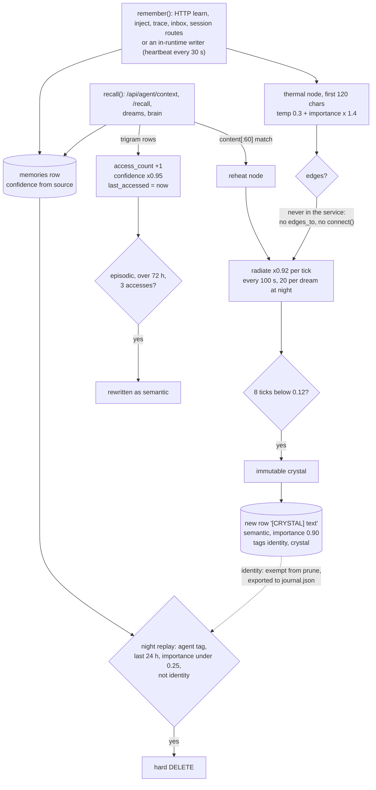

## 1. Executive Summary

**The source of this report is no longer reachable upstream.** `NovasPlace/living-mind-cortex`
returns 404 with no rename redirect, while the account keeps its other public repositories, so the repository was deleted or made private. The atlas holds a copy: the fork at
[`agent-memory-atlas-archive/NovasPlace--living-mind-cortex`](https://github.com/agent-memory-atlas-archive/NovasPlace--living-mind-cortex)
carries the pinned commit, so every file path below is readable there. Links in
the body point at the upstream because that is where the reading happened; the
archive is the working route.

Living Mind Cortex is a single-process Python "organism" — a FastAPI service
with a 10-second pulse loop, a nine-hormone state bus, a circadian clock, LLM
dream synthesis and a self-mutating genome — whose memory is a Postgres
`memories` table with a RAM-only heat-equation overlay. What is notable is
that overlay: every memory written through `remember()` is also a thermal node
that cools, and a node that stays cold for eight ticks is written back to
Postgres as a `[CRYSTAL]` row at importance 0.90, tagged `identity`. What is
weak follows from it. Nothing in the service wires edges between nodes, so
diffusion and fusion never run, and the loop reduces to a timer that promotes
every memory nobody recalled — including a heartbeat row written every 30
seconds.

**The repository is archived.** `ARCHIVE.md`, the only file in the pinned
commit, calls it a *"fossil"* and says *"Do not build new work on this
codebase"*; that commit is dated 5 August 2026 and authored by an agent
identity, `continuity-agent`. Every other commit falls between 6 and 8 April
2026. [CSM](../csm/) still reads this service's `/api/agent/context` route,
for its hormone and circadian state and not its memories (section 8).

**There is no licence file.** `README.md:5` and `README.md:374-376` claim
Apache 2.0 and link `LICENSE`, which is absent from the tree at this commit.
Without it, no licence is granted; nothing in the tree restricts analysis.

The memory survives restarts and is recalled across sessions, so the system
is in scope. It carries no capability mark; section 9 names the near-misses.

## 2. Mental Model

A memory is a Postgres row. It becomes one on insert — from an agent's
`POST /api/agent/learn`, from one of some twenty-five call sites inside the
runtime and its scripts, or from an LLM dream — and it is treated as settled
from then on. The `source` column (`experienced`, `told`, `generated`,
`inferred`) maps to a `confidence` of 1.00 to 0.65
(`cortex/engine.py:38-43`, `:111-112`), and no read path consults it.

**The row changes when it is read.** Every trigram-arm recall bumps
`access_count`, stamps `last_accessed` and multiplies `confidence` by 0.95,
floored at 0.1 (`cortex/engine.py:260-269`). An episodic row older than 72
hours with three accesses is rewritten to `semantic` and loses its
`[BRAIN] Pulse #n:` prefix (`:554-576`). A row therefore drifts toward
"semantic, low confidence" the more often it is retrieved.

**Each insert also seeds a thermal node** holding the first 120 characters, at
`0.3 + importance × 1.4` plus a state-engine bias (`cortex/engine.py:141-156`).
The substrate is a module singleton in process memory
(`cortex/thermorphic.py:814`) with no save or load. Its pulse diffuses heat
along `edges`, radiates at 0.92 per tick, fuses adjacent hot pairs, and marks
a node `immutable` after `FREEZE_DWELL` (8) ticks below 0.12
(`cortex/thermorphic.py:418-530`).

**Only cooling and crystallising happen in the service.** `remember()` passes
no `edges_to`, and nothing outside the benchmarks and the module's demo calls
`connect()` (Recorded searches). Diffusion skips edgeless nodes
(`cortex/thermorphic.py:451-452`), and fusion iterates a node's edges, so
neither fires. A node cools until it crystallises unless a recall reheats it
by matching its first 60 characters (`cortex/engine.py:274-280`).

**A crystal becomes a new belief.** `thermorphic_tick()` inserts
`[CRYSTAL] ` plus the node text as a `semantic` row at importance 0.90,
confidence 0.95, source `generated`, tagged `identity`, `crystal` and
`thermorphic`, unless that exact text exists (`cortex/engine.py:495-525`).
The `identity` tag sets the generated `is_identity` column
(`cortex/schema.sql:40-42`).

**By the constants, this takes about 40 minutes.** Ticks run every ten pulses
of 10 seconds by default (`core/runtime.py:52`, `:63`, `:196-198`). A
heartbeat row at importance 0.1 starts near 0.44 at a neutral state and
crystallises after about 23 ticks. Each evening and night dream cycle adds 20
more ticks (`core/dreams.py:44`, `:215-216`). This was read, not run.

**The identity anchor that would have stopped it is dead.** A node is pinned
against cooling only when the memory's `type == "identity"`
(`cortex/engine.py:154`), a value the schema's `CHECK` rejects
(`cortex/schema.sql:13-14`) and no caller passes.

**A memory dies one way.** In the evening and night phases, hippocampal replay
hard-deletes rows tagged `agent`, created in the last 24 hours, with importance
under 0.25 and fewer than two accesses, unless they are identity or flashbulb
rows (`core/dreams.py:291-303`). Crystals, dreams and brain thoughts carry
`identity` and are never pruned.

## 3. Architecture

One FastAPI process, `api.main:app`, started by `start.sh` on `0.0.0.0:8008`
beside a separate "Nodeus Ledger" dashboard app on 8001
(`start.sh:32-42`). Its lifespan starts four tasks: the runtime's pulse loop,
the `SovereignHeartbeat`, a WebRTC signalling listener on the Postgres channel
`htp_offers`, and a LoRA adapter lifecycle manager (`api/main.py:110-126`).
The gateway docstring states the trust model — *"All endpoints are
local-only. No auth"* (`api/agent_gateway.py:26`) — while the bind is every
interface.

**Persistence is one Postgres database** reached through a hardcoded URL with
the author's user name, `postgresql://frost@/living_mind?host=/var/run/postgresql`
(`cortex/engine.py:24`). `cortex/schema.sql` is re-executed on every connect,
and an error is printed rather than raised (`cortex/engine.py:82-90`).

**Most of the schema has no writer.** Of the fifteen tables in
`cortex/schema.sql`, the service inserts into `memories`, `memory_graph`,
`agent_sessions`, `lineage_snapshots` and `causal_trace` (Recorded searches).
`thermal_fusions`, `priming_activations`, `dream_journal`, `session_journal`,
`homeostasis_log`, `agent_trace`, `organ_registry` and `working_memory` have
none. `system_state_vector` and `circadian` hold only the singleton rows the
DDL seeds (`cortex/schema.sql:152`, `:183`). The columns `embedding`,
`counterfactual_of`, `agent_session_id` and `thermal_node_id` are never
populated by the service; `agent_session_id` and `thermal_node_id` land in
`metadata` JSON instead (`api/agent_gateway.py:506-510`,
`cortex/engine.py:521`).

**In-process state is lost on restart.** The thermal substrate, the
holographic hot pool, the 64-item working memory, the hormone state engine,
interoception and the circadian clock are module singletons. A restart keeps
every Postgres row and starts the substrate empty, so memories written before
it never crystallise.

**The app does not start from this tree alone.** `api/main.py:173` imports
`sovereign.registry`, which is not in the repository; lines 9-15 prepend a
sibling `../../sovereign-agents` checkout to `sys.path` to supply it.
`requirements.txt` names neither `asyncpg` nor `aiortc`, both imported at
module level (`cortex/engine.py:16`, `api/main.py:44`).

### Deployment and ergonomics

Postgres with `pg_trgm`, Ollama with a `gemma4-auditor` or `gemma3` model, a
sibling repository, and an edit to `cortex/engine.py:24` unless the operator's
Unix user is `frost`. Storing a memory needs no model; dreams, REM distillation
and collision resolution call Ollama and degrade to skips or extractive
fallbacks without it. The store is plain SQL and repairable by hand.
`identity/journal.json` is rewritten with every identity row every 30 seconds
(`identity/cortex_bridge.py:31-65`, `core/runtime.py:314-324`), a mirror
nothing reads back.

## 4. Essential Implementation Paths

**Write.** `Cortex.remember()` (`cortex/engine.py:95-166`) derives confidence
from `source`, multiplies importance by an emotion boost, inserts the row,
seeds the thermal node, and schedules a three-hop `priming.cascade` over any
`linked_ids` that bumps their access counters (`cortex/priming.py:19-50`).
Outside tests and benchmarks there are 34 `remember()` call sites, nine of
them behind HTTP routes.

**Agent write.** `POST /api/agent/learn` (`api/agent_gateway.py:469-523`)
maps `learning_type` to a type, hardcodes `source="told"`, and stores the
caller's `confidence` as **importance** (`:487`), so the stored confidence is
always 0.85. It tags `session:` plus the id when one is given.

**Retrieval.** `Cortex.recall()` (`cortex/engine.py:172-294`) runs two arms.
The first encodes the query with `encode_atom` and scores it against every
substrate node hotter than 0.12. Above 0.30 it fetches one row by
`content LIKE` the node's first 100 characters, with no importance, type or
tag predicate (`:183-223`). The second is a pg_trgm `%` match with
`importance >= min_importance` and optional type and tag filters, ordered by
similarity then importance (`:227-258`). The results then pass
`biases.apply_biases` and `_apply_priming` (`:288-291`).

**Context injection.** `GET /api/agent/context` (`api/agent_gateway.py:326-388`)
derives a stance, urgency and creative pressure from the hormone state. It
recalls with the fixed seed `recall_bias` plus `" agent task work skill"`,
`limit=5` and `min_importance=0.4` (`:349-351`), and returns the result as
`relevant_memories` beside five hormone values, the phase gate and the
interoception snapshot. `GET /api/agent/hormone/interpret` builds a prose
paragraph from the same state and three memories (`:391-417`).

**Consolidation.** `consolidate()` promotes old, thrice-read episodic rows
(`cortex/engine.py:554-576`); the runtime calls it with `decay()` every ten
pulses (`core/runtime.py:196-198`). `thermorphic_tick()` promotes crystals
(`cortex/engine.py:482-541`). `DreamsEngine.dream()` runs every twenty pulses
(`core/runtime.py:66`, `:231-232`) and writes each LLM hypothesis as
`[DREAM:strategy]`, type `semantic`, tagged `identity`
(`core/dreams.py:92-105`).

**REM.** `SovereignHeartbeat.tick()` runs every 60 seconds and calls
`trigger_rem_cycle()` once no HTTP request has arrived for an hour
(`sovereign/heartbeat.py:81-111`; the middleware reset is
`api/main.py:150-153`). Phase 1 is `consolidate()`, phase 2 Hebbian wiring
(`cortex/engine.py:424-455`), phase 3 LLM distillation
(`sovereign/heartbeat.py:152-243`).

**Forget.** The only row deletion outside tests is the dream prune
(`core/dreams.py:291-303`). There is no update or delete route (Recorded
searches).

**Tests.** Section 10.

## 5. Memory Data Model

`memories` (`cortex/schema.sql:10-43`, extended at `:300-306` and `:355-357`):

| Field | Written by | Notes |
| --- | --- | --- |
| `id`, `content` | every insert | UUID; free text |
| `type` | caller | `CHECK` in episodic, semantic, procedural, relational |
| `tags` | caller | the only place session, sender, `identity` and `archived` live |
| `importance` | caller, emotion boost; recall-side boosts only in RAM | `CHECK` 0–1; the only field a read filters on |
| `emotion`, `activation_tag` | caller | nine-value `CHECK`; the second is generated from the first |
| `source`, `confidence` | caller; recall decays confidence | confidence is never read to filter or rank |
| `created_at`, `last_accessed`, `access_count` | insert, recall, priming | epoch floats |
| `linked_ids`, `metadata` | caller | metadata holds `agent_session_id` and `thermal_node_id` |
| `is_flashbulb`, `is_identity` | generated | fear or surprise at importance 0.8 or more; an `identity` or `self` tag |
| `embedding`, `counterfactual_of`, `agent_session_id`, `thermal_node_id` | nothing in the service | the two readers of `embedding` see NULL |

**Scope.** None on the row beyond tags. `/api/agent/recall`, described in its
docstring as *"scoped to agent context"*, appends `task_tags` to the query
text rather than filtering on them (`api/agent_gateway.py:441-447`).
`agent_sessions` records sessions and ratings for the evolver's fitness
function; memories do not reference it except through a tag.

**Time.** `created_at` and `last_accessed`; no validity interval, no
supersession link, no version.

`memory_graph` holds `hebbian` edges with a strength in 0–1
(`cortex/schema.sql:93-101`). `process_hebbian_wiring` upserts +0.1 for every
ordered pair of non-episodic rows accessed in the last hour, a cross join
(`cortex/engine.py:431-446`).

## 6. Retrieval Mechanics

**The phase-vector arm is a hashed bag of words with a synonym table.**
`encode_atom` sums a SHA-256-seeded unit phasor per token and bigram, plus
neighbours from `_SEMANTIC_MAP` at weight 0.65, and returns the angle
(`cortex/thermorphic.py:212-247`). The map is hand-written, and its entries
include `"hunter2"` and `"zola"`, vocabulary from the repository's own test
scripts (`:164-209`). It is deterministic and offline, and it only sees nodes
written in the current process and still warm.

**Filters apply to one arm.** A phase-vector hit is returned without the
`min_importance`, `memory_type` or `tag` predicates the caller passed
(`cortex/engine.py:211-220`), so `/api/agent/context`'s 0.4 floor holds only
for the trigram rows. The `LIKE` prefix uses unescaped memory text, so `%` or
`_` in it act as wildcards, and duplicate prefixes return an arbitrary row.

**Ranking is rewritten after retrieval.** `apply_biases` multiplies a copy's
importance by 1.30 when its emotion matches the dominant hormonal emotion, by
1.25 when it shares three words with the current directive, and by up to 1.40
when younger than 15 minutes, then re-sorts by importance
(`cortex/cognitive_biases.py:56-83`). Similarity order is discarded at this
step. `_apply_priming` appends up to five `linked_ids` rows and three Hebbian
neighbours of the top hit (`cortex/engine.py:350-418`).

**No token budget.** `/context` truncates each memory to 160 characters and
returns whatever `limit=5` yields plus up to eight primed rows. `/recall`
caps the requested limit at 20 before priming.

**The read is a write.** Each trigram-arm row returned to any caller — the
agent routes, the dream strategies, the brain — gets the confidence decay and
the access bump. `/context` recalls the same fixed seed on every call, so its
hits reach the three-access consolidation threshold quickly and their
confidence falls toward 0.1.

## 7. Write Mechanics

Writes are synchronous: one `INSERT`, one in-memory node, no model call on the
path. `/api/agent/trace` defers the insert to a FastAPI background task
(`api/main.py:494-513`). A written row is retrievable by the trigram arm at
once and by the phase-vector arm on the next heartbeat tick, when the hot pool
is rebuilt (`sovereign/heartbeat.py:86-91`).

**Most writes are the runtime talking to itself.** Beside the HTTP routes, the
pulse loop writes a `Heartbeat #n` row every third pulse
(`core/runtime.py:314-323`), a self-awareness row every thirtieth, and every
brain thought tagged `identity` (`core/orchestrator.py:168-176`), plus tool
outputs, research findings, sensory events and dream hypotheses. Each is a
thermal node and so a future crystal.

**Duplicates are not detected on the write path.** Crystal promotion holds the
one exact-content check (`cortex/engine.py:500-506`), against the
`[CRYSTAL]`-prefixed text. Each heartbeat line carries a pulse number and a
count, so each crystallises into its own row.

**REM phase 3 cannot complete.** Its first query selects from
`rem_distillations` (`sovereign/heartbeat.py:168-179`), and no `CREATE TABLE`
for it exists in the tree (Recorded searches). The exception reaches the outer
handler at `:146-148` before the idle timer is reset at `:143-144`. On the code
as read, an idle service therefore repeats phases 1 and 2 on every 60-second
tick. Each pass adds 0.1 to every Hebbian pair in the last hour's window,
saturating at 1.0 after ten ticks.

**Peer sync would fail at the schema.** `AgentBus.sync_memory` passes
`source="htp_sync"` (`sovereign/bus.py:236-244`), outside the `source`
`CHECK` (`cortex/schema.sql:31-32`), and has no caller. An incoming WebRTC
"wave" can raise local rows' importance by 0.5 (`cortex/htp.py:79-88`).

### Operational cost

- Write: synchronous and model-free; about 120 heartbeat rows an hour before
  any agent writes, each followed by a crystal copy.
- Background: dreams every 200 seconds call Ollama for up to three strategies;
  REM distillation, where it runs, sends ten rows to Ollama.
- Read: `/context` returns up to thirteen 160-character memories and performs
  one `UPDATE` per call. Nothing in the service sits in a provider prompt;
  placement is the client's choice.

## 8. Agent Integration

The integration surface is HTTP under `/api/agent` (`api/agent_gateway.py:36`),
with no MCP server. The README points to a stdlib client,
`living_mind_client.py`, which the tree does not contain; `CHANGELOG.md:103`
places it at `~/.gemini/memory/`. The README's `/api/memories`,
`/api/memories/search`, `/api/lineage` and `/api/vitals` are not routes at
this commit. `api/main.py` also defines `/api/agent/inject` and
`/api/agent/stimulate` (`:472`, `:515`), which the router included at `:156`
shadows.

The agent's memory verbs are `learn`, `inject` and `recall`. It cannot correct
or delete a memory, and it rates its own session through `/feedback`, which the
evolver uses as fitness (`api/agent_gateway.py:646-701`). `/session/end`
returns `"queued_for_consolidation": True` and marks nothing; the comment at
`:634` is followed by one hormone injection (`:635`).

**[CSM](../csm/) consumes this service's state and none of its memory.** Its
OpenCode plugin fetches `${CSM_LIVING_MIND_URL}/api/agent/context` with a
500 ms timeout on every system-prompt transform
(`src/hooks/system-transform-live-end.ts:38-52` at
[`9c7cfb22e525eb9210c3048cb0d44544b09b95d0`](https://github.com/NovasPlace/CSM/commit/9c7cfb22e525eb9210c3048cb0d44544b09b95d0)).
CSM's first commit,
[`672a78a677b6f487d33998a77e65ea68843741e2`](https://github.com/NovasPlace/CSM/commit/672a78a677b6f487d33998a77e65ea68843741e2)
of 25 June 2026, hardcoded `http://localhost:8008/api/agent/context`, the
port this service binds (`api/main.py:702`, `start.sh:40-41`).

CSM renders `cognitive_stance`, `urgency`, `creative_pressure`,
`phase_gate.current_phase`, `phase_gate.blocked` and the four `system_load`
fields, which match `api/agent_gateway.py:368-388` and
`state/interoception.py:122-128`. It also reads `hormones.dominant_emotion`,
which this route never returns: `hormones` holds five numbers (`:378-384`) and
the dominant emotion is the top-level `recall_bias` (`:345`, `:372`). That line
never renders, and CSM ignores `relevant_memories`.

**The poll still changes the store.** Each CSM transform runs `/context`'s
recall, so the rows it matches are re-stamped, re-counted and lose 5 percent
confidence per turn, and the request resets the REM idle timer. A deployment
wired to CSM mutates memories it never shows the model.

## 9. Reliability, Safety, and Trust

**Provenance is a four-value enum that decays.** `source` is set by the
caller, `/learn` overrides it to `told`, and the confidence it implies is
decremented by reads rather than by evidence. Crystals are inserted directly at
confidence 0.95, above the 0.85 an agent's `told` learning receives.

**No authentication on a public bind.** Any host that reaches port 8008 can
write memories, inject hormones, send a message the brain acts on
(`api/main.py:522-559`), and read memories through `/api/agent/recall`.

**Prompt-injected memories are stored as given.** Emotion is validated against
a list; content is not filtered anywhere on the write path.

**Data loss.** The only hard delete is the night prune. A restart loses the
substrate, so crystal promotion covers only memories written in the current
process. `journal.json` is overwritten whole, so it mirrors deletions rather
than backing anything up.

**Uncertainty is not representable** in a way any reader acts on.

Capability marks:

- `tombstone` — no record of a rejected value; the prune deletes rows outright.
- `trust_state` — `source` and `confidence` exist, and no query filters on
  either (Recorded searches). The `archived` tag REM phase 3 would set is never
  read, and phase 3 cannot run.
- `bitemporal` — `created_at` and `last_accessed` only.
- `scope_enforced` — the `session:` tag is filtered once, by
  `core/evolution.py:78`, reached only from `core/autodidact.py`'s `__main__`
  (Recorded searches). No agent-facing read carries a predicate, and the
  phase-vector arm drops the tag filter even there.
- `audit_log` — `agent_trace` has no writer; `causal_trace` and
  `lineage_snapshots` record genome mutations, not memory mutations; the
  `rem_distillations` lineage table does not exist.
- `human_review` — the `/ws/stimulus` `approve` and `reject` nodes gate tool
  actions (`api/main.py:684-692`), not memories.
- `negative_eval` — no test asserts that a memory is not retrieved.

## 10. Tests, Evals, and Benchmarks

Nothing was installed, built or run for this report; everything below is from
reading the files at the pin.

**The suite does not test memory.** `tests/` holds 26 pytest functions in eight
files. `test_api.py` checks status codes on `/status`, `/hormones`,
`/memory/stats` and `/memory/recall`, including a 422 for `limit=100` and a 200
for a quoted SQL string (`tests/test_api.py:18-48`). It needs Postgres at the
hardcoded socket, since the lifespan connects. The rest cover the hormone bus,
circadian clock, immune system, TurboQuant, adapter bookkeeping and LoRA
routing. The one test that inserts memories, `test_router_aggregation.py`,
asserts which adapter a vector routes to. No CI workflow is committed;
`.github/` holds `FUNDING.yml` only.

**The two negative assertions are not about memory.**
`tests/test_hormone_bus.py:20` asserts an unknown hormone attribute is absent,
and `tests/test_leak_hardening.py:47` that a base model is not an adapter.

**The twelve root scripts** exercise the phase encoding and the hot pool, and
all but two only print. `test_hsm_integration.py` prints hit or fallback per
query without asserting.

**The benchmarks measure a substrate the service does not run.** The seven
scripts in `benchmarks/` import the substrate, the hologram or the TurboQuant
module directly, and none opens the Postgres engine. The substrate and
LongMemEval benchmarks wire edges with `connect()`
(`benchmarks/cognitive_substrate_bench.py:111`,
`benchmarks/longmemeval_runner.py:129-135`), the step the live engine never
takes. `benchmark_memory.py` is a self-contained simulation that imports
nothing from the engine and prepends `/home/frost/Desktop/...` to `sys.path`
(`benchmark_memory.py:26`).

**No headline number recomputes from a committed artifact.** Commit
[`4c037117b6b9d1220089b1d2d08892529f7c482e`](https://github.com/NovasPlace/living-mind-cortex/commit/4c037117b6b9d1220089b1d2d08892529f7c482e)
claims *"80% vs 40% task resolution improvement"* in its message only. The one
committed output, `benchmarks/thermorphic_continuity_snapshot.json`, is a
substrate dump written by `cognitive_continuity_eval.py:259`: pulse 15, 100
nodes, 0 fusions, 0 crystals, no edges, no score. `longmemeval_runner.py`
reads its dataset from the user's Hugging Face cache and commits no result.

**Papers.** `papers/` holds two Markdown working papers dated 2 and 3 March
2026, a Markdown build specification (`cortexdb.md`) and
`Cortex_Memory_Complex_Paper.pdf`, a pre-print by the author and "Nirvash".
They describe a SQLite predecessor — *"backed by SQLite (`cortex.db`)"* —
while `cortex/engine.py:3` says *"No SQLite. Ever."* The PDF reports
*"empirical results from 1,145+ test cases"*, which this tree does not
contain. No arXiv identifier or citation block appears (Recorded searches).

**Missing before trusting it:** a test that a pruned memory is not recalled; a
test that a phase-vector hit respects `min_importance`; a test that crystal
promotion does not copy low-value rows; any test of REM.

## 11. For Your Own Build

### Steal

- **Put the vocabulary in `CHECK` constraints.** Type, emotion and source are
  closed sets enforced by Postgres, which is also what exposes the dead
  `identity` type and the `htp_sync` source here.
- **Derive flags as generated columns.** `is_flashbulb` and `is_identity`
  cannot drift from the fields they summarise.
- **Keep one recall function behind every caller.** Every consumer here gets
  the same arms, filters and side effects, which is why the defects are
  uniform and findable.

### Avoid

- **Promoting on neglect.** A timer that turns "not read for a while" into
  "permanent and important" inverts reinforcement; cold should mean decay
  candidate, not identity.
- **Mutating on read.** A recall that decays confidence and bumps counters
  turns every dashboard, health check and prompt hook into a writer, and the
  most-polled rows become the least trusted.
- **Filters on one arm of a fused retriever.** A fast path that skips the
  caller's predicates returns exactly what the caller asked to exclude.
- **Declaring a table the code reads and nobody creates.** A missing relation
  in a scheduled pass is a crash loop behind a broad `except`.
- **A thermal overlay without persistence.** State that decides what becomes
  permanent should survive the process it runs in.

### Fit

This suits nobody as a memory layer. Its own author archived it; it starts
only with a sibling repository and hand edits; it has no auth on a public
bind; and its store fills with its own heartbeats. Read it for the
heat-equation module, which is small and self-contained, and for how a
salience field could feed a real store. The owner's decision record keeps the
salience principle and drops the machinery, which is the right split.

## 12. Open Questions

- Did any deployment create `rem_distillations` out of tree, and did REM
  phase 3 ever run?
- What does `sovereign-agents` supply as `sovereign.registry`, and does its
  `sovereign` package shadow this repository's `sovereign/` on `sys.path`?
- How many `[CRYSTAL]` rows did a long-running instance accumulate, and did
  `/context` return them?
- Did the author's `living_mind_client.py` call `/learn` and `/recall`, and
  with which session ids?

## Appendix: File Index

- **Storage/schema:** `cortex/schema.sql`, `cortex/engine.py:24-133`.
- **Write path:** `cortex/engine.py:95-166`, `api/agent_gateway.py:287-301,
  469-523, 528-701`, `api/main.py:472-559`, `core/runtime.py:314-346`.
- **Retrieval path:** `cortex/engine.py:172-418`, `cortex/cognitive_biases.py`,
  `cortex/priming.py`, `cortex/hologram.py`, `cortex/thermorphic.py:155-247`.
- **Substrate:** `cortex/thermorphic.py:52-125, 300-672, 814`,
  `cortex/engine.py:482-549`.
- **Background workers:** `core/runtime.py:170-346`, `core/dreams.py`,
  `sovereign/heartbeat.py`, `identity/cortex_bridge.py`.
- **API:** `api/agent_gateway.py`, `api/main.py`, `start.sh`.
- **Tests/evals:** `tests/`, root `test_*.py`, `benchmarks/`,
  `benchmark_memory.py`, `papers/`.

### Recorded searches

Run with `/usr/bin/git grep` at the tree root of the pinned checkout.

- `git grep -n -E 'INSERT INTO (thermal_fusions|priming_activations|dream_journal|session_journal|homeostasis_log|agent_trace|organ_registry|working_memory|system_state_vector|circadian)'` — only the two singleton seeds, `cortex/schema.sql:152` and `:183`.
- `git grep -n -E 'thermal_fusions|priming_activations' -- '*.py'` — one docstring line, `cortex/thermorphic.py:34`.
- `git grep -n -E 'embedding' -- '*.py'` — readers in `cortex/engine.py` and `cortex/router.py`; writers only in `tests/test_router_aggregation.py` and `tests/test_socket.py`, plus benchmark prose.
- `git grep -n -E 'rem_distillations'` — `sovereign/heartbeat.py:174` and `:231`; no `CREATE TABLE`.
- `git grep -n -E 'sub\.connect\(|substrate\.connect\(|edges_to='` — benchmarks, `cortex/thermorphic.py:739` in `run_demo`, and `research/`; nothing in the service.
- `git grep -n -E '@(app|router)\.(delete|put|patch)\(' -- api/` — no match.
- `git grep -n -E 'recall\([^)]*tag *=' -- '*.py'` — `core/evolution.py:78` only.
- `git grep -n -E 'from core\.autodidact|import autodidact|Autodidact\(' -- '*.py'` — `core/autodidact.py:184`, its own `__main__`.
- `git grep -n -E '(m|mem|row|r|memory)\.confidence|confidence *(<|>)' -- api/ core/ cortex/` — a column list and the schema `CHECK`; no filter or sort.
- `git grep -n -E 'sync_memory\(|htp/memory/sync' -- '*.py'` — the definition and its URL; no caller.
- `git grep -n -E 'type *= *"identity"|type="identity"' -- '*.py'` — no match.
- `git grep -n -E 'asyncpg|aiortc' -- requirements.txt` — no match.
- `git grep -n -E '/api/memories|/api/lineage|/api/vitals' -- api/` — no match.
- `git grep -n -E 'living_mind_client'` — `README.md` and `CHANGELOG.md` only.
- `git grep -n -E 'assert .*not in|assert not ' -- tests/ 'test_*.py'` — `tests/test_hormone_bus.py:20` and `tests/test_leak_hardening.py:47`, neither on memory.
- `git grep -n -i -E 'arxiv|bibtex|@article|@misc|doi\.org|CITATION'` — the model-card template in `models/gemma4-auditor/README.md` only; no `CITATION.cff`.
- `git ls-files .github` — `.github/FUNDING.yml` only.

## History

**2026-09-28** — [`f8bdb805dee538392e7fa97e4935caf4aa6a0d47`](https://github.com/NovasPlace/living-mind-cortex/commit/f8bdb805dee538392e7fa97e4935caf4aa6a0d47) — first reading, at the head of `main`, the archive commit of 5 August 2026. No mark awarded; section 9 names each near-miss. Screened before reading on a full clone: no auto-run surface, one build-time execution point (`tests/conftest.py`), three unpinned `requirements.txt` files, nothing inside the cooldown, no agent-instruction files. Read with `grep` and `sed`; nothing installed, built or run. CSM's consuming hook was read at its own pin for section 8. The RAM-only-substrate and dead-table claims in NovasPlace's `continuity/ECOSYSTEM.md` were checked against the code and hold.
