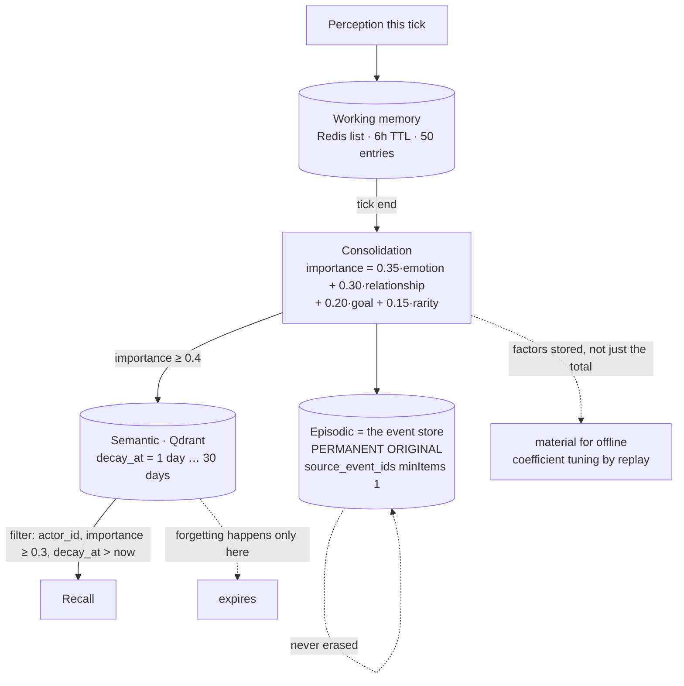

## 1. Executive Summary

LivingFeed is a multi-actor social simulation — actors with emotions, goals and
relationships posting to a feed, driven by a tick loop and a director — in a
pnpm monorepo with about 19,200 lines of Python in `engine/` and 50,000 across
the repository. MIT-licensed. **Its documentation and code comments are in
Korean**, and the terms quoted below are the reviewer's translations with the
originals given where they matter. It is the second such system in this atlas
after [GenericAgent](../genericagent/), and like that one its design rules are
numbered and cited.

The memory design is a three-layer fabric, and the layer boundaries are where
the interesting decisions are:

- **Working** (`memory.py`, 44 lines) — a Redis list per `(world_id, actor_id)`,
  six-hour TTL, capped at 50 entries, most-recent-first.
- **Episodic** — the event store itself. The schema for
  `actor.memory.consolidated` states it directly: *"the event store is the
  permanent original of the Episodic layer"*.
- **Semantic** — Qdrant, embedded only when importance clears a gate, and
  documented as *"forgetting happens only in Semantic; the original is not
  erased"* (망각은 Semantic에서만 일어나고 원본은 남는다).

That last sentence is the atlas's second divergence — whether evidence outlives
its derivations — written as a schema-level rule rather than discovered in the
code. Forgetting is real and it is confined to the index.

**The mechanism worth the visit is what consolidation stores about itself.**
Importance is `0.35·emotion + 0.30·relationship + 0.20·goal + 0.15·rarity`, and
the event carries not only the total but a required `factors` object holding all
four components, described as *"the material for coefficient tuning (offline
replay evaluation)"*. This atlas has recorded the opposite twice: [Generative
Agents](../generative-agents/) ships `gw = [0.5, 3, 2]` as hand-tuned constants
with no committed ablation, and [MemoryOS](../memoryos/) leaves its promotion
coefficients at 1, 1 and 1 with nothing measuring them. LivingFeed is the first
system here that stores the *decomposition* specifically so the weights can be
re-derived from replay rather than defended.

`source_event_ids` is `minItems: 1` — mandatory provenance from every memory back
to the events that produced it, with the rule cited inline: *"any memory is
audit-traceable (ADR-008 rule 4)"*.

## 2. Mental Model

A perception enters working memory as a sentence. At tick end, consolidation
folds the tick's material into one episode and scores it. Above the gate it is
embedded into the semantic index with a `decay_at`; below it, it exists only as
the event that produced it. Recall reads the semantic index, filtered to the
actor and to points that have not yet expired.

So a memory's life is: *event* (permanent) → *episode* (permanent, in the event
store) → *semantic point* (expiring). Nothing is ever updated and nothing is
deleted; things stop being *findable*. There are no trust states and no
corrections — an actor cannot be told it was wrong, only allowed to forget.

The forgetting curve is one line: `decay_at = now + DECAY_MIN_S +
(DECAY_MAX_S - DECAY_MIN_S) * importance`, one day at importance zero and thirty
at importance one. The importance score therefore does two jobs — it decides
whether a memory is indexed at all, and how long it survives — and both are
tunable from the stored factors.

One asymmetry is deliberate and documented: `RECALL_MIN_IMPORTANCE = 0.3` sits
below the consolidation gate of 0.4, so recall will return things the gate would
not have admitted today. A threshold that moved should not orphan what it
already wrote.

## 3. Architecture

Redis, Qdrant, an event store, and the tick services. `engine/` splits into
`actor`, `director`, `emotion`, `feed`, `goal`, `relationship` and `tick`;
`packages/` holds `eventstore`, `schemas`, `api-client` and `ui`, with JSON
Schema as the source of truth and both Python and TypeScript types generated
from it.

**The embedding decision is an operational one worth naming.** `semantic.py`
uses a deterministic hash n-gram vector at 256 dimensions rather than a model,
explicitly *"so that real similarity search works in dev/CI and replays
reproduce"*, with model embeddings deferred to a later provider stage behind the
same interface. Several systems in this atlas cannot be tested without an API
key; this one made the embedding substitutable so that the harness runs
everywhere and the replay is deterministic.

## 4. Essential Implementation Paths

- `engine/actor/src/lf_actor/phases.py` (1,707) — the tick phases.
- `engine/actor/src/lf_actor/consolidation.py` — episode folding, action labels,
  perception sentences.
- `engine/actor/src/lf_actor/semantic.py` — embedding, `decay_at`, scoped recall.
- `engine/actor/src/lf_actor/memory.py` (44) — working memory.
- `engine/actor/src/lf_actor/reflection.py` (234) and `relationship.py` (307).
- `packages/schemas/events/actor.memory.consolidated.schema.json` — the unit.

## 5. Memory Data Model

The consolidated episode: `summary` (1–500 characters), `importance` (0–1),
`factors` (emotion, relationship, goal, rarity — all four required, no
additional properties), `source_event_ids` (at least one, ULID-patterned), and
`tags` constrained to `^[a-z_]+$`.

Two details show the same instinct. Actions are stored with a Korean label —
work, rest, observe, speak, confront, confess, sever — because *"we do not leave
machine vocabulary in a diary"*, with the raw `action_kind` kept only as a tag
for search and aggregation. And perception sentences name actors by name rather
than id where names are available, so *"a memory remains as a person, not an
id"*. The unknown-kind path falls back to the raw string for forward
compatibility, since `action_kind` is an open vocabulary in the schema.

There is no validity time — every timestamp is record time — and no status
field.

## 6. Retrieval Mechanics

`recall` posts a vector search to `lf_semantic_{world_id}` with a `must` filter
of three clauses: `actor_id` matches, `importance >= min_importance`, and
`decay_at > now`. Scope is therefore enforced twice — a collection per world and
a filter per actor — and expiry is a query predicate rather than a sweeper, so
a forgotten memory needs no job to disappear.

Working memory is a plain `LRANGE` of the most recent entries.

There is no fusion, no lexical lane, no reranking, and no relevance measurement.

## 7. Write Mechanics

Consolidation runs at tick end and is synchronous with the tick, not with a user
request. Summaries are **template-first**, with LLM summarisation reserved for
high-importance episodes (ADR-008 rule 2) — so the common path costs nothing and
the model is spent only where the score says it matters.

Nothing rewrites the store. The semantic index gains points and lets them
expire; the event store only appends.

## 8. Agent Integration

Memory is internal to the actor service. There is no external memory API, no MCP
surface and no tool the actors call — remembering is something the tick does to
them, which is the [Generative Agents](../generative-agents/) lineage rather
than the tool-calling one.

## 9. Reliability, Safety, and Trust

`scope_enforced` is earned on the read path twice over, as above.

**No tombstone, no trust state, no bi-temporality, no human review.** The design
has no concept of a memory being wrong — only of it mattering less, which is a
coherent position for a simulation and would not be for an assistant.

**No audit-log mark, and the near-miss is unusual.** Every consolidated memory
carries mandatory `source_event_ids` back to the events that produced it, and the
event store is append-only — so provenance is complete in the direction that
matters for rebuilding. What is absent is a record of memory *mutations*, because
there are none: nothing is ever updated or deleted, so there is nothing for a
mutation log to hold. The column is withheld on a technicality that is really a
design property.

**The risk is a swallowed failure.** `recall` wraps its Qdrant call in a bare
`except Exception`, logs *"recall failed (bypassing with empty recall)"*
(회상 실패(빈 회상으로 우회)), and returns `[]`. An unreachable or misconfigured
index therefore produces an actor with no memories rather than an error, and the
tick continues. In a simulation that degrades gracefully; it also means a total
memory outage looks exactly like a world where nothing memorable happened, and
nothing upstream distinguishes them.

## 10. Tests, Evals, and Benchmarks

429 test functions across 40 files under `engine/`, none run here, including
`test_memory_integration.py`, `test_semantic.py`, `test_phases.py` and
integration suites for emotion, goal and relationship. That the deterministic
embedder makes real similarity assertions possible in CI is what lets those
tests be about behaviour rather than about mocks.

No negative retrieval assertion was found, and no memory benchmark or
retrieval-quality measurement exists. The importance coefficients are declared
as configuration to be tuned by offline replay evaluation; **no such evaluation
is committed**, so the apparatus for the tuning is present and the tuning is not
— which is a much better position than the systems that hard-code the weights,
and still short of the ablation the design describes.

## 11. For Your Own Build

### Steal

- **Store the components of a composite score, not just the total.** Four floats
  per memory turns "why is this weighted 0.35" from an argument into a
  regression you can run over replayed history. This is the cheapest answer to
  the hand-tuned-constants problem that runs through this whole atlas.
- **Confine forgetting to the derived layer.** Expiry on the index, permanence
  in the event store, stated as a rule rather than left to be inferred. Recall
  gets narrower and nothing is destroyed.
- **Make expiry a query predicate.** `decay_at > now` in the filter needs no
  sweeper, no job, and no window where an expired memory is still returned.
- **Set the recall floor below the write gate.** A threshold you raise later
  should not strand what it already admitted.
- **Use a deterministic embedder in dev and CI.** Hash n-grams give you real
  similarity search with no key and reproducible replays, behind the interface
  the real model will use.
- **Write the human label, keep the machine one as a tag.** A memory that reads
  as a diary entry and carries `action_kind` for aggregation serves both readers.

### Avoid

- **Returning `[]` on a retrieval failure.** An amnesiac actor and a quiet world
  are indistinguishable to everything upstream. Degrade if you must, but say so
  in a signal something can count.
- **A memory model with no way to be wrong.** Correct for a simulation, and the
  first thing to add if these actors ever talk to a real user about facts.

### Fit

Read this if you are building a simulation, a companion, or anything where
memory should fade rather than be corrected — it is the most carefully reasoned
member of the Generative Agents lineage in this atlas, and the ADR-numbered
rules cited from the code make the design legible in a way the original's
hand-tuned constants are not.

Do not take it as a factual memory layer. There is no correction path, no trust
state and no deletion by identity, and the Korean-language documentation means
the design rationale is only partly accessible to a non-Korean-reading team —
the code is legible, the *reasons* are in the comments.

## 12. Open Questions

- **Has the replay tuning ever been run?** The factors are stored for it and no
  evaluation is committed. It is the one measurable claim this design makes.
- **What is the recall failure rate in practice?** The swallowed exception means
  the answer is a log line rather than a metric.
- **How do the two thresholds interact over a long world?** A 0.4 write gate and
  a 0.3 recall floor with a one-to-thirty-day decay curve implies a steady-state
  index size nobody has computed here.
- **Do the relationship and reflection modules write memory?** Both were read
  only far enough to place them; neither was traced into the memory path.

## Appendix: File Index

| Path | Lines | What it holds |
| --- | --- | --- |
| `engine/actor/src/lf_actor/phases.py` | 1,707 | Tick phases |
| `engine/actor/src/lf_actor/context.py` | 321 | Actor context assembly |
| `engine/actor/src/lf_actor/relationship.py` | 307 | Relationship state |
| `engine/actor/src/lf_actor/reflection.py` | 234 | Reflection pass |
| `engine/actor/src/lf_actor/semantic.py` | — | Embedding, `decay_at`, scoped recall |
| `engine/actor/src/lf_actor/consolidation.py` | — | Episode folding and importance |
| `engine/actor/src/lf_actor/memory.py` | 44 | Redis working memory |
| `packages/schemas/events/actor.memory.consolidated.schema.json` | — | The unit and its rules |
| `engine/**/tests` | 429 tests | Memory, semantic, phases, integration |

## History

**2026-07-30** — [`9bdd464d570a493ba9125636f4cf01b6cff78bae`](https://github.com/showjihyun/livingfeed/commit/9bdd464d570a493ba9125636f4cf01b6cff78bae) — first reading.
