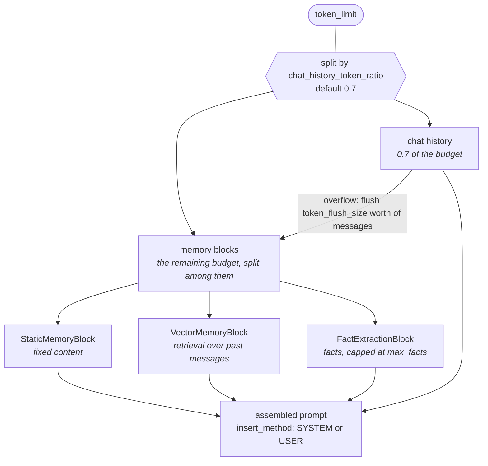
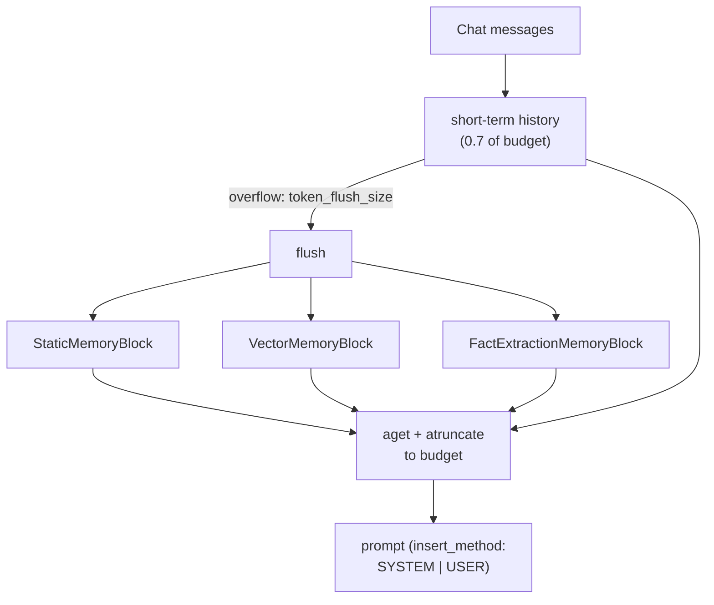

## 1. Executive Summary

LlamaIndex is one of the two Python agent frameworks most teams actually evaluate; the atlas already covers the other's memory layer as [langmem](../langmem/). Its `llama-index-core/llama_index/core/memory/` is about 2,350 lines, and it clears this atlas's scope bar where [BeeAI](../../compare/) does not: `FactExtractionMemoryBlock` extracts durable facts that survive the conversation, rather than only deciding which messages stay in the window.

The architecture is a **single token budget split between two tiers, with flow between them**:

```python
Memory(
    token_limit,                      # total budget
    chat_history_token_ratio = 0.7,   # share reserved for short-term history
    token_flush_size,                 # how much spills to long-term at a time
    insert_method = SYSTEM | USER,    # where blocks land in the prompt
)
```

Short-term chat history gets 70% of the budget by default. When it overflows, `token_flush_size` worth of messages are flushed **into the memory blocks**, which own the remaining share. Long-term memory is therefore fed by short-term pressure rather than by a separate capture path — the two tiers are one pipeline, not two systems.

Blocks are the composable part. `BaseMemoryBlock` is generic over its content type and declares three operations: `aget` (contribute to context), `aput` (receive flushed messages), and — the interesting one — **`atruncate(content, tokens_to_truncate)`**, so each block knows how to shrink *itself* when the budget is tight. An orchestrator that truncates blindly cuts wherever the string ends; a block that truncates itself can drop its least valuable content. Very little else in the atlas pushes budget enforcement down to the component that understands the content.

Three blocks ship: `StaticMemoryBlock` (fixed content), `VectorMemoryBlock` (retrieval over past messages), and `FactExtractionMemoryBlock` (LLM-extracted facts with a `max_facts` cap).

The reservation is the familiar framework one: these are primitives, and memory *policy* is left to the application. There is no trust state, no provenance, no correction path, and no scope key — the same limitation the atlas records for langmem.

## 2. Mental Model



The arrow from chat history into the blocks is the design. One budget is divided
by ratio, and messages evicted from the conversation half are **handed to the
blocks rather than discarded** — so a block is not a separate store beside the
history, it is where the history goes when it no longer fits.

Block interface:

```python
class BaseMemoryBlock(BaseModel, Generic[T]):
    async def aget(...) -> T                 # contribute content
    async def aput(messages) -> None         # receive flushed messages
    async def atruncate(content: T, tokens_to_truncate: int) -> Optional[T]
```

Returning `Optional[T]` from `atruncate` matters: a block may decline to shrink and be dropped entirely rather than emit something misleading when cut in half.

## 3. Architecture

- `memory/memory.py` (870 lines) — `Memory`, `BaseMemoryBlock`, `InsertMethod`, budget arithmetic.
- `memory/memory_blocks/` — `static.py` (39), `fact.py` (182), `vector.py` (201).
- Legacy surfaces retained: `chat_memory_buffer.py` (168), `chat_summary_memory_buffer.py` (340), `vector_memory.py` (206), `simple_composable_memory.py` (163).
- `memory/types.py` (152) — base types.

The legacy modules are the conversation-window family the atlas excludes from scope; the newer `Memory` plus blocks is what makes LlamaIndex reviewable here. Both ship, which is worth knowing when reading the docs — "memory" in LlamaIndex means two quite different things depending on which API you land on.



## 4. Essential Implementation Paths

### Budget arithmetic with guards

Validation clamps the configuration rather than trusting it: if `token_flush_size` is unset or exceeds `token_limit`, it is reset to 10% of the limit; a separate path resets it to 70% if it arrives larger than the limit through the constructor. Defensive, and the kind of thing that prevents a misconfigured flush from evacuating the entire history in one step.

### Self-truncating blocks

`atruncate(content, tokens_to_truncate)` is the design's best idea. When the assembled context exceeds budget, each block is asked to give back a specific number of tokens and decides how. A vector block can drop its lowest-scoring result; a fact block can drop its least important fact; a static block can decline and be omitted.

Compare how the rest of the atlas handles this. [Hermes Agent](../hermes-agent/) refuses the write and makes the model consolidate. [Voyager](../voyager/) concatenates its entire skill library with no budget at all. [GenericAgent](../genericagent/) caps its index at thirty lines by policy. LlamaIndex is the only one that delegates the *how* of shrinking to the component holding the content.

### Fact extraction and condensation

`FactExtractionMemoryBlock` runs two prompts. The extract prompt receives `existing_facts` and is told not to duplicate them, so extraction is incremental. When the count passes `max_facts`, the condense prompt runs — and its instruction is unusually careful:

> "The condensed list you return completely replaces the existing facts, so it must be the full, self-contained snapshot of everything worth keeping — not just newly added or changed facts."

That sentence exists because the obvious failure is a model returning a delta where a replacement was expected, silently deleting everything it did not mention. LlamaIndex addresses it by making the contract explicit in the prompt. [ByteRover](../byterover/) addresses the same failure by diffing before and after and merging back what would be lost — a guard rather than an instruction. The prompt is cheaper; the diff is verifiable.

The extract prompt also carries an epistemic constraint: *"Do not include opinions, summaries, or interpretations — only extract explicit information."* That is the same instinct as [GenericAgent](../genericagent/)'s action-verified axiom, at much lower strength — an instruction against inference rather than a requirement of evidence.

### Insert method

`InsertMethod.SYSTEM` or `USER` determines whether block content lands in the system prompt or as a user message. This matters more than it looks: system-prompt placement is stable and cache-friendly (the concern driving [Hermes Agent](../hermes-agent/)'s frozen snapshot), while user-message placement is fresher but breaks the prefix. LlamaIndex exposes the trade as a setting rather than choosing for you.

## 5. Memory Data Model

There is no memory record. A block owns whatever representation it likes — `BaseMemoryBlock` is generic over `T` — so facts are a string, vectors are retrieved nodes, static content is fixed text.

The consequences are the ones the atlas records for every framework primitive layer:

- **No status, confidence, or verification.** An extracted fact is a line in a list.
- **No provenance.** A fact does not record the messages it came from, even though those messages were in hand at extraction time.
- **No correction.** Facts change only by condensation rewriting the whole list.
- **No scope.** Multi-user or multi-project separation is the application's problem.
- **No tombstone**, so a fact a user removed will be re-extracted from the same conversation.

That is a reasonable position for a framework — [langmem](../langmem/) makes the same choice — but it means "LlamaIndex has memory" and "LlamaIndex has a memory system" are different claims.

## 6. Retrieval Mechanics

`VectorMemoryBlock` retrieves over past messages using the framework's vector-store abstractions, so any LlamaIndex-supported backend applies. There is no fusion with a lexical arm inside the block, and no reranking in the memory layer — both available elsewhere in the framework, neither wired in by default.

Because blocks compose, hybrid behaviour is achievable by stacking blocks rather than by fusing scores inside one retriever. That is a different composition model from the weighted-fusion approach most of the atlas uses, and it has a real property: each block's contribution to the final context is separately visible and separately budgeted, which makes the assembled prompt easier to reason about than a single fused ranking.

## 7. Write Mechanics

The only write path into long-term memory is the flush from short-term history. There is no explicit "remember this" surface at the `Memory` level and no actor model — whatever survives the flush is what the blocks see, and each block decides independently what to keep from it.

Coupling long-term capture to short-term overflow is elegant but has a consequence worth stating: **a short conversation never writes long-term memory at all.** If history never exceeds its share of the budget, nothing flushes, and the fact block never runs. Memory formation depends on conversation length rather than on content importance.

## 8. Agent Integration

`Memory` plugs into LlamaIndex agents and workflows. Custom blocks are the extension point — subclass `BaseMemoryBlock`, implement three async methods, add it to the list. That is a genuinely low-friction way to add a memory kind, and lower-friction than any provider contract in the atlas.

## 9. Reliability, Safety, and Trust

Strengths:

- **One budget, explicitly split**, rather than two subsystems with independent limits.
- **Self-truncating blocks**, delegating shrinkage to the component that understands the content.
- **Configuration clamping** on flush size.
- **An explicit full-replacement contract** in the condense prompt.
- **An anti-inference instruction** in the extract prompt.
- **Insert placement as a setting**, exposing the cache-versus-freshness trade.
- **Composable blocks** whose contributions stay separately visible.

Gaps:

- **No trust, provenance, correction, or scope** — application-owned by design.
- **No tombstone**, so removed facts return.
- **Write depends on conversation length**, not importance.
- **Condensation is a wholesale rewrite** guarded by prompt wording rather than verification.
- **Two coexisting "memory" APIs**, one of which is conversation-window management, which invites confusion about what the framework actually provides.

## 10. Tests, Evals, and Benchmarks

Tests accompany the core memory modules; nothing was run for this review, and no memory-quality benchmark was found. For a framework this widely deployed, the absent measurement is whether the default `chat_history_token_ratio` of 0.7 is a good split — it silently determines how much of every prompt is recent conversation versus durable memory, and no evidence for it appears in the repository.

## 11. For Your Own Build

### Steal

- **Self-truncating components.** Ask each contributor to give back N tokens and let it choose how, instead of cutting the assembled string. Allowing a component to decline and be dropped is the right escape hatch.
- **One budget with an explicit split**, rather than independent caps per subsystem that can jointly overflow.
- **Overflow as the capture trigger.** Coupling long-term writes to short-term pressure keeps the two tiers in one pipeline — provided you accept that quiet conversations write nothing.
- **State the replacement contract in the prompt.** If a condensation pass replaces rather than appends, say so in the instruction; the default model behaviour is to return a delta.
- **Expose insert placement**, since system-prompt versus user-message placement is a real cache-versus-freshness decision.
- **A three-method block interface** as an extension point — get, put, truncate is close to the minimum viable memory component contract.

### Avoid

- **Extraction with no provenance**, when the source messages were available at extraction time.
- **No tombstone** under automatic re-extraction.
- **Memory formation gated by conversation length.**
- **Wholesale condensation** without a loss check.
- **Two APIs sharing the word "memory"** with very different guarantees.

### Fit

Borrow:

- The `atruncate` contract and the budget split — both are small, general, and better than what most systems here do.
- The block interface as the shape of a pluggable memory component.
- The explicit full-replacement wording in any condensation prompt.

Do not copy:

- The absence of provenance, if you will ever need to explain a fact.
- Overflow-triggered capture as the only write path.
- Condensation without a structural-loss guard, if facts matter.

## 12. Open Questions

- Is `chat_history_token_ratio = 0.7` right? It shapes every prompt and is undefended.
- Should facts carry the message ids they were extracted from? The information is present at extraction and discarded.
- What happens to a user-corrected fact when the next condensation runs?
- Should a short conversation be able to write long-term memory without an overflow?
- How do multiple blocks divide the long-term budget among themselves when several want more room?

## Appendix: File Index

- Core: `llama-index-core/llama_index/core/memory/memory.py` (`Memory`, `BaseMemoryBlock`, `InsertMethod`).
- Blocks: `memory/memory_blocks/static.py`, `fact.py` (`FactExtractionMemoryBlock`, extract and condense prompts), `vector.py`.
- Types: `memory/types.py`.
- Legacy window-management APIs: `memory/chat_memory_buffer.py`, `chat_summary_memory_buffer.py`, `vector_memory.py`, `simple_composable_memory.py`.
