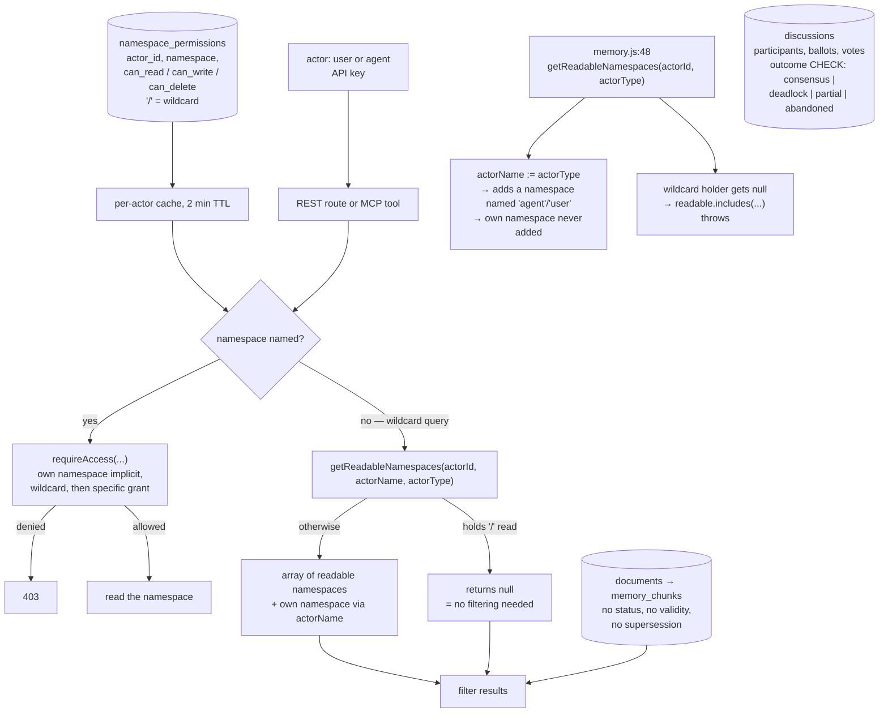

## 1. Executive Summary

LLM Memory is a self-hosted memory and multi-agent collaboration service: a
PostgreSQL schema of 2,024 lines behind a Node API, an MCP server, a REST API
and a web UI with a notes tree, presented as working with Claude Code,
claude.ai, Cursor, Windsurf and any MCP client. MIT, 1,185 commits since 20
February 2026, 42,805 lines of JavaScript and Go outside `node_modules` against
15 test files.

What it attempts that few here do is **deliberation**. The schema carries
`discussions` with `participants`, `ballots` and `votes`, a `mode` constrained
to `realtime` or `async`, a `status` constrained to five values, and an
`outcome` constrained to `consensus`, `deadlock`, `partial` or `abandoned`.
Agents do not merely share a store; they can be made to argue toward a recorded
conclusion, and the conclusion's shape is enforced by a database `CHECK`. That
is a real idea, and the rest of this report should not obscure it.

The memory model underneath is simpler than the collaboration model above it. A
memory is a markdown document in a namespace, chunked for indexing. There is no
status on it, no validity window, no supersession link and no record of a
rejected value — correction is replacing the file and running a cleanup that
takes the caller's list of valid source files as truth.

Access control is the interesting mechanism, and it is where the reading turns.
`namespace_permissions` gives each actor a row per namespace with separate
`can_read`, `can_write` and `can_delete` flags, with `/` as a wildcard. The
service exposes two shapes: `requireAccess`, which throws a 403 for a named
namespace, and `getReadableNamespaces`, which returns the list a wildcard query
should be filtered to — **or `null`, meaning the actor holds the wildcard and
no filtering is needed**.

That `null` is the hinge. Eight call sites use the function. Seven pass
`(actorId, actorName, actorType)`. One —
`node/api/src/routes/memory.js:48`, the ingest-status listing — passes
`(actor.actorId, actor.actorType)`, two arguments where three are expected.
The consequences are all visible in the function body:

- `actorName` receives the *type* string, so the implicit grant
  `if (actorName && !namespaces.includes(actorName)) namespaces.push(actorName)`
  adds a namespace named after the actor's type rather than the actor. Any
  namespace actually called `agent` or `user` becomes readable on that endpoint
  to every actor of that type.
- The caller's own namespace is therefore never added, so their own files are
  filtered out of their own listing.
- And the next line is `readable.includes(f.namespace)`. For an actor holding
  the wildcard, `getReadableNamespaces` returns `null`, and `null.includes` is
  a `TypeError` — a 500 where the answer should have been "everything".

Two lines above, the same file calls `requireAccess` with all three arguments
correctly, and thirty lines below, the search route calls
`getReadableNamespaces` correctly. It is one line.

The reason it is still there is the second finding: **nothing tests the
permission service**. The 15 test files cover agents, simulations, the memory
service, cleanup, the chunker, dream consolidation and four provider adapters.
`namespace-permissions.js` has no test, so the arity is checked by nobody, and
`scope_enforced` is withheld — the atlas requires a producer test on the fence,
and this fence has none.

A third thing to know before deploying: permissions are cached per actor for
two minutes. A revocation is not effective until the cache expires, unless an
admin route clears it — which the admin write paths do call, so the exposure is
bounded to out-of-band changes.

No marks.

## 2. Mental Model

An **actor** is a user or an agent, with API keys and permissions.

A **namespace** is a string; an actor's permissions are rows keyed to it, with
`/` meaning all. The namespace named after the actor is implicitly theirs.

A **document** is markdown in a namespace, chunked into `memory_chunks`.

A **note** has its own sharing, with specific actors or all actors, which the
code says "[c]omplements namespace_permissions".

A **discussion** is a deliberation: participants, ballots, votes, a mode, a
timeout, and an outcome from four.

## 3. Architecture

| Area | Role |
| --- | --- |
| `schema.sql`, `migrations/` | The Postgres model — the fastest way to see what is stored |
| `node/api/src/services/namespace-permissions.js` | The fence: `hasAccess`, `requireAccess`, `getReadableNamespaces`, the cache |
| `node/api/src/services/note-permissions.js` | Per-note sharing, complementing namespaces |
| `node/api/src/routes/memory.js`, `documents.js`, `mcp.js`, `admin.js` | The read and write surfaces |
| `node/api/src/services/` | Chunker, embeddings, enrichment, cleanup, dream, discussion |
| `go/`, `node/client/` | Client-side pieces including the discussion launcher |
| `install.sh`, `deploy.sh`, `infrastructure/` | Self-hosting |

## 4. Essential Implementation Paths

- `node/api/src/services/namespace-permissions.js:42-104` — the whole fence,
  including the `null` convention and both implicit grants.
- `node/api/src/routes/memory.js:40-54` — the correct `requireAccess` call and
  the incorrect `getReadableNamespaces` call, eight lines apart.
- `node/api/src/routes/memory.js:76-81` — the same function called correctly.
- `schema.sql:476-491` — discussions and their constrained outcomes.
- `schema.sql:648-656` — the permission row.

## 5. Memory Data Model

Documents and chunks, with chat messages, notes, mail and discussions beside
them. What is absent is the vocabulary this atlas asks about: no status, no
trust level, no validity interval, no supersession edge, no record of a deleted
value. A memory is a file; correcting it is editing the file; forgetting it is
`cleanup` against a caller-supplied list of what is still valid.

## 6. Retrieval Mechanics

Search is by meaning and keyword over chunks. A named namespace is checked with
`requireAccess`; a wildcard query is narrowed with `getReadableNamespaces` and
the filter is pushed into the query on the search path — which is the right
shape, and is the call site that passes all three arguments.

## 7. Write Mechanics

Writes go through `requireAccess` with `'write'`, and deletes with `'delete'` —
the three-way split is better than the read/write binary most systems here use.
Admin routes rewrite an actor's permissions wholesale (`DELETE` then re-insert)
and clear the cache afterwards.

## 8. Agent Integration

An MCP server alongside the REST API, per-agent API keys, agent configuration
and permission tables, and a discussion launcher on the client side. The
multi-agent story — several agents in one store, able to convene — is the
product's centre of gravity.

## 9. Reliability, Safety, and Trust

The three findings above are the substance, and their common cause is worth
stating plainly rather than as three separate defects: the permission service
is the security boundary of a multi-tenant memory, and it has no test. An arity
mistake at one of eight call sites is exactly the class of error a single
unit test over `getReadableNamespaces` would catch, and the same absence is why
the `null`-means-wildcard convention is unsafe here in a way it would not be if
the contract were pinned.

The convention itself is the deeper issue. A function that returns `null` for
"everything" and an array for "these" asks every caller to handle two shapes,
and a caller that forgets gets a crash in the best case and an inverted rule in
the worst. Systems in this corpus that got this right made the permissive case
impossible to express: a fence that always returns a filter, never an absence.

The two-minute permission cache is a smaller matter because the admin write
paths clear it, but it means a permission changed outside those paths — direct
SQL, another process — stays stale for that long.

## 10. Tests, Evals, and Benchmarks

15 test files: agents, sims, soul and conversation distillation, the memory
service, cleanup, chunker, dream and dream-shared-cron, virtual-agent rate
limiting, and four provider adapters. Nothing covers namespaces, permissions,
visibility or the MCP authorisation path. There is no eval suite and no
must-not retrieval assertion, so `negative_eval` is withheld along with
`scope_enforced`.

## 11. For Your Own Build

### Steal

- **Split read, write and delete into three flags.** Most permission models in
  this corpus collapse to read/write, and deletion is the one that cannot be
  undone.
- **Constrain the outcome of a deliberation in the schema.** `consensus`,
  `deadlock`, `partial`, `abandoned` as a `CHECK` means an unresolved
  discussion cannot be quietly recorded as agreement.
- **Keep note-level sharing beside namespace-level permission**, and say in the
  code which complements which — the comment at the top of
  `note-permissions.js` does exactly that.

### Avoid

- **A permission helper that returns `null` for "allow everything".** Every
  caller must then remember two shapes; here one forgot, and the failure is a
  crash for the most privileged caller.
- **Shipping the fence untested.** The arity slip is trivial to make and
  trivial to catch; only one of those is true without a test.

### Fit

Reach for this if multi-agent deliberation with recorded outcomes is what you
need and you will review the permission paths yourself. Look elsewhere if you
need memory that models belief, validity or correction, or a fence with tests
behind it.

## 12. Open Questions

- Is `memory.js:48` intended to pass `actorName`? The two lines around it
  suggest yes, and the fix is one argument.
- Should `getReadableNamespaces` return a sentinel rather than `null` — or
  always an array, with the wildcard expanded — so no caller can crash on the
  permissive case?
- The discussion machinery is the distinctive part. Are its outcomes read back
  into memory as claims, or do they stay in the discussion tables?

## Appendix: File Index

| Path | What to read it for |
| --- | --- |
| `schema.sql` | Every table, including discussions and their `CHECK`s |
| `node/api/src/services/namespace-permissions.js` | The fence and its two shapes |
| `node/api/src/routes/memory.js` | The correct and incorrect calls, eight lines apart |
| `node/api/src/services/note-permissions.js` | Per-note sharing |
| `node/api/src/services/discussion.js` | Deliberation |

## History

**2026-09-16** — [`630843156595138031f13f1b559de541ad37aa97`](https://github.com/jeffdafoe/llm-memory-api/commit/630843156595138031f13f1b559de541ad37aa97) — first reading, at a commit dated 15 September 2026. Screened before opening, from a shallow clone: six files, no auto-run surfaces, no build-time execution points, one unpinned surface, three dependency files inside the cooldown, and `CLAUDE.md` read as data. Nothing was installed, built or run.
