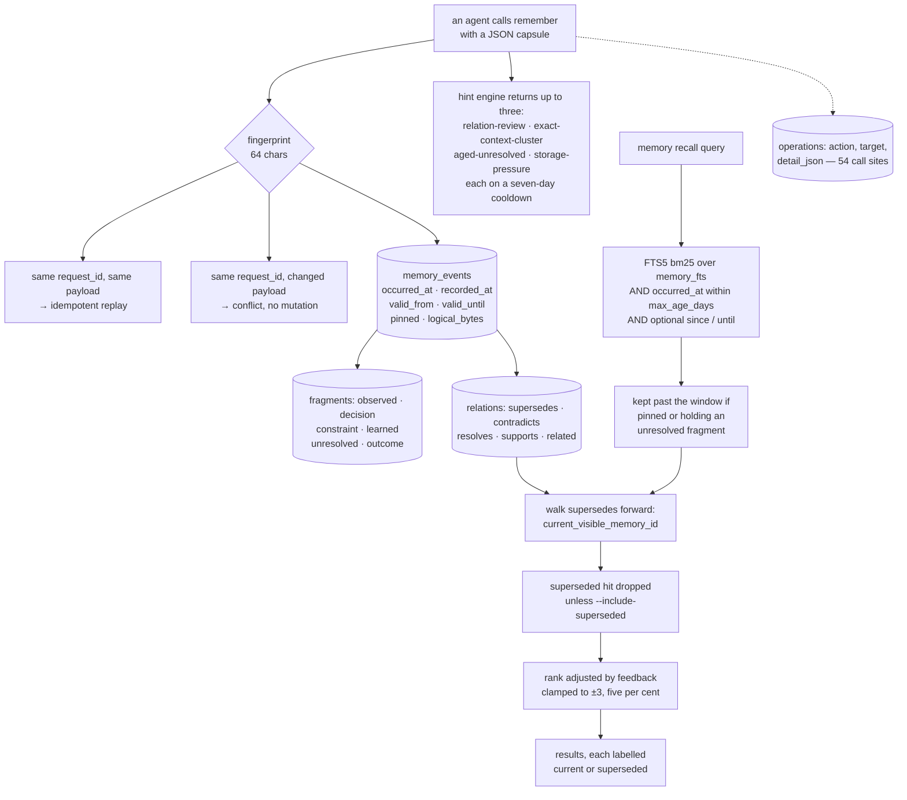

## 1. Executive Summary

LWC is two stores wearing one CLI. The visible one is a source-grounded wiki an
agent curates — pages with cited sources, `[[slug]]` links, and a typed relation
graph. The one that earns the marks is underneath it: a temporal memory of
fingerprinted event capsules with typed fragments, an FTS5 recall bounded by
event time, supersession resolved at read time, retention with protection, and a
hint engine that tells the agent what needs reviewing.

Apache-2.0; 294 commits between 29 July and 5 September 2026 from two authors —
about six weeks — for 123,311 lines of Rust across 139 files, with 868 test
attributes. Published on npm and crates.io with READMEs in seven languages. The
screen found no auto-run surface, three manifests inside the seven-day cooldown,
one build-time execution path and one unpinned dependency surface; nothing was
installed, built or run.

**Recall hands back the replacement.** A lexical hit on a memory event is not
returned directly. `current_visible_memory_id` walks the `supersedes` edges
forward from the hit to the newest event that replaced it, and the recall loop
keeps the original only if the caller passed `--include-superseded`. Every result
is stamped `current` or `superseded`, and a hit reached through the chain is
labelled `matched_via: "superseded_event"` so a reader can see the redirect
happened. That is a discrete status deciding what may be treated as true, and it
earns `trust_state` — the status is derived per call, but the `supersedes` rows
are durable and indexed on their target, so replaced events are queryable rather
than replayable, which is the line the corpus draws.

**Event time is the axis, and record time is only a tiebreak.** `occurred_at`
and `recorded_at` are separate non-null columns, and every read — recall,
supersession resolution, retention, eviction — filters on `occurred_at` with a
configured age window and optional `since` and `until` bounds that are normalised
through SQLite and rejected if inverted. `bitemporal` is earned on that, with two
limits stated: `recorded_at` never appears in a predicate, so there is no
as-of-record-time question; and `valid_from`/`valid_until` — the explicit
validity interval — are written, cross-validated so the start is not later than
the end, and returned by `memory_show`, and appear in no `WHERE` in the tree.
The interval is a column; the mark rests on the pair that is queried.

**Forgetting protects the unfinished.** Age and capacity eviction both skip an
event that is pinned *or* that carries a fragment of kind `unresolved`. Marking
something as an open question is therefore also a retention decision, which is a
better default than most decay schemes manage: the things you have not settled
are the last things dropped.

**Supersession is tested from both directions.** A committed case stores three
events, recalls a term matching the superseded one, and asserts exactly one
result which is the replacement; then re-runs with the override and asserts
exactly three with the old one marked `superseded`; then recalls an unrelated
term and asserts exactly one. The exclusion is proved against a populated
result with the positive controls beside it, which earns `negative_eval`.

**The wiki's provenance ladder is the good idea that stayed inert.**
`PROVENANCE_ORDER` runs `source-grounded`, `user-provided`, `agent-observed`,
`hypothesis`; an unrecognised value is rejected rather than defaulted; and the
value is attached to every search result. No read path filters on it. A page
whose only provenance is `hypothesis` ranks beside a cited one, and the
distinction reaches a reader only if the reader acts on the label.

## 2. Mental Model

Think of it as a notebook and a logbook sharing a drawer.

The **notebook** is the wiki. A page is a claim with citations: the agent writes
it, attaches the immutable sources supporting it, and where there is no source
declares what kind of claim it is instead. Pages link to each other twice —
untyped `[[slug]]` wikilinks, and typed semantic edges that cannot exist without
a reason and a bounded confidence. A lint flags any page with neither a cited
source nor an explicit provenance as `uncited_page`.

The **logbook** is the temporal memory. The agent hands over a capsule: a type, a
context, when it happened, and fragments sorted into what was observed, what was
decided, what constrains, what was learned, what stays unresolved, and what came
out. It can carry evidence with excerpts, changes with before and after values,
and relations to earlier events. The capsule is fingerprinted, so replaying it is
idempotent; a replay under the same `request_id` with a *different* payload
conflicts instead of overwriting.

Correction in the logbook is not editing. A new event points `supersedes` at the
old one, and from then on recall answers with the new one. The old event is still
there, still searchable behind a flag, still marked for what it is. Deletion
happens only through retention, and retention refuses to touch what is pinned or
still unresolved.

The gap runs between the two halves. The notebook has the richer vocabulary for
doubt — four provenance values, confidence on every edge, a lint for ungrounded
pages — and does nothing with it at read time. The logbook has the thinner
vocabulary and enforces it.



## 3. Architecture

One Rust crate, 123,311 lines across 139 files: `agent/`, `artifacts/` (the page
and source types and their normalisation), `store/` (schema and migrations,
content search, graph ingest and search, checkpoints, changeset restore, sync
publish, temporal memory), `codegraph/`, `learning/`, `view/`, `work/`, plus
`mcp.rs`, `scope.rs`, `secret_scan.rs`, `source_diff.rs`, `sync_git.rs` and
`office.rs`.

Storage is SQLite behind a versioned migration chain — the temporal memory
arrives as its own schema version, migrating transactionally from the tags
version and refusing any other. The scope decision happens before the
connection: `Scope::Project` resolves to `<project>/.lwc/wiki.db`,
`Scope::Global` to a home-directory path, `Scope::All` to both, read-only.

The memory layer is off by default in the sense that it is `Inherit` until a
scope sets `enabled`, with a maximum age of 365 days and a byte budget of 256
mebibytes; `memory feedback` on a disabled scope returns `memory_disabled`
rather than silently succeeding.

`secret_scan.rs` is wired into two paths — `config.rs` when a translation
argument is handled, and `cli/helpers.rs` when file content is read — through
`detect_possible_secret_reasons(path, content)`, which returns reasons rather
than a boolean. A knowledge base an agent fills from a codebase will eventually
ingest a key, and somebody thought about that.

## 4. Essential Implementation Paths

- **Record a memory.** `remember` → a capsule validated against
  `MemoryEventInput` with `deny_unknown_fields` → fingerprint → `INSERT INTO
  memory_events` with `occurred_at` defaulting to `recorded_at` when the caller
  gives none → fragments, changes, evidence and relations inserted → the hint
  engine runs → `record_operation`.
- **Recall.** `store/temporal_memory.rs:790-912` → tokenize, normalise `since`
  and `until` through SQLite and reject an inverted pair → FTS5 `MATCH` with
  `bm25(memory_fts, 0.0, 2.0, 4.0, 1.0)` inside the age window and the bounds →
  each hit resolved forward by `current_visible_memory_id` → the superseded hit
  dropped unless overridden, the successor always kept → feedback score applied
  as a rank adjustment → sorted and truncated.
- **Resolve supersession.** `:1029-1060` → a loop over `SELECT relation.event_id
  FROM memory_relations relation JOIN memory_events e … WHERE
  relation.relation_type = 'supersedes' AND relation.target_event_id = ?1` under
  the same time window, taking the newest by `occurred_at DESC, recorded_at
  DESC, id`, until no further replacement exists.
- **Protect and evict.** `MEMORY_EVENT_PROTECTED_SQL` is `e.pinned = 1 OR
  EXISTS(SELECT 1 FROM memory_fragments unresolved WHERE unresolved.event_id =
  e.id AND unresolved.kind = 'unresolved')`, spliced into the recall filter as a
  disjunct and into the retention query negated.
- **Hint.** `:1341-1476` → four candidate rules → for each, skip if a cooldown
  row exists, else insert one with a seven-day `next_eligible_at` and emit →
  at most three per call. `prune_memory_hint_state` clears rows whose
  `next_eligible_at` has passed before the loop runs, so the cooldown expires.
- **Create a wiki relation.** `store/graph_search.rs:105-135` → four validations
  in order, each with its own error code: `invalid_semantic_relation` for the
  type, `invalid_provenance` for the provenance, `invalid_input` for an empty
  reason, `invalid_confidence` for a value outside a finite zero-to-one.
- **Record an operation.** `store/search_state.rs:563-590` → `INSERT INTO
  operations(action, target, detail_json)` in the caller's transaction.

## 5. Memory Data Model

**The event.** `id`, an optional `request_id` under a unique partial index, a
`fingerprint` constrained to exactly 64 characters, an `event_type` and a
`context` both non-blank, then `occurred_at`, `recorded_at`, `valid_from`,
`valid_until`, a `pinned` flag checked to zero or one, and `logical_bytes`
checked non-negative. Three indexes: by request id, by `(event_type, context,
occurred_at DESC, id)` for recall, and by `(occurred_at, id)` for retention.

Almost every column carries a `CHECK`. That is unusual and it matters here,
because the writer is a language model: a blank context or a truncated
fingerprint fails at the database rather than becoming a row nobody can use.

**The fragments.** `kind` is constrained to `observed`, `decision`,
`constraint`, `learned`, `unresolved` and `outcome`, with an ordinal and a
non-blank value. Six genres, and `unresolved` is the one worth naming: a memory
system that can record *this is still open* has somewhere to put the thing that
usually gets lost, and here that record also buys the event protection from
eviction.

**The satellites.** `memory_changes(subject, before_value, after_value, reason)`
— what changed, from what, to what, and why. `memory_evidence(reference,
excerpt)` — a citation with the passage. `memory_relations(relation_type IN
('supersedes','contradicts','resolves','supports','related'), target_event_id,
basis)` — with an index on `(target_event_id, relation_type, event_id)` so the
inbound direction is the fast one, which is exactly what supersession resolution
needs.

**The counters.** `memory_state` is a single row holding `record_attempts`,
`inserted_events`, `idempotent_replays`, `feedback_useful`,
`feedback_not_useful`, `age_evictions`, `capacity_evictions`, `event_count` and
`logical_bytes`. A store that counts its own replays and evictions can answer
whether the memory is working without instrumenting the caller.

**The page.** `slug`, `title`, an optional `kind` and `summary`, a Markdown
`body`, `source_artifact_paths`, a `provenance: Vec<String>`, created and
updated. Provenance is a list, so a page assembled from a citation plus an
inference is honestly both.

## 6. Retrieval Mechanics

**Memory recall** is FTS5 with `bm25(memory_fts, 0.0, 2.0, 4.0, 1.0)` — the
event id unweighted, the event type at two, the context terms at four, the
content terms at one — so what a memory is *about* outweighs its wording. The
candidate limit is the requested limit times eight, clamped to a thousand, which
leaves room for the supersession walk to collapse several hits onto one
successor without starving the result.

The time filter is three clauses: the event must be inside `max_age_days` of now
*or* protected, and inside the caller's `since` and `until` if given. Both
bounds are normalised by asking SQLite to format them and rejected as
`invalid_input` if they are not timestamps, and an inverted pair fails before any
query runs.

Then the walk. Every hit goes through `current_visible_memory_id` — and so does
every candidate a second time, when the results are assembled — so a chain of
three replacements resolves to the third. Note that the walk applies the same
time window, so a replacement that has itself aged out does not hide the older
event behind a result the reader cannot see.

Feedback re-ranks and never filters: the score is the count of `useful` minus
`not-useful` for that event, clamped to plus or minus three, and the adjustment
is five per cent of the absolute lexical rank times that number. The
`explanation` block on each result reports the raw `lexical_rank`, the
`feedback` integer and `matched_via`, so the ordering is inspectable.

**Wiki search** is the weighted lexical scorer — title thirty-two, path sixteen,
generic eight, graph match a quarter, graph hub four, manual boost two — and it
decorates each result with the page's provenance, computed from whether the page
has cited sources and what explicit values it carries. Decorated, not filtered:
the searches for a provenance predicate return an insert, two delete-and-restore
statements, a display query, a graph-ingest identity match, and the lint that
flags a page with neither sources nor provenance. Nothing narrows a result set.

## 7. Write Mechanics

`remember` takes a JSON capsule with `deny_unknown_fields`, so a hallucinated
key fails rather than being dropped. The fingerprint gives content dedup; the
optional `request_id` gives idempotency across processes, and the interesting
case is the third one — a replay under the same `request_id` with a changed
payload is a conflict, and the test name says what that is worth:
`changed_request_replay_conflicts_without_mutation`.

`occurred_at` defaults to `recorded_at` when the caller omits it, which is the
right default and the reason the two columns do not collapse: a capsule about
something that happened last month carries that fact, and one about right now
carries the same value twice.

The wiki's write path validates harder because its writer is less constrained. A
provenance outside the four is rejected. A semantic relation is refused unless
its type is one of six, its provenance one of four, its reason non-empty and its
confidence a finite number in zero-to-one — four checks, four distinct error
codes, so the agent that got it wrong can fix the right thing. An edge that
cannot exist without a justification makes the graph self-documenting.

Correction differs by layer. In the memory, a new event supersedes an old one and
nothing is edited. In the wiki, a changeset can be restored — and
`changeset_restore` deletes a page's provenance rows and re-inserts them from the
candidate database rather than merging, which is the correct choice for making a
rollback exact.

Retention is the only deletion. The age pass evicts events past the window and
the capacity pass evicts the oldest until the byte budget is met, both skipping
anything protected, both rolling back if the budget cannot be met without
touching protected rows, and both incrementing the counters in `memory_state`.

## 8. Agent Integration

An MCP server and a CLI, on npm as `@i-xor/lwc` and crates.io as `lwc`, with a
published skill and a dozen named harnesses in the README, in seven languages.

The hint engine is the part designed specifically for an agent. Every `remember`
returns up to three prompts: a `contradicts` or `supersedes` edge that needs
review, five or more events sharing an exact type and context — a redundancy
signal — an `unresolved` fragment more than fourteen days old, and storage past
eighty per cent of budget. Each is keyed and suppressed for seven days, and the
suppression rows are pruned when they expire, so the same nag does not arrive on
every write. That is a memory store telling its writer what to clean up, which is
a more useful form of proactivity than surfacing memories unprompted.

## 9. Reliability, Safety, and Trust

**Trust state — awarded.** `current` versus `superseded`, resolved on every
recall and used to drop the replaced event rather than to rank it, with an
explicit `--include-superseded` override for the history and a label on every
result. The corpus withholds this mark from statuses computed per call and stored
nowhere, and that objection does not apply here: the `supersedes` rows are
durable and indexed on `(target_event_id, relation_type, event_id)`, so a caller
can ask which events have been replaced with one indexed query rather than
replaying the corpus. What is derived is the resolution, not the fact.

**Bitemporal — awarded, with the interval named as unused.** `occurred_at` and
`recorded_at` are separate non-null columns on every event, and event time is
what recall, supersession resolution, retention and eviction all filter on, with
caller-supplied bounds validated before use. Two limits: `recorded_at` appears
only in `ORDER BY`, so there is no as-of-record-time query; and `valid_from` and
`valid_until` are written, cross-validated so the start is not later than the
end, carried through sync, and returned by `memory_show`, yet appear in no
`WHERE` anywhere. The explicit interval is a column awaiting a consumer.

**Audit log — awarded, with two limits.** `operations` records an action, a
target and a JSON detail, written through one helper from fifty-four call sites
inside the mutating transaction and read back by the checkpoint and sync paths.
`memory_changes` adds the prior and new value of each mutated subject with a
reason. Against that: four statements amend `detail_json` after insertion — two
completing the row just written, two in `sync_publish` by explicit id — so a
row's payload is not immutable. And while no ordinary write path deletes a row,
`replace_main_from_attached` wipes `operations` along with every other table when
a changeset is applied and repopulates it from the draft, whose autoincrement
`changeset_begin_sparse` seeded at the base store's last operation id. So ids
stay continuous across an applied changeset and the log is replaced rather than
merged — anything recorded on the live store while the draft was open does not
survive the apply.

**Negative evaluation — awarded.** The supersession case asserts a one-member
result containing the replacement rather than the matched-and-superseded event,
with the override direction and an unrelated-cluster control in the same test;
the retention pair asserts an expired event is absent from recall while a `SELECT
EXISTS` proves the row is still in the store. Neither can pass on a retriever
that returns nothing.

**Tombstone — withheld, and the near-miss is real.** `memory_hint_state` is a
durable row keyed on a candidate and consulted before a later emission, which is
the *shape* the mark asks for — but what it suppresses is a repeated nag, not a
rejected value, and the suppression expires by design. Supersession is explicitly
not this either: the superseded event stays retrievable and nothing prevents an
equivalent claim being recorded again.

**Scope — withheld.** A `Scope` enum selects a database file, and `Scope::All`
opens both and labels each result with its store. There is no scope key on a
record and no predicate on a read, so this partitions the way a per-project
configuration directory does. It is the right shape for a local tool and it does
not separate two callers sharing a store.

**Human review — withheld, and this is the second-closest miss.**
`memory feedback` is a person or agent adjudicating a memory with a mandatory
non-empty reason, and the `relation-review` hint exists to route a contradiction
to somebody. But feedback moves a rank by five per cent and gates nothing, and
the hint is a suggestion with no approval step: no surface holds memory content
back until a person passes it.

**One property worth naming, and one worth watching.** The protection predicate
— pinned *or* unresolved — makes marking a question open into a retention
decision, which is a genuinely good coupling. Against it: the wiki's provenance
ladder and the memory's validity interval are both carefully built, both written,
both surfaced, and neither reaches a `WHERE`. Two well-designed vocabularies in
one repository stopping one clause short of being mechanisms is a pattern, not an
oversight.

## 10. Tests, Evals, and Benchmarks

868 test attributes across 139 Rust files, with `tests/temporal_memory.rs`
carrying twenty-five integration cases that drive the real binary in a temporary
project and home directory and assert against both the JSON output and the
SQLite file. The fixtures are written in Chinese, which is a useful side-effect:
`recall_is_bounded_cjk_searchable_and_time_filterable` proves the tokenizer works
on CJK text rather than assuming whitespace.

The names carry the contracts:
`age_retention_evicts_only_expired_unprotected_events`,
`recall_filters_expired_events_before_physical_maintenance`,
`byte_budget_evicts_oldest_unprotected_and_rolls_back_when_blocked`,
`changed_request_replay_conflicts_without_mutation`,
`feedback_is_append_only_and_reranks_only_matching_memories`,
`version_13_store_migrates_temporal_tables_transactionally`. Each of those is an
assertion about a boundary rather than a happy path.

**Benchmarks are committed, and the discipline is the notable part.**
`benchmarks/agent_memory/` holds adapters for LongMemEval-S, LongMemEval-V2 and
the Agent Memory Leaderboard Add/Search contract, each pinned to an upstream
commit, with the LongMemEval-S dataset pinned by a SHA-256 the README prints and
a Hugging Face revision. A limited run writes `partial=true` into its report, and
the README states that a run is `scored` only with the benchmark's official
answers — the distinction that lets a reader tell a smoke from a result. Reports
are written to a gitignored directory, so the repository claims no numbers. There
are also local latency benchmarks for search, graph, tags and word graph, opt-in
behind an environment variable and ignored in normal runs.

No paper: a search of the READMEs, `docs/` and `benchmarks/` for `arxiv`,
`bibtex`, `@article`, `@misc` and `CITATION` returns nothing.

The maturity signal to hold against all of it is the ratio: 123,311 lines from
two authors in about six weeks. The temporal memory is the best-tested part of
this system and the wiki around it is much larger; a surface that accumulated
that fast will have more of itself untested than the headline count suggests.

## 11. For Your Own Build

### Steal

- **Resolve supersession on the read path, not the write path.** Leave the old
  event in place, point an edge at it, and let recall walk forward. You keep the
  history, you answer with the current fact, and one flag gives a reader the
  chain. Index the edge on its target so the walk is cheap.
- **Label the result with the state you filtered on.** `state: "current"` plus
  `matched_via: "superseded_event"` tells a reader that a redirect happened. A
  filter that leaves no trace is indistinguishable from a retrieval miss.
- **Let "unresolved" buy protection from eviction.** Coupling the open-question
  genre to the retention predicate means decay drops what you have settled and
  keeps what you have not, which is the opposite of what recency alone does.
- **Make a replay with a changed payload a conflict.** Idempotency that silently
  overwrites hides the bug; `changed_request_replay_conflicts_without_mutation`
  surfaces it.
- **Put `CHECK` constraints on everything a model writes.** Non-blank contexts,
  a fixed-length fingerprint, an enumerated fragment kind — the database is the
  last place to catch a capsule that a prompt got wrong.
- **Stamp a partial benchmark run `partial=true`.** Pinning the upstream by
  commit and the dataset by content hash, and refusing to call an unscored run a
  score, is how a benchmark harness stays honest between releases.

### Avoid

- **Recording a signal nothing reads.** The provenance ladder and the validity
  interval are both designed, written and surfaced, and neither is consulted. A
  field that only renders is a field a reader must remember to act on, and the
  distance to a mechanism is one clause.
- **Two vocabularies where one would do.** Wiki provenance, memory supersession
  state and feedback signal are three trust notions in one product, and only the
  middle one affects what comes back.
- **Calling a file-per-scope arrangement a boundary.** It is right for a local
  tool and it does not survive two callers sharing a store.

### Fit

LWC suits a developer who wants an agent to keep a durable record of decisions
across sessions in a local SQLite file, with supersession handled properly and
retention that protects the unfinished. The recall path is the reason to look:
the supersession walk, the protection predicate and the labelled results are
worth reading whatever you build. The wiki layer around it is larger, younger,
and less connected — its provenance vocabulary is the best-designed inert thing
in this system. Expect to add the provenance predicate and, if you need it, the
validity predicate, and note that you will be adding them to a schema that
already holds the data.

## 12. Open Questions

- What was `valid_from`/`valid_until` for? The columns, the cross-validation and
  the sync carriage all exist; only the predicate is missing.
- Is an as-of-record-time query intended? `recorded_at` is stored on every event
  and never constrains one.
- Should the wiki search filter on provenance, or should the memory layer's
  supersession model absorb the wiki entirely? The two halves solve overlapping
  problems with different rigour.
- How does the feedback score behave over a long-lived store? Clamped to plus or
  minus three and applied as five per cent of the lexical rank, it can reorder
  near-ties and cannot promote a weak match — is that the intended ceiling?

## Appendix: File Index

| Path | What it holds |
| --- | --- |
| `src/store/temporal_memory.rs` | The whole memory layer: the schema (1-107), `MemoryEventInput` (145-160), the validity cross-check (449-453), the protection predicate (749-755), recall (790-912), feedback (928-1010), supersession resolution (1029-1060), retention and eviction (1150-1300), the hint engine (1341-1476), cooldown pruning (1504-1540) |
| `tests/temporal_memory.rs` | Twenty-five integration cases driving the real binary: supersession (814), scope-all recall (906), feedback (946), age retention (1147), expired-recall (1272), byte budget (1332) |
| `src/store/schema.rs` | The `operations` table (105-111), the column contracts asserted at open (433-439) |
| `src/store/search_state.rs` | `record_operation` (563-590), the memory table registry (49-57) |
| `src/artifacts/types.rs` | `PROVENANCE_ORDER` (35-40), `Source` (52-57), `Page` (60-70), `Operation` (72-77) |
| `src/artifacts/normalize.rs` | Provenance validation (121) and ordered emission (125) |
| `src/store/graph_search.rs` | The four semantic-relation validations (105-135), provenance decoration of results (665-690) |
| `src/store/types.rs` | `EXPLICIT_PROVENANCE` (48), the search weights (51-56), the `uncited_page` lint (148-156) |
| `src/store/changeset_restore.rs` | Provenance delete-and-restore (380-385, 752), the `detail_json` amendments (660, 1043) |
| `src/scope.rs` | The `Scope` enum and per-scope store resolution |
| `src/config.rs` | `MemorySetting` (44-50), the 365-day and 256-mebibyte defaults (16-17), the secret-scan call site (905) |
| `src/secret_scan.rs` | `detect_possible_secret_reasons`, returning reasons rather than a boolean |
| `benchmarks/agent_memory/` | LongMemEval-S, LongMemEval-V2 and Agent Memory Leaderboard adapters, upstreams pinned by commit and the dataset by SHA-256 |

Searches behind the absence claims above, run from the repository root:

```sh
rg -n 'valid_until' src --glob '*.rs' | rg 'WHERE|<=|>='                # none: written, cross-validated, returned, never a predicate
rg -n 'recorded_at' src --glob '*.rs' | rg 'WHERE|JULIANDAY|<=|>='      # none: ordering only, never a filter
rg -n 'provenance' src/store src/view | rg 'filter|WHERE|exclude'       # an insert, two restore deletes, a display query, a graph-ingest identity match, the uncited_page lint — no read filter
rg -n 'DELETE FROM operations|UPDATE operations' src                    # four detail_json amendments; two wholesale clears, both in the changeset lifecycle
rg -n -i 'arxiv|bibtex|@article|@misc|CITATION\.cff|doi\.org' README*.md docs benchmarks   # none: no paper
```

## History

**2026-09-10** — [`09e922b4c800d52053cac9ef702c15b6982152e0`](https://github.com/JanYork/llm-wiki-cli/commit/09e922b4c800d52053cac9ef702c15b6982152e0) — first reading, at the head of `main`, the last commit of 5 September 2026. Screened before reading: no auto-run surface, three manifests inside the seven-day cooldown, one build-time execution path, one unpinned dependency surface, and agent instruction files treated as data; nothing was installed, built or run, and the read was made from a full clone. Four marks. The reading covered the temporal memory schema and its recall, supersession, retention and hint paths, the wiki page and provenance model, the semantic relation constraints, the operations log, the changeset restore path and the benchmark adapters; the code graph, the learning subsystem, the office and translation surfaces and the git sync were read as context rather than as subject.
