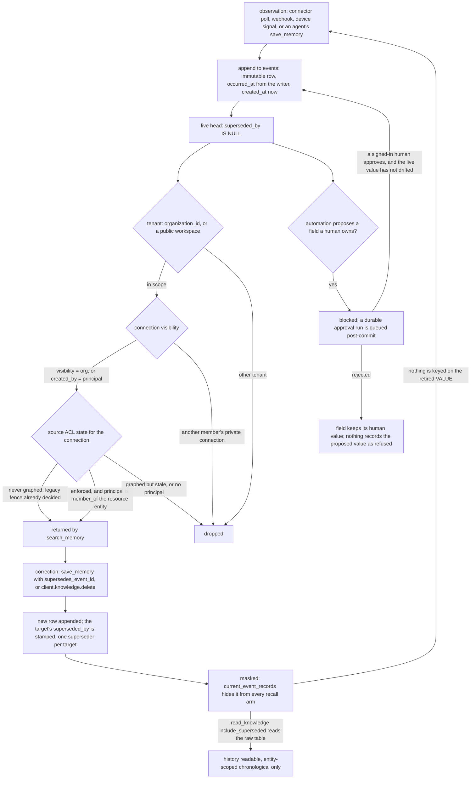

## 1. Executive Summary

Lobu is a shared organisational memory for agents, built as an event-sourced Postgres application: connector polls, webhooks, device signals, agent writes and tool invocations all land as immutable rows in one `events` table, get linked to a typed entity graph, and are served back through a remote MCP server that ChatGPT, Claude Code, Codex and Lobu's own persistent agents all query. Apache-2.0. 2,291 TypeScript files and roughly 355,000 non-test lines across nineteen workspace packages, 279 migrations dating from 19 May 2026, 1,150 test files holding about 10,800 cases, and a release changelog running back to 18 March 2026.

**The scope predicate is the reason to read this repository.** Every read seam that can surface connector-sourced data compiles its visibility clause in one place, from one value. `AuthzScope` carries `{ organizationId, principal, agentId }` (`packages/server/src/authz/scope.ts:10-24`); `compileConnectionFkVisibility` turns it into "org-visible, or this principal's own private connection"; and `compileResourceVisibility` turns it into a `member_of` join that mirrors the *source system's* access control — a GitHub repo's collaborator list, a Slack channel's membership — into SQL on the recall path. The three-state split is the part worth stealing: a connection never graphed passes through to the older per-connection fence, a freshly graphed one requires resource membership, and one that is graphed but whose sync has gone stale matches neither branch and is dropped. The module comment says why in one line: *"a stalled sync hides data, it does not leak it."*

**Correction is masking on an append-only log, and the design stops there.** `delete_knowledge` inserts an empty `tombstone`-typed event whose `supersedes_event_id` points at the target; `save_memory` with `supersedes_event_id` does the same with a replacement body. A partial unique index allows one superseder per target, a trigger blocks a top-level `DELETE FROM events` outright, and the `current_event_records` view — the only table every search branch reads — is `WHERE superseded_by IS NULL`. History stays readable through `read_knowledge`'s `include_superseded` branch. But the tombstone is keyed on the *record*: nothing in the tree records the retired value, so the same text saved again is a new live head. `tombstone` is withheld on exactly that.

**Human review is real and it is on the entity graph rather than on the log.** An agent's or automation's entity write runs through a pluggable mutation gate whose one shipped interceptor defers a denied or escalated change into a durable approval run; `entities.field_controls` pins a field to a human, and `computeFieldMerge` returns an automation's write to an owned field as `blocked` rather than applying it. `requireHumanApprovalContext` refuses any context carrying an agent, OAuth client or MCP session identity, so an agent cannot approve the proposal it queued, and a proposal whose underlying value drifted after the card was built is skipped rather than applied.

**Two findings cut against the product story.** For Lobu's own managed agents, `search_memory`'s content arm is fenced to `events.metadata->>'agent_id' = ctx.agentId` — so a specialist recalls only what it wrote, and the org's connector history reaches it through entities, its bound channels, and explicit `read_knowledge` or `query_sql` calls instead. And the turn plugin that gives those agents automatic memory captures the last user/assistant exchange verbatim, truncated at 2,000 characters, as a `semantic_type: 'observation'` event with no extraction, summarisation or deduplication — transcript slices accumulating in the same store that the organisation's decisions live in.

## 2. Mental Model

A memory is an **observation with provenance**, not a fact. The unit is an `events` row: a title and a payload, a `semantic_type` chosen from the organisation's own registry, an `occurred_at` the writer states and a `created_at` the insert stamps, plus columns naming the connector, connection, feed, run, OAuth client, creating user and acting agent that produced it (`db/migrations/00000000000000_baseline.sql:847-887`). The table's own comment states the contract: *"Append-only event log — the primary data substrate… Never DELETE; supersede with a tombstone row that points at the original."*

**A row has exactly two epistemic states, and neither is about truth.** It is a live head while `superseded_by IS NULL`, and it is masked once something supersedes it. Nothing else moves it. There is no `candidate`/`verified`/`rejected` column anywhere in the schema, no confidence threshold on the read path, and no way to hold a memory on record while disbelieving it. What the system tracks instead is *who said so* — and it tracks that very thoroughly, down to a server-owned `_lobu_` metadata namespace that is stripped from caller input so a member cannot forge an audit discriminator (`packages/server/src/tools/save_content.ts:480-485`).

**Belief is therefore a function of the reader, not of the row.** The same live head is returned to one member and dropped for another, decided per query by predicates compiled from the caller's `AuthzScope`. That is the design's real epistemic claim: a shared store where "what is known" is not a property of the store.

**The entity graph is where something becomes a maintained value rather than an observation.** Entities carry a jsonb body keyed by their type's schema, a `field_controls` map marking fields a human owns, and identity claims in `entity_identities` that connector events resolve against at read time. This is the only layer with a correction workflow: an automation proposing a change to an owned field is blocked into an approval card, and a human approving, rejecting or letting it go stale decides what the entity says.



## 3. Architecture

**One database, three processes.** Postgres with pgvector holds everything — events, embeddings, entities, identities, relationships, ACL state, runs, approvals, OAuth and sessions. The app image (`ghcr.io/lobu-ai/lobu-app`) serves the gateway, the MCP endpoint, REST and the scheduler. A worker image drains runs — automation turns, agent turns, embedding backfill. An embeddings service holds `Xenova/bge-base-en-v1.5` at 768 dimensions on the CPU through transformers.js, and its single-threadedness is a load-bearing constraint the scheduler is written around (`packages/server/src/scheduled/trigger-embed-backfill.ts:43-57`).

**Deployment is asymmetric between the two published paths, and it matters for recall.** The Helm chart deploys app, worker, embeddings service and their PVCs and wires `EMBEDDINGS_SERVICE_URL` into both deployments (`charts/lobu/templates/deployment.yaml:100-103`, `worker-deployment.yaml:95-98`). `docker-compose.example.yml` starts Postgres and the app only and sets no embeddings URL; `searchContentBySingleQuery` catches the missing service and logs *"Embedding generation failed, falling back to text-only search"* (`packages/server/src/utils/content-search/search-path.ts:65-75`). A default self-hosted compose deployment therefore runs the lexical arm alone until an embeddings service is added — a quiet, correct degradation that nothing surfaces to the agent beyond a `similarity` of `NULL`.

**Minimum to boot** is `DATABASE_URL`, a 32-byte `ENCRYPTION_KEY`, a 32-byte `BETTER_AUTH_SECRET` and the externally-visible `PUBLIC_GATEWAY_URL`. No model provider key is required at boot; keys can be added through the admin UI at runtime. The store is ordinary Postgres and fully inspectable by hand — `query_sql` exposes a member-safe read-only slice of it as a tool.

**A submodule at `packages/owletto` is declared in `.gitmodules`** and points at a second repository; it was left uninitialised, so nothing in it is described here.

## 4. Essential Implementation Paths

- **Write.** `save_memory` → `saveContent` (`packages/server/src/tools/save_content.ts`) validates `semantic_type` against the organisation's registered event kinds, strips reserved `_lobu_` metadata keys, stamps `agent_id` from the bound context last so a caller cannot write into another agent's scope (`:486-505`), validates any `supersedes_event_id` target and refuses a second superseder (`:402-435`, with the concurrent-race path recovering from the unique violation at `:644-649`), inserts through `insertEvent`, and returns `indexing_status` from the shared `needsEmbeddingSql` predicate (`:722-736`).
- **Delete and correct.** `client.knowledge.delete` (`packages/server/src/sandbox/namespaces/knowledge.ts:79-84`, reachable through the `run_sdk` MCP tool) → `deleteContentImpl` inserts one empty `tombstone` event per target carrying `supersedes_event_id`, `deleted_event_id` and an optional reason (`packages/server/src/tools/delete_content.ts:97-112`). Removing a `guidance` row is additionally owner/admin-gated through `assertCanRemoveGuidance`.
- **Append-only enforcement.** `db/migrations/20260610040000_events_append_only_guard.sql` installs a `BEFORE DELETE` trigger that raises unless `pg_trigger_depth() > 1` (an organisation cascade) or the transaction has set `lobu.allow_event_delete`. `SET LOCAL` scopes the bypass to one transaction so a pooled connection cannot leak it.
- **Retrieval.** `search_memory` → `searchImpl` → `searchWorkspaceImpl` → `gatherLocalRecall` fans out three concurrent reads — events through `searchContentByText`, channel transcripts, and source-feed coverage (`packages/server/src/tools/search.ts:1208-1266`). `searchContentBySingleQuery` builds the one SQL statement.
- **Scope compilation.** `buildConnectionVisibilityClause` (`packages/server/src/utils/content-search/visibility.ts:148-176`) composes `compileConnectionFkVisibility` and `compileResourceVisibility`, binding their parameters in order so every caller's `$N` indexing survives. `buildOrgScopeWhere` (`:99-127`) binds the tenant, with a GIN-indexed `linked_org_ids` fast path behind a backfill gate.
- **Masking.** Every candidate and result branch joins `current_event_records`, which is `SELECT … FROM public.events e WHERE e.superseded_by IS NULL` (`db/migrations/20260820150000_current_event_records_stored_content_length.sql:49-50`); `search-path.ts:373-429` shows all four branches using it.
- **Approval.** `runMutationGate` (`packages/server/src/authz/entity-mutation-gate.ts:233-268`) is called from `manage_entity` create and delete, `entity-management.updateEntity`, and automation keyed-entity promotion. A `defer` decision returns a `DeferredMutation` whose `queue()` closure the core runs strictly post-commit, so an approval never rides the caller's transaction.
- **Resolution.** `manage_operations` `approve`/`reject` → `requireHumanApprovalContext` → `requireApprovalAuthority` → `applyEntityChangeProposal` → `mergeEntityFields(source: 'human')` (`packages/server/src/tools/admin/manage_operations/handlers/approvals.ts:978-1060`). The MCP App path reaches the same handler through `resolveApproval` after revalidating an encrypted host-bound capability (`packages/server/src/tools/mcp_app.ts:951-1007`).
- **Audit.** `executeTool` wraps every dispatch and calls `recordToolInvocationAudit` on both the success and the exception path (`packages/server/src/tools/execute.ts:409-433`), appending an `events` row with `semantic_type = 'audit'`.
- **Background.** `packages/server/src/scheduled/jobs.ts` registers cron jobs against durable rows; `trigger-embed-backfill` runs `*/5` (`:203-210`).
- **Agent turn.** `runAgentTurn` builds `createTurnMemoryHooks` when the turn declares memory (`packages/connector-worker/src/agent-turn/guest-entry.ts:374-391`), which drives `@lobu/plugin-memory`'s `beforeAgentStart` recall and `agentEnd` capture through the real `PluginHost`.

## 5. Memory Data Model

| Table | Holds |
| --- | --- |
| `events` | `id` (bigserial), `organization_id`, `entity_ids` bigint[], `origin_id`, `title`, `payload_type` in `text`/`markdown`/`json_template`/`media`/`empty`, `payload_text`, `payload_data`, `attachments`, `metadata`, `score`, `author_name`, `source_url`, `occurred_at`, `created_at`, `origin_type`, `connector_key`, `connection_id`, `feed_key`, `feed_id`, `run_id`, `semantic_type`, `client_id`, `created_by`, the `interaction_*` approval columns, `supersedes_event_id`, a stored `content_length`, and a generated `search_tsv` weighting title `A` and body `B` |
| `event_embeddings` | `(event_id, embedding_model, chunk_index)` → a 768-dimension `vector`, so one event carries N chunk vectors |
| `entities` | `organization_id`, `entity_type_id`, `slug`, `name`, jsonb `metadata` keyed by the type's schema, `field_controls`, `content`, a 768-dimension `embedding`, a generated `content_tsv`, `parent_id`, `deleted_at` |
| `entity_identities` | normalised identifier claims — `namespace` (`phone`, `email`, `slack_user_id`, `github_login`, `auth_user_id`, …), `identifier`, `scope_key`, `source_connector`, `deleted_at`, under a live-unique partial index |
| `entity_relationships` | typed edges with `confidence`, `source`, a `_lobu_claims` ownership map in metadata, and `deleted_at`; types carry a `purpose`, and `purpose = 'authorization'` types are writable only by the ACL syncs |
| `authz_source_acl_state` | per-connection `acl_support`, `freshness_state` in `fresh`/`stale`/`unknown`/`failed`, `last_synced_at` — the triple the read gates consult |
| `write_approval_policies` + `write_policy_action_effects` | scope+principal headers with one `(action, effect)` child row each, `effect` in `auto`/`approval`/`deny`/`disabled` |
| `runs` | the durable approval and execution record — `approval_status`, `action_input` (the frozen proposal), `action_output`, `parent_run_id` |
| `agents` | a persistent specialist's `soul_md`, `user_md`, `identity_md`, skills, tools, plugins, guardrails and egress config |

**Scoping is layered and the layers are different kinds of object.** `organization_id` is a column on essentially every table and a predicate on essentially every query. Connection visibility is a row property (`visibility` plus `created_by`) resolved as a subquery. Resource membership is a *graph* property, joined through `entity_relationships` at read time. Per-agent memory is `events.metadata->>'agent_id'`, a jsonb key with partial indexes. And per-agent private instructions are three text columns on the `agents` row — the one place the boundary is physical rather than predicated, and appropriately so, since an agent's own soul document is not something anyone queries across agents.

**Two timelines, both populated, one queryable.** `occurred_at` is the writer's statement of when the thing happened and `created_at` is the insert stamp; neither is ever overwritten, because the row is never updated. Retirement has its own timestamp — the superseding row's `created_at` — so the interval during which a wrong value was live is recoverable exactly. What is missing is a predicate on the record axis: nothing in the tree binds `created_at` in a `WHERE`, so a record-time as-of read has to be assembled from the chain by hand.

## 6. Retrieval Mechanics

**One statement, two arms, weighted linearly.** With an embedding available, `combined_score = COALESCE(text_rank * (1 - w) + best_sim * w, text_rank)` where `w` defaults to 0.6 and is clamped to `[0,1]` (`packages/server/src/utils/content-search/search-path.ts:269-287`). `text_rank` is `ts_rank_cd` over the generated tsvector plus a flat 1.0 bonus when the raw query appears as an ILIKE substring. `best_sim` is the maximum cosine over the event's chunk vectors, computed by a correlated subquery scoped to the configured embedding model, so a row embedded under a previous model contributes `NULL` and falls back to the text score instead of being compared across incompatible spaces. Candidates come from a vector branch (`ORDER BY emb.embedding <=> $vec`), a GIN-served `@@` branch, or both.

**The scoring has a sensible tiebreaker and one honest scar.** `(f.id % 997) ASC` spreads near-ties pseudo-uniformly before falling back to `COALESCE(occurred_at, created_at) DESC` — the comment names near-duplicate conversation sessions as the case where an occurrence-time fallback collapses results onto the newest cluster. The `min_similarity` knob's history is written into the code: it was hardcoded to 0.4 at the recall seam, so *"sweeping 0 → 1.0 never changed the result set, and the documented default was silently overridden"*; the fix passes `undefined` through so the one clamped copy in `search-path.ts` applies (`packages/server/src/tools/search.ts:875-886`).

**The transcript arm is much cruder than the events arm.** `fetchConversationSnippets` tokenises the query, drops a stopword list and terms of three characters or fewer, keeps at most eight, and ANDs an `ILIKE '%term%'` per term over `channel_messages`, ordered by `occurred_at DESC` — no FTS index, no vector, no ranking (`packages/server/src/tools/search.ts:1020-1055`). It runs only when the caller is an agent, and only over `(connection_id, channel_id)` pairs that agent is bound to.

**Entity-type read policy is a post-filter, not a predicate.** `filterEntitiesByReadPolicy` runs `evaluateEntityMutation(action: 'read')` per distinct entity-type slug over the already-fetched rows (`packages/server/src/tools/search.ts:1395-1430`). It applies only when the caller is an agent or an automation, and because it removes rows after the query, an agent's result page can come back shorter than the limit with no indication that a type was filtered.

**Failure modes worth naming.** The entity-scoped and query-scoped arms are deliberately conjunctive, so `{ entity_id, query }` never returns transcripts. `min_similarity` defaults to 0.3, which on `bge-base` is a low floor and over-recalls on short queries. And the per-agent content fence is silent in both directions: a Lobu specialist searching its own memory gets nothing from the org's connector stream, and a human's PAT search over the same workspace returns the agent's rows plus everything else — the code comment records that the asymmetry once ran the other way, with a model unable to recall a memory it had just written.

## 7. Write Mechanics

**Writes are synchronous, cheap and non-extractive.** `save_memory` validates, inserts, fires the NER-lite auto-linker and returns; there is no LLM on the path. The auto-linker scans up to 5,000 characters of content against a 60-second-TTL cache of the organisation's entity names, requiring a name of at least three characters, and creates at most 20 `mentions` edges (`packages/server/src/utils/auto-linker.ts:28-32`). Connector ingest uses the richer mechanism: declarative `attributions` rules extract and normalise identifiers, look them up in `entity_identities`, create on miss when `autoCreate` is set, and log a merge candidate when one event's identifiers resolve to two entities — and it never mutates `events.entity_ids`, recovering the link by join at read time instead.

**Semantic retrievability lags; lexical does not.** `search_tsv` is a generated column, so a saved memory matches the text arm on the next query. The embedding is left null and filled by the `*/5` `trigger-embed-backfill` job, which discovers backlogged organisations by scanning the newest 5,000 unembedded rows under an 8-second statement timeout and dispatches, by default, **one** organisation per tick. Both bounds are incident-derived and the comments say so: an unbounded discovery scan reached 14.5 seconds and restarted the Postgres primary on 22 June 2026, and concurrent backfill runs serialising at the single-threaded embeddings service produced a congestion collapse on 24 June 2026 in which *"embed_backfill 0-completed for hours"*. The practical consequence for an adopter is that on a busy multi-tenant instance the lag from write to vector-searchable is at least one five-minute tick and is not bounded above.

**Update is append; there is no in-place edit of a memory.** The only mutation `insertEvent` performs on an existing row is `applyVolatileState`, which patches `score` and a narrow volatile metadata set for a connector re-sync, with a dirty check so an omitted counter does not register as a change. Everything else supersedes.

**Deduplication is by producer key, not by content.** `idempotency_key` returns the original event unchanged; connector re-ingest dedupes on `origin_id`. Nothing compares embeddings or text before writing, so the plugin's per-turn capture and a model that saves the same fact twice both land twice.

**Malicious input is filtered in exactly one place, and it is the right place.** `guidance` is the only content injected into an agent's system prompt, and `loadOrgGuidanceBlock` requires `connection_id IS NULL AND connector_key IS NULL` — both, because a webhook writes `connector_key='webhook:<id>'` with a null `connection_id` and its `semantic_type` is caller-configurable, so either check alone would let a webhook token holder write into every agent's prompt (`packages/server/src/utils/org-guidance.ts:110-124`). Authorship and removal are both owner/admin-gated, the latter covering supersede and tombstone because both mask.

### Operational cost

The agent blocks on one insert and a bounded auto-link, and nothing else. Injection is bounded and cache-friendly: org guidance is capped at 3,000 characters with a deterministic truncation marker and ordered by `id ASC` with no timestamps or counts, explicitly so it stays inside the cached system-prompt prefix (`packages/server/src/utils/org-guidance.ts:25-28`, `:88-93`). The per-turn recall block is the opposite — `@lobu/plugin-memory` prepends up to six content snippets of 500 characters each plus three entities as a `<lobu-memory>` block in front of the user message on every turn (`packages/plugin-memory/src/index.ts:100-127`), which changes the prefix each turn. The turn machinery is aware of the hazard and manages it at a different layer, keying transient context per message so a steered follow-up does not re-attach the opener's block and *"a prompt-cache prefix that changes on each call"*. No background pass re-reads or rewrites the whole store; the only corpus-scale job is the embedding backfill, and it is bounded per tick.

## 8. Agent Integration

**Fourteen tools on the MCP surface**, of which the memory hot path is three: `search_memory`, `save_memory` and `search_sdk`, plus `query_sdk`/`query_sql` for reads and `run_sdk` for writes through a capability-scoped TypeScript sandbox (`packages/server/src/tools/registry.ts:292-380`). `read_knowledge` and `delete_knowledge` are not advertised on `tools/list`; they are reached as `client.knowledge.read` and `client.knowledge.delete` inside a script. The registry's own comment explains the asymmetry — data tools deliberately mount no UI card so an agent can chain reads, and `save_memory` is the exception because *"its single durable write is itself the final result a person inspects."*

**The agent is expected to save and search explicitly.** The workspace instruction block tells it so in as many words — *"You have persistent memory. Use it proactively — don't wait to be asked"* — and lists the organisation's entity types, relationship types (annotating an ACL-managed type `read-only: access control` rather than hiding it) and the `guidance` block (`packages/server/src/utils/workspace-instructions.ts:167-186`). A direct MCP client receives capability documentation only; tenant-authored guidance is restricted to managed-agent prompts so that *"tenant content [cannot] steer an unrelated host."*

**Lobu's own agents get automatic memory, and it is thin.** `beforeAgentStart` calls `search_memory` with the raw prompt (skipping heartbeats) and prepends the result; `agentEnd` fires a `save_memory` of `User: …\nAssistant: …` truncated to 2,000 characters as `semantic_type: 'observation'`, started and not awaited. The comment around that promise is the most careful piece of engineering in the plugin: the retired worker process outlived the turn, the isolate does not, so the promise is retained and `settle()` awaits it at teardown — *"a runtime that is about to tear itself down awaits it… while one that is not simply never calls it."*

**Compaction is handled, and handled well.** `resolveMemoryFlushConfig` is on by default with a 4,000-token soft threshold below the compaction point, a system prompt of *"Session nearing compaction. Store durable memories now."* and an instruction to reply `NO_REPLY` if there is nothing to store (`packages/core/src/memory-flush.ts:13-20`). `memoryFlushDue` counts `compaction` entries on the branch and compares against a `lobu.memory_flush_state` custom entry, so exactly one flush fires per compaction cycle (`:89-108`). The flush runs as a side prompt with the turn's transient context suppressed.

**Adapting this to another agent is the easy direction.** The whole memory surface is a remote MCP server behind OAuth, and `lobu connect` writes the client config for Claude Code, Codex and OpenCode. Adapting *away* from it is the hard direction: the tools assume Lobu's entity types, semantic-type registry and SDK.

## 9. Reliability, Safety, and Trust

**Provenance is the system's strength and its substitute for epistemic state.** Every row names its connector, connection, feed, run, OAuth client, creating user and acting agent, the `_lobu_` metadata namespace is server-owned, and the audit event carries a SHA-256 of sanitised arguments plus a preview redacted by four credential patterns applied *before* truncation — *"slicing first can split a quoted credential and the unbalanced quote defeats the pattern"* (`packages/server/src/tools/audit.ts:75-79`). What none of it supports is uncertainty: there is no field on a memory that says "recorded, not believed". `entity_relationships.confidence` and `event_classifications.confidences` exist, are projected into results, and a search over `packages/server/src/utils/content-search/` and `search.ts` finds no `WHERE` binding either. `trust_state` is withheld on that.

**The nearest thing to a trust state is about permissions, not truth.** `authz_source_acl_state.freshness_state` is a genuine four-valued discrete state that is read on the retrieval path and does withhold rows. But what it withholds them from is *visibility*, not *belief*: it answers "is our copy of GitHub's access list current enough to rely on", which cannot turn out to be false about the memory. It belongs on the scope side of the line, and that is where it is credited.

**The scope story's honest limits.** The mark covers the read path. Background consolidation is a non-issue because there is none, but three other gaps are real. `filterEntitiesByReadPolicy` is application-side, so entity counts and pagination are computed pre-filter. Embedding keys are scoped by model, not by tenant, which is correct here because the vectors live in the same tenant-predicated tables. And deletion is masking, so a scoped copy question does not arise — but neither does erasure: an organisation cascade is the only path that physically removes an event.

**Prompt injection is defended at the one place it matters and left open elsewhere.** The `guidance` fence is careful and correct. But `save_memory` accepts arbitrary text from any write-scoped caller, `search_memory` returns it, and the plugin prepends it to the next turn's prompt inside a `<lobu-memory>` block whose only instruction is *"Use these long-term memories only when directly relevant."* A memory written by one agent is an instruction candidate for the next.

**One approval invariant is satisfied structurally rather than verified.** `requireHumanApprovalContext` refuses any context carrying `agentId`, `clientId` or `mcpSessionId`. The MCP App resolver reaches the same handler by *clearing* all three after revalidating an encrypted, host-bound, run-scoped capability (`packages/server/src/tools/mcp_app.ts:985-1002`). The comment is explicit that the capability *"proves a signed-in OAuth user deliberately used this app surface"*, and the downstream membership and run-owner checks still run — but the "no agent may approve" guard is, on that one path, satisfied by assignment rather than by evidence, and its strength is exactly the strength of `mcpAppCapabilityMatchesHost`.

**Concurrency is handled where it was hit.** A unique partial index guarantees one superseder per target and the loser of a race gets a clean error rather than a duplicate chain. Embedding writers take `FOR NO KEY UPDATE` on the event before touching `event_embeddings`, with the lock order documented as events → event_embeddings everywhere to avoid a cycle. Approval application shares the terminal transaction, with committed tests for the rollback of each shape.

**Two mechanisms are declared and not wired, and the repository says so itself.** `$eval_case.expectation` is captured with the note that it *"has NO consumer yet — PR 4's judge is what reads it"*, captured now because *"recovering it later from a run id is guesswork"* — a defensible reason to ship a field early, stated. And the event-sourced `entity_field_state` projection was built and then dropped in `db/migrations/20260623050000_drop_entity_field_projection.sql` with the diagnosis written into the migration: *"it shipped substrate first… but NO read path ever consumed it."* Deleting a mechanism because nothing read it, and leaving the diagnosis in the migration, is a better outcome than the unwired projection this atlas usually finds still standing.

**Withheld marks, and why.** `tombstone` — the supersession record is keyed on `supersedes_event_id`, a record id, which the rubric names explicitly as not this; re-saving retired text produces a new live head. The near-miss is `entities.field_controls`: once a human owns a field, an automation's write to it is blocked and re-surfaces as a card forever, which is a durable refusal — but keyed on the *field*, so the same rejected value can be proposed again indefinitely and only the silent application is prevented. `trust_state` — no discrete epistemic status exists on a memory, and a search for the usual vocabulary across `packages/server/src` and `db/migrations` returns nothing.

## 10. Tests, Evals, and Benchmarks

**The suite is large and the CI gate is unusually well defended.** 1,150 test files and roughly 10,800 cases, 942 files of them in `packages/server`. Integration tests run against a real Postgres with pgvector in a service container, sharded three ways under Vitest with `pool: 'forks', singleFork: true`. The gate that matters is `scripts/assert-vitest-report-clean.mjs`: Vitest's exit code is not trusted, the JSON report is parsed, and the run fails unless it parses, reports zero failed tests and suites, **and ran at least one test** — *"zero tests ran — refusing to treat that as green."* The comment names the incident that produced it, a run that went green while printing "Test Files 5 failed" because an `async-exit-hook` registered by importing `embedded-postgres` overwrote the exit code. It is 59 lines, over half of them the docstring naming the incident it exists for, and it is worth copying verbatim.

**The visibility tests are the ones that carry the marks, and they are non-vacuous by construction.** `github-repo-visibility.test.ts` seeds two events on two repo entities, builds the access graph, and asserts a collaborator on repo A sees A and not B in one result — then asserts a requester with no `$member` entity sees neither, then asserts that *without* a graph both are visible. That last case is the control: a predicate that hid everything would fail it. The file also re-runs the assertion through the production `syncGithubConnectionAcl` rather than only the test builder. `slack-channel-visibility.test.ts` covers the same shape for chat, and `search-connection-visibility.test.ts` pairs `toContain` with `not.toContain` on five caller shapes over one fixture, plus an assertion that hidden private connections do not leak through the entity's `connection_count` — the counting channel, which is where a visibility filter most often fails to reach.

**Approval behaviour is tested at the transaction boundary**, which is the right place: `entity-approval-atomic-apply.test.ts` asserts that a card with one stale escalated field commits none of the rest, that a `$name` rollback takes the metadata half with it, and — as an explicitly labelled `CONTROL` — that a hold card with no escalation still applies its live fields.

**No memory benchmark exists here, and that is a scoped claim.** A case-insensitive search of the whole tree for `locomo|longmemeval|hotpotqa|msc benchmark|memgpt|mem0` matches exactly one file, `packages/server/src/utils/content-search/search-path.ts`, and there only in a comment explaining the `id % 997` tiebreaker. There is no retrieval-quality harness, no recall@k measurement, and no ranking regression test: the `vector_weight` of 0.6 and the `min_similarity` of 0.3 are unmeasured constants. The committed eval machinery aims elsewhere — `examples/personal-finance/evals` is a promptfoo config for a connector, `examples/lobu-crm/evals/discovery-surface` drives tool-discovery scenarios, and the in-product `$eval_case` mechanism replays real automation runs.

**No paper.** A case-insensitive search of the tree for `arxiv`, `bibtex`, `@inproceedings` and `@article` returns nothing, and there is no `CITATION.cff`.

**What I would want before trusting this.** A retrieval-quality regression on the hybrid weights, since two unmeasured constants decide every recall. A test that a superseded memory's text, re-saved, is distinguishable from a fresh one — the gap that withholds `tombstone`. And an assertion that an agent-bound `search_memory` returns connector-sourced events, because the per-agent fence means it does not, and nothing in the suite records that as intended behaviour rather than a regression waiting to be introduced.

## 11. For Your Own Build

### Steal

- **Compile the scope predicate in one function and call it from every read seam.** `connection-visibility.ts` is 67 lines and it is the whole rule; the seams differ only in parameter-index bookkeeping, which the composing helper absorbs. The alternative — a visibility clause written separately into a search path, a list path and a read path — is how the same system earlier shipped a drill that *"returns 200 with the org's ENTIRE activity stream, which looks plausible."*
- **Split ACL enforcement three ways, not two.** Never-graphed, enforced, and graphed-but-stale must be separate states, because `NOT IN (enforced)` silently makes the stale case permissive. Write the stale case as failing closed and say so in the comment, as this code does.
- **Mirror the source system's own ACL rather than inventing one.** A memory sourced from a Slack channel or a GitHub repo already has an authoritative access list; joining it at read time means a leak requires the upstream to be wrong.
- **Gate CI on the test *report*, not the exit code.** A few dozen lines that parse the JSON and refuse a run with zero tests catch the failure mode where a dependency's exit hook turns a red run green.
- **Fire one memory flush per compaction cycle.** Asking the model to write durable memories as the window approaches its limit, keyed on a marker that counts compactions so it fires once, is a cheap way to stop a long session losing what it learned.
- **Make an approval card refuse a stale value.** Carrying the snapshot the proposal was built on and skipping any field whose live value has drifted since is what stops a queued approval from clobbering a human's later edit.

### Avoid

- **Don't let "append-only" stand in for "correctable".** Masking the old row answers "stop showing me this" and not "this value is wrong"; without a record keyed on the value, the next extraction pass re-asserts it and the store is confidently wrong again.
- **Don't capture raw turn pairs into a shared store.** Verbatim exchanges with no extraction, no summarisation and no dedup mean the organisation's decisions compete for rank with slices of chat, and the volume grows with conversation rather than with knowledge.
- **Don't filter after the query when the count is part of the answer.** A post-fetch policy filter returns a short page with no signal that anything was removed, and any total computed in SQL is a pre-filter total.
- **Don't ship a documented threshold the callee overrides.** A hardcoded floor at the seam made a published `min_similarity` knob inert across its entire range — the shape this atlas keeps finding, here caught and fixed with the reasoning left in the file.

### Fit

This is a company system, not a library, and it costs what a company system costs: Postgres with pgvector, a worker, an embeddings service, OAuth, and a Helm chart that means it. The design's centre of gravity is *permission*, not *recall* — the deepest thinking in the tree is about who may see a row, and the retrieval side is a competent hybrid with two untuned constants and no quality harness. That is the right trade for what it is aimed at: many agents and many people over one organisation's connected systems, where a leak is unrecoverable and a mediocre ranking is an inconvenience. Take it if your problem is that five agents and forty people need the same context under different permissions. Walk away if your problem is one person's memory on a laptop, or if you wanted a retrieval engine — there is a much smaller thing that ranks better, and you would be paying for governance you do not need. Read the authz directory regardless; the predicate compiler and the three-state ACL split transfer to a system a hundredth of this size.

## 12. Open Questions

- **What is the actual write-to-vector-searchable lag on a populated instance?** The code bounds the discovery scan and the per-tick dispatch but not the queue, and the two 2026 incidents recorded in the comments suggest it has been hours. Measuring it needs a running deployment.
- **Is the per-agent content fence intended to exclude connector events from a specialist's recall, or is it a scope that grew a side effect?** The comment at `save_content.ts:496-500` reads as deliberate — *"what keeps workspace nouns and connector ingest out of any agent's private scope"* — but the product description promises shared history to every agent, and no committed test pins either reading.
- **How often is an approval card actually resolved rather than expired?** `expire-pending-approvals` is a scheduled job; whether the queue is drained by people or by timeout is a question about a deployment, not about code.
- **What does `packages/owletto` contain?** The submodule was left uninitialised for this reading.
- **Does the MCP App capability hold up under host compromise?** The approval path's human-only invariant reduces, on that route, to `mcpAppCapabilityMatchesHost`; assessing it needs the encryption and binding implementation read against a threat model, not just the call site.

## Appendix: File Index

**Storage and schema**
- `db/migrations/00000000000000_baseline.sql` — `events` (`:847-887`) and its table comment (`:893`), `entities` (`:1016-1034`), `entity_identities` (`:1075-1097`), `entity_relationships` (`:1204-1218`), `event_embeddings` (`:940-944`), `grants` (`:1506-1514`), `agents` (`:471-501`), `idx_events_superseded_by` (`:3996`)
- `db/migrations/20260610040000_events_append_only_guard.sql` — the DELETE-blocking trigger
- `db/migrations/20260820150000_current_event_records_stored_content_length.sql:49-50` — the masking view
- `db/migrations/20260628000000_authz_source_acl_state.sql` — ACL enforcement state
- `db/migrations/20260710120000_write_policy_action_effects.sql` — approval policy actions and effects
- `db/migrations/20260623050000_drop_entity_field_projection.sql` — a projection removed for having no reader
- `db/migrations/20260816000010_automation_vocabulary.sql:343-370` — the watchers → automations rename

**Write path**
- `packages/server/src/tools/save_content.ts`
- `packages/server/src/utils/insert-event.ts`
- `packages/server/src/tools/delete_content.ts`
- `packages/server/src/utils/auto-linker.ts`
- `packages/server/src/utils/entity-link-upsert.ts`
- `packages/server/src/utils/entity-field-merge.ts`
- `packages/server/src/utils/entity-management.ts`

**Retrieval path**
- `packages/server/src/tools/search.ts`
- `packages/server/src/utils/content-search/search-path.ts`
- `packages/server/src/utils/content-search/list-path.ts`
- `packages/server/src/utils/content-search/params.ts`
- `packages/server/src/utils/content-search/fts.ts`
- `packages/server/src/utils/content-search/entity-link.ts`
- `packages/server/src/utils/content-search/sql-fragments.ts`
- `packages/server/src/tools/get_content/handler.ts`
- `packages/server/src/tools/get_content/query.ts`

**Scope and authorization**
- `packages/server/src/authz/scope.ts`
- `packages/server/src/authz/connection-visibility.ts`
- `packages/server/src/authz/resource-visibility.ts`
- `packages/server/src/authz/acl-state.ts`
- `packages/server/src/authz/channel-visibility.ts`
- `packages/server/src/authz/entity-mutation-gate.ts`
- `packages/server/src/authz/approval-interceptor.ts`
- `packages/server/src/authz/entity-policy.ts`
- `packages/server/src/utils/content-search/visibility.ts`
- `packages/server/src/tools/access-control.ts`

**Context assembly**
- `packages/server/src/utils/org-guidance.ts`
- `packages/server/src/utils/workspace-instructions.ts`
- `packages/plugin-memory/src/index.ts`
- `packages/connector-worker/src/agent-turn/memory.ts`
- `packages/connector-worker/src/agent-turn/guest-entry.ts`
- `packages/core/src/memory-flush.ts`

**Background workers**
- `packages/server/src/scheduled/jobs.ts`
- `packages/server/src/scheduled/trigger-embed-backfill.ts`
- `packages/server/src/scheduled/expire-pending-approvals.ts`
- `packages/server/src/scheduled/classification-reconciliation.ts`
- `packages/server/src/authz/acl-sync.ts`
- `packages/server/src/authz/github-acl-sync.ts`
- `packages/server/src/authz/slack-acl-sync.ts`

**MCP, API and SDK**
- `packages/server/src/tools/registry.ts`
- `packages/server/src/tools/execute.ts`
- `packages/server/src/tools/audit.ts`
- `packages/server/src/tools/mcp_app.ts`
- `packages/server/src/tools/admin/manage_operations/handlers/approvals.ts`
- `packages/server/src/tools/admin/entity-field-approval.ts`
- `packages/server/src/sandbox/client-sdk.ts`
- `packages/server/src/sandbox/namespaces/knowledge.ts`
- `server.json`

**Tests and evals**
- `packages/server/src/__tests__/integration/authz/github-repo-visibility.test.ts`
- `packages/server/src/__tests__/integration/authz/slack-channel-visibility.test.ts`
- `packages/server/src/__tests__/integration/authz/search-connection-visibility.test.ts`
- `packages/server/src/__tests__/integration/authz/entity-approval-atomic-apply.test.ts`
- `packages/server/src/__tests__/integration/mcp/tool-invocation-audit.test.ts`
- `packages/server/src/__tests__/integration/events/delete-content-tombstone.test.ts`
- `packages/server/src/__tests__/integration/cross-org/isolation.test.ts`
- `scripts/assert-vitest-report-clean.mjs`
- `.github/workflows/ci.yml`

**Recorded searches** (run at the tree root; each grounds an absence claim above)

```sh
grep -rliE "locomo|longmemeval|hotpotqa|msc benchmark|memgpt|mem0" .            # 1 file, a comment in search-path.ts
grep -rniE "arxiv|CITATION\.cff|@inproceedings|@article" .                      # no matches
ls CITATION*                                                                    # no such file
grep -rniE "'(candidate|verified|unverified|disputed|refuted)'" \
  --include='*.ts' packages/server/src db/migrations                            # no matches
grep -rn "confidence" --include='*.ts' \
  packages/server/src/utils/content-search/ packages/server/src/tools/search.ts # projected only, never in a WHERE
grep -rn "f.created_at >=" --include='*.ts' packages/server/src                 # no read path binds record time
grep -rn "watcher_window_field_feedback" --include='*.ts' packages/             # no TS producer; table dropped by migration
grep -rn "EMBEDDINGS_SERVICE_URL" docker-compose.example.yml                    # unset in the compose example
grep -rn "deleteContent" --include='*.ts' packages/                             # reachable via sandbox/namespaces/knowledge.ts
```

## History

**2026-09-12** — [`d3131ab5095e317f4222788273e39d761ae0474d`](https://github.com/lobu-ai/lobu/commit/d3131ab5095e317f4222788273e39d761ae0474d) — first reading, at a commit dated 12 September 2026. Screened before reading: five auto-run surfaces (`.claude/settings.json` PreToolUse hooks, three `.claude/hooks/*.sh` scripts, `.claude-plugin/marketplace.json`, `server.json`, `.gitmodules`), 34 dependency manifests inside the seven-day cooldown, 34 unpinned manifest surfaces, two build-time execution hooks, and two agent-directed files (`AGENTS.md`, `CLAUDE.md`) read as data. Every auto-run surface was read: all three hooks are project-local guards — one blocks edits under `dist/`, one rewrites npm invocations to bun, and one refuses a truncated `pg_indexes`/`pg_constraint`/`pg_policies` query whose conclusion would be an absence, with the false-positive incident that motivated it written into the file. None reaches the network or reads outside the repository. The tree was read, never built, nothing was installed and nothing was run; the `packages/owletto` submodule was left uninitialised. Licence is Apache-2.0 per `LICENSE`.
