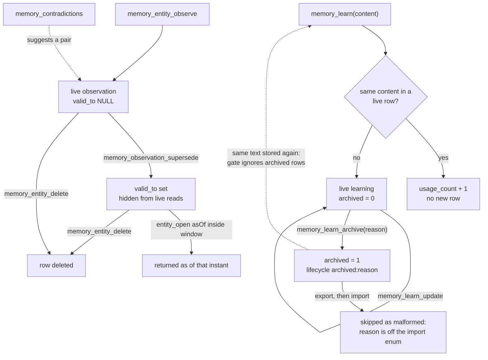

## 1. Executive Summary

local-memory-mcp is a stdio MCP server that keeps one user's memory in one
SQLite file: free-text learnings, decisions with their reasoning, session
summaries, and a small knowledge graph of entities whose observations carry a
validity interval. Search fuses FTS5 BM25 with sqlite-vec cosine over a locally
run multilingual-e5-small model through Reciprocal Rank Fusion, and nothing
calls a hosted model.

What is notable is the write discipline. Every row and
its vector commit in one transaction. A fuzzy auto-merge that overwrote
unrelated learnings was removed, and its test was rebuilt on a corpus the old
branch would have fired on. Observations retire by closing an interval rather
than by deletion.

What is weak is correction outside the graph. An
archived learning can be stored again verbatim as a new live row. Decisions
cannot be edited or retired. An export followed by an import drops every
learning archived with a reason.

Three marks: `bitemporal` on the observation interval, `scope_enforced` on the
project predicate of search and recall, and `negative_eval` on a scoped-search
case and a supersede case. Section 9 names the four withheld and why.

The project has a hosted sibling at memory.studiomeyer.io, and the export
envelope is designed to import there. The local server makes no network call of
its own except the first download of the embedding model
(`src/tools/export.ts:1-27`, `src/lib/embed.ts:85-111`). This report covers only
the local server.

## 2. Mental Model

A memory is whatever the agent passes to a write tool. There is no extraction,
no model call and no candidate state: `memory_learn`, `memory_decide` and
`memory_entity_observe` each insert a row that search returns on the next call.
`confidence` is a caller-supplied float with a default of 0.7. Nothing filters
on it, and only the contradiction scanner reads it.

**A learning lives until it is archived, and the archive does not remember the
text.** `memory_learn_update` overwrites `content` in place and keeps no prior
version (`src/tools/learn.ts:231-311`). `memory_learn_archive` sets
`archived = 1` and `lifecycle_state` to `archived` or `archived:<reason>`
(`:166-204`). Every read path then filters `archived = 0`. No tool reverses it:
the update error tells the caller to *"Un-archive it first"* (`:252`), and no
writer in `src/` sets `archived` back to 0. The duplicate gate checks
`WHERE content = ? AND archived = 0` (`:68-70`), so storing the archived
sentence again produces a fresh live row.

**An observation lives until its interval closes.** `valid_to` is null while it
is live. `memory_observation_supersede` sets it to a caller instant, to the
superseding observation's `valid_from`, or to now (`src/tools/entity.ts:496-525`).
The row then drops out of live search, the live entity view and the
contradiction scan, and stays visible to `memory_entity_open({asOf})` for
instants inside the interval. `memory_entity_delete` removes the entity, its
observations and its relations outright.

**A decision never stops being one.** It is inserted and read; no tool updates,
retires or deletes it (`src/tools/registry.ts:56-207`).

**The contradiction scanner proposes and never acts.** It returns pairs of live
observations on one entity that are close in cosine and differ in a negation
marker or in confidence (`src/tools/contradictions.ts:181-288`). Retiring one
is a separate call by the agent.

## 3. Architecture

One Node process speaks MCP over stdio and opens one SQLite database through
`better-sqlite3`. The file sits under the OS data directory, or at
`MEMORY_DB_PATH` (`src/db/client.ts:25-38`). WAL mode and a ten-second
`busy_timeout` let several clients — Claude Desktop, Claude Code, Cursor — share
the file (`:52-61`). The schema runs on every open and is idempotent
(`src/db/schema.sql`).

Lexical search is one FTS5 table, `search_fts`, kept in sync with learnings,
decisions, entities and observations by insert, update and delete triggers
(`schema.sql:128-196`). Vector search is a `vec0` virtual table of 384-dimension
vectors keyed by content id (`src/db/migrations/002_vector.sql:24-28`). The
sqlite-vec extension loads best-effort; when it fails the server runs FTS-only
(`src/db/client.ts:96-100`).

Embeddings come from `Xenova/multilingual-e5-small`, quantised to q8 and run in
process by `@huggingface/transformers`. Stored text gets the `passage: ` prefix
and queries get `query: ` (`src/lib/embed.ts:105-111`, `:196-260`). The only
background work is a boot-time backfill that embeds entities missing a vector
(`src/server.ts:128-141`, `src/db/vector.ts:392-431`).

### Deployment and ergonomics

- Nothing else runs: one process and one file. No API key is needed to store or
  search anything.
- The first embedding call downloads the model from the Hugging Face hub and
  caches it. Offline, or with `MEMORY_EMBED_DISABLED=1`, every write lands
  without a vector and search falls back to FTS, reporting the downgrade in a
  `notice` field (`src/tools/search.ts:434-450`).
- A learning, decision or observation written while the model is unavailable
  never gets a vector later. The boot backfill covers entities only
  (`src/db/vector.ts:392-404`).
- Install is `npx` from npm, or a `.mcpb` bundle per desktop OS. The store is
  readable with the `sqlite3` CLI, and `memory_export` writes the whole store
  as JSON.

## 4. Essential Implementation Paths

**Capture.** `learn` → exact-duplicate probe → `prepareEmbedding` outside the
transaction → `INSERT INTO learnings` plus `writeEmbeddingSync` inside one
(`src/tools/learn.ts:64-136`). `learnBulk` does the same for up to 500 items
with one batched forward pass (`:362-440`). `decide` and `entityObserve` follow
the same shape (`src/tools/decide.ts:50-81`, `src/tools/entity.ts:136-181`).
`entityObserve` creates a missing entity by name and type first.

**Extraction and consolidation.** None. `classifyMemoryType` labels a learning
`episodic` when its category is `mistake` or a regex finds words such as
*today* or *gestern*, and `semantic` otherwise (`learn.ts:55-62`). The label is
stored and returned and filters nothing.

**Retrieval.** `search` resolves the effective mode, then runs `ftsSearch`,
`vectorSearch`, or both into `reciprocalRankFusion`
(`src/tools/search.ts:421-495`). `recall` is FTS over learnings with a `LIKE`
fallback (`learn.ts:477-530`). `entitySearch` unions FTS hits on entities and on
live observations per entity (`entity.ts:191-269`).

**Context assembly.** `sessionStart` inserts a session row and returns the
three newest sessions that have a summary, current project first, and the five
newest live learnings (`src/tools/session.ts:18-68`). `reflect` returns
most-used, stale, hot-entity and recent-decision lists plus a Markdown summary
(`src/tools/reflect.ts`).

**Correction.** `learnUpdate`, `learnArchive` (`learn.ts:166-311`),
`observationSupersede` and `entityDelete` (`entity.ts:414-547`). There is no
path for decisions or sessions.

**Schema.** `src/db/schema.sql` and `src/db/migrations/002_vector.sql`.

**Background.** `backfillEntityEmbeddings` at boot only.

**Integration.** `src/server.ts` registers `ListTools` and `CallTool` handlers
over `TOOLS` (`src/tools/registry.ts:56-207`), validates arguments with Zod and
returns each result as a JSON text block.

**Tests.** `src/**/*.test.ts`, Vitest, with `MEMORY_EMBED_MOCK=1` set in
`vitest.config.ts`.

## 5. Memory Data Model

| Table | Holds | Lifecycle columns |
| --- | --- | --- |
| `learnings` | category (ten-value enum), content, project, tags, confidence, source, memory type | `usage_count`, `last_used`, `verified`, `archived`, `archived_at`, `importance`, `lifecycle_state` |
| `decisions` | title, decision, reasoning, alternatives, project, tags, confidence, source | `verified`, `verified_at` |
| `entities` | name, type, summary, confidence; unique on name and type | `created_at`, `updated_at` |
| `entity_observations` | content, source, confidence, `session_id` | `valid_from`, `valid_to`, `created_at` |
| `entity_relations` | typed directed edge with weight | `created_at` |
| `sessions` | project, summary, tasks | `started_at`, `ended_at` |
| `meta` | schema version, model fingerprint, `profile_*` fields, `current_goal` | — |

The definitions are in `schema.sql:16-204`.

**Several columns have no interactive writer.** `importance` and `verified` on
learnings, `verified` on decisions, and `session_id` on observations are written
only by `memory_import` (`src/tools/export.ts:666-777`). `entityObserve` inserts
`(id, entity_id, content, source, confidence)` and nothing else
(`entity.ts:167-170`). The observation-to-session link therefore exists only
for rows restored from an envelope.

**Scope.** `project` and `tags_json` exist on learnings and decisions only.
Entities, observations and relations are global within the file. The file is the
user boundary; the schema header says so: *"Single-user: no tenant_id, no
auth"* (`schema.sql:5`).

**Time.** Observations carry the interval and an insert time. Learnings and
decisions carry one `date`. `lifecycle_state` is free text: the type declares
`active | ephemeral | archived` (`src/lib/types.ts:17`), and `learnArchive`
writes `archived:<reason>`.

## 6. Retrieval Mechanics

**Hybrid by default.** Each leg pulls `max(limit * 3, 50)` candidates, RRF adds
`1 / (60 + i)` per leg, and the fused score is multiplied by
`1 + 0.15·recency + 0.10·usage + 0.15·importance` (`search.ts:347-419`,
`:461-464`). Recency decays with a 30-day half-life from `last_used` or `date`.
The weights are overridable per call or by environment variable.

**Two of the three boost signals measure something else.** `importance` has no
writer outside import, so on a store built through the tools it is null for
every row and contributes nothing. `usage_count` is incremented by a duplicate
`learn`, a duplicate in `learnBulk`, and `learnUpdate`, and by nothing on a read
path (`learn.ts:73`, `:261`, `:402`). The usage term ranks a learning by how
often it was re-stored or edited, not by how often it was retrieved.

**Visibility gates sit in both legs.** Archived learnings and observations with
`valid_to` set are excluded in SQL in the FTS query and in the vector query's
outer select (`search.ts:213-214`, `:316-317`).

**The vector leg filters after the nearest-neighbour cut.** sqlite-vec rejects
auxiliary-column constraints inside a KNN query, so `vectorSearch` fetches
`k = min(max(limit * 4, 50), 200)` neighbours and only then applies type, scope,
archive and validity filters (`search.ts:259`, `:285-322`). Archived learnings
and superseded observations keep their vectors by design (`learn.ts:146-149`,
`entity.ts:459-463`). As the retired set grows, and whenever a project or type
filter is narrow, the 200 slots can fill with rows the filter then discards. A
scoped hybrid search over a large store can lose its vector leg without any
signal.

**Query handling.** `escapeFtsQuery` quotes every whitespace token and joins them
with `OR` (`src/db/client.ts:138-146`), which suits recall and is why the old
fuzzy merge matched almost every row. There is no query rewriting and no
reranker.

**Injection.** Nothing is injected without a call. `memory_session_start`
returns at most three summaries and five learnings. Search returns up to 100
rows as JSON with id, type, title, body and the fused score.

## 7. Write Mechanics

Writes happen when the agent calls a tool. There is no capture of the
conversation, no extraction prompt and no consolidation pass. Deduplication is
exact content equality against live learnings. Bulk inserts collapse repeats
inside one batch (`learn.ts:362-386`).

The fuzzy gate is gone, and the file records why. Until v2.4.0 a new learning
whose best FTS match passed a fixed bm25 threshold overwrote that row's content
when the new text was more than 50 characters longer. The comment explains that
OR-ed tokens made the candidate set near-universal and that bm25 is length- and
corpus-scaled, so *"What remained of the decision was 'the new entry is
longer'"* (`learn.ts:84-102`). Two comments still describe the removed branch,
at `:150-151` and `:328-331`.

Import is additive. Every record is parsed with a Zod shape mirroring its
interactive tool, ids are canonicalised to UUIDs, a repeated id is rejected, and
rows land with `INSERT OR IGNORE` in foreign-key order inside one transaction
(`export.ts:300-792`). A record that fails its shape is counted in
`skipped.malformed` and the rest continue.

There is no content filter. Any string the agent passes is stored and returned
by the next search.

### Operational cost

- Writes are synchronous: the call returns after a local embedding forward pass
  and one transaction. The first write of a process loads the model, and the
  first ever run downloads it.
- A memory is retrievable as soon as the call returns. There is no deferred
  lag.
- No background pass reads or rewrites the store. `memory_contradictions` is a
  per-entity self-join capped at 200 observations per entity, run on demand
  (`contradictions.ts:127`, `:181-222`).
- Read cost is bounded by `limit` (at most 100). Nothing is placed in the system
  prompt automatically, so nothing here invalidates a prompt-prefix cache unless
  the client pastes `session_start` output there.

## 8. Agent Integration

The server registers 25 tools and sends instructions telling the model to call
`memory_session_start` first and `memory_session_end` last (`src/server.ts:55-105`).
The README offers two ways to make that automatic: a line in `CLAUDE.md`, or a
SessionStart hook whose output is the sentence *"Call memory_session_start
now."* (`README.md:99-121`). Neither injects memory; both ask the model to fetch
it.

The agent holds every verb, including `memory_entity_delete`, `memory_import`
and `memory_profile`. Each tool carries MCP annotations, and the destructive ones
set `destructiveHint` so a client can ask for confirmation
(`src/tools/registry.ts:276-318`). Whether a client asks is the client's
decision.

Two model-facing strings point at verbs that do not match the tool list. Every
contradiction pair carries the suggestion *"call a future
memory_observation_supersede tool"* (`contradictions.ts:283-284`), a tool that
has existed since v2.2.0. The reflect summary heads its decision list *"review
or verify"* (`reflect.ts:350`), and no tool sets `verified`.

Adapting it to another agent is cheap: it is a stdio MCP server with no
host-specific code.

## 9. Reliability, Safety, and Trust

**Atomicity is careful.** Each tool computes its vector before taking the write
lock and commits row and vector together, so a crash cannot leave one without
the other. When an update's re-embedding fails, the old vector is deleted rather
than left describing text that no longer exists (`learn.ts:280-299`).

**An export round trip loses archived learnings.** `learnArchive` stores
`archived:<reason>` whenever a reason is given (`learn.ts:187`). The export
copies it into `lifecycleState`. The import shape accepts only
`active | ephemeral | archived` (`export.ts:368`), so `parseRecord` rejects the
record and the whole learning is counted as malformed (`:398-411`, `:722-723`).
The test of that rule is titled *"rejects out-of-range and off-enum values a
tool could never produce"* (`src/tools/export.test.ts:516-537`). The round-trip
fixture archives nothing (`:38-58`), so the suite stays green. A user restoring
a backup loses exactly the rows they had marked wrong, obsolete or duplicate,
and the import reports it only as a count.

**Reflect calls a learning stale on a signal nothing produces.** The stale list
is learnings older than 30 days with `usage_count = 0`, headed *"never
recalled — review or archive"* (`reflect.ts:172-191`, `:319`). No read path
increments `usage_count`, so a learning recalled every day is listed as never
recalled and offered for archiving. `reflect.test.ts:63-66` sets
`usage_count = 5` with raw SQL, so the test asserts the query and not the
signal.

**Deleting an entity leaves its own vector.** `entityDelete` removes the
observation vectors and not the entity's (`entity.ts:428-438`). Since v2.3.0
entities are embedded on create (`:106-109`). The orphan cannot surface, because
the vector leg inner-joins `search_fts` (`search.ts:306`, `:315`), but it
occupies nearest-neighbour slots. The regression test creates its entity with
the synchronous `entityCreate`, which never embeds, so the case is not exercised
(`src/tools/entity.test.ts:845`).

**Provenance is a caller string.** `source` is free text. There is no author,
no session link on interactive writes, and no record of which client wrote a
row. An injected instruction stored as a learning is returned by search like any
other.

**Privacy.** Archiving keeps the row and its vector, and export includes
archived rows by default (`export.ts:50-53`). The only hard delete is
`memory_entity_delete`; removing a learning, decision or session summary means
editing or deleting the file.

**Uncertainty is a float.** `confidence` is stored and compared, never used to
withhold a row.

Capability marks:

- `bitemporal` — awarded on observations. The interval is caller-settable at its
  end through `validTo` and at its start through import, and the asOf read
  queries it. What is missing is record time for the closing of the interval: a
  retroactive supersede changes what an earlier asOf call would have returned,
  and the store cannot say what it believed on a date. The whitepaper lists a
  four-timestamp model with `expired_at` as roadmap (`WHITEPAPER.md:241`). The
  same three columns carry the mark in [ClawMem](../clawmem/); the diagnostic
  that withheld it from [Helm](../helm/) — no writer can set validity apart
  from insert time — fails here on `validTo` and on import.
- `scope_enforced` — awarded on the project and tag predicates of search and
  recall. The session-start context does not carry them, and the graph has no
  scope key.
- `negative_eval` — awarded; section 10.
- `tombstone` — withheld. `archived:wrong` is keyed on the row, and the
  duplicate gate deliberately skips archived rows, so the rejected sentence is
  accepted again as new. Superseding an observation is an interval close on one
  record, which the tool description calls a *"tombstone"*
  (`registry.ts:155`) and which nothing consults when the same content is
  observed again.
- `trust_state` — withheld. `archived` withholds a learning from reads, but it
  is a soft delete with a free-text reason, not an epistemic status a memory
  moves through. `verified` has no interactive writer, and the code says so:
  *"`verified` is never flipped to 1 anywhere in v2.1"* (`reflect.ts:212-214`),
  which still holds at this pin.
- `audit_log` — withheld. No table records mutations. `archived_at` and
  `valid_to` record one moment each, and `learnUpdate` overwrites content with no
  prior version.
- `human_review` — withheld. Every write and retire verb is on the agent's tool
  surface, and nothing waits for a person.

## 10. Tests, Evals, and Benchmarks

I read the tests at the pin and ran none of them. The suite has 255 Vitest
cases in 17 files. CI runs it on Node 20, 22 and 24 with `MEMORY_EMBED_MOCK=1`,
so every vector assertion runs against deterministic token-hash vectors rather
than the model (`.github/workflows/test.yml`, `vitest.config.ts`).

**The negative cases.** `scoping.test.ts:33-47` stores a kafka learning under
`alpha` and one under `beta`, searches `kafka` scoped to `alpha`, and asserts
success, `count` 1 and the alpha text. That is a scope-boundary exclusion over a
populated set with the included row asserted. `supersede.test.ts:92-121` asserts
an observation is found, supersedes it, and asserts the same query no longer
returns it. `search.test.ts:365-390` asserts the live learning present and the
archived one absent in one hybrid result, and returns early if sqlite-vec did
not load.

**A test built against its own vacuity.** The gatekeeper test that once
accepted either outcome now seeds filler rows first, because bm25 is
corpus-relative: *"without the filler rows a reintroduced fuzzy branch would
never trip its -5 threshold and this test would pass vacuously against the very
bug it pins"* (`learn.test.ts:112-120`).

**Assertions that cannot fail on a failed call.** Several cases wrap every
assertion in `if (result.success)` without first asserting success, so an
erroring call passes: the original archive exclusion (`search.test.ts:126-134`),
two recall scoping cases (`scoping.test.ts:202-207`, `:215-220`) and the
just-before-cutoff half of an asOf boundary case
(`critical-paths.test.ts:59-63`). The archive and supersede gates still have
cases that assert success, which is why the mark stands.

**Mechanism stood in for outcome.** The asOf boundary cases set `valid_from` and
`valid_to` by raw SQL (`critical-paths.test.ts:46-48`, `:77-79`), because no
tool writes `valid_from`. The reflect case sets `usage_count` by raw SQL. Both
test the read and leave the producer untested, and the producer is where
section 9's defects are.

**Not covered.** No case archives with a reason and round-trips the export. No
case deletes an entity created through the embedding path. No case checks the
vector leg under a narrow scope on a crowded index.

**No benchmark and no paper.** The whitepaper states *"We have not run a
published LongMemEval score for the local server"* and declines to borrow the
hosted sibling's (`WHITEPAPER.md:207`). Its references section cites Zep and
LongMemEval as prior work; the project has no paper or citation file of its own.

## 11. For Your Own Build

### Steal

- **Compute the vector outside the lock, commit row and vector together, and
  delete the old vector when re-embedding fails.** Three rules, and the index
  never describes text the row no longer holds.
- **Remove a destructive heuristic rather than tune it,** and rebuild its test
  on a fixture the old heuristic would actually have fired on.
- **Retire facts by closing an interval and keep them readable as of a date.**
  `memory_observation_supersede` with `supersededById` is the smallest
  supersession that still answers "what was true then".
- **Validate import with the same schemas as the interactive tools,** and
  canonicalise foreign ids deterministically so a re-import stays idempotent.
- **Report a mode downgrade in the result.** A caller testing vector recall can
  tell "vector found nothing" from "vector did not run".

### Avoid

- **A duplicate gate that skips retired rows.** It turns "archived as wrong" into
  "accepted next time". Check retired content too, and refuse or flag it.
- **An import enum narrower than what the writers produce.** Generate the import
  shape from the writer's vocabulary, and round-trip a fixture that exercises
  every lifecycle value.
- **Ranking and housekeeping on a counter nothing increments on read.** If
  "used" means recalled, the read path must write it; otherwise rename it.
- **A ranking signal whose only producer is a restore.** A weight on a column no
  tool writes is a constant that looks like a feature.
- **Post-filtering a fixed nearest-neighbour cut.** Over-fetch in proportion to
  the filtered fraction, or partition the index on the filter key.

### Fit

This suits one developer who wants several MCP clients on one machine to share
a durable notebook and a small fact graph, offline, with nothing to operate. The
retrieval is stronger than a keyword-only store and the write path is
trustworthy. It is not a correction system: decisions are permanent, archive is
reversible only in SQL, a rejected learning comes back the moment it is
restated, and the asOf view answers validity rather than belief. A team needing
per-tenant isolation, reviewed writes or an audit trail is not served by this
design. A builder who needs those properties only on the graph will find the
observation interval a sound base to extend.

## 12. Open Questions

- Does any shipped client honour `destructiveHint` on these tools, and does
  `memory_entity_delete` reach a person first in practice?
- How full does the 200-slot KNN cut get on a store with thousands of archived
  learnings, and how often does a scoped hybrid search lose its vector leg?
- Does the hosted sibling's importer accept `archived:<reason>`, so that the
  round trip loses rows only between two local installs?
- Is `importance` written by the hosted service, which would explain a ranking
  weight on a column no local tool sets?

## Appendix: File Index

- **Storage and schema:** `src/db/schema.sql`, `src/db/migrations/002_vector.sql`,
  `src/db/client.ts`, `src/db/vector.ts`, `src/lib/types.ts`.
- **Write path:** `src/tools/learn.ts`, `src/tools/decide.ts`,
  `src/tools/entity.ts`, `src/tools/session.ts`, `src/tools/export.ts`.
- **Retrieval:** `src/tools/search.ts`, `src/tools/learn.ts` (`recall`),
  `src/tools/entity.ts` (`entitySearch`, `entityOpen`), `src/lib/embed.ts`.
- **Context and reflection:** `src/tools/session.ts`, `src/tools/reflect.ts`,
  `src/tools/insights.ts`, `src/tools/contradictions.ts`.
- **MCP:** `src/server.ts`, `src/tools/registry.ts`, `server.json`.
- **Tests:** `src/tools/scoping.test.ts`, `src/tools/supersede.test.ts`,
  `src/tools/search.test.ts`, `src/tools/critical-paths.test.ts`,
  `src/tools/learn.test.ts`, `src/tools/export.test.ts`,
  `src/tools/entity.test.ts`, `src/tools/reflect.test.ts`, `vitest.config.ts`,
  `.github/workflows/test.yml`.
- **Claims:** `README.md`, `WHITEPAPER.md`, `CHANGELOG.md`.

### Recorded searches

Run at the tree root of the pinned checkout.

- `rg -n "usage_count = usage_count|last_used = " src --glob '!*.test.ts'` — `learn.ts:73`, `:261`, `:402` only; no read path increments usage.
- `rg -n -U "INSERT[^;\`]*valid_from" src --glob '!*.test.ts'` — `export.ts:667-668` only; no interactive writer of `valid_from`.
- `rg -n "SET valid_to|valid_to = \?" src --glob '!*.test.ts'` — `entity.ts:525` only.
- `rg -n -U "INSERT[^;\`]*importance" src --glob '!*.test.ts'` — `export.ts:716-718` only.
- `rg -n "verified\s*=\s*1|SET verified|verified = \?" src --glob '!*.test.ts'` — one match, the comment at `reflect.ts:26`.
- `rg -n -i "un-?archive|SET archived = 0|archived = 0 WHERE" src --glob '!*.test.ts'` — one match, the error string at `learn.ts:252`; `rg -n "archived = \?|archived = 1" src --glob '!*.test.ts'` finds the archive writer at `learn.ts:191` and nothing that resets it.
- `rg -n -i "audit|event_log|history" src --glob '!*.test.ts'` — two comments, no table.
- `rg -n "DELETE FROM" src --glob '!*.test.ts'` — embeddings, FTS triggers, `entities` (`entity.ts:436`) and the goal key; no delete of learnings, decisions or sessions.
- `rg -n "session_id" src --glob '!*.test.ts'` outside `export.ts` — the schema column only.
- `rg -a -n "archived|lifecycle" src/tools/export.test.ts` — the off-enum case at `:526` and `lifecycleState: 'active'` at `:590`; no archived fixture.
- `grep -rniE 'arxiv|bibtex|@article|@misc|doi\.org|CITATION' --exclude-dir=.git .` — two references in `WHITEPAPER.md:270-271`, both to other projects' papers; no `CITATION.cff`.
- `rg -n "fetch\(|https?://|child_process|exec\(" src --glob '!*.test.ts'` — only `better-sqlite3`'s `db.exec`; the model download is inside `@huggingface/transformers`.

## History

**2026-10-03** — [`a2437ddb3051e4a248853d853883e1c26c0cc661`](https://github.com/studiomeyer-io/local-memory-mcp/commit/a2437ddb3051e4a248853d853883e1c26c0cc661) — first reading, at the head of `main`, v2.4.4, dated 21 September 2026. Three marks: `bitemporal`, `scope_enforced`, `negative_eval`. Screened before reading: one auto-run surface (`server.json`, an MCP manifest declaring a start command), one build-time execution point (`prepublishOnly`), no file inside the cooldown, and one floating-range surface with a lockfile present. No `AGENTS.md` or `CLAUDE.md` in the tree. Read with `rg`, `sed` and `awk`; nothing installed, built or run.
