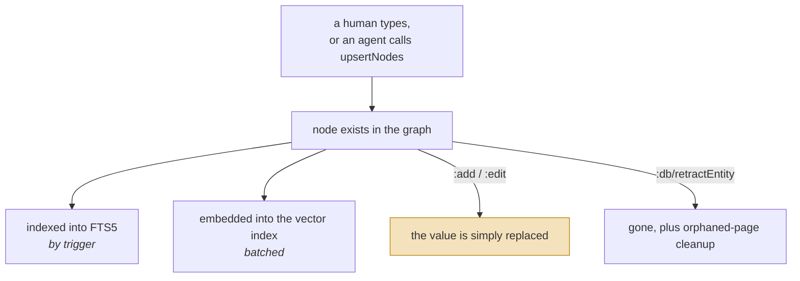
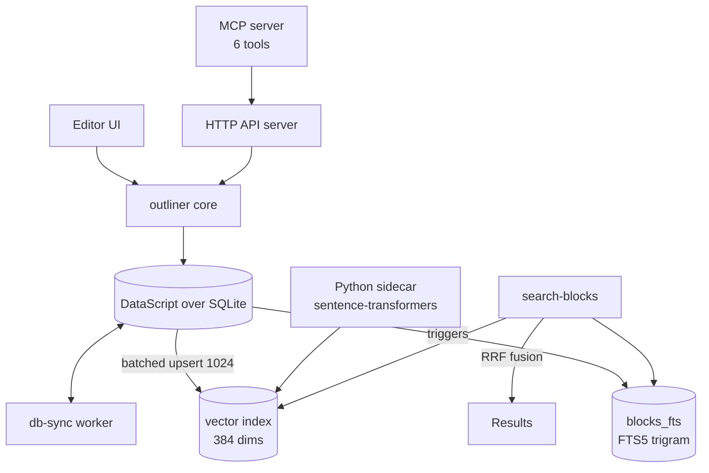

## 1. Executive Summary

Logseq is a local-first outliner and knowledge base — a human tool, twelve years
of it — that ships an agent interface: an MCP server exposing six
tools over the graph, and a local embedding sidecar feeding a vector index. That
combination is what brings it into this atlas, on the same footing as
[Basic Memory](../basic-memory/) and [llm-wiki-memory](../llm-wiki-memory/): a
durable store a person authors, which an agent can now read and write, and which
outlives every session by a wide margin.

What makes it worth a report rather than a mention is the **schema**. Almost
every system in this atlas ships a memory model its vendor chose — features,
observations, facts, episodes. Logseq ships a *schema language*: tags are
classes with `class-extends` inheritance, properties carry a declared
`:logseq.property/type` and a cardinality of `:one` or `:many`, and a property
can constrain which tags its values may reference. The user defines what a
memory is, and `upsertNodes` makes the agent write inside that definition. This
is the only store here where the shape of the knowledge is the user's decision
rather than the vendor's.

The retrieval is also better than its reputation suggests: four lexical arms
(exact title, FTS5 with a trigram tokenizer, `LIKE` for very short queries,
fuzzy) plus an optional vector arm over 384-dimension local embeddings, fused by
reciprocal rank and *gated* — expensive arms are skipped when the cheap ones
already returned enough. It runs on `all-MiniLM-L6-v2` in a Python sidecar, so
semantic search costs no API key and leaves the machine never.

Where it is weakest is precisely where a knowledge base meets an agent. Agent
writes go straight into the live graph with **no marker of any kind** — the
schema defines a `:logseq.property/created-by-ref` ("Node created by") and the
MCP write path does not set it — so a user cannot filter, review or audit what
the agent did. There is no trust state, no provenance on a claim, and deletion
is `:db/retractEntity`, a hard retraction. The agent, notably, cannot delete at
all: the tool does not exist.

## 2. Mental Model

A memory is a **node** — a block or a page, which in the DB version are the same
kind of entity with different roles. Nodes carry:

- a title or body (`:block/title`),
- **tags**, which are classes: they can extend other tags (`class-extends`) and
  declare properties their instances carry (`class-properties`),
- **properties**, each with a type and a cardinality, and optionally a list of
  tags whose instances are the only valid values.

So the belief model is a user-authored ontology. "What kind of thing can I
remember, and what must be true of it" is configuration, not code.

The state machine is the shortest in this atlas, because there is no epistemic
machinery at all:

A human and an agent enter through the same door, which is the whole point of an
editor that acquired an agent rather than the reverse. The highlighted transition
is the cost: an edit **replaces** the value with no record of what it said, so
correction and vandalism are the same operation.

Nothing is a candidate. Nothing is verified. Nothing decays, expires, is
superseded with a record, or is marked rejected. A node is in the graph or it is
not, and its current value is the whole of what the system believes.

Control is **human-primary and agent-secondary**, and the asymmetry is enforced
by the tool list rather than by policy: an agent can create and edit but has no
delete verb. That is the mirror image of [MemMachine](../memmachine/), where the
agent can delete but cannot author a derived fact — and between them the two
systems bracket the question of which half of memory you dare hand a model.

## 3. Architecture

ClojureScript, AGPL-3.0, ~871 Clojure source files, plus a Rust/Electron desktop
shell and a Python sidecar. The relevant modules are the `deps/` workspace:
`db` (schema, properties, malli validation), `outliner` (the block tree and its
operations), `graph-parser`, `db-sync` (multi-device), `common`, and `publish`.

Persistence is a SQLite file per graph, read through DataScript, with a
versioned schema (`65.33` at this commit, major/minor with a comparator and a
migration path). Search indexes are maintained beside it: FTS5 is kept current
by SQL triggers on the blocks table, the vector index by batched upserts.

### Deployment and ergonomics

- **What has to run:** the desktop app. Nothing else is required — no server, no
  database to administer, no API key. Semantic search additionally wants the
  Python sidecar and its model, downloaded once.
- **Fully local and offline: yes, completely**, including embeddings. This is
  rare enough in this atlas to be the headline operational fact. What degrades
  offline is only multi-device sync.
- **Hand-repairable:** yes, unusually so. The graph is SQLite, the content is
  text, and the app is the repair tool. A person who breaks something fixes it
  the same way they authored it.
- **Install:** a normal desktop application, which is a far lower bar than most
  systems here and the reason a non-engineer can actually run it.
- The AGPL is worth flagging for anyone considering embedding it in a product;
  it is the most restrictive licence in this atlas.

## 4. Essential Implementation Paths

**Agent write.** `api-upsert-nodes` in
`src/electron/electron/mcp_server.cljs:115` forwards to
`logseq.cli.upsertNodes` with an `operations` array and a `dry-run` flag. Each
operation carries `:operation` (`:add`/`:edit`), `:entityType`
(`:block`/`:page`/`:tag`/`:property`), an `:id`, and a `:data` map whose keys
include `:title`, `:page-id`, `:tags`, `:property-type`,
`:property-cardinality`, `:property-classes` and `:class-extends`. Temporary
string ids let one batch create a page and put blocks on it.

**Human write.** `deps/outliner/src/logseq/outliner/core.cljs` — the `-save`
path with `retract-attributes?`, the block tree operations, and `:delete-blocks`.

**Retrieval.** `search-blocks` in `src/main/frontend/worker/search.cljs:893`.
Reads in order: exact-title query, then FTS5 `match`, then a `LIKE` arm used
only when the query is two characters or shorter, then fuzzy, then vector.
`enough-exact-title-results?` and `skip-fuzzy?` short-circuit the expensive arms.
The vector arm is behind `:feature/enable-semantic-search?`.

**Index maintenance.** `create-blocks-fts-table!` (line 52) creates the FTS5
virtual table with `tokenize="trigram"`; `add-blocks-fts-triggers!` (line 20)
keeps it current with delete/insert triggers. Vector constants sit at lines
16–18 and 150–154: `max-vector-search-results 10`, `min-vector-search-score 0.5`,
`vector-upsert-batch-size 1024`, `vector-embedding-dimension 384`,
`vector-context-version 3`, `vector-rrf-weight 1.0`.

**Embeddings.** `sidecar/embedding_server.py` — a threading HTTP server wrapping
`SentenceTransformer`, default model `all-MiniLM-L6-v2`, with a warmup input and
a model cache.

**Delete.** `:db/retractEntity` in `outliner/core.cljs:113`, applied to orphaned
pages after a deletion; `:db/retract` for individual attributes and tag links
(lines 198, 208).

**Schema.** `deps/db/src/logseq/db/frontend/property.cljs` (property types,
cardinality, `created-by-ref` at line 653),
`deps/db/src/logseq/db/frontend/schema.cljs` (version 65.33),
`malli_schema.cljs` (validation).

## 5. Memory Data Model

Entity-attribute-value in DataScript, with the vocabulary defined in
`deps/db/src/logseq/db/frontend/`. The parts that matter for this atlas:

**The type system is the distinguishing feature.** A property declares
`:logseq.property/type`; cardinality defaults to `:one` and can be `:many`; a
property may declare `:property-classes`, restricting its values to instances of
named tags. Tags declare `:class-properties` and may `:class-extends` a parent.
That is a small ontology language, validated by malli, and the agent's writes
pass through it — a `upsertNodes` operation that violates the declared shape is
a schema error rather than a bad memory.

**Temporal:** blocks carry creation and update timestamps. There is **no
validity interval**, so nothing here is bi-temporal — a fact that was true last
year and is false now is an edited block with no trace of the change.

**Scoping:** a graph is a separate SQLite database. Within a graph there is no
principal, no tenant key, no per-agent partition — `listPages` is documented as
listing "all pages in a graph". Isolation is by choosing a different database,
which is a real boundary but not a scope key applied on a read path, so
`scope_enforced` is withheld.

**Provenance:** `:logseq.property/created-by-ref` ("Node created by") exists in
the property schema and in the malli spec as an optional int. Tracing its
writers finds `db-sync` tests, a checksum test, an IRC-history import script and
the publish renderer — the multi-user collaboration path. **The MCP write path
never sets it.** So the one field that could tell a user which nodes an agent
created is defined and unused where it would matter most.

## 6. Retrieval Mechanics

The best-engineered part of the system for this atlas's purposes, and worth
reading even if you never run Logseq.

`search-blocks` runs up to five arms:

1. **Exact title** — if the query looks like a whole title.
2. **FTS5 `match`** over `blocks_fts`, which uses the **trigram tokenizer**, so
   substring matching works generally rather than only on token boundaries. For
   a namespaced query it issues two match patterns.
3. **`LIKE`** with `%`-joined terms, used only when the query is ≤ 2 characters —
   the case where FTS has nothing to tokenize.
4. **Fuzzy**, scored by a separate fuzzy scorer.
5. **Vector search**, behind `:feature/enable-semantic-search?`, capped at 10
   results with a 0.5 minimum score.

Fusion is reciprocal rank with `vector-rrf-weight`. The interesting part is the
**gating**: `enough-exact-title-results?` suppresses the FTS arm, and
`skip-fuzzy?` suppresses fuzzy when an exact title already satisfied the limit or
when a multi-term query already matched. This is
[gate the expensive path](../../patterns/gate-the-expensive-path/) applied inside
a retriever rather than around an LLM call, and it is the reason the search feels
instant on a large graph.

`vector-context-version` is a small piece of good hygiene: bumping it
invalidates embeddings computed under an older context format, so a change to
what gets embedded does not leave a silently mixed index.

Failure modes: the trigram tokenizer makes short queries noisy by design; the
vector arm is off unless enabled, so most users' agents get lexical search only;
and there is no reranker, so fusion order is the final order.

## 7. Write Mechanics

**Literal, synchronous, and model-free.** Nothing extracts, summarizes,
deduplicates or consolidates. A block says what someone typed, or what the agent
sent. The entire "write mechanics" surface of most systems in this atlas — the
extraction prompt, the conflict resolver, the consolidation pass — is absent
here, deliberately, because a knowledge base's job is to store what you told it.

The agent path has two affordances worth naming. `upsertNodes` takes a
**`dry-run`** flag, so a caller can validate a batch of operations without
committing — a rehearsal step several systems in this atlas would benefit from.
And the tool description carries an unusual instruction: *"This tool must be
called at most once per user request. Never re-call it unless explicitly
asked."* That is rate-limiting by prompt, which is exactly as reliable as it
sounds, and it is the only guard between an agent and unbounded writes to the
user's knowledge base.

Conflict handling is last-write-wins by editing: an `:edit` operation replaces
the title. There is no compare-and-swap, no base-version check, and no detection
that a human edited the same block since the agent read it.

Malicious input is not filtered. A block whose text is a prompt injection is
stored and returned by search like any other; the schema validates shape, not
content.

### Operational cost

- **Synchronous and free of models on the write path.** The cost is a DataScript
  transaction plus index maintenance.
- **Lag before a new node is retrievable:** effectively zero for lexical search,
  because FTS5 is updated by SQL triggers in the same transaction. For semantic
  search it is one embedding batch — the sidecar call plus a batch of up to
  1024.
- **No background pass rewrites the store.** Embedding upserts and index
  maintenance are the only recurring work, and both scale with what changed.
- **On the read path** nothing is injected automatically. There is no context
  assembly at all — the agent calls `searchBlocks` or `getPage` and decides what
  to do with the result. Token cost is entirely the caller's to manage.

## 8. Agent Integration

Six MCP tools (`src/electron/electron/mcp_server.cljs:119`): `listPages`,
`getPage`, `upsertNodes`, `searchBlocks`, `listTags`, `listProperties`. They are
thin wrappers over the app's own API, registered against an `McpServer` named
"Logseq MCP Server", enabled by a `:server/mcp-enabled?` config flag.

`listTags` and `listProperties` are the ones that make the schema usable by a
model: an agent can discover the ontology before writing into it, which is what
turns a typed schema from an obstacle into a guide.

**There is no delete tool.** An agent can create a page, edit a title, add a
block and attach a tag; it cannot retract anything. Whether that is a deliberate
safety boundary or simply unimplemented is not stated anywhere in the code, but
the effect is a store where agent mistakes accumulate until a human removes
them.

There is also no automatic injection and no session lifecycle — Logseq does not
know or care that an agent has a conversation. Adapting it to another agent is
trivial (it is MCP), and the integration is one of the least coupled in this
atlas.

## 9. Reliability, Safety, and Trust

**No trust model exists.** No confidence, no candidate state, no verification,
no corroboration, no source link on a claim. This is not an oversight for a
human notebook — a person is accountable for what they wrote — but it becomes
one the moment an agent writes into the same graph, because the two authors are
now indistinguishable.

**That indistinguishability is the central risk, and it is one field wide.**
`:logseq.property/created-by-ref` is defined, typed, malli-validated, and set by
the collaboration and import paths. `upsertNodes` does not set it. So a user who
suspects the agent has written something wrong has no query that separates agent
nodes from their own, no way to review a day's agent writes, and no way to undo
them selectively. The mechanism the schema already contains would close most of
that gap.

**Deletion is a hard retraction.** `:db/retractEntity` removes the entity, and
orphaned pages are retracted after it. There is no tombstone, no soft-delete
column, no rejected-value record, and nothing prevents the same content being
written again a minute later. Since the agent cannot delete, the practical
deletion story is entirely the human's, performed in the editor.

**History:** DataScript is a transactional database and the app has undo, but
nothing in the memory model preserves prior values as queryable state. There is
no `audit_log` in the atlas's sense — no append-only record of mutations in the
store that a user could inspect after the fact.

**The review surface is the best in this atlas and is wired to nothing.** Every
node an agent writes lands in a full editor where a human can read, restructure,
retype or delete it — far more than the display-only viewers elsewhere here. But
there is no staging area, no proposal queue, no approval step, and no marker on
what arrived from an agent. Review is possible and unprompted, which is why
`human_review` is withheld: the bar is a surface where a person *adjudicates*
memory, and this is a surface where a person happens to be able to.

**Sync:** `db-sync` handles multi-device with its own worker, routes and
checksums, including a `semantic` route so embeddings travel too. Its conflict
behaviour was not traced.

## 10. Tests, Evals, and Benchmarks

**245 test files** across the workspace, which is a serious suite, and it is
aimed at the things a knowledge base gets wrong: schema migration, malli
validation of the property system, outliner tree operations, and — notably —
`db-sync` has substantial coverage including `worker_handler_sync_test.cljs` and
`checksum_test.cljs`, both of which exercise `created-by-ref` handling in
transaction batches.

There is a pleasing irony there: the property that would mark agent authorship
is *tested* in the sync path and *unset* in the agent path.

No memory benchmarks exist, and none would mean anything — there is no
extraction pipeline to score and no conversational QA surface. No test asserts
that particular material must not be retrieved, so `negative_eval` is withheld.

**What I would want before trusting an agent with a graph:** a test that
`upsertNodes` cannot violate a declared property cardinality; a test that a
dry-run commits nothing; and any test at all of the MCP tool layer, which
appears to be uncovered.

## 11. For Your Own Build

### Steal

- **Let the user define the schema, then make the agent write inside it.**
  Properties with declared types and cardinality, tags as classes with
  inheritance, and `listTags`/`listProperties` so the model can discover the
  ontology before writing — this is how you get structured agent memory without
  choosing the structure for everyone.
- **Gate the retrieval arms.** Running exact-match first and skipping fuzzy and
  vector when it already satisfied the limit costs nothing to implement and is
  the difference between a search that feels instant and one that does not.
- **Version the embedding context.** `vector-context-version` means changing
  what you embed invalidates the old vectors instead of silently mixing two
  encodings in one index.
- **A trigram FTS index** gives substring search over a token-based engine for
  one line of DDL, and SQL triggers keep it correct without an application-level
  sync path.
- **`dry-run` on the write tool.** Letting an agent validate a batch before
  committing is cheap and turns a class of destructive mistakes into an error
  message.

### Avoid

- **Letting agent writes land unmarked in a human's store.** If two authors
  share a namespace, record which one wrote each node from the first commit.
  Retrofitting authorship is impossible for everything already written, and the
  cost of the field is one reference.
- **Rate-limiting by prompt.** "This tool must be called at most once per user
  request" is a wish. If the constraint matters, enforce it in the tool layer.
- **Giving an agent create and edit without delete.** It sounds conservative and
  produces a store that only accumulates. Either trust it with the full
  lifecycle behind a review step, or expect the human to do all the cleaning.

### Fit

This is for someone who already keeps their knowledge in Logseq and wants an
agent to work in it — and for that person it is excellent, because the store was
built for a human first and it shows in every ergonomic the agent inherits: local
files, instant search, a real editor, no API key, no server.

It is a poor choice as an agent's *own* memory. There is no scope key, so
multiple agents or multiple users share one namespace; no trust state, so a
guess and a fact look identical; no authorship, so you cannot review what the
agent did; and no delete verb, so it cannot clean up after itself. A team
building a product on agent memory should read the schema design and the
retrieval gating and then build elsewhere — not least because the AGPL means
embedding this in a proprietary product is a licensing decision, not a
dependency choice.

The interesting middle case is a personal agent for a single user who is already
a Logseq user. There the missing scope key costs nothing, the missing trust state
is survivable because the human reads their own notes, and what you get in
exchange — a decade-old, offline, inspectable, user-schema'd store — is not
available anywhere else in this atlas.

## 12. Open Questions

- **Why is there no delete tool?** Deliberate safety boundary or unimplemented
  surface? The code says nothing, and the answer decides whether an agent can
  ever own the full lifecycle here.
- **Does `db-sync` resolve conflicting edits, and how?** It has checksums, a
  worker handler and substantial tests; the merge semantics were not traced, and
  they determine what happens when a human and an agent edit the same block on
  different devices.
- **Is the MCP layer covered by any test?** None was found.
- **What is the practical recall of the vector arm** at `min-vector-search-score
  0.5` over `all-MiniLM-L6-v2`, and how often is semantic search enabled in
  practice? The flag defaults were not traced through the settings UI.
- **Does anything populate `created-by-ref` for local single-user graphs?** Only
  sync, import and publish paths were found.

## Appendix: File Index

**Schema and data model**

- `deps/db/src/logseq/db/frontend/property.cljs` — property types, cardinality,
  `:logseq.property/created-by-ref` (line 653)
- `deps/db/src/logseq/db/frontend/schema.cljs` — schema version 65.33
- `deps/db/src/logseq/db/frontend/malli_schema.cljs` — validation

**Write path**

- `deps/outliner/src/logseq/outliner/core.cljs` — `-save`, `:delete-blocks`,
  `:db/retractEntity` (line 113)
- `src/electron/electron/mcp_server.cljs` — `api-upsert-nodes` (line 115)

**Retrieval**

- `src/main/frontend/worker/search.cljs` — `search-blocks` (line 893), FTS5
  trigram table (line 52), triggers (line 20), vector constants (lines 16–18,
  150–154)
- `sidecar/embedding_server.py` — sentence-transformers HTTP sidecar

**MCP/API**

- `src/electron/electron/mcp_server.cljs` — the six tools (line 119)
- `src/electron/electron/server.cljs` — `initialize-mcp-routes` (line 144)

**Sync**

- `deps/db-sync/src/logseq/db_sync/` — worker routes including `semantic.cljs`,
  `storage.cljs`, `order.cljs`

**Tests**

- `deps/db-sync/test/logseq/db_sync/worker_handler_sync_test.cljs`
- `deps/db-sync/test/logseq/db_sync/checksum_test.cljs`
- `scripts/test/logseq/tasks/db_graph/create_graph_with_clojure_irc_history_test.cljs`

## History

**2026-07-29** — [`9a11243d50b23afeb10bda5a2ca6cc77357eea38`](https://github.com/logseq/logseq/commit/9a11243d50b23afeb10bda5a2ca6cc77357eea38) — first reading.
