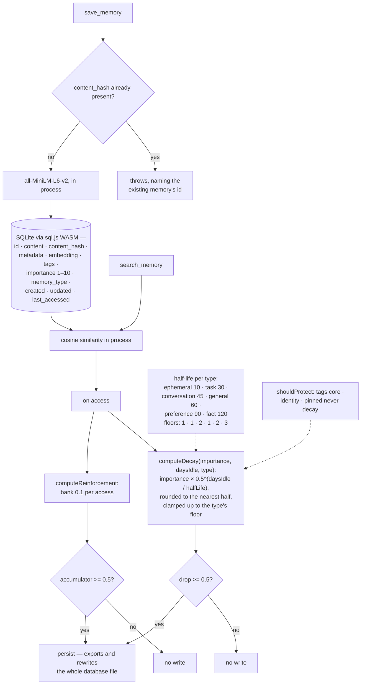

## 1. Executive Summary

LongtermMemory-MCP is "[a] fully local MCP server that gives AI agents
persistent, semantic long-term memory — **without any cloud dependencies**" —
MIT, TypeScript, version 1.4.4, 2,763 lines with 109 tests. It states its
lineage and its difference in one table: inspired by `mcp-mem0`, but SQLite via
`sql.js` WASM instead of Postgres, `all-MiniLM-L6-v2` in process instead of the
OpenAI embeddings API, cosine in memory instead of a cloud vector database, and
no LLM dependency at all. Installation is `npx`.

It is a small subject and this is a short report, which is the proportionate
response. Two things in it are worth taking.

The first is that the forgetting model fits on a screen and says what it means.
`DECAY_CONFIG` is a half-life per memory type — `ephemeral` 10 days, `task` 30,
`conversation` 45, `general` 60, `preference` 90, `fact` 120 — with a floor per
type so nothing decays to zero, and a protected-tag set of `core`, `identity`
and `pinned` that exempts a memory from decay entirely. `computeDecay` is four
lines of exponential, rounded to the nearest half point and clamped to the
floor.

Most decay in this corpus is either a constant nobody tuned or a model spread
across three files. This is a table a user could read and reason about, and the
differentiation is sensible on its face: a stated preference should outlive a
task by three months.

The second is the write-amplification decision, made deliberately. Decay and
reinforcement are both *computed* on access and *persisted* only when the change
is large enough: `shouldWriteDecay` returns true only at a drop of half a point
or more, and reinforcement accumulates 0.1 per access into a running total that
writes back at 0.5 and caps importance at 10. So reading a memory a dozen times
adjusts its standing without producing a dozen writes, and the threshold is a
named constant rather than an accident.

For a store that exports and rewrites the entire SQLite file on each persist —
which is what `sql.js` requires — that decision is load-bearing rather than
cosmetic.

What is not here is anything epistemic, and the report carries no marks for that
reason. `memory_type` is a genre chosen at write time, `importance` is a
continuous weight, and neither withholds anything from a reader. There is no
status, no provenance beyond a free JSON metadata blob, no supersession, no
validity interval and no record of what changed. Deletion is deletion:
`delete_all_memories` is described in the README as irreversible, and the tool
contract carries no confirmation step.

## 2. Mental Model

A **memory** is content, an embedding, a type, some tags, and an importance
between 1 and 10.

**Decay** lowers importance by a half-life chosen by type, unless a tag protects
it or the floor stops it.

**Access** raises it, slowly, and neither movement is written until it is worth
writing.

## 3. Architecture

| Area | Role |
| --- | --- |
| `src/memory-store.ts` | The schema, the indexes, dedup, and the persist |
| `src/decay.ts` | The half-life table, the floors, the protected tags, both write-back thresholds |
| `src/embeddings.ts` | MiniLM in process |
| `src/server.ts` | The MCP tool surface |
| `src/backup.ts` | A manual backup that exports JSON beside the database |
| `skills/long-term-memory` | The companion skill that teaches the model to use it |
| `tests/` | Unit, integration and benchmark suites, including a schema-migration test |

## 4. Essential Implementation Paths

`src/decay.ts` in full. Sixty-five lines containing the whole forgetting model
and both write-back thresholds.

`src/memory-store.ts:140-152` for dedup, and `:66-96` for the schema version
check.

## 5. Memory Data Model

Eleven columns and five indexes, with `schema_meta` holding a version that is
compared on open and a `schema-migration.test.ts` covering the path. For a
project this size, versioning the file format before anyone has asked is the
right instinct — the database lives in a user's home directory and will outlive
several releases.

`metadata` is a free JSON blob, which is where provenance would go if there were
any. Nothing in the tool contract asks a caller to say where a memory came from.

## 6. Retrieval Mechanics

Cosine over MiniLM embeddings computed in process, with `search_by_type`,
`search_by_tags` and `search_by_date_range` as filters. Importance weights
nothing at retrieval time that was traced here — it governs decay rather than
ranking — so a memory decayed to its floor is returned like any other.

## 7. Write Mechanics

Exact-content dedup: the hash is computed, a matching row is looked up, and a
collision throws an error naming the existing id. Throwing rather than silently
returning the existing memory is the friendlier choice for an agent caller,
which can then decide whether to update it.

It is also exact. The same fact in different words is two rows, and once they
exist nothing reconciles them — no supersession, no contradiction detection, and
importance decay treats them independently. For a personal store that is a
tolerable amount of drift; it is the first thing that would need attention if
the store grew.

## 8. Agent Integration

An MCP server started by `npx`, plus a Claude Code plugin that installs both the
server and "a companion skill that teaches Claude how to use memory
effectively". Shipping the prompt-side half beside the server is worth noting —
a memory tool with no guidance about when to call it tends not to be called.

## 9. Reliability, Safety, and Trust

The trust surface is small and honestly small. There is no scope, no
authentication and no audit, because there is one local database and one user.
The safety-relevant facts are that `delete_all_memories` is irreversible and
that the whole database is exported and rewritten on each persist, so a crash
mid-write is a question the backup tool exists to answer rather than one the
store handles.

## 10. Tests, Evals, and Benchmarks

109 tests across unit suites for the store, decay, embeddings, backup and schema
migration, an integration test that drives the MCP server, and three benchmark
files — cosine similarity, decay and the store. Benchmarking the decay path is
unusual and sensible for a component that runs on every access.

## 11. For Your Own Build

Put the decay policy in one table. Six half-lives and six floors, with the type
names beside them, is something a user can read, argue with and tune. A decay
constant buried in a scoring function is none of those.

Decide when a computed value gets written. Recomputing decay on read is cheap;
persisting it on read is not, and the difference is one threshold constant. Name
it — `writebackStep` — so the next person can see the trade rather than
rediscover it.

Give protected tags to the things that must not fade. `core`, `identity`,
`pinned` is a short list, and having it means the decay model can be aggressive
everywhere else.

And version the schema before anyone needs a migration. A user's database
outlives releases, and the test is cheaper to write while there is only one
version.

## 12. Open Questions

Whether importance influences ranking. It governs decay; whether a decayed
memory is down-weighted at retrieval was not established from the search path
read here.

What happens to two memories stating the same fact differently. Exact-hash dedup
does not catch it, and nothing else in the tree reconciles them.

## Appendix: File Index

| Path | What to read it for |
| --- | --- |
| `src/decay.ts` | The whole forgetting model, and both write-back thresholds |
| `src/memory-store.ts:140-152` | Dedup that throws with the id it collided with |
| `src/memory-store.ts:66-96` | A versioned schema checked on open |
| `tests/unit/schema-migration.test.ts` | The migration path, tested early |
| `README.md` | A comparison table that states its own lineage |

## History

**2026-09-16** — [`5955730d50f0e1d999b28007271205d3e6c0dc37`](https://github.com/MarcelRoozekrans/LongtermMemory-MCP/commit/5955730d50f0e1d999b28007271205d3e6c0dc37) — first reading, at a commit dated 16 September 2026. Screened before opening, from a shallow clone: eight files scanned, three auto-run surfaces, one build-time execution point, one unpinned surface and two dependency files inside the seven-day cooldown. Nothing was installed, built or run.
