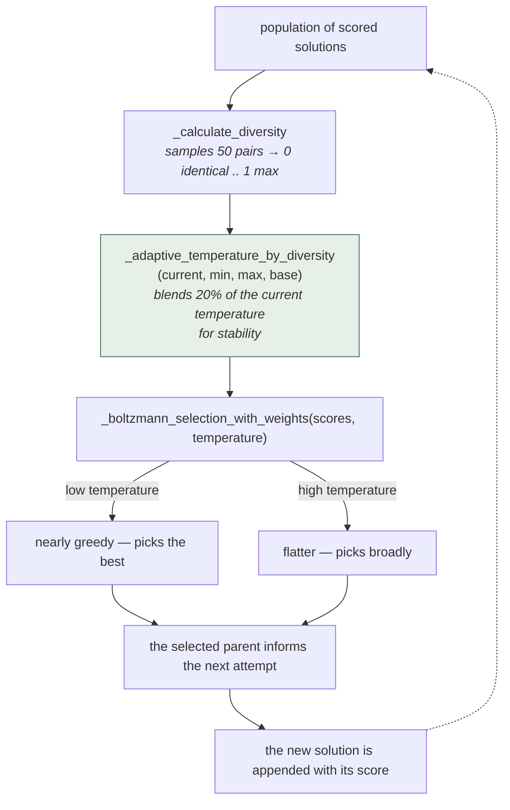
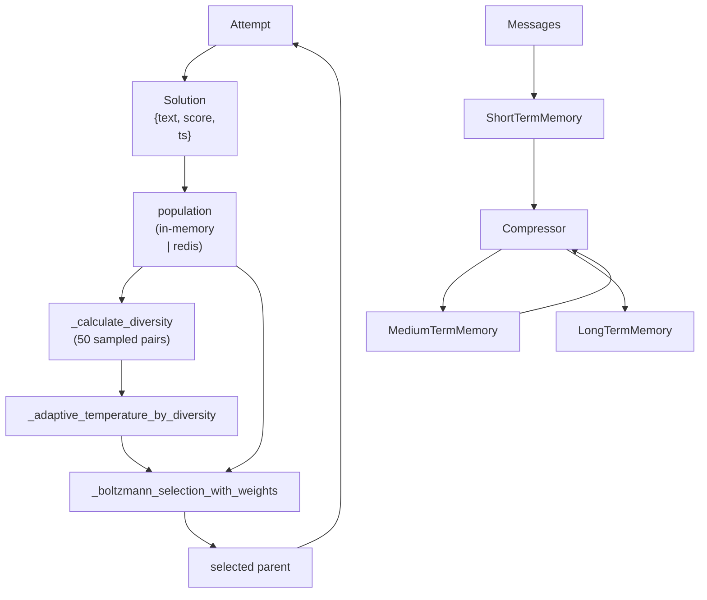

## 1. Executive Summary

LoongFlow is Baidu's Apache-2.0 agent SDK. Its `agentsdk/memory/` package is about 4,600 lines and contains **two unrelated memory systems**.

`grade/` is the conventional one: `GradeMemory` "supports stm, mtm, ltm and auto compress" — short, medium, and long-term tiers with a `Compressor` moving material between them and a pluggable `Storage`. The atlas has many variants of this.

`evolution/` is not conventional, and it is why LoongFlow is here. It maintains a population of `Solution` objects — each with `solution` text, a `score`, and a timestamp — persisted through `in_memory.py` or `redis_memory.py` behind a `memory_factory`. Recall from that population is **Boltzmann selection with adaptive temperature**:

```python
def select_parents_with_dynamic_temperature(
    ..., initial_temp, min_temp, max_temp, ...
):
    """Select parent solution with fully adaptive temperature control"""
    temperature = _adaptive_temperature_by_diversity(...)
```

and the temperature is driven by a measured property of the population itself:

```python
def _calculate_diversity(solutions, sample_size=50) -> float:
    """Normalized diversity score between 0 (identical) and 1 (max diversity)"""
```

Two details in those twenty lines are worth a reader's attention before they
copy them.

**The adjustment is linear and the comment says sigmoid.** The line above it
reads *"Sigmoid adjustment for smoother transitions"*; the arithmetic is
`adjustment_factor = 1 + (2 * diversity - 1)`, which is `2 * diversity` — a
straight line through the origin, clamped into `[min_temp, max_temp]` and then
blended 80/20 with the current temperature. Nothing sigmoid happens. The blend is
what actually smooths the transition, and it is the part with no comment.

**`sample_size` samples solutions, not pairs.** The docstring calls it *"Number
of solution pairs to sample for diversity estimation"*, and the code is
`np.random.choice(len(solutions), size=min(sample_size, len(solutions)))`
followed by a double loop over the sample — so the default 50 yields up to 1,225
pairwise comparisons, not 50. An adopter tuning the parameter for cost would be
off by a square.

**Every other system in this atlas retrieves deterministically.** Rank by some blend of similarity, recency, and importance; take the top *k*. LoongFlow's evolutionary memory deliberately returns a *worse* remembered solution some of the time, with the probability governed by a temperature that rises when the population has collapsed toward sameness and falls when it is already varied.

That is an explicit exploration/exploitation trade applied to recall, and it has no counterpart anywhere else in this atlas. It is closest in spirit to [Voyager](../voyager/)'s skill library and [Verel](../verel/)'s induced rules — remembered attempts that shape future attempts — but where those retrieve greedily, this samples.

The caveat is scope. This is memory for an optimization loop, not belief about a user or a project. It answers "what should I try next, given what I have tried" rather than "what is true." Read it for the mechanism, not as a general memory design.

## 2. Mental Model

Two stacks, sharing only a package:

```text
grade/                                  evolution/
  ShortTermMemory                         Solution { solution, solution_id,
  MediumTermMemory                                   score, timestamp }
  LongTermMemory                          EvolveMemory (ABC)
  Compressor  ──auto-compress──▶            add_solution(...)
  Storage                                   in_memory | redis backends
                                          Boltzmann selection ◀── temperature
                                                                    ▲
                                                            population diversity
```

Selection lifecycle:



An explicit exploration/exploitation trade applied to recall, with no counterpart
anywhere else in this atlas. Diversity drives temperature, temperature drives how
greedily a parent is chosen, and the new temperature is **blended** with the old
rather than replacing it — so the exploration rate moves smoothly instead of
oscillating with each measurement. The dotted edge closes the loop: each selection
changes the population its own diversity was measured from.

## 3. Architecture

`src/loongflow/agentsdk/memory/`:

- `evolution/` — `boltzmann.py` (selection and temperature), `base_memory.py` (`Solution`, `EvolveMemory` ABC), `in_memory.py`, `redis_memory.py`, `memory_factory.py`.
- `grade/` — `memory.py` (`GradeMemory`), `components.py`, `compressor/`, `storage/`.
- `README.md` in the memory package.



## 4. Essential Implementation Paths

### Temperature from diversity

`_calculate_diversity` samples up to 50 solutions and compares them pairwise, returning a normalized score where 0 is a population of identical solutions and 1 is maximally varied. The sampling is deliberate — the docstring notes it exists "to reduce computation", since exhaustive pairwise comparison over a large population is quadratic.

`_adaptive_temperature_by_diversity` maps that score to a temperature within `[min_temp, max_temp]`, and — the detail worth noting — **blends 20% of the current temperature into the result** for stability. Without that, a noisy diversity estimate would make the temperature oscillate, and selection behaviour would swing between greedy and random between rounds.

The feedback loop is the point: a population that has converged gets a higher temperature, which makes selection flatter, which admits weaker solutions, which restores variety. A varied population gets a lower temperature and selection sharpens toward the best.

### Boltzmann selection

`_boltzmann_selection_with_weights(scores, temperature)` weights each solution by the Boltzmann factor of its score at the current temperature. At low temperature this approaches argmax; at high temperature it approaches uniform.

Set against the rest of the atlas, this is the interesting move. Deterministic top-*k* recall has a failure mode nobody here names: if the ranking function is even slightly wrong, the same wrong memories surface every time, and nothing in the system ever sees the alternatives. [MetaClaw](../metaclaw/) addresses that by testing whole policies offline; LoongFlow addresses it by never fully committing to the ranking in the first place.

The cost is reproducibility. Two identical queries can return different memories, which makes debugging harder and makes any evaluation of recall quality a distribution rather than a number.

### The graded stack

`GradeMemory` is documented in one line — "supports stm, mtm, ltm and auto compress" — and composes `ShortTermMemory`, `MediumTermMemory`, `LongTermMemory`, a `Compressor`, and a `Storage`. It is the same three-tier shape as [MemOS](../memos/)'s textual tiers or [Mercury](../mercury-agent/)'s `durable | active | subconscious`, without the graded scoring the latter adds.

Nothing connects it to `evolution/`. A solution population and a message tier stack sit in one package with no shared abstraction, which reads as two teams solving two problems rather than one design.

## 5. Memory Data Model

```python
@dataclass
class Solution:
    solution: str = ""
    solution_id: str = ""
    score: Optional[float] = 0.0
    timestamp: ...
    # required_fields = {"score", "timestamp", "solution"}
```

That is the whole unit: text, an identifier, a score, and a time. No provenance, no status, no supersession, no scope. For an optimization population that is defensible — a solution's score *is* its standing, and the selection pressure is the lifecycle.

For the graded tiers, messages move between levels by compression, so "forgetting" is compression loss rather than an explicit deletion or tombstone.

Neither stack has a trust model, correction path, or scope key.

## 6. Retrieval Mechanics

Two entirely different answers in one package. The graded tiers surface by recency and tier. The population surfaces by Boltzmann sampling over scores at a diversity-driven temperature.

`EvolveMemory` is an ABC with `add_solution` and concrete in-memory and Redis implementations behind a factory, so the population can outlive a process — which is what makes this memory rather than in-loop optimizer state.

## 7. Write Mechanics

Solutions are appended with a score after an attempt; there is no gate, verification, or dedupe visible in the selection module. The graded stack ingests messages and compresses upward.

## 8. Agent Integration

Both are libraries inside the LoongFlow agent SDK rather than a service or plugin surface. `memory_factory.py` selects the population backend by configuration.

## 9. Reliability, Safety, and Trust

Strengths:

- **Stochastic recall with a principled control signal** — the only instance in the atlas.
- **Temperature smoothing** (20% of current) preventing round-to-round oscillation.
- **Sampled diversity** keeping the control loop cheap on large populations.
- **Bounded temperature** with explicit `min_temp` and `max_temp`.
- **Persistable population** via a Redis backend, so it survives a process.
- **Apache 2.0**, with no reuse obstacle.

Gaps:

- **Non-reproducible recall.** The same query can return different memories, which complicates debugging and evaluation.
- **No trust, provenance, correction, or scope** in either stack.
- **Two unrelated memory models** in one package with no shared abstraction.
- **The selection parameters are undefended** — `sample_size=50`, the 20% blend, and the temperature bounds are constants with no ablation.
- **Score is assumed meaningful**; nothing validates that the scoring function ranks solutions usefully, and Boltzmann selection over a bad score function samples confidently from noise.

## 10. Tests, Evals, and Benchmarks

Ten test files sit under `tests/agentsdk/memory`, split between `grade/` and
`evolution/`, and the split in their quality is the thing to report.

**The Boltzmann selector is tested as a distribution, which is the right way to
test a stochastic mechanism and is rare in this corpus.** `test_score_priority`
draws repeatedly and asserts the mean index of the selected solution exceeds a
threshold; `test_weight_priority` does the same for weights; and
`test_temperature_effect` asserts that selections at a low temperature
concentrate on higher-scoring solutions than at a high one —
`np.mean(low_temp_selections) > np.mean(high_temp_selections)`. None of those can
be satisfied by a single lucky draw.

**The function that makes the temperature adaptive is named in no test.** A grep
for `diversity` across `tests/` returns nothing. Every Boltzmann case passes an
explicit temperature, so `_calculate_diversity` and
`_adaptive_temperature_by_diversity` — the pair that distinguishes this system
from every other retrieval in the atlas — are exercised by nothing, which is why
the linear-versus-sigmoid mismatch and the pairs-versus-solutions sampling in
section 3 could both be introduced without a failure.

**One file named like a test contains none.**
`grade/compressor/test_message_compression.py` is 292 lines whose docstring says
*"This file generate test message to compress"*; it defines
`generate_test_messages()` and no `test_`-prefixed function, so pytest collects
the module and runs nothing. It is a fixture generator with a test file's name,
which inflates any count made by listing files rather than cases — this report's
first reading counted the directory.

Nothing was run for this review, and no memory-quality benchmark was found. The
measurement this design invites is whether adaptive temperature beats a fixed
one — a comparison the code is structured to support, since temperature is a
parameter, and which nothing in the repository appears to have run.

## 11. For Your Own Build

### Steal

- **Sample rather than rank, when recall feeds exploration.** If remembered items inform *what to try next* rather than *what is true*, deterministic top-*k* guarantees you never revisit the alternatives. Boltzmann selection makes the exploration/exploitation trade explicit and tunable.
- **Drive the temperature from a measured property of the store**, not a schedule. Diversity collapse is the condition that should loosen selection, and it is directly measurable.
- **Smooth the control signal.** Blending in a fraction of the current temperature turns a noisy estimate into stable behaviour.
- **Sample the diversity estimate** rather than computing it exhaustively.
- **Bound the control parameter** so no feedback excursion makes selection fully random or fully greedy.

### Avoid

- **Stochastic recall without reproducibility tooling** — no seed or replay path is visible, and debugging a non-deterministic memory is materially harder.
- **Trusting the score function.** Selection quality is bounded entirely by whether `score` means anything.
- **Two memory models under one package name**, which invites picking the wrong one.
- **Undefended constants** governing the whole control loop.

### Fit

Borrow:

- The diversity-to-temperature loop, including the smoothing and the bounds, wherever memory feeds a search or generate-and-test process.
- The idea that recall need not be deterministic when its consumer is exploration.

Do not copy:

- The `Solution` shape as a general memory record — it has no provenance, status, or scope.
- Stochastic recall for factual memory, where a user asking the same question twice should get the same answer.

## 12. Open Questions

- Does adaptive temperature outperform a fixed one? The code is parameterized for the experiment; nothing records it having been run.
- Is there a seed or replay path for reproducing a selection during debugging?
- Why do the graded and evolutionary stacks share a package but no abstraction?
- What validates the `score` on a solution, given that selection quality depends entirely on it?
- Does the Redis-backed population have a retention policy, or does it grow without bound?

## Appendix: File Index

- Selection and temperature: `src/loongflow/agentsdk/memory/evolution/boltzmann.py` (`_calculate_diversity`, `_adaptive_temperature_by_diversity`, `select_parents_with_dynamic_temperature`, `_boltzmann_selection_with_weights`).
- Population model: `evolution/base_memory.py` (`Solution`, `EvolveMemory`).
- Backends: `evolution/in_memory.py`, `evolution/redis_memory.py`, `evolution/memory_factory.py`.
- Graded tiers: `grade/memory.py` (`GradeMemory`), `grade/components.py`, `grade/compressor/`, `grade/storage/`.
- Tests: `tests/agentsdk/memory`.

## History

**2026-09-17** — [`945c78bc1554f8281aac40320b3599bd68d528d7`](https://github.com/baidu-baige/LoongFlow/commit/945c78bc1554f8281aac40320b3599bd68d528d7) — re-read at the same commit, still the tip; the last commit upstream is 9 April 2026. Nothing could have moved, so this reading audited the first one. Screened again: no auto-run surface, no build-time execution path, fifteen unpinned dependency surfaces, nothing inside the cooldown; `AGENTS.md` and `CLAUDE.md` were read as data. Nothing was installed or run.

**The distinctive mechanism is the untested one.** The Boltzmann selector itself is tested well and unusually — as a distribution rather than a value, with repeated draws asserted to favour higher scores and low temperature asserted to concentrate more than high. But a grep for `diversity` across `tests/` returns nothing: every case passes an explicit temperature, so `_calculate_diversity` and `_adaptive_temperature_by_diversity`, the pair that makes this the only adaptive stochastic recall in the atlas, are exercised by nothing.

**Two defects in that untested pair, both visible on reading.** The comment says *"Sigmoid adjustment for smoother transitions"* above `adjustment_factor = 1 + (2 * diversity - 1)`, which is `2 * diversity` — a straight line; the smoothing that does happen is the unremarked 80/20 blend with the current temperature. And `sample_size`, documented as *"Number of solution pairs to sample"*, is passed to `np.random.choice` over the solution list and then double-looped, so the default 50 produces up to 1,225 comparisons rather than 50.

**One file named like a test contains none.** `grade/compressor/test_message_compression.py` is 292 lines defining `generate_test_messages()` and no `test_`-prefixed function — a fixture generator with a test filename, which inflates a count made by listing files. The first reading's section 10 said only that *"Tests exist under `tests/agentsdk/memory`"*, which counted the directory rather than the cases.

Marks unchanged at none. `stack_retrieval` stays empty — the graded tiers return by recency and the population by sampling, and neither is a lexical, vector or graph arm — and `stack_source` moves from `seeded` to `reviewed` now that the fields have been checked against the code rather than inferred.

**2026-07-27** — [`945c78bc1554f8281aac40320b3599bd68d528d7`](https://github.com/baidu-baige/LoongFlow/commit/945c78bc1554f8281aac40320b3599bd68d528d7) — first reading.
