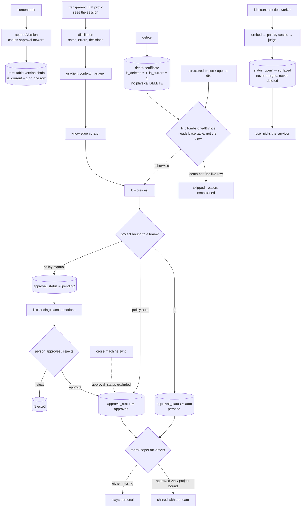

## 1. Executive Summary

Lore is a transparent LLM proxy that turns sessions into durable project
knowledge. It sits between a coding harness and the model, distils what
happened, and injects the relevant facts into the next session. The
monorepo is 200,458 lines of TypeScript against 229,044 lines across 487 test
files, with 1,624 commits since 20 February 2026, published as a gateway, an
OpenCode plugin, a Pi extension and a core engine. It is licensed FSL-1.1 with
an Apache-2.0 conversion — source-available now rather than open source — and
its README calls it experimental.

The design idea it states up front is distillation rather than summarisation:
coding agents need "file paths, error messages, and exact decisions rather than
narrative summaries that lose the details agents need to keep working." It
credits Sanity's Nuum architecture and Mastra's observational-memory research,
the latter already read here as [Mastra](../mastra-observational-memory/).

Three mechanisms are worth the visit.

**Deletion leaves a record that later writes must read.** There is no physical
DELETE. `appendVersion(..., { isDeleted: true })` writes what the code calls an
immutable death certificate as the new current version. The important half is
the read: `findTombstonedByTitle` queries the base `knowledge` table rather
than the `knowledge_current` view precisely so it can see those rows, and
returns true only when the sole same-title match in scope is a death
certificate with no live row beside it. The structured-import lane calls it and
skips the entry with `reason: "tombstoned"`; the agents-file lane carries the
id-keyed equivalent. A memory the user threw away does not come back through
an import.

**Contradiction detection refuses to resolve.** An idle worker embeds the
project's entries, pairs them by cosine similarity — on the reasoning that
opposing rules are topically close, so similarity is a cheap prefilter — and
asks a worker model whether each pair genuinely opposes. Its header states the
boundary: "Detection ONLY — never merges, never deletes. The user picks the
survivor (or keeps both) on the dashboard." A judged pair is recorded `open` or
`cleared` so the cost stays bounded and a cleared pair is never re-judged. The
consolidation prompt carries the matching invariant: opposing rules "are NEVER
duplicates — never merge them."

**Team sharing is a conjunction a person completes.** In a project bound to a
team scope under a `manual` policy, a new entry lands `pending`, and
`teamScopeForContent` returns a team only when the entry is `approved` *and*
its project is bound. Approval records `approved_by` and is copied forward by
`appendVersion`, so editing an entry's content does not quietly re-share it.

The gap sits underneath that last mechanism. The comment above the approval
functions says the status "is a LOCAL, mutable metadata field (not synced; not
content)". The field that decides whether knowledge reaches a team is the one
field excluded from the sync that carries knowledge between machines. On a
second machine the same logical entry can hold a different approval state, and
nothing in the model reconciles them.

Five marks: `tombstone`, `human_review`, `trust_state`, `scope_enforced`,
`negative_eval`.

## 2. Mental Model

A **logical entry** has one `logical_id` and many immutable **versions**. Only
one version is `is_current`. An edit appends; a delete appends a death
certificate; nothing is overwritten.

A **metric register** (`knowledge_meta`, keyed by `logical_id`) holds the two
mutable numbers — `confidence` and `last_reinforced_at` — so the version rows
stay immutable. A pure relevance touch deliberately does not bump the
register's clock, keeping injection "sync-silent".

A **scope** is a tenant, a project, and an optional cross-project flag. A
**team scope** is something a project is bound to, carrying a promotion policy
of `auto` or `manual` that a per-project override can change.

An **approval** is `auto`, `pending`, `approved` or `rejected`. Only `approved`
reaches a team.

**`.lore.md`** is the curated output: version-controlled Markdown at the repo
root, so the diff arrives in a pull request.

## 3. Architecture

| Area | Role |
| --- | --- |
| `packages/core/src/ltm.ts` | The knowledge store: versions, the metric register, approval and team promotion, tombstones |
| `packages/core/src/distillation.ts`, `gradient.ts`, `curator.ts` | The pipeline the README describes as one continuous problem |
| `packages/core/src/contradiction.ts` | Idle-time detection that surfaces rather than resolves |
| `packages/core/src/scope.ts`, `tenant.ts` | Scope binding, promotion policy, tenant resolution |
| `packages/core/src/import/` | Structured import from other memory formats, with the resurrection guard |
| `packages/core/src/agents-file.ts` | `.lore.md` read and write, and the id-keyed import guard |
| `packages/core/src/embedding*`, `vector-*`, `db/vec-store` | Embedding and vector workers |
| `packages/gateway`, `packages/opencode`, `packages/pi`, `packages/hermes` | The proxy and the host integrations |
| `quality`, `stryker.config.mjs`, `vitest.mutation.config.ts` | Mutation testing configuration alongside the unit and eval suites |

## 4. Essential Implementation Paths

- `packages/core/src/ltm.ts:113-155` — the entry shape and why two tables exist.
- `:425-500` — `appendVersion`, the death certificate, the forward copy.
- `:594-702` — the approval gate, the review queue, approve and reject.
- `:989-1030` — `findTombstonedByTitle` and the view-versus-table subtlety.
- `packages/core/src/import/structured.ts:172-198` — the resurrection guard in use.
- `packages/core/src/contradiction.ts:1-24` — the detection-only boundary.

## 5. Memory Data Model

An entry carries its own provenance: `created_by`, `updated_by`,
`source_user_id`, `source_entry_id`, and — added later — `worker_provider_id`
and `worker_model_id`, so the model that produced a memory is recorded beside
it. Sensitivity is a three-value field. Confidence lives on the metric register
with `last_reinforced_at`, and a decay pass ages out entries nothing has
reinforced; the comment is explicit that reinforcement counts an injection, a
recall or a curator reconfirmation.

The split between immutable version rows and a mutable register is the design
decision worth noting: it lets the store keep an append-only history without
rewriting a row every time relevance is touched.

## 6. Retrieval Mechanics

Hybrid vector and lexical search over the current versions, with entries
injected at session start and re-injected after the first turn. The gradient
context manager sits between distillation and the curator, so context
management and long-term memory are one pipeline rather than two subsystems —
the README argues this explicitly.

## 7. Write Mechanics

The curator writes; imports write; edits append. `ltm.create()` applies an
exact-title dedup as a backstop, and the import lanes apply the tombstone guard
before reaching it. Deletion never removes a row.

## 8. Agent Integration

A standalone gateway proxy for any harness, plus an OpenCode plugin and a Pi
extension. Because it is a proxy rather than a tool, the agent needs no
awareness of it — which is the product argument and also the thing to be
deliberate about, since every prompt and response passes through it.

## 9. Reliability, Safety, and Trust

**The team gate is local state.** `approval_status` is documented as "a LOCAL,
mutable metadata field (not synced; not content)". Everything else about an
entry moves between machines; the field that decides whether it is shared with
a team does not. That makes approval a property of the machine where someone
happened to click, on a system whose stated purpose is memory that follows a
team. Nothing observed here reconciles two machines that disagree, and the
sync-silent design of the metric register shows the authors think carefully
about what should and should not travel — which makes this worth asking about
rather than assuming it is an oversight.

**The proxy is in the path.** Lore reads every prompt and response by
construction. The mitigations are real and visible — `.lore.md` is
human-readable Markdown reviewed in a pull request, sensitivity is a stored
field, and the curated file is the thing the team actually shares — but the
capture surface is the whole session.

**The licence is FSL-1.1 converting to Apache-2.0.** At this pin the source is
available rather than open, which matters for anyone planning to fork or
vendor it.

## 10. Tests, Evals, and Benchmarks

487 test files, more lines of test than of source, plus a separate eval config
and a Stryker mutation-testing configuration — a suite that checks whether the
tests would notice a change, which few projects in this corpus run.

`packages/core/test/scope-selection.test.ts` is the file to read: twelve cases
named for properties, including the conjunction test, the pre-existing-`auto`
review-queue case, and "relation: team iff BOTH endpoints resolve to the same
team". `ltm-tombstone-by-title.test.ts` covers the resurrection guard including
the contested case where a live row shares the title.

## 11. For Your Own Build

### Steal

- **Query the base table, not the current view, when you need to see a
  deletion.** The bug this avoids is invisible: a guard that reads the
  convenience view can never find the thing it is guarding against.
- **Put the resurrection guard in every import lane, keyed to what that lane
  has.** One lane has ids, the other only titles; both are covered, and the
  code says which is which and why.
- **Detect contradictions without resolving them.** Recording `open` and
  `cleared` bounds the cost and keeps a false alarm from becoming a silent
  merge; the consolidation prompt carries the same invariant from the other
  side.
- **Copy an approval forward across an edit.** Otherwise editing content is a
  way to launder unapproved knowledge into a shared scope.
- **Split immutable versions from a mutable metric register.** It is what makes
  an append-only history affordable when relevance is touched on every read.

### Avoid

- **Excluding the sharing decision from the thing that shares.** If approval
  governs team visibility, approval is team state.

### Fit

Reach for this if you want memory that follows an agent across tools without
changing the harness, and you are comfortable with a proxy in the path and a
source-available licence. Look elsewhere if approval must hold identically
across every machine on the team today.

## 12. Open Questions

- Is `approval_status` intended to stay local once Folk Lore ships team sync,
  and if so what reconciles two machines that disagree about the same
  `logical_id`?
- Does the decay pass interact with approval — can an approved team entry age
  out of relevance while still being shared?
- The contradiction worker judges precision-first and never re-judges a
  `cleared` pair. What re-opens one when an entry's content later changes?

## Appendix: File Index

| Path | What to read it for |
| --- | --- |
| `packages/core/src/ltm.ts` | The store: versions, register, approval, tombstones |
| `packages/core/src/contradiction.ts` | Detection-only contradiction handling |
| `packages/core/src/import/structured.ts` | The resurrection guard on a real write path |
| `packages/core/src/agents-file.ts` | `.lore.md` and the id-keyed import guard |
| `packages/core/src/scope.ts` | Scope binding and promotion policy |
| `packages/core/test/scope-selection.test.ts` | Twelve property-named scope and approval cases |
| `packages/core/test/ltm-tombstone-by-title.test.ts` | The tombstone guard, including the contested title |

## History

**2026-09-16** — [`3e19619a6774074bd18dc4363aa984b0c5ea5472`](https://github.com/BYK/loreai/commit/3e19619a6774074bd18dc4363aa984b0c5ea5472) — first reading, at a commit dated 16 September 2026. Screened before opening, from a shallow clone: twenty files, no auto-run surfaces, two build-time execution points, seven unpinned surfaces, ten dependency files inside the cooldown, and `AGENTS.md` read as data. Nothing was installed, built or run.
