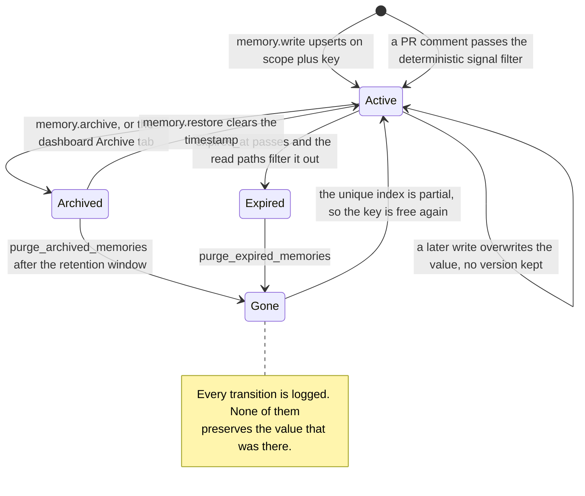

## 1. Executive Summary

LoreKit is **a shared lesson store for coding agents**, built as a hosted
product with the whole stack in the repository: a Supabase Postgres schema in 37
migrations, an MCP server as an edge function, a Next.js dashboard, a CLI, and
marketplace plugins for Claude Code, Cursor and Codex. MIT licensed and
self-hostable. The pitch is cross-machine, cross-tool continuity — one agent
learns something, every other agent on any machine reads it.

The unit is deliberately small: a lesson addressed by `(scope, key)`, with a
text value, tags, a `source_agent` and a `trigger`. There is no embedding, no
similarity, no extraction and no model anywhere in the write path. Retrieval is
exact-scope equality plus Postgres full-text search. That austerity is the
design, not an omission.

What is genuinely strong here is the **infrastructure around the memory**, and
it is stronger than most systems in this atlas manage:

- **The tenancy boundary is authenticated, not tagged.** Row-level security
  policies on `memories` gate every read on `user_id = auth.uid()` or a matching
  `org_id` JWT claim. This atlas's `scope_enforced` mark only certifies that a
  scope key reaches the query; LoreKit has the stronger thing the rubric says is
  rarer than the count suggests.
- **The audit log is append-only by construction.** `audit_log` has a SELECT
  policy and an INSERT policy and **deliberately no UPDATE or DELETE policy** —
  the migration says so, numbered as Decision D5. Eleven actions are enumerated
  in a CHECK constraint, including `memory.create`, `memory.update`,
  `memory.archive`, `memory.restore` and `memory.delete`.
- **The migrations are written like design documents.** The audit-log migration
  spends 25 comment lines explaining why capture is app-layer rather than a
  trigger, names the single deliberate exception, and tells a future maintainer
  what to do if an admin path is ever added. That is unusual and it made this
  report faster to write.

Two things undercut it, and they are the interesting part.

**The audit log records that a value changed and never what it was.** The write
path is an in-place upsert on the unique key; the audit metadata is
`{ scope, key }` (`packages/mcp-core/src/tools/write.ts:118`). So LoreKit can
prove a memory was updated, by whom and when, and cannot show what it replaced.
An append-only mutation log over a store with no version history answers the
security question and not the memory one.

**The epistemics are prose.** The `lorekit-setup` skill ships a genuinely
excellent 257-line document on self-improvement loops, including five
"entrenchment guards" against a loop reinforcing its own mistakes — the clearest
statement of that problem in this corpus. Of the five, exactly one (expiry) is
enforced by code. `seen_count >= 3`, the recurrence gate that governs promotion,
appears in four Markdown files and **in no schema and no TypeScript**. There is
no column to count recurrences in.

## 2. Mental Model

A memory is **a keyed slot**. `(scope, key)` is an address; the value is
whatever was last written there. This is the simplest model in this atlas after
a plain file, and everything downstream follows from it.

The consequence worth internalising: LoreKit has no notion of a memory being
*true*, *candidate*, *verified* or *rejected*. It has a notion of a memory
*existing at an address*, being *visible*, or being *gone*. Belief is not
modelled; occupancy is.

### How a thing becomes a belief

Two capture paths, neither of which involves a model.

**The agent writes it.** `memory.write` calls the `memory_write` RPC, which
upserts with `on conflict (user_id, scope, key) ... do update set value = ...`.
Whether the row was created or updated is recovered from `xmax::text = '0'`,
which is how the tool knows to log `memory.create` versus `memory.update`. When
to write at all is decided by the `lorekit-memory` skill's `retrospective` rule
— prose telling the agent to record a lesson after a stuck loop, a repeated
failure, or a costly wrong assumption.

**A GitHub webhook writes it.** PR review comments become lessons, and the gate
is deterministic (`packages/mcp-server/src/webhooks/signal-filter.ts`):
`classifyWebhookAction` admits only four event/action pairs, and `isSignalWorthy`
rejects bodies under 20 characters, bot-noise patterns (CI status lines,
Dependabot headers), and bodies that are entirely a fenced code block. One of
the four admitted actions is `pull_request_review_thread resolved`, on the
reasoning that the author acknowledged the finding — outcome-grounding by event
type, and a good instinct.

The webhook body is HMAC-SHA256 verified with an explicit note that the
signature-absent case returns before any crypto runs, *"no timing oracle on
crypto"*. The ingest boundary is the most carefully built thing in the
repository.

### How a belief stops being one

Four exits, and the interesting property is what the first one deliberately
allows.

*Overwrite.* A second `memory.write` to the same address replaces the value in
place. No version, no supersession pointer, no prior value retained anywhere —
including in the audit log.

*Archive.* `archive_memory` sets `archived_at`. RLS then hides the row from
normal reads via a policy predicate, and a second policy exposes it to the
dashboard's Archive tab. `restore_memory` clears the timestamp.

*Expire.* `expires_at`, set by `p_ttl_days` between 1 and 365, is filtered at
the query layer — `.or('expires_at.is.null,expires_at.gt.now()')` — and the
migration explains why it is not in the policy: RLS *"cannot call now() cheaply
in a policy"*. All three read tools apply it, which I checked because the
comment names three tools and it would have been easy for one to drift.

*Purge.* Two separate hard-delete RPCs, `purge_archived_memories` (retention
window, default 30 days) and `purge_expired_memories`, kept separate *"so each
sweep is independently callable and narrowly indexed."*

The archive step contains a decision that reads as a tombstone and is its exact
opposite. Migration `00003` drops the original unique constraint and recreates
it as a **partial** index `where archived_at is null`, with the comment: *"This
allows the same (user_id, scope, key) to be re-created after an archive."*
Archiving a lesson frees its address. An agent that archives "never use the
bulk-insert path here" and then re-derives it tomorrow writes it back into the
same slot, and nothing in the system records that a human once removed it.

## 3. Architecture

An NX monorepo shipping five packages and three plugins.

**Storage** is Supabase Postgres: a `memories` table with a generated
`tsvector` column and a GIN index, plus `orgs`, `org_scope_bindings`,
`api_tokens`, `webhook_secrets`, `audit_log`, `user_limits`, `plans` and
`usage_events` across 37 migrations. There is no vector extension and no
embedding column — full-text search is the only content-based retrieval.

**The MCP surface** is a Supabase edge function (`supabase/functions/mcp/`)
with the tool logic factored into `packages/mcp-core` so it can be shared with a
Node MCP server (`packages/mcp-server`). An `edge-parity.spec.ts` exists to keep
the two in step, and the webhook signal filter carries a comment demanding the
Deno mirror be updated *"in the same commit"* — duplication managed by
convention rather than by build, which is a standing hazard the code at least
names.

**The local mode is a second implementation, not a fallback.** The CLI
(13,377 lines of dependency-free `.mjs`) carries its own two-tier Markdown store:
a per-user tier at `~/.lorekit/` and an opt-in per-repo tier at `<repo>/.lorekit/`,
one file per `scope+key` under a directory derived from the scope. So the
project maintains two storage engines with different substrates behind one
command surface, and `migrate` moves between them.

**Background work is not in the repository.** Purge is an RPC. The migration
suggests *"a pg_cron job (or the memory.purge RPC called by the dashboard)"*; no
cron schedule is committed, so on a self-hosted install nothing expires or purges
until an operator wires it up. Rows accumulate and stay invisible-but-present,
which the TTL migration presents as a virtue — the sweep stays an index scan and
*"no data is silently lost"* — and which also means an unattended instance grows
forever.

### Deployment and ergonomics

The hosted path is three steps and genuinely does not require running anything:
generate a token at lorekit.io, `npx @lorekit/cli install`, done. The local path
requires nothing at all — no account, no network, Markdown files on disk.

Self-hosting is the middle case and is documented as a five-minute Supabase +
Vercel deploy. That is credible for the schema; it is less credible for the
scheduling, since the purge jobs are left to the operator, and for the two
mirrored implementations, which a self-hoster inherits.

The store is human-readable in local mode and SQL-only in hosted mode, with the
dashboard as the repair surface.

## 4. Essential Implementation Paths

**Schema** — `supabase/migrations/00001_memories.sql` (table, RLS, FTS),
`00003_archive.sql` (soft delete, restore, purge), `00010_audit_log.sql`,
`00030_memory_ttl.sql` (expiry plus the current `memory_write`), `00014_orgs.sql`
through `00028` (orgs, roles, invites, scope bindings).

**Write** — `packages/mcp-core/src/tools/write.ts` → the `memory_write` RPC.
Scope validated by `packages/mcp-core/src/scope.ts`, TTL by `ttl.ts`, limits by
`limits.ts`, then `recordAudit` in `audit.ts`.

**Read** — `tools/read.ts` (scope + key equality), `tools/list.ts` (scope
equality), `tools/search.ts` (`textSearch` on the generated `fts` column with
`websearch` parsing). All three apply `.is('archived_at', null)` and the expiry
`.or(...)`.

**Correction** — `tools/archive.ts`, `tools/delete.ts`, `tools/purge.ts`,
`tools/purge-expired.ts`; the dashboard equivalents in
`packages/web/src/lib/lore.ts` (`archiveLesson`, `restoreLesson`,
`purgeArchivedLessons`), each resolving `user.id` from the session.

**Webhook capture** — `supabase/functions/mcp/webhook.ts` (HMAC verification,
secret selection by `repository.full_name`), gated by
`packages/mcp-server/src/webhooks/signal-filter.ts`.

**Scope resolution** — `packages/mcp-core/src/scope.ts` validates and normalises;
the narrow-to-broad ladder lives in
`packages/cli/skill/lorekit-memory/references/scope-resolution.md` as instructions.

**Local store** — `packages/cli/src/store/local.mjs` and `format.mjs`,
composed into a two-tier store by `control.mjs` and `stores.mjs`.

## 5. Memory Data Model

`memories` carries `id`, `user_id`, `org_id`, `scope`, `key`, `value` (CHECK
`length <= 65536`), `tags`, `source_agent`, `trigger`, the generated `fts`
column, `created_at`, `updated_at`, `created_by`, `updated_by`, `archived_at`
and `expires_at`.

**Scoping is the best-developed part of the model.** Four canonical forms —
`global`, `project::{name}`, `repo::{owner}/{repo}`,
`branch::{owner}/{repo}::{branch}` — validated by `validateScope`, which
normalises to lowercase and rejects the single-colon mistake with an error
message that shows the corrected string. Above that sit orgs with roles, invites,
and `org_scope_bindings` that route a write on a bound scope to the org rather
than the user, gated by `lorekit_org_can(...)`. This is the richest scope model
in the atlas outside the graph systems, and it is enforced in three places: the
validator, the read-path filter, and RLS.

**Provenance is two nullable text columns.** `source_agent` and `trigger` record
which agent wrote a lesson and what prompted it. There is no evidence pointer, no
confidence, no status and no link to the session or the PR comment a lesson came
from — the webhook path knows the comment URL and does not store it as a
retrievable field.

**Temporal modelling is record-time only.** `created_at`, `updated_at`,
`archived_at` and `expires_at` all describe LoreKit's own bookkeeping. Nothing
records when a lesson was true, and because the upsert overwrites in place, a
lesson that changed has no history at all — only a `memory.update` audit row
saying that it did.

## 6. Retrieval Mechanics

Three tools. `memory.read` fetches one address. `memory.list` returns everything
at one exact scope. `memory.search` runs `websearch_to_tsquery` against the
generated column, with tag filters composed as an `.or()` string and a
position-based rank assigned because *"Supabase textSearch doesn't return a rank
score directly"*.

**The narrow-to-broad ladder is not implemented.** The README describes an agent
reading branch, then repo, then global and merging; `list.ts` does
`.eq('scope', input.scope)` on one exact value. The ladder is three separate
calls the agent is told to make in `scope-resolution.md`. That is a defensible
division — it keeps the server stateless and lets the agent decide the merge —
but it means the headline organising idea is enforced by instructions, and an
agent that skips a rung silently gets less context with no error.

There is no token budget, no ranking across scopes, no recency weighting and no
deduplication between what the three calls return. Merging is the agent's
problem.

Failure modes:

- **A stale lesson wins by being at the address.** With no confidence, no decay
  and no verification, the only thing that removes a wrong lesson is somebody
  archiving it.
- **Search is lexical only.** A lesson phrased differently from the query is not
  found, which the key-addressed model partly compensates for and partly
  depends on: the agent has to guess the key convention.
- **Rank is positional.** Search results are ordered by whatever Postgres
  returned, with a rank assigned afterwards from the index position.

## 7. Write Mechanics

Writes are **synchronous, agent-triggered, and free of any model**. One RPC
round trip; the lesson is visible to the next read immediately.

`memory_write` is one function handling three routing cases — org-routed (via an
explicit `p_org_slug` or a scope binding the user can write to), service-role
(`user_id is null`, for CI), and personal — each with its own partial unique
index for the `on conflict` arbiter. It validates the TTL range in SQL and
raises a typed error code, and it deliberately leaves an existing `expires_at`
untouched when a value-only update omits the TTL, *"so a value-only update never
accidentally clears an existing TTL."*

Deduplication is the primary key: writing the same address twice is an update,
by construction. There is no content-similarity dedup, so two lessons saying the
same thing under different keys both persist. The skill instructs the agent to
`memory.search` before writing, which is dedup-by-prose again.

Conflict handling does not exist at the data layer. The `lorekit-setup` skill's
guard 4 says *"Contradiction is surfaced, not silently overwritten — the dedup
search finds the prior lesson; a genuine reversal is a reviewed decision."* The
mechanism that would surface it is the agent running a search first.

### Operational cost

Cheap and bounded. No embedding call, no extraction, no background pass over the
corpus; a write is one Postgres round trip and a read is an indexed query. Per-user
memory caps and rate limits are enforced by DB trigger (`enforce_memory_cap()`)
rather than by application code, which is the right place for them.

On the read side, nothing is injected automatically by the server — the plugins'
lifecycle hooks decide when to call `memory.list`, and the amount injected is
whatever the scope holds, unbounded and untrimmed. A widely-used `global` scope
grows without a ceiling and there is no budget anywhere in the read path.

## 8. Agent Integration

MCP over HTTP with a Bearer token, plus a CLI that scaffolds two skills and
wires the host. Claude Code gets a marketplace plugin with lifecycle hooks;
Cursor gets a rule plus a `stop` hook; Codex is behind a feature flag with an
`AGENTS.md` fallback described as experimental.

Token permissions are read-only or read-write, which is a real affordance: a CI
job can be given a token that can inject context and cannot learn.

**The agent has complete discretion and no obligation.** Every decision that
matters — when a lesson is worth writing, which scope it belongs to, which key to
use, whether to search first, which rungs of the ladder to read — is delegated to
the two skill files. The server validates the scope string and enforces the
tenancy boundary; it has no opinion about anything else.

That division is coherent, and it is worth being precise about what it costs.
The `lorekit-setup` skill is the best writing in the repository: it says when
*not* to add a learning loop (one-shot utilities, adversarial or audit steps that
"must not be biased by prior runs", anything handling secrets), it names
self-reinforcing error as the dominant risk, and it lists five guards against it.
Every one of those is a behavioural expectation. A second agent, a different
host, or a user who edits the skill gets none of them, and the store cannot tell
the difference.

## 9. Reliability, Safety, and Trust

**The tenancy boundary is the strongest in this atlas's local-first corpus**,
because it is not local-first: RLS policies on `memories`, `audit_log` and the
org tables gate reads on `auth.uid()` and JWT claims, org capabilities are
checked by `lorekit_org_can` inside SECURITY DEFINER RPCs, and `org_scope_bindings`
route writes by scope. Tokens are hashed, scoped and revocable.

**One class of RPC does not check the caller.** `archive_memory`,
`restore_memory` and `purge_archived_memories` (`00003`) and
`purge_expired_memories` (`00030`) are `SECURITY DEFINER` and act on a
caller-supplied `p_user_id` with no comparison against `auth.uid()` in the
function body. The application layer is careful everywhere — the dashboard
resolves `user.id` from the session, and the MCP purge tool refuses outright
without a resolved user id — so the product path is sound. The gap is at the
grant boundary, where Supabase exposes RPCs over PostgREST, and
`purge_expired_memories` is explicitly granted to `authenticated`.

Two details make this worth naming rather than passing over. The org RPCs in the
same codebase **do** check, calling `lorekit_org_can(auth.uid(), ...)` — so the
correct pattern is present and simply not applied here. And the comment in
`00003` gets the mechanism backwards: *"Uses SECURITY DEFINER so the RLS update
policy (user_id = auth.uid()) still applies."* `SECURITY DEFINER` runs the
function as the table owner, and no migration sets `FORCE ROW LEVEL SECURITY`,
so the owner bypasses that policy. The protection the comment names is the one
the construct removes; what actually scopes the update is the caller-supplied
parameter.

**Third-party text becomes durable memory by design.** The webhook turns PR
review comments into lessons, filtered for length and bot noise but **not for
author**. A comment from an outside contributor on a public repository is
signal-worthy if it is over 20 characters and not a CI status line, and it
becomes a lesson that later sessions read. The atlas has systems that fence
recalled memory as untrusted data; LoreKit's read path returns lesson text
plainly, and the one capture path that ingests text the user did not write is
the one with no provenance field pointing back at its author.

**Deletion is real when it happens.** Purge is a hard `DELETE`. Because the
audit log stores only `{ scope, key }`, purging a memory removes the content
everywhere — which is the right privacy answer and the reason the log cannot
answer content questions.

## 10. Tests, Evals, and Benchmarks

**90 test files, 1,184 cases** across the monorepo, concentrated where the risk
is: scope validation, TTL parsing and bounds, token auth, org permissions,
limits, audit shape, archive lifecycle, and an `edge-parity.spec.ts` that exists
to catch drift between the two MCP implementations.

The archive lifecycle suite is the best of it, driving a small in-memory row
store through archive → restore → purge and asserting the negative cases:
*"purge does not remove rows archived within the retention window"* and
*"purge does not remove active (non-archived) rows"*.

Those are the near-miss for `negative_eval`, and they miss in an instructive
direction. They assert that particular material must not be **deleted**. The
atlas's mark is for material that must not be **retrieved** — and no committed
case asserts that an archived or expired row is absent from `memory.list`,
`memory.read` or `memory.search`. The filters are there in all three tools; the
assertion that they work is not. Given that hiding archived rows is the entire
point of the soft delete, that is the test I would want most.

Nothing evaluates retrieval quality, and nothing could easily: with exact-key
addressing and lexical search there is no ranking to score. There is no
benchmark and the repository claims none. I inspected these tests; I did not run
the suite.

## 11. For Your Own Build

### Steal

**Make the audit log append-only by having no UPDATE or DELETE policy.** RLS
with a SELECT and an INSERT policy and nothing else is immutability enforced by
the database rather than by convention, and it is three lines. LoreKit's
migration numbers the decision and explains it, which is the other half of the
technique.

**Choose app-layer audit capture deliberately, and write down why.** The
migration's argument is that application code can see the resolved actor and
shape a human-readable target, which a trigger on the data table cannot — then
names the one table where no call site exists and a trigger is therefore correct.
Most systems pick one and never justify it; the justification is what tells the
next maintainer where to add the next call.

**Validate a scope string and return the corrected form in the error.**
`validateScope` catches `repo:owner/name` and answers with
`Invalid scope "repo:owner/name": use "::" as the separator, not ":". Example:
"repo::owner/name"`. An agent recovers from that on the next call.

**Gate an external capture path on event type before content.** The webhook
admits four event/action pairs and treats `pull_request_review_thread resolved`
as high signal because the author acknowledged the finding. Deciding what to
remember from the *shape* of an event is cheaper and more reliable than deciding
it from the text.

**Keep the two purge sweeps separate.** Archived-and-past-retention and
expired-and-active are different predicates over different partial indexes;
merging them into one job makes both slower and the failure modes shared.

### Avoid

**Don't let an append-only audit log stand in for memory history.** A log that
records `memory.update` with `{scope, key}` proves a change happened and cannot
show what changed. If the value matters — and in a memory system it is the only
thing that matters — put the old value in the log or keep a version chain. The
security property and the memory property are different properties.

**Don't free the address when you archive.** Relaxing the unique index so an
archived key can be re-created is a reasonable ergonomic choice and it means an
archived lesson can be silently re-asserted by the same agent that produced it.
If archiving is ever used as "this was wrong", the store needs to remember the
rejection, not just vacate the slot.

**Don't put the safety argument in the skill file.** Five entrenchment guards
against self-reinforcing error, one of them enforced. A recurrence threshold with
no column to count in is a threshold in name. Either give the guard a mechanism
or describe it as advice — the danger of well-written doctrine is that it reads
like a feature.

**Don't ingest third-party text without recording who wrote it.** If review
comments become memory, the author is the single most useful provenance field and
the cheapest to store.

**Don't write `SECURITY DEFINER` functions that trust a caller-supplied user
id.** Compare it to `auth.uid()` inside the body, or accept no id at all and
derive it. A comment asserting that RLS still applies is not a check, and
`SECURITY DEFINER` is precisely the construct that stops it applying.

### Fit

This suits **a small team that wants one shared, governed lesson store and is
happy for the intelligence to live in prompts**. The tenancy model, roles,
invites, token scopes, audit trail and caps are what you would build if the
requirement were "several people and their CI share this and I need to answer who
changed what" — and almost nothing else in this atlas has them. If that is the
requirement, LoreKit is further along than anything comparable here.

It suits a solo developer less well than its local mode suggests, because the
local mode is a second implementation of a simpler idea, and the parts worth
paying for — orgs, RLS, audit — are exactly the parts a solo user does not need.
A single developer wanting keyed lessons on disk has a shorter path.

And anyone whose problem is *which* lesson to trust should look elsewhere.
LoreKit is an excellent filing cabinet with an excellent lock and no opinion
about the contents of the folders. Contradiction, staleness, corroboration and
promotion are all real problems the project has thought about carefully — in a
document. Pair it with a mechanism, or accept that the model is the only thing
adjudicating.

## 12. Open Questions

- **Is `pg_cron` configured on the hosted instance?** The migrations mention it
  and commit no schedule. Whether expired rows are ever actually purged in
  production is not answerable from the repository, and it determines whether TTL
  is a lifecycle or an annotation.
- **Are the archive and purge RPCs reachable over PostgREST as deployed?** The
  grants in the repository say `authenticated` for one of them; whether the
  hosted project revokes the defaults is deployment state.
- **How often does an agent actually run the three-call scope ladder?** The
  design's central organising idea is delegated to a skill file, and nothing
  measures compliance.
- **Has the two-implementation split cost anything yet?** `edge-parity.spec.ts`
  and a "keep in sync in the same commit" comment are the whole defence; the
  issue history would show whether they have caught a drift or missed one.

## Appendix: File Index

**Schema** — `supabase/migrations/00001_memories.sql`, `00003_archive.sql`,
`00004_limits.sql`, `00010_audit_log.sql`, `00014_orgs.sql`,
`00026_scope_org_bindings.sql`, `00030_memory_ttl.sql`, `00038_memory_ttl_seconds.sql`.

**Write path** — `packages/mcp-core/src/tools/write.ts`,
`packages/mcp-core/src/ttl.ts`, `limits.ts`, `audit.ts`.

**Read path** — `packages/mcp-core/src/tools/read.ts`, `list.ts`, `search.ts`.

**Correction** — `packages/mcp-core/src/tools/archive.ts`, `delete.ts`,
`purge.ts`, `purge-expired.ts`; `packages/web/src/lib/lore.ts`.

**Scope** — `packages/mcp-core/src/scope.ts`,
`packages/mcp-core/src/tenant-scope.ts`,
`packages/cli/skill/lorekit-memory/references/scope-resolution.md`.

**Webhook** — `supabase/functions/mcp/webhook.ts`,
`packages/mcp-server/src/webhooks/signal-filter.ts`.

**Local store** — `packages/cli/src/store/local.mjs`, `format.mjs`,
`packages/cli/src/control.mjs`, `stores.mjs`.

**Agent-facing doctrine** — `packages/cli/skill/lorekit-memory/rules/intake.md`
and `retrospective.md`;
`packages/cli/skill/lorekit-setup/rules/self-improvement-loops.md`.

**Tests** — `packages/mcp-core/src/tools/archive-lifecycle.spec.ts`,
`packages/mcp-core/src/edge-parity.spec.ts`, `scope.spec.ts`, `ttl.spec.ts`,
`org-permissions.spec.ts`.

## History

**2026-07-31** — [`08e3065b3f77dffa8ec313c25e6b38cbab77b67f`](https://github.com/mthines/lorekit/commit/08e3065b3f77dffa8ec313c25e6b38cbab77b67f) — first reading.
