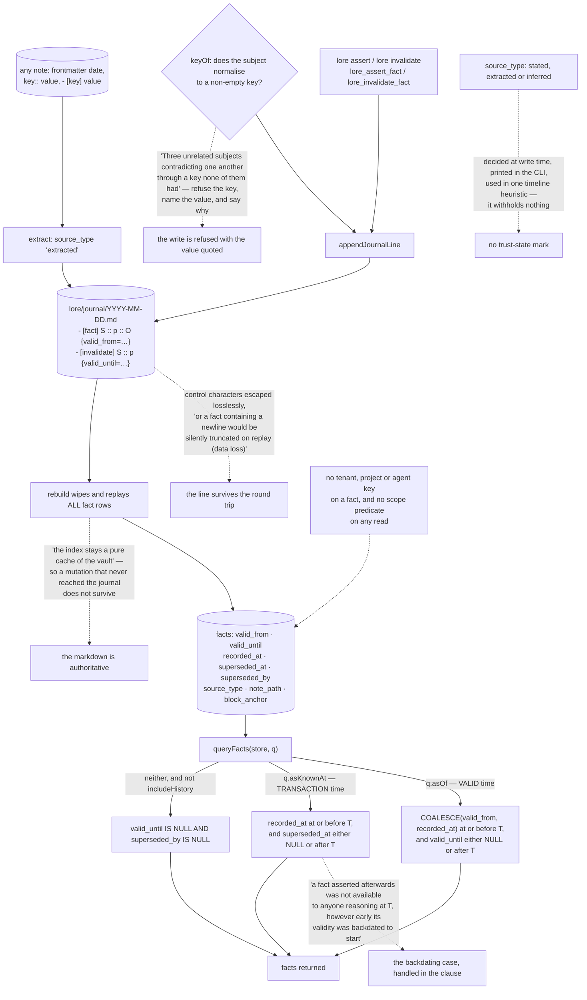

## 1. Executive Summary

Loreweave is "[a] temporal knowledge engine for markdown vaults" that "indexes,
links, remembers, forgets, and dreams — locally, over files you own." MIT,
TypeScript, version 0.37.1, 19,552 lines across 100 files, a SQLite index over a
directory of markdown.

Its diagnosis is that most knowledge tools are **write-only**: "You capture
diligently, the vault grows, and six months later you can't find the thing you
know you wrote — because retrieval is keyword search over prose, nothing ever
resurfaces on its own, and nothing notices when what you wrote last year stopped
being true."

**The architectural decision worth taking is which artifact is authoritative.**

> "Fact lines in markdown are the durable record; DB fact rows are a replay."

Every assertion appends `- [fact] Subject :: predicate :: Object {valid_from=…}`
to a dated file under `lore/journal/`, every closure appends
`- [invalidate] Subject :: predicate {valid_until=…}`, and "[r]ebuild wipes and
replays ALL fact rows deterministically, so the index stays a pure cache of the
vault." A fact an agent got wrong is corrected by editing a line in a file the
user already owns, and the index follows.

**The temporal model is the most complete of the several this atlas has read
with these four columns.** `queryFacts` takes `asOf` and `asKnownAt` as separate
parameters and builds separate predicates — the first over `valid_from` and
`valid_until`, the second over `recorded_at` and `superseded_at` — and the
comment on the second says exactly why it is a different question:

> "Known at T: recorded by then, and not yet superseded by then. A fact asserted
> afterwards was not available to anyone reasoning at T, however early its
> validity was backdated to start."

Backdating is the case that separates a real transaction axis from a decorated
one, and it is handled in the clause rather than left to the caller. Valid time
comes from somewhere other than the clock: a note's frontmatter `date`,
`event_date`, `created` or `valid_from`, a trailing `{valid_from=…}` annotation,
or an explicit argument.

## 2. Mental Model

A **fact line** in markdown is the record; the row is a copy.

A **valid window** is when it was true; **recorded_at** is when the vault learned it.

An **invalidate line** closes a fact at a date rather than deleting it.

A **rebuild** is allowed to wipe the database, because nothing lives only there.

## 3. Architecture

| Area | Role |
| --- | --- |
| `src/facts/journal.ts` | The markdown record, its grammar, and the escaping that keeps it lossless |
| `src/facts/model.ts` | Assert, invalidate, supersession, and the bitemporal query |
| `src/temporal/` | Date extraction from notes, and the timeline |
| `src/store/schema.ts` | Eleven tables, all of them derivable from the vault |
| `src/dream/` | Consolidation, link proposals, and the fitted forgetting curve |
| `src/mcp/server.ts` | Fifteen `lore_*` tools |
| `eval/` | LoCoMo, LongMemEval, BEIR and scale harnesses against a committed baseline |

## 4. Essential Implementation Paths

`src/facts/journal.ts:1-11` — the sentence the architecture rests on, and the
fact-line grammar under it.

`src/facts/model.ts:296-328` — two time axes as two query parameters, and the
backdating comment.

`src/facts/model.ts:41-50` — `keyOf`, refusing a subject that normalises to
nothing.

`src/facts/model.ts:340-360` — an aggregate that returns its total because the
bug it replaces was a caller not asking.

`src/temporal/dates.ts:205-206` — where valid time comes from when it is not
supplied.

## 5. Memory Data Model

A fact is subject, predicate and object with a display form preserved beside the
normalised key, a validity window, a recorded time, supersession columns, a
source type, the note path and block anchor it came from, and a confidence.
Around it sit notes, blocks, links, entities, mentions, edges, embeddings and an
access log — every one of them derivable from the vault, which is what licenses
the rebuild.

## 6. Retrieval Mechanics

Lexical search over blocks, embeddings, and a graph walk over entity mentions
and edges, with a rerank stage. A retrievability decay is fitted from the vault's
own retrieved-then-used history rather than assumed, and `lore review` surfaces
what has faded below the threshold. The default fact query returns only facts
that are neither expired nor superseded; `includeHistory` returns the chain.

`lore review` is a listing, not a gate, and neither is anything else here, which
is why this report does not carry `human_review`. `lore facts`, `lore timeline`
and `lore invalidate` act on facts already in the index; the vault is markdown,
so a person can equally open the journal file and edit the line an agent wrote,
and the next rebuild replays the corrected file. The one surface that calls
itself adjudication is addressed to the wrong reader: `lore_propose_facts`
returns candidates *"for you to adjudicate"* and says it *"keeps judgement with
you and out of the index"*, but it is an MCP tool description, so the "you" is
the model. A candidate promoted through it has been reviewed by the same kind of
thing that proposed it.

## 7. Write Mechanics

A write is refused rather than accepted quietly when it cannot be made
meaningful: a subject that normalises to an empty key, or a `validUntil` before
its `validFrom`, which "[a]ccepted silently … produced intervals like
(2025-01-01 → 2024-06-01), which no query can answer and nothing flags." A
successful write appends its journal line first and indexes the journal file,
so the durable record and the cache are written in that order.

## 8. Agent Integration

Fifteen MCP tools spanning search, fact assertion and invalidation, timeline,
aggregation, context packing, session resume and the review list, plus a `lore`
CLI with the same operations and a file watcher.

## 9. Reliability, Safety, and Trust

Provenance is concrete — every extracted fact keeps the note path and block
anchor it came from — and the rebuild-from-vault property means the failure mode
of a corrupted index is a re-index rather than data loss. The gaps are scope,
which does not exist, and the absence of any epistemic status separate from
supersession.

## 10. Tests, Evals, and Benchmarks

A vitest suite whose test names read as regressions with the fault named — one
edit erasing a note's whole retrieval history, one use relabelling a week of
ignored retrievals as successes — alongside an `eval/` directory running LoCoMo,
LongMemEval, BEIR, generated questions and a scale harness against a committed
baseline. There are no committed must-not-retrieve cases.

## 11. For Your Own Build

Decide which artifact is authoritative and make the other one disposable. Being
able to wipe and replay the index is what makes every other correction cheap.

Take the empty-key refusal. Any normalisation that can produce an empty string
will eventually collapse unrelated records into one slot, and the failure is
silent — the reproduction in that comment is worth reading before you write your
own `normalizeKey`.

If you offer an aggregate with a cap, return the total. An opt-in total is the
same design as no total.

## 12. Open Questions

Whether a vault is really the intended boundary once several agents share one.
Nothing carries a scope key, so a fact asserted for one project is visible to
every query.

Whether `source_type` was meant to influence retrieval. It has three values,
one of which is `inferred`, and a reader would reasonably expect an inferred
fact to be treated differently from a stated one; nothing does.

## Appendix: File Index

| Path | What to read it for |
| --- | --- |
| `src/facts/journal.ts:1-11` | Markdown as the record and the database as a replay |
| `src/facts/model.ts:296-328` | Two time axes as two parameters, backdating included |
| `src/facts/model.ts:41-50` | A normalisation that refuses to produce an empty key |
| `src/facts/model.ts:340-360` | Why the total is returned rather than requested |
| `src/temporal/dates.ts:205-206` | Where valid time comes from when nobody supplies it |

## History

**2026-09-19** — audited at the unchanged pin [`8fe4c5a2961f46732aa60ce9d8753f0c7818ddc7`](https://github.com/lets-order-some-fries/loreweave/commit/8fe4c5a2961f46732aa60ce9d8753f0c7818ddc7); nothing upstream moved, so the correction is ours. `human_review` is **withdrawn**, and the withdrawn record had already found the decisive fact and filed it as a limit instead of a disqualification: `lore_propose_facts` keeps judgement *"with you"*, but it is a tool description, so the reviewer it addresses is the model. The rest of the surface is correction rather than review — `facts`, `timeline` and `invalidate` act on facts already in the index, and because the vault is markdown a person can edit the journal line directly, which the next rebuild replays. Nothing in `src/` holds a fact pending anyone. `bitemporal` and `audit_log` stand. Screened again first; nothing was installed and no suite was run.

**2026-09-16** — [`8fe4c5a2961f46732aa60ce9d8753f0c7818ddc7`](https://github.com/lets-order-some-fries/loreweave/commit/8fe4c5a2961f46732aa60ce9d8753f0c7818ddc7) — first reading, at a commit dated 15 September 2026. Screened before opening, from a shallow clone: four files scanned, one auto-run surface, one build-time execution point, one unpinned dependency surface and two dependency files inside the seven-day cooldown, with `package-lock.json` present. Nothing was installed, built or run.
