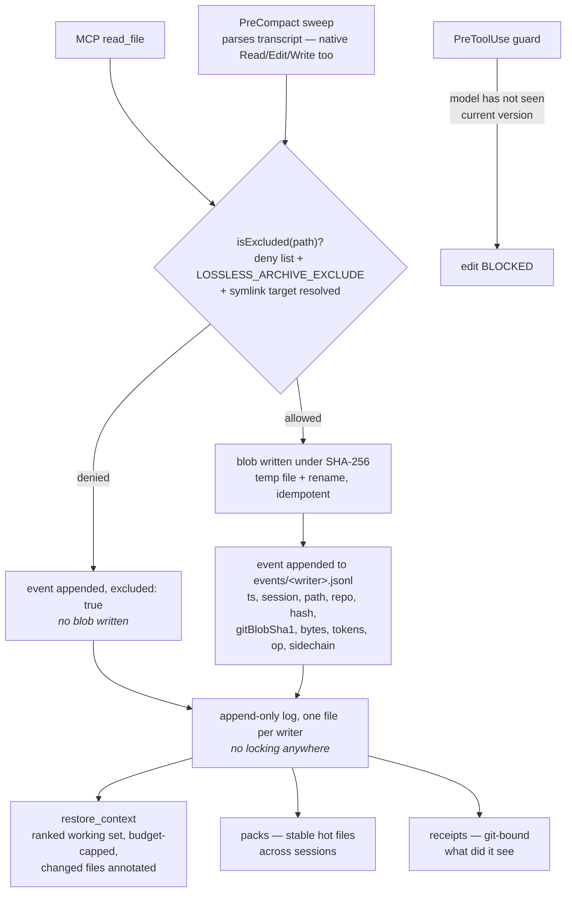

## 1. Executive Summary

lossless-context-mcp is a flight recorder for a coding agent's context — MIT,
TypeScript, roughly 4,800 lines across seventeen modules, 20 commits and 4
contributors since 31 May 2026. It archives every file version the agent was
shown, content-addressed, with an append-only event log of when and how, and
stands four products on that substrate: **restore** (put the working set back
after a compaction), **packs** (one cache-friendly prefix for a fan-out fleet),
**receipts** (git-bound attestation of exactly what the model saw), and
**metering** (where the read tokens went).

The engineering is careful and well argued throughout, but the reason this
report exists is `BENCHMARK.md`, which is the most honest benchmark document in
this corpus.

It defines two mandatory metrics. Savings is `1 − (sent / baseline)` with a real
tokenizer. Losslessness is a **byte-for-byte reconstruction of the view the model
would hold, after every single operation**, where *"one divergence = fail"* —
and the document states the reason a savings number alone is not a result: *"A
savings number without a reconstruction proof is a marketing number."*

Then it publishes three workloads, and the headline is the one that does not
flatter the project. The synthetic ceiling saves **72.1%**. The synthetic floor
saves **0.0%** — correct, since first-contact reads must never be reduced. And
the real-session replay, over 1,839 transcripts and 16,823 reads, measures
**−1.4%**: the tool costs tokens. A re-measurement on a grown corpus of 3,363
transcripts and 26,041 reads puts it at **−2.6%**.

The explanation is given rather than hedged around: only 7–8% of reads are
re-reads, the median session re-reads nothing, most re-reads arrive *changed*,
and a unified diff regularly exceeds the content it patches — because *"the
harness's native file-state cache already eliminated redundant re-reads."* The
document even grades a competing approach through the same harness on the same
corpus, at −0.2%. And it draws the general rule: *"Any context tool that quotes
only its ceiling is quoting the wrong number."*

A project publishing, as a headline table row, that its compression feature has
negative value on the workload people actually run is rare enough to be the
finding. It also reframes the system: what remains valuable is everything the
benchmark does *not* score — surviving compaction, blocking a blind edit, and
proving after the fact what the model saw.

## 2. Mental Model

Two ideas do the work.

**A file version is a memory with an identity, and the identity is its content.**
Blobs are stored under the SHA-256 of what they contain, with a git blob sha1
recorded beside it so a version can be tied to a commit. Writes are idempotent by
construction — temp file then rename — and the design note draws the conclusion
that matters operationally: *"two writers racing on the same hash produce the
same bytes."*

**Concurrency is designed away rather than locked away.** Each writing process
appends only to its own `events/<writer>.jsonl`. There is no lock anywhere in the
archive, and multi-process safety is a property of the file layout instead of a
protocol anyone has to honour. Readers merge the logs.

The third idea is the one worth stealing, and it is about what *not* to store.
Paths matching a secret deny list are never written to blobs — but the event is
still appended, carrying `excluded: true`. **The record that the agent read
something survives; the content does not.** Most systems facing this choice drop
both, and lose the ability to say afterwards what was touched.

## 3. Architecture

Seventeen modules. `archive.ts` is the substrate. `sweep.ts` parses transcripts.
`guard.ts` and `session-guard.ts` decide whether an edit may proceed.
`restore.ts` writes and reads working-set manifests. `pack.ts`, `slice.ts` and
`outline.ts` shape what gets emitted. `receipt.ts` and `gitid.ts` do attestation.
`meter.ts` does the token accounting. `presence.ts` and `blame.ts` handle
multi-agent coordination.

Five hooks in `hooks/` are the integration surface, and the screen flags the
directory as auto-running for exactly that reason: these are scripts a harness
executes on its own schedule.

## 4. Essential Implementation Paths

**The guard's self-vouch rule** is the sharpest piece of reasoning in the
repository, and it is a general lesson about any system that decides whether a
caller has earned a permission by reading a log the caller is already in:

> SELF-VOUCH RULE (the guard's load-bearing invariant): for guarded tools
> (Edit/Write/MultiEdit), only tool RESULTS may mark a file as seen — never the
> tool_use intent block. The current call's own tool_use is already in the
> transcript when PreToolUse fires, so intent-based marking would let every edit
> approve itself … Results only exist after successful execution, so a pending
> call can never vouch for itself, regardless of hook/transcript write ordering.

The exception is stated with its failure direction named rather than buried:
intent-based marks are allowed for the server's own read tools, where *"worst
case here is a false ALLOW when a read later errors, which is the fail-open
direction."* Knowing which way your exception fails, and writing it down beside
the exception, is the practice this atlas keeps asking for.

**The sweep** runs on the compaction path, which means its cost is a
correctness constraint rather than a nice-to-have. The README publishes the
measurement — one real 14 MB transcript swept in 361 ms — and ships the command
to reproduce it on your own transcript.

## 5. Memory Data Model

`ArchiveEvent` carries `ts`, `session`, `path`, `repo`, `hash` (SHA-256 of the
content version), optional `gitBlobSha1`, `bytes`, `approxTokens`, `source`
(`mcp` or `sweep`), `op` (`read`, `edit` or `write`), `view`, and two booleans
worth naming: `sidechain`, true when the event came from a subagent transcript
line, and `excluded`, true when the path matched the deny list.

`sidechain` is a small field with a large implication. Subagent transcripts are a
known contamination source for systems that mine transcripts for durable content
— this atlas found exactly that failure in another system read the same day.
Here the provenance is recorded on the row rather than the subagent runs being
silently folded in or silently dropped, which leaves the decision to the consumer.

## 6. Retrieval Mechanics

There is no search index and no ranking model. Retrieval is re-emission from a
ranked working set: `restore_context` replays the manifest from **current disk
state**, capped by a token budget, *"annotating any file that changed since the
model last saw it."*

That annotation is the part that matters. Re-emitting a stale copy would be worse
than not restoring at all, because the model would proceed confidently on a file
that has since moved. Marking drift at the moment of restore keeps the mechanism
honest about the one thing it cannot control — the disk.

## 7. Write Mechanics

Hook-fed and append-only. The PreCompact sweep parses the session transcript and
archives everything the session touched, explicitly including native `Read`,
`Edit` and `Write` results rather than only this server's own MCP reads — which
is what makes it a recorder of the agent's context rather than of its own usage.

Nothing is ever updated. A changed file is a new blob under a new hash, and the
old version remains addressable.

## 8. Agent Integration

An MCP server plus five hooks: `sweep-transcript` at PreCompact,
`inject-manifest` at SessionStart(compact), `guard-edit` at PreToolUse,
`publish-edit`, and `reset-epoch`. The demo recordings in the README are
generated by a script that *"drives the real hooks and server and renders what
they actually said"*, and the README tells the reader to re-run it — a
recording generated from the shipped code is a materially different claim from a
recording made by hand, and the distinction is stated rather than assumed.

## 9. Reliability, Safety, and Trust

Secret hygiene is the strongest part, and it is tested where it should be. The
deny list covers `.env`, `.env.production`, a Windows-shaped `.env.local` and
`secrets.json`; a near-miss (`environment.ts`) is asserted **not** to be denied,
which is the half of a deny-list test that usually goes missing; a
user-supplied `LOSSLESS_ARCHIVE_EXCLUDE` glob is honoured; and there is a case
for *"an innocuously named symlink pointing at a secret"*, so the check resolves
the target rather than trusting the name.

There is no epistemic state on content — nothing stored is a claim, and a blob
is a byte sequence the model was shown. What the system does track is whether the
model has seen the *current* version of a file, and it refuses an edit when it
has not. That is authorization derived from history rather than a trust ladder,
and the trust mark is withheld for that reason.

Scope is recorded but not enforced on a read path: `session` and `repo` sit on
every event and manifests are per-session files, while the boundary that is
genuinely enforced — the deny list — is applied at write time. A reader wanting
tenant-style isolation should not read the recorded keys as one.

## 10. Tests, Evals, and Benchmarks

Twelve test files covering the archive, engine, guard, session guard, receipts
(two generations), restore and packs, slice, sweep, meter, presence and blame.

The benchmark is covered in section 1 and is the reason to read this repository
even if you never install it. Three properties are worth restating as
transferable practice:

- **Losslessness is a gate, not a metric.** Reconstruct the model's view after
  *every* operation and compare byte-for-byte; one divergence fails the run.
- **Publish the floor and the ceiling and the realistic case**, and let the
  realistic case be the headline when it is the unflattering one.
- **Grade the competitor through your own harness on your own corpus**, and
  publish that number too — here, −0.2% for a marker-only dedup approach, which
  makes the −2.6% legible as a property of the workload rather than of the tool.

What is not committed is the raw per-transcript output. The corpus is the
author's own `~/.claude/projects` history and cannot be published, which is
stated; the harness and the commands to re-run it on your own history are
shipped, which is the reproducible half of the claim and is the right trade for
a corpus made of private transcripts.

## 11. Patterns Worth Stealing

**Record the access, withhold the content.** `excluded: true` keeps the audit
trail complete while the secret never lands on disk. Dropping the event too
would make the archive quietly incomplete in exactly the cases someone will later
ask about.

**Design concurrency out of the format.** One append-only file per writer plus
content-addressed idempotent blobs removes the need for a lock, and therefore the
need for every future writer to remember one.

**A pending call must never vouch for itself.** Any check that reads a log the
subject is already in has this bug available to it; the fix is to accept only
evidence that could not exist before the fact.

**Name the direction your exception fails in.** "The fail-open direction",
written beside the exception, tells the next reader what they are trading.

**Annotate drift at re-emission.** Restoring from current disk is right; saying
which files moved since the model last saw them is what keeps it safe.

**Publish the number where you lose.** The credibility the −2.6% row buys is
worth more than the 72.1% row it sits beside, and the document says why.

## 12. Open Questions

- What is the system worth when the compression is worth nothing? Restore,
  coordination and receipts are the surviving value and none of them is scored by
  the benchmark; the project has built the harness culture to measure them and
  has not pointed it at them.
- Does the archive have a retention policy? Every version of every file the
  agent ever read is kept, content-addressed, and no eviction, TTL or size cap
  appears in the archive module.
- What does a consumer do with `sidechain`? The provenance is recorded on every
  event, and whether ranking, packs or receipts treat a subagent read differently
  from a main-thread read is not something the field's presence answers.
- Is `excluded: true` reachable in a receipt? An attestation of what the model
  saw is most interesting precisely where content was withheld, and how a
  receipt renders an excluded event decides whether the audit trail survives into
  the artifact people would actually show someone.

## Appendix: File Index

| Path | What it carries |
| --- | --- |
| `src/archive.ts` | The content-addressed store, the event schema, the deny list, and the no-locking argument |
| `src/guard.ts` | The self-vouch rule and the edit decision |
| `src/session-guard.ts` | Single-claim coordination between concurrent agents |
| `src/sweep.ts` | Transcript parsing at PreCompact, including native Read/Edit/Write |
| `src/restore.ts` | Working-set manifests, per-session, and budget-capped re-emission |
| `src/receipt.ts`, `src/gitid.ts` | Git-bound attestation of exact versions |
| `hooks/` | The five Claude Code hooks — the auto-running surface the screen flags |
| `test/archive.test.ts` | Deny-list cases, the near-miss, the glob, and the symlink |
| `BENCHMARK.md` | Two mandatory metrics, three workloads, and the negative headline |

## History

**2026-08-19** — [`47440a012e701fd8eddd4167fb5c3fa7faa44fdb`](https://github.com/NORTHTEKDevs/lossless-context-mcp/commit/47440a012e701fd8eddd4167fb5c3fa7faa44fdb)
— first reading. Screened before reading: two auto-run surfaces — the `hooks/`
directory, which is the product, and `server.json`, an MCP manifest — one
build-time `package.json` lifecycle script, one unpinned range with a
`package-lock.json` beside it. Nothing was installed and nothing was executed;
the benchmark numbers were read rather than reproduced, and the corpus they were
measured on is the author's own transcript history and is not published.
