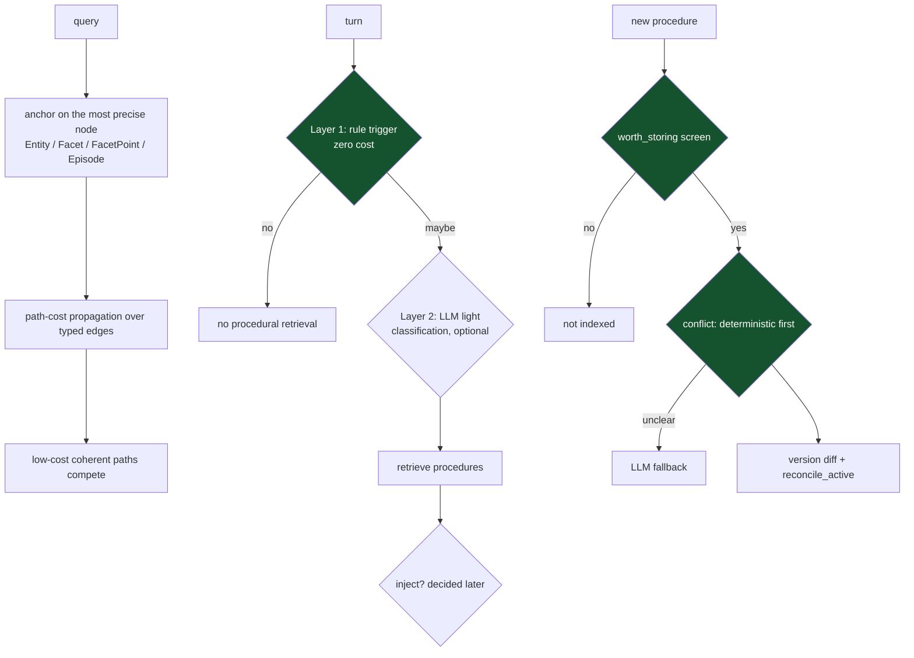

## 1. Executive Summary

M-flow is a graph memory engine: about 149,000 lines of Python, Apache-2.0, 206
commits since 4 April 2026. It ships a server, an MCP interface, a
frontend, worker queues, a starter kit and an OpenClaw skill.

The retrieval model is the reason to read it. A query lands on **the most precise
anchor it can find** — an Entity, a Facet, a FacetPoint or an Episode — and
evidence then spreads outward over typed edges, where *"each hop expands the
semantic field, but each edge also adds cost. This means association is not a
random graph walk: only paths with coherent, low-cost connections remain
competitive."* The README's own illustration is a classmate who grew up in
California opening a California neighbourhood, within which the Lakers become the
next low-cost hop.

That places M-flow as a third point on an axis this atlas already has two of.
[NOOA Memory](../nooa-memory/) implements ACT-R spreading activation with a fixed
per-hop decay; [HippoRAG](../hipporag/) replaces ranking with PageRank diffusion.
M-flow scores *paths* rather than nodes, so the unit of competition is a chain of
associations and its accumulated cost. Its stated corollary — *"one strong path
is enough"* — is the design's whole bet, and it is the opposite of a system that
requires corroboration from several directions.

**The mechanism worth taking is a discipline rather than a component.** Three
separate places in the procedural half put a cheap deterministic check in front
of an expensive model call, and say so in the docstring each time:

- `retrieval/gating/procedural_trigger.py` — *"Two-layer trigger mechanism:
  Layer 1: Rule trigger (zero cost). Layer 2: LLM light classification (low cost,
  optional)."*
- `memory/procedural/versioning/conflict_detector.py` — *"Two-level conflict
  detection: Deterministic first, LLM fallback."*
- `memory/procedural/governance/worth_storing.py` — a `WorthSignal` screen that
  decides *"whether Procedure is worth storing and indexing"* before anything
  builds one.

This is the [gate the expensive path](../../patterns/gate-the-expensive-path/)
pattern applied at three points rather than one. Doing it three times, at trigger, at conflict
and at capture, with the cost tier named in the comment, is the thing to copy.

The trigger module makes a second distinction worth naming. It separates *should
we retrieve* from *should we inject*: **"Triggers procedural retrieval if any
condition is met (but whether injection is used is decided later)."** Retrieval
being cheap and injection being expensive — in tokens, and in the risk of
polluting a prompt — is a real asymmetry, and it is modelled here as two
decisions.

**The numbers live mostly outside the repository.** The README reports LoCoMo-10
at 81.8% and LongMemEval at 89% LLM-judged, against Cognee, Zep, Mem0 and
Supermemory under one answer and judge model, and points to a separate
`mflow-benchmarks` repository for scripts and raw data; nothing here was run to
check them. Inside the tree, `m_flow/eval` scores the procedural trigger on twenty
cases — including six that must not trigger — against a committed baseline.

**Search is scoped by dataset permission.** Like the Cognee code it shares
lineage with, M-flow resolves the datasets a user may read before any retriever
runs, and turns that on by default when the storage handlers support per-dataset
databases. A committed test shows each user seeing only their own dataset until a
grant.

## 2. Mental Model

Two halves with different shapes.

**Semantic and episodic memory is a typed graph.** Entities carry Facets, Facets
carry FacetPoints, Episodes anchor to all of them. The README's argument for the
unified graph is against layered stores: *"Some memory systems keep separate
layers for episodic memories, atomic facts, entities, or summaries. When these
layers are queried separately, retrieval tends to work best when the user's query
matches the selected layer."* Anchoring on whichever node type is most precise,
then spreading, is meant to remove the layer-selection problem — which is a real
problem, and one [MemOS](../memos/) answers by mounting the layers and
[MemPalace](../mempalace/) by making one layer authoritative.

**Procedural memory is versioned.** A procedure is built from key points and
context points (`ContextPointDraft`, `KeyPointDraft`, `ProcedureState`), screened
by `worth_storing`, classified, and then governed: `conflict_detector` compares a
new version against the existing one, `generate_version_diff` produces *"change
descriptions between versions"*, and `reconcile_active` decides which version is
live. `update_usage_stats` records use.

The three green boxes are the same idea in three places: spend nothing before you
spend something.

## 3. Architecture

Four deployable pieces — `m_flow` (the engine), `m_flow-mcp`, `m_flow-frontend`,
`mflow_workers` — plus `m_flow-starter-kit`, an `openclaw-skill`, Alembic
migrations, a Dockerfile and compose file, and quickstart scripts for shell and
PowerShell. This is a product, not a library, and the operator cost is
correspondingly higher than most of this atlas: a graph database, a worker queue,
and a frontend.

`m_flow/retrieval/` alone is a substantial subsystem — a base graph retriever, a
Cypher search retriever, lexical and Jaccard retrievers, an episodic bundle
search, a unified triplet search, a memory orchestrator and registered community
retrievers. The plurality is worth noting honestly: several retrieval strategies
coexist, and which one runs for a given query is decided by the orchestrator
rather than being a single documented path.

Writes go through workers — `queued_add_memory_nodes.py` and
`memory_node_saving_worker.py` — so node creation is queued and saved out of
band. That is the right shape for a graph write under load and it means a memory
is not immediately retrievable; the lag was not established.

## 4. Essential Implementation Paths

| Path | Location |
| --- | --- |
| Two-layer procedural trigger, cost tiers named | `m_flow/retrieval/gating/procedural_trigger.py` |
| Two-level conflict detection, deterministic then LLM | `m_flow/memory/procedural/versioning/conflict_detector.py` |
| Worth-storing screen before indexing | `m_flow/memory/procedural/governance/worth_storing.py` |
| Version diffs between procedures | `m_flow/memory/procedural/versioning/generate_version_diff.py` |
| Which version is live | `m_flow/memory/procedural/governance/reconcile_active.py` |
| Sensitivity screen on procedural content | `m_flow/memory/procedural/safety/sensitivity.py` |
| Retrieval strategies and the orchestrator | `m_flow/retrieval/` |
| Queued node writes | `mflow_workers/tasks/queued_add_memory_nodes.py` |

## 5. Memory Data Model

The graph side is Entity / Facet / FacetPoint / Episode with typed edges, and the
precision ordering matters: a FacetPoint is finer than a Facet, which is finer
than an Entity, and the anchor step prefers the finest match. That is a
deliberate inversion of the usual approach, which embeds a chunk and searches for
neighbours.

The procedural side is the one with lifecycle. `ProcedureState` holds
`ExistingKeyPoint` and `ExistingContextPoint` records; drafts are built as
`ContextPackDraft` and `KeyPointsPackDraft` before becoming a version. Versioning
gives a procedure a history, a diff against its predecessor, and an active
pointer — correction machinery comparable to
[TigrimOSR](../tigrimosr/)'s staged proposal, without its human approval.

Two marks, `scope_enforced` and `negative_eval`, both on the permission layer
and its test (section 9). There is no status field that withholds a memory from
use, no record of a rejected value, and no validity time separate from record
time. `sensitivity.py` screens procedural content and is a safety filter rather
than an epistemic state.

## 6. Retrieval Mechanics

Path-cost propagation, described in section 1. What can be said from the code is
that the machinery is real and plural: `base_graph_retriever`,
`cypher_search_retriever`, `unified_triplet_search`, `episodic/bundle_search`,
`lexical_retriever`, `jaccard_retrival`, coordinated by `memory_orchestrator`.

Two observations a reader should carry.

**"One strong path is enough" is a precision bet, and the atlas's evidence runs
both ways.** A single coherent chain of associations is exactly how a useful
recall often works, and it is also exactly how a confident wrong answer works.
[Graphify](../graphify/) requires two distinct corroborating results before a
claim counts and [CLIO](../clio/) requires two distinct sources; M-flow's
position is the opposite and it is a defensible one for recall as opposed to
belief. Which is right depends on whether the retrieved thing is treated as a
lead or as a fact, and the graph does not distinguish.

**Cost is the ranking signal and its calibration is not visible.** The
competitive property depends on the per-edge costs being right relative to each
other; nothing in the repository measures them against a labelled set, so the
weights are asserted.

## 7. Write Mechanics

Episodic capture first, then procedural extraction from episodes
(`write_procedural_from_episodic.py`), screened by `worth_storing` and routed by
`procedure_router`. Node writes are queued to workers, so the write path does not
block the agent and the store is eventually consistent with the conversation.

The governance sequence is the careful part and it reads in the right order:
decide whether this is worth keeping at all, classify it, check it against what
already exists deterministically, escalate to a model only when the deterministic
check is inconclusive, produce a diff, then decide which version is active. Each
step has a module and a name.

## 8. Agent Integration

An MCP server, an OpenClaw skill published to a plugin hub, a frontend, and a
starter kit. The procedural trigger's separation of retrieval from injection is
the integration-relevant idea: an agent can be told procedures exist without
paying to put them in the prompt, and the decision to inject is made with more
information than the decision to look.

No human review surface was found — the frontend exists and what it exposes was
not established, so `human_review` is withheld rather than denied.

## 9. Reliability, Safety, and Trust

**`scope_enforced` — earned, on datasets.** Every dataset carries stored
permissions (`m_flow/auth/models/ACL.py`, `Permission.py`, tenant and role
defaults). `search` checks `backend_access_control_enabled()`; when it holds,
`_authorized_search_impl` resolves `get_authorized_existing_datasets(datasets,
permission_type="read", user)` — every readable dataset when none is named, only
the permitted subset otherwise — and each retriever then runs inside one
authorized dataset's database context. The switch is on when
`ENABLE_BACKEND_ACCESS_CONTROL` is unset and the graph and vector handlers support
dataset isolation, which the `kuzu` and `lancedb` defaults do; set to `true`
without support it raises; any other value disables it and search runs through
`no_access_control_search` with no dataset context at all.

**`negative_eval` — earned.** `m_flow/tests/test_permissions.py`, run by
`e2e_tests.yml`, has two users ingest separate datasets and asserts each user's
search returns exactly one result from their own; writing, memorizing or granting
into the other user's dataset raises `PermissionDeniedError`; after a `read`
grant the same search returns both. The procedural eval adds six negative cases
that must neither trigger nor inject a procedure.

**`audit_log` — withheld.** `GraphRelationshipLedger` describes itself as an
*"append-only ledger that records every graph-edge lifecycle event"*, and a
decorator on the graph interface inserts a row per added node and edge with the
calling function. It is not append-only in use: a deletion runs an `UPDATE`
setting `deleted_at` on the existing rows (`api/v1/delete/delete.py:144-152`),
and a failed insert is logged at debug and rolled back.

`safety/sensitivity.py` screening procedural content before storage is the one
explicit safety mechanism found, and screening *procedures* specifically is a
sensible target: a stored procedure is an instruction the agent will follow
later, which is a higher-consequence artifact than a stored fact.

The versioning machinery is the reliability strength. A procedure that changes
leaves a diff and a previous version, and `reconcile_active` makes which one is
live an explicit decision rather than an implicit last-write-wins.

Against that, there is no trust state, so nothing distinguishes a procedure the
system is confident in from one extracted once from an ambiguous episode, and
`update_usage_stats` records use without use gating anything.

## 10. Tests, Evals, and Benchmarks

There is a `conftest.py` at the root, unit tests under `m_flow/tests/unit/`, and
end-to-end scripts such as `test_permissions.py` run by `e2e_tests.yml`. Nothing
was run for this review — the system expects a graph database and a worker queue.

**`m_flow/eval` is a procedural-retrieval harness.** `python -m m_flow.eval
--dataset procedural_eval_v1.jsonl --compare-baseline` runs twenty cases —
seven explicit procedures, four implicit tasks, three micro-actions and six
negatives such as small talk and arithmetic — and reports recall@1-3, active-hit,
false-positive injection, context completeness, step presence, trigger accuracy
and an overshadow rate for procedures crowding out episodic context. The
committed baseline, dated January 2026, records trigger accuracy 0.85, recall@1
0.6 and a false-positive injection rate of 0.1; it is a stored file, not a run
here.

**The headline benchmarks are elsewhere.** The README's LoCoMo-10 and
LongMemEval tables — M-flow at 81.8% and 89% LLM-judged, with Cognee, Zep, Mem0
and Supermemory under the same answer and judge models — cite a separate
`mflow-benchmarks` repository for reproduction scripts and raw data, which was
not read. What remains uncalibrated in this repository is the per-edge cost that
makes paths compete.

## 11. For Your Own Build

### Steal

**Front every expensive check with a cheap deterministic one, and name the
tiers.** Three modules do this — trigger, conflict detection, worth-storing — and
each docstring states the cost of each layer. The pattern is common; stating the
cost model in the comment is what makes it reviewable, because a reader can see
immediately which path costs a model call.

**Separate "should we retrieve" from "should we inject".** Retrieval is cheap and
reversible; injection spends tokens and changes what the model believes. Deciding
them at different moments with different information is a distinction worth
drawing explicitly.

**Screen before you index, not after.** `worth_storing` runs before a procedure
is built and indexed, so the cost of a bad memory is avoided rather than cleaned
up, instead of extracting everything and pruning later.

**Version a procedure and generate the diff.** A stored procedure is an
instruction the agent will follow; being able to see what changed between
versions, and which version is active, is the minimum for trusting it.

### Avoid

**Do not let "one strong path is enough" be the same rule for leads and for
facts.** A single low-cost chain is a good reason to look somewhere and a weak
reason to believe something. If retrieved material is going to be stated as
fact, the corroboration requirement has to live somewhere.

**Do not keep the retrieval evidence out of the tree it describes.** The argument
against layered stores is the reason to choose this system, and its measurement
lives in a separate repository while the per-edge costs stay uncalibrated here.

### Fit

Take M-flow if you want graph memory with real procedural governance and you can
operate a graph database, workers and a frontend. The versioning, the
worth-storing screen and the tiered gates are the parts that transfer, and the
first two are small enough to lift.

Do not take it if you need to evaluate before adopting: 149,000 lines across four
packages, several coexisting retrieval strategies, and benchmarks published outside the
tree mean the way to know whether the path-cost model works for your corpus is to
run it on your corpus.

## 12. Antipatterns / Risks

- **Retrieval results published outside the repository** for a system whose
  thesis is retrieval quality.
- **Access control can be switched off by one environment value**, and search
  then runs with no dataset context.
- **Edge costs are the ranking signal and are uncalibrated** against any labelled
  set in the repository.
- **Several retrieval strategies coexist**, and which runs when is an
  orchestrator decision rather than a documented path.
- **No trust state**, so a once-extracted procedure and a well-established one
  are indistinguishable at read time.
- **Queued writes** mean a lag between capture and retrievability that the
  repository does not quantify.

## 13. Build-vs-Borrow Takeaways

Borrow the three-gate discipline and the procedural versioning. Both are
independent of the graph, both are a few hundred lines, and the gate pattern
applies to any pipeline where a model call sits behind a decision a regex could
often make.

Build the evaluation. M-flow is arguing a specific, testable claim — anchor plus
path cost beats layer selection — against a baseline it names. The experiment is
well defined and its scripts sit in a separate repository.

## 14. Open Questions

- **What are the edge costs, and where did they come from?** They are the ranking
  signal and no calibration was found.
- **Which retriever runs for which query?** Seven coexist under an orchestrator.
- **What does the frontend expose?** Whether it is a review surface or a viewer
  decides a capability mark.
- **How long between a queued node write and retrievability?** The workers make
  this a real number and it is not stated.

## 15. Appendix: File Index

| File | Role |
| --- | --- |
| `m_flow/retrieval/` | Graph, Cypher, lexical, Jaccard and episodic retrievers, and the orchestrator |
| `m_flow/retrieval/gating/procedural_trigger.py` | Two-layer trigger, retrieval separated from injection |
| `m_flow/memory/procedural/governance/` | `worth_storing`, classifier, `reconcile_active`, usage stats |
| `m_flow/memory/procedural/versioning/` | Conflict detection and version diffs |
| `m_flow/memory/procedural/safety/sensitivity.py` | Screening on procedural content |
| `m_flow/memory/episodic/` | Episodic capture and state |
| `m_flow/search/methods/search.py`, `m_flow/data/methods/get_authorized_existing_datasets.py` | Authorized search over readable datasets |
| `m_flow/context_global_variables.py` | `backend_access_control_enabled` and the handler-support check |
| `m_flow/auth/` | ACL, permission, tenant and role models |
| `m_flow/tests/test_permissions.py` | Cross-user dataset isolation and grants |
| `m_flow/eval/` | Twenty-case procedural eval with a committed baseline |
| `m_flow/data/models/graph_relationship_ledger.py` | Node and edge ledger, updated on delete |
| `mflow_workers/` | Queued node writes and the saving worker |
| `m_flow-mcp/`, `m_flow-frontend/`, `openclaw-skill/` | Interfaces |

## History

**2026-09-15** — [`0d585cda2f588af69fb872ae6914caba0c217816`](https://github.com/FlowElement-xinliuyuansu/m_flow/commit/0d585cda2f588af69fb872ae6914caba0c217816) — one commit on, 2026-08-03, updating repository references after the move to `FlowElement-xinliuyuansu`; no code changed. Screened before reading: no auto-run surface, five build-time execution points, five unpinned surfaces and an agent-instruction file read as data; nothing was installed or run. Read again against that tree, three findings of the first reading were wrong at the earlier pin and are corrected. The retrieval path applies dataset read permissions by default, so `scope_enforced` is added; `test_permissions.py` asserts each user sees only their own dataset until a grant, so `negative_eval` is added; and the claim that no eval fixture or benchmark result existed is replaced by the in-repo procedural eval with its committed baseline and the README's externally reproduced LoCoMo and LongMemEval figures. `audit_log` is withheld on `GraphRelationshipLedger`, which is updated rather than appended on delete. Two marks.

**2026-09-13** — the repository was renamed from `FlowElement-ai/m_flow` to `FlowElement-xinliuyuansu/m_flow`, upstream of the pinned commit and after the reading below. No re-reading: the pin, `analyzed_at` and every finding are unchanged, and only `source_name`, `source_url`, `revision_url`, `archive_name` and the repositories-inspected entry moved. The slug is unchanged, so no published URL moved. The archive fork was renamed to `agent-memory-atlas-archive/FlowElement-xinliuyuansu--m_flow` to match.

**2026-08-02** — [`da2766c5ebf45ff10440b419465c8ec0df674022`](https://github.com/FlowElement-xinliuyuansu/m_flow/commit/da2766c5ebf45ff10440b419465c8ec0df674022) — first reading.
