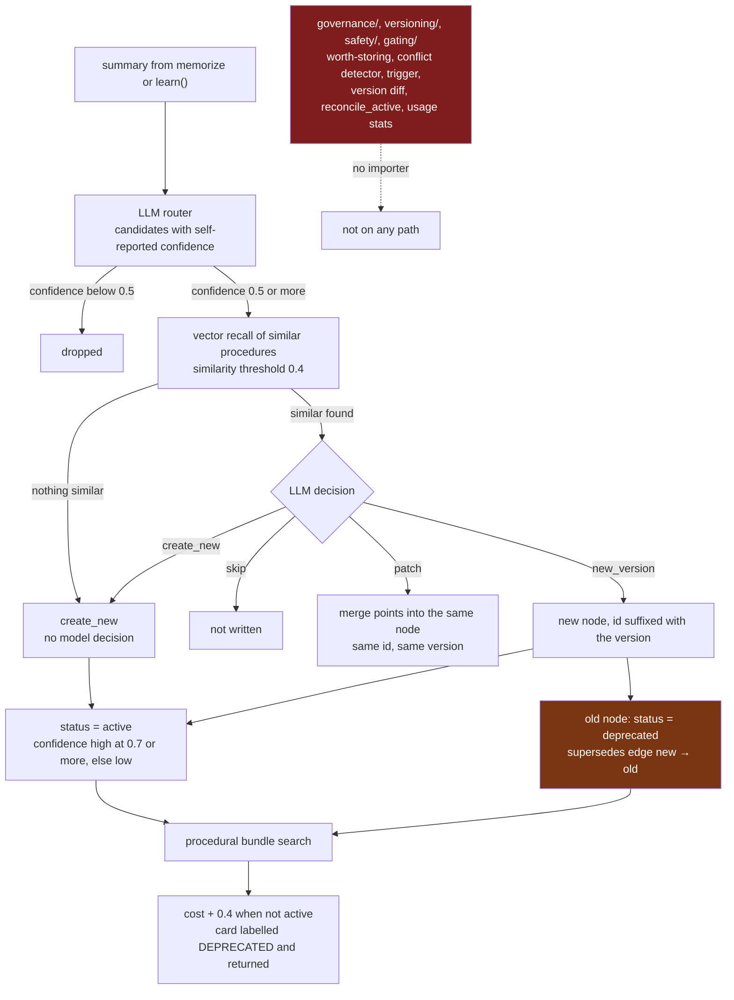

## 1. Executive Summary

M-flow is a graph memory engine that ranks an Episode by the cheapest path to it
from the most precise node a query hits, where each hop costs the edge text's own
distance to the query. Search is scoped by dataset permission, on by default and
failing closed, and CI runs tests that one user and one tenant cannot see
another's datasets. The weak half is procedural memory. Its worth-storing screen,
deterministic-first conflict detector, two-layer retrieval trigger, version diffs,
active-version reconciliation, usage statistics and sensitivity screen are
complete modules that nothing in the repository imports.

The retrieval model is the reason to read it. A query lands on **the most precise
anchor it can find** — an Entity, a Facet, a FacetPoint or an Episode — and
evidence then spreads outward over typed edges, where *"Each hop expands the
semantic field, but each edge also adds cost. This means association is not a
random graph walk: only paths with coherent, low-cost connections remain
competitive."* The README's own illustration is a classmate who grew up in
California opening a California neighbourhood, within which the Lakers become the
next low-cost hop.

The code does what the README and `docs/RETRIEVAL_ARCHITECTURE.md` say. An edge's
cost is the vector distance between the query and that edge's own text, or `0.9`
when the edge was not among the vector hits; each hop adds `0.05`; and an Episode
takes the minimum over its paths (`m_flow/retrieval/episodic/bundle_scorer.py:164-171`,
`:218-248`). *"One strong path is enough"* is a literal `min`. A direct hit on
the Episode summary pays a `0.3` penalty, so a precise FacetPoint two hops away
can outrank it.

M-flow is a third point on an axis with two others in this atlas.
[NOOA Memory](../nooa-memory/) implements ACT-R spreading activation with a fixed
per-hop decay; [HippoRAG](../hipporag/) replaces ranking with PageRank diffusion.
M-flow scores *paths* rather than nodes, and because the edge cost is computed
against the query, the same edge is cheap for one question and expensive for the
next. Its corollary is the opposite of a system that requires corroboration from
several directions.

**The procedural half runs a different pipeline from the one its modules
describe.** The live write path sends every summary to a model router, keeps
candidates whose self-reported confidence is at least `0.5`, recalls similar
procedures by vector, and asks a model whether to create, patch, version or
skip. The one cheap gate on that path is the vector recall: with nothing above a
`0.4` similarity, the decision short-circuits to create without a model call
(`procedure_builder/decision.py:105-113`). A new version deprecates the old node
and links it with a `supersedes` edge. The deprecated version stays retrievable
at a `0.4` cost penalty, labelled `[DEPRECATED]`.

The packages that would govern it — `memory/procedural/governance/`,
`memory/procedural/versioning/`, `memory/procedural/safety/` and
`retrieval/gating/`, 2,402 lines — have no importer anywhere in the tree. The
only reference from outside is the `TriggerResult` type in
`procedural_injector.py`, and the orchestrator that would call the trigger says
*"Trigger logic removed - procedural retrieval is controlled by config"*
(`m_flow/retrieval/memory_orchestrator.py:363`). That has held since the
repository's first commit, on 3 April 2026.

**The benchmark numbers are published in a separate repository and recompute
from it.** The README reports LoCoMo-10 at 81.8% and LongMemEval at 89%,
LLM-judged, beside Cognee, Zep, Mem0 and Supermemory. At
[`a04accf39ab2e42d785f4f61033b6f66281f109a`](https://github.com/FlowElement-xinliuyuansu/mflow-benchmarks/commit/a04accf39ab2e42d785f4f61033b6f66281f109a)
of `mflow-benchmarks`, the ten authoritative per-conversation LoCoMo reports hold
1,260 correct answers across 1,540 non-adversarial questions. The LongMemEval
figure is 89 correct in the first 100 questions of the Oracle variant, which
holds only the evidence sessions
([arXiv:2410.10813](https://arxiv.org/abs/2410.10813)), and covers only the
temporal-reasoning and multi-session types.

**Search is scoped by dataset permission.** Like the Cognee code it credits in
`NOTICE.md`, M-flow resolves the datasets a user may read before any retriever
runs, and each permitted dataset has its own graph and vector database. Leaving
`ENABLE_BACKEND_ACCESS_CONTROL` unset behaves as `true`: it raises when the
configured backends cannot isolate datasets rather than falling back to a shared
store.

## 2. Mental Model

Two halves with different lifecycles.

**Semantic and episodic memory is a typed graph with no epistemic state.**
Entities carry Facets, Facets carry FacetPoints, Episodes anchor to all of them.
The README's argument for the unified graph is against layered stores: *"Some
memory systems keep separate layers for episodic memories, atomic facts,
entities, or summaries. When these layers are queried separately, retrieval
tends to work best when the user's query matches the selected layer."* Anchoring
on whichever node type is most precise, then spreading, is meant to remove the
layer-selection problem, which [MemOS](../memos/) answers by mounting the layers
and [MemPalace](../mempalace/) by making one layer authoritative. A node becomes
a memory when `memorize` writes it and stops being one when its document is
deleted. Nothing in between marks it doubtful, superseded or rejected.

**Every node carries two clocks.** `created_at` and `updated_at` are record time;
`mentioned_time_start_ms` and `mentioned_time_end_ms` are the interval the
content says it happened in (`m_flow/core/models/MemoryNode.py:48-54`). Ingest
extracts it with a regex pass before any model call and stores nothing below a
confidence floor (`m_flow/retrieval/time/mentioned_time_extractor.py:1-12`).
Retrieval spends the event time as a ranking bonus of at most `0.06` when the
query names a time.

**Procedural memory is versioned.** A procedure is `active` until a later write
for the same signature is judged a `new_version`. That write creates a new node
with a version-suffixed id, sets the old one's status to `deprecated`, and
attaches a `supersedes` edge from new to old
(`m_flow/memory/procedural/procedure_builder/write.py:156-221`). A `patch`
merges new points into the existing node under the same id and version. Status
is read in two places, and both rank rather than filter.


```mermaid
%% caption: the procedural lifecycle as the code runs it — a model router and a model merge decision with one vector-recall short-circuit between them, a new version that deprecates the old node, and a deprecated version that retrieval returns at a 0.4 cost penalty; the governance package beside it has no importer
flowchart TD
    S["summary from memorize or learn()"] --> R["LLM router<br/>candidates with self-reported confidence"]
    R -->|"confidence below 0.5"| X1["dropped"]
    R -->|"confidence 0.5 or more"| V["vector recall of similar procedures<br/>similarity threshold 0.4"]
    V -->|"nothing similar"| CN["create_new<br/>no model decision"]
    V -->|"similar found"| D{"LLM decision"}
    D -->|"skip"| X2["not written"]
    D -->|"create_new"| CN
    D -->|"patch"| P["merge points into the same node<br/>same id, same version"]
    D -->|"new_version"| NV["new node, id suffixed with the version"]
    NV --> DEP["old node: status = deprecated<br/>supersedes edge new → old"]
    CN --> ACT["status = active<br/>confidence high at 0.7 or more, else low"]
    NV --> ACT
    ACT --> Q["procedural bundle search"]
    DEP --> Q
    Q --> RANK["cost + 0.4 when not active<br/>card labelled DEPRECATED and returned"]
    G["governance/, versioning/, safety/, gating/<br/>worth-storing, conflict detector, trigger,<br/>version diff, reconcile_active, usage stats"] -.->|"no importer"| X3["not on any path"]
    style G fill:#7f1d1d,color:#fff
    style DEP fill:#78350f,color:#fff
```

The red box is the design the modules describe. The rest is what `learn()` and
the procedural stage of `memorize` execute.

## 3. Architecture

Four deployable pieces — `m_flow` (the engine and FastAPI server), `m_flow-mcp`,
`m_flow-frontend`, `mflow_workers` — plus `m_flow-starter-kit`, an
`openclaw-skill`, Alembic migrations, a Dockerfile and compose file, and
quickstart scripts for shell and PowerShell.

The default stack is embedded. The relational store is SQLite, the graph is Kuzu
and the vectors are LanceDB, all files on disk
(`m_flow/adapters/relational/config.py:57`, `m_flow/adapters/graph/config.py:25`,
`m_flow/adapters/vector/config.py:22`). With access control on, each dataset gets
its own Kuzu and LanceDB database under a per-owner directory, selected per
request through context variables (`m_flow/context_global_variables.py:128-180`).
Neo4j and Neptune graph adapters and Chroma, Milvus, pgvector and Pinecone
vector adapters are alternatives.

`mflow_workers` is a Modal deployment. Its queued writers replace the direct
graph and vector writes only when `MFLOW_DISTRIBUTED=true`, and only on the Neo4j
and pgvector adapters (`mflow_workers/utils.py:14-33`); on the Kuzu and LanceDB
defaults, writes are in process.

`m_flow/retrieval/` holds a base graph retriever, a Cypher retriever, lexical and
Jaccard retrievers, the episodic bundle search, a triplet search, a memory
orchestrator and registered community retrievers. Which one runs is the caller's
`RecallMode`, mapped in `m_flow/search/methods/get_recall_mode_tools.py`.

### Deployment and ergonomics

- **Running:** nothing beyond the Python process for the defaults; the frontend
  and a Postgres or Neo4j backend are optional.
- **API key:** an LLM key is required to store anything, since `memorize`
  summarises and extracts with a model; `.env.template:60` marks it `REQUIRED`.
- **Install:** `quickstart.sh`, `docker-compose.yml`, or a `uv` install.
- **Repair by hand:** the Kuzu and LanceDB files are not human-readable. The
  graph can be inspected through the frontend or the CYPHER recall mode.

## 4. Essential Implementation Paths

| Path | Location |
| --- | --- |
| Search entry, access-control switch | `m_flow/search/methods/search.py:145-146` |
| Authorized dataset resolution | `m_flow/search/methods/search.py:293-335`, `m_flow/data/methods/get_authorized_existing_datasets.py` |
| Per-dataset database context | `m_flow/search/methods/search.py:548`, `m_flow/context_global_variables.py:115-180` |
| Recall-mode dispatch | `m_flow/search/methods/get_recall_mode_tools.py` |
| Episodic path-cost scoring | `m_flow/retrieval/episodic/bundle_scorer.py:143-300` |
| Procedural bundle search, inactive penalty | `m_flow/retrieval/utils/procedural_bundle_search.py:443-494` |
| Procedural write: router, threshold, compile | `m_flow/memory/procedural/write_procedural_memories.py:212-378` |
| Incremental recall, decide, compile, write | `m_flow/memory/procedural/procedure_builder/` |
| Version write and deprecation | `m_flow/memory/procedural/procedure_builder/write.py:156-266` |
| Node and edge ledger | `m_flow/adapters/graph/graph_db_interface.py:35-93` |
| Delete | `m_flow/api/v1/delete/delete.py`, `node_deletion.py` |
| MCP tools | `m_flow-mcp/src/server.py` |
| Declared, not imported | `m_flow/memory/procedural/governance/`, `versioning/`, `safety/`, `m_flow/retrieval/gating/` |

## 5. Memory Data Model

Every node derives from `MemoryNode`: a UUID, a `type`, a `version`, record-time
`created_at` and `updated_at`, the four `mentioned_time_*` fields, and optional
`memory_spaces` that partition Episodic from Procedural subgraphs. The graph side
is Entity / Facet / FacetPoint / Episode with typed edges carrying `edge_text`,
and the precision ordering matters: the anchor step prefers the finest match.
`Episode` adds a `status` of `open` or `closed`, a `memory_type` and a
`dataset_id` that keeps Episode routing inside a dataset when access control is
off.

`Procedure` adds `signature`, `status` (`active`, `deprecated`, `superseded`),
`confidence` (`high` or `low`), `write_decision`, `write_reason`, `source_refs`
and a `supersedes` relation (`m_flow/core/domain/models/Procedure.py:61-103`).
The comment on `confidence` states its use: *"small penalty during retrieval"*.

The relational side holds users, tenants, roles, principals, ACLs and
permissions; datasets and data rows; `graph_relationship_ledger`; and the query
and result log behind search history.

Two marks, `scope_enforced` and `negative_eval`, both on the permission layer and
its tests (section 9). Section 9 also gives the reasons for the five withheld.

## 6. Retrieval Mechanics

Five recall modes, named by the caller: `TRIPLET_COMPLETION`, `EPISODIC`,
`PROCEDURAL`, `CYPHER` and `CHUNKS_LEXICAL`. `m_flow.search` and the HTTP search
payload default to `TRIPLET_COMPLETION`; the simplified `m_flow.query` defaults to
`EPISODIC` (`m_flow/api/v1/search/search.py:137`, `:362`;
`m_flow/api/v1/search/routers/get_search_router.py:34`). The MCP `search` tool
requires the mode as an argument. The path-cost model is the `EPISODIC` mode and,
in a one-hop form, the `PROCEDURAL` bundle search.

**Episodic scoring.** Vector search over node collections and edge-text
collections gives each hit a distance. A Facet's cost is the minimum of its own
distance and of each FacetPoint or Entity distance plus the connecting edge's
cost plus `0.05`. An Episode's cost is the minimum of its direct distance plus
`0.3` and of each Facet or Entity route (`bundle_scorer.py:164-248`). When a
Facet's own distance is below `0.1` or `0.2`, the edge and hop costs on its route
are cut to fixed or scaled values; those two thresholds are literals rather than
configuration. Per-collection adaptive weights, on by default, and a capped time
bonus adjust the scores before ranking. The episodic context step calls no model
(`m_flow/retrieval/episodic_retriever.py:183-250`); a completion adds one.

**"One strong path is enough" is a precision bet, and the atlas's evidence runs
both ways.** A single coherent chain of associations is how a useful recall often
works, and it is also how a confident wrong answer works.
[Graphify](../graphify/) requires two distinct corroborating results before a
claim counts and [CLIO](../clio/) requires two distinct sources; M-flow's
position is the opposite. It is a defensible one for recall as opposed to belief,
and the graph does not distinguish the two.

**The constants around the cost are uncalibrated in the repository.** The
per-edge cost is a measured distance, not a weight. The miss cost, hop cost,
direct-episode penalty and Facet discount thresholds are defaults with no
committed sweep or labelled set behind them. The end-to-end LoCoMo and
LongMemEval runs in `mflow-benchmarks` are the only measurement of the ranking as
a whole.

**Procedural status ranks, it does not filter.** Procedural bundle search adds
`inactive_penalty=0.4` to a non-active procedure's cost
(`procedural_bundle_search.py:216`, `:492-494`), and the card formatter drops
inactive procedures only when `include_inactive` is false. Its default is true
and no caller passes false (`m_flow/retrieval/formatters/procedural_card_formatter.py:128`,
`:198-202`). A deprecated version whose path cost is more than `0.4` lower than
its successor's outranks it.

**The CYPHER mode executes the query text.** `CypherSearchRetriever.get_context`
passes the caller's string to the graph adapter's `query`, which on Kuzu calls
`conn.execute` with no check on the statement kind
(`m_flow/retrieval/cypher_search_retriever.py:44-64`,
`m_flow/adapters/graph/kuzu/adapter.py:490-515`). The mode is on unless
`ALLOW_CYPHER_QUERY=false` (`get_recall_mode_tools.py:131`), and search requires
only `read` permission on the dataset.

## 7. Write Mechanics

`memorize` summarises each document into Episodes, Facets, FacetPoints and
Entities through model calls, with an optional `precise_mode` that routes
sentences into topic sections before compressing each one. Procedural
extraction is off in `memorize` unless `MFLOW_PROCEDURAL_ENABLED` or the
`enable_procedural` argument turns it on (`m_flow/api/v1/memorize/memorize.py:402-406`).
`learn()` and the `extract_from_episodic` route run it explicitly over stored
Episodes.

The live procedural sequence is the one in the section 2 diagram: a model router
per summary, a confidence filter at `0.5` (`MFLOW_PROCEDURAL_CONFIDENCE_THRESHOLD`),
a vector recall of up to three similar procedures, a model decision when any is
found, a model compile, and a write. The write path's docstring lists
*"4. Security: sensitive information redaction"*
(`write_procedural_memories.py:16`). No live path calls `redact_secrets`: its
callers are the unimported `safety/sensitivity.py` and the tests. The compile
prompt asks the model to replace secret-like strings with `<REDACTED>`
(`procedure_builder/compile.py:34`). `contains_dangerous_content` runs only on the
fallback taken when the incremental path raises (`write_procedural_memories.py:451-485`).

### Operational cost

- **Blocking.** The library call `memorize` blocks until the pipeline finishes
  unless `run_in_background=True`. The MCP `memorize` tool starts the pipeline as
  an in-process task and returns a task id unless `wait=True`.
- **Lag.** A memory is retrievable when the pipeline for its document ends, which
  is several model calls per chunk; the repository does not measure it.
- **Whole-store passes.** None scheduled. `learn()` reads every Episode in the
  current graph that has no procedure derived from it, and ignores its `datasets`
  argument, which its
  docstring marks *"currently unused, reserved for interface"*
  (`m_flow/api/v1/learn/learn.py:128`).
- **Read path.** `top_k` bounds what search returns; injection into a prompt is
  the caller's, except on the orchestrator library path, whose injector admits a
  procedure only when its cost is below `0.25`.

## 8. Agent Integration

The MCP server registers `memorize`, `save_interaction`, `search`, `list_data`,
`delete`, `prune`, `memorize_status`, `learn`, `update_data`, `ingest` and
`query`. `search` takes the recall mode as an argument and accepts `CYPHER`
(`m_flow-mcp/src/server.py:413-446`). `prune` clears the graph and vector stores
and, on request, the metadata, and its own docstring calls it irreversible
(`:667-700`). Both are on the agent's tool surface.

The orchestrator in `m_flow/retrieval/memory_orchestrator.py` builds procedural
queries, recalls, decides injection and formats cards. It is exported from
`m_flow.retrieval` and constructed by the eval runner; no API route and no MCP
tool calls it. So the separation of *should we retrieve* from *should we inject*
exists as a library function whose trigger half was removed.

The frontend offers ingestion, the five retrieval modes, a graph browser with
node deletion, dataset and permission management, settings, and a *"Monitoring &
Audit"* page that lists search history and health
(`m_flow-frontend/src/components/admin/AuditPage.tsx:61-103`). An OpenClaw skill
is published to ClawHub from `openclaw-skill/mflow-memory/`.

## 9. Reliability, Safety, and Trust

**`scope_enforced` — earned, on the permission tier.** Datasets carry stored ACL
rows (`m_flow/auth/models/ACL.py`, `Permission.py`, `Principal.py`, tenant and
role defaults). `search` checks `backend_access_control_enabled()`, and
`_authorized_search_impl` calls `get_authorized_existing_datasets(datasets,
permission_type="read", user)` (`search.py:145-146`, `:330-335`). With no dataset
named, that returns every dataset the user, their tenant or their roles may read,
filtered to the user's current tenant (`get_all_user_permission_datasets.py:55`).
A named dataset without the grant raises `PermissionDeniedError`. Each surviving
dataset is then searched inside its own database context (`search.py:548`).

The switch is `ENABLE_BACKEND_ACCESS_CONTROL`. Unset or `true`, it requires
handlers that can isolate datasets and raises `EnvironmentError` if they cannot;
any other value disables it, and search runs through `no_access_control_search`
with no dataset context (`context_global_variables.py:115-125`). The retrievers
themselves carry no dataset predicate: below the ACL check the boundary is a
physical partition, one database pair per dataset. The mark rests on the ACL
filter on the read path, the same basis as [Cognee](../cognee/)'s.

**`negative_eval` — earned, on dataset and tenant isolation.**
`m_flow/tests/test_permissions.py` has two users memorize separate datasets and
asserts each user's search returns exactly one result, from their own dataset;
after a `read` grant the same search returns both (`:126-137`, `:203-211`).
`test_multi_tenancy.py` switches a user into a second tenant and asserts only
that tenant's dataset comes back, then switches back and asserts the reverse
(`:160-186`). `e2e_tests.yml` runs both (`:288`, `:314`) from `test_suites.yml`
on every push to `main` and `dev`. The assertions are per dataset: they establish
which databases were searched, not which nodes came back.

**`audit_log` — withheld.** `GraphRelationshipLedger` calls itself an
*"append-only ledger that records every graph-edge lifecycle event"*, and
`_track_changes` inserts a row per node and edge on `add_nodes` and `add_edges`
with the calling function. A deletion updates the existing rows' `deleted_at`
(`api/v1/delete/delete.py:143-153`, `node_deletion.py:107-126`). `update_node`,
which deprecates a procedure, is not recorded. A failed ledger insert is logged
at debug and rolled back (`graph_db_interface.py:81-92`). The frontend's audit
page reads the query log, which is retrieval history.

**`trust_state` — withheld.** `Procedure.status` and `Procedure.confidence` are
discrete fields, and every read of them ranks or labels (section 6). `status`
moves only when a successor version is written, so it records replacement rather
than doubt. The semantic graph has no status at all.

**`bitemporal` — withheld.** The event-time interval is real and written on the
ingest path, and it is kept apart from record time. It is spent as a ranking
bonus of at most `0.06`, with a mismatch penalty that defaults off
(`m_flow/retrieval/time/time_bonus.py:43`, `:63`). No read takes an as-of time on
either axis, `updated_at` overwrites, and no write closes an interval when a fact
changes.

**`tombstone` — withheld.** Delete removes a document's subgraph (`soft`) and
orphaned nodes (`hard`); nothing records the removed value for a later write to
consult.

**`human_review` — withheld.** No node model has a pending state: `memorize`
writes directly. The frontend can delete a node after the fact, which is editing
rather than review.

**Safety on the write path is prose.** The unimported `safety/sensitivity.py`
would classify and redact procedures; the live path relies on the compile
prompt's instruction (section 7).

The versioning is the reliability strength that runs. A procedure that changes
leaves its previous node, a `supersedes` edge and a version number. Without
`reconcile_active` or the version-diff generator on any path, nothing checks
that one version per signature is active, and no change description is written.

## 10. Tests, Evals, and Benchmarks

The unit suites under `m_flow/tests/unit/` and the integration suites under
`m_flow/tests/integration/` run with `pytest` in `basic_tests.yml`; end-to-end
scripts such as `test_permissions.py` run as plain Python in `e2e_tests.yml`.
Nothing was installed or run for this reading.

**No test imports the governance, versioning, gating or safety packages.** The
modules the procedural design rests on are untested as well as unwired.

**`m_flow/eval` is a procedural-retrieval harness without a corpus.**
`python -m m_flow.eval --dataset procedural_eval_v1.jsonl --compare-baseline`
runs twenty queries — seven explicit procedures, four implicit tasks, three
micro-actions and six negatives such as small talk and arithmetic — through the
orchestrator and reports recall@1-3, active-hit, false-positive injection,
context completeness, step presence, trigger accuracy and an overshadow rate.
`EvalSetup.prepare`'s docstring promises *"fixed corpus ingestion or load
snapshot"*, and the method sets two environment variables
(`m_flow/eval/config.py:139-165`). The queries run against whatever store is
configured, so the six negatives pass on an empty one. A regression prints
`[WARN]` and does not change the exit status, and no workflow runs the harness.

**The committed baseline cannot be a run over these cases.**
`procedural_eval_v1_baseline.json`, dated 25 January 2026, records a
false-positive injection rate of `0.1` over six negatives and a recall@1 of `0.6`
over three micro-actions. Neither is a count over six or three. It also lists
zero failures beside an overall recall@1 of `0.6`. It reads as a target written
by hand.

**The headline benchmarks recompute.** In `mflow-benchmarks` at
[`a04accf39ab2e42d785f4f61033b6f66281f109a`](https://github.com/FlowElement-xinliuyuansu/mflow-benchmarks/commit/a04accf39ab2e42d785f4f61033b6f66281f109a),
the ten `results/authoritative/FULL_REPORT_conv*.json` files give 1,260 correct
answers across 1,540 questions with category 5 excluded: 81.82%. The ten
`mflow_eval_conv*.json` files under `results/raw_data/` give 80.8% instead. `FINAL_SUMMARY.json`'s
per-conversation rows sum to 1,261 across 1,541 because one category-5 answer is
counted in conversation 1. The LongMemEval per-question file gives 89 correct in
100: 56 temporal-reasoning in 60 and 33 multi-session in 40.

That run used M-flow 0.3.2 with `precise_mode` patches applied, on the Oracle
variant's first 100 questions. The patches are merged at the pin, which is
version 0.3.6. Oracle histories contain only the evidence sessions, so the
LongMemEval figure measures reading and reasoning over already-selected sessions
more than retrieval.

## 11. For Your Own Build

### Steal

**Make edge cost a function of the query.** Embedding each edge's text and
charging a path the edge's distance to the query turns the graph into a filter:
two hit nodes joined by an irrelevant relation stay far apart. A fixed miss cost
for edges outside the vector hits keeps the arithmetic bounded.

**Take the minimum over paths, and tax the coarse direct hit.** A penalty on
matching the summary itself makes a precise fact two hops away win when it
exists, and lets the summary win when nothing finer matches.

**Resolve the readable scope before any retriever runs, and fail closed on
configuration.** A default that raises when the backend cannot isolate, rather
than silently sharing one store, is the right failure for a multi-tenant
deployment. Pair it with a CI test that asserts one user's search does not reach
another's data and that a grant changes the answer.

**Version a procedure as a new node with a `supersedes` edge.** The previous
instruction survives with its identity, and the edge is written with the new
node so it cannot dangle.

### Avoid

**Do not let a governance package exist without a caller.** Worth-storing,
conflict detection and a retrieval trigger that sit unimported beside a
model-first pipeline cost nothing to read and protect nothing. A single test that
drives the write entry point and asserts each gate ran would have caught it.

**Do not describe a safety step in a docstring that the code does not take.**
A redaction pass listed as step four of the write pipeline, with its function
called only from dead code and tests, is worse than none because a reader stops
looking.

**Do not put a raw query language behind read permission.** A retrieval mode
that executes caller text needs a statement-kind check, or it needs the write
permission.

**Do not commit a baseline that no run could produce.** Rates that are not
fractions of the case counts make every later comparison meaningless.

### Fit

Take M-flow if you want graph recall whose ranking you can reason about, you
accept an LLM on every write, and your isolation boundary is a dataset. The
default stack is embedded, so the operating cost is an API key rather than a
cluster. The path-cost scorer and the dataset-permission layer are the parts
that transfer.

Do not take it for procedural memory you need to trust. The live path stores
what a model router proposes, ranks deprecated versions beside current ones, and
has none of the gates its package layout promises. Do not take it either where
the agent should not be able to wipe the store: `prune` is on the MCP surface.

## 12. Open Questions

- **Are the governance packages intended to be wired, or left from an earlier
  design?** They arrived in the first commit. `reconcile_active` and
  `update_usage_stats` were moved onto the graph interface's `update_node` in
  [`14988536239814378ad08a7828fedb358a32b68f`](https://github.com/FlowElement-xinliuyuansu/m_flow/commit/14988536239814378ad08a7828fedb358a32b68f)
  on 13 April 2026 while uncalled, and the orchestrator's comment says the
  trigger was removed.
- **How much of the LongMemEval result survives the full-history variants?** The
  published run is the Oracle variant's first 100 questions.
- **Does anything keep two active versions from coexisting for one signature?**
  `find_active_version_by_signature` returns the first match, and nothing
  reconciles.
- **Does the CYPHER mode accept write statements on every backend?** On Kuzu the
  adapter executes whatever it receives; the others were not read.

## Appendix: File Index

| File | Role |
| --- | --- |
| `m_flow/retrieval/episodic/bundle_scorer.py` | Path-cost scoring: edge cost, miss cost, hop cost, minimum over paths |
| `m_flow/retrieval/episodic/config.py` | Episodic constants and their environment overrides |
| `m_flow/retrieval/utils/procedural_bundle_search.py` | Procedural one-hop scoring and the inactive penalty |
| `m_flow/retrieval/formatters/procedural_card_formatter.py` | Procedure cards, `include_inactive` defaulting to true |
| `m_flow/retrieval/cypher_search_retriever.py` | The CYPHER recall mode |
| `m_flow/retrieval/memory_orchestrator.py`, `injection/procedural_injector.py` | Library-only orchestration and injection decision |
| `m_flow/retrieval/time/` | Event-time extraction and the capped time bonus |
| `m_flow/search/methods/search.py`, `get_recall_mode_tools.py` | Authorized search and recall-mode dispatch |
| `m_flow/data/methods/get_authorized_existing_datasets.py`, `m_flow/auth/` | ACL resolution, tenants, roles |
| `m_flow/context_global_variables.py` | The access-control switch and per-dataset database context |
| `m_flow/core/models/MemoryNode.py`, `m_flow/core/domain/models/` | Node base with both clocks; Episode, Procedure and the rest |
| `m_flow/memory/procedural/write_procedural_memories.py` | Procedural write entry: router, threshold, compile |
| `m_flow/memory/procedural/procedure_builder/` | Recall, decision, compile and version write |
| `m_flow/memory/procedural/governance/`, `versioning/`, `safety/`, `m_flow/retrieval/gating/` | 2,402 lines with no importer |
| `m_flow/adapters/graph/graph_db_interface.py`, `m_flow/data/models/graph_relationship_ledger.py` | Node and edge ledger |
| `m_flow/api/v1/delete/` | Soft and hard delete |
| `m_flow/tests/test_permissions.py`, `test_multi_tenancy.py` | Cross-user and cross-tenant isolation, run in CI |
| `m_flow/eval/` | Twenty-query procedural harness and its baseline |
| `m_flow-mcp/src/server.py` | MCP tools |
| `mflow_workers/` | Modal queue for distributed writes |

### Searches behind the absence claims

Run from the repository root; each returned only what is described beside it.

```sh
# the governance, versioning, safety and gating packages: no importer outside their own
# directories except the TriggerResult import in procedural_injector.py and a result key in eval/runner.py
rg -n 'procedural\.governance|procedural\.versioning|procedural\.safety|retrieval\.gating|procedural_trigger|worth_storing|evaluate_worth|conflict_detector|detect_conflict|version_diff|reconcile|usage_stats|UsageTracker|classify_sensitivity|procedural_classifier|ProceduralExtractor' . -g '!*.md' | grep -v -E '^\./m_flow/(retrieval/gating|memory/procedural/(governance|versioning|safety))/'

# the orchestrator's note that the trigger was removed, present since the first commit
/usr/bin/git grep -n 'Trigger logic removed' fb05ba6 -- '*.py'

# redact_secrets: called from sensitivity.py and tests only; contains_dangerous_content: the fallback path only
rg -n 'redact_secrets\(|contains_dangerous_content\(' m_flow

# no caller passes include_inactive=False
rg -n 'include_inactive' m_flow

# the ledger decorator wraps add_nodes and add_edges only
rg -n 'record_graph_changes|_track_changes' m_flow

# no as-of read on either time axis: one hit, a docstring in procedure_router.py naming valid_from; the mismatch penalty defaults off
rg -n 'as_of|asof|valid_from|valid_to|invalid_at' m_flow --type py
rg -n 'enable_mismatch_penalty' m_flow/retrieval

# no pending or review state on any node model, and no approve verb
rg -n -i 'approve|pending_review|needs_review|review_queue|quarantin' m_flow m_flow-mcp mflow_workers --type py

# no rejected-value record: only argparse, logging and a score-floor comment match
rg -n -i 'tombstone|blocklist|denylist|rejected_value|suppress' m_flow --type py

# no retriever applies a dataset predicate: nothing under m_flow/retrieval; under m_flow/search only the
# authorization argument and an output field
rg -n 'dataset_id' m_flow/retrieval m_flow/search --type py

# the eval is not run by any workflow and ingests nothing
rg -n 'procedural_eval|m_flow\.eval|m_flow/eval' .github
rg -n 'memorize|\.add\(|ingest' m_flow/eval

# the orchestrator is constructed only by the eval runner and its own module-level helpers,
# which are exported from m_flow.retrieval and called by no route or MCP tool
rg -n 'MemoryOrchestrator\(|get_orchestrated_context|get_partitioned_context|search_with_suggestion|orchestrated_search' . --type py

# the only status fields on node models: Episode open/closed, Procedure and PreferencePoint active/deprecated/superseded
rg -n 'status' m_flow/core/domain/models m_flow/core/models

# the four packages' history: the first commit, a port of two modules to update_node, and lint fixes
/usr/bin/git log --format='%h %ad %s' --date=short -- m_flow/memory/procedural/governance m_flow/memory/procedural/versioning m_flow/retrieval/gating m_flow/memory/procedural/safety

# no statement-kind check between the CYPHER mode and conn.execute
rg -n -i 'read.only|readonly|MATCH|DELETE|CREATE|MERGE' m_flow/retrieval/cypher_search_retriever.py

# no calibration or sweep for the path-cost constants
rg -n -i 'calibrat|grid.?search|sweep|tuned on' m_flow --type py

# no paper; the one bibtex block is a software citation for the coreference module
rg -n -i 'arxiv|bibtex|@article|@misc|CITATION|doi\.org' -g '!*.lock' -g '!*.json' .
```

## History

**2026-09-30** — [`0d585cda2f588af69fb872ae6914caba0c217816`](https://github.com/FlowElement-xinliuyuansu/m_flow/commit/0d585cda2f588af69fb872ae6914caba0c217816) — audit at the same commit; upstream had not moved. Marks unchanged at two, with evidence corrected: `negative_eval` rests on the permission and multi-tenancy tests, and the procedural eval is dropped from it. The headline was wrong: the three deterministic gates, version diffs, `reconcile_active`, usage statistics and the sensitivity screen have no importer, and have had none since the first commit. Also corrected: the worker queue is opt-in, the caller chooses the retriever, every node carries event time, status ranks rather than filters, the eval baseline cannot come from its cases, and unset access control raises rather than falls back. Added: both benchmarks recompute from `mflow-benchmarks`, the LongMemEval run is Oracle-only, and CYPHER executes caller text ([section 9](#9-reliability-safety-and-trust)). Screen unchanged; nothing installed, built or run.

**2026-09-15** — [`0d585cda2f588af69fb872ae6914caba0c217816`](https://github.com/FlowElement-xinliuyuansu/m_flow/commit/0d585cda2f588af69fb872ae6914caba0c217816) — one commit on, 2026-08-03, updating repository references after the move to `FlowElement-xinliuyuansu`; no code changed. Screened before reading: no auto-run surface, five build-time execution points, five unpinned surfaces and an agent-instruction file read as data; nothing was installed or run. Read again against that tree, three findings of the first reading were wrong at the earlier pin and are corrected. The retrieval path applies dataset read permissions by default, so `scope_enforced` is added; `test_permissions.py` asserts each user sees only their own dataset until a grant, so `negative_eval` is added; and the claim that no eval fixture or benchmark result existed is replaced by the in-repo procedural eval with its committed baseline and the README's externally reproduced LoCoMo and LongMemEval figures. `audit_log` is withheld on `GraphRelationshipLedger`, which is updated rather than appended on delete. Two marks.

**2026-09-13** — the repository was renamed from `FlowElement-ai/m_flow` to `FlowElement-xinliuyuansu/m_flow`, upstream of the pinned commit and after the reading below. No re-reading: the pin, `analyzed_at` and every finding are unchanged, and only `source_name`, `source_url`, `revision_url`, `archive_name` and the repositories-inspected entry moved. The slug is unchanged, so no published URL moved. The archive fork was renamed to `agent-memory-atlas-archive/FlowElement-xinliuyuansu--m_flow` to match.

**2026-08-02** — [`da2766c5ebf45ff10440b419465c8ec0df674022`](https://github.com/FlowElement-xinliuyuansu/m_flow/commit/da2766c5ebf45ff10440b419465c8ec0df674022) — first reading.
