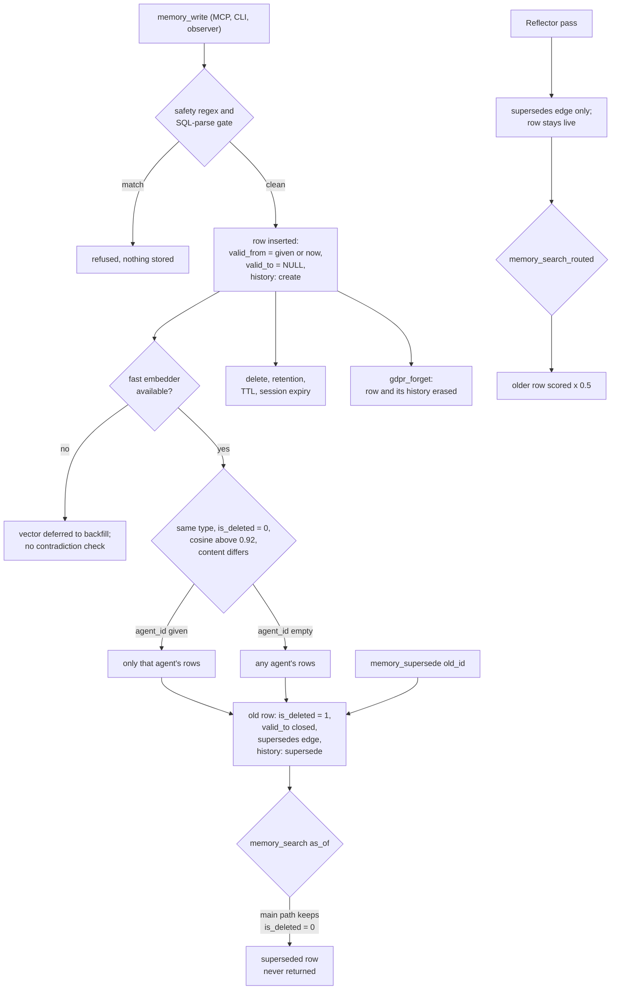

## 1. Executive Summary

m3 Memory is a local-first memory server for coding agents: a SQLite store,
PostgreSQL optional, behind a stdio MCP bridge exposing more than a hundred
tools. Around it sit a JSON CLI, a Claude Code plugin that captures chat turns,
and a background loop that classifies, embeds, extracts and decays. One store is meant
to be shared by Claude Code, Cursor, Gemini CLI and other agents on one machine.

What is notable is that correction is built into the write. A new memory whose
vector sits above 0.92 cosine to an older one of the same type, with different
content, closes the older row's `valid_to`, soft-deletes it, links it with a
`supersedes` edge and records a history event, all behind a compare-and-set.
Explicit `memory_supersede` does the same for a named row.

What is weak is where that machinery stops. Supersession by similarity decides
truth from proximity, and with an empty `agent_id` it crosses agents. The
`as_of` read keeps `is_deleted = 0`, so it can never return the rows
supersession closed. The FTS short-circuit that answers exact-phrase queries
skips four of the filters the main path applies.

The reading covered the core `memory_items` store: `bin/memory/`,
`bin/memory_core.py`, `bin/memory_maintenance.py`, the catalog under
`bin/catalog/`, and the migrations. The chat-log store, the file-ingestion store
(`bin/files_memory/`), the wiki compiler (`bin/wiki/`), tasks, handoffs and the
PostgreSQL sync were read only where they touch that store.

Four marks: `bitemporal`, `scope_enforced`, `audit_log`, `negative_eval`.
Section 9 names the three withheld and the limits on the four awarded.

The code is Apache-2.0. `NOTICE` additionally asks that the architecture be
credited to skynetCMD when it is reused, published or described.

## 2. Mental Model

A memory is a row. It becomes a belief the moment `memory_write` commits: there
is no candidate state, and the model-free write path stores the caller's text
verbatim after a regex and SQL-parse safety gate (`bin/memory/util.py:39-78`).
Everything after that is ranking, except three exits.

**Supersession, by similarity or by name.** On a singleton write with a vector,
`_check_contradictions` scans up to 200 live rows of the same type, scoped to
the same `user_id` when one is given and to the same `agent_id` when one is
given (`bin/memory/write.py:1376-1409`). Any row above
`CONTRADICTION_THRESHOLD` (0.92, `bin/memory/config.py:208`) whose content
differs fires under the default `loose` title gate (`:219`;
`write.py:1443-1448`). The older row gets `is_deleted = 1` and `valid_to`
closed, and nothing about it is kept as rejected.

**Deletion.** Soft (`is_deleted = 1`) or hard, by the agent, a curation plan, a
per-agent retention policy, a TTL, or the 24-hour expiry every `scope='session'`
memory is born with (`write.py:294-298`).

**Erasure.** `gdpr_forget` removes a subject's rows, embeddings, edges, history
and archive copies (`bin/memory_maintenance.py:1432`, `:1537-1560`).

A second kind of supersession exists and means less. The Reflector model pass
writes only a `supersedes` edge between two observations
(`bin/run_reflector.py:270-285`); neither row changes state, and only
`memory_search_routed` reads the edge, halving the older row's score
(`bin/memory/search.py:2125-2155`). Plain `memory_search` ignores it.

Confidence is a float derived from provenance and a corroboration ledger
(`bin/memory/confidence.py`, `bin/memory/trust.py`). It feeds ranking when
`M3_CONFIDENCE_RANKING=1` and filters nothing (`config.py:246`).

## 3. Architecture

The server is Python. `bin/memory_bridge.py` builds one FastMCP function per
`ToolSpec` in `bin/catalog/` and, in the default lazy mode, registers eight
essential tools plus two meta-tools; `tools_load_domain` registers the rest on
demand (`bin/memory_bridge.py:262-343`). The same specs back the `m3` CLI, the
`m3_call` dispatcher (`bin/catalog/dispatch.py:227-289`) and an HTTP bridge.

The store is SQLite in WAL mode at `~/.m3/engine/agent_memory.db`
(`bin/memory/config.py:81`), or PostgreSQL through a backend seam
(`bin/memory/backends/`) whose `dialect()` supplies every placeholder, JSON
default and scope predicate. Chat turns live in `agent_chatlog.db` and indexed
files in `files_database.db`, each with its own migrations. Lexical search is
FTS5 with BM25 on SQLite and tsvector on PostgreSQL. Vectors are BLOBs in
`memory_embeddings`, scored exhaustively against every live row of the
configured model and dimension (`bin/memory/backends/sqlite_backend.py:755-791`).

Embedding is BGE-M3, served by a shared local HTTP embed server, an in-process
GGUF path through the separately installed `m3_core_rs`, or an OpenAI-compatible
endpoint such as LM Studio or Ollama. Model passes — classification, entity
extraction, the Observer and Reflector, belief consolidation — call a local LLM
through `bin/llm_failover.py`.

`bin/m3_cognitive_loop.py` is a daemon, installed as a launchd, systemd or
Task Scheduler service, that runs every 300 seconds by default and chooses
passes by pending work, including a maintenance pass at most once an hour
(`bin/m3_cognitive_loop.py:1502-1521`, `:1851`, `:1941`).

A second log sits outside the store. `bin/audit_trail.py` appends SHA-256
hash-chained entries to `audit_trail.log.jsonl` on `memory_delete` and
`memory_supersede`. It reads the whole file to find the previous hash, falls
back to the genesis hash on any parse error, and takes no lock.

### Deployment and ergonomics

`pip install m3-memory` and `m3 setup` wire the MCP server into detected agents
and provision the embedder. Nothing else must run: without a fast embedder,
writes defer their vectors and search degrades to FTS. No API key is required.
The store is a SQLite file readable with any client, and the dashboard on
127.0.0.1:8088 browses, edits, soft-deletes and restores rows; it requires a
token only when one is configured or the bind is not loopback
(`bin/dashboard_server.py:600-634`). A full install carries the loop daemon, an embed server, a watchdog and
a notification waiter as services, which is a real operating surface for a
single-user memory.

## 4. Essential Implementation Paths

**Write.** `memory_write_impl` (`bin/memory/write.py:200-622`): safety gate on
content, title and metadata (`:268-285`), scope coerced into
`{user, session, agent, org}`, session expiry, one INSERT with `valid_from`
defaulting to now and `valid_to` stored NULL (`:326-343`), then `content_hash`
and derived `confidence` in one UPDATE (`:345-367`). Embedding runs inline only
when `fast_embedder_available()` (`:381-392`); long text is windowed, and dense
chunks are subdivided on an input-too-long error. History `create` is recorded
at `:553`. Fact enrichment and entity extraction are dispatched non-blocking.

**Contradiction.** Gated on `check_contradictions` (default true), a vector, and
a type outside `CONTRADICTION_TYPE_EXCLUSIONS` (default `conversation`)
(`write.py:583`). `_check_contradictions` (`:1341-1534`) fires
`_mark_superseded` with `require_active=True` (`:1466-1486`). With
`M3_CORROBORATION=1`, an identical re-write at cosine 0.95 or above records a
corroboration instead (`:1438-1441`).

**Supersede.** `_mark_superseded` (`write.py:625-706`) runs one UPDATE setting
`is_deleted = 1` and `valid_to = COALESCE(NULLIF(valid_to,''), close_at)`,
optionally guarded by `AND is_deleted = 0`, then inserts the edge and a
`supersede` history row on the same connection. `memory_supersede_impl`
(`:709-867`) writes the replacement first, then closes the old row, and on a
lost race soft-deletes its own replacement.

**Search.** `memory_search_impl` (`bin/memory/search.py:2484-2572`) formats
`memory_search_scored_impl` (`:600-1660`). That function tries an FTS
short-circuit for queries over three characters in hybrid mode (`:736-857`),
returning early when at least `k` rows contain the exact phrase. Otherwise it
embeds the query, falls back to FTS-only if no vector comes back (`:889-918`),
and builds the main WHERE clause (`:941-1044`).

**Context injection.** None automatic. The plugin's SessionStart hook only
checks that `mcp-memory` is on PATH (`hooks/hooks.json`); the agent calls
`memory_search`.

**Update and delete.** `memory_update_impl` (`bin/memory_core.py:827-887`)
records history per changed content, title, type, `refresh_on`,
`refresh_reason` and `conversation_id`. `memory_delete_impl` (`:947-975`)
records a `delete` event, then soft- or hard-deletes, cascading embeddings and
edges on hard.

**Maintenance.** `memory_maintenance_impl` (`bin/memory_maintenance.py:1158-1330`)
decays importance, reinforces accessed rows, re-aggregates confidence, enforces
retention (`:1097-1157`), archives and hard-deletes expired rows
(`:1238-1257`), and prunes orphan embeddings.

**Chat capture.** Stop and PreCompact hooks run a per-host script that ingests
the transcript into the chat-log DB; `chatlog_promote` copies turns into
`memory_items` as `conversation` rows.

## 5. Memory Data Model

| Field | Notes |
| --- | --- |
| `id`, `type`, `title`, `content`, `metadata_json` | type from `VALID_MEMORY_TYPES` (`bin/catalog/spec.py:20-63`) |
| `agent_id`, `model_id`, `change_agent`, `source`, `origin_device` | provenance, caller-supplied |
| `user_id`, `scope` | migration 009; scope in `user`, `session`, `agent`, `org` |
| `valid_from`, `valid_to` | migration 010; validity time |
| `created_at`, `updated_at` | record time |
| `is_deleted`, `expires_at`, `pinned` | lifecycle |
| `importance`, `importance_raw`, `confidence`, `corroboration_count`, `contradiction_count`, `helpful_count`, `unhelpful_count`, `access_count`, `last_accessed_at` | ranking signals, migrations 035, 037 and 049 |
| `content_hash`, `conversation_id`, `refresh_on`, `refresh_reason`, `variant` | integrity, grouping, review reminders, benchmark tagging |

Beside the row sit `memory_embeddings`, one or more vectors per row keyed by
`vector_kind`, and `memory_relationships`, typed edges unique per endpoint pair
and type since migration 039. `memory_history` holds mutation events.
`memory_corroborations` is an insert-only ledger of corroboration and
contradiction deltas (`memory/migrations/036_trust_and_corroboration.up.sql`).
`memory_archive` copies each row a maintenance pass removed, keyed on the
original id (`042_memory_archive.up.sql`). `agents.trust_score` weights sources.

**The validity interval has one writer that closes it.** `valid_to` is set by a
caller at write time or by `_mark_superseded`. The Observer pass writes
`valid_from` from the date a turn refers to (`bin/run_observer.py:383-398`), so
for observations the two clocks differ in practice, not only in schema.

**Scope is advisory until someone passes it.** The column defaults are `''` and
`'agent'`; `memory_write` defaults `scope` to `agent`, but reads apply no scope
unless the caller names one.

## 6. Retrieval Mechanics

The main path blends vector similarity and BM25 at `vector_weight` 0.7, adds
importance, recency, title-overlap, role and procedure terms and, when enabled,
a confidence term (`bin/memory/search.py:1312-1360`), then applies MMR. An optional
sentence-transformers cross-encoder reranks. `memory_search_routed` adds
temporal routing, session and graph expansion, entity-graph expansion and the
`supersedes` demotion, all opt-in.

**The FTS short-circuit is a second read path with fewer filters.** It builds
its predicate from `scope_predicates(user_id, scope, type_filter,
agent_filter)` (`bin/memory/search.py:789-800`) and returns directly when `k`
rows contain the exact phrase (`:820-836`). The main path adds
`requesting_agent` isolation, `conversation_id`, `variant` and `as_of`
(`:966-1012`). So an exact-phrase query with `requesting_agent` set can return
another agent's `scope='agent'` rows, an `as_of` query can return current rows,
and a benchmark-tagged row can bypass the `variant` gate the MCP validator
applies. The degrade path `_fts_only_results` (`:434-498`) has the same four
omissions. This was read, not reproduced.

**`as_of` excludes what supersession closed.** The main WHERE begins
`mi.is_deleted = 0` (`:941`) and adds the interval under `as_of`
(`:1002-1012`). Supersession sets `is_deleted = 1`, so the rows whose
`valid_to` it closed are the rows `as_of` cannot return. The docstring of
`memory_supersede_impl` promises the opposite (`bin/memory/write.py:738-739`).
What `as_of` does exclude are rows whose `valid_from` lies after the cutoff and
rows written with an explicit past `valid_to`.

**A closed interval does not filter a default search.** Without `as_of`, no
predicate reads `valid_to`, so a live row whose validity ended is ranked like
any other.

Retrieval is tool-mediated. The result is capped at `k` (1-100) and returned as
text or JSON records; nothing is injected at session start.

## 7. Write Mechanics

Writes are explicit tool or CLI calls, plus four machine producers: the Observer
(model-extracted `observation` rows from the chat log), belief consolidation
(opt-in, weekly, `M3_CONSOLIDATION_AUTO`), fact enrichment and procedure
distillation. Every producer goes through `memory_write_impl` or the bulk
variant, and so through the same contradiction check.

**The contradiction check is the correction mechanism, and it is lossy by
design.** Two memories of the same type that embed within 0.92 cosine and
differ in text are treated as a correction of the older by the newer. Two
different true facts phrased alike — two services' ports, two users'
preferences when `user_id` is empty — are within that radius. The result reports
`(superseded N conflicting memories: …)`; the older row leaves every default
read, and `memory_history` holds its text. The bulk path defaults the check off
(`write.py:204-208`).

**Agent scoping of the check depends on identity arriving.** With an `agent_id`
the scan is limited to that agent's rows. With none, it spans every agent
(`:1388-1393`, `:1450-1454`). The stdio bridge does not inject `agent_id`
(section 8), and the Observer writes with none (`bin/run_observer.py:388-398`).

Deletion is soft by default and hard on request. The agent-reachable
`memory_feedback(misleading)` lowers importance and records a contradiction; it
deletes nothing (`bin/memory_maintenance.py:799-829`). Decay multiplies
importance by 0.995 per pass for unpinned rows older than seven days, per
migration 049's header; until 19 September 2026 a sweep soft-deleted every memory below 0.05
importance, and now it only reports candidates, which `memory_restore` can bring
back (`bin/catalog/tools_memory.py:611-620`;
`tests/test_no_autonomous_deletion.py:1-20`).

### Operational cost

- **Write:** synchronous SQL; no model call on the default path. Embedding runs
  inline on a fast tier and is otherwise deferred to the backfill pass, when the
  row is FTS-searchable at once and vector-searchable a loop cycle later
  (300 seconds by default). A deferred row also skips the contradiction check.
- **Background:** the loop's model passes are paced by a resource governor.
  Maintenance rewrites `importance` across eligible rows at most hourly, in SQL.
- **Read:** one search per tool call, bounded by `k`; the output sits wherever
  the agent's tool result lands, so no injected prefix exists to invalidate a
  cache.

## 8. Agent Integration

`m3 setup` wires the stdio server into Claude Code, Cursor, Cline, Gemini CLI,
Antigravity, Aider, OpenCode, OpenClaw and Hermes. The Claude Code plugin
(`.claude-plugin/plugin.json`) registers the server and three hooks: a PATH
check on SessionStart and chat-log capture on Stop and PreCompact
(`hooks/hooks.json`). Slash commands under `commands/` and two curator subagents
under `agents/` complete it.

**The agent holds every verb.** On the stdio bridge, lazy registration hands
out any domain's tools on request, and the `default_allowed=False` flag on
`memory_delete`, `curate_memory_apply`, `gdpr_forget` and `memory_restore` is
consulted only by the `m3_call` dispatcher and the HTTP proxy
(`bin/catalog/dispatch.py:244`; `bin/mcp_proxy.py:271`). The bridge wrapper
passes the model's arguments through validation to the impl and applies
`inject_agent_id` nowhere (`bin/memory_bridge.py:183-247`), so `agent_id` and
`requesting_agent` are whatever the model supplies.

The `curate-memory` subagent's two-spawn plan-then-apply protocol is prose: the
subagent's tool list includes `curate_memory_apply` and `gdpr_forget`
(`agents/curate-memory.md:4`).

Adapting it to another agent is cheap: every tool is a JSON-in, JSON-out CLI
call, and the LangChain, CrewAI and PydanticAI adapters wrap the same catalog.

## 9. Reliability, Safety, and Trust

**Concurrency is handled where it was found to fail.** Supersession is a
compare-and-set on `is_deleted = 0`, so concurrent writers on PostgreSQL produce
one edge and one history row rather than N (`write.py:1466-1486`), and the
unique index from migration 039 backs it. History rows share the caller's
connection so SQLite writers do not contend (`bin/memory/db.py:557-563`).

**Tenancy is a caller convention.** User, scope and agent predicates are real
and centralised in one builder (`bin/memory/backends/dialect.py:236-302`), whose
docstring records the drift it replaced. Every key is optional and supplied by
the caller, and on stdio the caller is the model.

**Injection defence is a pattern list.** `<script`, `javascript:`,
`__import__`, `exec(`, `eval(` and an ignore-previous-instructions phrase are
refused, as is text that parses as SQL containing drop, delete or alter
(`bin/memory/util.py:39-78`). A code memory mentioning `eval(` is refused; a
false fact phrased plainly is not.

**Uncertainty is representable as a number only.** Confidence and the
corroboration ledger say how sure; nothing says whether a memory may be acted
on.

**Privacy.** `gdpr_export` and `gdpr_forget` reach rows, embeddings, edges,
history, the archive, materialised bypass rows and wiki syntheses derived from
erased rows. The hash-chained JSONL audit file is outside that erasure.

Capability marks:

- `bitemporal` — awarded. The consumer is partly stale: `as_of` never sees a
  superseded row, and the short-circuit ignores `as_of`. No test covers it.
- `scope_enforced` — awarded on the SQL predicates. Keys are optional and the
  short-circuit omits `requesting_agent`.
- `audit_log` — awarded on `memory_history`. Importance, metadata and pin
  changes, and the retention, TTL and expiry purges, write no event; the
  expiry purge hard-deletes after copying to `memory_archive`
  (`bin/memory_maintenance.py:1097-1157`, `:1238-1257`).
- `negative_eval` — awarded on `tests/test_agent_isolation.py`; section 10.
- `tombstone` — withheld. `memory_archive` is keyed on the memory id, nothing
  reads it on write, and a superseded text can be written again as a new row.
- `trust_state` — withheld. `confidence` is a float used for ranking. The
  nearest state is a wiki synthesis's `metadata_json.authority`, which gates
  only how `bin/wiki/render.py` renders a page (`:372-410`), is writable through
  `memory_update(metadata=…)`, and filters no search.
- `human_review` — withheld. `chatlog_promote`, `files_promote` and
  `files_entity_coalesce_apply` are default-allowed agent tools, and the
  dashboard's restore (`bin/dashboard_server.py:2653-2676`) edits after the
  fact while the agent holds `memory_supersede` and `memory_update`.

## 10. Tests, Evals, and Benchmarks

Nothing was installed, built or run; everything below is from reading the tests
at the pin.

**The negative case.** `test_requesting_agent_excludes_other_agents_private_rows`
(`tests/test_agent_isolation.py:117-135`) seeds four rows with one shared
vector, so ranking cannot hide a leak, and asserts `planner-private` is absent
while the requester's own private row and both shared rows are present. A
symmetric case follows (`:183-199`). It runs in CI's default lane
(`.github/workflows/ci.yml:266`). The helper searches for `"anything"` in
`search_mode="vector"` (`:91-94`), which bypasses the FTS short-circuit, so the
path without the predicate is not exercised.

**Supersession.** `tests/test_memory_supersede.py` asserts the explicit verb:
old row retained with `is_deleted = 1` and `valid_to` set, the edge, the history
event, inheritance, and rollback of the orphan on a lost race (`:151-356`). No
case under `tests/` asserts automatic contradiction supersession; the script
`bin/test_memory_bridge.py:544-588` does, and skips without an embedding model.
No test passes `as_of` to a search.

**Structure tests.** Several suites assert source text rather than behaviour,
for example `tests/test_tenancy_sql_uses_the_seam.py:67-68`, which greps
`search.py` for hardcoded placeholders.

**Benchmark.** `benchmarks/longmemeval/LME-S_Benchmarking_Report.md` claims
99.2% session hit rate at k=10, 100% at k=20, and 92.0% QA (460/500) with an
Opus 4.6 answerer and the upstream GPT-4o judge, at engine commit `af650678`.
The harness is not in the tree: `benchmarks/` holds that report and a LoCoMo
placeholder, and `.gitignore:123-131` excludes the result JSONs. The figures
cannot be recomputed from the repository. No paper or citation file is
present.

## 11. For Your Own Build

### Steal

- **Close the old interval and write the edge in one compare-and-set.** A
  guarded UPDATE whose row count decides whether the edge and history are
  written makes supersession exactly-once under concurrent writers.
- **Build every scope predicate in one function** and call it from each
  candidate path, including the fast paths nobody thinks of as search.
- **Keep the undecayed value beside the decayed one.** `importance_raw` makes
  a forensic read possible after decay has overwritten the live column.
- **Say what failed and how to repair it in the log line.** The embed path's
  `EMBED_NO_VECTOR` and `EMBED_PARTIAL_COVERAGE` name cause, effect and command.

### Avoid

- **Treating vector proximity as contradiction.** Near-duplicates and
  corrections share a neighbourhood with distinct true facts; a soft-delete on
  similarity needs a review step or a narrower trigger.
- **Filtering deleted rows under a point-in-time query.** If supersession
  soft-deletes, `as_of` must read deleted rows or it answers only for rows
  nothing corrected.
- **An early-return read path with its own predicate list.** The fast path is
  where filters go missing, and the test that guards the filter will not visit it.
- **Advertising identity injection the transport does not perform.**

### Fit

This suits one developer who wants several coding agents on one machine to
share a searchable store without a cloud account, and who will run its daemon
and embed server. It does not suit a team that needs tenant boundaries: every
key is supplied by the caller, and on the default transport the caller is the
model. The feature surface — a wiki compiler, file ingestion, tasks, handoffs,
PostgreSQL sync, a dashboard — is large for four contributors and a
first commit in April 2026; expect its edges, like the short-circuit, to lag the
centre.

## 12. Open Questions

- How often does automatic supersession fire on distinct true facts in a real
  store, and does anyone read the `superseded N` suffix?
- Is the PostgreSQL sync's `sync_conflicts` queue drained, and by whom? The sync
  was not traced.
- Does the in-process GGUF path through `m3_core_rs` change any memory
  semantics, or only speed? That package was not read.
- Why does the earliest commit reachable from `main` date to 7 April 2026 when
  the repository was created on 26 February 2026?

## Appendix: File Index

- **Schema:** `memory/migrations/001_initial_schema.sql`, `009_scoping_and_history.sql`,
  `010_tier_features.sql`, `035_confidence.up.sql`,
  `036_trust_and_corroboration.up.sql`, `042_memory_archive.up.sql`,
  `049_memory_dynamics.up.sql`.
- **Write:** `bin/memory/write.py`, `bin/memory/util.py`, `bin/memory/db.py`.
- **Read:** `bin/memory/search.py`, `bin/memory/backends/dialect.py`,
  `bin/memory/backends/sqlite_backend.py`, `bin/memory/config.py`.
- **Update, delete, lifecycle:** `bin/memory_core.py`, `bin/memory_maintenance.py`,
  `bin/audit_trail.py`.
- **Background:** `bin/m3_cognitive_loop.py`, `bin/run_observer.py`,
  `bin/run_reflector.py`, `bin/consolidate_beliefs.py`.
- **Trust:** `bin/memory/confidence.py`, `bin/memory/trust.py`, `bin/wiki/authority.py`.
- **Integration:** `bin/memory_bridge.py`, `bin/catalog/`, `hooks/hooks.json`,
  `.claude-plugin/plugin.json`, `agents/curate-memory.md`, `bin/dashboard_server.py`.
- **Tests:** `tests/test_agent_isolation.py`, `tests/test_memory_supersede.py`,
  `tests/test_no_autonomous_deletion.py`, `bin/test_memory_bridge.py`.

### Recorded searches

Checked against the checkout at the pinned revision.

- `grep -n 'is_deleted' bin/memory/search.py` — the main WHERE at `:941` and three id-lookup reads; none relaxes the predicate under `as_of`.
- `grep -rln 'as_of' tests` — `tests/test_chatlog_roundtrip.py` (a comment) and the API snapshot; no search with `as_of`.
- `grep -n 'requesting_agent\|_req_agent' bin/memory/search.py` — applied only at `:966-971`, after the short-circuit returns.
- `grep -rn '_effective_requesting_agent' --include='*.py' .` — only the comment at `search.py:963`; the helper it names does not exist.
- `grep -rn 'default_allowed' --include='*.py' bin m3_memory` — readers in `catalog/dispatch.py`, `mcp_proxy.py` and manifest generators; none in `memory_bridge.py` or `tool_loader.py`.
- `grep -rn '_record_history(' --include='*.py' bin m3_memory` — no call in `memory_maintenance.py`; the importance and metadata updates at `memory_core.py:869-870` have none.
- `grep -rn "'supersedes'" --include='*.py' bin` — read only in `memory_search_routed_impl` (`search.py:2139`) and the wiki selector.
- `grep -rn 'SUPERSEDES_PENALTY' bin/memory` — used only at `search.py:2130-2147`.
- `grep -rn "authority" --include='*.py' bin` — read by `bin/wiki/render.py` and `derivability_review.py`; no search path.
- `grep -rn -iE "tombstone|blocklist|denylist|suppress" --include='*.py' bin` — archive and chat-log prune comments; no value-keyed refusal on write.
- `grep -rn 'superseded [0-9]\|(superseded\|check_contradictions=True' tests` — no match.
- `grep -rliE 'arxiv|bibtex|@article|@misc|doi\.org' .` — citations of other systems in `docs/` and `CHANGELOG.md` only; no `CITATION.cff`.
- `find . -iname '*longmem*' -not -path './.git/*'` — only `benchmarks/longmemeval/` and its report.

## History

**2026-09-26** — [`651ae92a2940d4e59b68dba459c433c584853fcc`](https://github.com/skynetcmd/m3-memory/commit/651ae92a2940d4e59b68dba459c433c584853fcc) — first reading, at the head of `main`, a commit dated 22 September 2026. Four marks: `bitemporal`, `scope_enforced`, `audit_log`, `negative_eval`. Screened before reading: 7 auto-run surfaces (`.claude-plugin/`, `.claude/settings.json` holding only a permission allowlist, a Git LFS rule in `.gitattributes` matching no file, `.githooks/`, `hooks/` and `hooks/hooks.json`, `server.json`), 3 build-time execution points, 7 dependency files inside the cooldown — every file in a depth-1 clone dates to the tip — and 6 unpinned surfaces; `AGENTS.md`, `CLAUDE.md` and `GEMINI.md` recorded as data. Read with `grep` and `sed`; nothing installed, built or run.
