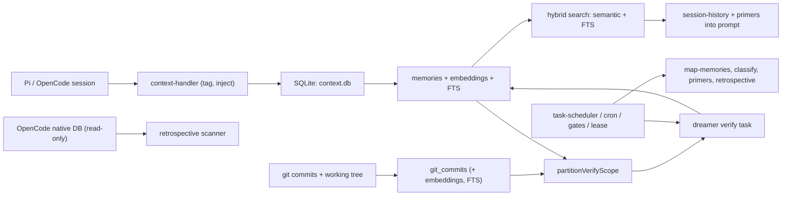

## 1. Executive Summary

Magic Context is an MIT-licensed cross-session memory plugin for coding agents, shipping adapters for [Pi](../pi/) (`packages/pi-plugin`, ~28,000 lines on its own) and for OpenCode, over a shared core. It is large — roughly 174,000 lines of TypeScript with 473 test files and about 131,000 lines of tests — and it has seventy schema migrations, most with dedicated test files.

It earns a place in this atlas for one idea that nothing else here implements:

**Memories are verified against the code they describe.** Each memory is mapped to backing files, carries its own `verified_at`, and re-enters verification scope when git reports that a mapped file changed since *that memory's* last verification — a committed change, an uncommitted edit, or a deletion. Verification is empirical, not a judgment about a claim.

This matters because the atlas's entire trust apparatus — tombstones, trust-state machines, corroboration gates — exists because propositional truth is expensive to establish. [Voyager](../voyager/) showed that procedural memory escapes the problem, since you can run a procedure and check the result. Magic Context shows a second escape: a memory *about a codebase* can be checked against the codebase. Both replace "do I believe this?" with "does reality still agree?"

The design is careful about its own limits. The comments record that a previous version used a **global commit watermark with all-or-nothing coverage**, and that it was reworked to per-memory `verified_at` precisely so a timed-out verify run banks the memories it did check and the next run continues — "the cold-start trap is gone." Memories with no file mapping are explicitly excluded from verification and handed to curation and age decay instead, because they "describe external behavior and cannot be checked against local code." That is an honest account of which memories are checkable and which are not.

The data model is among the strongest in the atlas. Lifecycle and epistemic state are **separate axes** — `status` is `active | permanent | archived`, while `verificationStatus` is `unverified | verified | stale | flagged` — which is the split [Verel](../verel/) argues for and most systems collapse into one column.

Background work is a scheduled subagent called the **dreamer**, with a task registry, gates, leases, cron, and per-run storage, which consolidates, verifies, archives, and improves memories at threshold pressure or at git commit boundaries.

The main reservations are surface area and the usual one for LLM-derived memory: the system is very large for what it does, the "verified" state depends on an LLM's judgment of whether a memory still matches its files, and cross-harness sharing widens the blast radius of any mistake.

## 2. Mental Model

The memory record carries more distinct axes than almost anything else in the atlas:

```typescript
{
  projectPath, category, content, normalizedHash, importance,
  scope: "project" | "ecosystem" | "universe",      // three-level lattice
  shareable: 0 | 1,                                  // private vs shareable
  sourceType: "historian" | "agent" | "dreamer" | "user",   // four-actor provenance
  sourceSessionId,
  status: "active" | "permanent" | "archived",              // lifecycle
  verificationStatus: "unverified" | "verified" | "stale" | "flagged",  // epistemic
  verifiedAt, expiresAt,
  supersededByMemoryId,        // correction lineage
  mergedFrom,                  // merge lineage (JSON array)
  seenCount, retrievalCount, firstSeenAt, lastSeenAt, lastRetrievedAt,
  createdAt, updatedAt, metadataJson,
}
```

Four things are worth calling out against the rest of the atlas:

- **Two independent state axes.** A memory can be `active` + `stale`, or `permanent` + `verified`. [RainBox](../rainbox/) folds candidate, active, superseded, rejected, and expired into one `status`; here reachability and belief are orthogonal.
- **Usage is tracked without being conflated with importance.** `seenCount` and `retrievalCount` are separate fields from `importance`, so nothing silently upgrades a frequently-retrieved memory's authority — the failure [Holographic](../holographic/) demonstrates.
- **A real scope lattice**, `project → ecosystem → universe`, plus a `shareable` flag that governs what may cross a boundary.
- **Four-actor provenance**, where `historian` and `dreamer` are the background subagents and `agent`/`user` are foreground writers — the same instinct as RainBox's five-actor model.

Verification lifecycle — the distinctive path:

```text
memory created (agent, user, historian, or dreamer)
-> map-memories backfill assigns backing files      [unmapped -> mapped, verified_at = 0]
-> partitionVerifyScope():
      never verified (verified_at = 0)                       -> in scope
      any mapped file changed since THAT memory's verified_at -> in scope
         (git committed change-time, uncommitted edit, or deletion)
      no-file sentinel (file-independent)                    -> excluded, curate + age decay own it
      forceBroad ("verify-broad")                            -> whole mapped pool, drift catching
-> dreamer verify task -> verificationStatus + verified_at written per memory
   (partial progress persists; a timed-out run banks what it checked)
```

## 3. Architecture

The core lives in `packages/plugin/src/features/magic-context/`, with harness adapters in `packages/pi-plugin/` and a sibling OpenCode plugin, plus `cli`, `dashboard`, `docs`, and `e2e-tests` packages.

Core modules, grouped by concern:

- **Storage and schema**: `migrations.ts` (seventy versions), `storage.ts`, `storage-db.ts`, `storage-ops.ts`, `storage-schema-helpers.ts`, plus per-concern stores for primers, notes, tags, project state, source, subagent invocations, and historian runs.
- **Integrity**: `storage-memory-mutation-log.ts` and `storage-m0-mutation-log.ts` (append-only mutation audit), `compartment-lease.ts`, `fail-closed-block.ts`, `context-authority.ts`, `storage-identity-merge.ts`, `storage-identity-rekey-map.ts`, `schema-version-fence.ts`.
- **Memory**: `memory/` — types, promotion, embeddings (local, OpenAI, synapse), `embedding-identity.ts`, `embedding-probe.ts`, `embedding-ssrf.ts`, `normalize-hash.ts`, `cosine-similarity.ts`, `project-identity.ts`.
- **Dreamer**: `dreamer/` — `task-registry.ts`, `task-scheduler.ts`, `task-gates.ts`, `cron.ts`, `lease.ts`, `verify.ts`, `verify-gate.ts`, `verify-prompt.ts`, `map-memories.ts`, `classify.ts`, `promote-primers.ts`, `refresh-primers.ts`, `retrospective-learnings.ts`, `retrospective-orphan-sweep.ts`, `open-opencode-db.ts`.
- **Retrieval and context**: `search.ts`, `search-measurement.ts`, `message-index.ts`, `compaction.ts`, `overflow-detection.ts`, `primer-clustering.ts`, `literal-probes.ts`, `recursive-text-splitter.ts`.
- **Git**: `git-commits/`, with commits indexed into `git_commits`, embedded into `git_commit_embeddings`, and searchable via `git_commits_fts`.



## 4. Essential Implementation Paths

### The verify gate (`dreamer/verify-gate.ts`)

`partitionVerifyScope` returns `{ mode, inScope, inScopeIds, skippedIds, reason }` where mode is `non-git | full | broad | incremental`. Scope is restricted to active memories that have a real backing-file mapping recorded by the `map-memories` backfill.

The module comment documents the rework away from a global watermark and states the two exclusions plainly: file-independent memories carry a no-file sentinel and are owned by curation and age decay, while unmapped memories are mapped first and then enter as never-verified.

Change detection uses `readGitChangedFilesSince`, `readGitFileChangeTimesSince`, `readGitHead`, `resolveGitTopLevel`, and `verificationFileExists` — so committed change times, uncommitted working-tree edits, and deletions are all signals.

There is also a small defensive detail worth noting: `minOf` is implemented as a reduce specifically to avoid `RangeError` from spreading a large array into `Math.min`. That is the kind of thing that only gets written after someone's verify run crashed on a big memory pool.

### Consolidation at commit boundaries (`dreamer/`)

The dreamer is a scheduled background subagent with a task registry, per-task gates, a lease so two runs cannot overlap, cron scheduling, and `storage-dream-runs` / `storage-dream-state` for durable run state. It fires at threshold pressure, at git commit boundaries, or on demand.

Commit boundaries are a genuinely new consolidation trigger for this atlas. Existing systems fire on token thresholds ([Mastra](../mastra-observational-memory/)), lifecycle hooks ([claude-mem](../claude-mem/)), accumulated significance ([Generative Agents](../generative-agents/)), debounce ([Redis Agent Memory Server](../redis-agent-memory-server/)), or budget overflow ([Hermes Agent](../hermes-agent/)). A commit is the moment a coding agent's work becomes durable, which makes it the natural point to reconcile what memory claims against what the repository now contains.

### Mining a foreign harness (`dreamer/open-opencode-db.ts`)

```typescript
const db = new Database(dbPath, { readonly: true });
db.exec("PRAGMA busy_timeout = 5000");
```

The dreamer opens **OpenCode's own session database read-only** to feed the retrospective scanner and the orphaned-child sweep, degrading gracefully when it is absent ("Absence is normal on Pi-only installs, so it is not logged as an error").

This is distinct from the plugin's cross-harness sharing, and more unusual: memory derived from another agent harness's raw history, without that harness participating. Read-only access plus a busy timeout plus graceful absence handling is the right etiquette for it, but it is worth naming as a category — a memory system whose evidence source is a *different* tool's private state.

### Retrieval (`search.ts`)

Hybrid by construction: results carry `matchType: "semantic" | "fts" | "hybrid"`, cosine similarity comes from `memory/cosine-similarity.ts`, lexical search runs through SQLite FTS5 with `bm25()` ordering and a `sanitizeFtsQuery` helper, and "source boost multipliers" weight results by origin. `parseIdShapedQuery` special-cases identifier-shaped queries. Search spans both memories and raw message history (`message_history_fts`), and `search-measurement.ts` exists to observe the result.

### Embedding identity and safety (`memory/`)

`embedding-identity.ts` and `embedding-probe.ts` track which model produced which vectors, and `memory_embeddings` is keyed `(memory_id, model_id)` so multiple models can coexist rather than silently overwriting each other. `project-embedding-registry.ts` records per-project model choice, which is what makes the cross-harness mismatch warning possible.

`embedding-ssrf.ts` deserves specific mention: it defends against server-side request forgery via a configurable embedding endpoint. Very few systems in this atlas treat "the user can point the embedder at an arbitrary URL" as a security boundary.

### Integrity machinery

- `storage-memory-mutation-log.ts` and `storage-m0-mutation-log.ts` — append-only mutation history, the [append-only memory audit](../../patterns/append-only-memory-audit/) pattern implemented directly.
- `compartment-lease.ts` and the CAS-race tests (`boundary-execution-cas-race.test.ts`, `sticky-injection-cas-race.test.ts`, `stripped-placeholder-cas.test.ts`) — compare-and-swap concurrency control with tests written against the races.
- `fail-closed-block.ts` — the plugin refuses to operate rather than run without persistent state.
- `schema-version-fence.ts` and seventy tested migrations — the most serious schema-evolution story in the atlas.
- `storage-identity-merge.ts` / `storage-identity-rekey-map.ts` — merging project identities when a repository moves or is renamed, with a rekey map so old references resolve.

## 5. Memory Data Model

SQLite at `~/.local/share/cortexkit/magic-context/context.db`, shared by the Pi and OpenCode adapters of the *same* plugin, with rows tagged by harness and by project path resolved to the git root.

Beyond memories, the schema holds compartments, facts, primers, notes, tags, session/project mappings, subagent invocations, historian runs, dream runs and state, mutation logs, message history with FTS, and git commits with embeddings and FTS.

Gaps relative to the strongest trust models here:

- **No rejected-value tombstone.** `archived` and `supersededByMemoryId` cover supersession, but nothing records "this value was judged wrong" in a way that blocks re-derivation. A memory the dreamer archives can be re-extracted from the same session history.
- **`flagged` has no documented resolution workflow** in the modules inspected — it marks a problem without an operator surface comparable to RainBox's `/memory` review page.
- **Verification is LLM-adjudicated.** The *trigger* is empirical (git says the file changed), but the judgment of whether the memory still matches the file is a model call via `verify-prompt.ts`. The gate is grounded; the verdict is not.

## 6. Retrieval Mechanics

Genuine hybrid retrieval — semantic plus BM25 with an explicit `matchType`, source boosts, identifier-query special-casing, and coverage of both memories and raw session history. Combined with `primer-clustering.ts` and `promote-primers.ts`, frequently-relevant material is promoted into compact primers rather than retrieved from scratch each time.

Two observations. Ranking is composed from several multipliers and boosts whose interaction is not readable from one expression, which `search-measurement.ts` partially compensates for. And `retrievalCount` / `lastRetrievedAt` are recorded, which enables reinforcement — the atlas's standing caution about retrieval-driven popularity loops applies if those fields ever feed ranking.

## 7. Write Mechanics

Writes arrive from four sources, distinguished in `sourceType`: foreground `agent` and `user` writes, the `historian` (session capture), and the `dreamer` (consolidation, promotion, verification). `memory/promotion.ts` promotes eligible session facts to cross-session memories synchronously (`promoteSessionFactsDurable`), with embedding deferred to a best-effort async pass (`embedPromotedFacts`) — durable first, enriched after, which is the [zero-LLM capture](../../patterns/zero-llm-capture/) ordering.

`normalizedHash` provides exact dedupe; `mergedFrom` records merge lineage when the dreamer consolidates several memories into one.

## 8. Agent Integration

The Pi adapter (`packages/pi-plugin/`) hooks Pi's `ExtensionAPI` — tagging messages through a context handler, injecting `<session-history>` and primers into the system prompt, registering `/ctx-*` slash commands including `/ctx-dream`, and spawning subagents through Pi's print mode. `clone-inheritance.ts` handles Pi's session fork/clone semantics, deciding what memory a cloned session inherits, which is a question the atlas has not previously had to consider.

Because Pi exposes no memory-provider interface at all (see the [Pi report](../pi/) and the [pluggable memory provider](../../patterns/pluggable-memory-provider/) pattern), everything here is built at the tool and lifecycle level. There is correspondingly no host-level path for a user's deletion request to reach this store.

## 9. Reliability, Safety, and Trust

Strengths — this is one of the most operationally serious systems in the atlas:

- Verification triggered by real repository change, per memory, with partial progress banked.
- Lifecycle and epistemic state kept on separate axes.
- Append-only mutation logs.
- CAS-based concurrency control with tests named after the races they close.
- Fail-closed: no persistence, no registration.
- Seventy migrations, individually tested, behind a schema-version fence.
- Embedding identity tracked per model, with multi-model coexistence and cross-harness mismatch warnings.
- SSRF defence on the embedding endpoint.
- Project identity merge and rekey for moved repositories.
- Read-only, timeout-bounded, gracefully-absent access to a foreign harness's database.

Gaps:

- **No rejected-value tombstone**, so archived memories can be re-derived.
- **`flagged` without a resolution surface.**
- **Verification verdicts are model judgments** even though the trigger is empirical.
- **Very large surface** — seventy migrations and dozens of subsystems is a lot of machinery to reason about, and correspondingly a lot to keep correct.
- **Cross-harness sharing widens blast radius**: a wrong memory now reaches two tools.
- **Reinforcement risk** if retrieval counters ever inform ranking.

## 10. Tests, Evals, and Benchmarks

The strongest test posture in the atlas by volume: 473 test files and roughly 131,000 lines of tests against about 174,000 lines of implementation, plus a dedicated `e2e-tests` package.

Coverage is concentrated where it matters — migrations have per-version tests (`migrations-v10` through `migrations-v70`), and there are named tests for CAS races, emergency drain latches, fail-closed blocking, schema fences, tagger recovery, deferred backfill failures, and identity merge. Tests named after specific failure modes are strong evidence that the defensive code reflects real incidents.

The suites were not run for this review. No committed memory-quality or retrieval benchmark was found: there is `search-measurement.ts` for observing retrieval in production, but nothing that scores recall against a fixture set. For a system whose central claim is that memories stay accurate, the absent measurement is **verification precision** — how often the verify task correctly marks a stale memory stale, and how often it wrongly confirms one.

## 11. Patterns Worth Stealing

- **Verify memory against its subject.** Map each memory to the artifacts it describes, and let a change in those artifacts — not a timer — put it back in verification scope. Where memory describes something inspectable, this converts trust from judgment into observation.
- **Per-item verification watermarks.** The rework from a global commit watermark to per-memory `verified_at` is the reusable lesson: global watermarks make partial progress worthless and create cold-start traps.
- **Name what cannot be verified.** File-independent memories are explicitly excluded and routed to curation and decay instead of being silently marked verified.
- **Separate lifecycle from epistemic state.** `active|permanent|archived` alongside `unverified|verified|stale|flagged`.
- **Consolidate at commit boundaries** — for coding agents, the moment work becomes durable is the right moment to reconcile memory.
- **Key embeddings by `(item, model_id)`** so several embedding models coexist and a model change does not silently corrupt an index.
- **Treat a configurable embedding endpoint as an SSRF surface.**
- **Identity merge with a rekey map** for when a project moves.
- **Fail closed** when persistence is unavailable.

## 12. Antipatterns / Risks

- **Supersession without tombstones**, in a system with automatic re-derivation from retained history.
- **A `flagged` state with no visible resolution workflow.**
- **Empirical trigger, model verdict** — worth stating explicitly so "verified" is not over-read.
- **Surface area** that is large enough to be its own operational risk.
- **Mining another harness's private database**, which is done carefully here but is a pattern that deserves an explicit user-consent story.

## 13. Build-vs-Borrow Takeaways

Borrow:

- The verify-gate design, essentially whole: file mapping, per-memory `verified_at`, change-driven scope, explicit exclusion of unverifiable memories.
- The two-axis state model.
- Commit-boundary scheduling.
- `(memory_id, model_id)` embedding keys and the embedding-identity registry.
- Mutation logs and CAS leases if multiple writers share one store.

Do not copy:

- The full surface, unless you need it; most projects want the verify gate and the state model, not seventy migrations.
- The absence of tombstones — pair supersession with a rejected-value record before enabling automatic re-derivation.
- Reading a foreign tool's database without an explicit user-facing consent story.

## 14. Open Questions

- How precise is verification? Nothing measures how often the verify task correctly identifies stale memories, which is the system's core claim.
- What happens to a memory that is archived and then re-derived from the same session history? Without a tombstone, apparently nothing stops it.
- What resolves a `flagged` memory, and who sees it?
- Should `retrievalCount` influence ranking? It is recorded but its use is unclear, and it is the classic reinforcement hazard.
- How is the user informed that OpenCode's database will be read?
- What does a cloned Pi session inherit, and should verification state be inherited or reset?

## Appendix: File Index

- Memory types and state axes: `packages/plugin/src/features/magic-context/memory/types.ts`.
- Verification: `dreamer/verify-gate.ts`, `verify.ts`, `verify-prompt.ts`.
- File mapping: `dreamer/map-memories.ts`.
- Dreamer scheduling: `dreamer/task-registry.ts`, `task-scheduler.ts`, `task-gates.ts`, `cron.ts`, `lease.ts`.
- Foreign-harness mining: `dreamer/open-opencode-db.ts`, `retrospective-learnings.ts`, `retrospective-orphan-sweep.ts`.
- Promotion: `memory/promotion.ts`.
- Retrieval: `search.ts`, `search-measurement.ts`, `message-index.ts`, `primer-clustering.ts`.
- Embeddings: `memory/embedding-identity.ts`, `embedding-probe.ts`, `embedding-ssrf.ts`, `project-embedding-registry.ts`.
- Integrity: `storage-memory-mutation-log.ts`, `compartment-lease.ts`, `fail-closed-block.ts`, `context-authority.ts`, `schema-version-fence.ts`, `storage-identity-merge.ts`.
- Schema: `migrations.ts` (seventy versions).
- Git indexing: `git-commits/`.
- Pi adapter: `packages/pi-plugin/src/` — `context-handler.ts`, `auto-search-pi.ts`, `clone-inheritance.ts`, `fail-closed-pi.ts`, `commands/`.
- Tests: 473 files across `packages/`, including `migrations-v*.test.ts` and the CAS-race suites; `packages/e2e-tests/`.
