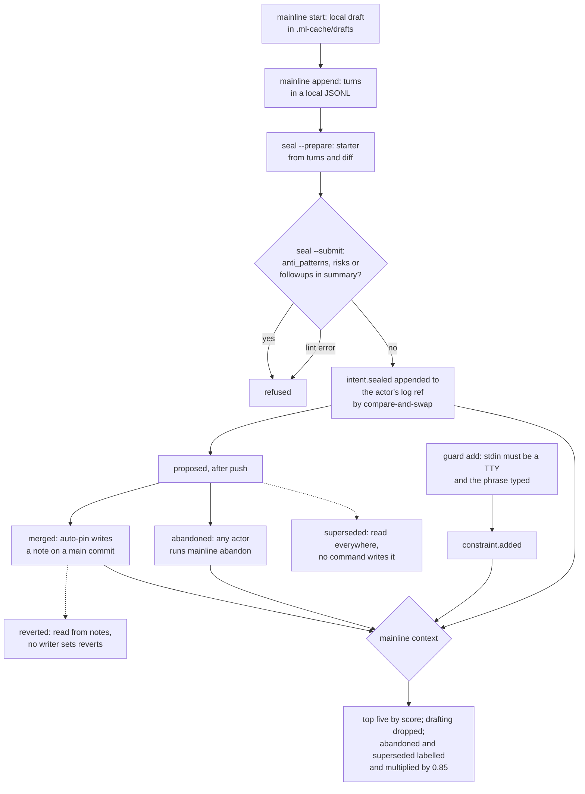

## 1. Executive Summary

Mainline is a Go CLI that gives coding agents a shared record of engineering
intent. An agent starts an intent, appends turns while it works, and seals a
summary of goal, decisions, rejected alternatives and touched files. The sealed
record is an event in a per-actor log stored as Git objects under
`refs/mainline/actors`, pushed and fetched with the repository. Before editing,
the agent runs `mainline context`, which ranks prior intents against the files
and words of the change.

What is notable is that the event log is the store. Each append is a commit on
the actor's ref moved by compare-and-swap, and every view is a replay. Seal
refuses agent-written constraints, which only an interactive `guard add` from a
terminal can create.

What is weak is the lifecycle. Two of its seven states, superseded and
reverted, are read by retrieval, the Hub, trace and risk expiry, and no command
in the tree writes either. The published eval's largest win is on a fixture that
seeds one of them directly.

The licence is layered. The CLI, skills, hooks, SDKs and the two protocol specs
are Apache-2.0, documentation is CC-BY-4.0 or Apache-2.0, and the name, brand and
hosted services are excluded (`LICENSE`). GitHub reports no single SPDX
identifier.

Two marks. `audit_log` is earned on the actor log itself, and `negative_eval` on
a retrieval test that keeps a resolved risk's text from making its intent
relevant, beside an open risk that must. Section 9 names the five withheld.

## 2. Mental Model

A memory is an intent: one unit of agent work, with the reasoning the agent
attached when it finished. It becomes shared belief when `seal --submit`
appends an `intent.sealed` event and pushes the actor's ref. It is then
`proposed`, and becomes `merged` when a sync finds a Git note on a `main`
commit naming it. Nothing extracts it, and Mainline calls no model; the agent
writes the summary and the CLI validates it.

An intent stops being current in three ways, by design. `mainline abandon`
writes an `intent.abandoned` event (`internal/engine/intent.go:411-485`). An
`intent.superseded` event marks it replaced (`internal/engine/sync.go:330-338`).
A note listing it under `reverts` marks it reverted (`:801-806`). The last two
are readers only: a tree-wide search finds `IntentSupersededEvent` and
`IntentMergeAcknowledgedEvent` constructed in two test files and nowhere else,
and no `CommitNote` literal outside tests sets `Reverts`.

Retrieval maps lifecycle to a second status the agent sees: `abandoned` for
abandoned or reverted, `superseded`, `stale` at 90 days or after three later
intents touched one of its files, and otherwise `current`
(`internal/engine/context_retrieval.go:573-600`). The status is a label with a
guidance line and a 0.85 score multiplier. An abandoned intent is shown on
purpose, as *"this approach was abandoned — understand why before retrying"*.

Constraints are a separate record with a different authority. Only
`guard add` creates one, a `constraint.added` event, and only a high-severity
constraint whose files overlap the change is surfaced, as an inherited
constraint the next seal must acknowledge by id
(`internal/domain/inherited.go:49-142`). No event retires a constraint.

## 3. Architecture

One Go binary over the `git` executable. The store is Git: event blobs in
single-file trees, one commit per event, on a ref per actor
(`internal/storage/storage.go:470-516`). Merge evidence is JSON in Git notes at
`refs/notes/mainline/intents` (`internal/gitops/git.go:886`). Team config is
`.mainline/config.toml`, committed. Everything derived lives in `.ml-cache/`,
which `init` adds to `.gitignore` (`internal/engine/engine.go:272`): drafts and
turn logs, the rebuilt `views/mainline.json`, and a SQLite reverse index at
`views/mainline.db` used to narrow the candidate set
(`internal/storage/sqlite_cache.go:32-34`).

`mainline sync` fetches every actor ref and the notes. It reads each log through
one `git log` and one `cat-file --batch` per actor in a bounded worker pool,
deduplicates events by their bytes, sorts by the event's own timestamp and
replays (`internal/engine/sync.go:515-591`). The view is rebuilt from nothing on
each sync. Webhooks fan domain events out through a detached sender process.

The Hub is a static HTML export of the view with heatmaps, lineage and team
health (`internal/hub/`). It displays and edits nothing.

### Deployment and ergonomics

Nothing has to run besides `git`. No API key, model or network is needed to
store anything; a remote is needed only to share. `mainline init` writes config,
configures the ref and notes refspecs, installs the skill and the hooks for the
detected agents, and records a coverage baseline. The store can be read with
`mainline log`, `show` and `trace`, or with `git cat-file` on the actor refs. A
record cannot be repaired by editing a file, since a fix is a new event; a wrong
view is repaired by re-syncing.

## 4. Essential Implementation Paths

**Capture.** `StartWithOptions` creates a draft for the current branch, or
returns the existing one (`internal/engine/intent.go:43-60`). `Append` adds a
turn with its description, file changes and caller, stored in
`.ml-cache/drafts/` as a turn log. Turns never leave the machine; only their
count travels in the sealed event (`internal/engine/seal.go:532`).

**Seal.** `SealPrepare` builds a starter from the turns and the diff against the
draft's base (`seal.go:19-127`). `SealSubmitWithOptions` refuses a summary
carrying `anti_patterns`, `risks` or `followups` (`:390-424`, `:452-454`),
validates required fields, and overwrites `user_goal` with the draft's goal
(`:478-481`). It checks the prepare snapshot against HEAD, branch and worktree,
fails on any error-level lint issue (`:499-508`), then appends the event and
pushes (`:560-589`). A push failure leaves the intent `sealed_local`.

**Signals.** `AddConstraint`, `AddRisk` and `AddFollowup` each append one event
and push (`internal/engine/signals.go:35-208`). The CLI wraps the constraint
path in a terminal check and a typed confirmation phrase
(`internal/cli/signals.go:46-72`), and stamps `Source` as an explicit user
(`:78-86`). Risk and follow-up commands have no such gate.

**Replay.** `rebuildView` dispatches on event type (`sync.go:240-481`), then
`scanMainNotes` applies merge and revert notes over the result (`:661-806`), so
a merge note overrides an earlier abandon.

**Retrieve.** `RetrieveContext` takes `current`, `files` or `query` mode
(`context_retrieval.go:220-373`). It narrows candidates through SQLite when it
can, drops drafts, scores, and applies a 0.05 threshold. It then pulls in
intents superseded by a returned intent (`:663-717`), sorts, forces each
superseder directly above what it replaced (`:725-749`), truncates to five, and
attaches inherited constraints.

**Inject.** The session-start hook runs sync and status and renders a Markdown
block bounded at 32 KiB; the prompt-submit hook renders status and proposals at
16 KiB (`internal/hooks/dispatcher.go:89-90`, `:231-273`, `:317-425`). Neither
runs `context`; the block tells the agent to.

**Import.** `ImportActorLog` accepts a fork contributor's log after checking
every event belongs to the named actor (`internal/engine/actor_import.go:232-261`).
It refuses a divergent head unless forced (`:116-128`), and records the
acceptance as an event in the importer's own log (`:133-169`).

## 5. Memory Data Model

| Record | Key fields | Producer |
| --- | --- | --- |
| `intent.sealed` | intent id, thread, goal, branch, base and code commit, summary, fingerprint, worktree status, dirty files, references, risk and follow-up resolutions | `seal --submit` |
| `intent.abandoned` | intent id, reason | `mainline abandon` |
| `intent.superseded` | intent id, superseded by, reason | none outside tests |
| `intent.merge_acknowledged` | intent id, merge commit | none outside tests |
| `constraint.added` | constraint id, files, what, why, severity, source | `guard add` |
| `risk.added`, `followup.added` | id, intent, files, structured statement | `risks add`, `followups add` |
| `risk.resolved`, `followup.resolved` | id, resolving intent, rationale | resolve commands, or inside a seal |
| `check.judgment` | candidate intent, judgments, overall | `check --submit` |
| `actor_log.accepted` | source ref and head, previous target head, sealed ids | `actor import` |

Every event carries `event_id`, `schema_version`, `actor_id`, `actor_name` and
`timestamp` (`internal/domain/events.go:21-28`). The summary separates
`decisions` and `rejected` alternatives from `review_notes`, which no retrieval
surface reads (`internal/domain/types.go:218-241`).

**Scope is the repository.** Every actor's log reaches every clone that fetches
the remote. `actor_id` records who wrote an event; the only read that compares
it is a preflight check on whether a proposal belongs to the caller
(`internal/engine/preflight.go:370`). Branch adds 0.15 to a score in `current`
mode and filters nothing (`context_retrieval.go:311-315`).

**Time** is the event timestamp and `sealed_at`, both written by the client.
Merge time comes from the commit the note sits on. There is no validity time.

## 6. Retrieval Mechanics

Scoring is additive and fixed in code (`context_retrieval.go:793-919`):

- 0.20 per overlapping file, capped at 0.40, and 0.10 per path-derived subsystem;
- 0.05 per title keyword, 0.025 per keyword in what and in why, and 0.05 for the
  first matching decision;
- a contribution for open risk and follow-up text;
- 0.10 for an intent sealed in the last seven days, 0.05 in the last thirty.

Query mode drops any intent whose only signal is recency or path (`:316-318`).
The query tokenizer carries a short-term allowlist, aliases and a CJK fallback
through `go-ego/gse` (`internal/engine/context_query_tokenizer.go`).

The decision surface is three decisions per intent and five intents per call
(`:184-215`). Constraints are never truncated. A retrieval returns JSON with a
reason list per intent and, in query mode, a breakdown of every weight, so an
agent can see why something ranked.

The lineage rule is the careful part. A superseded intent below threshold is
still returned when its replacement is, scored no lower than the replacement and
placed immediately after it (`:663-749`). The eval report traces this to a
failure where the old plan vanished below the threshold. At this pin the rule
acts only on imported logs, because no command emits supersession.

Retrieval does not read the abandon reason. `ContextRelevant` declares
`abandoned_reason` and nothing assigns it; the reason is reachable through
`mainline trace`, which reads the raw event (`internal/engine/trace.go:280-285`).

## 7. Write Mechanics

Every write is an explicit CLI call by the agent or a person. Hooks write
nothing to the store; the dispatcher's comment says start, append and seal
*"require semantic judgment that hooks cannot perform without an LLM"*
(`dispatcher.go:100-110`). The skill tells the agent when to start, append and
seal, and tells it not to create constraints
(`skills/mainline/SKILL.md:489-496`).

Agent-authored content is checked for shape, not truth. Lint blocks a seal on
deterministic issues and warns when a risk reads like a rule
(`internal/engine/lint.go:171`). Nothing compares a decision to the code.

Append-only holds for events, not for the view. A re-seal of the same intent id
replaces the view entry, because the replay assigns `intentMap[evt.IntentID]`
per sealed event (`sync.go:301`). Abandon checks the transition table
(`internal/core/core.go:113-131`) and not the actor, so any teammate can abandon
anyone's proposal (`intent.go:411-485`).

### Operational cost

- Write: synchronous, one blob, one tree, one commit and one ref update, then a
  push and, after a seal, a full sync and phase-one conflict scan. No model call.
- Lag: an intent is in the author's view once the seal's sync completes, and in
  a teammate's at that teammate's next sync, which the session-start hook runs.
- Background: none scheduled. Each sync replays every event from every actor and
  rewrites the view, so the cost grows with the history, not the day's work.
- Read: the hook injects at most 32 KiB at session start and 16 KiB per prompt.
  Both blocks change with every sync and sit in system context, where they
  invalidate a cached prefix.

## 8. Agent Integration

`mainline hooks install` writes hook entries for Claude Code (SessionStart,
UserPromptSubmit, Stop, PreCompact, SessionEnd), Codex, Cursor and Pi
(`internal/hooks/agents/`). Only session start does work. The other events are
webhook signals, and compaction is a no-op branch reserved for later
(`dispatcher.go:194-224`). Re-injection after compaction therefore depends on
the host firing SessionStart again.

The agent holds every write verb except `guard add`. The skill and the
session-start block ask it to run `context` before non-trivial edits and to
treat retrieved intents as history to verify. Preflight reports overlaps with
proposed and upstream intents at `warn` or `block` with `ok_to_continue`, and the
autonomy setting names a stop line. `buildAgentAuthority` marks itself
`AdvisoryOnly: true` (`internal/engine/authority.go:89-108`), so both are
guidance.

Adapting this to another agent means a hook adapter and the skill text. The
store and retrieval know nothing about the host.

## 9. Reliability, Safety, and Trust

**Concurrency is handled at the ref.** Two processes appending to one actor log
race on `update-ref` with the observed parent; the loser retries on the new head
up to 128 times (`storage.go:491-515`). Cross-actor ordering is by
client-written timestamp, so clock skew reorders replay.

**The view trusts every event it can fetch.** Import validates that each event
belongs to the actor being imported. The normal sync does not, so an event in
one actor's log can abandon or re-seal an intent another actor owns. In a team
that trusts its push access this is collaboration; with outside contributors,
push access is the boundary. The fetch refspec is forced
(`internal/domain/config.go:102-106`), so a force-pushed log replaces the
remote-tracking copy. A local ref still holding the dropped events keeps them in
the replay, because replay deduplicates across both.

**Delete does not exist.** No command removes a sealed intent, a constraint or
an event, and a secret written into a seal travels with every push of the
actor ref. `doctor` deletes only stale local drafts.

**Uncertainty is representable only as age.** The `stale` status flags an
intent by time or file churn; nothing records that a decision was found wrong.

Capability marks:

- `audit_log` — awarded; the append-only actor log is the store, with every
  intent, constraint, risk and follow-up mutation an event. The frontmatter
  record states its limits.
- `negative_eval` — awarded; evidence in section 10.
- `trust_state` — withheld. Lifecycle and retrieval status are discrete, and
  neither withholds anything from being treated as true: abandoned, superseded
  and reverted intents are returned on purpose, labelled and multiplied by 0.85.
  The one exclusion, `drafting`, is a work-in-progress state, not a verdict.
  Resolved risks leave scoring, and resolution means addressed, not disbelieved.
- `tombstone` — withheld. `rejected` alternatives and abandoned intents are text
  on a record. Nothing keyed on a rejected value refuses a later seal that
  re-asserts it, and preflight compares goals only against proposed intents.
- `bitemporal` — withheld; one client-written time per event.
- `scope_enforced` — withheld. The boundary is the repository and its remote;
  `actor_id` and branch are on the record and no read filters by them.
- `human_review` — withheld. `guard add` is the strongest human gate in the
  tree: it refuses a non-terminal stdin and requires a typed phrase. It is
  authoring, though. A person writes the constraint directly, and no
  agent-proposed constraint waits anywhere for it. A shell that allocates a
  terminal would also pass the check.

## 10. Tests, Evals, and Benchmarks

Nothing was built or run for this report; everything below is from reading the
tests and committed results at the pin.

**The negative case.** `TestContextRetrieval_QueryModeScoresOnlyOpenRisks`
(`internal/engine/context_retrieval_test.go:117-198`) is a read-path exclusion
over a populated set, with a positive control in the same query. A second case
asserts an empty result for a query matching only a legacy anti-pattern
(`:426-480`), which a retriever returning nothing would also pass; the mark rests
on the first. `TestContextRetrieval_DraftingIntentsExcluded` (`:310-333`) loops
over the results looking for the draft and has no positive control.

**Lifecycle in retrieval.** One test abandons a sealed intent through the
service and asserts it is returned, labelled and ranked below a merged twin
(`:259-308`). The supersession tests seal both intents and then write the status
straight into the view. The helper's comment gives the reason: *"so the test
does not depend on a Supersede CLI command shape that may evolve"*
(`:803-816`). `rebuild_view_property_test.go` appends superseded and
merge-acknowledged events through `AppendActorLogEvent` (`:112-128`,
`:355-365`), which tests the reader with events the product cannot write.

**Property tests.** Sixty-six `rapid.Check` calls cover replay consistency, sync
idempotence, note shape, conflict detection and seal invariants, with failing
seeds committed under `internal/engine/testdata/rapid/`. CI runs the quick suite,
which excludes them by build tag, and `full-pbt.yml` runs them in full.

**The published eval.** `docs/eval-results.md` reports a deterministic layer at
8/8 fixtures on 24 May 2026. Its live layer ran three seeds, with code-first
agents at 9 violations and intent-first at 0. The committed summary
`docs/eval-live-3seed.json` recomputes: 3 per seed, of which 6 come from
`superseded-decision` and 3 from `abandoned-approach`. It holds no transcripts,
and the document marks the live layer as not rerun since the fixtures changed.

Fixtures are built by `BuildView`, which writes `Status` and
`SupersededByIntent` straight into a view (`internal/eval/eval.go:205-230`;
`internal/eval/fixtures.go:145-163`). Two thirds of the measured advantage sits
on a state no Mainline command produces at this pin.

No paper or citation block is in the tree.

## 11. For Your Own Build

### Steal

- **Make the log the state, and append by compare-and-swap on its head.** A view
  that is always a replay cannot drift from the record of what happened, and a
  CAS retry on the parent turns concurrent writers into an ordering problem
  rather than a lost write.
- **Split the authority of records by who may create them.** Here the agent
  writes history and a person writes rules; seal rejects the rule-shaped fields
  outright rather than accepting and ignoring them.
- **Pull a replaced record in with its replacement.** A relevance threshold
  should filter independently found records, not cut a lineage in half.
- **Return the scoring breakdown with the result.** An agent that can see why a
  record ranked can argue with it.
- **Budget hook injection in bytes and say what was cut.**

### Avoid

- **Shipping a lifecycle state without the verb that sets it.** Supersession
  here has a spec section, an event type, readers in four surfaces, a ranking
  rule, property tests and an eval fixture, and no command.
- **Evaluating on states seeded straight into the view.** The fixture measures
  the reader; it says nothing about whether real use ever reaches that state.
- **Replaying events without checking the event's actor against the record it
  changes.** Validation that runs only on import leaves the everyday path open.
- **A declared output field with no writer.** `abandoned_reason` is in the
  retrieval schema and empty on every result, on the one status whose reason
  the product leads with.

### Fit

This suits a team whose agents work in one repository with shared push access
and who want the reasoning behind changes to travel with the code, with no
service to run. The memory is coarse, one record per unit of work, and the
retrieval is deterministic and inspectable, which is the right trade for
history an agent should verify against code anyway. It does not suit memory
that must be deleted, scoped below the repository, or trusted across
contributors who do not trust each other. For fact-level recall across
conversations, [beads](../beads/) keeps a flat key-value plane and
[Rekal](../rekal/) ships whole sessions over Git.

## 12. Open Questions

- Did an earlier release produce supersession, and do existing repositories
  carry `intent.superseded` events from it? A GitHub commit search for
  `supersede` returned retrieval, eval and test commits from 28 and 29 April
  2026 among its first five, and the full history was not read.
- The `CommitNote` comment names *"the removed mainline merge command"*; was it
  the writer of the `reverts` field that sync still reads?
- How large do actor logs grow in practice, and how long does a full replay take
  at session start on a repository with thousands of intents?
- Does the hosted Hub apply any actor check that the CLI's replay does not?

## Appendix: File Index

- **Event model:** `internal/domain/events.go`, `internal/domain/types.go`,
  `internal/domain/inherited.go`, `internal/domain/risks.go`,
  `internal/core/core.go`.
- **Storage:** `internal/storage/storage.go`, `internal/storage/sqlite_cache.go`,
  `internal/gitops/git.go`, `internal/domain/config.go`.
- **Write path:** `internal/engine/intent.go`, `internal/engine/seal.go`,
  `internal/engine/signals.go`, `internal/engine/lint.go`,
  `internal/cli/signals.go`, `internal/engine/actor_import.go`.
- **Replay and merge:** `internal/engine/sync.go`, `internal/engine/merge.go`,
  `internal/engine/notes_recovery.go`.
- **Retrieval:** `internal/engine/context_retrieval.go`,
  `internal/engine/context_query_terms.go`, `internal/engine/preflight.go`,
  `internal/engine/trace.go`.
- **Integration:** `internal/hooks/dispatcher.go`, `internal/hooks/agents/`,
  `skills/mainline/SKILL.md`, `internal/engine/authority.go`.
- **Tests and eval:** `internal/engine/context_retrieval_test.go`,
  `internal/engine/rebuild_view_property_test.go`, `internal/eval/`,
  `docs/eval-results.md`, `docs/eval-live-3seed.json`.

### Recorded searches

Checked against the checkout at the pinned revision, from the tree root.

- `rg -n 'IntentMergeAcknowledgedEvent\{|IntentSupersededEvent\{' --type go` — `internal/engine/actor_import_test.go:308` and `internal/engine/rebuild_view_property_test.go:112,128,355,365`; no non-test constructor.
- `rg -n 'intent\.superseded|merge_acknowledged|superseded_by"' .` — a trace label and Hub and test strings beside the constant definitions; no writer.
- `rg -n 'CommitNote\{' --type go -g '!*_test.go' -A8` — four literals in `internal/engine/merge.go` (`:306`, `:363`, `:434`, `:756`), none setting `Reverts`.
- `rg -n 'AbandonedReason' --type go` — the field declaration at `context_retrieval.go:139` and a comment at `internal/eval/eval.go:98`; no assignment.
- `rg -n 'isatty|IsTerminal' --type go -g '!*_test.go'` — `cli/signals.go:47` on `guard add`, `cli/init.go:203-204` and the spinner; no check on risks, follow-ups, abandon or actor import.
- `rg -n 'ActorID|Publication|Thread ==' internal/engine/context_retrieval.go internal/engine/preflight.go` — the same-thread boost at `context_retrieval.go:311` and the ownership check at `preflight.go:370`; no scope predicate on retrieval.
- `rg -n -i 'redact|secret|forget|purge|delete.*intent|remove.*constraint' --type go -g '!*_test.go'` — webhook secrets, draft deletion and comments; no delete of a sealed record or a constraint.
- `rg -n -i 'anthropic|openai|api\.|http\.(Post|Get|NewRequest)|embedding|vector' --type go -g '!*_test.go'` — comments, the webhook sender and the eval runner's documentation; no model call on the product path.
- `rg -n -i 'arxiv|bibtex|@article|@misc|doi\.org|CITATION' .` — no match, and no `CITATION.cff`.

## History

**2026-10-03** — [`79f4be3bc15adadc9d3f3ff97aa4f7d44a76762f`](https://github.com/mainline-org/mainline/commit/79f4be3bc15adadc9d3f3ff97aa4f7d44a76762f) — first reading, at the head of `main`, a merge commit dated 2 October 2026, after v0.5.1. Two marks, `audit_log` and `negative_eval`. Screened before reading: 2 auto-run surfaces (`.cursor/rules/` and `.github/copilot-instructions.md`, both agent instruction text), 1 build-time execution point (`Makefile`), 2 files inside the cooldown (`go.mod`, `go.sum`) — inflated, as every file in the depth-1 clone dates to the tip — and no unpinned surface; `AGENTS.md` and `CLAUDE.md` were treated as data. The layered `LICENSE` was read and carries no rider on analysis. Nothing was installed, built or run.
