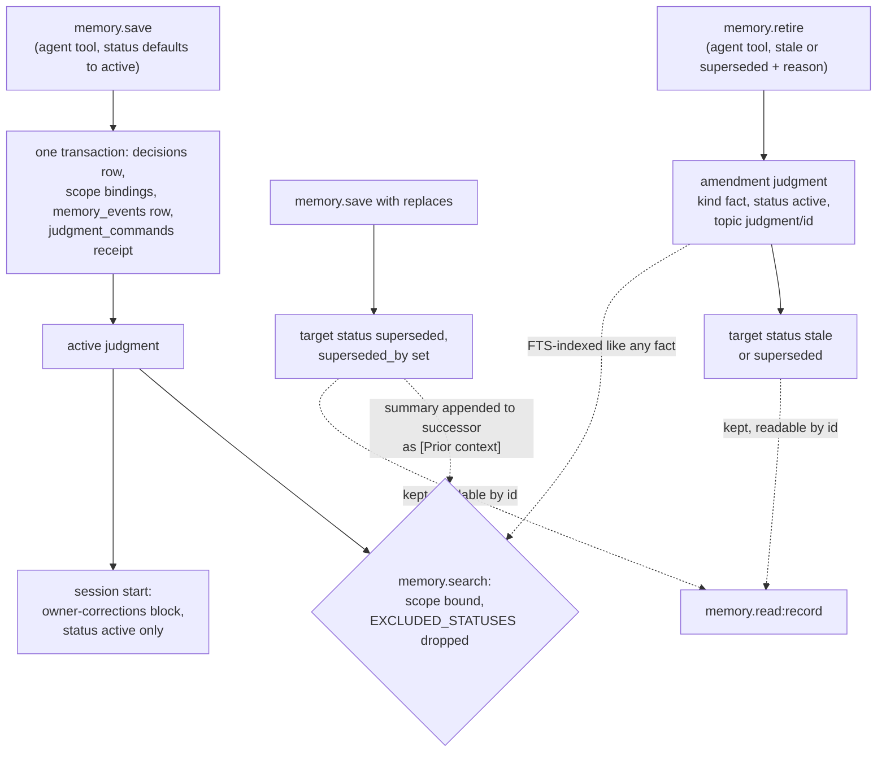

## 1. Executive Summary

MAMA is two products on one engine. **MAMA OS** is a local daemon that runs one
Claude or Codex CLI session for an owner, fed by Telegram and by connectors such
as Slack, Gmail and Trello. It keeps originals, work items and the owner's
corrections in SQLite. A **Claude Code plugin** with an MCP server gives coding
sessions a decision memory. Both write through **mama-core**, whose memory unit
is a *judgment*: a row the agent authors, never edited in place, only superseded
or retired by a later appended record.

What is notable is the write discipline. Every memory mutation outside migrations
runs through one function, `appendJudgmentOnAdapter`. It binds scopes, writes an
event row and stores an idempotent receipt in one transaction
(`packages/mama-core/src/knowledge/judgments.ts:550-930`). Reads through the
action catalog are bounded by the caller's grant and fail closed on an empty one.

What is weak is where the filters stop. Recall excludes superseded rows, then
appends each superseded predecessor's summary to its successor as
`[Prior context]`, unfiltered and untested. The agent can save and retire the
owner's standing corrections from any turn, including turns driven by source
content. The Claude Code surface is unscoped unless the model passes a scope.

This report covers the memory tier: the `decisions` table, its scope bindings,
events and amendments, and the two products' read paths into it. The work
ledger (commitments), raw observations and the wiki are read only where they
touch memory.

Five marks: `trust_state`, `bitemporal`, `scope_enforced`, `audit_log` and
`negative_eval`. Section 9 names the two withheld and the tier each awarded mark
rests on.

## 2. Mental Model

A memory is a judgment the agent writes. It becomes a belief the moment
`memory.save` commits: the row lands `active` unless the caller names another
status, and no candidate state or extraction step sits between the call and the
belief. Raw conversations and connector messages are not memories. They are
immutable observations, and `ingestConversation` refuses its old `extract`
option rather than inferring judgments from them
(`packages/mama-core/src/memory/api.ts:1990-1998`).

**A judgment stops being believed in three ways, and none deletes it.** A later
save naming it in `replaces` sets its `status` to `superseded` and its
`superseded_by` to the new id (`judgments.ts:685-707`). `memory.retire` appends
an amendment record carrying a required reason and moves the target to `stale`
or `superseded` (`api.ts:1125-1176`). A caller may also save a row directly as
`stale` or `contradicted`, because `status` is a field of `memory.save`'s input
schema (`packages/mama-core/src/api/catalog.ts:674-678`). Nothing in the tree
writes `contradicted` any other way.

**The amendment is itself a judgment.** Retiring `X` inserts a new row of kind
`fact`, status `active`, topic `judgment/X`, summary *"Status 'stale' applied to
X: reason"*, linked to `X` by an `amends` edge (`api.ts:1158-1173`). The
retirement record lives in the same table as beliefs, indexed by the same FTS
triggers.

**Correction of the owner's guidance is prompted, not structural.** The owner
system prompt tells the agent to compare a new correction with those shown and
either revise one through `replaces` or save a new one, and to retire withdrawn
guidance with a reason
(`packages/standalone/src/runtime/owner-system-prompt.ts:133-137`). The code
enforces the shape of guidance: an `appliesWhen` line, and ordered steps for a
workflow (`api.ts:627-663`). Whether the text is right is the agent's call.

## 3. Architecture

Four packages in a pnpm workspace. `mama-core` holds storage, migrations,
records, recall, embeddings, the action catalog and dispatch. `standalone`
(MAMA OS) is the daemon: connectors, messenger gateways, the owner runtime, a
wiki writer and a viewer on `127.0.0.1:3847`. `mcp-server` exposes development
memory over stdio. `claude-code-plugin` ships hooks and slash commands and starts
that MCP server with `npx -y @jungjaehoon/mama-server`. The two products do not
share a daemon or a default database (`docs/explanation/architecture.md`).

**Persistence is one SQLite file per product**, opened through `node:sqlite`,
with numbered migrations up to `098-workflow-memory-kind.sql`. The development
database defaults to `~/.claude/mama-memory.db`
(`packages/mcp-server/src/server.js:43-51`). Judgments live in `decisions`,
beside `memory_scopes`, `memory_scope_bindings`, `memory_events`,
`command_bindings`, `judgment_commands` and `decision_edges`. An FTS5 table is
kept in sync by four triggers (`098-workflow-memory-kind.sql`). Embeddings are
1024-dimension `Xenova/multilingual-e5-large` vectors computed in process and
searched by brute-force cosine over an in-memory cache
(`packages/mama-core/src/db-adapter/node-sqlite-adapter.ts:383-410`, `:613-700`).

**The owner agent is a CLI subprocess.** MAMA OS keeps one persistent Claude or
Codex session. Owner messages, connector deltas, scheduled reports and native
events reach it through a durable mailbox, and it acts only through registered
actions dispatched back to the daemon. Nothing runs in the background over
memory: no consolidation, decay or re-extraction.

### Deployment and ergonomics

MAMA OS needs Node.js 22.13+, pnpm, a logged-in `claude` or `codex` CLI and a
Telegram bot. At this commit it is an unreleased rebuild built from the checkout
(`README.md`). The first embedding downloads the e5-large model, about 560 MB
by the changelog's figure. No API key is needed to store anything; the agent's
model calls go through the owner's CLI login. The store is SQLite and readable by
hand, and the viewer serves read-only pages. A wrong memory is fixed by a
superseding save or a retirement, never an edit, so a hand repair is an appended
record like any other.

## 4. Essential Implementation Paths

**Write.** `memory.save` (`catalog.ts:964-1019`) → `saveJudgmentRecord`
(`api.ts:819-853`), which strips any caller `provenance` field and composes it
from host-attested session facts → `saveMemoryInternal` (`api.ts:665-800`) →
`appendJudgment` (`judgments.ts:949-963`). The dispatcher first scans the input
of every `recallableWrite` action for secret-shaped material and refuses a match
(`packages/mama-core/src/api/dispatch.ts:153-172`). The MCP `save` tool calls the
older facade `mama.save` → `saveInternal` (`packages/mama-core/src/mama-api.ts:333-540`)
→ `saveLegacyMemoryInAdapter`, the same append.

**The append.** `appendJudgmentOnAdapter` (`judgments.ts:550-930`) validates
links, amendment targets and scopes against the caller's admitted scopes and
embeds `topic + summary` before opening the transaction. Then, in one
`transactionImmediate`, it inserts the `command_bindings` row (a replayed command
id returns its stored receipt), the `decisions` row, one `memory_scope_bindings`
row per scope, links, `replaces` supersessions, amendments, projections,
commitment rows, the `memory_events` row and the `judgment_commands` receipt.

**Recall.** `memory.search` (`catalog.ts:1161-1236`) → `boundReadScopesFor` →
`suggestInAdapter` (`api.ts:2483`) → `recallMemory` (`api.ts:1193-1884`). A
scope, kind or quality option routes the call to the fused path. Without one,
the older vector-then-keyword path at `api.ts:2815-3110` runs, which is what the
MCP `search` tool reaches when the model passes no scope.

**Session-start injection.** The owner runtime's `guidanceResolver` reads
lessons, preferences, constraints and workflows through
`readMemoryRecordsInScopes` (`packages/standalone/src/runtime/owner-runtime.ts:322-327`).
`renderGuidanceIndex` emits the active ones oldest first on a new session, and
`renderGuidanceDelta` emits added, revised and retired entries on later turns
(`stimulus-delivery.ts:565-625`, `:721-745`).

**Retire.** `memory.retire` (`catalog.ts:1628-1701`) strips read-only grants,
bounds scopes, and calls `retireMemoryRecord` (`api.ts:1125-1176`), which appends
a judgment whose `amends` entry moves the target's status in the same
transaction.

**Dead path.** `promoteMemoryStatus` (`api.ts:906-1120`) runs topic and vector
matching through `resolveMemoryEvolution` to supersede a same-topic predecessor
automatically. It is exported and has no caller outside tests.

**Claude Code hooks.** The PreToolUse hook on `Read` embeds the file's name,
calls `vectorSearch` with no status exclusion and no scope, and prints up to
three decisions above 0.6 similarity on the first read of each file per session
(`packages/claude-code-plugin/scripts/pretooluse-hook.js:140-180`). On the
dev-memory database nothing moves a status, so the missing exclusion has no
effect there at this commit.

## 5. Memory Data Model

| Table | Holds | Notes |
| --- | --- | --- |
| `decisions` | every judgment and amendment | `status` CHECK active, superseded, contradicted, stale; `kind` eight values; `record_kind` legacy, judgment, commitment; `event_date`, `event_datetime`, `created_at`, `updated_at`; provenance columns `agent_id`, `model_run_id`, `envelope_hash`, `gateway_call_id`, `source_refs_json`, `provenance_json`; `payload_json` for guidance |
| `memory_scopes`, `memory_scope_bindings` | scope identity and row binding | kinds global, user, channel, project; one binding marked primary |
| `memory_events` | one row per append | `event_type`, `actor`, `memory_id`, `topic`, `scope_refs`, `evidence_refs`, `reason`, `created_at` |
| `command_bindings`, `judgment_commands` | idempotency and receipts | principal, payload hash, receipt JSON |
| `decision_edges` | supersedes, builds_on, refines, contradicts and more | `created_by`, `approved_by_user` |

**Scope is a binding, not a column.** A judgment carries its scopes as rows in
`memory_scope_bindings`, written in the append transaction
(`judgments.ts:673-681`). The owner runtime admits `global:system`, the owner's
`user` scope, and a `channel` and `project` scope per connector
(`packages/standalone/src/runtime/action-surface.ts:109-121`). An owner save with
no scope request binds to all of them, so in the shipped product every owner
memory carries every owner scope.

**Time has two axes.** `created_at` is the record time and `event_datetime` the
time the caller says the thing happened. The graph read derives an interval from
them, described in section 6.

**Provenance is attested, not accepted.** `stripCallerProvenance` removes any
`provenance` field from the input (`packages/mama-core/src/memory/provenance.ts:34-45`),
and the catalog path fills actor, model run, gateway call and source message
from `ActionSessionFacts` (`api.ts:835-846`). On the MCP path, `handleSave`
always passes `type: 'user_decision'` (`server.js:386-387`), which `saveInternal`
maps to `user_involvement = 'approved'` (`mama-api.ts:407-411`). `formatList`
then labels every such row *"👤 User"*
(`packages/mama-core/src/decision-formatter.ts:993`).

**Declared and unfilled.** `memory_truth` (migration 021) has no writer outside
migrations. `quarantined` sits in `EXCLUDED_STATUSES` and in
`MEMORY_TRUTH_STATUSES`, and the `decisions` CHECK does not admit it.

## 6. Retrieval Mechanics

`recallMemory` runs two channels and fuses them by reciprocal rank. The vector
channel embeds the query, and each sub-query when the question has *and*/*or*
structure, then asks the adapter for the top 20 (50 for aggregation questions)
with the excluded statuses pre-filtered (`api.ts:1257-1320`). The lexical
channel runs FTS5 BM25 over an OR of stemmed non-stopword tokens and rescores by
topic affinity before fusion. An in-memory substring scan is the fallback when
FTS returns nothing (`api.ts:1339-1500`). Fusion weights the lexical rank and
discounts vector-only hits (`api.ts:1515-1560`).

**Every arm re-applies status and scope.** A vector hit whose status is in
`EXCLUDED_STATUSES` is skipped, and when scopes are requested a hit with no
binding or no matching binding is dropped (`api.ts:1280-1298`). The FTS arm
re-reads each row and applies both checks (`api.ts:1419-1444`), fusion repeats
the status check (`:1535`), and graph expansion re-filters both
(`api.ts:1750-1776`). The scope filter runs after the vector top-K, so a caller
whose rows rank below foreign ones gets fewer results, not foreign ones.

**Then the superseded text comes back.** After fusion, every returned record is
looked up by `superseded_by = record.id`, and each predecessor's summary is
appended to the record's details as `[Prior context] …`
(`api.ts:1702-1727`). The query has no status filter and no scope predicate. Its
comment justifies it by an extraction step the same file has removed. A revised
owner correction therefore returns from `memory.search` with the text it
replaced.

**The graph read carries both time axes.** `graph.query` windows a memory's
timeline event on `event_datetime`, falling back to `created_at`, against
`from_ms`, `to_ms` and `as_of_ms`
(`packages/mama-core/src/knowledge/graph-query.ts:741-762`, `:765-803`). A memory
node reports `recordedAt`, `appliesFrom` and an `appliesUntil` taken from its
successor's `created_at`, and says `not_yet_effective` when `appliesFrom` is
after the as-of time (`:1413-1456`).

**Injection is bounded by kind, not size.** The owner block lists every active
guidance record in full at session start, oldest first, and afterwards only the
changes. Nothing caps its length.

## 7. Write Mechanics

Writes are explicit tool calls and block the agent for one embedding and one
SQLite transaction. There is no model extraction on any write path, no
deduplication beyond command-id replay, and no automatic supersession: the
comment at `api.ts:691-693` says a matching topic or vector is evidence for
retrieval, not identity, and `replaces` must name ids. A saved judgment is
retrievable on the next call.

**Updates append.** An outcome change (`memory.update`, or the MCP `update`
tool) appends an amendment judgment that sets `outcome` on the target
(`api.ts:3283-3316`). A revision appends a new judgment that supersedes the old.
A retirement appends an amendment. The target row's projection columns move in
the same transaction, and the old row stays.

**Nothing deletes.** No statement outside migrations and test fixtures deletes
from `decisions`, `memory_events`, `memory_scope_bindings` or
`judgment_commands` (Recorded searches). A memory the owner wants gone can be
retired, and its text stays in the database, in the FTS index and in any
amendment's reason.

**Agent-generated content is the only content.** In MAMA OS the agent writes
guidance on the owner's behalf; the host adds attested provenance and refuses
secret-shaped strings. Source content reaches the agent wrapped as untrusted
evidence, and the tool surface is the same on a source-change turn as on an
owner turn.

### Operational cost

- Write: synchronous, one local embedding (skipped by `memory.retire`, which
  passes no embedder) and one transaction; no LLM call.
- Background: none over memory.
- Read: one query embedding per sub-query, a brute-force cosine scan of the
  cached vectors, one FTS query and per-row status and scope lookups. The owner
  guidance block is re-read on every turn and re-sent in full only on a new
  session, which keeps the session prefix stable between guidance changes.

## 8. Agent Integration

**MAMA OS.** The owner agent's registry names 27 actions, six of them memory:
`memory.save`, `memory.search`, `memory.read:provenance`, `memory.read:record`,
`memory.retire` and `memory.checkpoint.list` (`action-surface.ts:40-68`,
`:122-136`). Guidance reaches the model without a call, at session start and as
deltas. The prompt says corrections *"take precedence over the responding and
source-change sections above"* (`owner-system-prompt.ts:133`).

**Claude Code.** The MCP server registers `save`, `search`, `update`,
`search_decisions_and_contracts` and `case_timeline_range`
(`server.js:80-307`). Its descriptions tell the model to save on *"remember"* or
*"decided"* and that scopes may be omitted *"for global search"*. The plugin's
SessionStart hook warms the store and the PreToolUse hook shows related decisions
on a file's first read. The PreCompact hook asks the model to save decisions
detected in the transcript before compaction.

**Reuse.** mama-core exports `createCatalog`, `createDispatcher`,
`appendJudgment` and `recallMemory` for other consumers with their own database
and principals (`packages/mama-core/README.md`). `INTENT.md` sets a packed
second consumer as the acceptance check, and the rebuild plan tracks it.

## 9. Reliability, Safety, and Trust

**The write boundary is the strongest part.** One function writes judgments,
under an admitted scope set it checks before any write, with a payload-hashed
idempotency key and a receipt. A retried command replays; a conflicting one
fails. Provenance fields come from the host.

**The owner-turn gate covers settings and not guidance.** `owner.timezone.set`
and `owner.report_phrases.set` refuse unless the call's `sourceMessageRef` is an
owner message turn (`packages/standalone/src/api/owner-timezone-actions.ts:65`;
`owner-report-phrase-actions.ts:53`). `memory.save` and `memory.retire` carry no
such check. A standing correction that outranks the runtime's own source-change
rules can therefore be written or retired in a turn whose input is a connector
message. The wrapping of that message as untrusted evidence is the only barrier.

**Withdrawn text leaks back through recall.** The `[Prior context]` enrichment
(section 6) returns the replaced summary beside its replacement, with no status
or scope check.

**The dev-memory surface is looser.** Scopes are optional there. Saves without
one are unbound, and the older search path those calls take reads the whole
table (`mama-api.ts:433`, `:466`). Every MCP save is labelled user-approved
(section 5). Checkpoints carry no scope on either surface
(`catalog.ts:1249-1267`).

**Privacy.** Nothing deletes a judgment, so a memory recorded in error stays in
the file, the FTS index and every backup. That is the stated first principle
(*"Never lose the record"*, `README.md`), and it is the tradeoff a user asking
to forget something inherits.

Capability marks:

- `trust_state` — awarded on `decisions.status`; evidence in the record above.
  It rests on the catalog tier: the dev-memory surface has no verb that moves a
  status.
- `bitemporal` — awarded on `event_datetime` beside `created_at` with a
  windowed graph read; the limits are in the record.
- `scope_enforced` — awarded on the action-catalog tier, where the bound is not
  optional. The MCP tier's scope is an optional model argument and would not
  carry the mark alone.
- `audit_log` — awarded on `memory_events`. `link_audit_log` records edge
  rejections and deprecations beside it.
- `negative_eval` — awarded; section 10.
- `tombstone` — withheld. `memory.retire` is keyed on a record id, and nothing
  consults retired text before a later save, so re-saving a withdrawn preference
  succeeds. The nearest structure, `case_links_revoked_wiki_tombstones` in
  migration 030, is keyed on a case link's source fingerprint, not a memory
  value, and has no writer outside tests.
- `human_review` — withheld. A memory lands `active` from the agent's own
  `memory.save`, and `memory.retire` is on the same tool surface. The viewer is
  read-only. The owner's words prompt a correction, and the agent authors it.
  `user_involvement = 'approved'` is a constant the MCP handler passes.

## 10. Tests, Evals, and Benchmarks

Nothing was built or run for this report; everything below is from reading the
tests at the pin.

**The negative cases.** `vector-search-status-filter.test.ts` seeds an active, a
superseded and a stale row with embeddings, asserts the unfiltered search
returns three, and asserts the filtered search is exactly the active row
(`packages/mama-core/tests/unit/vector-search-status-filter.test.ts:64-85`). Two
further cases pin the status cache after a change in each direction (`:87-122`).
`scope-read-filter.test.ts` saves one memory in each of two projects and asserts
a project-A read contains A and not B
(`packages/mama-core/tests/memory/scope-read-filter.test.ts:93-108`).

**Negatives that can pass empty.** The recall-level scope cases in
`tests/api/memory-actions.test.ts:395-414` and `:544-570` assert that the other
scope's summary is absent without asserting that the in-scope one is present.
The retirement case asserts the retired id is absent from the active listing
without a positive control in that listing
(`tests/api/memory-guidance.test.ts:169-190`).

**CI switches the model off.** Every package's test job sets
`MAMA_FORCE_TIER_3=true` (`.github/workflows/ci.yml:89-92`), which makes
embedding throw before the model loads. Recall tests in CI therefore exercise
the lexical arm; the vector arm is covered by tests that insert vectors directly.

**Not covered.** No test asserts the `[Prior context]` enrichment, and none
covers the PreToolUse hook's search. No test asserts that `memory.save` is
refused outside an owner turn, because it is not.

**Benchmarks.** `CHANGELOG.md` records LongMemEval scores up to 93% on 100
questions for version 0.16.0, 6 April 2026, from a `packages/memorybench/`
harness using conversation extraction. Neither the harness nor any result is in
the tree at this commit, and the extraction it used has been removed. No paper
or citation block is in the tree.

## 11. For Your Own Build

### Steal

- **One append function for every mutation, with the event row inside its
  transaction.** When saves, revisions, retirements and outcome changes share
  one writer, "does every change leave a record" is a question about one
  function.
- **An idempotency key that hashes the payload.** A retry with the same command
  id replays the stored receipt; the same id with a different payload fails.
- **Make the read bound fail closed.** An empty grant returns an empty page, and
  an explicit scope outside the grant is an error, not a silent narrowing.
- **Strip caller provenance and stamp it from the host.** A model that can name
  its own source can launder it.
- **Declare a recallable write in the contract.** The secret scan keys on the
  contract flag, so a new write action cannot skip it without saying so.

### Avoid

- **Re-attaching superseded text at read time.** If history must accompany a
  result, label it as replaced and apply the same scope predicate the result
  passed.
- **Gating settings more tightly than beliefs.** A durable correction that
  outranks the runtime's rules needs at least the check a timezone change gets.
- **Storing an amendment as an active belief.** An audit record that recall can
  return as a fact is a second copy of the reason text in the searchable corpus.
- **A provenance label set by a constant.** `approved` on every agent save makes
  the field unusable for the one question it exists to answer.

### Fit

MAMA OS suits one person on one machine who wants a work agent that remembers
standing instructions and never loses history. It assumes a Node toolchain, a
logged-in agent CLI, a messenger bot and an operator who can read SQLite. It is
an unreleased rebuild, and multi-member use is a roadmap stage. The engine suits
anyone designing an append-only memory with receipts who wants a working
reference. Anyone who needs a user to be able to make the system forget should
walk away, because the design refuses that by principle.

## 12. Open Questions

- Does any path let a person, rather than the agent, retire or approve
  guidance? None was found in the viewer or the CLI at this pin.
- Is the owner-turn gate absent from `memory.save` by design, given the prompt's
  instruction to save corrections from owner messages?
- How do the vector top-K and the post-filter scope interact once team members
  share one database?
- What did the removed memorybench harness measure against the recall path at
  this commit?

## Appendix: File Index

- **Schema:** `packages/mama-core/db/migrations/001`, `016`–`021`, `025`, `030`,
  `032`, `075`, `098`.
- **Write path:** `packages/mama-core/src/knowledge/judgments.ts`,
  `packages/mama-core/src/memory/api.ts:665-1176`,
  `packages/mama-core/src/memory/provenance.ts`,
  `packages/mama-core/src/memory/event-store.ts`,
  `packages/mama-core/src/mama-api.ts:333-540`.
- **Retrieval:** `packages/mama-core/src/memory/api.ts:183-341`, `:1193-1884`,
  `:2483-3110`; `packages/mama-core/src/knowledge/search.ts`;
  `packages/mama-core/src/knowledge/graph-query.ts`;
  `packages/mama-core/src/db-adapter/node-sqlite-adapter.ts`.
- **Context assembly:** `packages/standalone/src/runtime/owner-runtime.ts`,
  `packages/standalone/src/runtime/stimulus-delivery.ts`,
  `packages/standalone/src/runtime/owner-system-prompt.ts`.
- **API and tools:** `packages/mama-core/src/api/catalog.ts`,
  `packages/mama-core/src/api/dispatch.ts`,
  `packages/standalone/src/runtime/action-surface.ts`,
  `packages/standalone/src/api/owner-timezone-actions.ts`,
  `packages/mcp-server/src/server.js`,
  `packages/claude-code-plugin/scripts/pretooluse-hook.js`.
- **Tests:** `packages/mama-core/tests/unit/vector-search-status-filter.test.ts`,
  `packages/mama-core/tests/memory/scope-read-filter.test.ts`,
  `packages/mama-core/tests/api/memory-actions.test.ts`,
  `packages/mama-core/tests/api/memory-guidance.test.ts`,
  `.github/workflows/ci.yml`.

### Recorded searches

Checked against the checkout at the pinned revision, from the repository root.

- `git grep -nE 'DELETE FROM (decisions|memory_events|memory_scope_bindings|judgment_commands)\b' -- packages ':!**/tests/**'` — no match.
- `git grep -nE 'UPDATE decisions' -- packages ':!**/tests/**' ':!**/migrations/**'` — four in `judgments.ts` and one in `registry/record-identity.ts`, which `applyProjections` calls inside the append.
- `git grep -nE 'promoteMemoryStatus' -- packages ':!**/tests/**'` — the definition, the root export and an adapter comment; no caller.
- `git grep -nE 'revoked_wiki_tombstones' -- packages ':!**/migrations/**'` — two test files only.
- `git grep -nE 'memory_truth' -- packages ':!**/tests/**' ':!**/migrations/**'` — no match.
- `git grep -nE 'isOwnerMessageTurn\(' -- packages/standalone/src` — the timezone and report-phrase actions only.
- `git grep -nE 'vectorSearch\(' -- packages/claude-code-plugin` — the PreToolUse and PreCompact hooks, neither passing an exclusion list.
- `git grep -nE 'Prior context' -- packages` — `memory/api.ts:1723-1724` only; no test.
- `git grep -nE "status: 'contradicted'|= 'contradicted'|'contradicted' as" -- packages ':!**/tests/**'` — no match.
- `git grep -nE -i '\b(purge|forget|erase)\b' -- packages ':!**/tests/**' ':!*.md'` — test seams, a fire-and-forget comment and a wiki comment; no memory deletion verb.
- `git grep -nE 'entity_resolution_candidates|entity_merge_actions' -- packages ':!**/tests/**' ':!**/migrations/**'` — no match.
- `git grep -lE -i 'memorybench|longmemeval'` — `.gitignore`, `CHANGELOG.md`, `bun.lock` and two test comments; no harness.
- `git grep -nE -i 'arxiv|bibtex|@article|@misc|doi\.org'` — no match, and no `CITATION.cff`.

## History

**2026-09-28** — [`6738c694144313481516333312aec7497bae7a04`](https://github.com/jungjaehoon-lifegamez/MAMA/commit/6738c694144313481516333312aec7497bae7a04) — first reading, at the head of `main`, a commit from the same day. Five marks: `trust_state`, `bitemporal`, `scope_enforced`, `audit_log`, `negative_eval`. Screened before reading: two auto-run surfaces (`.claude-plugin/marketplace.json` and an empty `.gitmodules`), two build-time execution points (a husky `prepare` and the plugin's `postinstall`), eight dependency files inside the cooldown — every file in a depth-1 clone dates to the tip — six floating surfaces, and `AGENTS.md` and `CLAUDE.md` recorded as data. Read with `git grep` and `sed`; nothing installed, built or run.
