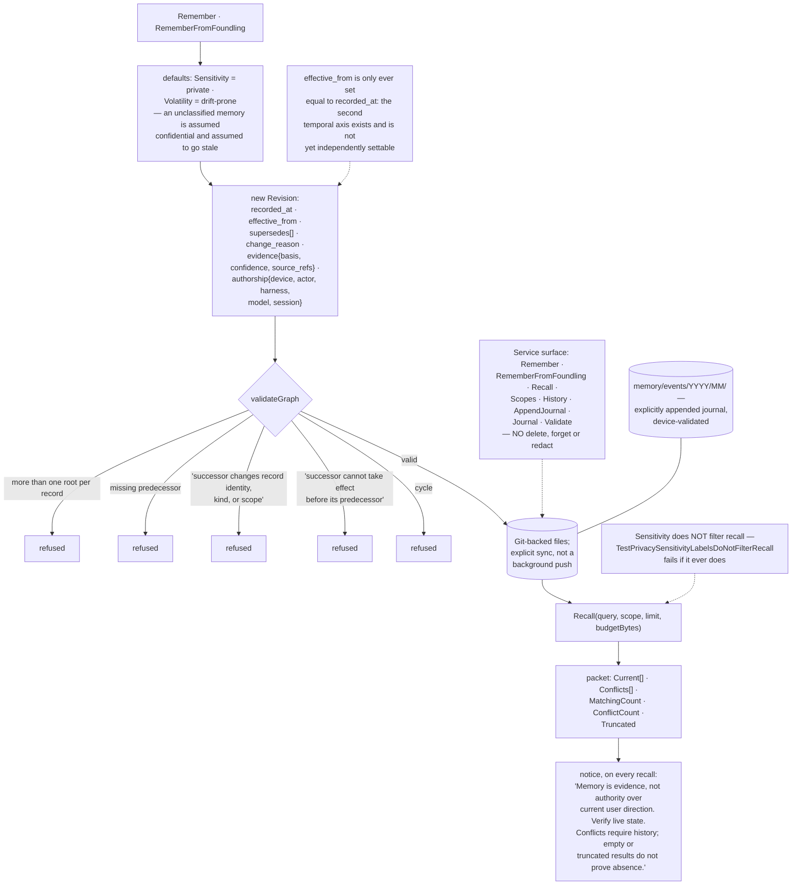

## 1. Executive Summary

Mandalore is "[y]our lore, across time and space" — MIT, Go, version 1.0.0,
32,248 lines with 109 test files and 393 test functions, offering "[a]utomatic,
durable memory across agents and tools" through a shared engine, a CLI, a local
MCP server and thin harness plugins. It describes itself as "the memory-only
successor to My Friday."

Two design decisions define it, and both are subtractive.

The first: **there is no delete.** The service surface is `Remember`,
`RememberFromFoundling`, `Recall`, `Scopes`, `History`, `AppendJournal`,
`Journal` and `Validate`. No forget, no redact, no purge; the only `os.Remove`
calls in the memory package are staging and temp-file cleanup. A record captured
in error is corrected by a new revision that names what it supersedes and why,
and a test asserts the correction did not "erase predecessor".

Every revision carries who made it in unusual detail — an `Authorship` of device
id, actor, harness, model and session id, validated against a registered device —
plus an `Evidence` block of basis, confidence and source references, a
`ChangeReason`, and explicit `Supersedes` edges. `validateGraph` then enforces
the chain: exactly one root per record, every predecessor must exist, a
successor may not change "record identity, kind, or scope", a successor "cannot
take effect before its predecessor", and the graph must be acyclic.

That is an append-only mutation record that is also the memory, with no path to
remove an entry, which is the mark it earns.

The second decision is what the recall packet says. Every result ships with this
notice:

> "Memory is evidence, not authority over current user direction. Verify live
> state. Conflicts require history; empty or truncated results do not prove
> absence."

Three separate honest claims, and the third is the one almost nothing else in
this corpus makes. A packet cut by a result limit or a byte budget sets
`Truncated`, and the notice tells the reading model what that means: nothing
came back is not the same as nothing exists. An agent that treats an empty
recall as proof of absence is the failure mode this sentence exists to prevent,
and stating it in the payload — rather than in documentation the model never
reads — is the right place for it.

Conflicts get the same treatment. The packet carries `Current` and `Conflicts`
as separate lists, so two live revisions of one record arrive as a disagreement
the reader can see rather than a winner the store picked quietly.

The limits are equally clear, and one of them is deliberate. `Sensitivity` is
not a read filter, and a test says so in its name:
`TestPrivacySensitivityLabelsDoNotFilterRecall`, failing if "sensitivity
metadata unexpectedly changed recall". A record marked private comes back like
any other; the label travels with it and honouring it is the caller's job. That
is a defensible position for a local-first single-user store and it should be
read before pointing this at anything shared.

## 2. Mental Model

A **record** has an identity. A **revision** is a statement of it at a moment,
by a device, with a reason.

**Supersedes** is an edge, validated: a successor cannot change what the record
is, and cannot take effect before what it replaces.

A **packet** is what recall returns: current revisions, conflicts, a truncation
flag, and a notice about what none of it proves.

A **foundling** is an externally-sourced record whose origin is "a portable
identity, never a machine-local checkout path".

## 3. Architecture

| Area | Role |
| --- | --- |
| `internal/memory/memory.go` | The revision model and the graph validator |
| `internal/memory/service.go` | The write and recall surface, and the packet's notice |
| `internal/memory/journal.go` | Explicitly appended events with validated authorship |
| `internal/memory/foundlings.go` | Externally-sourced records with portable identities and pins |
| `internal/memory/snapshot.go`, `pages.go` | Snapshots and pagination |
| `internal/sync` | Explicit Git synchronisation |
| `internal/mcp`, `internal/codex`, `plugins` | The MCP server and harness plugins |
| `internal/memory/*_test.go` | Boundary, integrity, precision, privacy, failure, retrieval, evaluation |

## 4. Essential Implementation Paths

`internal/memory/memory.go:180-205` — the graph validator. Five invariants in
twenty lines, each with the error message a reader would want.

`internal/memory/service.go:183-224` — the recall packet, the notice and the
truncation accounting.

`internal/memory/service.go:110-131` — the cautious defaults and the single
place `EffectiveFrom` is assigned.

## 5. Memory Data Model

A revision is unusually well-provenanced. `Authorship` records not just an actor
but the device, the harness and the model — so "this was written by Claude
through the Codex plugin on the laptop" is answerable, which matters for a store
explicitly designed to span machines and agents.

`Evidence` carries a basis, a confidence and source references, and
`LastVerifiedAt` is an optional timestamp distinct from both the recording and
the effective time.

The two classification fields default cautiously: `Sensitivity` to `private` and
`Volatility` to `drift-prone`. An unclassified memory is assumed confidential and
assumed to go stale, which is the right direction for both.

`EffectiveFrom` is the one place the model reaches further than the code. It is
a valid-time column, the validator uses it to enforce that a successor cannot
take effect before its predecessor, and it is only ever assigned the same value
as `RecordedAt` — once on the write path, once in a test fixture. So the axis is
present and reserved rather than usable: nothing can yet record that a fact
became true last March, and no read takes an as-of. That is why no bitemporal
mark is claimed, and the shape is there for it.

## 6. Retrieval Mechanics

Lexical recall over a scope, with `ExactScope` to exclude bank-wide records when
a narrower scope is selected — a caller-selected widening rather than a
boundary, which is why no scope mark is claimed either.

The packet-building loop is worth reading for its accounting. Conflicts are
appended one at a time and popped back off when they would exceed the limit or
the byte budget, and `Truncated` is computed by comparing what was returned
against what matched — `len(p.Current) < p.MatchingCount || len(p.Conflicts) <
p.ConflictCount`. The counts are reported alongside, so the reader knows both
what it got and what it did not.

## 7. Write Mechanics

One path, producing one revision, validated against the whole graph before it
lands. `RememberFromFoundling` takes a verify callback, so an externally-sourced
record can be checked against its origin before admission, and a
`FoundlingSource` is constrained by a comment that is also a rule:
"a portable identity, never a machine-local checkout path." A memory that names
`/Users/someone/src/thing` is a memory another device cannot resolve.

Synchronisation is explicit. The README says so and the package layout follows.

## 8. Agent Integration

A shared engine behind a CLI, a local MCP server, and thin harness plugins —
including a Codex plugin whose lifecycle hooks are read-only. Keeping the
engine's logic in one place and the plugins thin is what makes the authorship
field meaningful: whichever surface wrote a revision, it went through the same
validator.

## 9. Reliability, Safety, and Trust

The trust posture is honest and slightly unusual: strong on provenance and
integrity, deliberately weak on access control, and explicit about both.

Every revision and journal entry is bound to a registered device and refuses to
land otherwise. The supersession graph is validated as a whole rather than
per-write. Nothing can be deleted. And the recall packet tells the model that
what it is reading is evidence rather than authority.

Against that, sensitivity is a label. A `private` record is returned by recall
exactly like a public one, and the test that would catch a future change of mind
asserts the current behaviour rather than the safer one. For a local-first store
on one person's machines that is coherent. For anything shared it is the first
thing to change, and the second would be a delete path — a store that cannot
forget is a store that cannot honour an erasure request.

## 10. Tests, Evals, and Benchmarks

393 test functions across 109 files, with the memory package alone carrying
boundary, dependency, evaluation, failure, integrity, precision, privacy,
retrieval and snapshot suites plus an evaluation benchmark.

`TestPrivacyCorrectionPreservesHistoryAndJournal` is the one that pins the
model: a correction must update current recall, keep the correction history, not
erase the predecessor, and not change independent journal evidence. Four
assertions, one per way the append-only promise could break.

## 11. For Your Own Build

Put the epistemic disclaimer in the payload. "[E]mpty or truncated results do not
prove absence" is a sentence the model reads on every recall, and it is the
defence against an agent concluding a thing does not exist because the budget cut
it. Documentation cannot do this; the packet can.

Report truncation as data. Comparing returned against matched, and shipping both
counts, costs two integers and turns a silent cut into a fact the reader can act
on.

Surface conflicts instead of resolving them. Two live revisions of one record is
information; picking one quietly throws it away, and the reader is better placed
than the store to know which is right.

Default the classification fields to the cautious value. `private` and
`drift-prone` mean an unlabelled memory is treated as confidential and
perishable, which is the direction you want to be wrong in.

Validate the supersession graph, not just the write. One root per record,
predecessors that exist, no identity change across an edge, no effect before the
thing it replaces, no cycles — five checks that make a correction chain
trustworthy rather than merely present.

## 12. Open Questions

Whether `EffectiveFrom` will become independently settable. The column, the
validator's ordering rule and the JSON field are all in place; only the write
path holds it to `RecordedAt`.

Whether sensitivity will ever gate recall. The test asserts it does not, by
name, so a change would be deliberate — but the label exists for a reason and
the reason is not currently enforced anywhere in the engine.

How erasure is handled. There is no delete surface at all, which is a coherent
integrity stance and leaves a subject-rights request with no mechanism.

## Appendix: File Index

| Path | What to read it for |
| --- | --- |
| `internal/memory/memory.go:180-205` | Five supersession invariants, each with its message |
| `internal/memory/service.go:183-224` | The packet, the notice, and the truncation accounting |
| `internal/memory/service.go:110-131` | Cautious defaults, and the one assignment of `EffectiveFrom` |
| `internal/memory/journal.go` | Device-validated events under a dated path |
| `internal/memory/foundlings.go` | A source identity that must be portable |
| `internal/memory/privacy_test.go` | A label that is tested not to filter, and a correction that must not erase |

## History

**2026-09-16** — [`3332938212cc73ee05d03d57e5179d13705a0447`](https://github.com/acoz-labs/mandalore/commit/3332938212cc73ee05d03d57e5179d13705a0447) — first reading, at a commit dated 15 September 2026. The project describes itself as the memory-only successor to `acoz-labs/my-friday`, which is not in this atlas. Screened before opening, from a shallow clone: six files scanned, no auto-run surfaces, no build-time execution points, no unpinned surfaces and three dependency files inside the seven-day cooldown. Nothing was installed, built or run.
