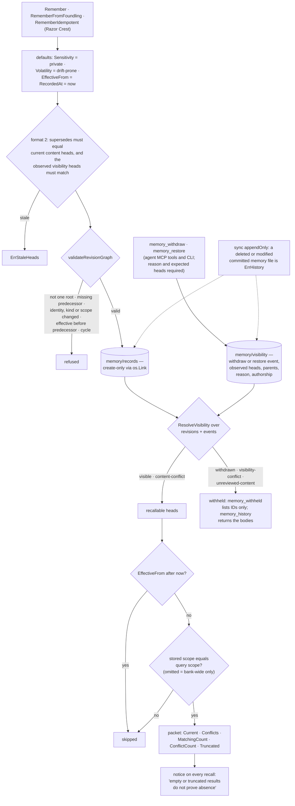

## 1. Executive Summary

Mandalore is a Git-backed memory engine in Go where every change is a new
authored revision with a required reason, validated as a graph, and nothing
can be removed; a record can be withdrawn from recall, which hides it and
keeps the bytes. Its recall packet tells the model that "empty or truncated
results do not prove absence" and carries the counts that make that checkable.
The weak side is enforcement: sensitivity is a label recall is tested never to
honour, withdrawn content stays readable through history, and a model field on
every revision has no writer.

It describes itself as "the memory-only successor to My Friday", reached
through a shared engine, a CLI, a local MCP server, an authenticated remote
MCP service and thin plugins for Claude Code, Codex, Pi and Hermes.

**There is no delete, and there is withdrawal.** The service surface is
`Remember`, `RememberFromFoundling`, `RememberIdempotent`, `Recall`,
`Scopes`, `History`, `AppendJournal`, `Journal`, `WithheldRecords`,
`VisibilityHistory`, `ChangeVisibility`, the foundling registry and
`Validate`. None removes content; the only `os.Remove` calls in the engine
clean up staging and temp files. Synchronisation enforces the same rule from
the other side: any committed file under `memory/`, `provenance/` or
`foundlings/registrations/` that a diff shows deleted or modified fails with
`ErrHistory` (`internal/sync/checkpoint.go:190-203`).

Withdrawal arrived on 18 September 2026 in #123, behind an opt-in format
upgrade that older clients refuse. It appends a `VisibilityEvent` — withdraw or
restore, the content heads it observed, the visibility heads it supersedes, a
reason and authorship — and recall drops any record whose resolved state is
not visible. The project's decision record rejects the alternatives by name:
sensitivity flags because "old readers can ignore the semantics", local
suppression because "it does not travel across machines", fabricated
corrections because "visibility is not factual revision", and deletion as "a
different, unauthorized promise".

Every revision carries device, actor and harness, an `Evidence` block, a
`ChangeReason` and explicit `Supersedes` edges, and the validator enforces one
root per record, existing predecessors, no change of "record identity, kind,
or scope" and no successor effective before its predecessor. That is an
append-only mutation record that is also the memory, which is the audit mark.

The notice on every recall reads:

> "Memory is evidence, not authority over current user direction. Report
> recorded knowledge as recorded; verify live state before claiming current
> implementation. Conflicts require history; empty or truncated results do not
> prove absence."

The last clause is backed by accounting. A packet cut
by a result limit or a byte budget sets `Truncated`, and `MatchingCount` and
`ConflictCount` say how much was cut. Conflicts arrive as their own list, so
two live revisions of a record reach the reader as a disagreement.

Two further mechanisms carry marks. Every recall matches one stored
scope by equality and an omitted scope means bank-wide only (scope
enforced). A retrieval matrix asserts exact result sets from which
superseded, future-effective and other-scope material must be absent in a
populated store (negative evaluation).

The limits are deliberate and named in code. `Sensitivity` is not a read
filter, and `TestPrivacySensitivityLabelsDoNotFilterRecall` fails if
"sensitivity metadata unexpectedly changed recall". Withdrawal governs
ordinary recall, not access: `memory_history` is described as returning "all
competing revisions, including withdrawn evidence", and it is on the agent's
tool surface and on the remote service's read surface.

## 2. Mental Model

A **record** has an identity and a scope. A **revision** is a statement of it
at a moment, by a registered device, with a reason. **Supersedes** is a
validated edge: a successor cannot change what the record is or take effect
before what it replaces.

A record's **visibility** is resolved on every read from two interleaved
graphs — content revisions and visibility events — and has five values:
`visible`, `content-conflict`, `withdrawn`, `visibility-conflict` and
`unreviewed-content`. The first two reach recall; the other three are
withheld, and a missing state is withheld rather than defaulted to visible
(`internal/memory/visibility_records.go:8-19`,
`internal/memory/visibility_foundling.go:7-9`).

How a record stops being guidance, in order of how often each applies:

- **Superseded.** A new revision names it; recall returns the head.
- **Future-effective.** A revision whose `EffectiveFrom` is after now is
  skipped. Only the write clock sets that field, so this applies to a revision
  synced from a device whose clock runs ahead.
- **Withdrawn.** A withdraw event is the single visibility head. A correction
  written afterwards observes the withdrawal and stays hidden; only an
  explicit restore reverses it.
- **Unreviewed.** A restore covers the content heads it observed. A content
  head it did not observe — a concurrent correction from another clone —
  leaves the record `unreviewed-content` until another restore names it.
- **Never deleted.** No path removes the bytes, and sync refuses a commit
  that would.

A **packet** is what recall returns: current visible revisions, conflicts,
counts, a truncation flag, and a notice about what none of it proves. A
**foundling** is an externally-sourced record whose origin is "a portable
identity, never a machine-local checkout path".

The memory is treated as evidence. No revision field holds a verdict: basis
and confidence are labels on the evidence, visibility is a disclosure
decision, and the decision record says withdrawal applies when memory "may
cease to be appropriate current guidance without becoming a false fact". That
is why the visibility states earn no trust mark: they decide what is shown,
are derived from the event graph on each read, and say nothing about truth.

```mermaid
%% caption: every change is an appended, validated revision; withdraw and restore are appended events resolved with the revisions into a visibility state; recall returns only visible heads in one exact scope, with counts and a notice that absence is not proof
flowchart TB
    W["Remember · RememberFromFoundling ·<br/>RememberIdempotent (Razor Crest)"] --> DEF["defaults: Sensitivity = private ·<br/>Volatility = drift-prone ·<br/>EffectiveFrom = RecordedAt = now"]
    DEF --> CAS{"format 2: supersedes must equal<br/>current content heads, and the<br/>observed visibility heads must match"}
    CAS -->|"stale"| XS["ErrStaleHeads"]
    CAS --> VG{"validateRevisionGraph"}
    VG -->|"not one root · missing predecessor ·<br/>identity, kind or scope changed ·<br/>effective before predecessor · cycle"| XR["refused"]
    VG -->|"valid"| REC[("memory/records —<br/>create-only via os.Link")]
    WD["memory_withdraw · memory_restore<br/>(agent MCP tools and CLI;<br/>reason and expected heads required)"] --> VE[("memory/visibility —<br/>withdraw or restore event,<br/>observed heads, parents,<br/>reason, authorship")]
    REC --> RES{"ResolveVisibility over<br/>revisions + events"}
    VE --> RES
    RES -->|"visible · content-conflict"| RH["recallable heads"]
    RES -->|"withdrawn · visibility-conflict ·<br/>unreviewed-content"| WH["withheld: memory_withheld<br/>lists IDs only; memory_history<br/>returns the bodies"]
    RH --> FUT{"EffectiveFrom after now?"}
    FUT -->|"yes"| SKIP["skipped"]
    FUT -->|"no"| SC{"stored scope equals<br/>query scope?<br/>(omitted = bank-wide only)"}
    SC -->|"no"| SKIP
    SC -->|"yes"| PK["packet: Current · Conflicts ·<br/>MatchingCount · ConflictCount · Truncated"]
    PK --> NOTE["notice on every recall:<br/>'empty or truncated results<br/>do not prove absence'"]
    SYNC["sync appendOnly: a deleted or modified<br/>committed memory file is ErrHistory"] -.-> REC
    SYNC -.-> VE
```

## 3. Architecture

| Area | Role |
| --- | --- |
| `internal/memory/memory.go` | The revision model, the graph validator and lexical recall |
| `internal/memory/service.go` | The write surface, the defaults, and the recall packet and its notice |
| `internal/memory/visibility*.go` | Withdraw and restore events, the causal visibility evaluator, withheld discovery |
| `internal/memory/sourced.go`, `store.go` | The locked write path and create-only publication |
| `internal/memory/journal.go` | Explicitly appended events with validated authorship |
| `internal/memory/foundlings.go`, `internal/foundlings` | Externally-sourced records, canon snapshots and promotion |
| `internal/sync`, `internal/sessionsync` | Git synchronisation with the append-only check; bounded per-session delivery |
| `internal/api`, `internal/mcp` | The operation catalogue and the local MCP adapter |
| `internal/razorcrest` | The authenticated remote MCP service |
| `internal/exportreport`, `internal/retention`, `internal/formatupgrade` | Preview-then-apply report export, read-only retention review, the opt-in format upgrade |
| `plugins/` | Claude Code, Codex, Pi and Hermes integrations |

### Deployment and ergonomics

Locally it is one Go binary over a directory of JSON files in a Git
repository: no database, no index service, no model call and no API key to
store anything. The store is plain JSON, one file per revision, event or
source, so it can be read by hand; it cannot be repaired by editing, because
validation refuses a changed graph and sync refuses a changed committed file.

Withdrawal needs the signet upgraded to format 2 by a CLI-only preview and
apply, with writers stopped; older clients refuse an upgraded bank. Razor
Crest adds a container service behind Cloudflare Access: it verifies an RS256
assertion against one issuer and audience and maps the subject to a read or
read-write grant (`internal/razorcrest/auth.go:20-24`, `:138-142`).

## 4. Essential Implementation Paths

**Write.** `Service.Remember` → `prepareRemember` validates scope and sizes,
applies the defaults and stamps both timestamps from one clock read
(`internal/memory/service.go:129-166`) → `putSourcedLocked` resolves current
visibility, runs `prepareContentWrite`, validates the whole graph with the
pending source, runs any foundling verification, then publishes the source and
the revision (`internal/memory/sourced.go:23-82`). In format 2,
`prepareContentWrite` refuses unless `Supersedes` equals the current content
heads and records the visibility heads observed
(`internal/memory/visibility_write.go:28-54`).

**Withdraw and restore.** `memory_withdraw` and `memory_restore` →
`ChangeVisibility` requires format 2, a reason and the expected content and
visibility heads, compares them under the writer lock, resolves the graph with
the new event appended, and only then publishes it under `memory/visibility`
(`internal/memory/visibility_service.go:95-180`). `evaluateVisibility`
validates the combined graph and, in its own words, "uses no wall clock,
insertion order, cached state or content text"
(`internal/memory/visibility.go:23-141`).

**Recall.** `Service.Recall` → `Store.Recall` validates the graph, takes
`RecallableHeads` (effective and visible), then `recallHeads` applies the
scope predicate, separates conflicts and scores lexically
(`internal/memory/memory.go:419-503`). The service fits conflicts, then hits,
into the byte budget and sets `Truncated` (`internal/memory/service.go:210-251`).

**Context injection.** Session-start and prompt hooks call `memorycontext`,
which recalls three items in the bank-wide scope at a 4,096-byte budget
(`internal/memorycontext/context.go:52`).

**Remote.** Razor Crest registers up to nine read tools, plus `memory_remember` and
`memory_journal_append` for write grants, and routes writes through
`RememberIdempotent` keyed on issuer, subject and request ID
(`internal/razorcrest/service.go:197`, `:256-288`).

## 5. Memory Data Model

`Authorship` declares device, actor, harness, model and session
(`internal/memory/memory.go:78-84`). Device, actor and harness are filled: the
binding supplies device and actor and the caller names the harness —
`claude-code`, `codex`, a `--harness` flag for the MCP server, `razor-crest`
(`internal/binding/binding.go:226`). `Model` and `SessionID` are declared and
written as null by every path in the tree, so "which model wrote this" is not
answerable from a revision.

`Evidence` carries a basis, a confidence and source references, and
`LastVerifiedAt` is an optional timestamp distinct from the recording and
effective times. `Sensitivity` defaults to `private` and `Volatility` to
`drift-prone`, so an unclassified memory is assumed confidential and assumed
to go stale (`internal/memory/service.go:142-150`).

`EffectiveFrom` is a valid-time column with one producer,
`RecordedAt: at, EffectiveFrom: at` (`internal/memory/service.go:161`). The
validator orders successors by it and recall hides revisions dated after now
(`internal/memory/memory.go:439-442`), so it has readers. With no writer that
sets it apart from the write clock, nothing can record that a fact became
true last March and no read takes a caller-supplied as-of; that is why no
bitemporal mark is claimed.

A `VisibilityEvent` is keyed on a record ID and carries the content heads it
observed, the visibility heads it supersedes, a 1–4,096-byte reason, a
timestamp and authorship (`internal/memory/visibility_event.go:8-43`). It is
not keyed on a value, so it is not a tombstone. The nearest thing to one is
the foundling guard: promotion is refused when any withheld record cites a
source with the same source identity, relative locator and content SHA-256
(`internal/memory/visibility_foundling.go:16-52`). That key includes the
path, it is consulted only by `RememberFromFoundling`, and its own comment
says it is "not semantic duplicate detection or a ban on manual learning"; a
plain `Remember` of the same text is not checked.

## 6. Retrieval Mechanics

Lexical recall over exactly one scope. `recallHeads` skips any head whose
stored scope differs from the query's when `ExactScope` is set, and every
production caller sets it (`internal/memory/service.go:220`,
`internal/foundlings/canon.go:598`, `internal/sync/remote.go:260`). An omitted
scope selects `Scope{Kind: "signet", ID: s.ID()}`, so the default read is
bank-wide records only, not everything (`internal/memory/service.go:61-67`).
That is the scope mark. It is a relevance boundary for one owner rather than
an access boundary: the scope is a tool argument, `memory_scopes` lists every
scope, `History` by record ID is unscoped, and the journal has no scope.

Scoring weights summary terms four times body terms, adds identifier hits, and
falls back to a small English inflection list (`internal/memory/memory.go:361-417`).
There is no vector arm and no synonym handling, and the evaluation matrix
records "absent-synonym-is-known-lexical-miss" as an expected miss.

The packet loop appends conflicts one at a time and pops each back off when it
would exceed the limit or the byte budget, then fills hits, skipping any that
do not fit, and sets `Truncated` from
`len(p.Current) < p.MatchingCount || len(p.Conflicts) < p.ConflictCount`.

## 7. Write Mechanics

Writes are explicit tool or CLI calls; nothing extracts memory from a
transcript. Each write blocks on a whole-graph validation under an exclusive
lock, then publishes create-only, and is retrievable on the next recall.
Validation reads every revision on every write and every read, so cost grows
with the bank rather than with the call.

`RememberFromFoundling` takes a verify callback run under the same lock as
publication, after the visibility guard. `RememberIdempotent` writes an intent
file before publishing, so a remote client retrying with the same request ID
gets the original revision rather than a duplicate
(`internal/memory/idempotency.go:38-92`).

In an enabled session, each save is followed by one Git delivery attempt
inside the same call, bounded at three seconds, and the hooks attempt a
refresh before building context. Razor Crest runs a delivery every minute when
synchronisation is configured (`internal/razorcrest/service.go:155-173`).
Outside those, synchronisation is an explicit `memory_sync` call.

## 8. Agent Integration

The local MCP server registers every binding operation that is not CLI-only
(`internal/mcp/server.go:31-34`). That includes `memory_withdraw`,
`memory_restore`, `memory_withheld` and `memory_visibility_history`. Export,
retention review, format upgrade and installation are CLI-only.

The Claude Code and Codex hooks write no memory; they inject a bounded
bank-wide recall and, in an enabled session, attempt a refresh first. The
`this-is-the-way` skill tells the model to honour withdrawal and never
recreate withheld knowledge from native notes, journals or history — an
instruction, since the history tool returns that content on request.

Razor Crest exposes the read tools and, for write grants, remember and
journal. It does not expose withdraw or restore. Every remote write is
authored by the service's binding with harness `razor-crest`; the
authenticated subject namespaces the idempotency key and appears nowhere in
the revision.

## 9. Reliability, Safety, and Trust

The posture is strong on provenance and integrity and deliberately weak on
access control, and the code states both.

Every revision, visibility event and journal entry is bound to a registered
device and refused otherwise. The supersession graph and the visibility graph
are validated as wholes on every read. Publication is create-only, and sync
refuses a deleted or modified committed file, so the append-only property
survives a user editing the directory by hand.

Withdrawal is careful about concurrency. A stale withdraw or restore is
refused (`internal/memory/visibility_service.go:129-131`); a correction cannot
restore a withdrawn record; and a scheduled correction delivered alongside a
concurrent restore stays hidden both before and after its effective time,
a case pinned by `TestVisibilityConcurrentFutureCorrectionNeverAppears`.

It is not access control. `memory_history` returns withdrawn bodies, and so
does Razor Crest's remote read surface. The receipt says so: "Previously read
context and offline copies cannot be revoked."

No human review is claimed. The agent that wrote a record holds
`memory_withdraw` and `memory_restore` on its own tool surface, so it can both
hide a record and clear an `unreviewed-content` state. The "reviewed" export is
a preview whose plan `export_apply` must reproduce exactly before writing a
report file; that guards against a changed source, not an unreviewed memory.

Sensitivity is a label. A `private` record is returned by recall like a
public one, and the test asserts that. For a store on one person's machines
that is coherent; for anything shared it is the first thing to change.
Erasure is the second: a record captured in error can be hidden, and the
bytes remain in every clone and in Git history.

## 10. Tests, Evals, and Benchmarks

676 Go test functions across 184 files, 84 of them in the memory package's
boundary, evaluation, failure, integrity, privacy, retrieval, snapshot,
idempotency, upgrade and visibility suites. I read the suites; I ran none.

`TestRetrievalQualityMatrix` is the negative evaluation. It seeds three
scopes, two corrected records, a two-headed conflict and a future-effective
revision, then asserts the exact ID set and `MatchingCount` for thirteen
queries. Several cases exist to prove absence: the bank-wide preference must
not appear in a project query matching the same word, another project's name
must not cross scopes, a word only in a superseded revision must not resurrect
it, and the future revision must not be current. The positive cases read the
same store, so an empty retriever fails the matrix.

`TestVisibilityStorageRecallAndLegacyPreservation` asserts that a withdrawn
record and a later correction stay out of recall, that an explicit restore
then returns the correction, and that the legacy revision's bytes are
unchanged. The restore step is the control for the two empty-result
assertions before it. `TestVisibilityConcurrentFutureCorrectionNeverAppears`
and `TestVisibilityServiceReceiptAndIndependentJournal` assert empty recall
over a store holding only the withdrawn record and carry no such control.

`TestPrivacyCorrectionPreservesHistoryAndJournal` pins the append-only promise
in four assertions: current recall updates, history keeps two revisions, the
predecessor's body survives, and an independent journal entry is unchanged.

The same test asserts the other half of the design: after the withdrawal,
`History` returns both revisions (`internal/memory/visibility_integration_test.go:91-93`).

## 11. For Your Own Build

### Steal

Put the epistemic disclaimer in the payload. "[E]mpty or truncated results do
not prove absence" is read on every recall, and it is the defence against an
agent concluding a thing does not exist because a budget cut it.

Report truncation as data: the matched counts beside the returned lists cost
two integers and turn a silent cut into a fact the reader can act on.

Make withdrawal an event in a causal graph, not a flag. Require the writer to
name the heads it saw, refuse when they moved, keep a correction written after
a withdrawal hidden, and withhold content a restore did not observe. Each rule
closes a way a hidden record would otherwise reappear through ordinary
traffic.

Enforce append-only where the data leaves the process. A diff filter on
deleted and modified paths at sync time catches what an API without a delete
method cannot: a person editing the directory.

Validate the supersession graph, not the write: one root, existing
predecessors, no identity change across an edge, no effect before the thing
replaced, no cycles.

### Avoid

Declaring provenance fields nothing fills. A `Model` column that is always
null reads, in the schema and the docs, as an answer to "which model wrote
this".

Calling a recall filter a withdrawal when the history tool on the same
surface returns the body. If hidden must mean unreadable, the history read
needs the same predicate or a separate grant.

Recording the service as the author of remote writes. An authenticated
subject used only for idempotency is lost provenance on the one path where
several principals share a store.

### Fit

This suits one person's memory spread across machines and agents, where
integrity and an explainable history matter more than forgetting, and where
everyone with read access may see everything. It assumes a Git remote and a
user willing to run an explicit format upgrade with writers stopped. Walk away
if the store must honour an erasure request, enforce a confidentiality label,
or keep a withdrawn record from a reader who asks for its history.

## 12. Open Questions

Whether `Model` and `SessionID` will be filled, and from where; the privacy
document calls them "optional model/session provenance", and no harness passes
either.

Whether withdrawal is meant to gate `memory_history` on Razor Crest, where the
reader may be a different principal from the writer; the code returns
withdrawn bodies there.

Whether a future-effective revision arriving from a clock-skewed device is an
intended case or an accident of the predicate; nothing in the tree writes one
deliberately.

How erasure will be handled. The decision record lists "Deletion/history
rewriting" as rejected for withdrawal, and the privacy document leaves history
rewriting to "a separate design and explicit authority".

## Appendix: File Index

| Path | What to read it for |
| --- | --- |
| `internal/memory/memory.go:182-271` | The supersession invariants, each with its message |
| `internal/memory/memory.go:419-503` | Recall: effective and visible heads, the scope predicate, scoring |
| `internal/memory/service.go:129-166` | Defaults, and the one production assignment of `EffectiveFrom` |
| `internal/memory/service.go:210-251` | The packet, the notice and the truncation accounting |
| `internal/memory/visibility.go:23-141` | The causal visibility evaluator and its five states |
| `internal/memory/visibility_service.go:95-180` | Withdraw and restore: expected heads, validation, publication |
| `internal/memory/visibility_foundling.go:16-52` | The exact-origin guard on foundling promotion |
| `internal/sync/checkpoint.go:190-203` | The append-only diff filter at sync |
| `internal/razorcrest/service.go:197-288` | Remote tool surface, write grant, idempotent remote writes |
| `internal/memory/evaluation_test.go:16-124` | Exact-set retrieval cases, including the must-not-appear ones |
| `internal/memory/visibility_integration_test.go:59-161` | Withdrawal, correction, restore and the concurrent future case |
| `internal/memory/privacy_test.go` | A label tested not to filter, and a correction that must not erase |
| `docs/decisions/0004-compatible-memory-withdrawal.md` | Why withdrawal is an event and not a flag, a correction or a delete |

### Recorded searches

Run at the tree root of the pinned checkout with `git grep`.

- `git grep -nE 'func \(s \*(Service|Store)\) (Delete|Forget|Redact|Purge|Erase|Remove)' -- '*.go'` — no match.
- `git grep -nE '"memory_(delete|forget|redact|purge|erase)' -- '*.go'` — no match.
- `git grep -nE 'os\.(Remove|RemoveAll)\(' -- internal/memory ':!*_test.go'` — `store.go:95` (staging) and `:201` (temp file) only.
- `git grep -nE 'EffectiveFrom\s*[:=]|\.EffectiveFrom\s*=' -- '*.go' ':!*_test.go'` — `internal/memory/service.go:161` and the synthetic fixture `internal/testfixture/retrieval.go:61`, both equal to the record time.
- `git grep -nE 'Authorship\{' -- '*.go' ':!*_test.go'` — `binding.go:226`, the migration journal entry, readiness and upgrade checks and the test fixture; none sets `Model` or `SessionID`.
- `git grep -nE '\b(Model|SessionID)\s*[:=]' -- internal/memory internal/binding internal/razorcrest internal/migration internal/api ':!*_test.go'` — one hit, a canon recall input's `SessionID` at `internal/api/canon.go:55`, unrelated to authorship.
- `git grep -nE 'ExactScope' -- '*.go' ':!*_test.go'` — the field, its one read at `memory.go:467`, and three callers, all `true`.
- `git grep -nE '\.Sensitivity\b' -- '*.go' ':!*_test.go'` — the default, the revision assignment and the export projection; no read filter.
- `git grep -niE 'scope' -- internal/razorcrest/auth.go` — no match; grants are read and write only.
- `git grep -nE '"memory_withdraw"|"memory_restore"' -- internal/razorcrest` — no match.
- `git grep -nE 'Remember|AppendJournal|ChangeVisibility' -- internal/claudecode internal/codex internal/memorycontext ':!*_test.go'` — no match; the hooks write no memory.
- `git grep -n 'checkFoundlingVisibility' -- '*.go' ':!*_test.go'` — the definition and one caller, `RememberFromFoundling`.
- `git grep -nE 'CLIOnly = true' -- internal/api` — export, retention, upgrade, readiness, release, native context, the session catalogue and the three plugin administration groups; not the visibility operations.
- `git grep -niE 'openai|anthropic|llm|chat/completions|messages\.create|summari[sz]e|extract' -- internal/memory internal/api internal/mcp ':!*_test.go'` — two incidental hits on "enroll" and "enrollment"; no model call on any write or read path.
- `git grep -nE '"(verified|rejected|candidate|trusted|disputed)"' -- internal/memory ':!*_test.go'` — no match; no verdict state.
- `git grep -niE 'arxiv|bibtex|@article|@misc|doi\.org' -- README.md docs` — no match; no paper.
- `git grep -niE 'anthropic|machine learning|not (be )?used (for|to)' -- LICENSE` — no match; the MIT text carries no rider.

## History

**2026-10-11** — [`c28d2e607aa6fa78feb7117a852d82a077d33bc8`](https://github.com/acoz-labs/mandalore/commit/c28d2e607aa6fa78feb7117a852d82a077d33bc8) — 167 commits on, version 1.0.0 to 1.6.0. Withdrawal and restore arrived as appended visibility events; nothing deletes, and [section 2](#2-mental-model) carries the lifecycle. Two marks gained that were earned at the first pin: `scope_enforced`, withheld on the claim that exact scope was caller-selected when every production caller hard-codes it ([section 6](#6-retrieval-mechanics)), and `negative_eval`, on a retrieval matrix present then ([section 10](#10-tests-evals-and-benchmarks)). Also wrong then: authorship never records a model ([section 5](#5-memory-data-model)). Overtaken: the notice wording, background sync, the plugin list. Screened from a full clone: six files, no auto-run or build-time execution, no unpinned surfaces, `go.mod` and `go.sum` inside the cooldown, `AGENTS.md` read as data. Nothing was installed, built or run.

**2026-09-16** — [`3332938212cc73ee05d03d57e5179d13705a0447`](https://github.com/acoz-labs/mandalore/commit/3332938212cc73ee05d03d57e5179d13705a0447) — first reading, at a commit dated 15 September 2026. The project describes itself as the memory-only successor to `acoz-labs/my-friday`, which is not in this atlas. Screened before opening, from a shallow clone: six files scanned, no auto-run surfaces, no build-time execution points, no unpinned surfaces and three dependency files inside the seven-day cooldown. Nothing was installed, built or run.
