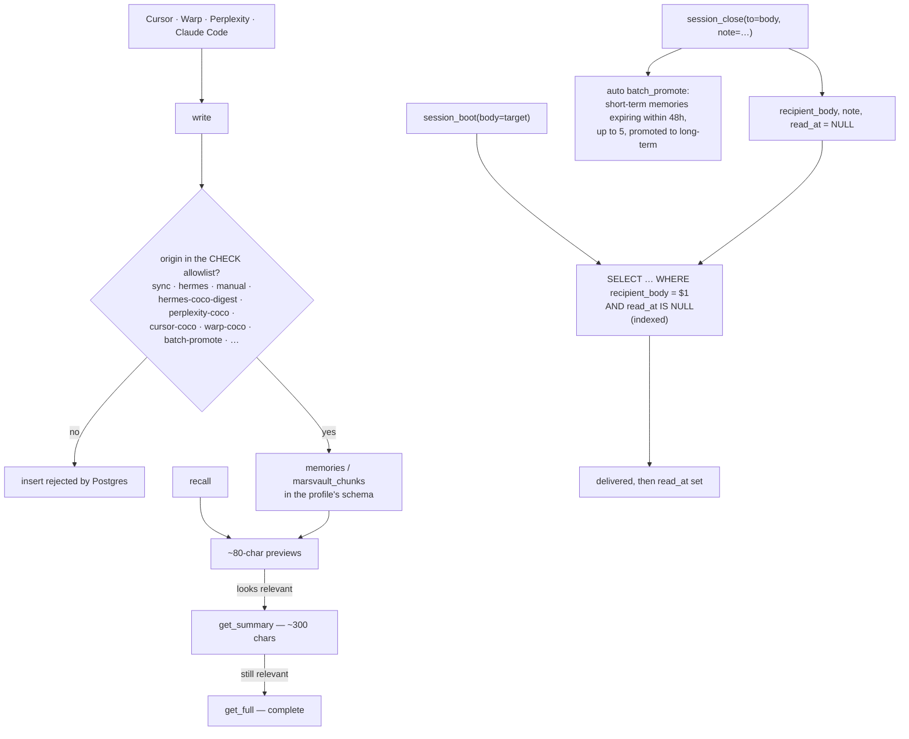

## 1. Executive Summary

MarsNMe is an "agent-agnostic, LLM-agnostic memory backend for MCP-compatible
tools", pitched at someone using four AI tools at once — "I use Cursor to code,
Warp to deploy, Perplexity to research, and Claude Code to manage my vault" —
with sixteen MCP tools over Postgres on Supabase.

**The mechanism worth the report is a mailbox.**

`session_close(to=<body>, note=...)` writes a note addressed to another agent;
`session_boot(body=<target>)` delivers unread notes for that body **and marks
them read**. The migration that adds it is three columns and an index:

```sql
ALTER TABLE %I.memories ADD COLUMN IF NOT EXISTS recipient_body text;
ALTER TABLE %I.memories ADD COLUMN IF NOT EXISTS note text;
ALTER TABLE %I.memories ADD COLUMN IF NOT EXISTS read_at timestamptz;
CREATE INDEX IF NOT EXISTS idx_%I_memories_unread_notes
  ON %I.memories (recipient_body, read_at);
```

**This is a different primitive from shared memory, and the difference matters.**
A shared store lets two agents read the same facts. A note is *addressed*, it is
*durable*, and it is *acknowledged* — the recipient's boot marks `read_at`, so
the sender's message is delivered exactly once and the system knows whether it
landed. Every other multi-agent system in this atlas coordinates by both parties
reading a common store and hoping the right thing is salient; this one lets one
agent say something *to* another and know it arrived.

The index on `(recipient_body, read_at)` is the detail that says it was built to
be queried rather than bolted on — unread notes for a body is the hot path and it
has an index shaped for exactly that.

**A second, wider mailbox sits beside it.** `board_posts` is a wall: one table
per profile schema holding `from_source`, `from_body`, `"to"` defaulting to
`all`, a topic, a four-value type enum (`stuck`, `turn`, `collide`, `gate`), an
`acked_by` JSON map, `expires_at` and `archived_at`. `board_post` documents the
distinction plainly — *"to=\"all\" broadcasts to the wall; to=\"<body>\" is a
private note"* — `session_boot` fetches unread posts for the booting body, and
`session_close` posts to it.

**The private note is not private, and the reason is one method call.**
`board_read` builds its query with `URLSearchParams`, sets the addressing filter
— `query.set('or', '(to.eq.all,to.eq.${body})')` — and then, four lines later,
sets the same key again for the expiry window. `set` replaces; `append` would
have added. The addressing filter never reaches the request, and the only
post-fetch filter in the handler removes already-acknowledged posts, so a note
addressed to one body is returned to whoever calls, with the intended recipient
rendered in the response as `to`. The same feature is written correctly 1,900
lines earlier: `session_boot`'s auto-unread path sets `or` once and its filter
survives.

**Two more mechanisms are worth naming**: provenance as a database constraint
(section 7) and a three-tier recall with stated character budgets (section 6).

## 2. Mental Model

Each profile is a Postgres schema. Memories carry an origin identifying which
tool wrote them. Recall discloses progressively. Closing a session both rescues
expiring memories and can leave a note for another agent.



## 3. Architecture

Two deployment targets — `marsnme-supabase/` (a gateway with `server.mjs` and a
`stdio.mjs`, plus a Cloudflare routing worker) and `marsnme-cf/` (schema, tools,
utils) — over `supabase/migrations/`.

3,900 lines, and the repository carries `CLA.md`, `TRADEMARK.md`, `NOTICE`,
`SECURITY.md` and `CONTRIBUTING.md` — more legal scaffolding than code, which
tells you it is a product with a hosted service behind it.

**The scope discipline in the changelog is worth noting.** Version 0.3.0 removed
five PRD tools from the gateway: "idea/PRD/task execution now lives in
[Draft]… MarsNMe = CoCo soul memory only." A project narrowing its own tool
surface and saying where the removed capability went is the opposite of the usual
direction.

## 4. Essential Implementation Paths

**Handoff** — `supabase/migrations/20260707160000_note_handoff_columns.sql` (the
three columns and the unread index), `marsnme-cf/src/tools/session-tools.ts`
(`recipient_body` and `note` on close `:147`).

**Provenance** —
`supabase/migrations/20260619085518_marsvault_chunks_origin_allow_batch_promote.sql`
(the incident note `:1-13`, the widened CHECK `:20-30`).

**Schema** — `marsnme-cf/db/schema.sql`, `marsnme-cf/src/utils/db.ts`.

## 5. Memory Data Model

Memories and vault chunks in a Postgres schema per profile (`coco`, `toto`),
with short-term rows that expire and long-term rows that do not.

`origin` is the provenance field and it is the interesting one: `sync`,
`hermes`, `manual`, `hermes-coco-digest`, `hermes-toto-digest`,
`perplexity-coco`, `cursor-coco`, `warp-coco`, `batch-promote` — so a chunk
records *which tool or pass produced it*, at a granularity that distinguishes
Perplexity from Cursor from a nightly digest.

There is no status field, no confidence, no supersession pointer and no
tombstone. Expiry and promotion are the lifecycle.

## 6. Retrieval Mechanics

**Three tools, three budgets**: `recall` returns "~80-char previews", then
`get_summary` (~300 chars), then `get_full` (complete) — "avoids token-dumping
full chunks on every recall; drill down only when a preview looks relevant".

Stating the character budget per tier, and exposing each as its own tool, puts
the disclosure decision in the model's hands with the cost visible at each step.
[MemSearch](../memsearch/) and [memory-ts](../memory-ts/) reach the same shape
from different directions — progressive disclosure is quietly becoming the
consensus answer to injection cost, and this is the version that names the
budgets.

**Search is semantic.** `search_memories` embeds the query with Jina
(`jina-embeddings-v3`, 1024 dimensions) and calls the
`search_memories_semantic` RPC, filtering the returned rows by an optional
`min_similarity`. The three disclosure tiers above sit on top of that result,
not on a keyword match.

**Scope is structural** — a Postgres schema per profile — so there is no scope
key on a read path and `scope_enforced` is not earned. `body` is an *addressee*
rather than a retrieval filter, and the board is the sharpest illustration of
the difference: `board_posts."to"` is a stored scope key, `board_read` writes
the predicate that would apply it, and the predicate is overwritten before the
request is sent. A key that is stored, filtered on in intent, and not filtered
on in fact is the exact case the mark exists to exclude.

## 7. Write Mechanics

**Provenance is a database CHECK constraint.** A chunk whose `origin` is not in
the allowlist is rejected by Postgres, not by application code — so a new tool
cannot write into the vault until someone deliberately widens the constraint.
That is an unusual and strong position: the write surface is enumerated in the
schema, and adding to it is a migration with a review.

**And the migration records the bug that widening it fixed.** `batch_promote`
writes chunks with `origin = 'batch-promote'`, the existing constraint did not
include that value, and the promote failed. The fix widens the allowlist — and
notes the asymmetry: "**toto.marsvault_chunks has no origin check constraint, so
it was**" unaffected.

That parenthesis is the finding worth carrying: **one profile enforces the
allowlist and the other does not.** The constraint that makes the guarantee real
in `coco` is simply absent in `toto`, so the same code path writing to the other
profile is unconstrained. It is documented rather than hidden, which is why this
report can state it — and it is the kind of divergence that only appears when
someone hits it.

**Auto-promotion on close** is the third mechanism: closing a session promotes
short-term memories expiring within 48 hours, up to five, to long-term storage —
"no Hermes or manual promote needed". Tying rescue-from-expiry to the moment a
session ends is well-chosen: it is exactly when the value of the session's
material is clearest and when the user is not waiting on it.

## 8. Agent Integration

Sixteen MCP tools, a `curl -fsSL … | bash` installer, Docker, and a Cloudflare
routing worker in front of a Supabase gateway. The cross-tool pitch is the
product, and the handoff note is what makes it more than four clients on one
database.

## 9. Reliability, Safety, and Trust

**No marks.** No trust state, no tombstone, no bitemporality, no scope key on a
read path, no audit log, no human review, no committed exclusion case.

**The origin constraint is the closest thing to a safety mechanism**, and it
guards *provenance* rather than truth: it says which tool may write, not whether
what was written is right. As a defence against an unexpected writer it is
strong, because Postgres enforces it. As a defence against a wrong memory it does
nothing.

**And the constraint is inconsistently applied**, per section 7 — which is the
practical risk, because a guarantee that holds in one profile and not another is
worse than no guarantee, since the reader assumes the first.

**The installer is `curl … | bash`.** Common, and worth a reader knowing before
running it against a hosted service they have not read the source of.

## 10. Tests, Evals, and Benchmarks

**No paper and no benchmark**, and the evidence offered for the system working
is a user story from the creator — "Leo, MarsNMe creator (3 months of daily use
across 4 AI tools)" — which is honestly attributed as the author's own experience
rather than presented as an independent result.

Tests do exist, in two places away from the memory. `marsnme-supabase/scripts/tests/test_dream_runner_modes.py`
is 90 lines of `unittest` that run `dream_runner.py` and `hermes_digest_runner.py`
as subprocesses and assert the emitted JSON carries the mode the environment
selected — `standard`, `lite` or `pro` — and that the run was skipped rather
than executed. `marsnme-supabase/cloudflare-routing-worker/src/index.test.ts` is
427 lines of Vitest over the routing worker: a missing username route returns
404 with `user_not_found`, a malformed one returns 400 with `invalid_username`,
and a proxied request is asserted to preserve the authorization header, the
`mcp-session-id` and the query string exactly.

So the repository tests its dispatch and its edge routing, and neither file
mentions `read_at`, a handoff or a delivery.

That is the shape of the gap rather than an absence of testing. The untested
surface that matters most is the handoff: a note that is delivered twice, or marked read
without being delivered, loses a message between agents silently, and the
`read_at` column is exactly what a test would assert on.

The board shows what that absence costs. A search for a committed case naming
`board_read` or `board_post` returns nothing, and the defect in section 1 is the
kind a single test would have caught: post as one body addressed to a second,
read as a third, assert the post is absent. The two implementations of the same
filter disagree, and nothing in the repository compares them.

**I ran nothing.**

## 11. For Your Own Build

### Steal

- **Let one agent leave an addressed note for another.** A shared store lets two
  agents read the same facts; a note is addressed, durable and *acknowledged* —
  three columns and an index give you delivery semantics that a common store
  cannot.
- **Index the unread query.** `(recipient_body, read_at)` is the hot path and
  shaping the index for it is what makes the mailbox usable rather than a scan.
- **Mark it read on delivery.** `read_at` turns "the note exists" into "the note
  arrived", which is the difference between a mailbox and a bulletin board.
- **Enumerate your write origins as a database CHECK.** A new tool cannot write
  until someone widens the constraint in a migration — the write surface becomes
  a reviewable list rather than whatever calls the API.
- **Make the origin granular enough to be useful.** `perplexity-coco`,
  `cursor-coco`, `warp-coco`, `batch-promote` tells you which tool produced a
  memory, which a boolean `is_automated` never would.
- **Record the bug in the migration that fixes it**, including the asymmetry you
  found — "toto.marsvault_chunks has no origin check constraint".
- **Rescue expiring memories when a session closes.** A 48-hour window and a cap
  of five, at the moment the session's value is clearest and nobody is waiting.
- **State the character budget for each recall tier.** ~80, ~300, full — as three
  separate tools, so the model chooses the disclosure with the cost in view.
- **Narrow your tool surface and say where the rest went.** Five PRD tools
  removed with a link to the project that now owns them.

### Avoid

- **Do not apply a constraint to one tenant schema and not another.** A guarantee
  that holds in `coco` and not in `toto` is worse than none, because a reader
  generalises from the first one they check.
- **Do not leave a message-delivery path untested.** A note delivered twice or
  marked read without delivering loses context between agents silently, and
  `read_at` is the exact assertion target.
- **Do not offer a user story as the evidence.** It is honestly attributed here,
  and three months of the author's own daily use is a reason to keep building,
  not a result.

### Fit

Worth looking at if you genuinely work across several AI tools and want them to
share one memory — and specifically if you want agents to *hand off* rather than
merely share, which is the thing this has and the others do not.

The handoff migration is fourteen lines and lifts into any store with a memories
table.

## 12. Open Questions

- **Does `toto` get the origin constraint?** The migration documents its absence.
- **What happens if two boots race on the same unread note?** `read_at` is set on
  delivery; the concurrency was not traced.
- **Are the recall tiers enforced or advisory?** The budgets are stated as
  approximate character counts.
- **What is Hermes?** It appears as an origin value and as the pass that
  `batch_promote` replaces.

## Appendix: File Index

**Handoff** — `supabase/migrations/20260707160000_note_handoff_columns.sql` (the
purpose comment `:1-4`, `recipient_body` / `note` / `read_at` and the unread
index `:5-15`), `marsnme-cf/src/tools/session-tools.ts` (`recipient_body` and
`note` on close `:147`)

**Provenance** —
`supabase/migrations/20260619085518_marsvault_chunks_origin_allow_batch_promote.sql`
(the failure it fixes `:1-13`, the `toto` asymmetry note `:13`, the widened
allowlist `:20-30`)

**Deployment** — `marsnme-supabase/server.mjs`, `stdio.mjs`,
`cloudflare-routing-worker/`, `marsnme-cf/db/schema.sql`,
`marsnme-cf/src/utils/db.ts`, `docker/`, `install.sh`

**Documentation** — `README.md` (the 0.3.0 notes: three-layer recall, body-to-body
handoff, auto `batch_promote`, the CoCo-only tool surface), `CHANGELOG.md`,
`AGENTS.md`, `SECURITY.md`

## Appendix: Recorded Searches

Run from the root of the checkout at the pinned commit.

| Claim | Command | Result at this pin |
| --- | --- | --- |
| ~~No test directory found~~ — **withdrawn 2026-09-20** | `find . -path ./node_modules -prune -o -name 'tests' -print -o -name '*.test.*' -print` | `marsnme-supabase/scripts/tests/test_dream_runner_modes.py` and `marsnme-supabase/cloudflare-routing-worker/src/index.test.ts`. Both sit under deployment directories rather than beside the memory tools, which is how a reading centred on the tools missed them. |
| Nothing tests the handoff | `grep -rn 'read_at\|board_read\|board_post\|handoff' --include='*test*' .` | Nothing in either test file |
| No paper and no benchmark | `grep -rn -i 'arxiv\|doi\|benchmark\|@article' README.md` | Only the creator's own usage story |


## History

**2026-09-20** — same pin, re-read after an audit of whole-repository absence claims. Section 10 said "no test directory found". There is one — `marsnme-supabase/scripts/tests/`, holding a 90-line `unittest` file over dream-runner mode dispatch — beside a 427-line Vitest suite for the Cloudflare routing worker. The claim was made over the wrong subtree: both sit under deployment directories rather than beside the memory tools the report reads. The section is rewritten to say what the tests cover, and the finding it was supporting survives intact and sharper, because neither file mentions `read_at`, a handoff or a delivery — the board defect in section 1 is still the kind a single committed case would have caught. No mark changes. A Recorded Searches appendix was added; this report had none, which is the shape this error class hides in.

**2026-09-13** — [`25b7d6c1b4e698189b9db0e35a593b9a6a41b876`](https://github.com/marsmanleo/marsnme/commit/25b7d6c1b4e698189b9db0e35a593b9a6a41b876) — re-read, three commits past the previous pin. Screened again first: one auto-run surface and two unpinned dependency surfaces, unchanged in kind from the previous reading; nothing was installed and nothing was run. Three commits understated the change: they add a `board_posts` table per profile schema and a wall of `board_read` / `board_post` / `board_ack` tools, with `session_boot` fetching unread posts and `session_close` posting. The finding is in `board_read`, which sets an addressing filter on a `URLSearchParams` key and then sets the same key again for the expiry window; `set` replaces, so the filter that makes a private note private never reaches the request, and the handler's only post-fetch filter removes acknowledged posts. `session_boot`'s copy of the same query sets the key once and is correct. No mark changes — `scope_enforced` stays withheld, now on a stored key whose predicate is written and discarded rather than on structural scoping alone. The stack row was promoted from seeded to reviewed and corrected while re-reading: retrieval is a Jina 1024-dimension embedding through a `search_memories_semantic` RPC, not the lexical arm the seeded guess recorded.

**2026-08-09** — [`3ed1b0bc7bbccfd40efd13df366d0f538d155316`](https://github.com/marsmanleo/marsnme/commit/3ed1b0bc7bbccfd40efd13df366d0f538d155316) — first reading. Screened before reading; the tree was read, nothing was installed, and the hosted service was not used.
