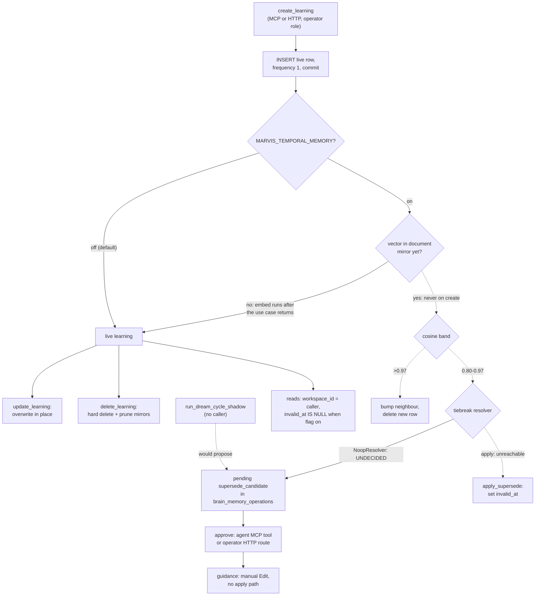

## 1. Executive Summary

Marvis is the open core of MarvisX, a self-hosted "company brain" for coding
agents: projects, tasks, PRs, an inbox, a cross-project knowledge graph and a
reflective brain cycle, all behind one in-process MCP server and a FastAPI
service over a single SQLite database. The memory in that product is the
**learnings** table — post-mortems with a prevention rule, written by an agent
with `create_learning`, recalled with `check_learnings` before risky work, and
surfaced at cold start by `session_brief`.

What is notable is the scope discipline. HTTP and MCP call the same use-case
functions, and every learnings use-case read binds the caller's workspace, so
the predicate is written once rather than twice. It misses one lane: hybrid
search matches the knowledge-graph mirror of learnings with no workspace
predicate, which is why `scope_enforced` is withheld.

What is weak is the correction story. A full supersede design is in the tree —
system-time columns, a binary live filter, a cosine two-band write gate, a
proposal queue, a nightly re-scan — and at this pin nothing reachable ever sets
`invalid_at`. Section 2 traces each of the four breaks.

The licence is BSL 1.1 with an additional use grant: production and internal
commercial use are allowed, and offering Marvis to third parties as a hosted or
managed service is not, until it converts to Apache 2.0 on 1 January 2030.

No mark. Section 9 names all seven withheld and why. Tasks,
PRs, the inbox and the governance hooks are not memory and are covered only
where they touch a learning.

## 2. Mental Model

A learning becomes a belief on insert. `create_learning` validates the category
and severity, writes the row with `frequency = 1`, commits, and returns it
(`core/api/use_cases/learnings.py:576-670`). There is no candidate state and no
review: an operator-role caller, which includes the local MCP agent
(`core/api/use_cases/_context.py:91-108`), writes straight to live.

It stops being one in only two ways that run by default: `update_learning`
overwrites fields in place (`:805-888`), and `delete_learning` hard-deletes the
row and its search mirrors (`:949-992`). Neither leaves a trace in the store.

**The designed third way is supersession, and it is wired dark.** Migration 148
adds `valid_from`, `invalid_at`, `superseded_by` and `supersede_reason`, and
calls the result bitemporal while stating that only the system-time axis is
implemented (`migrations/148_bitemporal_learnings.sql:9-17`). With
`MARVIS_TEMPORAL_MEMORY` on, every learnings read appends `AND invalid_at IS
NULL` — exclusion, never down-weighting, as the docstring argues
(`learnings.py:186-212`). The flag defaults to false (`core/api/config.py:528-530`).

**Turning the flag on does not make anything stop being believed**, because the
one writer of `invalid_at`, `temporal_write.apply_supersede`
(`core/api/services/temporal_write.py:426-458`), is unreachable four ways:

1. The write-time gate reads the new learning's vector from the document mirror
   (`learnings.py:698-702`; `temporal_write.py:160-185`). Both surfaces embed
   *after* the use case returns — the MCP tool awaits `mcp_embed_learning` at
   `core/api/mcp/tools/learnings.py:178`, the router schedules it at
   `core/api/routers/learnings.py:354` — so a brand-new id has no mirror, the
   vector is `None`, and every create is a plain ADD.
2. The auto-apply band goes through `get_tiebreak_resolver()`, which returns
   `NoopResolver`, whose verdict is always `UNDECIDED`
   (`core/api/services/temporal_tiebreak.py:109-121`, `:164-172`).
3. The nightly `run_dream_cycle_shadow` that would catch the misses
   (`core/api/services/dream_cycle.py:134`) has no caller in the tree.
4. Approving a `supersede_candidate` proposal returns guidance only —
   *"manual Edit"* with a `target_path` the write-time proposal never sets
   (`core/api/services/brain/memory_ops.py:1608-1618`) — and nothing on the
   approval path calls `apply_supersede`.

So the binary live filter filters on a column with no producer. The history
walk (`learnings.py:520-573`) and the `as_of` point-in-time reads are correct
code over chains nobody can create.

## 3. Architecture

Marvis runs as a Python package (`marvisx-cli`, version 0.4.8 in
`pyproject.toml`) whose MCP server calls the same `core/api/use_cases` the
FastAPI routers call, with identity carried as a `CallerContext` instead of a
FastAPI dependency (`core/api/use_cases/_context.py:1-17`). Locally the server
runs over stdio against one SQLite file with no HTTP layer; the hosted shape adds
the API, a Next.js console and agent tokens, from a Docker Compose template in
`deploy/_template/`.

Storage is that one database. `learnings` is a plain table from migration 028
with `workspace_id` added in 041. Three derived copies follow it: a
`learnings_fts` FTS5 table kept current by triggers
(`migrations/080_kg_fts5_extended.sql:162-228`), a `documents` row keyed
`learning:` plus the id with a `vec_documents` embedding, and — when
`populate_artifacts` runs — a `learning` node in `graph_nodes`.

Embeddings default to IBM Granite-Embedding-97m via ONNX in process;
`docs/SEARCH-QUALITY.md` states the retrieval-quality cost of that choice and
publishes its own overlap figures against a managed provider.

The brain cycle is scheduled by default (`brain_scheduler_enabled`,
`config.py:160`) and turns events into findings and memory-operation proposals;
its LLM polish calls a gateway, or `claude -p` as a subprocess, and degrades to
a deterministic baseline.

### Deployment and ergonomics

Locally, `pip install marvisx-cli && marvis init` needs nothing running: SQLite,
an in-process ONNX embedder and the MCP server over stdio. No API key is
needed to store or recall a learning. The brain's narrative polish wants an LLM
and falls back without one. The store is a SQLite file, readable with any
client, and a wrong learning is fixed with `update_learning` or the console. The
hosted stack is a compose file plus secrets.

## 4. Essential Implementation Paths

**Write.** MCP `create_learning` (`core/api/mcp/tools/learnings.py:143-191`)
resolves the caller and visible projects, opens the single writer, calls
`learnings_uc.create_learning`, releases the writer, then awaits
`mcp_embed_learning`, which writes the `documents` mirror and its vector. The
HTTP route builds a context with `is_human_session=False` and schedules the
embed in the background (`core/api/routers/learnings.py:333-366`).

**Recall before work.** `check_learnings` → `_search_learning_rows`
(`learnings.py:271-335`): a `LIKE` on the whole query over title, description,
tags, module and prevention, ordered by frequency, severity and recency, capped
at 20. When that returns nothing it splits the query into at most eight
non-stopword terms, ORs them, and re-sorts by term-occurrence count. The
workspace predicate is in both passes.

**Hybrid search.** `use_cases/search.py:303-390` calls
`kg/hybrid_search.hybrid_search` (`:744`), which runs six retrievers in a task
group and fuses them with weighted RRF; learnings get 0.10 of the weight
(`hybrid_search.py:147-154`). With the temporal flag on, a post-fusion probe
drops learning hits that are not live (`:48-115`).

**Cold start.** `session_brief` (`core/api/mcp/tools/projects.py:243-266`) →
`get_session_brief` (`core/api/use_cases/projects.py:859-1100`) assembles
identity text, open tasks, the newest handoff's first 500 characters, five
learnings for the project or with no project, five high-salience documents, task
counts and a KG context bundle.

**Correct and forget.** `update_learning` and `delete_learning`
(`learnings.py:805-992`). Delete calls `_prune_search_index` (`:891-946`), which
removes the `documents` row (firing the FTS delete trigger), the `vec_documents`
row and any `salience_boosts`, in the caller's transaction.

**Proposals.** `brain_memory_operations` (`migrations/129_brain_memory_operations.sql`)
holds proposals with a CHECK that `requires_approval = 1`, a lifecycle in
`brain_memory_operation_states`, and a trigger refusing deletion of applied
rows. `apply_lifecycle_patch` moves a proposal along `_ALLOWED_TRANSITIONS`
(`memory_ops.py:1421-1430`, `:1454-1520`); `get_apply_guidance` returns a
next-action envelope and writes nothing (`:1654-1680`).

## 5. Memory Data Model

| Field | Notes |
| --- | --- |
| `id` | UUID |
| `title`, `description`, `prevention` | free text; title capped at 200 characters on the MCP tool |
| `category` | one of seven: deploy, migration, auth, testing, architecture, security, performance |
| `severity` | low, medium, high, critical |
| `tags`, `module`, `session` | JSON array, a path-like string, an integer |
| `project` | project slug; NULL means every project in the workspace |
| `workspace_id` | scope key, `ws_default` locally |
| `frequency`, `last_occurrence` | recurrence counter and timestamp, bumped by `bump_learning` |
| `valid_from`, `invalid_at`, `superseded_by`, `supersede_reason` | migration 148; system time only |
| `status`, `consolidated_from` | migration 049 post-hook; `status` defaults to `active` |

`status` and `consolidated_from` were added for a *"draft lifecycle"*
(`core/api/db.py:2940-2948`). No query reads or writes either column outside
that migration, and `_row_to_learning` does not expose them
(`learnings.py:220-241`). The draft state is a schema comment.

There is no author on a learning. The MCP context is a fixed `local` identity,
and nothing records which principal wrote or changed a row. Provenance is the
free-text `description` and the optional `session` integer.

**Scope is a key, not a partition.** `workspace_id` is on the row, and the
project slug adds a second key that `visible_projects` enforces for hosted
callers. A learning with no project is company-wide inside its workspace.

## 6. Retrieval Mechanics

Three read shapes reach an agent. `check_learnings` is lexical and
deterministic: substring `LIKE` with an occurrence-count re-rank in the
fallback, no stemming, no embeddings. The fallback widens the *text* match only;
the workspace and module predicates stay
(`learnings.py:280-304`).

`search` fuses semantic KNN over the document mirror, BM25 over `learnings_fts`,
`tasks_fts`, `inbox_items_fts` and `documents_fts`, and BM25 over
`graph_nodes_fts`, then merges twins of the same learning reached by two lanes
and sums their scores (`hybrid_search.py:941-980`). A structural one-hop graph
lane exists behind `MARVIS_GRAPH_LANE`, off by default (`config.py:501-503`).

The KG lane is the one without a workspace clause: `kg_full_text_search` matches
`graph_nodes_fts` with no predicate at all (`hybrid_search.py:319-370`), and
`graph_nodes` has no workspace column. For a remote caller,
`access_grants.filter_search_grouped` then drops hits from projects the caller
cannot read; the local account skips that filter (`core/api/services/access_grants.py:938-968`).

`session_brief` returns five learnings ordered by `last_occurrence`, which
only `bump_learning` moves after creation, so the brief favours what recurs
rather than what is relevant to the task.

The temporal probe's docstring says it fails open; on an `OperationalError` it
sets the learning bucket to empty (`hybrid_search.py:104-109`), which is fail
closed.

Injection is bounded: the three shapes cap at 20, 50 and 5 rows. Nothing is
pushed into a prompt by a hook; the agent pulls the brief with a tool call.

## 7. Write Mechanics

A learning is written only when an agent or a person calls `create_learning`.
No model extracts learnings from transcripts. The brain cycle can emit a
`compression_candidate` whose apply guidance names `mcp__marvis__create_learning`
with prefilled arguments (`memory_ops.py:1619-1631`), so the agent remains the
writer.

**Deduplication is designed and does not run.** The two-band gate (ADD below
0.80, NOOP above 0.97, propose between; `temporal_write.py:59-60`) would bump
the existing row and delete the new one on a near-duplicate. Section 2 shows why
it always sees no vector. Without it, two identical learnings are two rows, and
`frequency` grows only through an explicit `bump_learning`.

**Update is in place and unversioned.** A PATCH replaces the listed columns and
stamps `updated_at`; the old text is gone. **Delete is hard**, and the use
case's own docstring says there is *"no soft-delete column on `learnings`"*.

Agent-written content is not filtered. Category and severity are closed sets;
the text fields are free.

### Operational cost

- Write: synchronous SQL insert. On MCP with the local Granite backend the
  embed is awaited inline after the writer lock is released, so a learning is
  searchable by meaning when the tool returns; on HTTP the embed is background
  and the row is lexically searchable at once and semantically a moment later.
- Background: the brain cycle reads events in a window; the dream cycle would
  re-scan every live learning nightly and is not scheduled.
- Read: bounded per call, pulled by tool, never injected into a cached prefix.

## 8. Agent Integration

The MCP server exposes 91 tools (README) with long Italian-and-English
descriptions carrying *QUANDO USARLO / QUANDO NON USARLO / RESTITUISCE* blocks.
The guidance tool tells agents to call `session_brief(slug)` before project
work and `check_learnings(q)` *"before code, push, deploy, refactor, reindex or
destructive work"* (`core/api/mcp/guidance.py:121-122`). The learning verbs on
that surface are check, create, update, list, get and delete; the brain verbs
include `brain_memory_operations_patch`, which approves, dismisses or rejects
a proposal (`core/api/mcp/tools/brain.py:488-517`).

The Claude Code plugin that wires hooks and skills lives in a separate
repository, `emiliomartucci/marvisx-oss`, which was not read. The hooks this tree
installs (`core/cli/marvis_hooks.py:79-91`) are PreToolUse governance scripts:
dangerous-bash, worktree enforcement, a direct-DB-write block, secret scan.
None injects memory.

Adapting it to another agent is cheap at the MCP level and expensive
otherwise: learnings are one table, but the cold-start bundle assumes Marvis's
project directories, tasks and graph.

## 9. Reliability, Safety, and Trust

**Scope is strong on the use-case layer and open on one lane.** Every learnings
use-case read binds `workspace_id` from a context that fails closed when a hosted identity
lacks one (`_context.py:260-275`). The derived copies follow: the FTS lane joins
back to the base row for its predicate (`hybrid_search.py:418-425`), and the
semantic lane fetches documents by workspace (`embedding_service.py:1796-1800`).
The KG mirror is the exception named in section 6, and it decides the mark.

**No record of who changed what.** The README's append-only audit log, made
immutable by triggers in migration 145, receives rows from tasks, teams, todos,
tokens and grants. No learnings use case, router or MCP tool writes one. An
HTTP middleware logs method, path and status for `/api/v1/learnings`
(`core/api/middleware/tool_call_audit.py:33-42`), which does not cover the MCP
surface the agent uses and does not record content.

**The approval queue does not gate memory.** A pending supersede proposal does
not hide either learning, and approving it changes no learning.

**Prompt-injected learnings** go live on write, are injected by the brief with
no qualifier, and carry no author.

Capability marks:

- `scope_enforced` — withheld. `workspace_id` is on every learning and bound on
  every use-case read (`learnings.py:281-282`, `:430-431`; `projects.py:987-995`),
  but `kg_full_text_search` runs `MATCH` over `graph_nodes_fts`, which mirrors
  learning titles, with no workspace predicate (`hybrid_search.py:319-370`).
  The project-grant filter after the query (`access_grants.py:938-968`) is not
  a predicate on the read, and the local account skips it.
- `trust_state` — no state on learnings is read. `status` has no reader; the
  proposal `approval_state` withholds nothing from retrieval.
- `bitemporal` — `valid_from` and `invalid_at` are both system time, as
  migration 148 says, and `invalid_at` has no reachable producer. KG edges carry
  `first_seen_at`, `last_seen_at` and `valid_until`, all observation time.
- `tombstone` — nothing is keyed on a rejected value. A superseded row would be
  keyed on its id; a rejected proposal is keyed on the id pair.
- `audit_log` — withheld for the reason above.
  `brain_memory_operation_states` is an append-only lifecycle record of
  proposals, not of learning mutations.
- `human_review` — the approve verb is on the agent's own MCP surface, and the
  HTTP route accepts any operator token, which agent users are normalised to
  (`core/api/db.py:2917-2922`). The decision
  workflow in `core/api/services/governed_decisions.py` is the near miss:
  `accept_decision` needs the admin role plus a human session or a persisted
  delegation minted from a human JWT (`:1002-1003`; `_context.py:214-236`),
  but no search, brief or lens read consults a decision's lifecycle.
- `negative_eval` — no committed case asserts that a learning is absent from a
  result. The two learnings test files assert a match and a pre-148 insert.

## 10. Tests, Evals, and Benchmarks

Nothing was installed, built or run for this report; everything below is from
reading the tests at the pin. The public tree carries 629 Python test functions
and 549 TypeScript test cases; the commit history credits a mirror account,
which suggests the full suite lives in a private upstream.

For learnings, `core/api/tests/test_learnings_check_search.py` asserts the term
fallback finds one seeded row, and `test_learnings_create_pre148.py` asserts a
create works without the 148 columns when the flag is off and writes
`valid_from` when it is on — with `_decide_write_time` stubbed to a no-op, so
the write-time gate is not exercised.

`test_session_brief_temporal.py` covers only the two counts in the brief's
`temporal` block. The CHANGELOG entry that `session_brief` excludes superseded
learnings (issue 14) has no test in this tree. `test_kg_trust_write_path.py`
covers the KG node-verify and edge-supersede tools behind the flag.

No test was found for workspace isolation of learnings, for the supersede
proposal path, for `apply_supersede`, or for the MCP approve tool.

`docs/SEARCH-QUALITY.md` reports a Jaccard@5 of 0.31 against a managed
embedding baseline and an estimated 0.41–0.46 for the hybrid stack, citing an
audit file under `docs/audits/` that is not in this tree. The README links an
architectural preprint on Zenodo
([10.5281/zenodo.20341860](https://doi.org/10.5281/zenodo.20341860), 22 May
2026); its record lists six contributions and a feature comparison, and names no
evaluation of the memory. Only the record's abstract was read.

## 11. For Your Own Build

### Steal

- **One use-case layer under every transport.** The scope predicate is written
  once per read and both surfaces inherit it; a test that runs the HTTP suite
  green proves the MCP surface too.
- **Exclude, do not down-weight, a retracted memory.** The temporal filter's
  argument — a down-weighted tombstone can still be cited — is the right one,
  and the filter is applied on every read shape including the cold-start bundle.
- **Prune every derived index in the delete transaction.** FTS by trigger,
  vectors and reinforcement rows explicitly, on the caller's writer.
- **State the measured quality cost of a self-hosted embedder** in a page the
  user reads before installing.

### Avoid

- **A dedupe gate that reads a mirror the same call has not written yet.**
  Order the embed before the decision, or pass the vector in.
- **A proposal queue whose approval has no apply.** If the approver's yes does
  not reach the column the read filter consults, the queue is a list.
- **An approve verb registered beside the producer's write verb.**
- **Schema for a state nothing writes.** `status` and the draft lifecycle cost
  a reader time and buy nothing until a writer exists.

### Fit

This suits a single developer or small team that already runs Marvis for
project management and wants agents to consult a scoped list of incident rules
before risky work. The learnings layer is a modest CRUD store with good scope
hygiene inside a large product. A reader who needs memory that can be corrected
with history, reviewed before it is believed, or audited should treat the
temporal design as a specification to finish, not as shipped behaviour. The
BSL terms rule out reselling it as a hosted service.

## 12. Open Questions

- Does the private upstream carry tests for the supersede path, workspace
  isolation of learnings, or the MCP approve tool?
- Does the MCP approve tool run at all? `brain_memory_operations_patch` passes
  `user=None`, and `apply_lifecycle_patch` reads `user.user_id` when it records
  the state row (`memory_ops.py:1505-1519`); this was read, not run.
- Does the `marvisx-oss` plugin add a SessionStart hook that injects the brief?
- Is a tiebreak resolver or a dream-cycle schedule wired in the hosted
  MarvisX product?

## Appendix: File Index

- **Storage/schema:** `migrations/028_learnings.sql`, `041_workspaces.sql`,
  `080_kg_fts5_extended.sql`, `129_brain_memory_operations.sql`,
  `148_bitemporal_learnings.sql`, `174_salience_reinforcement.sql`;
  `core/api/db.py:2914-2955`.
- **Write path:** `core/api/use_cases/learnings.py`,
  `core/api/services/temporal_write.py`, `core/api/services/temporal_tiebreak.py`,
  `core/api/mcp/_adapter.py:810-860`.
- **Retrieval path:** `core/api/use_cases/learnings.py`,
  `core/api/use_cases/search.py`, `core/api/services/kg/hybrid_search.py`,
  `core/api/services/embedding_service.py:1706-1840`.
- **Context assembly:** `core/api/use_cases/projects.py:824-1100`,
  `core/api/services/kg/lens.py`.
- **Background workers:** `core/api/services/brain/memory_ops.py`,
  `core/api/services/brain/jobs.py`, `core/api/services/dream_cycle.py`.
- **MCP/API/SDK:** `core/api/mcp/tools/learnings.py`, `core/api/mcp/tools/brain.py`,
  `core/api/mcp/tools/projects.py`, `core/api/routers/learnings.py`,
  `core/api/use_cases/_context.py`, `core/api/services/access_grants.py`.
- **Tests/evals:** `core/api/tests/test_learnings_check_search.py`,
  `test_learnings_create_pre148.py`, `test_session_brief_temporal.py`,
  `test_kg_trust_write_path.py`; `docs/SEARCH-QUALITY.md`.

### Recorded searches

Run at the root of the checkout at the pinned revision.

- `rg -n 'apply_supersede|invalid_at\s*=' -g '!**/tests/**' --type py` — the definition in `temporal_write.py:426`, the auto-apply branch at `learnings.py:754`, and docstrings; no approval-path caller.
- `rg -n 'run_dream_cycle_shadow' --type py` — the definition and its own docstring only.
- `rg -n 'get_tiebreak_resolver|class NoopResolver' --type py` — one caller (`learnings.py:748`); the getter returns the module default.
- `rg -n -i "learnings[^\n]*\bstatus\b" --type py -g '!**/tests/**'` — only the migration-049 post-hook in `db.py:2941-2945`.
- `rg -n "consolidated_from" --type py -g '!**/tests/**'` — only `db.py:2940-2948`.
- `rg -n 'log_audit|audit_chain' core/api/use_cases/learnings.py core/api/routers/learnings.py core/api/mcp/tools/learnings.py` — no match.
- `rg -n 'workspace_id' migrations/ | rg -i 'graph_nodes'` — no match; `graph_nodes` has no workspace column.
- `rg -n "lifecycle" core/api/use_cases/search.py core/api/services/embedding_service.py core/api/services/kg/hybrid_search.py core/api/services/kg/lens.py` — one comment in `embedding_service.py`; no read consults a decision's lifecycle.
- `rg -n 'SessionStart|PreCompact|UserPromptSubmit|additionalContext' -g '!**/tests/**' -g '!*.json'` — a session-state hook and an enum; no memory injection.
- `rg -n -i 'learning' core/api/tests core/cli/tests scripts -g '*.py' -l` — four test files and two surface validators; none asserts an absence.
- `rg -n -i -l 'arxiv|bibtex|@article|@misc|doi\.org|CITATION' .` — the Zenodo DOI in `README.md`, plus code comments citing other work; no `CITATION.cff`.

## History

**2026-10-03** — [`166c4466c72c991e0bd5154f2d30540f911835a6`](https://github.com/emiliomartucci/marvis/commit/166c4466c72c991e0bd5154f2d30540f911835a6) — first reading, at the head of `main`, a commit dated 22 September 2026. No mark; `scope_enforced` is withheld on the knowledge-graph search lane. Screened before reading: no auto-run surface, no build-time execution point, nothing inside the cooldown (a depth-1 clone dates every file to the tip, 11 days before the screen), four unpinned surfaces (two npm manifests with lockfiles, `core/mcp-pir/package.json` and `pyproject.toml` without), and `AGENTS.md` and `CLAUDE.md` recorded as data. Nothing installed, built or run. The licence is BSL 1.1 with no rider on analysis.
