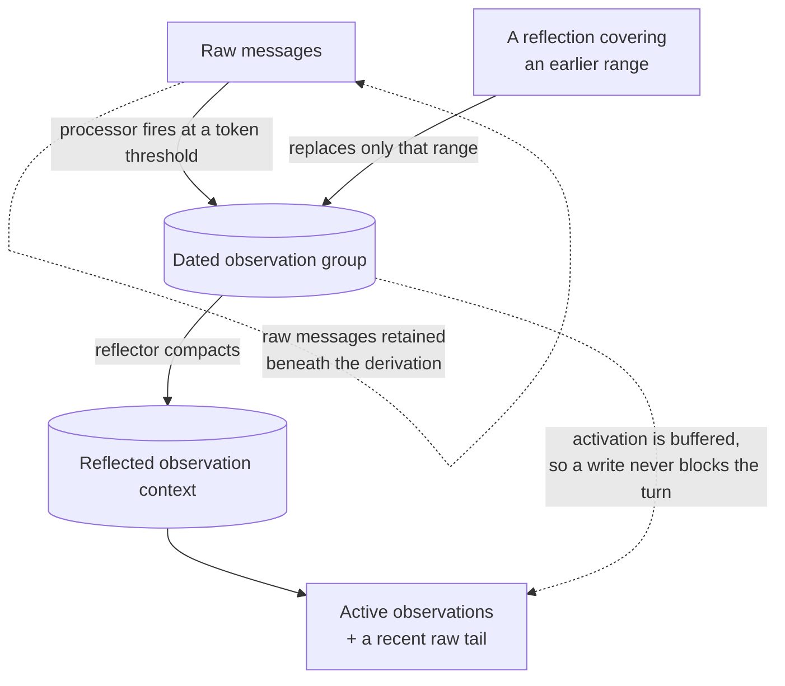

## 1. Executive Summary

Mastra Observational Memory is a context-compaction system integrated directly into an agent's input and output processor lifecycle. Instead of searching a large long-term fact store on every turn, it continuously converts old messages into dated observations, then periodically reflects those observations into a smaller stable context. The active agent sees compressed observations, a continuation hint, and recent unobserved messages.

The promising idea is buffered activation. Observation and reflection can run before the hard context threshold, store their results as inactive buffers, and activate them instantly when needed. This moves expensive LLM compression off the critical path without simply fire-and-forgetting work.

The tradeoff is complexity. This is not just a summarizer: it is a threshold state machine with message markers, storage capabilities, resource/thread scopes, in-process locks, buffering cursors, retries, idle/provider-change activation, and processor-step semantics. It is strong at keeping long conversations alive, but it is not a general factual memory or verification system.

## 2. Mental Model

Three roles share the conversation:

- Actor: the main agent doing user work.
- Observer: converts older raw messages into chronologically anchored observations.
- Reflector: condenses a growing observation log while preserving useful detail.

```text
raw messages + recent observations
  -> Observer at message-token threshold
  -> active dated observations + retained recent raw tail
  -> Reflector at observation-token threshold
  -> condensed observations
  -> inject as system context + continuation reminder
```

With asynchronous buffering enabled, an observer or reflector runs early. Its output records the exact message or observation range it covers. Activation replaces only that covered range, preserving anything appended afterward.



## 3. Architecture

The feature lives under `packages/memory/src/processors/observational-memory/`:

- `observational-memory.ts`: engine, configuration, locking, records, context construction, and primitive operations.
- `processor.ts`: Mastra agent lifecycle adapter.
- `observation-turn/`: turn/step abstraction for processor orchestration.
- `observer-runner.ts` / `reflector-runner.ts`: model execution.
- `observation-strategies/`: synchronous, async-buffered, and resource-scoped policies.
- `buffering-coordinator.ts`: shared in-process buffering state.
- `markers.ts` and `message-utils.ts`: durable operation boundaries in message streams.
- `thresholds.ts`: token thresholds, dynamic ranges, activation ratio, and blocking fallback.
- `extracted-values.ts` and `working-memory-extractor.ts`: extensible structured outputs.

`packages/memory/src/index.ts` wires the engine to storage, ordinary history, semantic retrieval, and working memory. Storage adapters must advertise `supportsObservationalMemory`; the feature fails clearly when core or storage capabilities are missing.

## 4. Essential Implementation Paths

- Lazy engine creation: `Memory._initOMEngine()` in `packages/memory/src/index.ts`.
- Context read: `Memory.getContext()`.
- Engine: `ObservationalMemory` in `observational-memory.ts`.
- Agent processor: `ObservationalMemoryProcessor` in `processor.ts`.
- Observer and reflector calls: `observer-runner.ts`, `reflector-runner.ts`.
- Threshold calculation: `thresholds.ts`.
- Async state: `BufferingCoordinator` in `buffering-coordinator.ts`.
- Observation activation: strategy files under `observation-strategies/`.
- Persistent operation markers: `markers.ts`.
- Context-range parsing: `message-utils.ts`.
- Retrieval indexing: `Memory.indexObservation()` and `onIndexObservations` wiring in `index.ts`.
- Working-memory side effect: `WorkingMemoryExtractor` in `working-memory-extractor.ts`.

## 5. Memory Data Model

The storage boundary uses `ObservationalMemoryRecord`, supplied by Mastra core storage. The record tracks active observations, observation/reflection buffering state, message cursors and IDs, token counts, buffered chunks, pending reflection, cycle IDs, model context, and scope identity.

Raw messages remain separately persisted. Markers embedded as data parts record observation/reflection start, completion, failure, activation, token range, and configuration snapshots. This gives the state machine a durable narrative rather than relying only on process memory.

Observations are text organized into dated groups. Optional retrieval mode additionally indexes observation groups with group/range/thread/resource metadata. Optional extractors can update thread metadata, suggest titles, or update structured/Markdown working memory.

## 6. Retrieval Mechanics

Observational Memory's primary “retrieval” is sequential context replacement:

- active observations become a system message;
- already observed raw messages are omitted;
- messages after `lastObservedAt` remain verbatim;
- a continuation reminder tells the actor that observations are compressed history;
- resource scope can include unobserved blocks from other threads.

Optional retrieval mode indexes observation groups for semantic search, with `observed_at` metadata and configurable search behavior. This is secondary to compaction: the base system optimizes context continuity, not arbitrary long-term question answering.

This separation is good. It avoids forcing vector recall onto every turn, but applications needing precise old facts should enable retrieval or keep an independent evidence store.

## 7. Write Mechanics

At each processor step, new messages are persisted and token counts updated. When unobserved messages cross `messageTokens`, the observer extracts observations. Activation retains a configurable raw-message floor rather than deleting the entire recent history.

When observations cross `observationTokens`, the reflector condenses them. Background observation starts at `bufferTokens` intervals; background reflection starts at a fraction of the reflection threshold. `blockAfter` can force a synchronous call only when buffered work failed to keep up.

Idle time and model/provider changes can force activation, which prevents a buffer from remaining invisible indefinitely or crossing model-context boundaries unexpectedly. Extractor callbacks can atomically project observer output into working memory or metadata.

## 8. Agent Integration

This is the deepest framework integration among the new batch. The same processor participates in both input and output:

- input loads observations and unobserved history into `MessageList`;
- output seals/persists messages and advances observation/reflection work;
- shared turn state coordinates multi-step agent loops;
- progress data parts can be streamed;
- system messages are tagged `observational-memory` so they can be replaced cleanly.

The feature can also be used directly through `Memory.getContext()` or standalone observation calls. That makes it usable outside the full processor workflow while preserving one engine.

## 9. Reliability, Safety, and Trust

Strong reliability mechanisms:

- message-range markers make partial operations inspectable;
- failed/in-progress cycles are distinguishable;
- stale buffering flags are detected against an operation registry;
- per-scope in-process locks prevent concurrent lost updates;
- background buffers persist before activation;
- activation replaces only the range the buffer summarized;
- retry, abort-signal, TTL, idle, provider-change, and long-session behavior are tested;
- missing core/storage capabilities fail fast.

The code explicitly notes that locks only protect one Node.js process. Distributed deployments need external locking or must accept eventual consistency. More fundamentally, observations and reflections are LLM summaries: they have source ranges but no candidate/verified/rejected state. Compression can omit details, import prompt injection, or harden a mistaken interpretation.

## 10. Tests, Evals, and Benchmarks

The package has unusually dense unit coverage for thresholds, long sessions, mid-loop observation, async buffering, activation TTL, temporal markers, failure persistence, retries, extraction, token counting, circular processor workflows, resource scope, attachments, and model/provider changes. Storage-backed integration tests exercise real adapters.

The tests strongly support lifecycle correctness. They do not, by themselves, establish that observer or reflector prose preserves all facts. Summary quality remains model-, prompt-, language-, and conversation-dependent.

## 11. For Your Own Build

### Steal

- Treat compaction as a first-class agent lifecycle, not an ad hoc summary call.
- Run compression early, persist it inactive, then activate without blocking.
- Attach every summary to the exact source range it replaces.
- Preserve a recent raw tail after observation.
- Replace only the covered range so late-arriving context survives.
- Separate observer and reflector thresholds.
- Force activation after idle time or provider change.
- Fail fast when storage cannot provide the required memory semantics.

### Avoid

- In-process locks do not protect horizontally scaled workers.
- Static buffering maps add lifecycle and memory-leak risk despite cleanup paths.
- Summary prose lacks explicit truth or contradiction states.
- Compaction can progressively amplify earlier omissions.
- Resource scope can mix multiple threads into one derived context if isolation policy is unclear.
- Many threshold and buffering options increase configuration burden.
- It solves context length better than durable evidence retrieval.

### Fit

Borrow Mastra's observation/reflection loop when the problem is long-running conversations that exceed model context. The most reusable piece is buffered activation with explicit coverage ranges—not the particular model prompts.

Do not substitute observational summaries for an auditable long-term store when exact evidence, deletion, or contradiction matters. A strong design can pair Mastra-style active context compaction with a separate source-preserving retrieval system.

## 12. Open Questions

- What distributed lock or compare-and-swap contract should storage adapters provide?
- How is summary faithfulness measured across repeated reflection generations?
- Can an operator inspect an observation and jump directly to every covered message?
- How are deleted source messages removed from active and buffered observations?
- When should resource scope merge threads, and when should it keep them isolated?
- How should untrusted tool output be fenced before it reaches observer prompts?

## Appendix: File Index

- `packages/memory/src/index.ts`
- `packages/memory/src/processors/observational-memory/observational-memory.ts`
- `packages/memory/src/processors/observational-memory/processor.ts`
- `packages/memory/src/processors/observational-memory/types.ts`
- `packages/memory/src/processors/observational-memory/thresholds.ts`
- `packages/memory/src/processors/observational-memory/buffering-coordinator.ts`
- `packages/memory/src/processors/observational-memory/markers.ts`
- `packages/memory/src/processors/observational-memory/message-utils.ts`
- `packages/memory/src/processors/observational-memory/observer-runner.ts`
- `packages/memory/src/processors/observational-memory/reflector-runner.ts`
- `packages/memory/src/processors/observational-memory/observation-strategies/`
- `packages/memory/src/processors/observational-memory/working-memory-extractor.ts`
- `packages/memory/src/processors/observational-memory/__tests__/`
- `packages/memory/integration-tests/`
