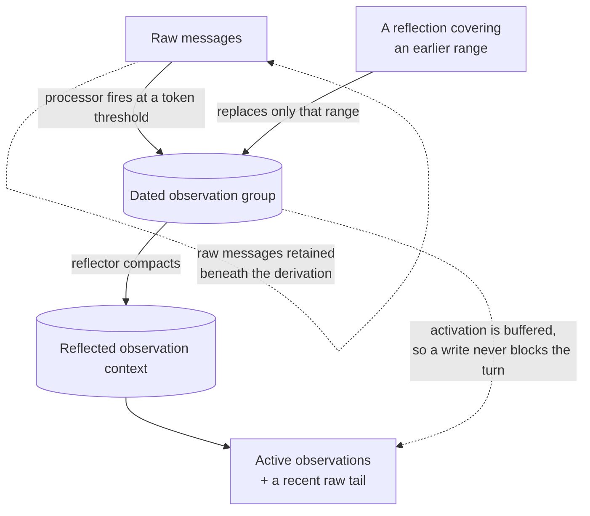

## 1. Executive Summary

Mastra Observational Memory is a context-compaction system integrated directly into an agent's input and output processor lifecycle. Instead of searching a large long-term fact store on every turn, it continuously converts old messages into dated observations, then periodically reflects those observations into a smaller stable context. The active agent sees compressed observations, a continuation hint, and recent unobserved messages.

The promising idea is buffered activation. Observation and reflection can run before the hard context threshold, store their results as inactive buffers, and activate them instantly when needed. This moves expensive LLM compression off the critical path without simply fire-and-forgetting work.

The tradeoff is complexity. This is not just a summarizer: it is a threshold state machine with message markers, storage capabilities, resource/thread scopes, in-process locks, buffering cursors, retries, idle/provider-change activation, and processor-step semantics.

**Beside it now sits a second subsystem that is a general factual memory.** The Subconscious is a scoped knowledge graph — nodes, and records of text about them — maintained by four background agents: `capture` and `remind` on the observation side, `curate` and `learn` on the reflection side. Its records carry a scope, a code-stamped capture time, an optional time the fact refers to, and a **ceiling**: the widest scope this record may ever be given, re-checked every time anyone tries to move it. Section 4a describes it, and it is where three of the four marks come from.

## 2. Mental Model

Three roles share the conversation:

- Actor: the main agent doing user work.
- Observer: converts older raw messages into chronologically anchored observations.
- Reflector: condenses a growing observation log while preserving useful detail.

```text
raw messages + recent observations
  -> Observer at message-token threshold
  -> active dated observations + retained recent raw tail
  -> Reflector at observation-token threshold
  -> condensed observations
  -> inject as system context + continuation reminder
```

With asynchronous buffering enabled, an observer or reflector runs early. Its output records the exact message or observation range it covers. Activation replaces only that covered range, preserving anything appended afterward.



## 3. Architecture

The feature lives under `packages/memory/src/processors/observational-memory/`:

- `observational-memory.ts`: engine, configuration, locking, records, context construction, and primitive operations.
- `processor.ts`: Mastra agent lifecycle adapter.
- `observation-turn/`: turn/step abstraction for processor orchestration.
- `observer-runner.ts` / `reflector-runner.ts`: model execution.
- `observation-strategies/`: synchronous, async-buffered, and resource-scoped policies.
- `buffering-coordinator.ts`: shared in-process buffering state.
- `markers.ts` and `message-utils.ts`: durable operation boundaries in message streams.
- `thresholds.ts`: token thresholds, dynamic ranges, activation ratio, and blocking fallback.
- `extracted-values.ts` and `working-memory-extractor.ts`: extensible structured outputs.

`packages/memory/src/index.ts` wires the engine to storage, ordinary history, semantic retrieval, and working memory. Storage adapters must advertise `supportsObservationalMemory`; the feature fails clearly when core or storage capabilities are missing.

## 4. Essential Implementation Paths

- Lazy engine creation: `Memory._initOMEngine()` in `packages/memory/src/index.ts`.
- Context read: `Memory.getContext()`.
- Engine: `ObservationalMemory` in `observational-memory.ts`.
- Agent processor: `ObservationalMemoryProcessor` in `processor.ts`.
- Observer and reflector calls: `observer-runner.ts`, `reflector-runner.ts`.
- Threshold calculation: `thresholds.ts`.
- Async state: `BufferingCoordinator` in `buffering-coordinator.ts`.
- Observation activation: strategy files under `observation-strategies/`.
- Persistent operation markers: `markers.ts`.
- Context-range parsing: `message-utils.ts`.
- Retrieval indexing: `Memory.indexObservation()` and `onIndexObservations` wiring in `index.ts`.
- Working-memory side effect: `WorkingMemoryExtractor` in `working-memory-extractor.ts`.

## 4a. The Subconscious knowledge graph

`packages/memory/src/processors/observational-memory/subconscious/` is fifteen
files; the storage contract it writes through is
`packages/core/src/storage/domains/knowledge/`, 1,238 lines across an abstract
base and an in-memory reference implementation.

**Four agents, two phases, and a cursor that will not lie.** `capture` and
`remind` run as observation extractors; `curate` and `learn` run as reflections.
Each is bounded by `maxSteps`, and the default is not uniform — `curate` gets
200 against 50, with the reason written down: *"Curation walks a worklist that
can reach hundreds of records, and its completion marker is fail-closed: a
curator that runs out of steps advances no cursor at all."* A background pass
that half-finishes and advances anyway is how records get silently skipped
forever; this one refuses to record progress it did not make.

**A record's scope has a ceiling, and the ceiling is the mechanism.** Scopes are
ordered `org` < `resource` < `thread`. A `KnowledgeRecord` carries `scope` and
an optional `maxScope`, and `assertKnowledgeScopeWithinCeiling` runs on append
(`inmemory.ts:330`) and again on every rescope (`:420`), so a record captured
under a thread ceiling cannot be promoted to the organisation later. `capture`
clamps at the source too — `clampScope(level, ceiling)` narrows a model-proposed
scope rather than rejecting the record — and `pinned.ts` states the bypass it is
guarding: *"creating a resource-level record under a thread ceiling would bypass
the ceiling."*

Widening the ceiling itself is possible and deliberately awkward: it has its own
call, `raiseKnowledgeCeiling`, guarded by `assertKnowledgeCeilingRaised`, which
refuses to move a ceiling in the tightening direction. So the cap is one-way,
and the direction it opens is the permissive one — a reader should take the
ceiling as a guarantee about what a *curator agent* can do to a record, not as a
guarantee about what an operator can.

**Validity time is separate from capture time.** `capturedAt` is stamped by code;
`when` is the time the fact refers to, asked of the capture model per record and
validated by `parseWhen`, which throws on an unparseable value rather than
dropping it. Nothing queries on it — the model is told in prose that *"the newer
observation supersedes the older one"* — so this is the axis separation without
the temporal query that would exploit it.

**Editing is remove plus append, and removal is one-way for the curator.**
Knowledge records are immutable; `pinned.ts` says an *"edit is remove plus append
because knowledge records are immutable"*. `knowledge_remove` is described as
*"Soft-delete a visible record. Curators cannot restore or physically erase
knowledge records"* — and the tool surface backs that up, since no restore tool
and no hard-delete tool is offered. The storage API does have
`record-restored` in its activity vocabulary, so the host retains the power the
curator is denied.

**Every mutation is logged where the records live.** `KnowledgeActivityAction`
is a closed set of seven — `node-created`, `node-updated`, `node-merged`,
`record-created`, `record-deleted`, `record-restored`, `record-rescoped` — and
`#recordActivity` is called at each mutating site, with `listActivity` declared
`abstract` on the storage base so no adapter can ship without it.

**A rescope moves the vector index with it.** `rescopeKnowledge` enqueues a
semantic-index `delete` under the old scope key and an `upsert` under the new
one. The stale-vector leak — a record whose permissions changed but whose
embedding still answers the old query — is the failure this atlas records for
most systems that rescope, and it is closed here by making the index follow the
scope rather than the id.

**The near-miss worth naming is the tombstone.** A curator soft-deletes a
superseded record, and nothing on the capture path consults `deletedAt`. The
next observation of the same fact writes a fresh record, because the deletion is
keyed on a record id and not on the value. The design has the vocabulary for a
[rejected-value tombstone](../../patterns/rejected-value-tombstone/) —
immutability, a soft delete with `deletedBy`, a rule that curators may never
restore — and stops one step short of the thing that would make deletion stick.

## 5. Memory Data Model

The storage boundary uses `ObservationalMemoryRecord`, supplied by Mastra core storage. The record tracks active observations, observation/reflection buffering state, message cursors and IDs, token counts, buffered chunks, pending reflection, cycle IDs, model context, and scope identity.

Raw messages remain separately persisted. Markers embedded as data parts record observation/reflection start, completion, failure, activation, token range, and configuration snapshots. This gives the state machine a durable narrative rather than relying only on process memory.

Observations are text organized into dated groups. Optional retrieval mode additionally indexes observation groups with group/range/thread/resource metadata. Optional extractors can update thread metadata, suggest titles, or update structured/Markdown working memory.

## 6. Retrieval Mechanics

Observational Memory's primary “retrieval” is sequential context replacement:

- active observations become a system message;
- already observed raw messages are omitted;
- messages after `lastObservedAt` remain verbatim;
- a continuation reminder tells the actor that observations are compressed history;
- resource scope can include unobserved blocks from other threads.

Optional retrieval mode indexes observation groups for semantic search, with `observed_at` metadata and configurable search behavior. This is secondary to compaction: the base system optimizes context continuity, not arbitrary long-term question answering.

This separation is good. It avoids forcing vector recall onto every turn, but applications needing precise old facts should enable retrieval or keep an independent evidence store.

## 7. Write Mechanics

At each processor step, new messages are persisted and token counts updated. When unobserved messages cross `messageTokens`, the observer extracts observations. Activation retains a configurable raw-message floor rather than deleting the entire recent history.

When observations cross `observationTokens`, the reflector condenses them. Background observation starts at `bufferTokens` intervals; background reflection starts at a fraction of the reflection threshold. `blockAfter` can force a synchronous call only when buffered work failed to keep up.

Idle time and model/provider changes can force activation, which prevents a buffer from remaining invisible indefinitely or crossing model-context boundaries unexpectedly. Extractor callbacks can atomically project observer output into working memory or metadata.

## 8. Agent Integration

This is the deepest framework integration among the new batch. The same processor participates in both input and output:

- input loads observations and unobserved history into `MessageList`;
- output seals/persists messages and advances observation/reflection work;
- shared turn state coordinates multi-step agent loops;
- progress data parts can be streamed;
- system messages are tagged `observational-memory` so they can be replaced cleanly.

The feature can also be used directly through `Memory.getContext()` or standalone observation calls. That makes it usable outside the full processor workflow while preserving one engine.

## 9. Reliability, Safety, and Trust

Strong reliability mechanisms:

- message-range markers make partial operations inspectable;
- failed/in-progress cycles are distinguishable;
- stale buffering flags are detected against an operation registry;
- per-scope in-process locks prevent concurrent lost updates;
- background buffers persist before activation;
- activation replaces only the range the buffer summarized;
- retry, abort-signal, TTL, idle, provider-change, and long-session behavior are tested;
- missing core/storage capabilities fail fast.

The code explicitly notes that locks only protect one Node.js process. Distributed deployments need external locking or must accept eventual consistency. More fundamentally, observations and reflections are LLM summaries: they have source ranges but no candidate/verified/rejected state. Compression can omit details, import prompt injection, or harden a mistaken interpretation.

## 10. Tests, Evals, and Benchmarks

The package has unusually dense unit coverage for thresholds, long sessions, mid-loop observation, async buffering, activation TTL, temporal markers, failure persistence, retries, extraction, token counting, circular processor workflows, resource scope, attachments, and model/provider changes. Storage-backed integration tests exercise real adapters.

The tests strongly support lifecycle correctness. They do not, by themselves, establish that observer or reflector prose preserves all facts. Summary quality remains model-, prompt-, language-, and conversation-dependent.

The knowledge domain's own suite is where the marks are checkable. `packages/core/src/storage/domains/knowledge/__tests__/base.test.ts` builds one fixture and then asserts, in a single block, that the record comes back for the node it is about in the permitted scope, that a *different* node returns none, and that the same relation query in a **sibling scope** returns none — the positive control and the cross-scope negative on the same fixture, which is what stops the negative half passing against an empty store. The same test pins `capturedAt` as a code-stamped `Date` and `when` as the caller's `2026-07-01`, so the two time axes are asserted apart rather than merely declared apart.

`scope.test.ts` covers the ceiling directly:
`assertKnowledgeScopeWithinCeiling(['org:o1'], 'resource')` is asserted to throw
`exceeds resource ceiling`, so the promotion the design exists to prevent is a
committed failing case rather than a comment.

Across `packages/memory/src` the ratio is 46,040 lines of test to 29,632 of implementation.

## 11. For Your Own Build

### Steal

- Treat compaction as a first-class agent lifecycle, not an ad hoc summary call.
- Run compression early, persist it inactive, then activate without blocking.
- Attach every summary to the exact source range it replaces.
- Preserve a recent raw tail after observation.
- Replace only the covered range so late-arriving context survives.
- Separate observer and reflector thresholds.
- Force activation after idle time or provider change.
- Fail fast when storage cannot provide the required memory semantics.

### Avoid

- In-process locks do not protect horizontally scaled workers.
- Static buffering maps add lifecycle and memory-leak risk despite cleanup paths.
- Summary prose lacks explicit truth or contradiction states.
- Compaction can progressively amplify earlier omissions.
- Resource scope can mix multiple threads into one derived context if isolation policy is unclear.
- Many threshold and buffering options increase configuration burden.
- It solves context length better than durable evidence retrieval.

### Fit

Borrow Mastra's observation/reflection loop when the problem is long-running conversations that exceed model context. The most reusable piece is buffered activation with explicit coverage ranges—not the particular model prompts.

Do not substitute observational summaries for an auditable long-term store when exact evidence, deletion, or contradiction matters. A strong design can pair Mastra-style active context compaction with a separate source-preserving retrieval system.

## 12. Open Questions

- What distributed lock or compare-and-swap contract should storage adapters provide?
- How is summary faithfulness measured across repeated reflection generations?
- Can an operator inspect an observation and jump directly to every covered message?
- How are deleted source messages removed from active and buffered observations?
- When should resource scope merge threads, and when should it keep them isolated?
- How should untrusted tool output be fenced before it reaches observer prompts?

## Appendix: File Index

- `packages/memory/src/index.ts`
- `packages/memory/src/processors/observational-memory/observational-memory.ts`
- `packages/memory/src/processors/observational-memory/processor.ts`
- `packages/memory/src/processors/observational-memory/types.ts`
- `packages/memory/src/processors/observational-memory/thresholds.ts`
- `packages/memory/src/processors/observational-memory/buffering-coordinator.ts`
- `packages/memory/src/processors/observational-memory/markers.ts`
- `packages/memory/src/processors/observational-memory/message-utils.ts`
- `packages/memory/src/processors/observational-memory/observer-runner.ts`
- `packages/memory/src/processors/observational-memory/reflector-runner.ts`
- `packages/memory/src/processors/observational-memory/observation-strategies/`
- `packages/memory/src/processors/observational-memory/working-memory-extractor.ts`
- `packages/memory/src/processors/observational-memory/subconscious/` — `capture.ts`, `remind.ts`, `curate.ts`, `learn.ts`, `pinned.ts`, `scope.ts`, `semantic-index.ts`, `knowledge-write-tools.ts`
- `packages/core/src/storage/domains/knowledge/base.ts` — the record shape, the scope order, the ceiling assertions, the activity vocabulary
- `packages/core/src/storage/domains/knowledge/inmemory.ts` — the reference implementation and every `#recordActivity` call site
- `packages/core/src/storage/domains/knowledge/__tests__/` — `base.test.ts`, `scope.test.ts`, `wikilinks.test.ts`
- `packages/memory/src/processors/observational-memory/__tests__/`
- `packages/memory/integration-tests/`

## History

**2026-08-29** — [`4a41ea611732860395104e5af5ebe279ff9a796e`](https://github.com/mastra-ai/mastra/commit/4a41ea611732860395104e5af5ebe279ff9a796e) — re-pinned 1,049 commits on, and the system has grown a second memory subsystem that carries three of its four marks. Marks go from one to four: `scope_enforced` was already held and is now stronger, and `bitemporal`, `audit_log` and `negative_eval` are added.

The Subconscious is a scoped knowledge graph of nodes and records, maintained by four background agents, described in section 4a. `bitemporal` rests on `capturedAt` stamped by code beside an optional `when` supplied per record by the capture model and validated rather than dropped — a point rather than an interval, with nothing querying on it. `audit_log` rests on a closed seven-value activity vocabulary written at every mutating call site, with `listActivity` `abstract` on the storage base. `negative_eval` rests on one assertion block that requires the record in its own scope and zero records in a sibling scope, on the same fixture. `scope_enforced` now covers more than a filter: a per-record `maxScope` ceiling is re-checked on append and on every rescope, and raising it has its own guarded call.

Two mechanisms are worth reading beyond the marks. A rescope enqueues a semantic-index delete for the old scope key and an upsert for the new one, so the vector view follows the permission change rather than answering the old query. And `curate` is given a larger step budget than its siblings with the reason written down — its completion marker is fail-closed, so a curator that runs out of steps advances no cursor at all.

`tombstone` is withheld and it is the near-miss: records are immutable, removal is a soft delete stamping `deletedAt` and `deletedBy`, the curator has no restore or hard-delete tool — and nothing on the capture path consults the deletion, so re-observing the same fact writes a new record. `trust_state` and `human_review` are absent: a record's `metadata` holds the capture agent's free-text reason and no status, and no surface exists for a person to adjudicate one. `stack_source` promoted from `seeded` to `reviewed`. Screened before reading: three auto-run surfaces, two build-time execution surfaces, 255 unpinned surfaces and 118 files inside the seven-day cooldown; nothing was installed and nothing was run.

**2026-08-06** — [`470f286e98c9ad95f4c42087e411c0af363a4a2c`](https://github.com/mastra-ai/mastra/commit/470f286e98c9ad95f4c42087e411c0af363a4a2c) — 403 commits on the monorepo, 99 files touching a memory path. The observational-memory mechanism this report covers is unchanged; what moved is the reliability around it.

The commit worth naming is `#17910`, *"memory list reads throw on backend failure instead of returning empty"*. A memory read that returns an empty list when its backend failed is indistinguishable, to every caller, from a memory that is genuinely empty — so an outage presents as amnesia and the agent proceeds confidently with no history. Failing loudly is the correct choice and the bug is the kind only a reviewer looking for silent degradation finds.

Beside it: `#20565` retries an empty working-memory extraction, `#20788` handles failed tool states in token counting, `#17800` preserves tool-call messages when a client-side tool result is still pending, and `#19216` deduplicates observational-memory record initialisation. The Redis, Spanner and Upstash storage domains each gained memory error-propagation tests.

The mark is re-checked in both directions and does not move; `audit_log` stays withheld, the memory-path matches for *audit* being working-memory utilities rather than a mutation record.

Screened again: 3 auto-run surfaces (`.claude/settings.json`, `.cursor/mcp.json`, `.opencode/`), 236 unpinned dependency surfaces and 120 inside the seven-day cooldown — the largest surface in the corpus, and nothing was installed or run.

**2026-07-26** — [`40547102f655596178346ad2f883fbde735c3333`](https://github.com/mastra-ai/mastra/commit/40547102f655596178346ad2f883fbde735c3333) — first reading.
