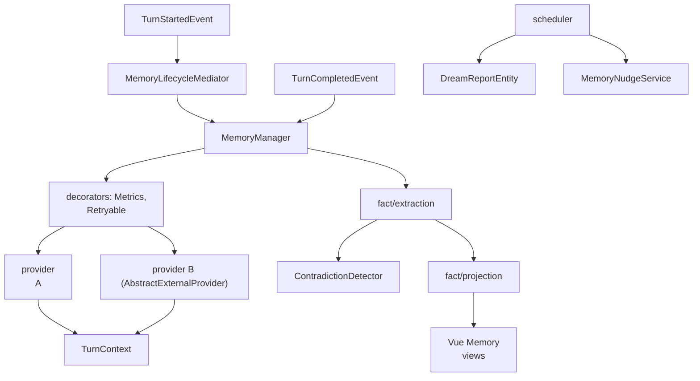

## 1. Executive Summary

MateClaw's memory subsystem is 7,998 lines of Java under `vip/mate/memory/` against 3,406 lines of test beside it, plus a memory UI and externalized memory prompts, and it is worth reading because it was built in a different engineering tradition from everything else here: enterprise-framework conventions — dependency injection, a service-provider interface, event listeners, auto-configuration — applied to agent memory.

That tradition shows in the package layout — `archive`, `controller`, `event`, `fact`, `identity`, `lifecycle`, `listener`, `model`, `nudge`, `provider`, `repository`, `scheduler`, `search`, `service`, `spi`, `tool`, with a `MemoryAutoConfiguration` — and in two design choices the atlas has not seen before.

**The provider contract carries an owner key.** `MemoryProvider` declares `prefetch(agentId, userQuery)` *and* `prefetch(agentId, userQuery, ownerKey)`, `syncTurn(...)` with and without `ownerKey`. This matters because the [pluggable memory provider](../../patterns/pluggable-memory-provider/) pattern was written from three host runtimes — [Hermes Agent](../hermes-agent/), [OpenClaw](../openclaw/), and [Pi](../pi/) — whose contracts carry **no scope parameter at all**. MateClaw shows the alternative, and confirms the gap in the others was a choice rather than an inevitability.

**Cross-cutting concerns are decorators, not per-provider code.** `spi/decorator/` holds `MemoryProviderDecorator`, `MetricsMemoryProvider`, and `RetryableMemoryProvider`. Any provider wrapped in these gets metrics and retry for free. In Hermes and OpenClaw, every plugin implements its own resilience — or does not, which is why [Magic Context](../magic-context/) had to build fail-closed registration itself and [LobsterAI](https://github.com/netease-youdao/LobsterAI) had to patch OpenClaw for a rename race. Decorating the interface solves that once for all providers.

The rest is competent and recognizable: turn lifecycle events (`TurnStartedEvent`, `TurnCompletedEvent`, `TurnContext`) mediated through a `MemoryLifecycleMediator`, a `ContradictionDetector` over extracted facts, a `MemoryScope` with team and global sharing, dream reports for consolidation, and a `MemoryNudgeService`.

**The scope is a read-path predicate, and the tests say what it must exclude.**
`FactQueryService.recallRelevant` filters `scope IN (TEAM, GLOBAL) OR (scope =
PERSONAL AND owner_key = ?)`, degrading to shared-only when no owner resolves, so
a second user's personal facts are not reachable from a recall. Three committed
tests hold the boundary from different directions, and each asserts against a
*populated* result rather than an empty one: `trackerPropagatesOnlyVisibleOwnerIdentity`
seeds a shared `MEMORY.md` and two owners' `PROFILE.md` files, runs the tracker as
`user:a`, and verifies the shared and own records are written while owner-b's is
`never()` recorded; `dreamCandidatesStaySharedOnly` asserts the scope parameters
contain `TEAM` and `GLOBAL` and not `PERSONAL`; and `SessionSearchIsolationTest`
inserts four conversations into a real database and asserts that both `listRecent`
and `search` return the completed one while excluding the still-running sibling —
"still-running sibling must not leak", says the comment — and the caller's own.

**Contradictions get a human verdict.** `FactContradictionEntity` links two facts
with a description, and `FactController` exposes a queue of the ones whose
`resolution IS NULL` beside a `POST /contradictions/{id}/resolve` that requires a
workspace `member` role, validates the verdict against
`KEEP_A | KEEP_B | MERGE | IGNORE`, and records it with `resolvedAt` and a
`resolvedBy` read from the Spring `Authentication`. The Vue fact list surfaces it.
A person adjudicates, the verdict is durable, and the adjudicator is named.

What the verdict does not do is act on the facts. `KEEP_A`, `KEEP_B` and `MERGE`
appear in the validation list, the entity's comment and nothing else: no code
path reads `getResolution` to retire, merge or down-trust a `FactEntity`.
Resolving a contradiction removes it from the queue and changes nothing about
what recall returns. Beside that, the SPI has **no deletion hook** — no
`delete`, `forget`, `remove` or `purge` method on `MemoryProvider`; `evict` is
documented as dropping "cached internal state … on agent deactivation or memory
pressure" — so MateClaw closes half the provider gap and leaves the other half
open.

## 2. Mental Model

```java
public interface MemoryProvider {
    String id();
    default String systemPromptBlock(Long agentId);
    default String prefetch(Long agentId, String userQuery);
    default String prefetch(Long agentId, String userQuery, String ownerKey);   // scoped
    default void   syncTurn(Long agentId, String conversationId,
                            String userMessage, String assistantReply);
    default void   syncTurn(Long agentId, String conversationId,
                            String userMessage, String assistantReply,
                            String ownerKey);                                    // scoped
    default List<Object> getToolBeans();
    default void   onSessionEnd(Long agentId, String conversationId);
}
```

Everything but `id()` is a default method, so a provider implements only what it supports — capability negotiation by language feature rather than by a `capabilities()` call.

Scope is a string column with a documented rationale:

```java
/** Visibility scope for a memory row (workspace file, fact, recall).
 *  ... persona files (AGENTS.md, SOUL.md, PROFILE.md) and legacy rows live ...
 *  Stored as a plain string column (scope) rather than a DB enum so ... */
public static boolean isShared(String scope) {
    return TEAM.equals(scope) || GLOBAL.equals(scope);
}
```

`TEAM` and `GLOBAL` are the shared scopes; a `MemoryOwnerResolver` maps requests to owners.

Turn lifecycle:

```text
TurnStartedEvent → MemoryLifecycleMediator → providers.prefetch(..., ownerKey)
                                            → TurnContext assembled
TurnCompletedEvent → providers.syncTurn(..., ownerKey)
session end        → providers.onSessionEnd(...)
scheduler          → dream reports, nudges
```

## 3. Architecture

`mateclaw-server/src/main/java/vip/mate/memory/`:

- `spi/` — `MemoryProvider`, `MemoryManager`, `AbstractExternalProvider`, and `decorator/` (`MemoryProviderDecorator`, `MetricsMemoryProvider`, `RetryableMemoryProvider`).
- `lifecycle/` — `MemoryLifecycleMediator`, `MemoryLifecycleEventListener`, `TurnStartedEvent`, `TurnCompletedEvent`, `TurnContext`.
- `fact/` — `extraction`, `contradiction` (`ContradictionDetector`), `projection`, `provider`, `model`, `controller`.
- `identity/` — `MemoryScope`, `MemoryOwnerResolver`.
- `model/` — `MemoryRecallEntity`, `DreamReportEntity`, `MorningCardSeenEntity`.
- `archive/`, `search/`, `repository/`, `service/`, `scheduler/`, `nudge/`, `tool/`, `event/`, `listener/`, `controller/`, `MemoryAutoConfiguration`, `MemoryProperties`.
- `mateclaw-ui/src/views/Memory/` and `stores/useMemoryStore.ts` — the review UI.
- `mateclaw-server/src/main/resources/prompts/memory/` — externalized prompts.



## 4. Essential Implementation Paths

### A provider contract that carries scope

The paired overloads — one with `ownerKey`, one without — are a pragmatic migration shape: existing providers keep working on the unscoped signature while scope-aware ones opt in. It is less rigorous than requiring scope on every call (the discipline [OpenClaw](../openclaw/) enforces inside its store with `scopedPredicate`), because a provider can still be invoked unscoped. But it is far more than the three host runtimes previously reviewed offer, where scope cannot be expressed at all.

The atlas's pattern page argues a workable contract needs scope on every call, a deletion hook, and capability reporting. MateClaw supplies scope (optionally), supplies capability reporting implicitly through default methods, and supplies no deletion path — one and a half of three.

### Decorators for resilience and observability

`MetricsMemoryProvider` and `RetryableMemoryProvider` wrap any `MemoryProvider`, so a flaky external backend gets retried and every backend gets instrumented without touching provider code. `AbstractExternalProvider` presumably supplies the common shape for remote backends.

This is the clearest answer in the atlas to a question the pluggable-provider pattern raises and does not resolve: when a mounted provider fails or is slow, whose problem is it? Here it is the host's, solved once, in the decorator chain.

### Turn lifecycle as events

Rather than the host calling providers directly, `TurnStartedEvent` and `TurnCompletedEvent` flow through a mediator and listener. `TurnContext` carries the assembled state. This is Spring-idiomatic and has a real benefit: additional memory concerns can subscribe to turn events without modifying the call path — the `nudge` service and scheduler plug in the same way.

### Contradiction detection

`fact/contradiction/ContradictionDetector.java` is a dedicated component, which few systems here have at all. What was not found is what happens next: no resolution workflow, review queue, or supersession path surfaced alongside it. That mirrors [Gini](../gini-agent/), which models a `conflicted` status without a visible way to act on it — detection is necessary and, on its own, incomplete.

### Dream reports and nudges

`DreamReportEntity` puts MateClaw in the group of systems that call consolidation dreaming, and `MorningCardSeenEntity` alongside `MemoryNudgeService` suggests memory is surfaced proactively — a morning summary the user can be shown, tracked so it is not repeated. Proactive memory delivery is rare in the atlas, where recall is almost always query-driven.

## 5. Memory Data Model

Relational, through Spring repositories, with fact extraction feeding projections and a separate `archive` package. `MemoryScope` is deliberately a string rather than a database enum — the comment explains this is so the value set can evolve without a schema migration, which is a sensible tradeoff at the cost of database-level validation.

Gaps:

- **No tombstone** was found; the `archive` package suggests retention rather than negative memory.
- **Contradiction is detected, not resolved.**
- **No verification state** on facts surfaced in what was read.
- **The SPI has no deletion hook**, so a user's erasure request has no defined route into a mounted provider.

## 6. Retrieval Mechanics

Provider `prefetch` plus a dedicated `search` package and fact projections. Fact
recall is a scoped query ordered by `trust` descending and capped at ten rows
(`FactQueryService:88-90`), with `bumpUseCount` documented as "the ONLY writer of
accumulated columns" — a chokepoint comment worth having on any counter. Session
search runs over conversations with two rows excluded by design. The projection
layer is worth noting on its own: separating stored facts from the projections
used for display and recall is the [treat semantic indexes as projections](../basic-memory/)
discipline expressed in a relational idiom, and `FactProjectionOwnerScopeTest`
asserts a full rebuild preserves each row's canonical owner and scope rather than
collapsing them.

## 7. Write Mechanics

`syncTurn` after each completed turn, dispatched to every registered provider through the manager and its decorators, with fact extraction and contradiction detection downstream. Because writes flow through the lifecycle mediator rather than direct calls, the write path is observable in one place — the same chokepoint benefit [RainBox](../rainbox/) gets from `record_belief`, though without the trust policy.

## 8. Agent Integration

`getToolBeans()` lets a provider contribute Spring-managed tool beans to the agent, which is an elegant use of the container: memory tools are registered by the provider that implements them rather than declared centrally. The Vue UI under `views/Memory/` with `useMemoryStore.ts` gives operators a review surface, and prompts live in `resources/prompts/memory/` where they can be edited without recompiling.

## 9. Reliability, Safety, and Trust

Strengths:

- **Scope on the provider contract**, closing half the gap the atlas documents in three other host runtimes.
- **Retry and metrics as decorators**, so resilience is solved once for every backend.
- **Default methods** for implicit capability negotiation.
- **Event-driven turn lifecycle** with a single mediator.
- **A dedicated contradiction detector.**
- **Provider-contributed tool beans.**
- **Externalized prompts** and an operator UI.
- **Scope stored as a string** with a documented rationale.
- **A human verdict on contradictions**, queued, role-gated, validated against a
  closed verb set and stored with the resolver's identity.
- **Isolation asserted, not assumed** — three test classes assert what a
  populated recall or search must *not* contain.

Gaps:

- **No deletion hook on the SPI.** `MemoryProvider` has no `delete`, `forget`,
  `remove` or `purge`; `evict` drops cached state, not stored memory.
- **The resolution verbs are read by nothing.** `KEEP_A`, `KEEP_B` and `MERGE`
  are validated on the way in and never consulted again, so adjudicating a
  contradiction clears the queue and leaves both facts recallable at their
  original trust.
- **Unscoped overloads remain callable**, so scope is opt-in per call site.
- **No tombstone.** A fact carries `confidence` and `trust` floats and no status;
  nothing records that a value was rejected, and a re-extraction of the same
  claim has nothing to consult.

## 10. Tests, Evals, and Benchmarks

3,406 lines of test under `src/test/java/vip/mate/memory/` against 7,998 of
implementation, including `archive`, `fact`, `lifecycle`, `search` and `service`
packages. Nothing was run for this review, and no memory-quality benchmark was
found.

The suite's character is worth naming: its strongest tests are exclusion tests.
`SessionSearchIsolationTest` builds a real dataset through JDBC inserts and
asserts two conversations are filtered out of a populated result;
`MemoryRecallOwnerIsolationTest` asserts a second owner's file is never written
to the recall ledger; `MemoryArchiveServiceTest` and
`MemoryManagerPluginPrefetchTest` each assert content that must not appear in an
assembled block. Asserting what must not come back is the harder half of a memory
test suite, and it is the half this one invested in.

The measurement this design invites is provider-level: with metrics already decorating every provider, per-provider recall quality and latency are collectable, and comparing two mounted backends on the same traffic would be straightforward. Nothing indicates that has been done.

## 11. For Your Own Build

### Steal

- **Put scope on the provider contract.** Paired overloads are a pragmatic way to add it to an existing interface without breaking implementations.
- **Decorate the provider interface** for retry, metrics, and any other cross-cutting concern, so every backend inherits them.
- **Default methods as capability negotiation** — a provider implements what it supports, and the host does not need a `capabilities()` call to find out.
- **Drive memory from turn lifecycle events** so new concerns subscribe rather than modify.
- **Let providers contribute tool beans**, keeping a memory backend's tools with the backend.
- **Externalize memory prompts** to resources.
- **Track what has been proactively shown** (`MorningCardSeenEntity`) so a nudge is not repeated.
- **Test the exclusion, against a populated result.** Insert four conversations, assert the completed one comes back and the running sibling and the caller's own do not. An isolation rule nobody asserts is an isolation rule nobody notices breaking, and asserting it on an empty result proves nothing.
- **Queue the contradictions whose verdict is null.** `resolution IS NULL` turns a detector's output into a work list a person can finish, and storing `resolvedBy` from the authenticated principal makes the verdict attributable without a separate audit table.

### Avoid

- **A provider contract with scope but no deletion** — half a governance story.
- **Optional scope**, since an unscoped overload will eventually be called.
- **A closed verb set nothing consumes.** `KEEP_A | KEEP_B | MERGE | IGNORE` is validated on the way in and read by no code that touches a fact, so a resolved contradiction changes the queue and not the memory. Either wire the verbs or name the endpoint for what it does, which is triage.
- **String scope without database validation.**

### Fit

Borrow:

- The SPI shape, especially the scoped overloads and default methods.
- The decorator chain for metrics and retry.
- Turn lifecycle events as the memory trigger.

Do not copy:

- The contract as complete; add `forget(scope|id)` before third parties mount backends.
- Resolution that records without acting.

## 12. Open Questions

- How does a deletion request reach a mounted provider? Nothing on the SPI expresses it.
- What should `KEEP_A` do? The verb is stored and unread; whether the intent is to retire the losing fact, to drop its trust, or only to stop re-raising the contradiction is not recoverable from the code.
- Are unscoped `prefetch`/`syncTurn` calls still in use, and is there a plan to retire them?
- What does the nudge service decide to surface, and on what signal?
- Do the decorators cover failure isolation as well as retry — can one slow provider stall a turn?

## Appendix: File Index

- Provider contract: `mateclaw-server/src/main/java/vip/mate/memory/spi/MemoryProvider.java`, `MemoryManager.java`, `AbstractExternalProvider.java`.
- Decorators: `spi/decorator/MemoryProviderDecorator.java`, `MetricsMemoryProvider.java`, `RetryableMemoryProvider.java`.
- Lifecycle: `lifecycle/MemoryLifecycleMediator.java`, `MemoryLifecycleEventListener.java`, `TurnStartedEvent.java`, `TurnCompletedEvent.java`, `TurnContext.java`.
- Facts: `fact/extraction/`, `fact/contradiction/ContradictionDetector.java`, `fact/projection/`, `fact/provider/`, `fact/model/FactEntity.java` (`confidence`, `trust`, `ownerKey`, `scope`, no status), `fact/model/FactContradictionEntity.java`.
- Scoped reads and the review queue: `fact/query/FactQueryService.java` (the scope predicate `:78-88`, the trust ordering and row cap `:88-90`, the unresolved-contradiction list `:45-53`), `fact/controller/FactController.java` (the queue `:168-176`, the role-gated resolve `:178-203`), `service/MemoryRecallService.java:407-412`.
- Identity and scope: `identity/MemoryScope.java`, `identity/MemoryOwnerResolver.java`.
- Entities: `model/MemoryRecallEntity.java`, `DreamReportEntity.java`, `MorningCardSeenEntity.java`.
- Operations: `scheduler/`, `nudge/MemoryNudgeService.java`, `archive/`, `search/`, `repository/`.
- Configuration: `MemoryAutoConfiguration.java`, `MemoryProperties.java`.
- UI and prompts: `mateclaw-ui/src/views/Memory/`, `stores/useMemoryStore.ts`, `mateclaw-server/src/main/resources/prompts/memory/`.
- Tests: `mateclaw-server/src/test/java/vip/mate/memory/` (3,406 lines), in particular `search/SessionSearchIsolationTest.java:77-98`, `service/MemoryRecallOwnerIsolationTest.java:44-111`, `fact/FactProjectionOwnerScopeTest.java`, `fact/FactMemoryProviderOwnerSafetyTest.java`, `archive/MemoryArchiveServiceTest.java`, `MemoryManagerPluginPrefetchTest.java`.

**Recorded searches.** Run from a checkout at `7e36ac7749b9e6d5e001811a71aa5fbe0abc2ede`.

- **The SPI has no deletion hook.** `grep -n -i "delete\|forget\|remove\|purge" mateclaw-server/src/main/java/vip/mate/memory/spi/MemoryProvider.java` — nothing. The interface's methods are `id`, `order`, `isAvailable`, `systemPromptBlock`, two `prefetch` overloads, two `syncTurn` overloads, `getToolBeans`, `onSessionEnd`, `onPreCompress`, `onMemoryWrite`, `warmup`, `evict`.
- **The resolution verbs are never consumed.** `grep -rn "KEEP_A\|KEEP_B\|\"MERGE\"\|getResolution" --include="*.java" mateclaw-server/src/main` — the validation list and the queue filter in `FactController` and `FactQueryService`, the entity's own comment, and nothing that reads a `FactEntity`.
- **A fact has no status column.** `grep -n "private" mateclaw-server/src/main/java/vip/mate/memory/fact/model/FactEntity.java` — `confidence` and `trust` are floats; there is no enum, no state, and no tombstone table.

## History

**2026-09-11** — [`7e36ac7749b9e6d5e001811a71aa5fbe0abc2ede`](https://github.com/mateaix/mateclaw/commit/7e36ac7749b9e6d5e001811a71aa5fbe0abc2ede) — re-read. Screened before reading: no auto-run surface, six dependency manifests and lockfiles changed the same day, three floating-range declarations, one build-time execution hook. The tree was read, never built, and no test was run. The repository moved 882 files and 61,418 insertions past the previous pin; the memory subsystem's share is 32 files and 1,245 insertions. **Two marks added.** `negative_eval`: `SessionSearchIsolationTest` inserts four conversations through JDBC and asserts `listRecent` and `search` each return the completed one while excluding the still-running sibling and the caller's own, and `MemoryRecallOwnerIsolationTest` verifies a second owner's file is `never()` written to the recall ledger while the shared and own files are — populated results in every case. `human_review`: `FactController` queues contradictions whose `resolution IS NULL` and exposes a `member`-gated resolve endpoint that validates `KEEP_A | KEEP_B | MERGE | IGNORE` and stores the verdict with `resolvedAt` and a `resolvedBy` read from the Spring `Authentication`, surfaced in the Vue fact list. The verdict's limit is recorded with it: no code path reads `getResolution` to retire, merge or down-trust a fact, so resolving clears the queue and leaves recall unchanged. `scope_enforced` keeps its mark and gains an evidence record naming the tier — `scope IN (TEAM, GLOBAL) OR (scope = PERSONAL AND owner_key = ?)` in `FactQueryService.recallRelevant`, not the provider overloads. The deletion-hook absence claim was re-run against the SPI and holds. Counts corrected to 7,998 lines of implementation against 3,406 of test, and the empty `stack_storage` and `stack_retrieval` fields filled.

**2026-07-27** — [`3643aed7564390f57906954286a443d5913b97a7`](https://github.com/mateaix/mateclaw/commit/3643aed7564390f57906954286a443d5913b97a7) — first reading.
