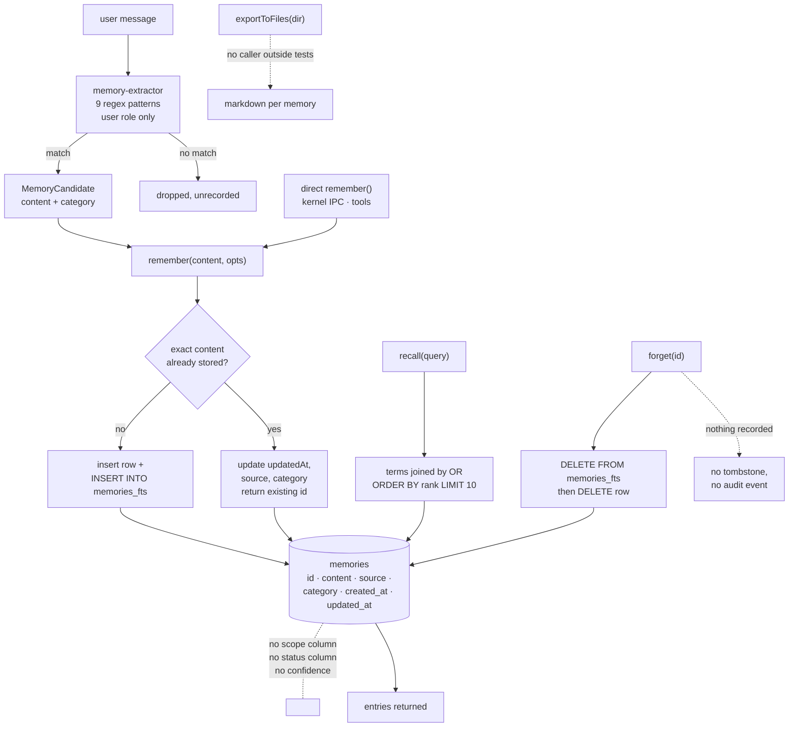

## 1. Executive Summary

Matrix OS is an agent operating system — 182,501 lines of TypeScript under
`packages/`, across a kernel, a gateway, a desktop app and a plugin system,
1,809 commits since 11 February 2026, AGPL-3.0. Counting the whole tree, which
carries a desktop shell, a mobile app, fixtures and six bundled demo apps, comes
to 693,569 lines over 3,041 files. It has specs, a paper directory, three
docker-compose topologies and a homebrew tap.

The memory subsystem is 328 lines. `packages/kernel/src/memory.ts` defines a
`MemoryStore` with `remember`, `recall`, `forget`, `listAll`, `exportToFiles`
and `count` over a SQLite table of six columns, with an FTS5 projection beside
it. `packages/gateway/src/memory-extractor.ts` is 58 lines of regular
expressions that decide what gets stored.

One mark. The forget test asserts that the removed memory is gone and the
bystander survives, over the same store, which is the shape this atlas asks
for.

The rest of the report is about the six columns and the nine patterns, because
between them they decide everything else. There is no scope key, so nothing
separates one caller's memories from another's. There is no status or
confidence, so a regex hit and a deliberate `remember` are the same kind of
row. And there is no update path for content and no record of a deletion, so
the only correction available is to remove a row and hope the pattern that
created it does not fire again.

## 2. Mental Model

Capture is pattern matching, not extraction. `PATTERNS` is a list of nine
regular expressions mapped to four categories:

```js
{ pattern: /(?:i prefer|i always want|i like|my preference is)\s+(.+)/i, category: "preference" },
{ pattern: /(?:my name is|i am called|call me)\s+(.+)/i,                 category: "fact" },
{ pattern: /(?:remember that|don't forget|keep in mind)\s+(.+)/i,        category: "instruction" },
{ pattern: /(?:always|never)\s+(.+)/i,                                   category: "instruction" },
{ pattern: /(?:don't|do not|stop|quit)\s+(.+)/i,                          category: "instruction" },
```

The first three are the kind of thing this approach is good at: an explicit
declaration in a recognisable frame, captured with no model call and no
latency. This atlas has a
[pattern page for that](../../patterns/zero-llm-capture/) and the argument for
it is real — deterministic, free, and it cannot hallucinate a fact the user did
not say.

The last two are the problem. `/(?:always|never)\s+(.+)/i` matches *"I'll
always forget to do that"*. `/(?:don't|do not|stop|quit)\s+(.+)/i` matches
*"don't worry about it"* and stores `worry about it` as an **instruction**.
Neither pattern is anchored to the start of the message, so a match anywhere in
any user turn captures the remainder of the line.

That would be a tuning problem in a system that could mark the result as
uncertain. Here it is permanent: section 5 covers what the row can and cannot
say about itself.

## 3. Architecture



**Two other things in this tree are called memory and are not.** `shell/src/lib/os-view-layout-memory.ts` and
`desktop/src/renderer/src/features/desktop-shell/native-os-view-layout-memory.ts` hold an
`OsViewLayoutMemory` — a `Record<DesktopMode, WindowGeometryEntry[] | null>` capturing
window `x`, `y`, `width` and `height` so a desktop mode restores the layout it had.
It is window geometry, keyed on nothing a correction could name, and it sits
earlier in an alphabetical grep for *memory* than the store this report is
about.

## 4. Essential Implementation Paths

**`remember` is idempotent on exact content.** A repeat looks up
`eq(memories.content, content)`, and on a hit it updates `updatedAt`, `source`
and `category` and returns the existing id rather than inserting. That is the
right default for a pattern extractor that will see the same sentence twice,
and it is exact-match, so a rephrasing is a new row.

**The FTS projection is maintained by hand on both sides.** The insert path
runs an explicit `INSERT INTO memories_fts(rowid, content)`, and `forget`
deletes the FTS row *before* the record, in that order, so the projection does
not outlive its subject. Several systems in this corpus get the delete order
wrong or skip the projection entirely; this one does not.

**`recall` ORs the query terms.** The query is split on whitespace and joined
as `"a" OR "b" OR "c"`, so a match on any single term qualifies and `ORDER BY
rank` does the rest of the work. For a two-word question that is reasonable.
For a sentence it means one common term admits everything containing it, with
relevance decided entirely by BM25 over a store that has no other signal — no
recency weighting, no category preference, no usage count.

## 5. Memory Data Model

The whole schema:

```ts
export const memories = sqliteTable("memories", {
  id: text("id").primaryKey(),
  content: text("content").notNull(),
  source: text("source"),
  category: text("category").default("fact"),
  createdAt: text("created_at"),
  updatedAt: text("updated_at"),
});
```

Three absences decide most of this report.

**No scope key.** There is no user, agent, session, project or tenant column,
and no read path filters on one. In a system that calls itself an operating
system and runs a plugin architecture, every memory is visible to every caller
of the store.

**No status and no confidence.** `category` is `fact` / `preference` /
`instruction` / `event` — a kind, not an epistemic state. A row captured by
`/(?:don't|do not|stop|quit)\s+(.+)/i` from *"don't worry about it"* is stored
as an `instruction` with exactly the standing of one the user typed
deliberately, and nothing in the row can later say it was wrong. The atlas's
`trust_state` mark asks for a state that withholds a memory from being treated
as true; there is no field here that could hold one.

**One time axis.** `createdAt` and `updatedAt` are both record time. Nothing
records when the remembered thing was true, so a preference that has since
changed reads identically to a current one.

## 6. Retrieval Mechanics

Covered in section 4. Worth adding: `recall` catches its own failure and
returns an empty array with a `console.warn` —

```js
} catch (err: unknown) {
  console.warn("[memory] Search failed:", ...);
  return [];
}
```

An FTS syntax error, a missing projection table or a corrupt index therefore
looks to the caller exactly like a store with nothing relevant in it. The warn
goes to a console the agent does not read. This is the shape
[aimee](../aimee/) spent sixteen files closing, on the stated ground that *"a
search that finds nothing, an entity with no edges, a key with no history all
look identical to an outage."*

## 7. Write Mechanics

Two doors into the store: the gateway extractor on the message path, and direct
`remember` calls from the kernel and its tools. Only user messages are
extracted from — the test `ignores assistant messages` pins that, which is the
right boundary and one several systems here miss.

Deletion is a row delete. Nothing is keyed on the removed value, so the
extractor that produced a memory will produce it again the next time the same
sentence appears, and `remember`'s exact-match dedup will treat it as new
because the original row is gone. **The only correction this system has is
subject to immediate reversal by the mechanism that caused the problem.**

## 8. Agent Integration

The store is reached over the kernel's IPC server, surfaced as a
`memory_search` tool, and consulted by `prompt.ts` when assembling context.
`memory-search.ts` widens search across the FTS store and the on-disk
summaries under `home/system/`, which is where the `scope: "all"` argument in
its tests comes from.

`exportToFiles` writes one markdown file per memory with YAML frontmatter
carrying id, category, source and both timestamps. **Nothing outside the test
suite calls it.** A grep across the whole repository finds the interface
declaration, the implementation, and five references in
`tests/kernel/memory.test.ts`. The feature is written, tested and unreachable —
the corpus's most common defect in its most benign form, since the tests mean
it would work if wired. It also never removes a stale file, so wiring it as-is
would leave a forgotten memory's markdown on disk after the row is gone.

## 9. Reliability, Safety, and Trust

The honest summary is that trust is not modelled. There is no verification
step between a regex firing and the content entering every future prompt, no
provenance beyond a free-text `source`, no confidence, no review surface and no
audit of mutations. The top-level `audit/` directory is a dated one-off
containing a prompt, not a runtime log, and no memory write emits an event.

Set against the extractor's two broad patterns, that combination is the risk
worth stating plainly: a system that captures conversational filler as durable
instructions, cannot mark the result as doubtful, and cannot prevent its
recreation after a delete. The mitigation available today is that a user must
notice and call `forget`, per row, forever.

What is done well belongs here too. The FTS projection is maintained on both
write and delete. The extractor reads only user turns. Dedup makes repeat
capture idempotent. And the memory tests run about two lines per line of
implementation, which is a better ratio than most of this corpus.

## 10. Tests, Evals, and Benchmarks

663 lines of memory tests against 328 lines of memory implementation. Nothing
was run for this review; the screen found two auto-run surfaces, twenty-seven
unpinned dependency surfaces and seven files inside the seven-day cooldown.

The case that earns the mark is `only removes the specified memory`:

```js
const id1 = store.remember("fact 1");
store.remember("fact 2");
store.forget(id1);
expect(store.count()).toBe(1);
expect(all[0].content).toBe("fact 2");
```

Both directions over one store — a delete that removed everything fails the
count, one that removed nothing fails it too, and one that removed the wrong
row fails the content assertion.

The recall pair is weaker but not vacuous: `recall("dark themes")` is asserted
non-empty with the terms present, and `recall("quantum physics")` is asserted
`[]` against the same populated store. That asserts the index does not invent
matches, which is a different and lesser claim than a boundary holding.

What is untested is the part that most needs it: **no committed case asserts
what the nine patterns must *not* capture.** The extractor tests cover
`ignores assistant messages` and `returns empty array for no matches` on
*"What is the weather today?"*, and no case feeds it *"don't worry about it"*
or *"I'll always forget"* to pin that ordinary speech stays out of durable
memory. A precision suite over the pattern list is perhaps thirty lines and is
the highest-value test this repository does not have.

## 11. For Your Own Build

**If you capture by pattern, test what must not match.** The value of
zero-LLM capture is determinism, and determinism is only an advantage when you
have pinned the boundary. Nine regexes with no negative corpus is nine regexes
whose precision nobody has measured.

**Anchor patterns you intend as declarations.** `/(?:always|never)\s+(.+)/i`
unanchored will match mid-sentence in ordinary conversation for as long as the
product exists.

**Give a low-confidence capture somewhere to live.** A single `status` column
would let a pattern hit enter as a candidate and a deliberate `remember` enter
as a fact, and would let recall prefer the second. Without it, the extractor's
precision is the system's precision.

**Do not let a failed search return the same value as an empty one.** The
`catch` that logs and returns `[]` turns every index fault into a silent
absence.

## 12. Open Questions

**Is `exportToFiles` intended to run?** `home/system/memory` and
`home/agents/memory` exist in the tree, which suggests the export was meant to
populate them. Whether a caller was removed or never written was not
established.

**What does `memory-search.ts` add over `recall`?** It searches the FTS store
and the on-disk summaries together under a `scope` argument whose values
include `"all"`. Whether that `scope` is ever an access boundary rather than a
source selector was not traced beyond its tests.

**Does anything consume `source`?** The column is written by callers that pass
it and rendered in the markdown export. No read path found here filters or
ranks on it.

## Appendix: File Index

| Path | What it holds |
| --- | --- |
| `packages/kernel/src/memory.ts` | The store, the six-column model, dedup, FTS maintenance, the unwired export |
| `packages/kernel/src/schema.ts` | The `memories` table — and the columns that are not there |
| `packages/kernel/src/memory-search.ts` | Search across the FTS store and on-disk summaries |
| `packages/gateway/src/memory-extractor.ts` | The nine capture patterns |
| `tests/kernel/memory.test.ts` | The forget case that earns the mark |
| `tests/gateway/memory-extractor.test.ts` | Pattern coverage, positive cases only |
| `specs/016-memory`, `specs/052-memory` | The written design, not read for this report |

## History

**2026-09-01** — [`44fc2c688be8c640d6e20f0cc54cb45151c472fa`](https://github.com/HamedMP/matrix-os/commit/44fc2c688be8c640d6e20f0cc54cb45151c472fa) — re-pinned 102 commits on, and **the memory subsystem did not move**. `packages/kernel/src/memory.ts`, `packages/kernel/src/memory-search.ts`, `packages/gateway/src/memory-extractor.ts`, `tests/kernel/memory.test.ts` and `tests/gateway/memory-extractor.test.ts` are byte-identical to the previous pin, the `memories` table still carries the same six columns and no scope column, and no `sqliteTable` was added anywhere in the range. The producers are still wired: `extractMemoriesLocal` is called from `packages/gateway/src/server.ts:1528` and the `memory_search` tool is registered at `packages/kernel/src/ipc-server.ts:1045`; `exportToFiles` still has no caller outside `tests/kernel/memory.test.ts`. One mark, unchanged — the `negative_eval` case at `tests/kernel/memory.test.ts:122` still asserts the forgotten row is gone and names the survivor. The 328-line subsystem is carried by 663 lines of test, the same two-to-one it had. Screened again before reading: two auto-run surfaces (`.claude/hooks/check-gstack.sh` and a `.claude/settings.json` registering SessionStart, PreToolUse and Stop hooks), two build-time execution surfaces (a `postinstall` running `scripts/fix-node-pty-perms.mjs`, and a `prepublishOnly`), twenty-seven unpinned surfaces, and **fourteen files inside the seven-day cooldown against seven at the previous reading**, ten of them changed the day it was read — nothing was installed and nothing was run. What did change in the range is 1,167 files and 104,120 insertions elsewhere: the desktop embed host, the chat provider adapters and an approval control, none of it touching the store. Two files added in that work are named for memory and hold window geometry, described in section 3.

**2026-08-27** — [`22c488937763543901cad906e253286c54a32860`](https://github.com/HamedMP/matrix-os/commit/22c488937763543901cad906e253286c54a32860) — first reading, roughly 200,000 lines of TypeScript, 1,707 commits since 11 February 2026, AGPL-3.0. Screened before anything was read: two auto-run surfaces, two build-time execution surfaces, twenty-seven unpinned surfaces and seven files inside the seven-day cooldown; `AGENTS.md` and `CLAUDE.md` are addressed to a reading agent and were treated as data. Nothing was installed and nothing was run. One mark. `negative_eval` rests on `only removes the specified memory`, which asserts the forgotten row is gone and names the survivor. `tombstone` is absent — `forget` is a row delete with nothing keyed on the value, and the regex extractor that created a memory will recreate it from the same sentence. `trust_state` is absent: `category` is a kind, not a status, and there is no confidence field, so a pattern hit on *"don't worry about it"* is stored as an instruction with the standing of a deliberate one. `bitemporal` is absent — both timestamps are record time. `scope_enforced` is absent — the table has no scope column and no read path filters on one. `audit_log` is absent; the top-level `audit/` directory is a dated one-off holding a prompt, and no memory write emits an event. `human_review` is absent. `exportToFiles` is implemented and tested with no caller outside the test suite. The reading covers the kernel memory store, the gateway extractor, the search module and their tests; the specs under `specs/016-memory` and `specs/052-memory`, the desktop app and the plugin system were not traced.
