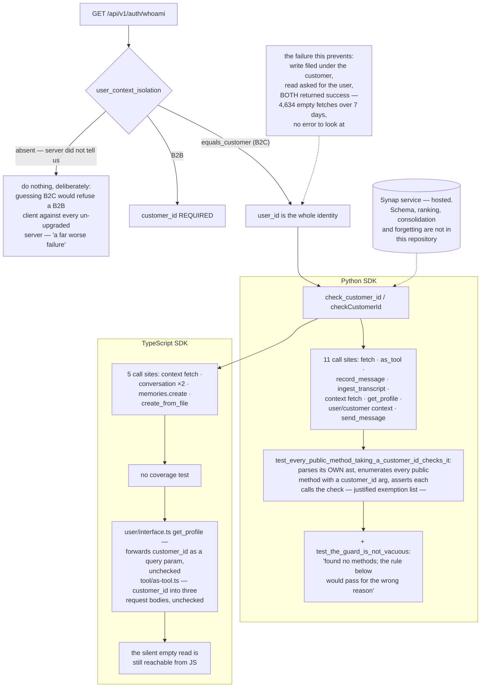

## 1. Executive Summary

This repository is the public client surface of Synap, a hosted memory service:
Python and TypeScript SDKs, MCP servers, connectors and framework integrations,
82,093 lines, Apache-2.0, synced out of a private monorepo by a script the
README names. The memory engine is not here. Nothing about how Synap stores,
ranks, consolidates or forgets can be checked from this tree.

What can be checked is the identifier contract, and it is worth the visit for
two reasons that pull in opposite directions.

The first is `scoping.py`, whose docstring is among the best short pieces of
engineering writing in this atlas. It states the rule — on a B2C instance send
`user_id` and nothing else; on B2B `customer_id` is required — notes that "[t]he
server is authoritative and rejects independently", and then explains why a
client-side check exists at all:

> "Before this, sending a customer_id on a B2C instance produced no exception
> anywhere: the write was filed under the customer, the read asked for the user,
> and both returned success. One client ran 4,634 consecutive empty fetches
> across seven days without a single error to look at. An SDK that stays silent
> about a misuse it can see is not being permissive, it is hiding the bug."

That is the scope-mismatch failure in its purest form: a write and a read using
different keys, each individually successful, for a week.

The guard's unknown case is equally well reasoned. `isolation` comes from
`/api/v1/auth/whoami`, and `None` "means the server did not tell us … and it must
mean 'do nothing'", because guessing B2C would refuse a B2B client's mandatory
field against every server not yet upgraded — "a far worse failure than the one
it prevents." A fail-open branch with its justification attached.

The second reason is what happens when that guard has to be applied at every
call site, which is where the two SDKs diverge.

Python does it structurally.
`test_every_public_method_taking_a_customer_id_checks_it` parses the package's
own source with `ast`, walks every class, collects every public method whose
signature includes `customer_id`, and asserts each one calls the check. It
carries an exemption list where each entry is justified in a comment —
`grpc_client.py` is "transport, forwards what it was given";
`anticipation_cache.py` is "cache key construction, never a caller's entry
point" — and, crucially, a companion assertion:

```
def test_the_guard_is_not_vacuous():
    assert _public_methods_taking_customer_id(), "found no methods; the rule below would pass for the wrong reason"
```

A coverage test that would pass on an empty set is not a coverage test. Almost
nobody writes that second assertion.

TypeScript ships the same `checkCustomerId`, wires it at five call sites, and
has no such test. And the surfaces it misses are the two nearest the original
incident. `user/interface.ts` takes `customer_id` or `customerId` from its
options and forwards it as a query parameter with no check; `tool/as-tool.ts` —
the path that hands an agent its memory tool — puts `customer_id` into three
request bodies and calls the guard nowhere in the file. Python guards both.

So the bug that cost 4,634 silent empty fetches is fixed in the SDK that has the
test proving it is fixed, and still reachable from the one that does not.

## 2. Mental Model

An **instance** is B2C or B2B, and `whoami` says which.

On **B2C**, `user_id` is the whole identity; a `customer_id` is a
misunderstanding that the server will silently honour on write and ignore on
read.

The **guard** turns that into an exception at the call site.

The **coverage test** is what makes the guard a property of the SDK rather than
a habit of whoever last added a method.



## 3. Architecture

| Area | Role |
| --- | --- |
| `packages/sdks/maximem-synap/` | The Python SDK, including `scoping.py` and a 3,700-line `sdk.py` |
| `packages/sdks/maximem-synap/tests/test_b2c_contract.py` | The contract, and the AST coverage test |
| `packages/sdks/maximem-synap-js/` | The TypeScript SDK |
| `packages/mcps/`, `packages/connectors/`, `packages/integrations/` | MCP servers, connectors, and a generated integration table |
| `skills/` | Packaged agent skills |

## 4. Essential Implementation Paths

`packages/sdks/maximem-synap/maximem_synap/scoping.py:1-18` — the docstring.
Read it whether or not you care about this product; it is a complete incident
report in fourteen lines.

Then `tests/test_b2c_contract.py:110-178` — the AST walk, the exemption list,
the non-vacuity control, and a failure message that names file, line and
consequence.

Then `packages/sdks/maximem-synap-js/src/user/interface.ts:9-27` for the gap.

## 5. Memory Data Model

Not defined here. The SDKs address memories, conversations, user contexts,
customer contexts and profiles as service resources; what a memory *is* on the
other side of the HTTP boundary is not in this repository, and neither is the
policy that decides what survives.

That is why this report carries no marks rather than a judgement on the
product. A client-side identifier check is not a stored scope key applied as a
read filter — the docstring says as much, deferring to the server — and the
contract tests assert that a guard raises, not that a store withholds a record
from retrieval.

## 6. Retrieval Mechanics

`fetch` on user, customer and conversation contexts, and an `as_tool` surface
that gives an agent a retrieval tool bound to a scope. Ranking, recency and
thresholds are the service's.

## 7. Write Mechanics

`memories.create`, `create_from_file`, `conversation.record_message` and
`ingest_transcript`. Two of these are named in a test —
`test_the_two_signatures_that_forced_the_wrong_shape_are_now_optional` — as
having previously *required* a `customer_id`, which on a B2C instance forced
every caller into the misuse the guard now rejects. A required argument that
makes the wrong shape mandatory is a good example of a contract bug that no
amount of caller discipline can fix, and pinning its removal in a test is the
right way to keep it removed.

## 8. Agent Integration

MCP servers and a generated table of framework integrations; the
`as_tool` path is how an agent gets a memory tool. That path being unguarded in
the TypeScript SDK matters more than the others, because it is the one where the
identifier is assembled once and then used by a model repeatedly without a human
in the loop to notice that results are always empty.

## 9. Reliability, Safety, and Trust

The trust content is the contract and its enforcement, and the honest summary is
that one language has it as a property and the other as a practice.

The asymmetry is worth naming precisely because nothing about the TypeScript
code is careless — it has the same guard function, a parallel test file covering
the same five behaviours of that function, and a transport method wrapping it.
What it lacks is the test that asks a different question: not "does the guard
work?" but "is the guard applied everywhere it needs to be?" Those are different
assertions, and only the second one scales past the day it was written.

## 10. Tests, Evals, and Benchmarks

`test_b2c_contract.py` covers the guard's behaviour in five modes — B2C refuses,
B2C correct shape passes, B2B never refused, unknown mode never refuses, the
error is a `ValueError` — then the SDK-level check, the `whoami` absent-field
case, the two call-site tests and the signature regression.
`b2c-contract.test.ts` covers the first five and stops.

The README links to published benchmark results on the vendor's blog. Those were
not read here, and nothing in this repository reproduces them.

## 11. For Your Own Build

Write the incident into the module. "One client ran 4,634 consecutive empty
fetches across seven days without a single error to look at" does more to keep a
guard alive through future refactors than any amount of "do not remove".

Assert coverage, not just behaviour. A test that parses your own source and
proves every entry point applies a rule is worth more than a hundred tests of
the rule itself, because the rule was never the thing that broke — the missing
call site was.

Then assert the coverage test is not vacuous. An enumeration that silently
returns an empty list turns a coverage assertion into a no-op, and the failure
looks exactly like success.

Fail open where you cannot know, and say why in the same place. The unknown
isolation mode does nothing, deliberately, because the alternative breaks
correct callers against older servers. That is a real trade and the code makes
it legible.

And if you ship the same contract in two languages, port the coverage test
first. It is the only part that finds the call site you forgot.

## 12. Open Questions

Whether the TypeScript gap is known. The Python exemption list shows the author
thought carefully about which files need the check; nothing in the TypeScript
tree records a decision either way about `get_profile` or `as-tool`.

What the server does with a `customer_id` on a B2C instance now. The docstring
describes the old behaviour — filed under the customer, invisible to the read —
and says the server "rejects independently"; whether that rejection is an error
or still a silent divergence is not observable from this repository.

Everything about the store. Schema, ranking, consolidation, forgetting,
provenance and deletion all live behind the API.

## Appendix: File Index

| Path | What to read it for |
| --- | --- |
| `packages/sdks/maximem-synap/maximem_synap/scoping.py` | An incident report as a module docstring, and a justified fail-open |
| `packages/sdks/maximem-synap/tests/test_b2c_contract.py:110-178` | Coverage proved by AST walk, with a non-vacuity control |
| `packages/sdks/maximem-synap-js/src/scoping.ts` | The same guard, without the same proof |
| `packages/sdks/maximem-synap-js/src/user/interface.ts` | `customer_id` forwarded as a query parameter, unchecked |
| `packages/sdks/maximem-synap-js/src/tool/as-tool.ts` | Three request bodies carrying `customer_id`, unchecked |

## History

**2026-09-16** — [`e0402c9c1fd4416cc76ee2efd3a95f412c85a509`](https://github.com/maximem-ai/maximem_synap_sdk/commit/e0402c9c1fd4416cc76ee2efd3a95f412c85a509) — first reading, at a commit dated 14 September 2026. The repository states it is generated and synced out of a private monorepo, so the service behind these clients was not inspectable. Screened before opening, from a shallow clone: eighty-seven files scanned, no auto-run surfaces, twenty-two build-time execution points, thirty-one unpinned surfaces and thirty-six dependency files inside the seven-day cooldown. Nothing was installed, built or run.
