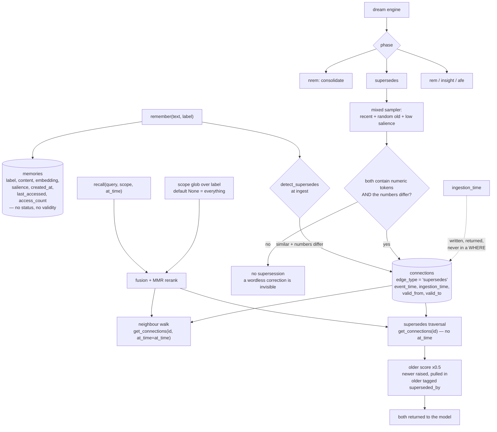

## 1. Executive Summary

Mazemaker calls itself an operating system for AI agents: a C++ core —
Hopfield associative recall, vector-symbolic algebra, an LSTM, kNN, SIMD
primitives — under a Python client, with a sleep-cycle consolidation engine and
a knowledge graph an agent walks rather than searches. It is dual-licensed
AGPL-3.0 or PolyForm Noncommercial 1.0.0, with commercial use outside either
requiring a separate licence; 17,511 lines of Python and 5,387 lines of C++ and
headers arrived across 15 commits since 9 April 2026, and the repository ships
a paper alongside the code.

Its README opens by dismissing the category it belongs to: "Most AI 'memory'
systems are retrieval wrappers. They store chunks. Embed text. Run cosine
similarity." The claim it makes for itself is memory *formation* — background
consolidation and conflict supersession — so that is what this report tests.

The consolidation engine is real and carefully built. Five named phases run
over a mixed sampler that deliberately reaches old and low-salience slices
rather than only recent ones, because "cross-session supersessions live in the
older slices". The supersedes phase is idempotent, and its docstring records a
fix worth copying: the previous implementation reached for a raw connection and
SQLite-style `?` placeholders, "which made the supersedes phase a silent no-op
under PG" — a phase that appeared to run and did nothing on one backend, now
routed through a backend-agnostic accessor.

The correction mechanism underneath it is narrower than the pitch. A pair is a
supersession candidate only when both memories contain at least one numeric,
dollar or quantity token *and* those tokens differ. "The deploy target moved
from staging to production" contains no number, so this phase will never notice
it. What it catches is a changed figure.

And a supersession does not change what a memory *is*. It writes a directed
edge from older to newer, and at recall time the traversal demotes the older
result's score by 0.5, raises the newer one to at least the older one's
pre-demotion score, pulls the newer one in if it was not already a hit, and
tags the older with `superseded_by`. The stale memory still reaches the model,
ranked lower and labelled. That is a defensible design — the label is present,
which is more than several systems here manage — but it is a ranking nudge, not
a filter, so no mark for a trust state.

The temporal story has the same shape. The `connections` table carries
`event_time`, `ingestion_time`, `valid_from` and `valid_to`, and
`get_connections(node_id, at_time=…)` gates `valid_from`/`valid_to` against a
requested instant. The `memories` table carries `created_at` and
`last_accessed` and nothing else — no validity, no status, no owner. So an
edge's validity is representable and a claim's is not. `ingestion_time` is
written, migrated, selected and returned in the row dictionary, and never
appears in a `WHERE` clause anywhere in the tree, so the knowledge-time column
exists without a knowledge-time read.

Within a single recall the two traversals disagree about time. The neighbour
walk calls `get_connections(mem_id, at_time=at_time)`; the supersedes traversal
forty lines later calls `get_connections(mid)` with no instant, so an expired
supersedes edge still demotes its source on a time-travelled query.

No marks.

## 2. Mental Model

A **memory** is a row: label, content, embedding, salience, timestamps. That is
the whole unit — there is no state on it to correct.

A **connection** is a typed, weighted edge — `similar`, `bridge`, `supersedes`
and others — and it is where the temporal columns live.

A **scope** is a string the caller passes to `recall`. `None`, `all` and `*`
return everything; `curated` and `auto` match named label prefixes; anything
else is an fnmatch glob over the label. It narrows a result set on request; it
is not a key the store enforces.

A **dream** is a run of phases: `nrem` consolidates, `supersedes` looks for
changed numbers, `rem` recombines, `insight` derives, `afe` runs the affective
pass.

## 3. Architecture

| Area | Role |
| --- | --- |
| `src/memory` | The C++ core: `hopfield.cpp`, `vsa.cpp`, `lstm.cpp`, `knn.cpp`, `consolidation.cpp`, `memory_manager.cpp` |
| `src/core`, `include`, `src/simd` | The C API, headers and SIMD primitives |
| `python/memory_client.py` | The store, the schema, `remember`, `recall`, ingest-time supersession and the traversals |
| `python/dream_engine.py` | The sleep phases, the samplers and the backend abstraction |
| `python/access_logger.py` | Every recall event recorded for LSTM training and co-occurrence analysis |
| `python/import_hindsight.py`, `import_honcho.py` | Importers from two other memory systems |
| `hermes-plugin`, `python/mcp_schemas.py` | Host integration |
| `benchmarks`, `paper` | Performance harnesses and the accompanying paper |

## 4. Essential Implementation Paths

- `python/memory_client.py:97-120` — the two tables, and the asymmetry between them.
- `:1118-1132` — `get_connections` and the only as-of filter in the tree.
- `:2504-2560` — supersession at ingest.
- `:3492-3506` — `_scope_matches`.
- `:3748-3760` — the neighbour walk, which passes `at_time`.
- `:3879-3925` — the supersedes traversal, which does not.
- `python/dream_engine.py:1666-1740` — the supersedes phase and its numeric rule.
- `:269-275` — the note about the phase that was a silent no-op under Postgres.

## 5. Memory Data Model

The `memories` row is deliberately thin: an id, a label, content, an embedding,
a salience, and access bookkeeping. Everything else Mazemaker knows lives on
edges or in the dream engine's own tables. That is a coherent choice for a
system whose thesis is that structure beats chunk retrieval, and it has a cost
the report should state plainly: there is no field on a claim that says whether
it is still believed, who it belongs to, or when it was true.

## 6. Retrieval Mechanics

Six modes, from `semantic` through `skynet` to the cost-reduced `lean` and
`trim`. A scope multiplies the fetch limit by four before filtering, on the
reasoning that a narrow scope over a corpus dominated by other labels would
otherwise return fewer than `k` hits — a good instinct, and one many
post-filter designs get wrong.

The supersedes traversal is the correction surface, and it rescores rather than
removes.

## 7. Write Mechanics

`remember` optionally runs conflict detection, auto-connection and supersedes
detection at ingest, each behind a default-true flag. Ingest-time supersession
scans only the most recent N nodes because "supersedes is temporally local";
the dream phase exists to catch what that misses, which is a sensible division
as long as the dream runs.

## 8. Agent Integration

A Python client, an MCP schema, a Hermes plugin and an embedding server, with
importers that read Hindsight and Honcho exports — an unusual courtesy, and a
sign the author expects people to arrive from another system.

## 9. Reliability, Safety, and Trust

**The correction rule is lexical.** Requiring differing numeric tokens makes
the supersedes pass cheap and precise, and it means the class of corrections it
detects is "a number changed". Preferences, decisions, ownership and
deploy targets — the things coding agents most often get stale — carry no
digits.

**Nothing filters.** A superseded memory is demoted and tagged, never withheld,
so a model that ignores rank order sees the old value beside the new one. The
tag makes that recoverable, which is why this is a design note rather than a
defect, but there is no read path that returns only current memory.

**The validity window is on the wrong table for the claim.** Edges carry four
time columns and an as-of read; memories carry two and none. And of those four,
`ingestion_time` is never filtered on, so the store records when it learned
something and cannot answer a question about it.

**The two traversals in one recall disagree.** One passes `at_time`, the other
does not. On a present-time query the difference is invisible; on a
time-travelled one it is not.

**Scope is advisory.** The default matches everything and the key is a free-text
label, so scope is a convenience for the caller rather than a boundary the store
holds. No `scope_enforced`.

## 10. Tests, Evals, and Benchmarks

Seven Python test files — `test_suite.py`, `test_integration.py`,
`test_skynet_features.py` and a `test_license.py` that checks the dual-licence
headers — plus a `benchmarks` directory and a committed paper. Nothing found
here asserts that a superseded or out-of-scope memory is absent from a recall,
which is what a `negative_eval` would need.

## 11. For Your Own Build

### Steal

- **Sample old and low-salience slices in a consolidation pass.** The comment
  is the argument: cross-session supersessions live in the parts of the corpus
  a recency-biased sampler never visits.
- **Record when a background phase was silently inert.** The docstring naming
  the Postgres no-op is more useful to a reader than a clean fix would have
  been, and it is the kind of note that stops the bug returning.
- **Widen the fetch before a post-filter.** Multiplying the limit by four when
  a scope is present is a small correction for a failure mode — a narrow scope
  returning almost nothing — that post-filtering designs hit constantly.
- **Ship importers from the systems people are leaving.** Hindsight and Honcho
  readers make the first hour cheap.

### Avoid

- **Tying a correction rule to a surface feature of the text.** If supersession
  requires a digit, the corrections that carry no digit are permanently
  invisible, and nothing in the system reports that gap.
- **Putting the validity window on the edge and not on the claim.** The
  question users ask is "what was true then", and that needs a column on the
  thing that carries the assertion.

### Fit

Reach for this if you want a local associative-memory engine with a real
consolidation cycle and are content to do belief and scope yourself. Look
elsewhere if you need current-only reads, per-user scoping, or corrections that
are not about numbers — and check the dual licence against your use.

## 12. Open Questions

- Is the numeric-token rule intended as the whole of supersession, or as the
  cheap first pass with a semantic one to follow?
- Should the supersedes traversal take `at_time` like the neighbour walk
  beside it?
- `ingestion_time` is stored on every edge and filtered nowhere. Is a
  knowledge-time read planned, or should the column go?

## Appendix: File Index

| Path | What to read it for |
| --- | --- |
| `python/memory_client.py` | The schema, recall, both traversals, ingest supersession |
| `python/dream_engine.py` | The five phases, the samplers, the backend seam |
| `python/access_logger.py` | What is recorded about every recall |
| `src/memory/` | Hopfield, VSA, LSTM, kNN, consolidation in C++ |
| `LICENSE`, `NOTICE` | The AGPL / PolyForm-NC choice and the commercial carve-out |
| `paper/` | The accompanying write-up |

## History

**2026-09-16** — [`25b4064114bb9bfc8a9d5fd45fec6bc9f353f126`](https://github.com/itsXactlY/mazemaker/commit/25b4064114bb9bfc8a9d5fd45fec6bc9f353f126) — first reading, at a commit dated 15 September 2026. Screened before opening, from a shallow clone: two files, no auto-run surfaces, no build-time execution points, one unpinned surface and one dependency file inside the cooldown. Nothing was installed, built or run.
