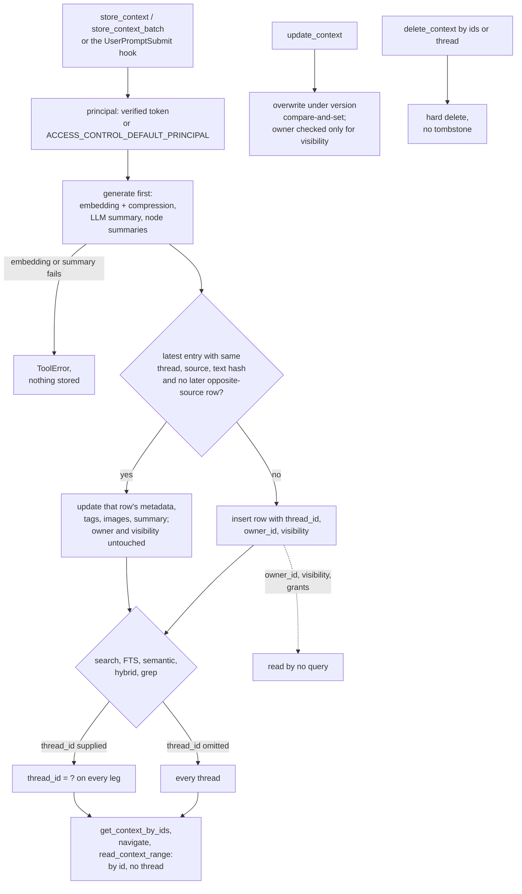

## 1. Executive Summary

MCP Context Server is a Python FastMCP server that stores *context entries* —
user prompts, agent reports, notes, images — under a `thread_id`, and exposes
sixteen tools to store, search, fetch, navigate, update and delete them. Storage
is SQLite or PostgreSQL. Each write generates an embedding, a TurboQuant
compressed copy of it and an LLM summary before the transaction opens, and
search offers filter listing, full-text, semantic and RRF hybrid modes with
cross-encoder reranking.

What is notable is the write-path discipline: generation happens first and
nothing is stored if an abort-mandatory leg fails, text updates are a
compare-and-set on a `version` column, and the deduplication update re-asserts
the content hash it observed. What is weak is the access model. Every row
carries a server-stamped `owner_id` and a `visibility` defaulting to
`private`, and no read consults either. The project says so in its own
environment reference.

That statement is precise: *"Read-path filtering by visibility is not enforced
yet: until it lands, all entries remain readable by any connected client"*
(`docs/environment-variables.md:54`). Update and delete check ownership only
when the call changes visibility. Under the `jwt` provider, which exists to
separate principals, any authenticated caller can read, overwrite and delete
another principal's private entry.

The licence changed with the v3 schema. The tree at the pin carries the Elastic
License 2.0, which bars offering the software to third parties as a hosted or
managed service. The project states that releases up to v2.2.2 were published
under MIT and remain available under it. `pyproject.toml` still reads
`version = "2.2.2"` while the README describes v3.x.x, so the pin sits between
the last tagged release and the relicensed one.

The public repository is a sync target. The pin and the four commits before it
are titled *"chore: sync from source"* followed by a short hash of a commit
that is not in this repository, authored by `sync-bot`. Development history
between syncs is not in this repository.

One mark, `negative_eval`, on a compressed-search case that plants a
near-identical vector in another thread and asserts it stays out beside a
same-thread positive control. Section 9 names the six withheld.

## 2. Mental Model

A memory is a context entry. It becomes one when a store tool commits: there
is no candidate state, no extraction and no model deciding what to keep. The
model is called only to describe the entry — a one-paragraph summary and,
optionally, a summary per Markdown heading — and those descriptions are
attached to the entry rather than stored as claims of their own.

**The entry's identity is a UUIDv7, and a retransmit is folded into it.** A
store whose `thread_id`, `source` and text hash match the latest entry of that
thread and source updates that entry's metadata, tags, images and summary
instead of inserting a second row. An opposite-source entry written after the
candidate suppresses the fold, so a user repeating the same sentence as a new
turn gets a new row (`app/repositories/context_repository.py:346-400`).

**Correction is overwrite.** `update_context` replaces text, metadata, tags or
images, regenerates embeddings and summary for new text, and bumps `version`
under a compare-and-set, so a slow update cannot overwrite a newer one
(`context_repository.py:1572-1573`). The replaced text is not kept. Deletion
removes the row, its tags, images, grants and embeddings; nothing records that
the value was rejected.

**Nothing ranks one entry as more believable than another.** `source` records
whether a user or an agent wrote the entry, and the shipped retrieval skill
tells agents that user messages are *"the primary source of truth"*
(`agents/common/skills/context-retrieval-protocol/SKILL.md:19`). That is an
instruction to the reader. No query weights or filters on it unless the
caller passes `source`.

**The model is told not to believe the summary.** Search returns a
300-character preview and the generated summary. The retrieval skill makes
reading the full entry through `get_context_by_ids` mandatory before drawing
any conclusion, because summaries *"MAY omit critical conditions, caveats, or
nuance"* (`SKILL.md:225`). The same step is the one read that cannot carry a
thread filter.

## 3. Architecture

`app/server.py` builds a FastMCP server, initialises one storage backend and
registers the tools (`app/server.py:346-379`, with the three search tools
registered later on availability at `:611`, `:635` and `:668`). Every tool is
subject to `DISABLED_TOOLS`, empty by default (`app/settings.py:97-103`), so an
operator can strip `delete_context` and `update_context` from the surface.

The backends are `app/backends/sqlite_backend.py` (WAL, a pool of readers and
one serialised writer queue) and `app/backends/postgresql_backend.py`
(asyncpg). Repositories under `app/repositories/` hold all SQL: context, tags,
images, embeddings, FTS, index nodes, grants and statistics.

The schema is four tables in the base scripts (`app/schemas/sqlite_schema.sql`)
and the rest from migrations run at startup: `context_entries_fts` (FTS5 with
insert, update and delete triggers), `vec_context_embeddings` (sqlite-vec
`vec0`) or its pgvector twin, `embedding_chunks`,
`vec_context_embeddings_compressed` with a singleton `compression_metadata`
provenance row, and `context_index_nodes`.

Generation is pluggable through LangChain: embeddings from Ollama (default
`qwen3-embedding:0.6b`, 1,024 dimensions), OpenAI, Azure, HuggingFace or Voyage
(`app/settings.py:364-372`); summaries from Ollama (default `qwen3:0.6b`),
OpenAI or Anthropic; reranking from FlashRank. TurboQuant compression is
vendored under `app/compression/providers/turboquant/` with its MIT notice, and
its compressed read path decodes candidates in Python rather than through an
ANN index.

### Deployment and ergonomics

The default is one process over stdio with a SQLite file and a local Ollama.
With no embedding provider reachable, the semantic and hybrid-over-vectors
tools skip registration and FTS still works; with no summary provider, entries
store without summaries. No API key is required to store anything. Docker
Compose files, a Helm chart and a Claude Code environment bootstrap live under
`deploy/` and `agents/`.

The store is SQL and inspectable by hand, but embeddings are bit-packed blobs
tied to one seed and model, recorded in the provenance row, so a model change
is a re-embedding migration run through `mcp-context-server-migrate`.

The Claude Code environment files download the hooks from
`raw.githubusercontent.com/alex-feel/mcp-context-server/main/…`
(`agents/claude-code/environment-docker-ollama.yaml:23-33`, `:92-110`), so a
hook installed on a given day runs whatever `main` held then rather than a
tagged release.

## 4. Essential Implementation Paths

**Store.** `store_context` (`app/tools/context.py:86-437`) validates input,
resolves the principal and the effective visibility, and applies the publish
gate (`:185-199`). It runs the dedup pre-check to skip generation for a likely
retransmit, calls `run_generation` (`app/tools/_shared.py:1034`) to produce
embeddings, summary and node summaries concurrently, then opens one
transaction and calls `execute_store_in_transaction` (`_shared.py:1842`). That
writes the row through `store_with_deduplication`
(`context_repository.py:273-577`), then tags, images, author-group grants
(`_shared.py:1991-1999`), embeddings and node rows. A connection error retries
twice; a dedup divergence regenerates the skipped legs and retries once.

**Search.** `search_context` (`app/tools/search.py:855-1042`) passes filters to
`ContextRepository.search_contexts`, whose filter builder appends
`AND thread_id = ?` when a thread is supplied (`context_repository.py:821-824`).
`semantic_search_context` embeds the query and calls
`EmbeddingRepository.search`, which dispatches to `search_compressed` when
compression is on (`embedding_repository.py:902-903`, `:1370`).
`hybrid_search_context` runs the FTS and semantic legs in parallel with the
same filters (`search.py:1993-2060`), fuses them with `reciprocal_rank_fusion`
(`app/fusion.py:16-19`), and reranks.

**Fetch and navigate.** `get_context_by_ids` (`context.py:442-563`) resolves
full ids or 8-to-31-character hex prefixes and reads `WHERE id IN (…)` through
`get_by_ids` (`context_repository.py:1320`). `navigate_context` and
`read_context_range` take one id (`app/tools/navigation.py:459-462`,
`:594-597`). `grep_context` takes an optional thread (`navigation.py:175-178`).

**Update.** `update_context` (`context.py:697-1028`) probes existence, source,
version and owner, checks ownership only when `visibility` is supplied
(`:833-844`), regenerates for new text, and writes under
`AND version = ?` (`context_repository.py:1572-1573`).

**Delete.** `delete_context` (`context.py:566-694`) takes ids or a thread, not
both. On SQLite it snapshots the ids and deletes embeddings and rows in one
transaction so no `vec0` vector is orphaned; on PostgreSQL it relies on
`ON DELETE CASCADE`.

**Hooks.** `thread_id_context.py` writes Claude Code's `session_id` to
`.context_server/.thread_id` and injects it on SessionStart and SubagentStart.
`user_prompt_context_saver.py` calls `store_context` for each user prompt not
matched by a skip pattern (`:664`). `subagent_context_protocol_injection.py`
injects the retrieve-first, store-before-stopping protocol. No hook searches.

## 5. Memory Data Model

| Table | Key fields | Notes |
| --- | --- | --- |
| `context_entries` | `id` (UUIDv7 hex), `thread_id`, `source`, `content_type`, `text_content`, `metadata` JSON, `summary`, `content_hash`, `version`, `owner_id`, `visibility`, `created_at`, `updated_at` | SQLite adds a private `rowid_int` for FTS5 (`sqlite_schema.sql:14-41`) |
| `tags` | `context_entry_id`, `tag` | unique per entry (`:59-72`) |
| `image_attachments` | blob, MIME type, position | cascade on delete (`:74-85`) |
| `context_entry_grants` | entry, principal type and id, `read` or `write`, `granted_by` | written on insert under `author_groups`, read by nothing (`:91-105`) |
| `embedding_chunks`, `vec_context_embeddings[_compressed]` | per-chunk offsets and vectors | chunk-level, aggregated to the entry on read |
| `context_index_nodes` | per-heading node summaries | regenerated on text change |

**Scoping has two keys and one of them is live.** `thread_id` is mandatory on
every write and indexed with `source`. `owner_id` is stamped from the verified
principal or `ACCESS_CONTROL_DEFAULT_PRINCIPAL` (default `local`) and is never
a tool parameter (`app/auth/access.py:21-37`). `visibility` is `private`,
`shared` or `public`, defaulting to `private` (`app/settings.py:225-265`). Both
columns are left out of `CONTEXT_ENTRY_COLUMNS`, so no tool returns them
(`context_repository.py:57`).

**Metadata is free-form with indexed conventions.** `status`, `agent_name`,
`task_name`, `project` and `report_type` get expression indexes by default, and
the instructions ask agents to link entries through
`metadata.references.context_ids`. A `status` value is data the caller may
filter on; nothing in the server interprets it.

**Temporal fields** are `created_at` and `updated_at`. There is no validity
time, no expiry and no revision table.

## 6. Retrieval Mechanics

All retrieval is tool-mediated. The server instructions route thread-local
loading to `search_context` and cross-thread discovery to
`hybrid_search_context`, and say to omit `thread_id` for the second
(`app/instructions.py:43`, `:54-55`).

**Semantic search** embeds the query, filters `context_entries` on every
supplied predicate to a candidate set, scores each compressed chunk with
TurboQuant's inner-product estimator or decoded L2, keeps the best chunk per
entry, and sorts by distance then id (`embedding_repository.py:1370-1420`).
Decoding moves to a worker thread above 2,048 chunk rows (`:46-55`). It is a
linear scan over the filtered candidates; the project's compression guide
plans ANN indexing for larger corpora.

**Hybrid search** over-fetches each leg at twice the limit
(`HYBRID_RRF_OVERFETCH`), fuses by RRF with `k = 60`
(`app/settings.py:1011-1025`), and reports a failed leg in `warnings` while
serving the other. Neither leg drops the thread filter, and no search retries
unscoped on an empty result.

**Every search returns a preview.** `text_content` is cut to
`SEARCH_TRUNCATION_LENGTH` (default 300) and the summary is attached, so the
agent triages on a summary written by a 0.6B model by default and then fetches
full text by id. The two-step design keeps a search cheap and makes the
by-id fetch the path that carries the substance.

**Failure modes.** A cross-thread search reaches every entry in the store,
every principal's included. A reference chain followed through
`get_context_by_ids` crosses threads without any filter. The dedup fold keys
on the latest same-source row only, so an identical note stored twice with
anything between them is two rows.

## 7. Write Mechanics

Writes are explicit tool calls, plus the prompt-saver hook when installed. No
model extracts or consolidates. The entry is stored as given, trimmed, with
lowercase tags.

**Generation blocks the write and can veto it.** The embedding-and-compression
leg and the flat summary are *abort-mandatory*: `run_generation` awaits both
and raises `ToolError` naming every failed leg, and the transaction never opens
(`_shared.py:1034-1066`). Node summaries never raise. A summary timeout is
derived from the retry settings (`_shared.py:692-756`). An Ollama outage
therefore stops stores entirely unless the operator disables the summary
provider.

**Deduplication is narrow and careful.** The in-transaction check reads the
latest row for the thread and source, compares hashes, suppresses the fold if
an opposite-source row followed, and updates with `AND content_hash IS ?`, so
a concurrent text change turns the update into an insert
(`context_repository.py:346-431`).

**Agent-generated content is stored like a user's**, distinguished only by the
`source` the caller declares. Nothing filters content, and the tool accepts
`source='user'` from an agent.

### Operational cost

- Write: synchronous. One embedding call per chunk, one summary call and one
  call per heading when node summaries are on, all before the transaction.
  Retrievable as soon as the call returns.
- Background: none. No pass re-reads the store; re-embedding and compression
  migrations are operator CLIs.
- Read: bounded by `limit` (at most 100) and the 300-character preview per
  hit. Nothing is injected automatically, so the prompt prefix is untouched
  until the agent calls a tool.

## 8. Agent Integration

The agent holds all sixteen tools unless `DISABLED_TOOLS` removes some,
including thread-wide delete and batch update. Server instructions are sent in
the MCP `instructions` field and can be replaced with
`MCP_SERVER_INSTRUCTIONS` (`app/instructions.py:76-90`).

The Claude Code bundle is the most opinionated part. The thread is the Claude
Code session, set by a hook and injected into every subagent. Subagents are
told to retrieve before working and to store a report before stopping. User
prompts are captured automatically. Four skills — metadata schema,
preservation, retrieval, issue tracking — define the conventions: which
metadata fields to set, which searches to run in which order, and that
substance comes only from full reads.

Adapting it to another MCP client needs only the server; the hooks are Claude
Code specific.

## 9. Reliability, Safety, and Trust

**Ownership is recorded and not enforced.** The principal resolution, the
publish-role gate and the owner-only visibility change are correct as far as
they go (`access.py:40-64`; `context.py:833-844`). The schema comment says
visibility *"governs who may read the row once read scoping enforces it"*
(`sqlite_schema.sql:34`), and a search of the repositories and read tools for
a predicate on either column finds none. Under `jwt` this is a multi-principal
server where every principal can list threads, read, rewrite and delete every
other principal's entries.

**Grants are write-only.** `store_group_read_grants` writes one read grant per
author group on insert when `ACCESS_CONTROL_DEFAULT_GROUP_GRANTS=author_groups`
(`_shared.py:1991-1999`). `GrantRepository.get_grants_for_context` has no
caller under `app/`, and no tool creates a grant.

**Concurrency is handled deliberately.** Version compare-and-set on update,
hash re-assertion on the dedup update, a refusal of ambiguous id prefixes
(`app/ids.py:183`), a single writer queue on SQLite, and one transaction for
the embedding and row delete.

**Prompt-injected memories** enter as ordinary entries. The capture hook stores
whatever the user typed that no skip pattern matches, and a store from an agent
may declare `source='user'`, which the retrieval skill then tells other agents
to treat as authoritative.

**Privacy and deletion.** Delete is hard and cascades to vectors on both
backends. What the vector engines do below that is outside this reading.

**Uncertainty is not representable** beyond free-form metadata.

Capability marks:

- `negative_eval` — awarded; section 10.
- `scope_enforced` — withheld. `thread_id` is on every row and every search
  applies it when supplied, and omission is a stated cross-thread mode. But
  `get_context_by_ids`, `navigate_context` and `read_context_range` read the
  same store by id and cannot carry a thread. The first is mandatory in the
  shipped retrieval protocol. The principal key, `owner_id`, reaches no read
  at all.
- `trust_state` — withheld. `source` is provenance the caller declares, and
  `metadata.status` is a filterable field with no meaning to the server. No
  read excludes an entry by default.
- `tombstone` — withheld. Delete removes the row; a deleted text can be stored
  again at once.
- `bitemporal` — withheld; `created_at` and `updated_at` only.
- `audit_log` — withheld. No table records mutations. `version` counts updates
  and keeps nothing.
- `human_review` — withheld. No state waits for anyone; the agent holds
  update and delete.

## 10. Tests, Evals, and Benchmarks

Nothing was installed, built or run for this report; everything below is from
reading the tests at the pin. The suite is 241 Python files with 4,105 test
functions. CI runs it on pull requests with all extras, Ollama and
`all-minilm`, and FTS, semantic and hybrid forced on
(`.github/workflows/test.yml`). It does not run on push to `main`, which is
where the sync commits land.

**The negative case.** `test_search_compressed_thread_filter`
(`tests/repositories/test_search_compressed.py:284-330`) seeds three entries in
thread `t-search`, then stores an entry in `other-thread` whose vector is the
query plus 0.05 Gaussian noise, so it would rank first without the filter. It
asserts the other-thread id is absent and `cid_a` present, and that at least
one filter was applied. The file carries no skip marker and the compressed path
is the default.

**A second, count-based.** `test_thread_filter_returns_correct_count`
(`tests/tools/test_semantic_search_filters.py:35-98`) stores two entries in one
thread and five in others, and asserts exactly two results, each from the
thread (`:96-98`). It skips when sqlite-vec or Ollama is missing, which CI
provides.

**Not covered.** No test asserts that one principal cannot read another's
private entry, which is consistent with a read path that does not try. No test
was found asserting that a deleted or overwritten text stops appearing in FTS
or semantic results; the delete tests read in this reading assert vector
cleanup. No retrieval-quality evaluation or benchmark result is committed.

**No paper describes the system.** `CITATION.cff` cites the software. The one
arXiv reference is the TurboQuant paper behind the vendored compressor,
[arXiv:2504.19874](https://arxiv.org/abs/2504.19874), submitted 28 April 2025,
cited in `docs/embedding-compression.md:480`; its distortion and unbiasedness
bounds have their own tests under `tests/compression/turboquant/`.

## 11. For Your Own Build

### Steal

- **Generate before the transaction, and make the expensive legs
  abort-mandatory.** A failed embedding should store nothing rather than store
  a row that semantic search will never find.
- **Re-assert the dedup decision in the update's predicate.** Matching on the
  hash the pre-check observed turns a lost race into an insert instead of a
  summary describing different text.
- **Suppress deduplication across a turn boundary.** An identical message
  after an intervening reply is a new turn, not a retry.
- **Plant the near-duplicate in the other scope.** A scope test whose foreign
  row sits next to the query in vector space fails when the filter is dropped,
  and a count assertion beside it catches a filter applied after the limit,
  the bug `test_thread_filter_returns_correct_count` was written for.
- **Write the unfinished part into the operator documentation.** One sentence
  saying reads are not access-controlled is worth more than the columns.

### Avoid

- **Stamping an owner the reads never consult.** A `private` default that does
  nothing on read is worse than no column: it reads as a guarantee in the
  schema, the settings and the tool descriptions.
- **Checking ownership on one mutation.** Guarding the visibility change while
  text update and delete stay open protects the label and not the content.
- **A mandatory by-id step with no scope argument.** If every search result
  must be fetched in full to be used, the fetch is the read path that needs
  the predicate.
- **Installing agent hooks from a branch head.** Pin the hook source to a
  release.

### Fit

This suits one developer, or one trusted team on one server, running Claude
Code with many subagents that hand work to each other within a session and
search past sessions by project metadata. It assumes a local Ollama or a paid
embedding and summary provider on every write, and it pays for that with fast,
well-filtered search. Anyone who needs to host it for others, or to separate
principals on one instance, should walk away: the licence forbids the first
and the read path does not implement the second.

## 12. Open Questions

- When read-path visibility filtering lands, will it cover
  `get_context_by_ids`, the navigation tools, `list_threads` and
  `get_statistics`, or only the search tools?
- What does the source repository behind the sync commits hold that the public
  one does not — tests, CI on `main`, or history?
- How long does a store take on the default local models for a typical agent
  report with node summaries on?
- Is the dedup fold ever surprising in practice, given it keys on the latest
  same-source row only?

## Appendix: File Index

- **Schema and storage:** `app/schemas/sqlite_schema.sql`,
  `app/schemas/postgresql_schema.sql`, `app/migrations/`,
  `app/backends/sqlite_backend.py`, `app/backends/postgresql_backend.py`.
- **Write path:** `app/tools/context.py`, `app/tools/batch.py`,
  `app/tools/_shared.py`, `app/repositories/context_repository.py`,
  `app/summary/instructions.py`.
- **Retrieval:** `app/tools/search.py`, `app/tools/navigation.py`,
  `app/repositories/embedding_repository.py`,
  `app/repositories/fts_repository.py`, `app/fusion.py`,
  `app/reranking/providers/flashrank.py`.
- **Access control:** `app/auth/access.py`, `app/auth/principal.py`,
  `app/repositories/grant_repository.py`, `app/settings.py:225-265`,
  `docs/environment-variables.md:54`.
- **Integration:** `app/server.py`, `app/instructions.py`,
  `agents/claude-code/hooks/`, `agents/common/skills/`.
- **Tests:** `tests/repositories/test_search_compressed.py`,
  `tests/tools/test_semantic_search_filters.py`,
  `tests/tools/test_deduplication.py`,
  `tests/tools/test_update_concurrency_version_guard.py`,
  `.github/workflows/test.yml`.

### Recorded searches

Checked against the checkout at the pinned revision, from the tree root.

- `grep -rnE 'owner_id|visibility' app/repositories app/backends app/query_builder.py app/services app/tools/search.py app/tools/navigation.py app/tools/discovery.py | grep -iE 'where|and '` — two docstring lines; no read predicate on either column.
- `grep -rnE 'get_grants_for_context' app` — the definition only; no caller.
- `grep -rn 'get_grants_for_context\|store_group_read_grants\|grants\.' app --include='*.py'` — one writer call, `_shared.py:1995`.
- `grep -rniE 'audit|tombstone|superseded|valid_from|valid_to' app --include='*.py' --include='*.sql'` — one comment in `app/cli/migrate.py`; no audit table, tombstone or validity field.
- `grep -n 'CREATE TABLE\|CREATE VIRTUAL TABLE' -r app` — the tables listed in sections 3 and 5.
- `grep -n -i 'fallback\|fall back\|widen\|retry' app/tools/search.py` — reranking and legacy-boundary fallbacks and an FTS migration retry message; no unscoped retry.
- `grep -rn "call_tool(" agents` — three `store_context` calls in the prompt-saver hook; no hook searches.
- `grep -rnE "assert .* not in (ids|result_ids|returned_ids|found|texts|contents)" tests` — the compressed-search case and a write-queue rollback case.
- `grep -rliE 'arxiv|bibtex|@article|@misc|doi\.org' . --exclude-dir=.git` — TurboQuant sources, tests and docs; `CITATION.cff` is `type: software`.
- `grep -rn -i 'renamed\|formerly' --exclude-dir=.git .` — two test-file hits; no rename of the project.
- `grep -rn -i 'read scoping\|not enforced' --exclude-dir=.git .` — the schema comments, `docs/environment-variables.md:54` and `CLAUDE.md:79`.

## History

**2026-09-30** — [`ed6a24d8f40805fce43f019c1f6393bd515b93dc`](https://github.com/alex-feel/mcp-context-server/commit/ed6a24d8f40805fce43f019c1f6393bd515b93dc) — first reading, at the head of `main`, a sync commit dated 30 September 2026. One mark, `negative_eval`. Screened before reading: one auto-run surface (`server.json`, an MCP registry manifest naming the PyPI package), four build-time execution points (`conftest.py` files), no unpinned surface, and two dependency files inside the cooldown — every file in a depth-1 clone dates to the tip. `CLAUDE.md` was treated as data. Read with `grep` and `sed`; nothing installed, built or run.
