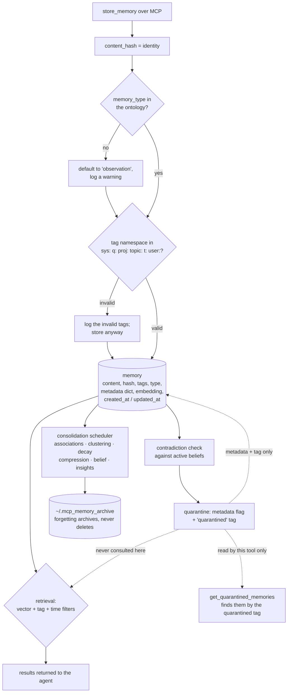

## 1. Executive Summary

MCP Memory Service has 3,337 commits from eighty-seven authors since 26
December 2024 and was still committing on the day of this reading. Its
consolidation package is unusually decomposed: separate modules for
associations, clustering, compression, decay, forgetting, insights, belief
derivation, contradiction detection and relationship inference, with a run
tracker and a scheduler over them.

Apache-2.0 at the repository root; 71,120 lines under `src/` beside 68,820
lines of tests holding 3,067 functions; storage over SQLite-vec, Cloudflare,
Milvus or a hybrid; twenty-eight MCP tools plus a REST API, a web surface with
OAuth, a CLI, ingestion, sync and backup. The screen found four auto-run
surfaces, seven build-time execution paths, eight unpinned dependency surfaces,
two manifests inside the seven-day cooldown, and an uninstalled `pre-commit`
hook payload; nothing was installed or run.

**Two layers, two different answers, and the gap between them is the report.**
The belief layer gets this right: beliefs live in their own table with a
`candidate` → `active` → `superseded` status, promotion requires both a
confidence floor and a provenance floor, demotion happens when confidence falls
back, and `get_beliefs` filters `WHERE status = ? AND confidence >= ?` with
`active` as the default — a state that excludes rather than reorders. That earns
`trust_state`.

**The memory layer has the same idea and does not finish it.**
The system does the hard part: `consolidation/belief.py` derives active beliefs,
`consolidation/contradictions.py` detects a new memory that disagrees with one,
and `consolidation/quarantine.py` quarantines it —

```python
quarantine_meta = {
    "quarantined": True,
    "quarantined_at": datetime.now(timezone.utc).isoformat(),
    "contradicted_belief": contradicted_belief_hash,
    "quarantine_reason": reason,
}
await storage.update_memory_metadata(
    content_hash=content_hash,
    updates={"metadata": quarantine_meta, "tags": ["quarantined"]},
```

The producer is real: the write handler reports the outcome to the caller as
*"⚠️ Memory quarantined: contradicts an active belief."* Two MCP tools front it —
`get_quarantined_memories` to review and `unquarantine_memory` to release, the
latter documented for *"when a quarantined memory is valid (e.g., the
contradicted belief was wrong)."*

**And no retrieval path reads the flag.** A search of `storage/` and `services/`
for `quarantin` returns nothing. `get_quarantined_memories` finds them by
calling `search_by_tag(["quarantined"])` — the same generic tag search any
caller uses — and filters in Python afterwards. So a memory the system has
identified as contradicting an active belief, flagged, and offered a release
tool for, is still returned by ordinary semantic search. The state exists, it is
produced, it is inspectable, and it withholds nothing. The mark is earned on the
belief table and not on the memory row, which is a distinction worth carrying:
the same codebase demonstrates it knows how to make a status filter, one module
away from the place it does not.

**Everything epistemic lives in an untyped dict.** Quarantine status, the
contradicted belief's hash, the quarantine reason and the timestamp are all
keys in `Memory.metadata`, a `Dict[str, Any]`. Nothing at the storage layer can
index them, no backend can enforce them, and a filter that wanted to exclude
quarantined memories would have to parse JSON per row — which may be why no
filter exists.

**No scope is enforced.** `TagTaxonomy` defines six namespaces including `proj:`
and `user:`, and validates them at write by *logging* the tags that do not
match — legacy unnamespaced tags are explicitly still supported. Nothing on the
read path filters on a namespace. For a server several agents may point at, the
separation between one project's memories and another's is a tag the caller must
remember to include.

**What it does earn.** `tests/test_time_filter_vector_search.py` is a properly
built negative case: it stores an old PostgreSQL memory and a recent Redis one,
searches with an `after` bound one day back, and asserts `total >= 1`, then that Redis is
present, then that PostgreSQL is absent — the non-empty check and the control
both before the absence, so the case cannot pass over an empty result.

## 2. Mental Model

A memory is content plus a hash of that content. The hash is the identity, so
storing the same text twice is the same memory. Around it sit tags, an optional
type drawn from an ontology, timestamps, and a metadata dict that ends up
carrying everything the schema does not.

Writing is cheap and mostly unguarded: hash, validate the type against the
ontology and fall back to `observation` with a warning if it does not match,
check tag namespaces and log the ones that do not, store. Then, separately, a
contradiction check may run and mark the new memory as quarantined.

The consolidation scheduler is where the design's ambition lives. On its own
clock it clusters memories, derives associations, infers relationships, computes
decay, compresses what is redundant, derives beliefs from what recurs, and
forgets by archiving to a dated tree on disk rather than deleting. Each of those
is a module with its own file, and a run tracker records what happened.

The gap between those two halves is the report's finding. Consolidation reaches
conclusions — this memory contradicts an active belief — and records them where
retrieval cannot see them. The knowledge is derived and then set down beside the
door rather than in front of it.



## 3. Architecture

A Python package of about two dozen subsystems: `api`, `backup`, `bootstrap`,
`cli`, `config`, `consolidation`, `discovery`, `embeddings`, `extraction`,
`harvest`, `health`, `ingestion`, `models`, `plugins`, `quality`, `reasoning`,
`scoring`, `server`, `services`, `storage`, `sync`, `tools`, `utils`, `web`.

Storage is pluggable and genuinely so: `sqlite_vec.py`, `cloudflare.py`,
`milvus.py` with its own expression and graph helpers, and `hybrid.py` that
combines backends, all behind `base.py` with a migration runner and shared
mixins. A separate `graph.py` backs relationship inference.

The delivery surface is broad — MCP, REST, a web UI with OAuth, a CLI, a
discovery mechanism for agent harnesses, ingestion and harvest paths, a sync
package for multi-device use, and backup. Eighty-seven contributors over
twenty-one months shows in the breadth: this is a project that has said yes to a
lot of integration requests, and the memory model has stayed simple while the
surface grew.

One inconsistency worth recording because a reader may rely on it:
`src/mcp_memory_service/storage/base.py` carries the header *"Licensed under the
MIT License. See LICENSE file in the project root"* while the root `LICENSE` is
Apache-2.0. Both are permissive and the practical difference is small, but the
file points at a licence the project root does not contain.

## 4. Essential Implementation Paths

- **Write.** `store_memory` → `Memory.__post_init__` synchronises the timestamp
  representations, validates `memory_type` against `MemoryTypeOntology` and
  defaults to `observation` on a miss, then checks tag namespaces against
  `TagTaxonomy.VALID_NAMESPACES` and logs the invalid ones
  (`models/memory.py:70-101`) → backend write.
- **Quarantine.** `consolidation/quarantine.py:14-33` writes
  `{"quarantined": True, "quarantined_at", "contradicted_belief",
  "quarantine_reason"}` into the metadata and adds the `quarantined` tag via
  `update_memory_metadata`; `:67` is the internal call site, and
  `server/handlers/memory.py:271-273` surfaces the outcome on the write
  response.
- **Review and release.** `get_quarantined_memories`
  (`consolidation/quarantine.py:98-115`) calls `storage.search_by_tag(
  ["quarantined"])` and filters on the metadata key in Python;
  `unquarantine_memory` (`:34`) clears both. Both are MCP tools
  (`tools/registry.py:1110`, `:1125`).
- **Retrieve.** the storage backend's semantic search with tag and time filters
  — and no quarantine predicate anywhere in `storage/` or `services/`.
- **Consolidate.** `consolidation/scheduler.py` drives `consolidator.py` over
  `associations`, `clustering`, `compression`, `decay`, `forgetting`,
  `insights`, `belief_service`, `contradictions` and `relationship_inference`,
  with `run_tracker.py` recording the pass and `health.py` reporting on it.
- **Forget.** `consolidation/forgetting.py:51-70` — *"Rather than deleting
  memories, this system compresses and archives"* — into
  `~/.mcp_memory_archive` with daily subdirectories, recording an
  `action_taken` of `archived`, `compressed`, `deleted` or `skipped`.

## 5. Memory Data Model

`Memory` is a dataclass with six substantive fields and four timestamp fields.
`content` and `content_hash`; `tags`; an optional `memory_type`; a
`Dict[str, Any]` of metadata; an optional embedding. Timestamps are stored twice
over — as a float and as an ISO string, for both `created_at` and `updated_at` —
with a legacy `timestamp` kept for compatibility and synchronised in
`__post_init__`.

**The type ontology is the one place the model is strict, and it is strict
gently.** An unrecognised `memory_type` produces a warning naming the first five
valid types and is replaced by `observation` rather than rejected. A recognised
one is canonicalised, with a comment explaining why: *"Store the canonical form
so `Decision` and `decision` are one type on disk and type filters match either
spelling (#176)."* That is a real fix to a real class of bug.

**The tag taxonomy is a convention.** Six namespaces — `sys:`, `q:`, `proj:`,
`topic:`, `t:`, `user:` — validated at write by logging what does not match,
with the message stating that *"Legacy tags (no namespace) are still
supported."* Nothing rejects an invalid namespace and nothing on the read path
distinguishes one.

**Everything else lives in `metadata`.** Quarantine status and its four
associated fields, archival state, belief membership. There is no status column,
no scope column, no validity interval — a search of the model for `valid_from`,
`valid_to`, `valid_time` and `as_of` returns nothing, so `bitemporal` is
withheld. The consequence is structural rather than stylistic: an attribute in
an untyped JSON blob cannot be indexed by SQLite-vec, expressed in a Milvus
filter expression, or enforced by any of the four backends.

## 6. Retrieval Mechanics

Semantic search over whichever backend is configured, with tag filtering
(`search_by_tag`) and time filtering (an `after` bound, and the test suggests a before as well). A `scoring` package and a `reasoning` layer sit above,
and `quality` holds quality checks.

The filters that exist work and are tested. `test_time_filter_vector_search.py`
demonstrates the time filter excluding an out-of-window memory while keeping the
in-window one, and does so with the assertions in the right order.

The filter that does not exist is the quarantine. To be precise about the
search, because this is the report's central claim: `rg -n 'quarantin'
src/mcp_memory_service/storage src/mcp_memory_service/services` returns nothing.
The only readers of the flag are the listing tool and the release tool. An
agent calling `retrieve_memory` after a contradiction has been detected and
quarantined will receive the quarantined memory as an ordinary result, with no
marker on it beyond a `quarantined` tag in its tag list — which the agent would
have to notice and interpret.

There is also no scope predicate. A `proj:` tag narrows a search only if the
caller passes it to `search_by_tag`; nothing in the server applies one.

## 7. Write Mechanics

Writes are synchronous and local to the configured backend, with no model call
on the path unless embedding generation requires one. The identity is the
content hash, so re-storing identical text is idempotent by construction.

Validation is advisory in both places it happens. An unrecognised memory type
becomes `observation` with a log line. An unrecognised tag namespace produces a
log line and the tag is stored as written. Neither rejects the write. That is a
defensible choice for a server eighty-seven people contribute to and many
harnesses call — a strict validator would break callers — and it does mean the
ontology and the taxonomy describe intent rather than enforce it.

The contradiction check runs after the write rather than gating it, which is why
the quarantine is a post-hoc mark rather than a refusal. `CONTRADICTION_THRESHOLD`
defaults to three and is read from `MCP_QUARANTINE_CONTRADICTION_THRESHOLD`, so
an operator can tune how many contradictions it takes.

## 8. Agent Integration

Twenty-eight MCP tools, a REST API, a web dashboard with OAuth, a CLI, and a
discovery mechanism so an agent harness can find a running instance. Ingestion
and harvest paths pull documents in; a sync package handles multiple devices;
backup and health round it out.

The two quarantine tools are the ones this report turns on.
`get_quarantined_memories` is described as *"List memories that have been
quarantined due to contradicting active beliefs. Use to review flagged
memories."* `unquarantine_memory` is *"Release a memory from quarantine. Use when
a quarantined memory is valid (e.g., the contradicted belief was wrong)."*

That is a review loop, and it is why `human_review` is a near miss rather than
an absence. What withholds the mark is that both are MCP tools an agent calls as
readily as a person — there is no operator-only surface, no queue a person is
asked to work, and nothing that requires a human decision before a memory
becomes retrievable. Since the memory is retrievable throughout, there is
nothing for a review to gate.

## 9. Reliability, Safety, and Trust

**Negative evaluation — awarded.** The time-filter case asserts a non-empty
result, then a present control, then the absence, over a real
`search_memories` call against a real backend. The semantic-search case pairs a
present and an absent term on the top hit.

**Trust state — awarded, on the belief table.** `beliefs.status` is
`candidate`, `active` or `superseded`, stored in a typed column, moved by rules
that require a confidence floor *and* a provenance floor to promote and a fall
below the floor to demote, and filtered in SQL with `active` as the default. The
confidence rides alongside as an ordering and a floor. That is the mark exactly.

**And the same idea is unfinished one module away.** The memory row has a
discrete condition — `quarantined` — that is stored, produced on a real path by
the contradiction detector, carries the contradicted belief's hash and a reason,
and has a tool to clear it. It is not consulted by retrieval. The rubric draws
the line at usage, and here nothing filters. The distance is one predicate, and
the reason it is hard is the next paragraph. A reader should take the mark as
describing the belief layer and read the memory layer as the counterexample
sitting beside it.

**The metadata dict is why.** Quarantine state lives in `Memory.metadata`, a
`Dict[str, Any]` serialised into whichever backend is configured. SQLite-vec,
Cloudflare and Milvus each store it differently, and a filter would have to be
written three times against three different expression languages. A typed column
would have made the predicate trivial and portable; the dict made it a project.

**Tombstone — withheld.** Forgetting archives rather than deletes, which is
careful, and archival is explicitly not this mark. The archive lives outside the
store under `~/.mcp_memory_archive`, and nothing consults it on a later write —
so re-storing an archived memory's text produces a live memory again, and the
archive is a backup rather than a record of rejection. Quarantine is closer in
spirit but is keyed on the memory, not the value, and expires the moment
`unquarantine_memory` is called.

**Scope — withheld.** Six tag namespaces, none applied as a read-path predicate.
A `proj:` tag is a convention a caller may filter on.

**Audit log — withheld.** `run_tracker.py` records consolidation *runs*, which
is an operational record of scheduled passes rather than of memory mutations.
The files matching `audit` are the OAuth module's, not the memory's.

**Bitemporal — withheld.** Two timestamps in two representations, both record
time.

**Human review — withheld**, for the reason in section 8.

## 10. Tests, Evals, and Benchmarks

3,067 test functions across 68,820 lines — close to parity with the 71,120 lines
of source, which for a project with this many contributors is a good sign.

The suite is broad rather than deep on any one mechanism: backend behaviour,
cascading fallback, external embeddings, response limiting, partial results,
semantic search, time filtering, OAuth, sync. `tests/integration/` carries its
own `package-lock.json`, so some of the integration surface is exercised through
a JavaScript client.

The two cases that earn the mark are described above. It is worth noting what
the suite does *not* contain: no test asserts that a quarantined memory is
absent from a retrieval result, which is consistent — there is no behaviour to
assert. A test written for that today would fail, and would be the cheapest
possible statement of the gap.

**Benchmark harnesses are committed; results are not.** `scripts/benchmarks/`
holds `benchmark_locomo.py` and `benchmark_longmemeval.py` beside seven others —
filter performance, hybrid sync, memory usage, server caching, NER domain, code
execution and devbench — and `tests/benchmarks/` carries four LoCoMo files
covering the dataset loader, the evaluator, the LLM arm and the benchmark
itself. `docs/research/locomo-benchmark-analysis.md` is a careful reading of the
LoCoMo paper. What is not in the tree is a score: no result file for LoCoMo or
LongMemEval is committed, and the README makes no accuracy claim. That is the
honest shape — the apparatus to measure, and no number asserted without it.

No paper of its own. The arXiv links under `docs/research/` are citations to
LoCoMo and to a multi-agent reasoning paper, not to work by this project.

## 11. For Your Own Build

### Steal

- **Canonicalise the type at write so filters match either spelling.** Storing
  `Decision` and `decision` as one value on disk removes a whole class of
  silently-empty filter, and the comment naming the issue number is how that
  fix survives.
- **Archive rather than delete when you forget.** A dated archive tree with an
  `action_taken` of archived, compressed, deleted or skipped makes a forgetting
  pass reviewable instead of terrifying.
- **Split consolidation into modules that name their concerns.** Associations,
  clustering, compression, decay, belief, contradiction, insight and
  relationship inference as separate files with a run tracker is a legible
  design for the most opaque part of any memory system.
- **Order a negative assertion behind a non-empty check and a present
  control.** The time-filter test does all three in five lines.

### Avoid

- **Detecting a contradiction and not acting on it at read time.** The
  expensive half — deriving beliefs, comparing, deciding — is built here. The
  cheap half, one predicate that excludes a quarantined memory from search, is
  missing, so the work produces a label rather than a behaviour.
- **Putting epistemic state in an untyped metadata dict.** It reads well and it
  cannot be indexed, filtered in a backend expression language, or enforced.
  Anything a read path must consult belongs in a column.
- **Validating by logging.** An unrecognised tag namespace and an unrecognised
  memory type both produce a log line and a stored row. Over eighty-seven
  contributors and two years, a taxonomy enforced only in the logs becomes a
  taxonomy in name.

### Fit

This suits someone who wants a widely-used, actively-maintained MCP memory
server with a real choice of backends and an unusually thorough scheduled
consolidation, and who is storing one person's or one project's memories so the
absence of a scope key costs nothing. The breadth of integration is the reason
to pick it: it will connect to what you already run. It is the wrong choice
where a contradiction must actually suppress a memory rather than flag it, where
several projects or users share one instance, or where an attribute has to be
enforceable at the storage layer — and a team that needs the first of those
should know the belief and contradiction machinery is already written, and that
what is missing is a filter rather than a feature.

## 12. Open Questions

- Should retrieval exclude quarantined memories by default? The tool
  descriptions imply a reviewer will act before the memory is used again, and
  nothing enforces that ordering.
- Would a `quarantined` column pay for itself across four backends? The
  migration runner exists; the cost is the three expression languages.
- Should the memory row's quarantine flag become a column the way
  `beliefs.status` already is? The belief table proves the pattern works here;
  the memory row is the one that skipped it.
- Is the MIT header in `storage/base.py` intentional, or a leftover from before
  the repository settled on Apache-2.0?

## Appendix: File Index

| Path | Lines | What it holds |
| --- | --- | --- |
| `src/` | 71,120 | Two dozen subsystems; `models`, `storage`, `consolidation`, `server`, `tools`, `web` are the load-bearing ones |
| `src/mcp_memory_service/models/memory.py` | — | The `Memory` dataclass, timestamp synchronisation, ontology validation and canonicalisation (70-101) |
| `src/mcp_memory_service/models/tag_taxonomy.py` | — | `VALID_NAMESPACES` (61) and the parser |
| `src/mcp_memory_service/storage/` | — | `base.py` (with the MIT header), `sqlite_vec.py`, `cloudflare.py`, `milvus.py`, `hybrid.py`, `graph.py`, the migration runner |
| `src/mcp_memory_service/consolidation/quarantine.py` | — | `quarantine_memory` (14-33), `unquarantine_memory` (34), `get_quarantined_memories` (98-115), the threshold constant (12) |
| `src/mcp_memory_service/consolidation/` | — | `belief.py`, `belief_service.py`, `contradictions.py`, `associations.py`, `clustering.py`, `compression.py`, `decay.py`, `forgetting.py`, `insights.py`, `relationship_inference.py`, `run_tracker.py`, `scheduler.py`, `health.py` |
| `src/mcp_memory_service/tools/registry.py` | — | Twenty-eight tools; the quarantine pair at 1110 and 1125 |
| `src/mcp_memory_service/server/handlers/memory.py` | — | The write handler and the quarantine notice (271-273) |
| `tests/` | 68,820 | 3,067 test functions; `test_time_filter_vector_search.py` and `test_semantic_search.py` carry the negative cases |

Searches behind the absence claims above, run from the repository root:

```sh
rg -n 'quarantin' src/mcp_memory_service/storage src/mcp_memory_service/services  # none: no retrieval path reads the flag
rg -n 'proj:|user:' src/mcp_memory_service/storage src/mcp_memory_service/services # none: the tag namespaces are not read-path predicates
rg -n 'valid_from|valid_to|valid_time|as_of' src/mcp_memory_service/models/memory.py  # none: two timestamps, both record time
rg -l 'audit' src/mcp_memory_service                                    # the OAuth module only; run_tracker records passes, not mutations
rg -n -i 'arxiv|bibtex|@article|@misc|Citation|CITATION.cff|doi' README.md docs   # citations to LoCoMo and others; no paper of its own
ls scripts/benchmarks tests/benchmarks                                  # LoCoMo and LongMemEval harnesses committed; no result file for either
rg -n 'not in' tests --glob '*.py' | rg -i 'result|memories'            # the two paired cases; nothing asserts a quarantined memory absent
```

## History

**2026-09-10** — [`63801ca5e3f2f02f392c34d395fc62adc9049796`](https://github.com/doobidoo/mcp-memory-service/commit/63801ca5e3f2f02f392c34d395fc62adc9049796) — first reading, at the head of `main`, the last commit of 10 September 2026. Screened before reading: four auto-run surfaces, seven build-time execution paths, eight unpinned dependency surfaces, two manifests inside the seven-day cooldown, and an uninstalled `pre-commit` hook payload noted as inert until something copies it; nothing was installed or run, and the read was made from a full clone. One mark. The reading covered the memory model, the four storage backends, the write and retrieval paths, and the consolidation package with its belief, contradiction and quarantine modules; the web, OAuth, sync, ingestion and harvest surfaces were read as context rather than as subject.
