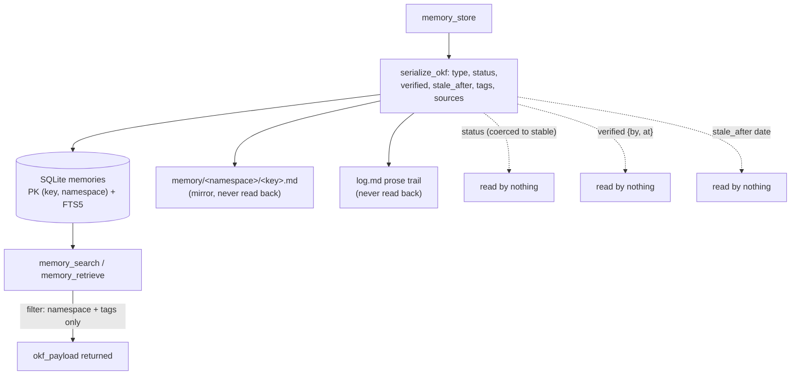

## 1. Executive Summary

MCP-Memory is a small MIT-licensed MCP server — about 1,620 lines of Python
across five files, with only `fastmcp` and `pyyaml` beyond the standard library —
that gives an agent (Claude Desktop, Cursor, Codex, and the like) a persistent
key-value memory. Its distinguishing choice is the record format: every memory is
an **Open Knowledge Format (OKF v0.2)** document — markdown with YAML frontmatter
— stored in a per-project SQLite database with an FTS5 full-text index and
mirrored to a `.md` file on disk for a human to read. As a piece of plumbing it is
clean, self-contained and does what an MCP memory server should: store, search,
retrieve and delete stateful snippets that survive across sessions, scoped by
namespace.

The reason it earns a report rather than a line is the gap between the format's
promise and the code's use of it, because that gap is a pattern the atlas keeps
finding. OKF's frontmatter is a *trust and lifecycle* vocabulary: a `status`
(`draft`/`stable`/`deprecated`), a `verified` list of who-checked-this-and-when
events, a `stale_after` date past which a record is meant to be considered stale.
MCP-Memory serializes all of it faithfully (`okf_engine.py:52-109`) and **reads
none of it**. The search and retrieve paths consume only `key`, `namespace`,
`tags` and the raw payload (`db.py:329-346`); there is no `WHERE status = …`, no
`today >= stale_after` comparison, no weighting by `verified`. A memory marked
`deprecated`, or one a month past its `stale_after`, is returned exactly like a
fresh verified one. The trust model is written and never read.

Two smaller instances of the same shape sit beside it. The README says the server
adheres *"strictly to SPEC.md and OKF_RULES.md"*, and a conformance validator
(`validate_okf_conformance`, `okf_engine.py:173-229`) exists to enforce that — but
it is **never invoked** in the store path; the only runtime enforcement is that an
invalid `status` is silently coerced to `stable` (`okf_engine.py:66-70`). And a
`log.md` records an append-only prose trail of updates and deletions, which looks
like an audit log until you notice nothing ever reads it either.

What it does earn is `scope_enforced`: `namespace` is a genuine read filter, not a
stored label, applied in SQL on every search, retrieve and delete and partitioning
the on-disk directories. Everything else the atlas checks for is withheld, and in
each case the withholding is precise — the field exists, and nothing consumes it.

## 2. Mental Model

A memory is an OKF record identified by `(key, namespace)`. Its life is short to
describe because the store is deliberately flat: it exists, it can be overwritten
in place, and it can be hard-deleted. There is no status transition the system
acts on, because the status field is inert.

```text
memory_store(key, namespace, content, type?, status?, verified?, stale_after?, tags?)
  -> serialize_okf(...)            build the OKF markdown + frontmatter
  -> UPSERT memories ON CONFLICT(key, namespace)   overwrite in place, keep created_at
  -> sync_memory_to_disk(...)      write memory/<namespace>/<key>.md (a mirror)
  -> append_log_entry("Update")    prose line in log.md (never read back)

memory_search(query?, tags?, namespace?)
  -> FTS5 MATCH "term"* ORDER BY rank         (or updated_at DESC if no query)
  -> WHERE namespace = ?                        scope filter
  -> python: drop rows whose tags don't intersect
  -> returns okf_payload  -- status / verified / stale_after ignored throughout
```

The frontmatter carries a rich vocabulary the read path never touches, and the
diagram below draws exactly that: the fields flow in at write time and dead-end.



## 3. Architecture

Five files, no services, one embedded database per project.

- **`memory_server.py`** (275) — the FastMCP server and the six tools.
- **`okf_engine.py`** (421) — OKF serialization/parsing, the disk mirror, the
  `log.md`/`index.md` generators, and the (uninvoked) conformance validator.
- **`db.py`** (377) — the SQLite schema, upsert, FTS5 search, retrieve, delete.
- **`test_memory.py`** (309) and **`setup.py`** (240, an install wizard).

**Storage.** SQLite in WAL mode at `<project_root>/.mcp_memory/memories.db`
(`db.py:43,83`). The schema is one base table and one FTS5 mirror
(`db.py:87-109`):

```sql
CREATE TABLE memories (
  key TEXT NOT NULL, namespace TEXT NOT NULL DEFAULT 'default',
  okf_payload TEXT NOT NULL, tags TEXT NOT NULL DEFAULT '[]',
  created_at DATETIME, updated_at DATETIME,
  PRIMARY KEY (key, namespace));
CREATE VIRTUAL TABLE memories_fts USING fts5(
  key UNINDEXED, namespace UNINDEXED, tags, okf_payload);
```

SQLite is authoritative: the full OKF document is the `okf_payload` TEXT column,
and `sync_memory_to_disk` (`db.py:223`) writes the `.md` file *after* the DB
commit as a browseable copy. No code path reads the `.md` files back, so the disk
tree is an export, not a second source of truth.

### Deployment and ergonomics

- **Trivial to stand up.** `pip install`, point an MCP client at it; storage is
  stdlib `sqlite3`, no server, no model, no network. Each tool call passes a
  `project_root`, so one server process backs many per-project stores.
- **The store is human-readable and hand-repairable** — OKF markdown per
  namespace, plus a generated `index.md` and `log.md` — which is a real operator
  convenience and the main thing the disk mirror buys.
- The screen flagged a `requirements.txt` inside the seven-day cooldown and one
  build-time exec (the setup wizard); nothing was installed or run.

## 4. Essential Implementation Paths

- **Store** — `memory_server.py:98` `memory_store` → `okf_engine.serialize_okf`
  (`okf_engine.py:52`) → `db.store_memory` upsert (`db.py:210-219`,
  `ON CONFLICT(key, namespace) DO UPDATE`) → `sync_memory_to_disk`.
- **Search** — `db.search_memories` (`db.py:261-351`): FTS5 `MATCH "term"*`
  ordered by `rank` (`:289-302`), or `updated_at DESC` with no query; namespace in
  SQL (`:283`); tags filtered in Python after the fetch (`:334-336`); `LIKE`
  fallback on an FTS syntax error.
- **Retrieve** — `db.retrieve_memory` exact `WHERE key=? AND namespace=?`
  (`db.py:247-258`).
- **Delete** — `db.delete_memory` hard `DELETE` (`db.py:367-371`) plus
  `os.remove` of the `.md` and an empty-dir `rmdir` (`okf_engine.py:388-409`).
- **Continuity** — `memory_get_last`/`memory_update_last` (`memory_server.py:26-95`)
  maintain a `system/last_memory` checkpoint record so a new session can pick up
  where the last left off.

## 5. Memory Data Model

The record is an OKF v0.2 document; `serialize_okf` (`okf_engine.py:52-109`)
assembles the frontmatter. The fields the atlas cares about, and what the code
does with them:

- **`type`** — free string, default `"Agent Memory"`; not enumerated, not
  validated at write.
- **`status`** — constrained to `draft`/`stable`/`deprecated`, and **any invalid
  or absent value is silently coerced to `stable`** (`okf_engine.py:66-70`). Never
  read on retrieval.
- **`verified`** — a list of `{by, at}` events (OKF's provenance/trust tier),
  written only if supplied. Never read.
- **`stale_after`** — an absolute `YYYY-MM-DD` date whose OKF meaning is "stale
  when today ≥ stale_after". Written verbatim, compared nowhere.
- **`namespace`, `tags`, `key`** — the only fields the read path consumes.

So the model has a real trust-and-lifecycle vocabulary and uses none of it. This
is why three marks are withheld on the model rather than on a technicality:
`trust_state` because `status`/`verified` are stored-but-unread (a discrete status
that nothing consumes is not a trust state); `bitemporal` because `stale_after` is
a validity date applied on no read path (and `created_at`/`updated_at` are
transaction time); `tombstone` because deletion is a hard removal with no
rejected-value record. The near-miss is worth stating plainly: the fields to build
all three are already in every record — closing the gap is a matter of reading
them, not adding them.

## 6. Retrieval Mechanics

Lexical only. A query becomes an FTS5 prefix match (`"term"*`) ordered by FTS5's
built-in `rank`; an empty query lists by `updated_at DESC`. Namespace is enforced
in SQL; tags are intersected in Python after fetching `limit*2` candidates
(`db.py:303,334-336`); a malformed FTS query falls back to `LIKE` over key and
payload. There is no embedding, no vector index, no semantic search anywhere in
the tree.

The retrieval's honest limit is the one from §5 read from the query side: because
`status`, `verified` and `stale_after` never enter a `WHERE` or an `ORDER BY`, the
ranker cannot prefer a verified record over an unverified one, cannot demote a
deprecated one, and cannot drop a stale one. The lifecycle exists in the data and
not in the results.

## 7. Write Mechanics

Writes are synchronous and idempotent by key. `memory_store` upserts on
`(key, namespace)`, overwriting `okf_payload` and `updated_at` while preserving
`created_at` (`db.py:178-183`) — so there is no version history in the database; a
correction replaces the prior content and the old value is gone from the store
(it survives only as a prose line in `log.md` and, until overwritten, in git if
the `.md` mirror is committed). Deletion is a hard `DELETE` plus file removal.

Nothing records a *rejected* value. Re-storing content that was just deleted is
accepted unconditionally — the upsert has no rejection check — so if an extractor
or an agent re-proposes something a user removed, it returns without objection.
That is the [rejected-value tombstone](../../patterns/rejected-value-tombstone/)
gap in its simplest form, and here it is unmitigated: there is not even a
soft-delete to build on.

There is no background work at all: no daemon, no extraction, no consolidation, no
decay. The `stale_after` field is the only decay-shaped thing in the design, and
it is inert.

## 8. Agent Integration

MCP-Memory is a FastMCP server, and the model's whole relationship to memory is
the six tools: `memory_store`, `memory_retrieve`, `memory_search`,
`memory_delete`, and the `memory_get_last`/`memory_update_last` continuity pair.
Every tool takes a `project_root`, which is how one running server backs a
per-project store — a small, sensible multi-tenancy-by-path design. The continuity
checkpoint is the one concession to cross-session flow: an agent writes a
`system/last_memory` snapshot at the end of a turn and reads it back at the start
of the next, which is the minimum viable version of the handoff pattern other
systems here build out.

The `verified` field is the seam where a human *could* enter — an agent can supply
`verified: {by: "human:…", at: …}` when storing — but nothing gates a memory on
human sign-off and nothing reads the field back, so `human_review` is withheld: the
provenance is recorded and never consulted.

## 9. Reliability, Safety, and Trust

The trust story is the report's spine, and it is short because the mechanisms are
present as data and absent as behaviour.

- **The OKF trust model is write-only.** `status`, `verified` and `stale_after`
  are serialized on every record and read by no retrieval, ranking or gating path.
  This is the single most important thing to know before adopting it: the format
  advertises trust tiers and staleness, and the server delivers neither at read
  time.
- **Conformance is documented, not enforced.** The README claims strict
  adherence to the OKF spec; the validator that checks it is never called in the
  store path, and the only write-time enforcement is coercing an invalid `status`
  to `stable`. An invalid `type`, a malformed actor, or non-conforming frontmatter
  is accepted and written.
- **The `log.md` is a trail, not an audit log.** It appends a human-prose
  "Update"/"Deletion" line with a key and date — no before/after, no actor, not in
  a queryable store, and never read by the system — so `audit_log` is withheld.
- **Scope is real.** `namespace` is enforced in SQL on read, which is the one
  guarantee the server actually delivers, and its tests exercise it.

The safety surface is otherwise small: no network, no model, no background
execution, a per-project SQLite file as private as the disk. The risks are all of
the quiet, correctness kind above — a memory that should be distrusted or expired
is served as current — rather than operational.

## 10. Tests, Evals, and Benchmarks

`test_memory.py` (309 lines, `unittest`) covers the positive paths: OKF
serialize/parse for string and dict content, the extended frontmatter fields, the
conformance validator's valid/missing-type/bad-actor cases, DB store/retrieve, the
disk mirror and `index.md`/`log.md` generation, FTS and tag search, delete, the
MCP tool flow, the `last_memory` checkpoint, and the missing-`project_root` error.

Two things the tests do not cover are the two that matter for this design. There
is no assertion that a `deprecated` or `stale_after`-expired record is treated
differently on read — which would fail, because it is not — so the trust model's
inertness is untested rather than caught. And there is no negative-retrieval case:
the one absence assertion is a post-delete `retrieve` returning `None`, which
tests deletion, not retrieval suppression, so `negative_eval` is withheld. There
is no paper, benchmark or retrieval-quality measurement, which for a lexical
key-value store is a reasonable absence.

## 11. For Your Own Build

### Steal

- **Store memory as a documented, human-readable format with a real spec.** OKF
  markdown with typed frontmatter, mirrored to disk per namespace, gives you a
  store a person can read, diff and repair by hand — a property most SQLite-only
  stores lack, and it costs one `write_text` after the commit.
- **Namespace on the read path, and pass the scope per call.** A `project_root`
  argument plus a `WHERE namespace = ?` is a small, effective multi-tenancy design
  for an MCP server backing many projects.
- **Keep a `last_memory` continuity checkpoint.** A single well-known record an
  agent updates at the end of a turn and reads at the start of the next is the
  cheapest useful cross-session handoff.

### Avoid

- **Do not store a trust field you do not read.** `status`, `verified` and
  `stale_after` written and never consulted is a format cosplaying as a mechanism;
  a reader assumes a `deprecated` memory is suppressed and a `stale_after` one
  expires, and neither happens. Either wire them into the query or do not promise
  them.
- **Do not claim strict spec conformance you do not enforce.** The validator
  exists; call it on the write path, or the "strictly adheres" claim is a
  documentation artifact and invalid frontmatter flows straight in.
- **Do not treat a prose log as an audit trail.** A `log.md` of "Update" lines
  with no before/after, no actor and no reader is a changelog for humans, not a
  mutation record a system can act on.
- **Do not let re-storing a deleted value succeed silently** if anything upstream
  re-proposes memories, or a user's deletion is undone on the next write.

### Fit

This suits a solo user or a small team who wants a simple, inspectable,
dependency-light memory for their MCP client and is content with lexical search
and manual lifecycle management. It installs in minutes, the store is yours on
disk, and namespace scoping works. Take it as-is if that is the need.

Walk away if you expect the OKF trust and lifecycle fields to *do* anything —
today they are inert — or if you need semantic recall, decay, correction that
sticks, or provenance the system acts on. The bones of a trust-aware store are all
in the record; this implementation just does not read them yet.

## 12. Open Questions

- Is the OKF trust model intended to be consumed on read, and is the write-only
  state a stage the project means to close? Every field is present to close it.
- Would `status = 'deprecated'` and `stale_after` be applied as a read filter or a
  ranking penalty — and which, given the format defines staleness but not a
  ranking?
- Is the conformance validator meant to run on the store path? It exists and is
  called only from tests.
- Is the `.md` mirror ever meant to be read back (e.g. to rebuild the DB), or is
  it purely an export?

## Appendix: File Index

- `memory_server.py` — FastMCP server and the six tools (`memory_store`, `memory_retrieve`, `memory_search`, `memory_delete`, `memory_get_last`, `memory_update_last`).
- `okf_engine.py` — `serialize_okf`, OKF parsing, `sync_memory_to_disk`, `append_log_entry`, `validate_okf_conformance` (uninvoked at runtime).
- `db.py` — schema (`init_db`), `store_memory` upsert, `search_memories` (FTS5), `retrieve_memory`, `delete_memory`.
- `test_memory.py` — unit tests for serialization, storage, search, delete, tool flow, checkpoint.
- `SPEC.md`, `OKF_RULES.md` — verbatim copies of the external Open Knowledge Format spec.

## History

**2026-08-15** — [`4514d1fd162598e65280c15ea2df017698fcbf16`](https://github.com/fellowgeek/mcp-memory/commit/4514d1fd162598e65280c15ea2df017698fcbf16) — first reading. Screened before opening: a `requirements.txt` inside the seven-day cooldown and one build-time exec (the setup wizard); nothing was installed or run. The upsert-and-mirror store, the FTS5 read path, the namespace filter, and the write-only handling of OKF's `status`/`verified`/`stale_after` (serialized in `okf_engine.py`, absent from every `WHERE`/`ORDER BY` in `db.py`) were read from the five source files and cross-checked against `test_memory.py`. `scope_enforced` is earned on the namespace filter; the other six marks are withheld, each because the field exists and nothing consumes it. No paper or citation file exists in the tree.
