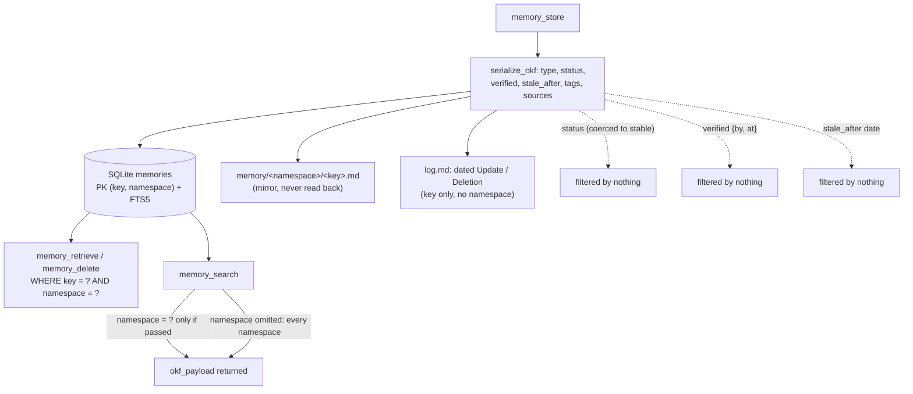

## 1. Executive Summary

MCP-Memory is an MCP server that gives an agent (Claude Desktop, Cursor, Codex
and the like) a persistent key-value memory, with only `fastmcp` and `pyyaml`
beyond the standard library. Every memory is an **Open Knowledge Format (OKF
v0.2)** document — markdown with YAML frontmatter — stored in a per-project
SQLite database with an FTS5 index and mirrored to a `.md` file on disk for a
human to read. As plumbing it is clean and does what an MCP memory server
should: store, search, retrieve and delete snippets that survive across
sessions.

The finding is the gap between the format's promise and the code's use of it.
OKF's frontmatter is a *trust and lifecycle* vocabulary: a `status`
(`draft`/`stable`/`deprecated`), a `verified` list of who-checked-this-and-when
events, and a `stale_after` date past which a record is stale. MCP-Memory
serializes all of it faithfully (`okf_engine.py:52-108`) and **filters on none
of it**. Search and retrieve consume `key`, `namespace`, `tags` and the raw
payload (`db.py:341-358`); there is no `WHERE status = …`, no
`today >= stale_after` comparison, no weighting by `verified`. A `deprecated`
memory, or one a month past its `stale_after`, is returned exactly like a
fresh verified one. The trust model is written and never read.

Two smaller instances of the same shape sit beside it. The README says the
server adheres *"strictly to SPEC.md and OKF_RULES.md"*, and a conformance
validator (`validate_okf_conformance`, `okf_engine.py:173-229`) exists to
enforce that. The store path never calls it; the only runtime enforcement is
that an invalid `status` is coerced to `stable` (`okf_engine.py:66-70`). And
`namespace`, which the tool describes as separation *"for contexts or users"*,
is optional on search: an unqualified `memory_search` reads every namespace
(`db.py:295-297`).

Two marks are earned, both narrowly. `scope_enforced` rests on retrieve and
delete, which always apply `namespace` in SQL; search does not, as above.
`audit_log` rests on `log.md`, which receives a dated `Update` or `Deletion`
entry from every store and every delete that removes a mirror file, with no
switch to skip it (`okf_engine.py:413`, `:456`). It is a thin record — key only,
no namespace, no actor, no before/after — and it is the one lifecycle artifact
the code writes on every mutation.

## 2. Mental Model

A memory is an OKF record identified by `(key, namespace)`. Its life is short
to describe because the store is flat: it exists, it can be overwritten in
place, and it can be hard-deleted. There is no status transition the system
acts on, because the status field is inert.

```text
memory_store(key, namespace, content, type?, status?, verified?, stale_after?, tags?)
  -> get_memory_file_path(...)     refuse traversal before touching SQLite
  -> serialize_okf(...)            build the OKF markdown + frontmatter
  -> UPSERT memories ON CONFLICT(key, namespace)   overwrite in place, keep created_at
  -> sync_memory_to_disk(...)      write memory/<namespace>/<key>.md (a mirror)
  -> append_log_entry("Update")    dated line in log.md: key only, no namespace

memory_search(query?, tags?, namespace?)
  -> FTS5 MATCH "term"* ORDER BY rank         (or updated_at DESC if no query)
  -> WHERE namespace = ?  only when a namespace is passed
  -> python: drop rows whose tags don't intersect
  -> returns okf_payload  -- status / verified / stale_after never filtered
```

OKF is not this project's format. It is the Google Open Knowledge Format, an
external spec under `GoogleCloudPlatform/knowledge-catalog`, and that matters
for how much the finding weighs: the fields written and never read are a shared
standard's, not one author's invention. [OpenLore](../openlore/) implements the
same spec independently, validates the same `status` and `verified` families on
write, and consults neither on any read. Two implementations of one
specification arriving at the same half is evidence about what the spec makes
easy, rather than about either project's care.

The frontmatter carries a vocabulary the read path never filters on, and the
diagram draws exactly that: the fields flow in at write time and dead-end, and
the namespace reaches the search only when the caller supplies it.



## 3. Architecture

Five files, no services, one embedded database per project.

- **`memory_server.py`** (275) — the FastMCP server and the six tools.
- **`okf_engine.py`** (458) — OKF serialization and parsing, the path
  validator, the disk mirror, the `log.md` and `index.md` generators, and the
  uninvoked conformance validator.
- **`db.py`** (393) — the SQLite schema, upsert, FTS5 search, retrieve, delete.
- **`test_memory.py`** (444) and **`setup.py`** (240, an install wizard).

**Storage.** SQLite in WAL mode at `<project_root>/.mcp_memory/memories.db`
(`db.py:49`, `:89`). The schema is one base table and one FTS5 mirror kept in
step by three triggers (`db.py:91-143`):

```sql
CREATE TABLE memories (
  key TEXT NOT NULL, namespace TEXT NOT NULL DEFAULT 'default',
  okf_payload TEXT NOT NULL, tags TEXT NOT NULL DEFAULT '[]',
  created_at DATETIME, updated_at DATETIME,
  PRIMARY KEY (key, namespace));
CREATE VIRTUAL TABLE memories_fts USING fts5(
  key UNINDEXED, namespace UNINDEXED, tags, okf_payload);
```

SQLite is authoritative: the full OKF document is the `okf_payload` column, and
`sync_memory_to_disk` writes the `.md` file after the DB commit as a browseable
copy (`db.py:235`). No code path reads a memory `.md` file back, so the disk
tree is an export, not a second source of truth.

The mirror's layout is not a namespace partition. `get_memory_file_path` puts a
`default` key at `<base>/<key>.md` and a named namespace's key at
`<base>/<namespace>/<key>.md` (`okf_engine.py:258-267`). Key `research/notes`
in `default` and key `notes` in namespace `research` are two rows in SQLite and
one file on disk. The mirror holds whichever was written last, and deleting
either row removes the file. On a case-insensitive filesystem, keys differing
only in case collide the same way.

### Deployment and ergonomics

- **Small to stand up.** `setup.py` registers `run.sh` with installed MCP
  clients; `run.sh` creates a `.venv` and installs `requirements.txt` on first
  launch, from unpinned ranges (`fastmcp<=3`, `pyyaml>=6.0`). Storage is stdlib
  `sqlite3`, with no server, model or network. Each tool call passes a
  `project_root`, so one server process backs many per-project stores.
- **The store is human-readable and hand-repairable** — OKF markdown per
  namespace, plus a generated `index.md` and `log.md` — which is the main thing
  the disk mirror buys, within the collision limit above.
- **The global-store setting.** The README suggests
  `MCP_MEMORY_DB_PATH=~/.mcp_memory/memories.db` for one store shared across
  projects. `get_default_db_path` tests `os.path.isabs` before any `~`
  expansion, so that literal value resolves under the project root, in a
  directory named `~`, unless the MCP client expands it first (`db.py:49-53`).
  When an absolute path is set, every project shares one file with no project
  key on a row.

## 4. Essential Implementation Paths

- **Store** — `memory_server.py:98` `memory_store` → `db.store_memory`, which
  validates the destination path before touching SQLite (`db.py:176-179`) →
  `okf_engine.serialize_okf` (`okf_engine.py:17`) → upsert
  `ON CONFLICT(key, namespace) DO UPDATE` (`db.py:221-231`) →
  `sync_memory_to_disk` → `append_log_entry("Update")` (`okf_engine.py:413`).
- **Search** — `db.search_memories` (`db.py:273-363`): FTS5 `MATCH "term"*`
  ordered by `rank` (`:299-315`), or `updated_at DESC` with no query
  (`:316-321`); namespace in SQL only when passed (`:295-297`); tags filtered in
  Python after the fetch (`:346-348`); `LIKE` fallback on an FTS syntax error
  (`:326-339`).
- **Retrieve** — `db.retrieve_memory`, exact `WHERE key = ? AND namespace = ?`
  (`db.py:248-270`), with `namespace` defaulting to `"default"`.
- **Delete** — `db.delete_memory` hard `DELETE` (`db.py:383-387`), then
  `remove_memory_from_disk` (`okf_engine.py:418-458`): `os.remove` of the `.md`,
  index rebuilds, an empty-dir `rmdir`, and a `Deletion` log line.
- **Continuity** — `memory_get_last`/`memory_update_last`
  (`memory_server.py:26-95`) maintain a `system/last_memory` checkpoint record
  so a new session can pick up where the last left off.

## 5. Memory Data Model

The record is an OKF v0.2 document; `serialize_okf` assembles the frontmatter
(`okf_engine.py:52-108`). The fields that bear on trust and lifecycle, and what
the code does with them:

- **`type`** — free string, default `"Agent Memory"`; not enumerated, not
  validated at write.
- **`status`** — constrained to `draft`/`stable`/`deprecated`, and **any
  invalid or absent value is silently coerced to `stable`**
  (`okf_engine.py:66-70`). Never filtered on retrieval.
- **`verified`** — a list of `{by, at}` events (OKF's provenance tier), written
  only if supplied. Never filtered.
- **`stale_after`** — an absolute `YYYY-MM-DD` date whose OKF meaning is "stale
  when today ≥ stale_after" (`SPEC.md` §5.5). Written verbatim, compared
  nowhere.
- **`namespace`, `tags`, `key`** — the fields the read path consumes.

All three dead fields are indexed as text, because FTS5 indexes the whole
`okf_payload` including its frontmatter: a search for `deprecated` finds
deprecated records. That makes the status findable, and not a filter.

Three marks are withheld on the model rather than on a technicality.
`trust_state`: `status` and `verified` are stored and consulted by no filter,
and a discrete status that nothing consumes is not a trust state. `bitemporal`:
`stale_after` is a validity date applied on no read path, and
`created_at`/`updated_at` are transaction time. `tombstone`: deletion is a hard
removal with no rejected-value record. The fields to build the first two are in
every record; closing the gap is a matter of reading them, not adding them.

## 6. Retrieval Mechanics

Lexical only. A query becomes an FTS5 prefix match (`"term"*`) ordered by
FTS5's built-in `rank`; an empty query lists by `updated_at DESC`. Tags are
intersected in Python after fetching `limit*2` candidates (`db.py:315`,
`:346-348`), so a tag filter can return fewer than `limit` rows when the top
candidates are untagged. A malformed FTS query falls back to `LIKE` over key and
payload. `grep -rn -i -E 'embed|vector|cosine'` over the Python files returns
nothing.

The namespace predicate is conditional. `memory_search` declares
`namespace: Optional[str] = None` (`memory_server.py:212`), and both the FTS
arm and the `LIKE` fallback add `namespace = ?` only when one is passed
(`db.py:295-297`, `:333-335`). An unqualified search returns rows from every
namespace in the project's database. Retrieve and delete always carry the
predicate, defaulting to `"default"`.

The lifecycle limit from section 5 applies here from the query side. Because
`status`, `verified` and `stale_after` never enter a `WHERE` or an `ORDER BY`,
the ranker cannot prefer a verified record, demote a deprecated one or drop a
stale one. The lifecycle exists in the data and not in the results.

## 7. Write Mechanics

Writes are synchronous and idempotent by key, and a stored record is searchable
as soon as the tool returns. `memory_store` validates the key and namespace as
a path first, so a traversal attempt raises before any row is committed
(`db.py:176-179`). It then upserts on `(key, namespace)`, overwriting
`okf_payload` and `updated_at` while preserving `created_at` (`db.py:189-195`,
`:221-231`). There is no version history: a correction replaces the prior
content, and `log.md` records only that the key was updated, not what it held.

Nothing records a *rejected* value. Re-storing content that was just deleted is
accepted unconditionally — the upsert has no rejection check — so if an agent
re-proposes something a user removed, it returns without objection. That is the
[rejected-value tombstone](../../patterns/rejected-value-tombstone/) gap in its
simplest form, with no soft delete to build on.

There is no background work: no daemon, no extraction, no consolidation, no
decay. `stale_after` is the only decay-shaped field in the design, and it is
inert.

## 8. Agent Integration

The model's whole relationship to memory is six tools: `memory_store`,
`memory_retrieve`, `memory_search`, `memory_delete`, and the
`memory_get_last`/`memory_update_last` continuity pair. Every tool takes a
`project_root`, which selects the database file for that call. The server
instructions tell the agent to call `memory_get_last` first in a session and
`memory_update_last` at milestones (`memory_server.py:14-18`), the minimum
viable version of a session handoff.

Both scope values are the model's own arguments. `project_root` is a path the
model supplies, so reaching another project's store is a matter of naming its
directory; `namespace` is a string it supplies, or omits on search.

The `verified` field is the seam where a human *could* enter — an agent can
supply `verified: {by: "human:…", at: …}` when storing — but nothing gates a
memory on sign-off and nothing reads the field back, so `human_review` is
withheld: the provenance is recorded and never consulted.

## 9. Reliability, Safety, and Trust

The trust story is short because the mechanisms are present as data and absent
as behaviour.

- **The OKF trust model is write-only.** `status`, `verified` and `stale_after`
  are serialized on every record and filtered by no retrieval, ranking or
  gating path. The format advertises trust tiers and staleness, and the server
  delivers neither at read time.
- **Conformance is documented, not enforced.** The validator is called only
  from `test_memory.py`, and the only write-time enforcement is coercing an
  invalid `status` to `stable`. An invalid `type`, a malformed actor, or
  non-conforming frontmatter is accepted and written.
- **`log.md` earns `audit_log`, thinly.** Every store appends a dated `Update`
  line and every delete that removes a mirror file appends `Deletion`
  (`okf_engine.py:413`, `:456`). An entry names the key but not the namespace,
  so two namespaces' writes to one key are indistinguishable. It carries no
  actor and no before/after value. It is written after the SQLite commit, so a
  failed mirror write leaves an upsert unlogged, and a delete whose mirror file
  is already gone — including one removed by the path collision in section 3 —
  logs nothing (`okf_engine.py:421-422`). The file is rewritten whole on each
  append, and a read failure resets it to the single new entry
  (`okf_engine.py:357-361`).

`scope_enforced` holds on narrow evidence. `namespace` is a key on every row,
and retrieve and delete apply it in SQL with no unscoped form, defaulting to
`"default"` (`db.py:259-262`, `:383-387`). The search tool takes it as an
optional argument and reads every namespace without it (`memory_server.py:212`,
`db.py:295-297`). Search is the discovery path, and the store tool's own
docstring offers namespaces as separation *"for contexts or users"*
(`memory_server.py:129`), so the boundary holds only for a caller who passes the
namespace. No test writes to two namespaces and reads from one.

The project boundary is real and of a different kind. `project_root` picks one
SQLite file per project directory, with no project key on a row and no project
predicate on a read. A query cannot span projects because there is no shared
table — unless `MCP_MEMORY_DB_PATH` is absolute, which puts every project in one
file with nothing to tell them apart. The mark rests on the namespace
predicate, not on this partition.

The rest of the safety surface is small: no network, no model, no background
execution. Path traversal through a key or namespace is refused
(`okf_engine.py:232-277`) and covered by six tests. The risks are of the quiet,
correctness kind: a memory that should be distrusted or expired is served as
current, and an unqualified search returns another namespace's records.

## 10. Tests, Evals, and Benchmarks

`test_memory.py` holds 23 `unittest` methods in three classes; I did not run
them. They cover OKF serialize and parse for string and dict content, the
extended frontmatter fields, the conformance validator's valid, missing-type
and bad-actor cases, and six path-validator cases. On the database they cover
store and retrieve, the disk mirror with its `index.md` and the `Update` and
`Deletion` lines in `log.md`, FTS and tag search, and delete. Three cases
check that a rejected key or namespace commits no row, one that a delete keeps a
row whose path it cannot resolve, and one that ordinary keys round-trip. The
MCP tool flow, the
`last_memory` checkpoint, the missing-`project_root` error and a
`project_root` override close the suite.

Three properties the design turns on are not asserted. No test stores a
`deprecated` or `stale_after`-expired record and checks how it is read, so the
trust fields' inertness is untested rather than caught. No test writes to two
namespaces and reads one. And there is no negative-retrieval case, so
`negative_eval` is withheld. `test_delete_memory` checks a key lookup after a
delete, with a pre-delete control (`test_memory.py:242-253`), which tests
deletion rather than retrieval suppression. `test_rejected_key_is_not_searchable`
asserts `hits == []` over a store holding no other row, so it passes for a search
that returns nothing at all (`test_memory.py:275-285`).

`grep -rn -i -E 'arxiv|bibtex|@article|@misc|citation|\bdoi\b'` finds only the
spec's own `# Citations` section, and there is no `CITATION.cff`. No benchmark
or retrieval-quality measurement is committed, which for a lexical key-value
store is a reasonable absence.

## 11. For Your Own Build

### Steal

- **Store memory as a documented, human-readable format with a real spec.** OKF
  markdown with typed frontmatter, mirrored to disk, gives you a store a person
  can read, diff and repair by hand — a property most SQLite-only stores lack,
  and it costs one file write after the commit. Compose the mirror path so that
  two identities cannot share a file.
- **Validate the path before the commit.** `store_memory` resolves the mirror
  path first so a bad key raises before a row exists, and `delete_memory` does
  the same so an unresolvable key cannot drop a row whose file it cannot find.
- **Keep a `last_memory` continuity checkpoint.** A single well-known record an
  agent updates at the end of a turn and reads at the start of the next is the
  cheapest useful cross-session handoff.

### Avoid

- **Do not store a trust field you do not read.** `status`, `verified` and
  `stale_after` written and never consulted is a format cosplaying as a
  mechanism; a reader assumes a `deprecated` memory is suppressed and a
  `stale_after` one expires, and neither happens.
- **Do not claim strict spec conformance you do not enforce.** The validator
  exists; call it on the write path, or invalid frontmatter flows straight in.
- **Do not make the scope optional on the discovery path.** A namespace that
  retrieve requires and search drops is a boundary only for callers who already
  know the key.
- **Do not let re-storing a deleted value succeed silently** if anything
  upstream re-proposes memories, or a user's deletion is undone on the next
  write.

### Fit

This suits a solo user who wants a simple, inspectable, dependency-light memory
for an MCP client and is content with lexical search, one project per database,
and manual lifecycle management. It installs in minutes and the store is yours
on disk.

Walk away if namespaces must separate users or agents that share a project
database, if you expect the OKF trust and lifecycle fields to *do* anything, or
if you need semantic recall, decay, correction that sticks, or provenance the
system acts on. The bones of a trust-aware store are in every record; this
implementation does not read them.

## 12. Open Questions

- Is the OKF trust model intended to be consumed on read? Every field needed to
  close the gap is present.
- Would `status = 'deprecated'` and `stale_after` be applied as a read filter or
  a ranking penalty — and which, given the format defines staleness but not a
  ranking?
- Is the conformance validator meant to run on the store path? It is called
  only from tests.
- Is an unqualified `memory_search` meant to span namespaces, and are
  namespaces meant to separate users, as the store tool's docstring says?
- Is the `.md` mirror ever meant to be read back, for example to rebuild the
  database? If so, the `default`-namespace path collision would decide which
  row survives.

## Appendix: File Index

- `memory_server.py` — FastMCP server, the continuity instructions, and the six tools (`memory_store`, `memory_retrieve`, `memory_search`, `memory_delete`, `memory_get_last`, `memory_update_last`).
- `okf_engine.py` — `serialize_okf`, `parse_okf`, `get_memory_file_path` (path validation), `sync_memory_to_disk`, `remove_memory_from_disk`, `append_log_entry`, `update_directory_index`, `validate_okf_conformance` (called only from tests).
- `db.py` — path resolution (`get_default_db_path`), schema and triggers (`init_db`), `store_memory` upsert, `search_memories` (FTS5 and `LIKE` fallback), `retrieve_memory`, `delete_memory`.
- `test_memory.py` — 23 unit tests for serialization, path validation, storage, search, delete, the log, tool flow and checkpoint.
- `run.sh`, `setup.py`, `requirements.txt` — first-launch venv install and client registration.
- `SPEC.md`, `OKF_RULES.md` — copies of the external Open Knowledge Format spec.

### Commands behind the absence claims

```sh
grep -n -E 'stale_after|verified|\bstatus\b|deprecated' memory_server.py db.py okf_engine.py
grep -rn 'validate_okf_conformance' --include='*.py' .
grep -rn -E 'open\(|read_text|\.read\(\)|listdir' --include='*.py' .
grep -rn -i -E 'embed|vector|cosine|faiss|chroma|numpy' --include='*.py' .
grep -rn -E 'thread|Thread|asyncio|schedule|cron|daemon|Timer' --include='*.py' .
grep -rn -i -E 'reject|tombstone|suppress|deleted_at|soft' db.py okf_engine.py memory_server.py
grep -n -E 'namespace: Optional|if namespace' memory_server.py db.py
grep -n 'namespace=' test_memory.py
grep -n 'deprecated\|stale_after' test_memory.py
grep -rn -i -E 'arxiv|bibtex|@article|@misc|citation|\bdoi\b' --exclude-dir=.git .
```

## History

**2026-09-26** — [`a50a87708628d0822af439015503de47c35d7acc`](https://github.com/fellowgeek/mcp-memory/commit/a50a87708628d0822af439015503de47c35d7acc) — audit at an unchanged pin: upstream `main` is the pinned commit. `audit_log` is added, withheld in error since the first reading: `log.md` receives a line from every store and every mirror-removing delete ([§9](#9-reliability-safety-and-trust)). `scope_enforced` holds on narrower evidence than the report gave: the namespace predicate is on retrieve and delete, `memory_search` applies it only when one is passed, and no test covers isolation. The line anchors, file sizes and test account described the first pin and are re-verified here; the mirror is corrected from a namespace partition to a shared path space where rows can collide ([§3](#3-architecture)). Screened again: one build-time exec and one unpinned surface, nothing inside the cooldown. Nothing was installed, built or run.

**2026-09-13** — [`a50a87708628d0822af439015503de47c35d7acc`](https://github.com/fellowgeek/mcp-memory/commit/a50a87708628d0822af439015503de47c35d7acc) — re-read, nine commits past the previous pin. The mark stands and its on-disk half was hardened by three separate fixes from two outside contributors: memory keys are contained inside the store, `.` and `..` traversal tokens plus backslash tricks and multi-segment namespaces are refused with `ValueError` in `okf_engine.py:236-244`, and the index row is no longer committed before the resolved path is validated. None was a finding this atlas published — the report's criticism is about the trust vocabulary — but they matter to the mark, because a namespace that partitions directories is only a boundary while a key cannot leave them. The standing criticism holds: `verified`, `status` and `stale_after` are still consulted by no read path. The report now also states that OKF is the Google Open Knowledge Format rather than this project's own, and notes that OpenLore implements the same spec and reaches the same place. Screened again first; nothing was installed and no suite was run.

**2026-08-15** — [`4514d1fd162598e65280c15ea2df017698fcbf16`](https://github.com/fellowgeek/mcp-memory/commit/4514d1fd162598e65280c15ea2df017698fcbf16) — first reading. Screened before opening: a `requirements.txt` inside the seven-day cooldown and one build-time exec (the setup wizard); nothing was installed or run. The upsert-and-mirror store, the FTS5 read path, the namespace filter, and the write-only handling of OKF's `status`/`verified`/`stale_after` (serialized in `okf_engine.py`, absent from every `WHERE`/`ORDER BY` in `db.py`) were read from the five source files and cross-checked against `test_memory.py`. `scope_enforced` is earned on the namespace filter; the other six marks are withheld, each because the field exists and nothing consumes it. No paper or citation file exists in the tree.
