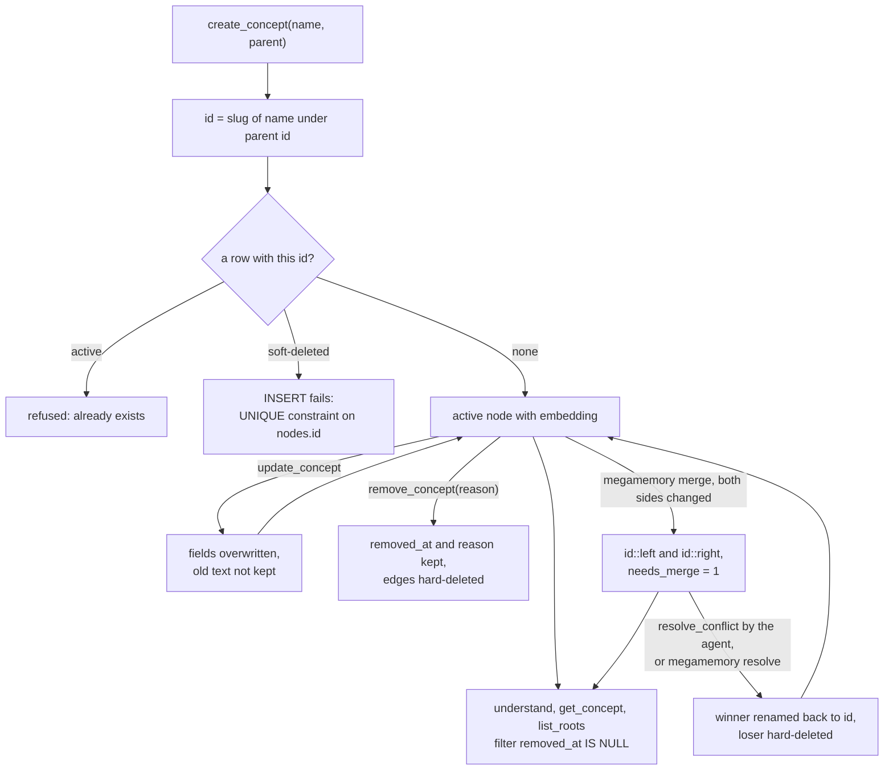

## 1. Executive Summary

MegaMemory is a stdio MCP server that lets a coding agent keep a graph of
*concepts* about one project — features, modules, patterns, decisions — in a
SQLite file under `.megamemory/`. The agent writes each concept in its own
words, and `understand` finds them again by cosine similarity over embeddings
computed in process. What is notable is how little it needs: no API key, no
service, and a soft delete that keeps the removal reason while every agent
read filters on it. What is weak is correction. An update overwrites with no
prior value kept, and a removed concept's name cannot be used again under the
same parent. Unresolved merge copies are searched as if settled.

The design philosophy is in the README and the installed instructions: *"The
LLM is the indexer."* There is no parser and no extraction pass. The installer
writes a block into the agent's global `CLAUDE.md` or `AGENTS.md` telling it to
call `list_roots` at session start, `understand` before a task, and
`create_concept` or `update_concept` after it (`src/install.ts:56-67`).
Everything the graph knows arrives through those calls.

Two pieces go beyond the usual MCP memory server. A `timeline` table logs every
tool call, and a `merge` command reconciles two `knowledge.db` files that
diverged on git branches, keeping conflicts as `id::left` and `id::right`
copies for a person or the agent to resolve.

Two marks: `audit_log` for the timeline, with limits that section 9 names, and
`negative_eval` for a time-slider snapshot case that leaves out a removed node
beside a positive control over the same fixture. The other five are withheld in section 9.

## 2. Mental Model

A memory is a node the agent created, and it is a belief from the moment
`create_concept` returns. There is no candidate state, no confidence, and no
source beyond an optional free-text `created_by_task`, which the agent-facing
result type does not carry (`src/types.ts:97-124`).

**Identity is the name.** `makeId` lowercases the name, turns runs of spaces and
underscores into hyphens, strips everything else, and prefixes the parent id
with a slash (`src/tools.ts:33-41`). A second concept with the same name under
the same parent is refused as *"already exists. Use update_concept"*
(`tools.ts:157-160`). An `update_concept` that changes the name keeps the old id.

**A concept stops being believed in three ways.** An `update_concept` replaces
the text in place, and the previous text is gone. A `remove_concept` stamps
`removed_at` and a required reason, and every agent read then filters on
`removed_at IS NULL` (`src/db.ts:361-378`). A merge resolution hard-deletes the
losing copy (`tools.ts:378-405`). Nothing expires or decays.

**The soft-deleted row blocks its own name.** `createConcept` checks
`nodeExists`, which filters removed rows, so a removed id passes the check. The
following `INSERT` then hits the primary key held by the removed row
(`db.ts:240-243`, `:488-495`). The agent receives a raw SQLite `UNIQUE`
constraint error, not *"was removed"*, and nothing restores a removed node.
Choosing a different name admits the same claim.

**A merge makes two beliefs out of one.** When both branches changed a concept,
the merged file holds `feature::left` and `feature::right` with `needs_merge = 1`
(`src/merge.ts:303-318`). Only `list_conflicts` reads that flag. `understand`
returns both copies as ordinary nodes until someone resolves them, and the
suffix in the id is the only sign.

## 3. Architecture

One Node process per MCP client. `megamemory` with no argument starts the stdio
server; `serve`, `merge`, `conflicts`, `resolve`, `stats` and `install` are CLI
subcommands of the same binary (`src/index.ts:62-143`).

Persistence is one libsql database, opened in WAL mode with foreign keys on and
a 5-second busy timeout (`src/db.ts:12-25`). Its path is
`MEGAMEMORY_DB_PATH`, or `.megamemory/knowledge.db` under the working directory
the MCP client launched the server in (`index.ts:164-166`). Four schema versions
are migrated under `BEGIN IMMEDIATE` with a re-check, so two processes starting
together migrate once (`db.ts:37-178`). Writes retry `SQLITE_BUSY` up to three
times with exponential back-off (`db.ts:209-225`).

Embeddings come from `@xenova/transformers` running quantized
`Xenova/all-MiniLM-L6-v2` in process (`src/embeddings.ts:1-18`). The README says
the model, about 23 MB, downloads on first use. Search is a brute-force scan.
Nothing runs in the background.

The web explorer is an HTTP server over the same file, serving
`web/index.html`, which loads d3 from cdnjs and reads eight GET routes, among
them an SSE stream fed by a 1.5-second poll (`src/web.ts:546-747`). No route
writes.

### Deployment and ergonomics

`npm install -g megamemory`, then `megamemory install --target claudecode` or
another target. Nothing else has to run, no key is needed, and after the model
download it works offline. The store is a SQLite file anyone can open with
`sqlite3`; `scripts/check-roots-size.sh` does exactly that to measure the
`list_roots` payload. Because the path follows the working directory, launching
the MCP client from a subdirectory opens a different, empty graph.

## 4. Essential Implementation Paths

**Write.** `create_concept` (`index.ts:270-320`) → `createConcept`
(`tools.ts:150-191`): slug the id, check `nodeExists` for the id and the parent,
embed `"kind: name — summary"` (`embeddings.ts:53-59`), then
`insertNodeAndEdges` inserts the node and each edge whose target exists, in one
transaction, silently skipping an edge to a missing target (`db.ts:257-297`).

**Update.** `updateConcept` (`tools.ts:193-223`) re-embeds only when `summary`
or `name` changed (`:205`). A change of `kind` alone leaves the embedding built
from the old kind. `updateNode` writes only to rows with `removed_at IS NULL`
(`db.ts:311-359`).

**Link.** `link` (`tools.ts:225-253`) checks both ends and `INSERT OR IGNORE`s
under the unique index on `(from_id, to_id, relation)` added in schema v4
(`db.ts:157-170`). `deleteEdge` exists (`db.ts:404-411`) and has no caller.

**Remove.** `removeConcept` (`tools.ts:255-275`) → `softDeleteNode`
(`db.ts:361-378`), which sets `removed_at` and `removed_reason` and deletes every
edge touching the node in the same transaction.

**Retrieve.** `understand` (`tools.ts:109-137`) embeds the query, loads every
active node with an embedding (`db.ts:469-486`), scores them in
`findTopK` (`embeddings.ts:100-120`), and builds each hit with
`buildNodeWithContext`: active children, outgoing and incoming edges whose other
end is active, and the parent if active (`tools.ts:58-105`). `get_concept` is
`getNode` plus the same context. `list_roots` returns every root and its
children's names, with stats (`tools.ts:277-299`).

**Merge.** `runMerge` (`src/merge-cli.ts:45-108`) → `MergeEngine.merge`
(`merge.ts:90-111`), which opens both inputs and a fresh output database, copies
identical and one-sided nodes as they are, and writes differing ones as suffixed
copies sharing a `merge_group` UUID. Edges are inserted in a second pass and
remapped to the copy on their own side (`merge.ts:361-401`).

**Resolve.** Two routes. `megamemory resolve` with `--keep left|right|both`
hard-deletes the loser and renames the winner, or renames both to a
branch-suffixed id (`merge-cli.ts:204-288`). The MCP `resolve_conflict` takes a
new summary from the agent, keeps the active copy as the base, hard-deletes the
others, renames the base and writes the summary (`tools.ts:354-410`).

**Timeline.** Every MCP handler calls `timeline.log` after its tool function
returns or throws (`index.ts:205-536`); `createTimelineLogger` inserts with one
retry and swallows failure (`src/timeline.ts:14-35`).

## 5. Memory Data Model

| Table | Columns that matter | Notes |
| --- | --- | --- |
| `nodes` | `id`, `name`, `kind`, `summary`, `why`, `file_refs`, `parent_id`, `created_by_task`, `created_at`, `updated_at`, `removed_at`, `removed_reason`, `embedding` | merge adds `merge_group`, `needs_merge`, `source_branch`, `merge_timestamp` |
| `edges` | `from_id`, `to_id`, `relation`, `description`, `created_at` | unique on `(from_id, to_id, relation)`; `ON DELETE CASCADE` to nodes |
| `timeline` | `seq`, `timestamp`, `tool`, `params`, `result_summary`, `is_write`, `is_error`, `affected_ids` | one row per MCP call |

(`db.ts:51-98`, `:138-148`.) `kind` is one of `feature`, `module`, `pattern`,
`config`, `decision`, `component`, and `relation` one of `connects_to`,
`depends_on`, `implements`, `calls`, `configured_by`, both enforced by zod on
the tool schema (`index.ts:196-201`), not by the table.

**Scope is the file.** No column names a project, user or agent. Two agents in
the same directory share one graph; the same agent in another directory has
another. This is a physical partition, not a scope key.

**Time is record time.** `created_at`, `updated_at` and `removed_at` are set by
SQLite's `datetime('now')`. There is no validity interval, and `updated_at`
overwrites. `getNodesAtTime` reconstructs membership at a past instant from
`created_at` and `removed_at` (`db.ts:891-898`), but returns each node's
current summary. Edges of a removed node were hard-deleted at removal, so the
explorer's past graph loses them (`db.ts:372-374`, `:900-912`).

**Hierarchy is soft.** Removing a parent leaves its children active with a
`parent_id` that no active row answers, so they drop out of `list_roots` — which
selects `parent_id IS NULL` (`db.ts:461-467`) — while `understand` still finds
them.

## 6. Retrieval Mechanics

Pure dense retrieval. The query is embedded, every active node's embedding is
read from SQLite on every call, cosine is computed in JavaScript, and the top
`top_k` (default 10, maximum 50) are returned whatever their score. No lexical
arm, no threshold, no recency and no rerank. A query about something the graph
lacks still returns ten nodes.

Each hit is expanded one hop: all active children with their summaries, all
edges both ways with the neighbour's name, and the parent. On a well-connected
graph that can make one `understand` call several times the size of its ten
summaries. Nothing bounds it.

Retrieval is tool-mediated: nothing is injected automatically. The installed
instructions make `list_roots` the session-start call, and that response is
every root with every direct child's name, unbounded. The repository ships
`check-roots-size.sh` to estimate its tokens.

The failure a reader should expect is stale context rather than noise. A summary
the agent did not update after a refactor stays authoritative, and during an
unresolved merge two contradictory copies arrive side by side.

## 7. Write Mechanics

All writes are explicit tool calls by the agent; the bootstrap and save slash
commands (`commands/bootstrap-memory.md`, `commands/save-memory.md`) are
prompts asking it to make them. No model call happens inside MegaMemory besides
the embedding. Deduplication is by id only: `save-memory.md` tells the agent to
`understand` first and update rather than create, and the server cannot tell
two names for one concept apart.

**Update is in place.** The previous `summary`, `why` and `file_refs` are lost;
the timeline row names which fields changed (`index.ts:341-348`).

**Remove is soft for the node and hard for its edges.** The tool description
promises *"The concept and its removal reason are preserved in history"*
(`index.ts:405`), which holds for the node row. Relations are deleted. No MCP
verb removes one wrong edge without removing a node.

**Conflict handling is branch-level.** Two databases merge by id. A concept
removed on one side and active on the other is a conflict, not a silent
deletion (`merge.ts:55-58`; tested at `merge.test.ts:387-414`). A concept
identical on both sides merges clean. Resolution writes nothing that records the
rejected text, so merging again with a branch file that still holds it raises
the same conflict again.

Agent-generated content is the only content, and nothing filters it.

### Operational cost

- **Write:** synchronous. `create_concept` and a text-changing
  `update_concept` block on one local embedding; the first call in a process
  also loads, and on first install downloads, the model. The new node is
  searchable as soon as the call returns.
- **Background:** none. `merge` rewrites the whole file, on demand.
- **Read:** every `understand` loads every active embedding, linear in graph
  size, which the README bounds as *"fast enough for graphs with <10k nodes"*.
  Nothing is injected unasked.

## 8. Agent Integration

Nine MCP tools: `understand`, `get_concept`, `create_concept`,
`update_concept`, `link`, `remove_concept`, `list_roots`, `list_conflicts`,
`resolve_conflict` (`index.ts:205-536`). The agent holds every verb, including
the one that closes a merge conflict.

`megamemory install` writes the MCP entry for opencode, Claude Code, Codex and
Antigravity, appends the workflow block to the global instruction file under a
`## Project Knowledge Graph` marker, and copies the slash commands and, for
opencode, a skill-tool plugin (`install.ts:498-550`, `plugin/megamemory.ts`).
The plugin's `merge` action and the `resolve_conflict` description tell the
agent to verify both versions against the code and *"write the truth"*.

Adapting it to another MCP client is a config line. Adapting the memory to
anything but a coding agent working in one directory would mean adding a scope
key the schema does not have.

## 9. Reliability, Safety, and Trust

**Provenance is optional and hidden.** `created_by_task` is a free string the
agent may pass, shown by the web explorer's node route and absent from
`understand` results. Nothing records which agent or session wrote a node.

**The explorer is readable from any web page and any host on the network.**
`server.listen(port, …)` passes no host, so Node binds every interface, and
every JSON response carries `Access-Control-Allow-Origin: *`
(`src/web.ts:28-34`, `:101`). While `megamemory serve` runs, a page in the
user's browser can fetch `/api/graph` and read every summary. The routes are
read-only, so this is disclosure, not tampering.

**MCP conflict resolution likely fails on any connected concept.**
`renameNodeId` sets `PRAGMA foreign_keys = OFF` so it can rewrite a
self-referenced id (`db.ts:602-633`). `resolveConflict` calls it inside
`runInTransaction` (`tools.ts:378-392`), and SQLite documents that pragma as a
no-op inside a transaction. The `UPDATE` of the id should then fail on any edge
or child referencing it. The CLI route calls `renameNodeId` outside a
transaction. The one MCP resolution test uses nodes with no edges. This was
read, not run.

**The log does not survive a merge.** A merge without `--into` writes a fresh
database and renames it over the first input (`merge-cli.ts:59-83`); the
engine copies nodes and edges and never touches `timeline` (`merge.ts:100-102`).

**Concurrency is handled.** Transactions are `BEGIN IMMEDIATE`, busy errors
retry, and `db.concurrency.test.ts` forks writer processes against one file.

**Uncertainty is not representable.** A node is active or removed; a conflict
copy is searched like any node.

Capability marks:

- `audit_log` — awarded. The `timeline` table is a named, insert-only record in
  the graph's own file, and every MCP write appends to it. Its limits are real:
  written after commit and allowed to fail, changed field names without values,
  no affected ids on `resolve_conflict`, nothing from the CLI `merge` and
  `resolve`, and emptied by a default merge.
- `negative_eval` — awarded; evidence in section 10.
- `tombstone` — withheld. The soft-deleted row refuses a re-create of the same
  slug, but it is keyed on the id, the refusal is an unexplained constraint
  error, and the same claim under another name is admitted. A resolved merge
  records nothing about the rejected copy.
- `trust_state` — withheld. `needs_merge` is the only status-like field, and
  only `list_conflicts` and `megamemory conflicts` read it
  (`db.ts:557-568`); `understand` returns flagged copies.
- `bitemporal` — withheld. Only record timestamps exist.
- `scope_enforced` — withheld. The boundary is one file per directory, with no
  key on a row and no predicate on a read.
- `human_review` — withheld. A conflict waits in `needs_merge` until resolved,
  and `resolve_conflict` is on the agent's own tool list; `megamemory resolve`
  is a second door, not the only one.

## 10. Tests, Evals, and Benchmarks

Nothing was installed, built or run for this report; everything here is from
reading the tests at the pin. The publish workflow runs `npm test` before
`npm publish` on a GitHub release (`.github/workflows/publish.yml`); no
workflow runs on push.

**The negative case.** `getNodesAtTime excludes nodes removed before the
timestamp` (`src/__tests__/timeline.test.ts:423-428`) asserts the snapshot read
leaves out node-b, soft-deleted before the instant, and the next case, over the
same fixture and instant (`:430-435`), asserts node-c, removed afterwards, is
returned. The pair exercises the `removed_at` predicate in `getNodesAtTime`
(`src/db.ts:891-898`), which serves the explorer's time slider rather than an
agent tool. The fixture also inserts an edge to a node after soft-deleting it
(`:382-404`), a state `softDeleteNode` never leaves, so the edge variant tests a
row the product cannot produce.

**The merge resolution.** `keeps left version and removes right on resolve
--keep left` (`src/__tests__/merge.test.ts:552-589`) merges two files whose
`feature` differs, asserts both copies are readable, applies the resolution,
then asserts `getNode("feature")` returns the left summary and
`getNode("feature::right")` returns nothing. The absent row is one the test
itself hard-deleted, so the case checks the primitives `runResolve` calls, not a
filter, and neither `runResolve` nor `resolve_conflict` is driven.

**A case that passes on nothing.** `excludes soft-deleted nodes`
(`db.test.ts:253-271`) inserts one node, removes it, and asserts
`getAllActiveNodesWithEmbeddings` has length 0 — the `understand` path's only
exclusion test, and it would pass against a reader returning nothing. The
`get_concept` equivalent (`get-concept.test.ts:90-98`) asserts a throw, with no
control in the case.

**Covered well.** Merge: identical, one-sided, removal, edge and pre-existing
conflicts (`merge.test.ts`, 32 cases). Id slugging, error formatting, embedding
arithmetic, migrations, the installer's config merging, and a two-case
multi-process concurrency suite.

**Not covered.** The timeline logger and every MCP handler; re-creating a
removed concept; `resolve_conflict` on a node with edges; `understand` over a
real embedding. No retrieval-quality evaluation exists, and `CHANGELOG.md`
stops at 1.0.0 with six tools against the nine in code. No paper or citation
block is in the tree.

## 11. For Your Own Build

### Steal

- **Soft delete with a required reason, and one predicate on every read.**
  `removed_at IS NULL` appears on each agent-facing query in one file, which is
  what makes it auditable in a minute.
- **Log every tool call to a table in the memory's own file.** Tool, ids,
  write flag and error flag cost one insert and answer "when did the agent
  change this".
- **Treat a removal on one branch and an edit on another as a conflict.** The
  merge compares removed state as content, so a deletion cannot be lost to a
  concurrent edit or win over one silently.
- **Measure the session-start payload with a script against the real store.**

### Avoid

- **Deriving the primary key from a name and keeping the removed row under it.**
  Either the removed row is a tombstone and says so with a message, or the key
  must not collide with it.
- **Toggling a connection pragma inside a helper that may run in a caller's
  transaction.** SQLite ignores `foreign_keys` there, and the helper's own tests
  run it outside one.
- **Letting unresolved conflict copies into search.** A flag nothing on the read
  path consults is not a state.
- **Logging after commit and swallowing the failure** when the log is meant to
  be the record.
- **An explorer bound to every interface with `Access-Control-Allow-Origin: *`.**
  Bind loopback and drop the header.

### Fit

This suits one developer, one repository and one agent that is willing to be
disciplined about writing concepts after each task. Its value is entirely in
the agent's summaries, so it rewards a user who reads the explorer and prunes.
A team sharing a graph through git gets a real merge tool but no attribution,
and the agent can settle conflicts without a person. Anyone who needs to
correct a belief and later show what it used to say needs history this schema
does not keep; [sqlite-memory-mcp](../sqlite-memory-mcp/) is the same shape
with an event ledger and a promotion gate.

## 12. Open Questions

- Does MCP `resolve_conflict` fail on a node with edges, as the pragma rule
  implies? Running it once would settle it.
- What happens to a running MCP server whose `knowledge.db` a default merge has
  renamed over? It likely keeps writing to the unlinked file.
- How large do real graphs get, and does `list_roots` stay within a useful
  budget at that size?
- Is the time slider's use of current summaries for past instants intended?

## Appendix: File Index

- **Storage and schema:** `src/db.ts`, `src/types.ts`.
- **Tools and retrieval:** `src/tools.ts`, `src/embeddings.ts`.
- **MCP server and timeline:** `src/index.ts`, `src/timeline.ts`.
- **Merge:** `src/merge.ts`, `src/merge-cli.ts`.
- **Explorer:** `src/web.ts`, `web/index.html`.
- **Integration:** `src/install.ts`, `plugin/megamemory.ts`,
  `commands/bootstrap-memory.md`, `commands/save-memory.md`.
- **Tests:** `src/__tests__/db.test.ts`, `merge.test.ts`, `conflicts.test.ts`,
  `timeline.test.ts`, `get-concept.test.ts`, `create-concept.test.ts`,
  `embeddings.test.ts`, `db.concurrency.test.ts`.

### Recorded searches

Checked against the checkout at the pinned revision.

- `grep -rliE 'arxiv|bibtex|@article|@misc|doi\.org' . --exclude-dir=.git` — no match, and no `CITATION.cff`.
- `grep -niE 'renamed|formerly' README.md CHANGELOG.md` — no match.
- `grep -rnE 'project_id|tenant|workspace_id|agent_id|user_id|session_id' src plugin web` — no match; no scope column.
- `grep -rn 'needs_merge' src --exclude-dir=__tests__` — read only by `getConflictNodes`, `getConflictEdges` and the merge engine; no retrieval query.
- `grep -rniE 'tombstone|blocklist|denylist|rejected|suppress' src plugin commands` — no match.
- `grep -rniE 'restore|undelete|unremove|removed_at = NULL' src --exclude-dir=__tests__` — no match; nothing reverses a removal.
- `grep -rn 'deleteEdge(' src plugin` — the definition at `db.ts:404` only.
- `grep -rn 'insertTimelineEntry' src` — `timeline.ts:20` outside tests; `grep -rniE 'DELETE FROM timeline|UPDATE timeline' src` matches only a test helper.
- `grep -rn 'timeline' src/merge.ts src/merge-cli.ts` — no match.
- `grep -rn 'createTimelineLogger' src/__tests__` — no match; the logger is untested.
- `grep -rn 'foreign_keys' src` — `db.ts:21`, `:606`, `:631`.
- `grep -rn 'listen(' src` — `web.ts:101`, with no host argument.

## History

**2026-09-29** — [`e0bb3c270d7fb4f6f280ae4685e0c538eb225d93`](https://github.com/0xK3vin/MegaMemory/commit/e0bb3c270d7fb4f6f280ae4685e0c538eb225d93) — first reading, at the head of `main`, tagged v1.6.2 and dated 3 May 2026. Two marks, `audit_log` and `negative_eval`. Screened before reading: no auto-run surface, one build-time execution point (the npm `prepublishOnly` script), one floating surface (ten caret ranges in `package.json`, resolved by the committed lockfile), and nothing inside the cooldown in a depth-1 clone whose files all date to the tip. No agent-instruction file is in the tree; the installer's instruction text and the slash commands were read as data. Nothing was installed, built or run.
