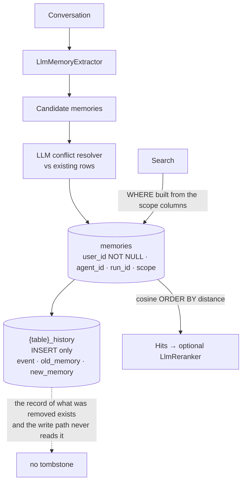

## 1. Executive Summary

Mem0Sharp is a **reimplementation** rather than a client. Apache-2.0, 2,982
lines of C# across `Application`, `Infrastructure`, `Intelligence`, `Transports`
and `Telemetry`, with 1,123 lines of tests beside them. It builds the
[Mem0](../mem0/) architecture — LLM extraction, LLM conflict resolution, vector
storage, graph relationships — on .NET, with Postgres/pgvector and Qdrant stores,
an in-memory store, four rerankers, an MCP server, and a decorator that wraps the
service in telemetry.

That makes it useful to this atlas in a way a port usually is not: the same
design, read twice, in two languages, by two teams.

**The `audit_log` here is the better-evidenced of the two.**
`PostgresMemoryStore` creates a `{table}_history` table beside the memory table,
indexed on `(memory_id, created_at)`, and `SaveHistoryAsync` writes through a
single `INSERT INTO {historyTable} (id, memory_id, event, old_memory,
new_memory, created_at, updated_at, is_deleted, actor_id, role)`. That column
list is [Mem0](../mem0/)'s exactly: the C# table has converged on the Python one,
adding `updated_at`, `is_deleted`, `actor_id` and `role` through
`ALTER TABLE … ADD COLUMN IF NOT EXISTS` migrations.

One `UPDATE` touches the history table in the whole repository and it is inside
that migration block —
`UPDATE {historyTableName} SET updated_at = created_at WHERE updated_at IS NULL`,
a one-time backfill so the new column can be made `NOT NULL`. No mutation path
updates or deletes a history row; the only statement that removes history is a
`TRUNCATE` of both tables together, which is a reset rather than an edit.

**And the mechanism now has a test that exercises the property, not the
function.** `tests/Mem0Sharp.Tests/PostgresHistoryIntegrationTests.cs` starts a
`pgvector/pgvector:pg17` container, creates a *legacy* history table without the
new columns, runs the migration, and asserts the legacy row survived with
`updated_at == created_at` and `is_deleted == false`. It then adds, updates and
deletes one memory and asserts the recorded sequence is exactly
`[Add, Update, Delete]`, that `is_deleted` is false, false, true across the three,
that `updated_at` is monotonic, and that `actor_id` and `role` round-trip from
the write's metadata. Very few audit logs in this atlas are tested at all, and
none of the others is tested through a schema migration.

One detail the test pins is worth carrying, because it is counter-intuitive:
`Assert.All(history, entry => Assert.Equal(history[0].CreatedAt, entry.CreatedAt))`.
Every history row for a memory shares one `created_at` — the *memory's* creation
time, not the event's. Event ordering lives in `updated_at`, and `GetHistoryAsync`
orders by `created_at, updated_at, id` accordingly. A reader querying this table
directly and sorting by `created_at` alone gets an arbitrary order within a
memory.

**The newest feature writes speculation into the same table as fact.**
`MemoryBehavior` is a four-value enum on `MemoryAddOptions` — `Normal`,
`Dreaming`, `RandomThoughts`, `PersonalMemory` — and it swaps the extraction
system prompt, and through `ForConflictResolution` the conflict-resolution prompt
as well. The whole feature is 27 lines in
`src/Mem0Sharp/Intelligence/MemoryBehaviorPrompts.cs`, which is the honest size
for what it is: a prompt switch, not a second pipeline.

The prompts are written with more care than the names suggest. `Dreaming` asks
for *"durable themes, emotional patterns, and meaningful associations, including
subtle connections that may not be explicit"* and then instructs: *"Phrase
uncertain or imaginative associations as possibilities rather than facts."*
`RandomThoughts` asks for spontaneous connections *"while keeping uncertainty
explicit"* and adds *"Do not claim invented details as facts."*
`PersonalMemory` writes in the agent's first person and adds *"Do not invent
events or user facts."* Every non-normal behaviour carries an explicit
instruction against asserting invention.

**And the row records none of it.** `Behavior` is a write-time option. It reaches
the extractor, it reaches the conflict resolver, and it reaches
`TelemetryMemoryService` as an attribute on the `mem0.add` span
(`["behavior"] = options.Behavior.ToString()`). It is not written to the memory,
to its metadata, or to the history row. So a `Dreaming` association — which the
prompt itself frames as a possibility rather than a fact — is stored as a row
with the same shape, the same scope and the same retrieval treatment as a fact
the user stated outright, and nothing downstream can tell them apart. The
telemetry knows which mode produced a write; the memory does not.

That is the atlas's recurring shape in a new place, and an unusually avoidable
instance of it: the option is already threaded through three layers, the metadata
dictionary the write already carries is `Dictionary<string, string>`, and
`actor_id` and `role` demonstrate that arbitrary keys survive into the history
row. One line at the write site would make a speculative memory legible to
everything that reads one.

Scope is the other mark and it is enforced at the schema: `user_id text NOT NULL`
with `agent_id`, `run_id` and `scope` beside it, composed into a `WHERE` clause
that travels into the get, list and vector-search queries alike. A NOT NULL user
column is a stronger commitment than most of this corpus manages — it makes an
unscoped row unwritable rather than merely discouraged.

## 2. Mental Model

Inherited from Mem0, and the atlas's criticism of the original transfers intact:
facts are LLM-extracted and stored as plain text with no representation of
uncertainty. There is no status, no confidence and no provenance chain on a row.
What decides whether an existing memory is kept, updated or removed is an LLM
conflict resolver run at write time, and its verdict is applied rather than
recorded — the history table captures that a change happened and what the text
was, not why the model thought it should.

The one thing the history table changes is that the *previous* text survives. In
a design whose central risk is an extractor overwriting a good memory with a
worse paraphrase, being able to read what was there before is a meaningful
partial answer, and it is available by query rather than by log-grepping.

## 3. Architecture

Postgres with pgvector for real deployments, an 80-line in-memory store for
tests, and a `PostgresRelationshipStores` (250 lines) for the graph side. The
layering is conventional .NET and clean: `Application/MemoryService.cs` (417
lines) holds the orchestration, `Infrastructure/` the stores,
`Intelligence/` the four LLM-facing pieces — `LlmMemoryIntelligence` (82),
`LlmReranker` (41), `LlmGraphMemoryExtractor` (26), `LlmMemoryExtractor` (24) —
and `Transports/Mcp/MemoryMcpServer.cs` (205) exposes it over MCP.

`TelemetryMemoryService` (74 lines) is a decorator around the service rather
than instrumentation threaded through it, which is the same discipline
[MateClaw](../mateclaw/) applies to retry and metrics and which most systems here
skip.

## 4. Essential Implementation Paths

- `src/Mem0Sharp/Application/MemoryService.cs` (417) — add, search, update,
  delete, and the conflict path.
- `src/Mem0Sharp/Infrastructure/Postgres/PostgresMemoryStore.cs` (326) — the
  schema, the scope predicate, the history writes.
- `src/Mem0Sharp/Infrastructure/Postgres/PostgresRelationshipStores.cs` (250).
- `src/Mem0Sharp/Transports/Mcp/MemoryMcpServer.cs` (205).
- `src/Mem0Sharp/Intelligence/` — extraction, graph extraction, reranking.
- `tests/Mem0Sharp.Tests/` — nine test classes, including
  `PostgresHistoryIntegrationTests` (the audit property, through a migration),
  `MemoryBehaviorTests`, `QdrantMemoryStoreIntegrationTests` and
  `RerankerProviderTests`.
- `src/Mem0Sharp/Intelligence/MemoryBehaviorPrompts.cs` — the four behaviours, 27 lines.
- `src/Mem0Sharp/Infrastructure/Qdrant/QdrantMemoryStore.cs` — the second real backend.

## 5. Memory Data Model

`id`, `text_value`, `user_id` (NOT NULL), `agent_id`, `run_id`, `scope`,
`metadata`, `embedding`, `created_at`, `updated_at`, `expires_at`, `hash_value`.

Four scope-ish columns is more than most, and they are hierarchical in intent —
a user owns agents, an agent has runs — though nothing in the schema enforces the
hierarchy. `hash_value` is the dedup key and `expires_at` is a TTL. Both
timestamps are record time, so no bi-temporality.

The history row is `id`, `memory_id`, `event`, `old_memory`, `new_memory`,
`created_at` — the event vocabulary plus the before and after, which is exactly
what an audit of a text-overwriting system needs.

## 6. Retrieval Mechanics

`SELECT ... 1 - (m.embedding <=> $1::vector) AS score ... ORDER BY m.embedding
<=> $1::vector LIMIT $topK`, with the scope predicate ANDed in and a guard that
rows without embeddings are excluded. Cosine nearest neighbour, nothing fused,
with an optional `LlmReranker` above it — one model call to reorder, which is
the expensive way to buy relevance and the only one on offer here.

Scope is applied on every read path traced: get-by-id, list, and vector search
each build from the same `where`.

## 7. Write Mechanics

Writes block. Extraction produces candidates, the conflict resolver decides what
to do about existing rows, the store applies it, and each application writes its
history row. Deletion exists in two forms — by id, and by the scope predicate,
which makes "forget everything for this user" a single statement. That is more
than [Mem0](../mem0/)'s reviewed contract offers and considerably more than
[ADK](../adk-python/) or [AutoGen](../autogen/) can express.

Nothing runs in the background; there is no consolidation sweep and no decay.

## 8. Agent Integration

An MCP server and a .NET library. For the .NET ecosystem specifically this is
the gap it fills — the memory systems in this atlas are overwhelmingly Python
and TypeScript, and a C# agent wanting Mem0's shape previously had a REST client
or nothing.

## 9. Reliability, Safety, and Trust

Two marks, as above.

**No tombstone.** `hash_value` is a dedup key, not a rejection record: a deleted
memory's hash is deleted with it, so the same text re-extracted inserts cleanly.
The history table knows the text was removed and nothing consults the history
table on the write path. That is the closest near-miss in this report — the
durable record of a removed value exists, and the extraction path does not read
it.

**No trust state**, so the conflict resolver's decisions are irreversible in
kind: a memory it chose to overwrite is overwritten, and the recovery path is a
human reading `_history` and re-inserting by hand.

**No bi-temporality and no human review surface.**

## 10. Tests, Evals, and Benchmarks

The test tree is 1,123 lines and is where most of this round's growth went:
`MemoryServiceTests`, `LlmMemoryConflictResolverTests`, `MemoryMcpServerTests`,
`MemoryBehaviorTests`, `ModelProviderTests`, `RerankerProviderTests`,
`OpenAiIntegrationTests`, `QdrantMemoryStoreIntegrationTests` and
`PostgresHistoryIntegrationTests`. That there is a dedicated test class for the
conflict resolver is the right instinct, since its precision is the product; that
there is now one for the history table is the more consequential addition, and
section 1 describes what it asserts.

The integration tests use Testcontainers against real Postgres and Qdrant images,
so they exercise the SQL rather than a fake. I did not run them — they need a
container runtime and, for the OpenAI suite, a key and a `testsettings.yaml`.

No benchmark, no retrieval-quality measurement and no published numbers, which
also means none of the Mem0 figures this atlas treats as unverified claims are
restated here. A port that does not inherit the original's benchmark
claims is a port making no claims, which is the correct default.

## 11. For Your Own Build

### Steal

- **Write an `event, old_memory, new_memory` row on every mutation.** Six
  columns, one insert, and it is the difference between an overwrite you can
  investigate and one you can only regret. In a design where an LLM decides what
  to overwrite, this is not optional.
- **Make the owner column `NOT NULL`.** A scope enforced by the schema cannot be
  forgotten by a caller, which is the failure mode this atlas keeps finding.
- **Support delete-by-scope, not just delete-by-id.** "Forget this user" is the
  request that arrives, and it should be one statement.
- **Wrap the service in a telemetry decorator.** Instrumentation threaded through
  business logic rots; a decorator does not.

### Avoid

- **Keeping a history nobody reads on the write path.** The record of what was
  deleted is right there, in the same database, indexed by memory. Consulting it
  before re-inserting the same text is the whole tombstone mechanism.
- **Porting an architecture without porting an evaluation.** The extraction and
  conflict-resolution quality are the product, and neither the original nor this
  reimplementation measures them.

### Fit

If you are building .NET agents and want Mem0's shape, this is the only
implementation in the atlas that gives it to you natively, and it is better
instrumented and better audited than a thin REST client would be. The Postgres
schema is sound and the MCP surface makes it reachable from non-.NET agents too.

Do not take it expecting the epistemics the original also lacks. It stores
LLM-extracted text as fact, resolves conflicts with another LLM call, and offers
no way to mark a memory doubtful — the history table is a forensic tool, not a
trust model.

## 12. Open Questions

- ~~**Does the Python Mem0 earn `audit_log` too?**~~ Re-checked on 2026-07-30:
  yes, and its history table is the richer of the two. Mem0's mark was corrected.
- **How good is the conflict resolver?** There is a test class for it and no
  measurement of its precision, which is the same gap the atlas records for
  Memanto's conflict detection.
- **Is the scope hierarchy enforced anywhere?** `user_id`, `agent_id` and
  `run_id` imply containment that the schema does not express.

## Appendix: File Index

| Path | Lines | What it holds |
| --- | --- | --- |
| `src/Mem0Sharp/Application/MemoryService.cs` | 417 | Orchestration, conflict path |
| `src/Mem0Sharp/Infrastructure/Postgres/PostgresMemoryStore.cs` | 326 | Schema, scope predicate, history writes |
| `src/Mem0Sharp/Infrastructure/Postgres/PostgresRelationshipStores.cs` | 250 | Graph side |
| `src/Mem0Sharp/Transports/Mcp/MemoryMcpServer.cs` | 205 | MCP surface |
| `src/Mem0Sharp/Intelligence/LlmMemoryIntelligence.cs` | 82 | Extraction and conflict orchestration |
| `src/Mem0Sharp/Infrastructure/InMemory/InMemoryStore.cs` | 80 | Test backend |
| `src/Mem0Sharp/Telemetry/TelemetryMemoryService.cs` | 74 | Decorator |

## History

**2026-08-03** — [`4f995e08349ebb0e0453786d5aad999737ddd239`](https://github.com/jihadkhawaja/mem0sharp/commit/4f995e08349ebb0e0453786d5aad999737ddd239) — Six commits on and roughly doubled in size. Nothing published went stale: the history table is still INSERT-only, and it has converged on Mem0's exact column list — `updated_at`, `is_deleted`, `actor_id` and `role` added by migration — so the two implementations now carry the same audit schema. The single `UPDATE` against history in the repository is a one-time backfill inside that migration. Added since: a Qdrant store and four rerankers.

**2026-07-30** — [`ebf832c17f65815dfbfa65bcf376d4dc6683f057`](https://github.com/jihadkhawaja/mem0sharp/commit/ebf832c17f65815dfbfa65bcf376d4dc6683f057) — First reading.
