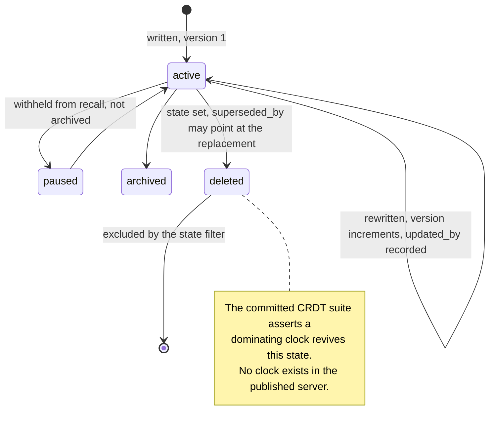

## 1. Executive Summary

mem9 is a persistent memory service for agents — "persistent memory across
sessions and machines, shared memory for multi-agent workflows, and hybrid
recall with a visual dashboard". Apache-2.0, roughly 154,000 lines, a Go server
over Postgres/pgvector with TiDB and a third backend, plus plugins for OpenClaw,
Claude Code, OpenCode and Codex.

**The finding is a mismatch between what the repository tests and what it
contains.**

`e2e/crdt-e2e-tests.sh` is a committed end-to-end suite that provisions two
agents into a shared workspace and exercises a CRDT contract in detail:

- **Test 5 — "Tombstone delete + invisible to reads"**: delete returns 204, a
  subsequent `GET` returns 404, the key is absent from search, and a repeated
  delete is idempotent.
- **Test 6 — "Tombstone revival — write after delete"**: agent B writes the same
  key with a **dominating vector clock** (`{"agent-a":3,"agent-b":1}` against the
  original's `{"agent-a":1}`), and the suite asserts HTTP 201, that the content
  is B's, that `tombstone` is now `false`, and that `GET` returns 200.
- **Test 7 — `write_id` idempotency**: a retried write with the same `write_id`
  returns a cached result with the version *not* bumped.

That is a precise and well-designed specification of a genuinely hard problem:
what "deleted" means when two agents write concurrently. And it takes a position
opposite to two other systems in this atlas — [Noosphere](../noosphere/) refuses
a revoked value on re-entry, [YantrikDB](../yantrikdb/) keeps a tombstone in the
log until every replica has seen it so a restore cannot resurrect, and mem9
treats revival by a causally-later write as **correct behaviour** and tests for
it.

**None of it is in the published server.** Searching every `.go`, `.ts` and
`.sql` file in the repository:

- `"clock"` — no match.
- `tombstone` — no match outside the e2e script.
- `write_id` — no match.
- `space_token`, `/api/spaces` — no match.
- `vclock`, `version_vector`, `lamport`, `hlc` — no match.

The `memories` table has `state`, `version INT`, `updated_by` and
`superseded_by`. There is no clock column, no tombstone field and no
space-provisioning endpoint. The server in `server/internal/` implements a
different surface: memories, tenants, webhooks, metering, uploads.

So the suite documents a contract the code here does not implement. Either the
CRDT layer is a component the project has not published, or the suite predates
or postdates the server in this tree. This report does not guess which; it
records that a reader who takes the committed tests as a description of the
committed code will be wrong, and that the CRDT semantics cannot be verified
from this repository.

## 2. Mental Model

What *is* here is a conventional multi-tenant memory service. A memory carries
content, tags, metadata, a 1536-dimension embedding, a `memory_type`
(`pinned`, `insight`, `session`), and four identity keys — `agent_id`,
`session_id`, `app_id` and the tenant — each with its own index.

`MemoryState` is `active | paused | archived | deleted`. `paused` is the
unusual one and it is a good idea: a memory temporarily withheld from recall
without being archived or deleted, which is the state most stores express as a
tag or not at all.

## 3. Architecture

A Go server with a repository interface and **three backend implementations** —
`repository/postgres`, `repository/tidb`, `repository/db9` — each with its own
schema file (`schema_pg.sql`, `schema.sql`, `schema_db9.sql`). Supporting one
storage engine well is common; supporting three behind one interface, with
parallel schemas maintained together, is a real engineering commitment and the
main thing the published tree demonstrates.

Around it: `handler`, `service`, `middleware`, `tenant`, `metering`, `metrics`,
`webhook` (with a signer and a dispatcher), `encrypt`, `embed`, `llm`,
`runtimeusage`, `reqid`.

A dashboard, a CLI, four editor plugins and a marketing site complete the tree.

## 4. Essential Implementation Paths

**Write** — handler → service → repository, incrementing `version` and stamping
`updated_by`.

**Read** — repository queries filtered by tenant and by `state`, with the
indexes on `memory_type`, `source`, `state`, `agent_id`, `session_id`, `app_id`
and `updated_at` matching the filters.

**Webhook** — `internal/webhook/`: a `service`, a `store`, a `dispatcher` and a
`signer`, so an outbound notification is signed rather than trusted.

**Metering** — `runtime_usage_outbox` as a table, i.e. the transactional-outbox
pattern for usage events, which is the correct way to emit billing events
without losing them on a crash.

## 5. Memory Data Model

Nine indexes on one table tells you the query shapes, and they are all identity
and lifecycle: type, source, state, agent, session, app, updated-at. That is a
service designed to answer "what does *this* agent know in *this* session for
*this* app" rather than "what is semantically nearest".

`superseded_by` exists as a nullable pointer and `version` as a counter, which
together give a supersession chain without a separate history table. There is no
validity interval, no confidence and no verification field.

`space_chains`, `space_chain_bindings` and `space_chain_nodes` are the tables
closest to the shared-workspace concept the e2e suite provisions against — so
the *storage* for spaces exists in the schema even where the API the suite calls
does not exist in the handlers. That is worth stating precisely rather than
inferring a conclusion from it.

## 6. Retrieval Mechanics

Hybrid recall over pgvector with the state and identity filters above, and a
dashboard for inspection.

**Scope is real and is the mark this report awards.** `tenant_id` is a predicate
in the repository queries across all three backends, and the four identity
columns are indexed. For a service that provisions agents into shared
workspaces, that layering — tenant, then app, then agent, then session — is the
right shape.

## 7. Write Mechanics

Writes are synchronous through the service layer, versioned, and attributed via
`updated_by`.

Correction is `superseded_by` plus a state change. Nothing is keyed on a
rejected value, and — given the suite's position that a dominating clock should
revive a deletion — nothing in this design would refuse a re-write even if the
clock existed. That is a coherent stance for multi-writer convergence and the
opposite stance from a privacy revocation; a system needing both would have to
distinguish "deleted because superseded" from "deleted because withdrawn", and
`MemoryState` has one value for both.

## 8. Agent Integration

Plugins for OpenClaw, Claude Code, OpenCode and Codex, a CLI, a dashboard, and
documented guides for Hermes Agent and Dify. Webhooks with a signer let external
systems react to memory events.

## 9. Reliability, Safety, and Trust

**Scope — awarded**, per section 6.

**Tombstone — no.** The word does not appear in the server. The e2e suite's
tombstone is a contract for code that is not here, and its semantics are
*revival-permitting*, which is the opposite of the mark's definition even if it
were implemented.

**Trust state — no.** `active | paused | archived | deleted` is lifecycle.

**Audit log — no.** `version` and `updated_by` on the row are the closest thing;
there is no append-only mutation record. `runtime_usage_outbox` is a billing
outbox.

**Bitemporal, human review, negative eval — no.**

**The e2e mismatch is the risk a reader most needs.** A committed test suite is
normally the most trustworthy documentation in a repository — it is executable
and it is checked. Here it describes endpoints, a request field and a response
field that no published code produces. Anyone evaluating mem9's multi-agent
convergence story on the strength of `e2e/crdt-e2e-tests.sh` is reading a
specification, not a test of this code.

## 10. Tests, Evals, and Benchmarks

**No paper.** A `benchmark/` directory and a `test-results/` directory exist in
the tree; no summary figure or scorecard was found, and the README makes no
retrieval-quality claim.

110 test files including backend integration tests. The `e2e/` suite is the one
discussed above, and it is genuinely well-written — idempotency checks, negative
assertions on search exclusion, explicit HTTP status expectations — which is why
its detachment from the server matters.

**I ran nothing.**

## 11. For Your Own Build

### Steal

- **Test what "deleted" means under concurrency, explicitly.** The three cases
  in this suite — delete is invisible to reads, repeated delete is idempotent, a
  causally-dominating write revives — are the right three questions for any
  multi-writer store, and almost nothing in this atlas asks them.
- **Add a `paused` state.** Withheld from recall, not archived, not deleted. It
  is the state a user actually wants when a memory is wrong *for now*.
- **Use a transactional outbox for usage events.** `runtime_usage_outbox` means
  a crash between the write and the emit loses nothing.
- **Sign your webhooks.** A dispatcher plus a signer, as separate modules, is
  the difference between a notification and a trusted one.
- **Index for the questions you actually ask.** Nine indexes on identity and
  lifecycle, none on content, is an honest statement that this service answers
  scope questions first.
- **Keep the schemas for every backend side by side.** Three files, maintained
  together, is what makes a three-backend repository interface real rather than
  aspirational.

### Avoid

- **Do not commit an e2e suite for an API you have not published.** A test file
  is read as executable documentation; when the endpoints, the request field
  (`clock`, `write_id`) and the response field (`tombstone`) exist nowhere in the
  code, the suite documents intentions in the present tense — the exact failure
  [Athena](../athena/) writes its labelling convention to prevent.
- **Do not use one state for "superseded" and "withdrawn".** They have opposite
  requirements: one should be revivable by a later write, the other must never
  be.

### Fit

This suits a team wanting a hosted, multi-tenant, multi-agent memory service
with editor plugins and a dashboard, and specifically one that needs more than
one storage backend.

The multi-agent convergence story — the reason to choose it over a simpler
store — cannot be assessed from this repository, and the suite that describes it
is the reason to ask.

## 12. Open Questions

- **Where is the CRDT layer?** The schema has `space_chains` and its bindings;
  the handlers have no `/api/spaces`, and no Go file mentions a clock.
- **Does the server ignore `clock` and `write_id`?** If it accepts and drops
  them, Test 6 would pass because *any* write revives, not because a dominating
  clock does — which would make a passing suite worse than a failing one.
- **What distinguishes `paused` from `archived` on the read path?** Both are
  excluded by the state filter; the difference is presumably intent, and where it
  is enforced was not traced.
- **What is in `benchmark/` and `test-results/`?** Directories with no summary.

## Appendix: File Index

**The e2e contract** — `e2e/crdt-e2e-tests.sh` (workspace provisioning `:12-25`,
Test 5 tombstone delete `:198-226`, Test 6 tombstone revival `:228-258`, Test 7
`write_id` idempotency `:260-275`), `e2e/README.md`

**Schema** — `server/schema_pg.sql:85-109` (`memories` and its nine indexes),
`server/schema.sql`, `server/schema_db9.sql`, the `space_chains` family

**Domain** — `server/internal/domain/types.go:19-27` (`MemoryState`), `:29`
(`Memory`)

**Repositories** — `server/internal/repository/postgres/`, `tidb/`, `db9/`

**Service and transport** — `server/internal/service/memory.go`,
`server/internal/handler/`, `middleware/`, `tenant/`, `reqid/`

**Operations** — `server/internal/webhook/` (`dispatcher.go`, `signer.go`,
`store.go`), `metering/`, `runtimeusage/`, `metrics/`, `encrypt/`

**Integration** — `claude-plugin/`, `openclaw-plugin/`, `opencode-plugin/`,
`codex-plugin/`, `cli/`, `dashboard/`, `skills/`

## History

**2026-08-09** — [`ee12da17e6475f1b384a7e6ab4b18d96e99dbd4f`](https://github.com/mem9-ai/mem9/commit/ee12da17e6475f1b384a7e6ab4b18d96e99dbd4f) — first reading. Screened before reading; the tree was read, never installed, and no test was run. The CRDT end-to-end suite was read, not executed, and the endpoints it drives were not found in the published server.
