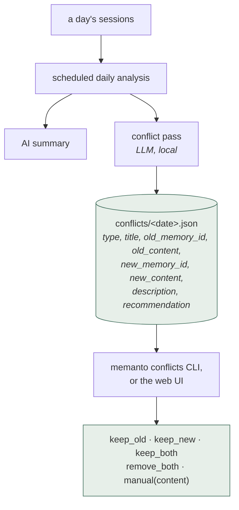
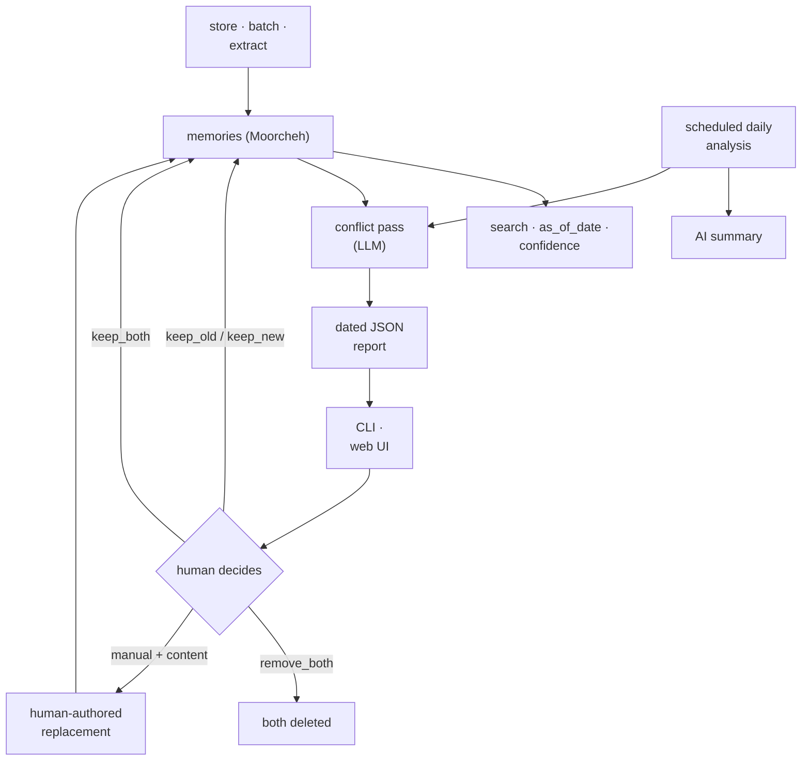

## 1. Executive Summary

Memanto is an MIT-licensed memory service — a FastAPI application, a CLI, a web
UI, and integrations for LangGraph, CrewAI, Claude Code and Hermes — with about
13,000 lines in `memanto/app/` and another 13,600 in `memanto/cli/`. Memories are
stored in Moorcheh, the vendor's vector service, which can run hosted or on-prem.

Most of that is a competent memory API. One part is not, and it closes a gap
this atlas has recorded system after system.

**Memanto resolves conflicts. Everything else only detects them.**

The atlas has found contradiction detection in several places and a resolution
path in none. [Gini](../gini-agent/) has a `conflicted` status with, in its own
report's words, no operator-facing resolution. [MateClaw](../mateclaw/) ships a
dedicated `ContradictionDetector` and nothing that says what happens next.
[Holographic](../holographic/) surfaces contradictions as an ordinary query and
only reports them. [OpenViking](../openviking/) has no conflict surface at all.
Detection is the easy half; somebody still has to decide.

Memanto's decision surface is a five-way choice:

```python
action: Literal["keep_old", "keep_new", "keep_both", "remove_both", "manual"]
```

Two of those five are the interesting ones. **`keep_both`** is an explicit "these
are both true" — the answer a binary supersede/reject model cannot express, and
the correct one whenever two memories disagree because they describe different
times, scopes, or aspects. **`manual`** hands the reconciliation to a person: the
request carries `manual_content`, and a validator refuses the action without it.

The detection pass is a scheduled local LLM call over the day's memories, writing
a dated JSON report to `~/.memanto/conflicts/`, then resolved interactively with
`memanto conflicts` or through the web UI.

Reservations. Detection is a single LLM pass whose precision is not measured
anywhere. Resolution mutates the store without recording that a value was
rejected, so `remove_both` does not stop the same content being extracted again.
And the storage layer is a vendor service — on-prem is supported, but the
retrieval quality of the thing underneath is not open to inspection on this
atlas's terms.

## 2. Mental Model



The conflict pass **writes a file and stops.** Detection is automatic, the verdict
is a person's, and the recommendation travels with the conflict rather than being
applied — which is the
[resolve, don't just detect](../../patterns/resolve-not-just-detect/) pattern with
the resolution deliberately left to a human.

The conflict vocabulary is four-way rather than binary:

| Type | Meaning |
| --- | --- |
| `contradiction` | new information contradicting an old fact |
| `update` | new memory improves or changes existing knowledge |
| `duplicate` | new memory is redundant with a historical one |
| `conflict` | semantic disagreement between new and historical |

Separating `update` from `contradiction` matters: an update is a supersession
where the old value was fine and is now stale, a contradiction means one of them
was wrong. Those deserve different dispositions, and most systems collapse them.

## 3. Architecture

- `memanto/app/` — FastAPI routes (`routes/memory.py` carries the conflict
  endpoints), models, services, and a web UI under `app/ui/`.
- `memanto/cli/` — command surface including `detect-conflicts` and the
  interactive `conflicts` resolver, plus agent auto-detection and connectors.
- `integrations/` — claudecode, crewai, hermes-agents, langgraph, mcp.
- Storage is Moorcheh via `DirectClient`, configured by `MOORCHEH_API_KEY` or
  `MOORCHEH_ONPREM_URL`.



## 4. Essential Implementation Paths

### A bounded conflict scan

The detection prompt carries four numbered instructions, and the first two are a
cost-control decision disguised as a quality one:

> "ONLY report conflicts… that involve AT LEAST ONE of the memories from the
> 'Recent Sessions Content' provided below."
> "DO NOT report conflicts that exist solely between two or more historical
> memories (Old vs Old)."

That makes the nightly pass **O(today × history)** rather than O(history²), and
it stops the job re-surfacing the same settled historical pair every night — the
failure that turns a conflict queue into noise nobody reads. It is the
[gate the expensive path](../../patterns/gate-the-expensive-path/) pattern
applied to consolidation rather than retrieval, and the reasoning is stated
rather than implied.

Instruction 4 guards a specific LLM failure:

> "NEVER report a conflict where the old_memory_id and new_memory_id are THE
> SAME. If both IDs match, that is the same memory retrieved from the knowledge
> base…"

A model asked to compare a memory against a corpus that contains it will report
it conflicting with itself. That this rule is in the prompt at all is scar
tissue, and it is the kind of detail worth copying because it is not obvious
until it happens.

### Five resolutions, and why `keep_both` matters

Every other conflict mechanism in this atlas is implicitly binary: one of the two
survives. That is wrong more often than it looks. "I work at Acme" and "I work
at Globex" conflict only if you assume one employer; "I prefer tabs" and "I
prefer spaces" conflict only if you assume one project.

`keep_both` lets the resolver say *the disagreement is not a contradiction*, and
retains both. Nothing else here can express that, which means every other system
forces a false choice or leaves the flag unresolved forever.

`manual` is the other one worth noting. Rather than choosing between two
imperfect memories, a person writes the reconciling content, with
`manual_type` optionally setting the memory type:

```python
@model_validator(mode="after")
def validate_manual_resolution(self) -> "ConflictResolveRequest":
    if self.action == "manual" and not (self.manual_content and self.manual_content.strip()):
        raise ValueError("manual_content is required when action is 'manual'")
```

Enforcing the content requirement in the model rather than in a handler means no
caller can select `manual` and supply nothing.

### The recommendation is advisory

The detector emits a `recommendation` of `keep_new | keep_old | merge |
remove_both`, and the resolver's action set is deliberately *different* — it adds
`keep_both` and `manual` and drops `merge`. The model proposes; the human
disposes, and can reach outcomes the model was not offered.

Keeping the proposal vocabulary narrower than the decision vocabulary is a small
governance idea worth stealing: it stops the model's framing from bounding the
operator's options.

### Dated, on-disk reports

Reports live at `~/.memanto/conflicts/<date>.json` rather than in the memory
store. That keeps the queue inspectable with ordinary tools, diffable, and
independent of the vector service — and it means a conflict report survives a
store migration, which the conflicts themselves may not.

## 5. Memory Data Model

A memory carries title, content, `confidence` (0–1, default 0.8), tags, type, and
session linkage, all under an `agent_id`. Reads accept an `as_of_date`.

What is absent:

- **No trust state.** Confidence is a float set at write time; nothing marks a
  memory candidate, verified, or rejected.
- **No tombstone.** `remove_both` deletes; nothing records that the value was
  judged wrong, so re-extraction from a later session can reintroduce it. In a
  system whose whole point is a nightly extraction pass, that is the gap that
  matters most.
- **No supersession chain.** After `keep_new`, nothing links forward from the old
  memory, so the history of a correction is in the dated report rather than in
  the store.
- **Confidence is not evidence.** A default of 0.8 on everything means the field
  carries little signal until something sets it deliberately.

## 6. Retrieval Mechanics

Vector search through Moorcheh with filters, a confidence-aware read path, and
an `as_of_date` parameter for temporal recall. Tests exist for filter
sanitization, temporal recall, and confidence reads.

Because the vector service is the vendor's own, ranking behaviour is not
inspectable here in the way a Postgres or SQLite system's would be. The on-prem
option (`MOORCHEH_ONPREM_URL`, with a configurable embedding provider) makes the
deployment self-hostable without making the ranking readable.

## 7. Write Mechanics

Three paths: direct store, batch write, and LLM extraction from conversation.
Batch writes return per-item results, so a partial failure is visible rather than
silent. The scheduled daily job then produces the summary and the conflict
report over what accumulated.

No write gate, actor model, or verification tier appears — as with
[Memora](../memora/), the sophistication is in what happens to memories after
they land.

## 8. Agent Integration

A FastAPI service with an MCP surface, a CLI that can detect agents already
present in a project, a web UI, and prebuilt integrations for Claude Code,
CrewAI, LangGraph and Hermes. `agent_id` scopes every route.

## 9. Reliability, Safety, and Trust

Strengths:

- **A conflict workflow that terminates in a decision**, which is unique here.
- **`keep_both`**, expressing "not actually a contradiction".
- **`manual`**, letting a person author the reconciliation, enforced at the model
  layer.
- **A four-way conflict vocabulary** separating update from contradiction from
  duplicate.
- **A bounded scan** that cannot re-surface settled historical pairs.
- **A self-conflict guard** in the detection prompt.
- **Advisory recommendations** with a wider decision vocabulary than the model
  is offered.
- **Dated on-disk reports**, inspectable and independent of the store.
- **`as_of_date` reads** and confidence-aware retrieval.
- **On-prem deployment** available.

Gaps:

- **Detection precision is unmeasured.** One LLM pass decides what a human is
  asked to adjudicate; false negatives never reach the queue and nothing counts
  them.
- **No tombstone**, so `remove_both` is undone by the next extraction.
- **No supersession chain** in the store after a resolution.
- **Confidence defaults to 0.8** everywhere and is not derived from anything.
- **Vendor storage**, so ranking is not reviewable on this atlas's terms.
- **A queue that is only as good as its drain rate** — nothing here bounds how
  long a conflict can sit unresolved, or what retrieval does in the meantime.

## 10. Tests, Evals, and Benchmarks

The test tree is unusually on-topic: `test_conflict_manual_resolution.py`,
`test_conflict_resolution_delete_failures.py`, `test_contradiction.py`,
`test_memory_read_as_of.py`, `test_memory_read_confidence.py`,
`test_memory_read_temporal_recall.py`, `test_memory_read_filter_sanitization.py`,
plus `benchmarks/` under `examples/`.

Nothing was run for this review. The measurement the design invites and does not
have is **conflict-detection precision and recall** — of the pairs the nightly
pass reports, how many a human keeps versus dismisses, and how many real
contradictions it never surfaced. The dated JSON reports plus the recorded
resolutions are exactly the artifact needed to compute the first number, and it
does not appear to have been computed.

## 11. For Your Own Build

### Steal

- **End the conflict pipeline in a decision, not a flag.** Detection without a
  resolution surface produces a status field nobody clears. The action set is the
  cheap part; having one at all is the differentiator.
- **Include `keep_both`.** Not every disagreement is a contradiction, and a
  binary resolver forces wrong answers on the cases that are merely different.
- **Include a human-authored `manual` option**, and enforce its content
  requirement in the model rather than the handler.
- **Bound the scan to new material.** Requiring at least one side of a conflict
  to be new keeps the pass linear and stops the queue refilling with pairs
  someone already looked at.
- **Guard against self-conflict** when comparing an item against a corpus that
  contains it.
- **Keep the model's recommendation vocabulary narrower than the operator's
  action vocabulary**, so the proposal does not bound the decision.
- **Write the queue to dated files** outside the memory store, so it stays
  inspectable and survives the store.

### Avoid

- **Resolution without a tombstone**, in a system with scheduled extraction.
- **An unmeasured detector** deciding what humans are asked to adjudicate.
- **A default confidence** applied uniformly, which makes the field decorative.
- **Ranking behind a vendor boundary**, even with an on-prem option.

### Fit

Borrow:

- The whole conflict lifecycle: typed detection, dated report, five-way
  resolution, human-authored manual path.
- The bounded-scan instruction and the self-conflict guard.

Do not copy:

- Deletion as the terminal state of a rejected conflict; add a value-level
  tombstone or the next extraction undoes the resolution.
- Uniform default confidence.

## 12. Open Questions

- What fraction of reported conflicts does a human keep? The dated reports and
  recorded resolutions make this computable.
- What happens to a conflict nobody resolves — does retrieval treat both
  memories as equally current indefinitely?
- After `keep_new`, is anything written that links the superseded memory forward?
- Does `remove_both` prevent the same content returning from the next day's
  extraction?
- What sets `confidence` other than the default?

This lifecycle is generalized as [resolve, don't just detect](../../patterns/resolve-not-just-detect/).

## Appendix: File Index

- Conflict detection: `memanto/app/services/daily_analysis_service.py`
  (`generate_conflict_report`, the conflict prompt, `~/.memanto/conflicts/`).
- Conflict API: `memanto/app/routes/memory.py`
  (`/conflicts/generate`, `/conflicts`, `/conflicts/resolve`).
- Resolution model: `memanto/app/models/__init__.py` (`ConflictResolveRequest`,
  `validate_manual_resolution`).
- Interactive resolver: `memanto/cli/commands/memory.py` (`detect-conflicts`,
  `conflicts`).
- UI: `memanto/app/ui/routes/ui_router.py`.
- Configuration and backend: `memanto/app/config.py` (`MOORCHEH_API_KEY`,
  `MOORCHEH_ONPREM_URL`).

## History

**2026-07-28** — [`d1902419321352f0108c499bd8ed4ebd129fe138`](https://github.com/moorcheh-ai/memanto/commit/d1902419321352f0108c499bd8ed4ebd129fe138) — first reading.
