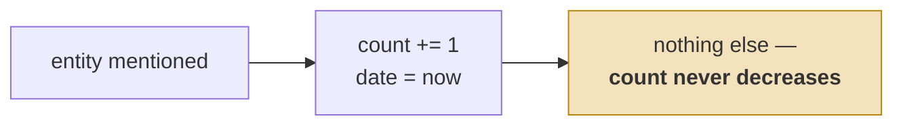
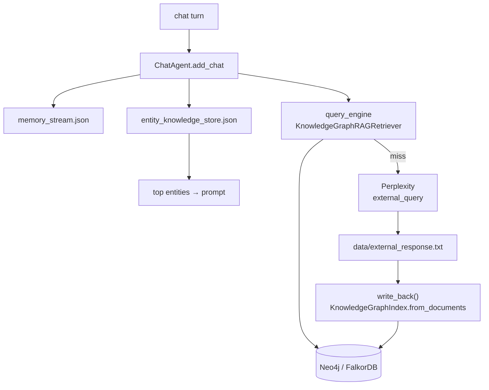

## 1. Executive Summary

Memary is a 2024-era LlamaIndex agent with a knowledge graph behind it, framed
around emulating human memory. A chat turn produces entity mentions; those
mentions accumulate into per-entity counts; the counts are meant to decide which
entities get injected into the next prompt. Underneath sits a Neo4j or FalkorDB
graph queried through `KnowledgeGraphRAGRetriever`.

It is in this atlas because it passes the inclusion test cleanly — entities
persist across sessions with stable identity in a graph and in two JSON files —
and because it is the **smallest legible implementation of reinforcement by
frequency** in the corpus. Everything the pattern needs is about forty lines of
`entity_knowledge_store.py`, which makes it a better teaching example than the
systems that bury the same idea in a scoring function.

Two things should stop a reader adopting it. The first is a defect, stated in
section 6: the one line that consumes the mention counts sorts them ascending, so
the entities injected into the prompt are the twenty *least* mentioned. The
second is architectural, in section 7: the graph is populated by feeding the
agent's own web-search output back in as triplets, with no provenance, no trust
state, and no path that removes anything from the graph afterwards.

The repository was last committed to in October 2024. Read it as a reference
implementation of an idea, not as a maintained system.

## 2. Mental Model

There are two memories, and neither one holds a fact.

| Store | Holds | Notes |
| --- | --- | --- |
| `memory_stream` | `MemoryItem(entity, date)` | append-only |
| `entity_knowledge_store` | `KnowledgeMemoryItem(entity, count, date)` | |
| knowledge graph | triplets | via LlamaIndex |

A `MemoryItem` is *"this entity was mentioned at this time"*. A
`KnowledgeMemoryItem` is *"this entity has been mentioned this many times, most
recently then"*. Neither says anything about the entity. The claims live in the
graph, and the two JSON stores are an attention model over it — which entities
are currently salient — rather than a belief store.

That is a coherent design and worth naming, because the atlas has several systems
that conflate the two jobs. Memary keeps "what do I know" and "what am I thinking
about" in different places.

The state machine is one transition wide:



The counter is monotonic, so an entity that mattered once keeps its weight
forever. There is no decay and no way to say a topic has stopped being
relevant.

`remove_old_memory(days)` filters the *mention stream* by cutoff date, and
`remove_memory_by_index` / `clear_memory` operate on the in-process lists. None
of them touches the graph. So a triplet, once extracted, is permanent.

Memory is fully **automatic**. Nothing asks the model whether a mention is worth
keeping, and there is no surface on which a person adjudicates.

## 3. Architecture

A library, not a service: `ChatAgent` in `src/memary/agent/chat_agent.py`,
subclassing `Agent` in `base_agent.py`, plus a Streamlit front end.



- **Persistence** is the graph plus two JSON files whose paths are constructor
  arguments. The JSON stores are rewritten whole on every save
  (`json.dump(...)` in `BaseMemory.save_memory`).
- **Models** default to local Ollama, with `gpt-3.5-turbo` as the alternative and
  Perplexity for the external-search tool.
- **No background processing** at all. Everything happens on the chat turn.

### Deployment and ergonomics

You need a graph database running — Neo4j or FalkorDB — and a model provider.
That is a heavier ask than the store deserves, since the durable state that
Memary itself manages is two JSON arrays.

It runs fully local if you use Ollama and a local FalkorDB, and the external
search tool degrades to unavailable rather than breaking the loop. The store is
trivially human-readable and repairable: both files are indented JSON with two
fields per record, and hand-editing them is a supported-feeling operation in a way
that Cypher against the graph is not.

The pinned commit requires Python ≤ 3.11.9 per its own README, which is the
clearest signal of the repository's age.

## 4. Essential Implementation Paths

**Capture** — `chat_agent.py:38`, `add_chat(role, content, entities)`. When
entities are supplied it calls `memory_stream.add_memory(entities)`,
`save_memory()`, then `entity_knowledge_store.add_memory(memory_stream.get_memory())`
and `save_memory()` again. Two whole-file rewrites per turn with entities.

**Count update** — `entity_knowledge_store.py`, `_update_knowledge_memory()`. For
each incoming item it scans the existing list for `entity.entity == item.entity`,
adds the count and refreshes the date, or appends. Exact string equality, no
normalization, linear scan.

**Graph write** — `base_agent.py:233`, `write_back()`. Reads
`data/external_response.txt` and calls `KnowledgeGraphIndex.from_documents(...,
max_triplets_per_chunk=8)`. This is the only path that adds to the graph.

**The recall-miss loop** — `check_KG(query)` (line 244) queries the graph and
returns false when there is no `kg_rel_map`; `search()` (line 172) falls through
to `external_query()` on an empty response, which asks Perplexity. The answer is
written to the file that `write_back()` ingests. The loop is: *fail to remember →
ask the web → believe the answer permanently*.

**Retrieval and injection** — `_select_top_entities()` (line 261) and
`_change_llm_message_chat()` (line 278). The selected entities are appended to the
prompt as a message whose content is the literal string
`"Knowledge Entity Store:" + str(top_entities)`.

**Schema** — `src/memary/memory/types.py`, two dataclasses, forty lines including
the serializers.

**Tests** — `dev/KG_memory_stream/tests/`, covering the two JSON stores only.

## 5. Memory Data Model

Two dataclasses is the whole model:

```python
@dataclass
class MemoryItem:            entity: str; date: datetime
@dataclass
class KnowledgeMemoryItem:   entity: str; count: int; date: datetime
```

There is no id, no source, no scope, no confidence, no validity interval, and no
link from either record to the graph triplet it came from. The entity string *is*
the key, which means the identity of a memory is a name produced by an extractor —
"Paris" and "paris" are two entities, and there is no `canonical_text()` seam of
the kind [Verel](../verel/) hardened.

Scoping deserves a precise statement because it is a near-miss rather than an
absence. With FalkorDB, `base_agent.py:87` constructs
`FalkorDBGraphStore(self.falkordb_url, database=user_id)` — a *separate database
per user*, which the README presents as the multi-agent story. That is real
isolation, and it is stronger than a filter in one sense: there is no query that
can cross it. It is not what this atlas marks as `scope_enforced`, for two
reasons. It is physical separation chosen at construction time rather than a
stored scope key applied on the read path, so nothing scopes the two JSON files
that sit beside the graph; and the Neo4j branch three lines below has no
equivalent, so the property is a function of which backend you picked.

The `count` field is the only thing resembling trust, and section 6 explains why
it does not work.

## 6. Retrieval Mechanics

Two retrievals happen per turn and they are not fused.

The graph is queried through LlamaIndex's `KnowledgeGraphRAGRetriever` wrapped in
a `RetrieverQueryEngine`, with a hand-built Cypher helper (`generate_string`)
producing `MATCH p = (n) - [*1 .. 2] - () WHERE n.id IN [...] RETURN p` — a
two-hop neighbourhood around the named entities.

Separately, `_select_top_entities()` picks entities from the knowledge store and
injects them into the prompt. **This is where the defect is.** The method is:

```python
entity_counts = [entity["count"] for entity in entities]
top_indexes = np.argsort(entity_counts)[:TOP_ENTITIES]
return [entities[index] for index in top_indexes]
```

`np.argsort` returns indices that sort **ascending**, so `[:20]` takes the twenty
*lowest* counts. Given counts `[5, 1, 9, 3]`, `np.argsort(...)[:2]` yields indices
`[1, 3]` — the entities mentioned once and three times, not nine and five. The fix
is `[::-1]` or `np.argsort(-counts)`; as written, the accumulated mention count —
Memary's only ranking signal, and the whole point of the entity knowledge store —
selects against itself.

This is worth dwelling on beyond the bug, because it generalizes. The count is
computed correctly, persisted correctly, and displayed in the logs, and nothing
anywhere asserts a relationship between a high count and being selected. A
reinforcement mechanism with no test over its consumer is indistinguishable from
a decorative one, and this repository is the proof.

The other failure mode is inherent to the design: injection is unconditional and
unranked by relevance. Twenty entities go into every prompt whether or not the
turn has anything to do with them — there is no
[gate on the expensive path](../../patterns/gate-the-expensive-path/), and no
notion of a turn that needs no memory.

## 7. Write Mechanics

Writes are synchronous, cheap, and unfiltered. `add_chat` appends every supplied
entity with `datetime.now()` and rewrites both JSON files. There is no
deduplication beyond the count merge, no extraction gate, and no LLM in the
mention path at all — which makes the mention stream an unusually clean
[zero-LLM capture](../../patterns/zero-llm-capture/) instance, whatever else is
wrong here.

The graph write is the opposite, and it is the part to be careful with. The only
thing that ever enters the graph is the text of a Perplexity answer, ingested by
`KnowledgeGraphIndex.from_documents` and turned into up to eight triplets per
chunk. So Memary's long-term factual store is populated exclusively by
**unverified external web search, triggered by its own recall failures**, with no
record of which query produced which triplet and no way to remove one afterwards.

Correction does not exist. There is no supersession, no contradiction detection,
no delete path into the graph, and the JSON-side removals are index- and
age-based rather than content-based. A wrong triplet is permanent for the lifetime
of the database.

### Operational cost

- **Synchronous?** Yes for mentions, and they are model-free, so the cost is two
  file writes.
- **Lag?** None. A mention is retrievable immediately.
- **Whole-store passes?** No background pass, but note that every turn with
  entities serializes **both entire JSON files** — cost grows linearly with the
  store on every write, which is fine at demo scale and is the usual reason the
  atlas flags [flat JSON as a prototype store](../../compare/#flat-json-as-a-prototype-store).
- **Read path?** Twenty entities plus the graph query result, every turn,
  unbounded by tokens and inserted ahead of the conversation — so it invalidates
  the prompt prefix on each turn.

## 8. Agent Integration

`ChatAgent` is the surface: instantiate it, call `add_chat`, register tools with
`add_tool` / `remove_tool`. Tools are ordinary Python callables with docstrings,
and the shipped set is `search`, `vision`, `locate`, `stocks`.

There is no MCP server, no REST API, and no persistence adapter, so using Memary
from a non-Python agent means reimplementing it. The two JSON files are a
sufficiently simple contract that this is realistic — which is the honest way to
adopt what is good here.

The model has no agency over memory. It cannot save, forget, or correct; entities
are supplied by the caller of `add_chat`.

## 9. Reliability, Safety, and Trust

The trust model is frequency, and section 6 shows the one consumer of it is
inverted.

Provenance is absent in both directions: a `KnowledgeMemoryItem` does not say
where its mentions came from, and a graph triplet does not say which external
query produced it. That combination makes the `write_back()` path the most
concerning thing in this report. An attacker who can influence what the web says
about a topic the agent will ask about can write durable triplets into the graph,
and there is no mechanism that would ever remove them or mark them as
lower-trust than something the user said directly.

Concurrency is unguarded. Two `ChatAgent` instances over the same file paths will
clobber each other's stores, because `save_memory` rewrites the whole file with
no locking or read-modify-write check.

There is no backup, sync, or replication story, and no way to represent
uncertainty.

## 10. Tests, Evals, and Benchmarks

The shipped package has **no tests**. `dev/KG_memory_stream/tests/` contains
`test_memory_stream.py` and `test_entity_knowledge_store.py`, which exercise
loading, adding, and saving the two JSON stores against a fixture — real tests,
but of the serialization layer, and living in a development sandbox rather than
beside the code that ships.

Nothing tests `_select_top_entities`, which is how a one-character sort-direction
error survives in the function that decides what the model sees.

`dev/recursive_retrieval/benchmarking/` holds two notebooks comparing Ollama and
Perplexity outputs. No scored results are committed, and there is no harness for
any public memory benchmark. The survey that prompted this review lists Memary
with an empty evaluation column, which matches what is in the repository.

The tests I would want first: an assertion that a high-count entity appears in
`_select_top_entities` output, and one that two spellings of the same entity name
do not create two records.

## 11. For Your Own Build

### Steal

- **Separate "what I know" from "what I am attending to."** The graph holds
  claims; the entity store holds salience. Keeping them in different structures
  means you can rebuild attention without touching belief, and it is a
  distinction several larger systems in this atlas never draw.
- **Make the salience model small enough to read.** Forty lines and two fields is
  enough to implement reinforcement by frequency, and being able to read the whole
  mechanism on one screen is worth more than a tuned scoring function you cannot
  audit.
- **Capture without a model.** Mentions are appended with no LLM call, so capture
  cannot fail because a provider is down.

### Avoid

- **Do not let a recall miss become a write.** "The graph did not know, so ask the
  web and ingest the answer" turns every gap into a permanent unverified belief.
  If you must do it, mark the provenance and give the resulting rows a trust state
  you can filter on later — the [trust-state machine](../../patterns/trust-state-machine/)
  exists for exactly this.
- **Do not ship a ranking signal with no test on its consumer.** The count is
  correct everywhere except the line that uses it. A single assertion that "the
  entity with the highest count is in the selected set" would have caught it, and
  the same assertion is cheap in any system that ranks.
- **Do not use an extractor's output string as a primary key.** Entity identity by
  raw string means casing and spelling variants fragment the store, and there is
  no later point at which they can be merged.
- **Do not rewrite the whole store on every turn.** It is fine until it is not,
  and the failure is a slow one that arrives after the design has hardened.

### Fit

Memary suits someone learning how a graph-backed agent memory fits together, or
someone who wants the salience idea and intends to write the rest themselves. As a
reference it is genuinely clear: small, readable, and honest about being a
demonstration.

It does not suit production use, and the reason is not the bug — bugs get fixed.
It is that the design has no place to put a correction. A wrong triplet cannot be
removed, a wrong entity name cannot be merged, and the store's only quality signal
counts mentions rather than accuracy. Anyone who needs to answer for what the
system believes should treat this as a diagram rather than a dependency.

Walk away if you were considering it as a maintained option. The last commit is
October 2024 and the README pins Python at ≤ 3.11.9.

## 12. Open Questions

- **Is the `_select_top_entities` inversion known upstream?** Issue and PR history
  was not read, and the repository's activity makes a fix unlikely either way.
- **Was the FalkorDB per-user database intended as the scope model,** or as a
  multi-agent demo? The README presents it as the latter and the code supports
  both readings; the Neo4j branch has no equivalent, which suggests it was not a
  cross-cutting decision.
- **Does anything ever call `remove_old_memory`?** It is defined on the base class
  and no caller was found in `src/`.
- **What happens to the graph across runs with the same database?** Triplets
  accumulate with no dedupe path found, but the LlamaIndex layer may merge them;
  that behaviour lives outside this repository.

## Appendix: File Index

**Storage/schema** — `src/memary/memory/types.py`,
`src/memary/memory/base_memory.py`

**Write path** — `src/memary/agent/chat_agent.py` (`add_chat`),
`src/memary/memory/memory_stream.py`,
`src/memary/memory/entity_knowledge_store.py`

**Retrieval path** — `src/memary/agent/base_agent.py`
(`generate_string`, `search`, `check_KG`, `_select_top_entities`,
`_change_llm_message_chat`)

**Graph write** — `src/memary/agent/base_agent.py` (`external_query`,
`write_back`)

**Tools** — `src/memary/agent/llm_api/tools.py`,
`src/memary/synonym_expand/synonym.py`

**Tests** — `dev/KG_memory_stream/tests/test_memory_stream.py`,
`dev/KG_memory_stream/tests/test_entity_knowledge_store.py`

## History

**2026-07-29** — [`b2331a2c0844d66f69acd607b9e4dbaba56552c1`](https://github.com/kingjulio8238/Memary/commit/b2331a2c0844d66f69acd607b9e4dbaba56552c1) — first reading.
