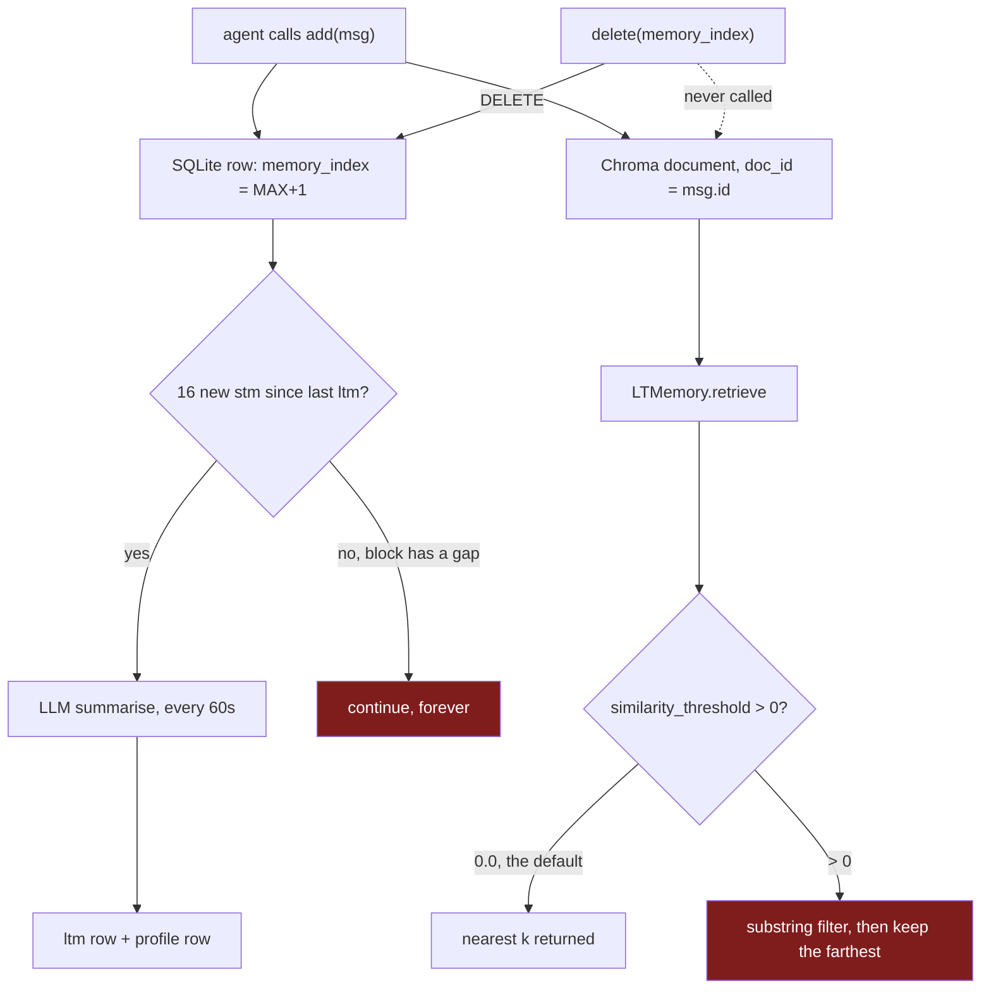

## 1. Executive Summary

Membase is a decentralised memory layer for agents: conversation history and a
vector knowledge base held locally and mirrored to a remote hub, with every hub
call signed by the caller's Ethereum key. About 1,800 of its 5,800 Python lines
are the memory package; a comparable amount is on-chain task coordination that
has nothing to do with memory.

The best idea in the repository is in `src/membase/storage/hub.py`. Every
upload's `owner` field is forced to the address recovered from the caller's
signing key, and a caller who passes some other owner gets a loud warning rather
than a silent success, because the hub now `401`s when `owner != signer`
(`_coerce_owner`, `src/membase/storage/hub.py:18`). Ownership is possession of a
key, not a string in a payload. That is the same instinct as [Aukora
Kernel](../aukora-kernel/)'s reader proof-of-possession, applied to writes.

The worst is one line away from being invisible. `ChromaKnowledgeBase.retrieve`
reads Chroma's `distances` array into a variable named `similarity` and then
drops every result below the caller's threshold
(`src/membase/knowledge/chroma.py:315`). Chroma returns a **distance**, where
smaller means closer. So raising `similarity_threshold` to demand better matches
discards the closest documents and keeps the farthest. The same array is read
correctly, as a distance, by `evaluate_document` a hundred lines further down
the same file (`src/membase/knowledge/chroma.py:450`), where `score < 0.2` means
"near enough to be a duplicate". One file, one field, two opposite readings.

A second line compounds it. When `similarity_threshold > 0` and no content
filter is set, `retrieve` adds `where_document: {"$contains": query}`
(`src/membase/knowledge/chroma.py:306`). Asking for a quality bar therefore
silently converts semantic search into a literal substring match on the entire
query string, and then applies the inverted distance test to whatever survives.
At the default of `0.0` — which is what `LTMemory.retrieve` passes unless a
caller overrides it — neither path fires, and the search behaves as expected.
The failure is opt-in, and it is opted into by the parameter whose documented
purpose is to make results better.

The third finding is about forgetting. `SqliteMemory.add` inserts each message
into SQLite *and* into the Chroma collection
(`src/membase/memory/sqlite_memory.py:97`). `SqliteMemory.delete` issues a
`DELETE` against SQLite alone (`src/membase/memory/sqlite_memory.py:152`).
`ChromaKnowledgeBase.delete_documents` exists and has a passing test
(`tests/test_chroma.py:167`), and no memory class in the repository calls it. A
deleted message vanishes from every listing and stays in the index that
`LTMemory.retrieve` actually queries.

One thing to know before installing: `README.md:271` states "MIT License. See
`[LICENSE](./LICENSE)` for details." and links to a file that is not in the
repository at this commit. The licence is asserted and absent, which is a worse
position for a reader than a licence merely missing, because the README gives a
grant the repository does not.

## 2. Mental Model

Two memory stacks live in the same package and do not share a base class.

**The buffered stack** — `BufferedMemory` is a Python list, `MultiMemory` is a
dictionary of them keyed by `conversation_id`. Nothing is summarised, nothing is
retrieved by content; you read the last *n* messages or filter them with a
predicate. Durability is the hub upload.

**The SQLite stack** — `SqliteMemory` is one table plus one Chroma collection
under `~/.membase/<account>/`, and `LTMemory` wraps it with a background thread
and a profile. This is the stack with an epistemic story, and it is a
promotion ladder rather than a state machine. A message arrives as `stm`. Every
sixteen consecutive `stm` messages are handed to an LLM that returns a summary,
stored as one `ltm` message; the same block is handed to a second prompt that
rewrites the account-wide `profile`. Nothing is ever demoted, contradicted or
retired: `ltm` and `profile` rows accumulate, and reads take the most recent one
(`LTMemory.get`, `src/membase/memory/lt_memory.py:93`).

The summariser asks for far more structure than the system keeps. Its prompt
demands a JSON object with a `summary`, three to eight `keywords`, a
five-dimension `analysis`, and a `memory_level` from 1 (discard: small talk) to
5 (knowledge: principles and deep insight)
(`src/membase/memory/lt_memory.py:380`). It closes by warning the model that
output which cannot be parsed by `json.loads` "will be judged an invalid result"
(`src/membase/memory/lt_memory.py:430`). Nothing judges it. The response is
stripped of code fences and stored whole as the `content` of a `Message`
(`src/membase/memory/lt_memory.py:360`); `memory_level` appears exactly twice in
the repository, both times inside the prompt string. The grading exists as an
instruction to a model and never as a field anything can filter on.



The two red boxes are the report. The dotted edge is the third finding: delete
reaches the record and not the index.

## 3. Architecture

An operator running the SQLite stack needs four things.

**A wallet.** `MEMBASE_ACCOUNT` is a `0x` address and `MEMBASE_SECRET_KEY` its
32-byte private key. `src/membase/storage/_auth.py` builds every hub header as
`sha256(hash_label || uint64_be(unix_seconds))` signed over secp256k1, packed as
compact JSON with the address, timestamp, digest and 65-byte signature. There is
no nonce; freshness is the timestamp, so the replay window is whatever clock
skew the hub tolerates — a server-side property this repository cannot answer.

**An OpenAI key.** `src/membase/memory/lt_memory.py:20` reads `OPENAI_API_KEY`
at module scope and calls `exit(1)` when it is unset. That is a library module:
`from membase.memory.lt_memory import LTMemory` terminates the importing process
rather than raising something a caller could catch. The buffered stack does not
have this problem, because it does not import OpenAI at all.

**Local disk.** `~/.membase/<account>/sql.db` and `~/.membase/<account>/rag`,
created on construction. The Chroma collection is named `<account>_memory`, so
one account is one embedding space regardless of how many conversations it
holds.

**A hub.** `MEMBASE_HUB` defaults to `https://testnet.hub.membase.io`
(`src/membase/storage/hub.py:273`). The default durable store for a memory
system is a testnet endpoint, and a testnet endpoint is not a durability
promise.

The `chain/` package — roughly the same size as `memory/` — registers agents on
an EVM chain and settles collaborative tasks. It shares the wallet with the hub
auth and touches no memory path. A reader here can ignore it, which is worth
saying plainly: the on-chain identity in the README's first feature bullet is
not what scopes a memory.

## 4. Essential Implementation Paths

| Path | Location |
| --- | --- |
| Owner forced to signer on every upload | `src/membase/storage/hub.py:18` |
| Signed auth header construction | `src/membase/storage/_auth.py` |
| `exit(1)` at import when no OpenAI key | `src/membase/memory/lt_memory.py:20` |
| Background summarisation loop | `src/membase/memory/lt_memory.py:299` |
| Long-term memory prompt, `memory_level` 1–5 | `src/membase/memory/lt_memory.py:380` |
| Row insert plus Chroma insert | `src/membase/memory/sqlite_memory.py:59` |
| Delete by index, SQLite only | `src/membase/memory/sqlite_memory.py:152` |
| Distance read as similarity | `src/membase/knowledge/chroma.py:315` |
| Threshold turns search into `$contains` | `src/membase/knowledge/chroma.py:306` |
| Distance read as distance | `src/membase/knowledge/chroma.py:450` |
| Hub blob keyed on list position | `src/membase/memory/buffered_memory.py:104` |
| `clear()` rotates the conversation id | `src/membase/memory/buffered_memory.py:284` |

## 5. Memory Data Model

One table carries everything
(`src/membase/memory/sqlite_memory.py:46`):

```sql
CREATE TABLE IF NOT EXISTS memories (
    id TEXT PRIMARY KEY,
    conversation_id TEXT,
    content TEXT,
    memory_index INTEGER,
    upload_status INTEGER DEFAULT 0,
    created_at TIMESTAMP DEFAULT CURRENT_TIMESTAMP,
    memory_type TEXT
)
```

`content` is the entire serialised `Message` as JSON, so the columns are an
index over a blob rather than a decomposition of it. `memory_type` is one of
`stm`, `ltm`, `profile`, and `memory_index` is `MAX(memory_index) + 1` within a
`(conversation_id, memory_type)` pair — a per-partition sequence, not a global
one.

`created_at` is the only time in the schema and it is record time. When a fact
was true is not represented anywhere, which is the ordinary answer in this
corpus and the reason `bitemporal` is withheld.

The insert is `INSERT OR REPLACE` on the primary key. Re-adding a `Message` with
an id already present deletes the old row and writes a new one at the *end* of
the sequence, so an identical id changes a memory's position in the ordering
that the summariser reads by.

There is no schema for correction. No status field, no supersession pointer, no
record that a value was ever rejected — hence no `tombstone` and no
`trust_state`. The nearest thing is `memory_level`, and as section 2 sets out,
it is never parsed out of the summary text.

## 6. Retrieval Mechanics

Three read paths exist and only one of them is semantic.

`SqliteMemory.get(conversation_id, recent_n, filter_func, type)` orders by
`created_at DESC`, applies `LIMIT`, reverses in Python, and then runs
`filter_func` over the result (`src/membase/memory/sqlite_memory.py:129`). Note
the order: the limit is applied in SQL and the predicate in Python, so
`recent_n=1` with a filter can return nothing when a matching row exists two
places back. The background summariser depends on this method's filter form to
pull an index range.

`LTMemory.get(..., include_ltm, include_profile)` prepends the newest `ltm` and
`profile` rows to the recent `stm` window
(`src/membase/memory/lt_memory.py:93`). This is the assembly an agent would use:
profile first, long-term summary second, then recent turns.

`LTMemory.retrieve` delegates to Chroma
(`src/membase/memory/lt_memory.py:275`), and this is where the two defects in
section 1 land. It is also the only path that crosses conversations: the
collection is per account, and `metadata_filter` is optional, so the default
`retrieve` returns matches from every conversation the account holds. The
conversation key is present in metadata and applying it is the caller's
responsibility.

The `scope_enforced` mark rests on the account, not the conversation. Every hub
read passes `self._membase_account` as the owner
(`src/membase/memory/lt_memory.py:214`), and the local database path itself is
`~/.membase/<account>/`, so the account key reaches the query on both storage
tiers. Per the flag's definition, that certifies the key reaches the read — not
that a caller cannot widen it, and here a caller plainly can, by passing a
different owner to `hub_client.get_conversation`.

`find_optimal_threshold` (`src/membase/knowledge/chroma.py:381`) sweeps
thresholds from 0.3 to 0.9 and recommends the one where the result *count*
changes least between adjacent steps. Since it calls the same broken `retrieve`,
the flattest region is typically where the substring filter has already emptied
the result set, and the "balanced" recommendation is then the threshold at which
nothing comes back twice in a row.

## 7. Write Mechanics

Writes block the agent. `SqliteMemory.add` opens a connection, loops the
messages, inserts each into SQLite and — unless the id is already present —
embeds it into Chroma, commits, and then, when `auto_upload_to_hub` is set,
opens a second connection and uploads each blob to the hub before returning
(`src/membase/memory/sqlite_memory.py:59`). Embedding and a network round trip
happen on the caller's thread. A memory is retrievable the instant `add`
returns; there is no indexing lag because there is no queue.

Long-term memory is the only asynchronous part. One daemon thread per
`LTMemory` wakes every 60 seconds, and for each conversation compares the newest
`stm` index against the newest `ltm` index. When a full block of sixteen has
accumulated it pulls exactly that index range and summarises
(`src/membase/memory/lt_memory.py:299`). Nothing rewrites the whole store; each
pass appends one `ltm` row and one `profile` row.

That block is fetched by index range and then checked:

```python
if len(stm_list) < stms_per_ltm:
    print(f"not enough stm to summarize ltm for {conv_id} at {last_ltm_index + 1}")
    continue  # 理论上不会发生，保险起见
```

The comment says the branch cannot happen and is kept for safety. It can happen,
and it is not safe. `delete` removes rows by `memory_index` without renumbering,
and `add` continues from `MAX + 1`, so a single deletion inside a sixteen-message
window leaves that block permanently short. `last_ltm_index` never advances past
it, the same doomed range is re-fetched every 60 seconds, and long-term
summarisation for that conversation stops for good — while short-term messages
keep accumulating and the thread keeps looking busy. Deleting one message is
enough to end a conversation's long-term memory.

`llm_summarize_ltm` returns `None` when the OpenAI call raises
(`src/membase/memory/lt_memory.py:363`), and `SqliteMemory.add` returns early on
`None` (`src/membase/memory/sqlite_memory.py:62`). A failed summary is therefore
retried on the next tick, which is the right behaviour and appears to be
accidental — the paired `llm_summarize_profile` has no `try` at all, so an
exception there kills the daemon thread silently and leaves the process
otherwise healthy.

The buffered stack writes differently and worse. Its hub key is the message's
*position* in the list:

```python
memory_id = self._conversation_id + "_" + str(len(self._messages)-1)
```

(`src/membase/memory/buffered_memory.py:104`). `BufferedMemory.delete` compacts
the list without touching the hub, so after deleting one message the next append
computes a key that a still-live message already occupies, and the upload
overwrites a different message's blob. Reload from the hub then resurrects the
deleted message under its old key and loses the overwritten one. The SQLite
stack avoids this exactly because `memory_index` comes from `MAX + 1` rather
than from a length.

`BufferedMemory.clear` assigns itself a fresh UUID conversation id
(`src/membase/memory/buffered_memory.py:284`) while `MultiMemory` keeps the
buffer under the old dictionary key
(`src/membase/memory/multi_memory.py:127`). After clearing a conversation, its
local name and the name its uploads are filed under diverge, and
`get_all_conversations` reports the name that is no longer being written to.

## 8. Agent Integration

There is none in this repository. No agent loop, no tool definitions, no MCP
server, no prompt assembly beyond the two summarisation templates. Membase is a
library an agent framework imports, and the composition — profile, then
long-term summary, then recent turns — is available through
`LTMemory.get(include_ltm=True, include_profile=True)` but is never performed
here.

That is a defensible boundary, and it means the integration column in the matrix
is a statement about scope rather than a gap. It also means every claim in the
README about agent behaviour is a claim about software that lives elsewhere.

## 9. Reliability, Safety, and Trust

Trust in Membase is about *who wrote a memory*, never about *whether it is
true*.

The who is handled unusually well. `_coerce_owner` will not let a caller file a
memory under someone else's address; it overrides and logs a warning naming the
legacy behaviour it is replacing (`src/membase/storage/hub.py:18`). Every
request carries a signature over a timestamped digest. Compared with the common
pattern in this atlas — a `user_id` string that any caller may set to any value
— this is a real improvement, and it costs the operator a key rather than an
identity service.

The whether is absent. Nothing marks a memory as unverified, contradicted or
withdrawn. The summariser is asked to grade importance 1–5 and its grade is
never read. Two `ltm` rows that contradict each other both persist, and the
newer wins by recency alone.

Two failures are worth an operator's attention beyond those already covered.
`print` is used for operational logging throughout — `add memory:` prints every
message's full content, and `ltm:` prints the entire generated summary
(`src/membase/memory/sqlite_memory.py:70`, `src/membase/memory/lt_memory.py:359`).
Conversation content lands on stdout regardless of log level. And
`SqliteMemory.load` and `SqliteMemory.export` are inherited docstrings that were
never adapted: both call `self.clear()`, `self.add(...)` and `self.get()`
without the `conversation_id` those methods require
(`src/membase/memory/sqlite_memory.py:203`), so both raise `TypeError`
unconditionally. Export and import do not work on the stack that has the
database.

## 10. Tests, Evals, and Benchmarks

There is no CI configuration in the repository. Nine test files exist; several
require live network credentials — `test_ltm.py` needs an OpenAI key and a
reachable hub, `test_trader.py` and `test_beeper.py` need a funded chain.

The test for the whole long-term memory mechanism has no assertions. It inserts
twenty question-and-answer pairs, sleeps 120 seconds, fetches the summary and
the profile, prints them, and stops the thread
(`tests/test_ltm.py:8`). Under pytest it passes when the summariser produces
nothing at all, which — given `llm_summarize_ltm` swallows its exception and
returns `None` — is a reachable outcome it cannot distinguish from success.

`tests/test_chroma.py:269` is the more instructive case. It exercises the broken
threshold and passes:

```python
results = kb.retrieve("quick brown", similarity_threshold=0.8)
assert len(results) <= 3  # Should only return very similar documents
```

The assertion is on the *number* of results, never on *which* documents came
back, and `<= 3` is satisfied by zero. A test written this way cannot fail when
the filter selects the wrong end of the distance range, and the comment records
an intent the code does not implement.

`tests/test_multi_memory.py:74` has the same shape for the conversation-id
rotation: it clears a conversation and asserts `size(conv_id) == 0`, which
passes precisely because the lookup still uses the stale key.

No negative retrieval assertions exist anywhere, so `negative_eval` is withheld.

## 11. For Your Own Build

### Steal

**Force the owner to the signer, and warn when you had to.** `_coerce_owner` is
twelve lines and it converts ownership from a claim into a proof. The warning
matters as much as the override: a caller who was relying on the old
arbitrary-owner behaviour learns it stopped working, instead of watching writes
succeed against the wrong account. Any system with a per-tenant store and a
signing key already in hand can copy this directly.

**Derive durable keys from a monotonic column, never from a length.** The two
stacks in this repository disagree on exactly this point, and the disagreement
is the whole difference between deletion being safe and deletion silently
overwriting a live record. `MAX(memory_index) + 1` scoped to a partition is the
cheap correct version.

### Avoid

**Naming a variable for the semantics you wanted.** `similarity =
results["distances"][0][i]` is the entire bug. Everything downstream reads
correctly and does the opposite of what it says, and the same file proves the
author knew the right semantics elsewhere. When a library returns a distance,
carry the word "distance" all the way to the comparison, and convert explicitly
at one named place if you want a similarity.

**Changing the retrieval strategy inside a parameter that claims to tune it.**
Setting `similarity_threshold` swaps vector search for a substring filter. A
caller reading the signature has no way to know that, and the failure looks like
the embedding model performing badly rather than like the search having been
replaced.

**Deleting from the record store and not from the index.** Once a message is in
two places, delete has to reach both or it is not delete. The Chroma delete
exists and is tested here; only the call is missing. That gap is invisible in
every listing an operator would check, because listings read SQLite.

**Sequence guards commented as unreachable.** The `continue` at
`src/membase/memory/lt_memory.py:333` is the difference between a stalled
consolidation loop and a crash that would have been diagnosed in an hour. If a
branch should be impossible, make it loud.

### Fit

Take the auth module and leave the memory. `src/membase/storage/_auth.py` and
`_coerce_owner` are the parts worth reading, and they are eighty lines that
transfer cleanly to any project already holding a wallet key.

The memory layer is not something to depend on as it stands. The retrieval
defect is silent and selects against relevance; deletion does not reach
retrieval; long-term consolidation stops permanently after one deletion; import
and export raise on the primary stack; and importing the long-term module
without an OpenAI key ends the host process. Nothing in `src/membase/memory/`
has changed since 24 July 2025, while the repository's HEAD is 10 June 2026 —
the memory package is the least active part of an otherwise moving project.

Then there is the licence. The README grants MIT and the file it points to is
not in the repository, so a reader who checks the README believes they have
rights that nothing in the tree confers. That is a question for the maintainers
rather than a defect in the code, and it is answerable in one commit.

## 12. Antipatterns / Risks

- **Inverted retrieval filter.** `similarity_threshold` keeps the farthest
  documents and drops the nearest (`src/membase/knowledge/chroma.py:315`).
- **Silent strategy swap.** Any non-zero threshold adds
  `where_document: {"$contains": query}` (`src/membase/knowledge/chroma.py:306`).
- **Delete misses the index.** `ChromaKnowledgeBase.delete_documents` is never
  called from any memory class; deleted messages stay retrievable.
- **Consolidation stalls after a delete.** An index gap makes a sixteen-message
  block permanently short (`src/membase/memory/lt_memory.py:333`).
- **`exit(1)` at import.** Importing `lt_memory` without `OPENAI_API_KEY`
  terminates the process (`src/membase/memory/lt_memory.py:20`).
- **Positional hub keys.** The buffered stack files blobs under list position,
  so delete-then-append overwrites a live record
  (`src/membase/memory/buffered_memory.py:104`).
- **Conversation id diverges on clear.** The buffer renames itself; the
  dictionary key does not (`src/membase/memory/buffered_memory.py:284`).
- **`load` and `export` raise unconditionally** on `SqliteMemory`
  (`src/membase/memory/sqlite_memory.py:203`).
- **Message content printed to stdout** on every write and every summary.
- **Licence asserted in the README, file absent from the tree.**

## 13. Build-vs-Borrow Takeaways

Borrow the eighty lines of signed ownership. Build the memory.

The design sketch is sound and unremarkable: message rows, a block-wise
summariser, a rolling profile, a vector index over the same content. Several
systems in this atlas implement that shape well —
[Second Me](../second-me/) for the profile, [Graphiti](../graphiti/) for the
temporal model that Membase's single `created_at` cannot express. What separates this
implementation from those is not architecture but the read path, and the read
path is where a memory system is judged.

For a reader building on a chain, the honest summary is that Membase solves the
identity half convincingly and the memory half is a first draft that has been
sitting untouched for a year.

## 14. Open Questions

- Does the hub bound clock skew on the timestamp in the auth digest? There is no
  nonce, and the replay window is entirely a server-side property.
- Does the hub restrict *reads* by signer the way it restricts writes?
  `get_conversation(owner, conversation_id)` takes an arbitrary owner and signs
  with the caller's key; only the hub can say whether that combination is
  refused.
- Is the LICENSE file's absence an oversight or a deliberate change? The README
  text asserting MIT is unambiguous.
- Which stack is the intended one? `MultiMemory` and `LTMemory` are both
  exported, share no base class, and disagree about durable keys.

## 15. Appendix: File Index

| File | Role |
| --- | --- |
| `src/membase/memory/memory.py` | Abstract base contract; `SqliteMemory` does not implement it |
| `src/membase/memory/buffered_memory.py` | In-process list with hub upload, positional keys |
| `src/membase/memory/multi_memory.py` | Dictionary of buffers keyed by conversation |
| `src/membase/memory/sqlite_memory.py` | SQLite table plus Chroma collection; the durable stack |
| `src/membase/memory/lt_memory.py` | Summarisation thread, profile, prompts, `retrieve` |
| `src/membase/memory/message.py` | The `Message` unit and its serialisation |
| `src/membase/memory/serialize.py` | JSON round-trip with a type hook |
| `src/membase/knowledge/chroma.py` | Vector store wrapper; both retrieval defects live here |
| `src/membase/knowledge/document.py` | Document and metadata container |
| `src/membase/storage/hub.py` | Hub client, upload queue, `_coerce_owner` |
| `src/membase/storage/_auth.py` | secp256k1 signed auth headers |
| `src/membase/chain/` | On-chain registration and task settlement; not memory |
| `tests/test_chroma.py` | Vector store tests, including the one that passes over the defect |
| `tests/test_ltm.py` | The long-term memory test, with no assertions |
| `tests/test_multi_memory.py` | Buffer dictionary tests |

## History

**2026-07-31** — [`9e03b75a453118f4faf4ed3539279435e03bd603`](https://github.com/unibaseio/membase/commit/9e03b75a453118f4faf4ed3539279435e03bd603) — first reading.
