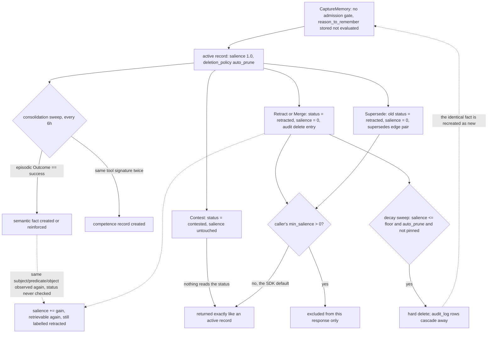

## 1. Executive Summary

Membrane is a Go memory substrate for LLM agents: six typed record classes — episodic, working, semantic, competence, plan_graph, entity — in one Postgres schema with pgvector, reachable as an embeddable library or as a gRPC daemon with TypeScript, Python and OpenClaw clients. MIT licensed. 56,752 lines of Go outside the generated protobuf package, 678 test functions, and a 680-line specification (`rfc.md`) that the code cites by section number in hundreds of doc comments.

**The typing is real, not a label.** `MemoryRecord` is one shape with a discriminated payload (`pkg/schema/memory.go:16-76`), and `Validate` refuses a record whose `Payload.PayloadKind()` disagrees with its `Type` (`:227-229`). Each class has its own lifecycle: episodic records are immutable by construction — `revision.ensureRevisable` rejects every revision operation on them (`pkg/revision/revision.go:46-54`) — and get a one-hour decay half-life, semantic records get thirty days and are the only class carrying a revision state (`pkg/ingestion/policy.go:34-43`).

**The bounding work is the part of this design to read closely.** Retrieval is capped twice — by row count and by an aggregate 16 MB projected-byte budget computed in SQL before hydration (`pkg/storage/postgres/postgres.go:723-733`) — and the service re-applies both caps in Go on the returned slice, because *"ListOptions projection fields are an optimization contract, not a trust boundary"* (`pkg/retrieval/retrieval.go:263-266`). Scope and sensitivity are filtered in the same way: a SQL predicate, then a second in-memory check. Derived records inherit the maximum sensitivity of every contributing source, and entity backreferences that a promotion made unsafe are pruned in the same transaction (`pkg/storage/derived_policy.go:73-141`).

**Correction is where the design stops short of its own vocabulary.** `RevisionStatus` is a proper three-state enum — `active`, `contested`, `retracted` — and four code paths write it. Nothing reads it. `Retract` and `Merge` also set `Salience = 0` (`pkg/revision/revision.go:77-85`), and that zero is the only thing retrieval can act on, through a `MinSalience` the caller supplies and whose default is `0` in both SDKs. The project's own lifecycle eval passes `MinSalience: 0.01` to make the retraction scenario come out right (`cmd/membrane-eval-lifecycle/main.go:326-331`). `Contest` does not touch salience at all, so a contested fact is returned exactly as an uncontested one.

**Two lifecycle interactions cut the other way and delete more than intended.** A record whose salience is zero and whose deletion policy is the default `auto_prune` is eligible for hard deletion by the decay sweep (`pkg/decay/decay.go:319-331`), so a retracted record — the one `Retract`'s doc comment says is kept *"without deleting it, preserving auditability"* — is removed at the next sweep, taking its `audit_log` rows with it through the FK cascade. And `ApplyDecay` measures elapsed time from `LastReinforcedAt`, which nothing but `Reinforce` advances, while multiplying the *already decayed* salience, so decay compounds quadratically in the number of sweeps.

**Where to be sceptical:** every claim about retrieval quality rests on an eval that needs a live embedding key, and no result file is committed to the tree. What is committed and unconditional is a large unit suite, a scope/sensitivity negative eval that runs in CI against Postgres, and a checker script with its own committed negative controls.

## 2. Mental Model

A memory is whatever an agent hands to `CaptureMemory`. There is no admission gate. The request carries a `reason_to_remember` string, which is the only field in the API that names a selectivity decision, and it is stored into the episodic environment context (`pkg/ingestion/capture.go:539`) and put into the ingest LLM prompt (`pkg/ingestion/llm.go:46`) — no branch anywhere reads it. `Classifier.Classify` picks a type from the candidate kind and `PolicyEngine.Apply` stamps a confidence from the same kind (tool output 0.9, event 0.8, observation 0.7) and a half-life from the type. Everything offered is written.

Selection happens afterwards, in two places. **Promotion** decides what becomes durable knowledge: `SemanticConsolidator` only reads episodic records whose `Outcome` is `success` (`pkg/consolidation/semantic.go:65-67`), and `CompetenceConsolidator` groups successful episodes by the exact ordered signature of their tool names and promotes a group only at `minPatternOccurrences = 2` (`pkg/consolidation/competence.go:19`, `:107-110`). **Attrition** decides what stops being retrievable: exponential salience decay per type, a 24-hour episodic compression that halves salience down to a 0.05 floor, and an auto-prune that deletes at the floor.

Epistemic status is a second, parallel axis, and it is the one that does not close. `RevisionStatus` moves on four writes — `Contest` sets `contested` (`pkg/revision/contest.go:42`), `retractRecord` sets `retracted` (`pkg/revision/revision.go:83`), `Supersede` and `markSemanticActive` set `active` (`pkg/revision/supersede.go:73`, `revision.go:95`). A search for every read of that field at the tree root returns only those writes and one erasure in `normalizeNewRecordMetadata` (`pkg/revision/audit.go:43`). No filter, no ranking term, no projection into the protobuf response consults it. What a reader sees instead is salience: `Retract` and `Merge` set it to zero, `Supersede` retracts the old record the same way, and `Contest` leaves it alone.

So a fact dies by falling below whatever `min_salience` its caller happens to pass. The Python SDK defaults that to `0.0` (`clients/python/membrane/client.py:819`) and the TypeScript SDK to `0` (`clients/typescript/src/client.ts:295`), both of which return a retracted record; the OpenClaw plugin defaults to `0.3` (`clients/openclaw/src/types.ts:47`), which does not. And the death is not stable in either direction: `reinforceSemanticFact` matches an incoming observation against existing semantic records by scope plus subject/predicate/object, without consulting revision status, and adds the reinforcement gain to a record it has not seen this source before (`pkg/consolidation/semantic_reinforcement.go:53-64`) — so a retracted fact that is observed again rises back above zero and becomes retrievable, still labelled `retracted`. If the decay sweep gets there first, the record is deleted outright and the identical fact is recreated as new.

## 3. Architecture

**One process and one database.** `membrane.New` opens a `PostgresStore`, applies `pkg/storage/postgres/schema.sql` on startup with the configured embedding dimension substituted into the `vector(…)` column, and wires ingestion, retrieval, decay, revision, consolidation and metrics against it. `membraned` adds a gRPC server on `127.0.0.1:9090` by default. Postgres with pgvector is not optional in either shape — the README says so and `check-postgres-only.sh` enforces it, failing the build on any SQLite, file-backed-store or optional-vector-index reference anywhere in the tree including the docs.

**Fifteen tables, all keyed on `memory_records(id)` with `ON DELETE CASCADE`**: `decay_profiles`, `payloads`, `interpretations`, `tags`, `provenance_sources`, `relations` (with a `UNIQUE(source_id, predicate, target_id)`), three entity indexes, `audit_log`, `competence_stats`, `trigger_embeddings` (per-record vectors despite the name, with an `ivfflat … vector_cosine_ops` index at `lists = 100`), `embedding_metadata`, and `episodic_extraction_log`. The store is ordinary SQL and inspectable by hand.

**Two background tickers, started by `Membrane.Start` and both full-store scans.** Decay defaults to one hour and consolidation to six (`pkg/membrane/config.go:121-122`); the schedulers' own fallback for a non-positive interval is one minute. `ApplyDecayAll` calls `store.List(ctx, ListOptions{})` with no limit and then issues one transaction per record (`pkg/decay/decay.go:281-301`); `Prune` lists everything again. `SemanticConsolidator` and `CompetenceConsolidator` each call `ListByType` over the whole corpus of episodic records and of their own type. Per-sweep cost therefore scales with the size of the store rather than with the day's activity, and the decay sweep issues O(records) transactions each time.

**External dependencies are narrow**: pgx, protobuf/gRPC, `google/uuid`, `yaml.v3`. Embedding and LLM providers are HTTP clients configured by endpoint and key, and everything except vector ranking and LLM extraction works without them — the selector falls back to `record.Confidence` as its applicability signal and retrieval falls back to salience ordering.

### Deployment and ergonomics

Postgres 16 with pgvector (the bundled compose file pins `pgvector/pgvector:pg16` and binds to `127.0.0.1` only), plus `make build` and the daemon binary. No API key is needed to store anything: structured capture, graph retrieval, revision and access control all run with no provider configured. An embedding provider adds automatic vector population and hybrid ranking; an LLM provider adds optional ingest interpretation and triple extraction during consolidation.

The security defaults are unusually careful for a project this size. `rejectUnauthenticatedPublicListen` refuses to start without an API key on a non-loopback listener, and `rejectInsecurePublicCredentials` refuses API-key auth over plaintext off loopback unless TLS is configured or `allow_insecure_credentials` is set (`api/grpc/authz.go:206-230`). The compose file makes `MEMBRANE_POSTGRES_PASSWORD` a required variable with `:?`, so `docker compose` fails rather than defaulting a password.

## 4. Essential Implementation Paths

**Capture.** `Membrane.CaptureMemory` → `ingestion.Service.CaptureMemoryWithAccess` (`pkg/ingestion/capture.go:150`). Sensitivity is resolved from policy before anything else so the primary record and every derived record agree; `prepareCaptureResolution` (`:194`) builds a deterministic fallback interpretation, optionally overlays an LLM `Interpret` call, fetches bounded candidate records, and optionally overlays a second `Resolve` call against those candidates. Both LLM steps swallow their errors (`if err == nil && …`) and keep the deterministic interpretation. Then one transaction wraps `captureMemory` (`:236`), which creates the primary record, resolves each mention to a canonical entity or creates one, materializes relation and reference candidates as edges, and may create a semantic record with `maybeCreateSemanticRecordWithResolutionIndex` (`:1497`). Every stage is budgeted by an explicit constant — mention count, alias count, normalized bytes, match operations — declared in one `const` block at `pkg/ingestion/capture.go:18-75`.

**Layered retrieval.** `retrieval.Service.Retrieve` (`pkg/retrieval/retrieval.go:205`) builds one `ListOptions` carrying the trust context's scopes, `IncludeUnscoped` when scopes are restricted, a max sensitivity, `MinSalience`, a candidate limit and the byte budget, and requires the store to implement `BoundedListStore` — a store that cannot bound is refused rather than scanned (`:253-256`). Results are sanitized, re-filtered by trust, re-filtered by salience when `MinSalience > 0`, re-bounded by bytes, then ranked: vector cosine when a ranker and query embedding exist, else selector-promoted, else salience.

**Graph expansion.** `Service.RetrieveGraph` (`pkg/retrieval/graph.go:47`) runs the layered retrieval for roots, adds entity roots resolved from the task descriptor through `FindGraphEntitiesByTermBounded`, reranks, and walks outgoing and incoming relations breadth-first under root/node/edge/hop limits. Trust is applied at each hop, and the code refuses to expand from a record it is only allowed to see redacted: *"would restore content removed by `Redact` and reveal private neighbors"* (`:133-134`).

**Revision.** `pkg/revision` is five files, each one transaction. `Supersede` retracts the old record, links `supersedes`/`superseded_by` both ways, appends a `revise` entry to the old and a `create` entry to the new. `Fork` leaves both active and links `derived_from`/`derived_semantic`. `Merge` retracts every source. `Retract` sets salience to zero and appends a `delete` entry. `Contest` sets the status, adds `contested_by`/`contests` edges when the reference names a stored record the caller may link to, and appends a `revise` entry. `ensureEvidence` refuses a semantic revision with neither payload evidence nor provenance sources (`pkg/revision/revision.go:58-73`).

**Decay and prune.** `decay.Service.ApplyDecay` (`pkg/decay/decay.go:26`) reads the record, computes `elapsed = now - LastReinforcedAt`, zeroes salience if `MaxAgeSeconds` has passed, applies `Exponential` to the *current* salience, writes it through `UpdateSalience` and appends a `decay` audit entry. `Prune` (`:305`) deletes every unpinned `auto_prune` record whose salience is at or below its floor and under 0.001; `deletePruned` (`:338`) appends a `delete` audit entry and then deletes the record in the same transaction, which cascades that entry away with the rest.

**Consolidation.** `Service.RunAll` (`pkg/consolidation/consolidation.go:115`) runs episodic compression, observation-to-semantic extraction, the optional LLM triple extractor, competence extraction and plan-graph extraction in sequence, aborting the whole run on the first error. The LLM extractor is the only stage with a work queue: `episodic_extraction_log` marks a record in flight with `triple_count = -1` and records the unique triple count on completion.

**gRPC.** `api/grpc/handlers.go` validates every field before touching the service — string lengths, a JSON payload byte/depth budget (`jsonPayloadBudget`), float slices for NaN and infinity, enum membership — then derives a trust context from the server policy rather than from the request, and re-authorizes every referenced record ID through a capped field-only metadata lookup (`authorizeReferencedMemories`, `:877`).

**Tests.** `pkg/*/…_test.go` run against `internal/teststore` with no database; `tests/` and `api/grpc` integration cases are gated on `MEMBRANE_TEST_POSTGRES_DSN` and run in CI with a Postgres service.

## 5. Memory Data Model

`MemoryRecord` (`pkg/schema/memory.go:16`) is the single shape: `ID`, `Type`, `Sensitivity`, `Confidence` in [0,1], `Salience` in [0,∞), optional `Scope` and `Tags`, `CreatedAt`/`UpdatedAt`, a `Lifecycle`, a `Provenance`, typed `Relations`, a discriminated `Payload`, an optional `Interpretation`, and an `AuditLog`. The Postgres schema enforces the enums as `CHECK` constraints, so an invalid type or sensitivity cannot be written even by a caller bypassing `Validate`.

**Payloads.** Semantic is subject/predicate/object with `Evidence []ProvenanceRef`, a `Validity`, a `RevisionState` and a `RevisionPolicy` string. Competence is skill name, triggers, an ordered recipe with per-step tool and validation, failure modes, fallbacks and `PerformanceStats`. Plan graph carries nodes, `data`/`control` edges and metrics. Entity carries a canonical name, typed aliases and namespaced identifiers, indexed into `entity_terms` and `entity_identifiers` with a scope column.

**Scoping** is a single free-form string per record. It is not a tenancy boundary in the sense of separate databases — one Postgres instance holds every scope — but it is a real predicate on the read path, clamped server-side against `read_scopes`/`write_scopes`. Two asymmetries matter. On reads, a record with an empty scope is visible to every trust context (`pkg/retrieval/trust.go:110`); on writes, `allowsWriteRecord` refuses an empty scope outright, with the comment saying so: *"every network mutation must name an explicitly permitted non-empty scope"* (`api/grpc/authz.go:118-131`). So the in-process library and the daemon's own consolidation can create unscoped records that every caller can then read.

**Sensitivity** is a five-level ordinal that gates reads with a one-level-above redacted view — metadata retained, payload, provenance, relations and audit log cleared (`pkg/retrieval/filter.go:51-88`). Derived records raise their sensitivity to the maximum of their sources, never lower it, and the raise is computed against a locked in-transaction reading of the source's classification rather than the snapshot the background pass carried (`pkg/storage/derived_policy.go:73-95`).

**Temporal fields** are record time only: `created_at` and `updated_at` on the row, `last_reinforced_at` on the decay profile, and a timestamp per provenance source and per audit entry. Valid time exists in the schema — `Validity{Mode, Conditions, Start, End}` with a `timeboxed` mode — and is writable over gRPC through `validityFromPB` (`api/grpc/handlers.go:1845-1861`), but every producer inside the tree writes `ValidityModeGlobal` with no window (`pkg/ingestion/ingestion.go:347`, `pkg/ingestion/capture.go:1528`, `pkg/consolidation/semantic.go:102`, `pkg/consolidation/semantic_extractor.go:322`), and a search for readers of `Validity.Start` or `Validity.End` at the tree root finds only the protobuf conversion that echoes them back out. Nothing filters or ranks on validity time.

**Correction chains** are graph edges plus payload pointers: `supersedes`/`superseded_by` as a `Relation` pair and as `RevisionState` string fields, `derived_from`/`derived_semantic` for forks and merges, `contests`/`contested_by` for contests. They are durable and queryable. What is missing is any record keyed on a *rejected value* — searches for `tombstone`, `denylist`, `blocklist`, `blacklist` and `never_reassert` across the tree return nothing — so nothing prevents a retracted subject/predicate/object from being written again.

## 6. Retrieval Mechanics

**Three arms.** A SQL candidate list ordered `salience DESC, created_at DESC, id` under the scope, sensitivity, type, tag and salience predicates; a pgvector cosine ranking over `trigger_embeddings` when an embedding provider is configured, with `SearchByEmbeddingCandidates` available so a filtered candidate set does not have to share the global vector window; and a lexical entity-term lookup that matches a normalized query term by equality or either-direction substring, ranked exact-before-contains-before-contained (`pkg/storage/postgres/postgres.go:1817-1837`). Graph expansion then walks typed relations from the ranked roots.

**Ranking** is a three-way priority in `Retrieve` (`pkg/retrieval/retrieval.go:302-312`): vector similarity for all records when a ranker and query embedding exist, with selector-chosen competence and plan_graph records promoted to the front; otherwise selector ranking; otherwise pure salience. The `Selector` scores competence and plan_graph candidates on three equally weighted signals — applicability (cosine similarity if embeddings exist, else the record's `Confidence` field as a stand-in), observed success rate from `PerformanceStats`, and a 30-day-half-life recency of reinforcement — and reports a `Confidence` that is the normalized gap between the best and second-best candidate, with `NeedsMore` set below a configurable threshold (`pkg/retrieval/selector.go:68-132`). Reporting "these two are too close to choose between" as a first-class field is a good idea; it is up to the caller to do anything with it.

**Token budgeting is byte budgeting, and it is unusually thorough.** `MaxBoundedHydrationBytes` is 16 MB; the SQL computes each candidate's projected payload and interpretation size with `octet_length` in a materialized CTE and stops accumulating IDs once the budget is exhausted, before any record is hydrated. The service recomputes projected bytes in Go over the returned slice, and a single record that cannot fit even without relations and history produces a typed `ProjectedRecordTooLargeError`. Truncation is reported to the caller as a `response_byte_limit_applied` diagnostic rather than silently.

**Retrieval is application-driven.** There is no automatic injection in the core; the OpenClaw plugin adds one by calling `retrieveGraph` on `before_agent_start` and formatting roots and neighbours into a context string.

**Failure modes.** The one worth naming is the retracted-record leak: `MinSalience` is the only mechanism that removes retracted and superseded material, its default is zero in both SDKs, and a caller who forgets it gets the wrong fact back with no signal — the returned record's `revision.status` says `retracted`, but only if the caller thinks to look, and bounded retrieval returns the payload either way. Beyond that: unscoped records join every result set; a scope-restricted query still admits them by design (`IncludeUnscoped` is set precisely when scopes are restricted); and the entity-term lookup's substring matching in both directions will pull in an entity whose canonical name merely contains a query token.

## 7. Write Mechanics

**Writes are synchronous and transactional.** `CaptureMemory` does its interpretation work first, then opens one transaction for the primary record, the entity records and every edge, so a partially resolved capture is never visible. Revision operations are one transaction each, with the explicit contract stated in every file header: *"partial revisions are never externally visible (RFC 15.7)"*.

**The agent blocks on what it configures.** With no provider, capture is a handful of Postgres round-trips. With `ingest_llm_enabled`, it is up to two LLM calls — `Interpret` and, when the interpreter also implements `CandidateResolver`, `Resolve` against fetched candidates — both on the caller's goroutine before the transaction opens. Both failures degrade to the deterministic fallback interpretation rather than failing the capture, which is the right choice.

**Retrievability lag is zero for the record itself** — it is committed and visible to the next query — and is bounded by the consolidation interval for anything derived from it: up to six hours by default before a successful episode becomes a semantic fact or a repeated tool signature becomes a competence record. Embeddings are written best-effort after the transaction (`s.embedRecord` ignores its error), so a new record can be retrievable by salience and scope for a moment before it is rankable by vector.

**Two background passes re-read the whole store.** Decay lists every record and issues one transaction per record every hour; consolidation lists every episodic record, every semantic record and every competence record every six hours. Neither is incremental except the LLM triple extractor, which has an explicit queue table. Token cost is bounded — only the extractor calls a model — but database cost scales with corpus size rather than with the day's activity.

**Deduplication** is exact-match, not semantic: `findExistingSemanticFact` looks up subject/predicate/object within a scope, and consolidation keys its index the same way. Repeat evidence for a known fact appends a provenance source and adds the reinforcement gain once per distinct source; a source already recorded is a no-op, which is what stops the six-hourly sweep from driving every fact to salience 1.0 (`pkg/consolidation/semantic_reinforcement.go:50-52`).

**Noisy or hostile input is not filtered.** There is no content policy, no injection screen, no rate limit on what a captured tool result may assert; the defences are structural — a per-request JSON byte and depth budget at the gRPC boundary, scope and sensitivity clamps on writes, and the fact that an agent cannot raise its own trust context.

### Operational cost

Per turn, the OpenClaw plugin captures on `after_agent_reply` and `after_tool_call` and awaits each capture, so a memory write sits on the agent's critical path. Injected context is bounded by `context_limit` roots (default 5) plus graph neighbours within a one-hop budget, formatted as a text block — prepended, so it does sit where a provider's prompt-prefix cache would be invalidated on every turn whose memory changed.

## 8. Agent Integration

**Four surfaces.** The Go library exposes the full `Membrane` API including the complete-record `RetrieveByID`. The gRPC service exposes eleven RPCs — `CaptureMemory`, `RetrieveGraph`, `RetrieveByID`, `Supersede`, `Fork`, `Retract`, `Merge`, `Reinforce`, `Penalize`, `GetMetrics`, `Contest` — with TypeScript and Python SDKs that validate arguments client-side before transport. The OpenClaw plugin registers three hooks and one model-facing tool, `membrane_search`. The agent harness (`examples/agent-harness`) defines five OpenAI function tools: `membrane_retrieve_graph`, `membrane_capture_fact`, `membrane_capture_working_state`, `membrane_capture_episode`, `membrane_retrieve_by_id`.

**The model gets to write and read, not to correct.** No shipped integration exposes `Supersede`, `Retract`, `Contest`, `Merge` or `Fork` as a tool — a search for `membrane_supersede`, `membrane_retract` and `membrane_contest` across the clients and examples returns nothing. Revision is an operator or application action reached through the SDK. That is a defensible trust boundary and it should be stated as one, because it means the "agents can revise" framing describes the API rather than any shipped agent loop.

**Trust is server-derived, which is the right call.** A gRPC caller supplies a `TrustContext`, and `accessPolicy.readTrust` intersects it with the server's configured policy: the sensitivity is `min(requested, policy)` and any requested scope outside `read_scopes` is a `PermissionDenied` rather than a silent narrowing (`api/grpc/authz.go:93-108`, `:141-166`). An agent cannot widen its own access by asking.

**Session lifecycle** is the working-memory type: `thread_id`, `task_state` from a five-value enum, a context summary, next actions and open questions, with a one-day half-life. There is no compaction-boundary hook; an agent resumes by retrieving its working record.

**Porting cost** is low for anything that speaks gRPC — the `.proto` is the contract and the two SDKs are thin — and the OpenClaw plugin is a readable 380-line template for a new harness.

## 9. Reliability, Safety, and Trust

**Provenance is required, not optional.** `Provenance.Sources` is populated on every write path, `ProvenanceSource` carries kind, an opaque ref, an optional content hash, a creator and a timestamp, and `ensureEvidence` refuses a semantic revision that has neither payload evidence nor provenance sources. `normalizeNewRecordMetadata` makes the operation's identity, lineage, timestamps and lifecycle authoritative while preserving the caller's attributed evidence — a caller cannot forge who performed a revision or when, only what it claims as evidence.

**The uncertainty representation is present and unused.** Confidence is a float, used by the selector as an applicability proxy. Status is a discrete state, used by nothing. The distinction the capability rubric draws — a score answers "how sure", a state answers "may this be acted on" — is exactly the one this codebase declares and does not complete: `trust_state` is withheld for that reason, not for the absence of the idea.

**The retraction-then-prune interaction is the sharpest reliability problem.** `Retract`'s contract is that the record survives for auditability. But it sets salience to zero without touching `DeletionPolicy` or `Pinned`, the ingestion default policy is `auto_prune` (`pkg/ingestion/policy.go:41`), the default decay profile's `MinSalience` floor is zero, and `Prune` deletes any unpinned `auto_prune` record at or below its floor and under 0.001. Zero satisfies both. `deletePruned` then writes an `auto-pruned: salience reached floor` audit entry and deletes the record inside the same transaction, so the FK cascade removes the entry it just wrote along with the record's entire history. The same applies to every record `Supersede` and `Merge` retract: the superseded original is deleted, and the `supersedes` relation on the survivor cascades with it.

**The decay sweep compounds.** `ApplyDecay` computes `elapsed` from `LastReinforcedAt`, which only `Reinforce` and `ReinforceFromSource` ever advance, and applies `salience * 2^(-elapsed/halfLife)` to the *current* stored salience. After *n* sweeps at interval Δ the stored value is `S₀ · 2^(−Δ·n(n+1)/(2H))` rather than `S₀ · 2^(−nΔ/H)`. At the shipped defaults — a one-hour interval and a one-hour episodic half-life — an episodic record's salience after four sweeps is 0.00098 instead of the intended 0.0625, and after six it is 4.8e-07 instead of 0.0156. Semantic records decay 1,000 times more slowly and reach the same place later, but the shape is the same. No test applies `ApplyDecay` twice to the same record, which is why the suite does not see it.

**Concurrency is handled carefully where it was thought about.** `GetDerivedDestination` reloads a record after locking its authorization metadata in the transaction, *"so a background snapshot never overwrites newer payload, evidence or labels"*, and `reinforceSemanticFact` re-derives the fact key inside the transaction and aborts with `semantic destination fact changed` if the destination moved. `ContestWithAccess` deliberately gives a denied contesting reference the same external behaviour as a missing one, *"preventing an authorization oracle while protecting the hidden record's graph"*.

**Injected false memories** are bounded by scope and sensitivity, not by content: a compromised tool result becomes an episodic record like any other, and if its outcome is `success` it becomes a semantic fact at the next consolidation with provenance pointing back at the tool. The provenance is the remedy — you can see where a fact came from — and there is no gate that would have stopped it.

**Backup, sync and replication** are Postgres's problem; the project ships nothing of its own and does not pretend to.

## 10. Tests, Evals, and Benchmarks

**678 test functions**, split between unconditional unit tests against `internal/teststore` and a `tests/` directory plus `api/grpc` integration cases gated on `MEMBRANE_TEST_POSTGRES_DSN` (`tests/integration_test.go:21-24`). A skip is not a pass, so the gate matters — and CI supplies the DSN and a Postgres service, running the gated packages explicitly (`.github/workflows/ci.yml:186-191`). Coverage is unusually broad on the security-adjacent surfaces: `value_payload_security_test.go`, `bounded_id_auth_test.go`, `referenced_auth_test.go`, `graph_redaction_security_test.go`, `graph_diagnostics_security_test.go`.

**`TestEvalTrustGating` is a real negative eval.** Three semantic records under two scopes and two sensitivities, one retrieval, and three assertions on the same populated result: the in-scope low record must be present, the high-sensitivity record must be absent, the other-scope record must be absent (`tests/eval_trust_test.go:63-71`). The positive control is what makes the two exclusions non-vacuous, and both fail if their predicate is removed.

**Two of the project's own checks carry negative controls, which is the thing that makes a checker's green result mean something.** `scripts/check-postgres-only_test.sh` copies the checker into a `mktemp` directory, writes nine distinct violating fixtures — a `storage/sqlite` import, two SQLite drivers, a `.sqlite` file reference, an `optional vector index` doc line, a stale RFC fragment — and fails if the checker exits zero on any of them, then re-runs each with `PATH=/usr/bin:/bin` to exercise the `find`/`grep` fallback when `rg` is absent. `check-go-proto-sync.sh` has a matching self-test. And `tests/compose_security_test.go:29-31` explicitly shadows `MEMBRANE_POSTGRES_PASSWORD` rather than merely unsetting it, with a comment naming the failure it is avoiding: *"Merely removing the process variable lets Compose load a local .env value and turns this negative test into a machine-dependent false pass."* That is the right instinct, written down.

**The retrieval eval is real code with no committed result.** `tests/data/recall_dataset.jsonl` holds 59 records across five types and 25 queries, each with an `expected` ID list, a `k`, a trust context and memory types; `cmd/membrane-eval` runs them and reports recall@k, precision@k, MRR and NDCG against a pure-vector baseline. Every query is a positive expectation — the dataset's key union is `expected, k, key, memory_types, text, trust, type`, with no forbidden or must-not-return field — so the dataset measures ranking quality, not exclusion.

**The lifecycle eval's retraction scenario passes a threshold the SDKs do not.** `cmd/membrane-eval-lifecycle` runs four Membrane-versus-RAG scenarios and prints win/tie/loss counts. Scenario 1 retracts a wrong fact and retrieves with `MinSalience: 0.01`, with the comment *"Membrane: respects retraction (salience=0, filtered with MinSalience)"* (`main.go:326-331`). That is an accurate description of the mechanism and also the reason the result does not generalize to a caller using the SDK default of zero. The eval needs both Postgres and a live embedding key, and `.github/workflows/eval.yml` skips the whole job when the secret is absent.

**No eval result reaches the repository.** The workflow tees its output to `eval-retrieval.txt` and `eval-lifecycle.txt`, uploads them as artifacts, and then runs an `awk` script that would splice a results table into the README — anchored on a line matching `^### Latest Results` (`.github/workflows/eval.yml:198`). A search for that string across the tree at this commit finds it only inside the workflow itself. With no anchor, `awk` reproduces the README unchanged and the commit step's `git diff --cached --quiet` finds nothing to push, so the published numbers land nowhere. Neither result file is committed, and no benchmark was rerun for this report.

**No paper.** Searches for `arxiv`, `bibtex`, `@article`, `@misc`, `citation`, `doi.org` and a `CITATION*` file across the tree return nothing. The design document is `rfc.md`, 680 lines, self-authored, and it is genuinely load-bearing: the Go source cites it by section in hundreds of comments, which makes the spec checkable against the code. It is not external validation, and the code does diverge from it — the RFC's memory model is implemented closely, but "all memory access must be auditable" is satisfied by a table that the prune path deletes.

**What is missing before trusting this.** A test that applies decay twice. A test that retrieves after `Retract` with the default `min_salience`. A test that runs a consolidation sweep after a retraction and asserts the fact stays retracted. A test that asserts audit history survives whatever lifecycle a record actually goes through.

## 11. For Your Own Build

### Steal

**Make the projection budget a storage contract, and re-enforce it above the store.** Membrane's `ListOptions` carries `Limit`, `MaxHydratedBytes`, `OmitRelations` and `OmitHistory`; the Postgres implementation computes projected sizes with `octet_length` in SQL and stops before hydrating, and the service treats all of it as advisory — *"an optimization contract, not a trust boundary"* — and re-caps the returned slice in Go. A retrieval layer that cannot be made to allocate unboundedly by a custom store or a large payload is worth the duplication.

**Monotone sensitivity for derived records, computed under lock.** When a background pass derives a fact from several sources, raise the derived record's classification to the maximum of the sources', re-read each source's authoritative label inside the transaction rather than trusting the snapshot the pass carried, and prune backreferences the promotion made unsafe. `pkg/storage/derived_policy.go` is 158 lines and worth reading whole.

**Give your own checker scripts negative controls.** A checker that has silently stopped working looks exactly like a clean tree. `check-postgres-only_test.sh` feeds its checker nine violations it must reject, in a scratch directory, including through the no-`ripgrep` fallback path. Ten minutes of work, and it converts "the check passed" from a hope into evidence.

**Report selection ambiguity as a field.** The selector returns the normalized gap between the best and second-best candidate as `Confidence` and sets `NeedsMore` when it is small. "I have two equally good procedures for this" is information the agent can act on and a bare ranked list throws away.

**Cite the spec from the code.** `// RFC 15A.3: Required field with minimum value of 1` beside the field it describes makes a written design checkable by grep in both directions.

### Avoid

**Do not encode a memory's epistemic status in a field and then enforce it with a number.** If a record can be `retracted`, some read path must filter on `retracted` — not on a salience of zero that happens to be set at the same time, and certainly not on a threshold the caller must remember to pass, whose SDK default admits the retracted record. The state and the enforcement have to be the same mechanism, or the state is documentation.

**Do not overload one value with a status meaning and a lifecycle meaning.** Salience zero here means both "this was retracted" and "this is garbage, delete it". Those want opposite treatment, and the second wins: the retraction marker is what makes the record eligible for hard deletion, and the audit history goes with it. If you use a numeric floor to drive pruning, make retraction set something else, or set `Pinned` when you retract.

**Do not write an audit row inside the transaction that deletes its own foreign key.** `deletePruned` appends `auto-pruned: salience reached floor` and then deletes the record; `ON DELETE CASCADE` removes the entry before anyone could read it. An audit of deletions belongs in a table that does not reference the deleted row.

**Do not compute decay from the last *reinforcement* while applying it to the last *computed* value.** Either recompute from an immutable baseline, or advance the timestamp you measure from. Membrane does neither, and the quadratic compounding is invisible to a suite that only ever decays each record once.

**Do not let an unscoped record be a wildcard on reads.** An empty scope readable from every context is a reasonable default only if nothing can create one by accident; here the write boundary forbids it and the in-process library and the consolidators do not.

### Fit

This suits a team that already runs Postgres, writes Go, and wants a typed memory model with a written specification rather than a bag of embedded strings — and that is prepared to own the lifecycle semantics itself. The engineering on bounding, authorization and transaction discipline is serious work — every retrieval path has a row cap and a byte cap, every mutation path re-reads its authorization under lock — and the six-type model is a genuine design position rather than a schema with an enum column.

It does not suit anyone who needs correction to be reliable out of the box. The fixes are small — a status predicate on the read path, a `Pinned` or a deletion-policy change in `Retract`, one line in `ApplyDecay` — but until they land, a deployment that retracts facts is one decay sweep away from losing the record and its history, and a client that forgets `min_salience` gets the retracted fact back. It also does not suit an operator who wants a single binary with an embedded store: Postgres with pgvector is mandatory in every shape, deliberately and enforced by a build check. And it does not yet suit an agent that is meant to correct its own memory, because no shipped integration puts revision in the model's hands.

## 12. Open Questions

- Is the compounding decay intentional — an unstated "decay accelerates for records never reinforced" design — or an oversight? Nothing in `rfc.md` or the comments suggests the former, and `DecayProfile`'s doc says profiles *"MUST be monotonic and reversible via reinforcement"*, which the compounding form still technically satisfies while making the `half_life_seconds` parameter mean something other than its name.
- What is the intended lifetime of a retracted record? Reading `Retract`'s comment and `Prune`'s condition together gives "forever" and "until the next sweep"; only the author can say which was meant.
- Was `Contest` meant to affect retrieval at all? It writes a status nothing reads and leaves salience untouched, so at this commit contesting a record changes only its graph edges and its audit trail.
- Does any deployment set `previous_state_json`? Both insert sites pass `nil`; the column may be reserved for a planned before-image, or may be vestigial.
- Has the eval workflow's README table ever been written? The `### Latest Results` anchor is absent from the tree, which would make every run since the anchor disappeared a no-op — but the git history, not the checkout, would settle when and why.
- How does consolidation behave over a corpus large enough that `ListByType` over all episodic records stops fitting comfortably in memory? The retrieval path is byte-bounded with great care; the background path is not bounded at all.

## Appendix: File Index

**Schema and storage.** `pkg/schema/memory.go` (the record), `pkg/schema/enums.go` (every closed vocabulary), `pkg/schema/payloads.go` (the six payload types, `Validity`, `RevisionState`), `pkg/schema/lifecycle.go`, `pkg/schema/provenance.go`, `pkg/schema/audit.go`, `pkg/schema/relation.go`, `pkg/storage/store.go` (the `Store` and bounded-lookup interfaces), `pkg/storage/postgres/schema.sql`, `pkg/storage/postgres/postgres.go`, `pkg/storage/derived_policy.go`, `pkg/storage/projection.go`.

**Write path.** `pkg/ingestion/capture.go`, `pkg/ingestion/ingestion.go`, `pkg/ingestion/classifier.go`, `pkg/ingestion/policy.go`, `pkg/ingestion/llm.go`, `pkg/ingestion/source_kind.go`.

**Retrieval.** `pkg/retrieval/retrieval.go`, `pkg/retrieval/graph.go`, `pkg/retrieval/trust.go`, `pkg/retrieval/filter.go`, `pkg/retrieval/selector.go`, `pkg/embedding/service.go`.

**Revision and lifecycle.** `pkg/revision/{revision,supersede,fork,merge,retract,contest,audit}.go`, `pkg/decay/{decay,curves,scheduler}.go`, `pkg/consolidation/{consolidation,episodic,semantic,semantic_extractor,semantic_reinforcement,competence,plangraph,entity_links,scheduler}.go`.

**API and clients.** `api/proto/membrane/v1/membrane.proto`, `api/grpc/{server,handlers,authz}.go`, `pkg/membrane/{membrane,config}.go`, `cmd/membraned/main.go`, `clients/typescript/src/client.ts`, `clients/python/membrane/client.py`, `clients/openclaw/src/index.ts`, `clients/openclaw/openclaw.plugin.json`, `examples/agent-harness/src/tools.ts`.

**Tests, evals and checks.** `tests/eval_trust_test.go`, `tests/recall_test.go`, `tests/integration_test.go`, `tests/compose_security_test.go`, `tests/data/recall_dataset.jsonl`, `pkg/revision/revision_test.go`, `pkg/decay/decay_test.go`, `cmd/membrane-eval/main.go`, `cmd/membrane-eval-lifecycle/main.go`, `scripts/check-postgres-only.sh`, `scripts/check-postgres-only_test.sh`, `.github/workflows/ci.yml`, `.github/workflows/eval.yml`, `Makefile`, `rfc.md`.

**Recorded searches.** Every absence claim above rests on one of these, run from the tree root at the pinned commit:

- `grep -rn 'RevisionStatus\(Active\|Contested\|Retracted\)' --include='*.go' .` and `grep -rn '\.Revision\.Status' --include='*.go' .` — four writes, one erasure, no read that filters or ranks.
- `grep -rn 'Validity\b\|\.Validity' --include='*.go' . | grep -v _test` — four producers, all `ValidityModeGlobal`; the only reads are the protobuf conversions in `api/grpc/handlers.go`.
- `grep -rn -i 'tombstone\|denylist\|blocklist\|blacklist\|never_reassert' --include='*.go' --include='*.sql' --include='*.proto' --include='*.ts' --include='*.py' --include='*.md' .` — no match for any of the first four; `rejected` matches only SDK argument-validation prose and `TestEpisodicRevisionRejected`.
- `grep -rni 'human.review\|approve\|approval\|reviewer' --include='*.go' . | grep -v _test` — two matches, both about transaction policy approval; `pkg/consolidation/consolidation.go:4` states consolidation *"requires no user approval"*.
- `grep -rn 'previous_state_json\|PreviousState' --include='*.go' --include='*.sql' .` — the column, and two inserts that pass `nil`.
- `grep -rn 'ReasonToRemember\|reason_to_remember' --include='*.go' . | grep -v _test` — stored and prompted, never branched on.
- `grep -rn 'Latest Results' . --include='*.md' --include='*.mdx' --include='*.yml'` — one match, inside `.github/workflows/eval.yml` itself.
- `grep -rniE 'arxiv|bibtex|@article|@misc|citation|doi\.org' --include='*.md' --include='*.mdx' --include='*.cff' --include='*.yaml' --include='*.yml' .` and `find . -iname 'CITATION*'` — both empty.
- `grep -rn 'membrane_supersede\|membrane_retract\|membrane_contest' clients examples` — empty; no shipped integration exposes revision as a model-facing tool.
- `python3 -c "…"` over `tests/data/recall_dataset.jsonl` — 25 query objects, key union `expected, k, key, memory_types, text, trust, type`, no must-not-retrieve field.

## History

**2026-09-12** — [`b3f1f09189051f1280f49107c582cfa913277b9e`](https://github.com/BennettSchwartz/membrane/commit/b3f1f09189051f1280f49107c582cfa913277b9e) — first reading. The pinned commit is dated 4 September 2026. Screened before reading: 0 auto-run surfaces, 13 dependency surfaces inside the seven-day cooldown (`go.mod`, `go.sum`, four `package.json`, three lockfiles, `clients/python/pyproject.toml`, the `.deepsec` workspace), 9 unpinned surfaces, 2 build-time exec surfaces (`Makefile`, a `prepublishOnly` script); nothing was installed, built or executed, and the decay trajectory in section 9 was recomputed from the committed constants in a scratch script rather than by running the project. `scope_enforced`, `audit_log` and `negative_eval` awarded; `trust_state`, `tombstone`, `bitemporal` and `human_review` withheld for the reasons given in section 9 and section 5.
