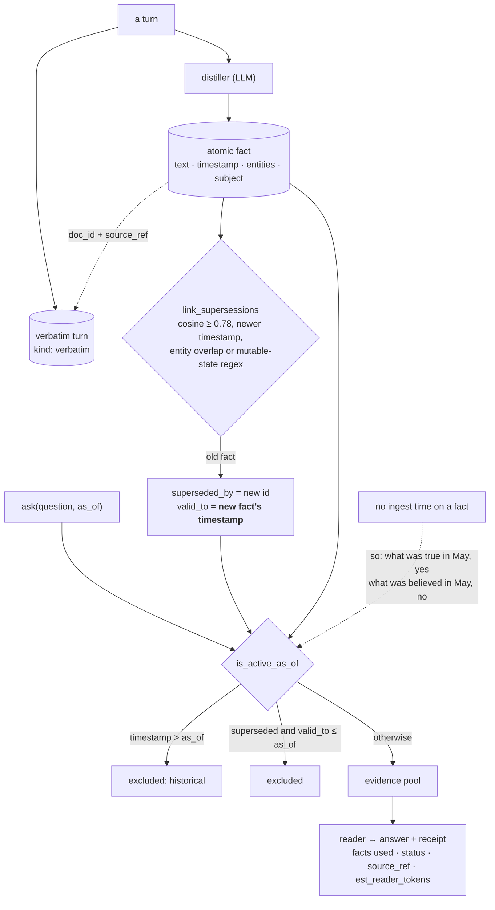

## 1. Executive Summary

MemBukkit is long-term memory for LLM applications, Apache-2.0, ~18,500 lines of
Python under `src/` with 5,840 lines of tests across 35 files, published to PyPI
and shipped as a library, a CLI, a prebuilt GUI, an HTTP service and an MCP
server over the same stores. Two commits, both dated 14 August 2026 — a squashed
public release rather than a history.

Its thesis is in one sentence of the README: *"When something changes (new rent,
new job), the old fact is superseded, not deleted, so you can ask 'what was true
in May?' and get May's answer."* That is the correction discipline this atlas
spends most of its length looking for, and here it is load-bearing rather than
decorative — `is_active_as_of` drops superseded facts out of the evidence pool
before the reader sees them.

Two marks. The report's central finding is what the temporal model **is not**:
there is one time axis, not two. A fact carries a `timestamp` for when it was
true and a `valid_to` for when it stopped being true, and `valid_to` is set to
the *replacement fact's own timestamp*. Nothing on a fact records when the store
learned it. So the question the design answers is "what was true on 1 May", and
the question it cannot answer is "what did this memory believe on 1 May" —
which is the second half of bitemporality and the half that matters when you are
debugging why an agent said something.

The other thing worth the read is `docs/guide/benchmarks.md`, which is the best
benchmark-reproduction protocol in this corpus and still stops short of the
evidence standard two other systems here meet.

## 2. Mental Model

A turn goes in twice. The distiller turns it into **atomic facts** — dated,
subject-attributed, entity-tagged — and the **verbatim turn** is kept beside
them as a separate row of `kind: "verbatim"`, so any fact can be drilled back to
the passage it came from through `doc_id` and `source_ref`.

Nothing is ever overwritten. When a newer fact is similar enough to an older
one, the older one gets `superseded_by` pointing at the newer and `valid_to` set
to the newer one's date. Both rows stay. A read then chooses which of them it is
allowed to see:

## 3. Architecture

One process and a directory. A store is
`~/.membukkit/stores/<name>/` holding `facts.jsonl`, a `vectors.npy` aligned to
it row-for-row, `docs.jsonl` and a `sources/` tree of raw content, with
`meta.json` carrying the encoder spec. The module docstring states the reason
the raw sources are kept: *"so any fact can be traced back to the exact passage
it came from."* Turbopuffer sits behind the same `MemoryBackend` interface for
anyone who wants the hosted path, and Ollama covers the fully local one.

There is nothing to stand up and no database.

## 4. Essential Implementation Paths

**Supersession is automatic, and its thresholds are visible.**
`link_supersessions` runs inline after a write. For each new atomic fact it
scans older atomic facts that are not already superseded, requires the new one
to be strictly newer, and scores by cosine over the stored embeddings. Below a
cosine of 0.88 it additionally requires an entity overlap or a hit from
`_MUTABLE` — a regex over `rent|lease|salary|lives? in|moved to|employer|
married|prefer|switched to|raised|became|changed|now |currently|...` — which is
a legible way of saying *this fact is about mutable state*. The default
threshold is 0.78, one old fact is linked at most once, and the newest candidate
wins.

**Deletion is the interesting write path, because it undoes a supersession.**
`delete_facts` removes the fact, drops the verbatim turn behind it unless
another fact still needs it, and revives whatever the deleted fact had
superseded — `test_deleting_a_correction_revives_what_it_superseded` pins it.
The backend also repairs dangling pointers on load: a `superseded_by` whose
target no longer exists is cleared along with its `valid_to`, under a comment
naming the failure it prevents — treating `superseded_by` *"as 'excluded'
without checking the target still exists"* would hide a fact behind a
correction that is gone.

**The write receipt refuses to make an empty extract look like a success.**
`add` returns a `WriteReport` with `n_stored`, `superseded` and `status`, and an
extraction that produced nothing returns `status="noop"` with a warning rather
than a cheerful zero. An LLM distiller that silently produces no facts is one of
the quieter failure modes in this corpus, and this is the smallest possible
mechanism that surfaces it.

**Retrieval routes over topic buckets and records the route.** `route_topic`
opens buckets against a budget and returns a trace carrying the raw cosine and
routing probability per opened bucket, plus an `excluded_buckets` list. An
optional BM25 lane fuses by reciprocal rank, and a cross-encoder reranker scores
what survives.

## 5. Memory Data Model

`FactRecord` carries `text`, `timestamp`, `tag`, `source_session`,
`source_speaker`, `subject`, `entities`, `time_bucket`, `kind`, `id`, and the
provenance triple `doc_id` / `doc_name` / `source_ref`. The store adds
`superseded_by` and `valid_to`.

Two observations about that list.

**There is no status field.** `fact_status` derives `current`, `superseded` or
`historical` from `superseded_by`, `valid_to`, `timestamp` and `as_of` at read
time, and the derived value rides on the receipt. It is a good three-value
vocabulary — `historical` is specifically *"dated after the as-of date"*, which
is a different exclusion from being superseded — and it is computed rather than
stored, so `trust_state` is withheld. Nothing on a record says what the system
believes about it; two other fields imply it.

**`tag` is a field with one value.** Every producer in the tree passes
`tag="NEW_OBS"`, including the dataset loaders, and nothing reads it. It is the
declared-and-unused shape this atlas records, at its most harmless.

### The single time axis

`timestamp` is when the fact was true. `valid_to` is when it stopped being true
— and `link_supersessions` sets it to `new_ts`, the replacement fact's own
timestamp, not to the wall clock at which the supersession was computed. Both
ends of the interval are on the validity axis. Nothing on a fact row records
ingest time; the only `added_at` in the store is on the *document* registry
entry, not on a fact.

The consequence is worth stating plainly because the surface reads bitemporal
and is not. `ask(..., as_of="2024-06-01")` reconstructs what was true on that
date using facts the store may have learned last week. It cannot reconstruct
what the store would have answered on that date, because it does not know when
it learned anything. For an application answering questions about a user's life
that is the axis you want; for anyone auditing why an agent said something in
May, it is the axis that is missing.

## 6. Retrieval Mechanics

Topic-bucket routing, an optional lexical lane, RRF fusion, a cross-encoder
reranker, and then the temporal gate. `is_active_as_of` is the part that makes
the correction discipline real: with no `as_of` it returns `not superseded_by`,
so a superseded fact does not enter the evidence pool at all; with an `as_of` it
admits a superseded fact whose `valid_to` is still in the future and excludes
any fact dated after the query date. `include_history=True` opens everything for
a caller that wants the timeline.

**Nothing is scoped.** `subject` is stored on every fact and appears in the
Turbopuffer schema, and no read path filters on it. The docstring says so
directly — *"Retrieval is not scoped by subject: one store is one memory"* — so
the isolation boundary is the store directory, and two users mean two stores.
That is a coherent choice for a local-first tool and it is why `scope_enforced`
is withheld: there is no key to reach a query.

## 7. Write Mechanics

Synchronous. The distiller is an LLM call on the write path, supersession
linking runs immediately after it against the whole atomic set, and the store is
saved. There is no queue, no worker and no background pass; a large ingest pays
for its own distillation inline.

## 8. Agent Integration

Five surfaces over one store: the `Memory` Python class, a CLI, an HTTP service,
an MCP server, and a prebuilt GUI that needs no Node. `ask` takes `as_of` on
every surface, and the receipt — the facts used, their status, their
`source_ref`, and `est_reader_tokens` — is returned rather than logged.

## 9. Reliability, Safety, and Trust

The strongest property is that a correction never destroys its predecessor, and
the second strongest is that deleting a correction restores what it displaced.
Together they mean the store's history is recoverable by a person who notices a
wrong supersession — which matters, because supersession here is automatic and
unreviewed.

That is also the risk. A cosine of 0.78 plus an entity overlap is enough to mark
an older fact superseded, with no human in the loop, no confidence recorded, and
no record of the decision beyond the pointer itself. Two facts about different
leases with overlapping entities are one bad embedding away from one silently
hiding the other, and the only evidence left is a `superseded_by` a reader would
have to go looking for.

Beyond that: no audit log of mutations, no scope key, no record time, and no
provenance on *who* deleted a fact through the GUI.

## 10. Tests, Evals, and Benchmarks

Thirty-five test files and 5,840 lines. Nothing was run for this review.
`test_deletion.py` is the strongest file — nine cases covering source removal,
shared sources, purge, the supersession revival, index invalidation and a no-op
delete of an unknown id — and `test_bucket_control.py` holds the case that earns
`negative_eval`, together with its own vacuity guard: excluding every bucket is
asserted to return nothing rather than silently falling back to a full scan.

### The reproduction protocol, which is the best here and still one step short

`docs/guide/benchmarks.md` claims 92.6% on LongMemEval-S and does four things
this atlas's [benchmarks page](../../benchmarks/) asks for and rarely finds.

**Every number is a frozen recipe.** A registry entry pins the reader, the
distiller, the judge and the encoder — `longmemeval-gpt54` is gpt-5.4 reading
and distilling, gpt-4o judging, `openai:text-embedding-3-large@1536` encoding —
and `membukkit bench --repro <recipe-id>` reruns it. The document states why the
distiller is in the recipe: *"distillation quality materially affects the
score."*

**The tolerance band is argued, not asserted.** `--check` passes a rerun within
±0.03 for accuracy metrics, and the reason is given in three parts — reader
nondeterminism, judge nondeterminism, and drift in a hosted model a recipe pins
by name, *"the model behind `gpt-4o-mini` keeps moving even though the string
does not"* — with a scale reference most projects never supply: *"the binomial
standard error on a 500-question benchmark is already ~1.8 points."*

**A partial run cannot be graded against a full number.** *"`--check` grades
complete runs only. A `--lite` subset written to the same output directory is
rejected rather than scored against a full-run number."* That is the vacuity
guard for a benchmark harness, and it is the failure it exists to catch.

**The competitor table separates the number from the judge.** It lists systems
scoring *higher* — OMEGA at 95.4, Mem0 Cloud at 94.4 — and names what
disqualifies the top one from comparison: GPT-4.1 used *"as **both** the
answering and the grading model."* The claim is then scoped to the condition
that makes it checkable: *"Restricted to systems the official judge scored,
MemBukkit is the highest published result on LongMemEval-S."* A superlative with
its qualifier in the same sentence, and the losing comparison printed above it.

**What it does not do is commit the runs.** The recipes carry an `expected`
float and an `expected_n` of 500; no per-question output, no run report and no
scored artifact is in the tree, so 92.6% recomputes only by paying for a rerun
against a hosted judge. [Perseus Vault](../perseus-vault/) and
[Tycho](../tycho/) both commit per-run artifacts whose published means recompute
offline, and that is the standard this document is one file away from meeting.
Stating an `expected_n` at all is more than most — it is exactly the omission
this atlas recorded against a vendor benchmark that published a mean with no *n*.

## 11. For Your Own Build

**Set `valid_to` from the replacement's date, and know which axis you are on.**
It is the right choice for answering *what was true then*, and it is not
bitemporality. If you need to explain a past answer, you need a second timestamp
recording when the row arrived, and nothing else will substitute.

**Make an empty extraction a distinct status.** `status="noop"` on a write
receipt costs one enum value and turns the quietest failure in LLM-backed
capture into something a caller can branch on.

**Repair dangling supersession pointers on load.** Treating `superseded_by` as
"excluded" without checking the target still exists hides a live fact behind a
correction that no longer exists.

**Argue your tolerance band from the noise floor.** "±0.03, because the binomial
standard error at n=500 is ~1.8 points" is a claim a reader can check; "results
may vary" is not.

**Print the competitor that beat you, next to what graded it.** It is the
cheapest way to make a superlative survive contact with a skeptical reader, and
it is why this project's headline number is worth more than several higher ones.

## 12. Open Questions

**How often does 0.78 supersede the wrong fact?** The threshold is the single
most consequential number in the system and nothing committed measures its
precision. A supersession benchmark — how many correct displacements, how many
facts wrongly hidden — is the eval this design most obviously needs and does not
have.

**Would a second time axis break anything?** A fact row is a list-of-lists in
the in-memory backend and a JSONL row on disk; adding an ingest timestamp looks
mechanical. Whether the read paths would want it is a design question the tree
does not answer.

**What does the GUI's delete record?** It returns a report with `revived` and
persists the store. Nothing found here writes who deleted what, or when.

## Appendix: File Index

| Path | What it holds |
| --- | --- |
| `src/membukkit/supersession.py` | `fact_status`, `is_active_as_of`, `link_supersessions`, the `_MUTABLE` regex |
| `src/membukkit/storage/base.py` | `FactRecord`, `Candidate`, `CandidatePool` |
| `src/membukkit/storage/memory.py` | The in-memory backend, `supersede`, the dangling-pointer repair |
| `src/membukkit/storage/localstore.py` | The on-disk store layout and the document registry |
| `src/membukkit/memory_api.py` | `Memory.add` / `ask`, the write receipt, the not-scoped-by-subject docstring |
| `src/membukkit/service/local_app.py` | The GUI's fact listing, source drill-down and delete |
| `src/membukkit/bench/recipes.py` | The frozen recipes and their `expected` / `expected_n` |
| `docs/guide/benchmarks.md` | The reproduction protocol and the who-graded-it table |
| `tests/test_deletion.py`, `tests/test_bucket_control.py` | Revival on delete; the excluded-bucket leak test |

## History

**2026-08-29** — [`af1bf323a80901f58928189c16caa372191a1219`](https://github.com/memseekai/membukkit/commit/af1bf323a80901f58928189c16caa372191a1219) — first reading, Apache-2.0, ~18,500 lines of Python under `src/` and 5,840 across 35 test files, two commits both dated 14 August 2026, which is a squashed public release rather than a history. Screened before reading: no auto-run surface, no build-time execution surface, one unpinned surface, and both lockfiles unchanged for fourteen days. Nothing was installed and nothing was run. Two marks. `human_review` rests on the GUI's fact listing, source drill-down and delete, the last of which revives what the deleted fact had superseded and reports it. `negative_eval` rests on an excluded topic bucket asserted not to contribute candidates, beside a committed case that excluding everything returns nothing rather than a full scan. `bitemporal` is withheld and the reason is section 5: `valid_to` is set to the replacement fact's own timestamp, so both ends of the interval are validity time and no fact row records when the store learned it. `scope_enforced` is withheld because the project says so itself — `subject` is stored and never filtered on, and one store is one memory. `trust_state` is withheld because `current`/`superseded`/`historical` is derived at read time rather than stored. `tombstone` and `audit_log` are absent: a deletion is a removal with no record keyed on the value, and no mutation log exists. The reading covers the storage backends, supersession, retrieval routing, the API surfaces and the benchmark recipes; the reranker weights, the deep-research agent and the evaluation harness were not traced.
