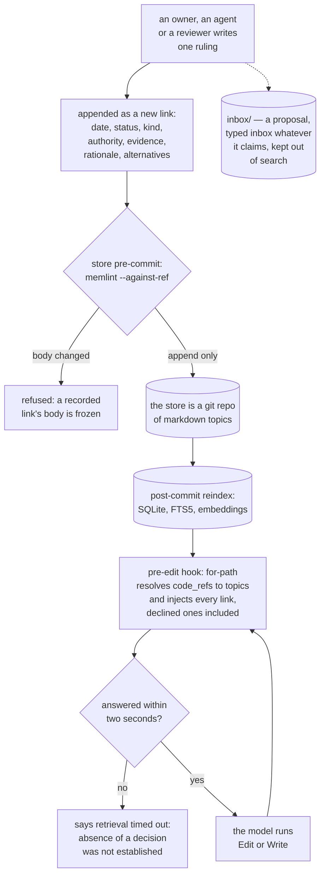
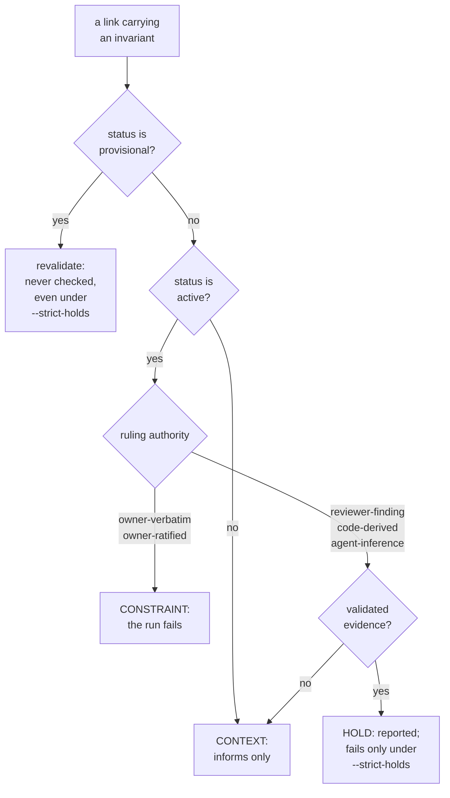

## 1. Executive Summary

MemContinuum is a decision store for **Claude Code projects** — MIT, 232
commits between 30 August and 8 September 2026 by two authors, 13,029 lines of
Python outside tests beside 35,736 lines of tests in 17 modules holding 1,605
test functions, and 10,673 lines of shell across the hooks and installer. The
screen found one auto-run surface — fourteen hook scripts a plugin manifest can
register — two dependency manifests inside the seven-day cooldown and two
unpinned ranges; nothing was installed or run, and the read was made from a full
clone. The README states the problem as two failures at once: decisions that
scroll out of context and get re-litigated, and an agent working file-locally
that writes a helper which already exists two directories away.

**The unit is a question, and the answer is a chain nothing can rewrite.** One
markdown file per topic; its body is an ordered list of links, newest first;
each link is one ruling with its own date, status, kind, authority, evidence
and rationale. A change of mind is a new link carrying `reverses` and a
`reason_for_change`, and the link it reverses keeps its text. That is asserted
by most systems in this atlas and enforced by almost none. Here
`memlint.py --against-ref REF` (`memlint.py:1415-1490`) compares every link
against the same link at a git ref and reports an error for any changed field
outside `{link, status, superseded_by, promoted_by}` — a set difference, so a
field added to the schema tomorrow is frozen without anyone remembering to list
it. Three lifecycle fields may each move forward once, only into a terminal
state, and only as the sole change on that link. The store's own `pre-commit`
hook runs that check and exits 1 (`hooks/pre-commit-append-only.sh:130-160`,
wired by `scripts/repo-init.sh:1643`), and the same check runs in CI, where
`git commit --no-verify` cannot reach it. The chain carries `recorded_by` and
`recorded_at` on every link, so it is simultaneously the store and the record of
every change made to it, which earns `audit_log`.

**Authority decides what a record may do.** Five values are allowed on a
ruling, and they collapse into three citation tiers. `owner-verbatim` and
`owner-ratified` are CONSTRAINT; `reviewer-finding`, `code-derived` and
`agent-inference` are HOLD when they carry validated evidence and CONTEXT when
they do not; anything whose status is not `active` is CONTEXT whatever its
authority (`memidx.py:3918-3937`). The tier is not advice: `memidx.py drift`
checks each link's `invariant` against current source and **fails the run on a
constraint violation, reports a hold violation unless `--strict-holds` is
passed, and never checks a `provisional` link at all** — it routes that one to
`revalidate` instead (`:4047-4134`). A discrete status where one state withholds
a memory from being acted on, applied as a filter rather than a score, is what
`trust_state` asks for.

Two more marks. **`human_review`**: anything under `inbox/` indexes as
`type: inbox` whatever its own frontmatter claims, and `search` excludes inbox
records and the link rows of inbox topics unless asked for them, so a
reviewer's proposal is staged rather than recalled; a `provisional` link's
invariant is never enforced; and the linter refuses any status edit back toward
`active`, so the promotion procedure is the only route to constraint authority.
**`negative_eval`**: one search over three records planted with the same term
returns the real topic and asserts both inbox drops are absent, then flips a
single flag and asserts both are present
(`tests/test_memidx.py:2802-2867`).

Three findings sit against the design. **The scope key can never exclude
anything.** Every record carries a `project` column and 64 read queries filter
on it, but `records` is keyed by `path` alone, so opening one database under a
second `--project` is refused with the reason stated in the error — *"this db
keys rows by path alone, so opening the SAME physical file for a different
`--project` would silently evict that project's rows"* (`memidx.py:1019-1024`).
One store, one project; the predicate is a guard against a stamping accident
rather than a partition. **A declined ruling is delivered, not enforced.** The
schema has a `declined` status, a `declined` kind and per-link `alternatives`
each with an `option`, a `rejected_because` and its own authority, all frozen
once written — and the pre-edit chain hands every link to the model regardless
of status, so a rejected option reaches the agent about to touch that file.
Nothing keys on the value and nothing refuses. **Every hook fails open.** A
missing index, a missing python, a failed lookup or a slow one means the hook
stays silent and the edit proceeds, and a file changed from the shell gets no
lookup at all — the ledger notices it afterwards from a tree diff, or not at
all if it was committed in the same breath.

## 2. Mental Model

A memory is **a question with a history of answers**, and the history is the
point. Asking "what do we do about hidden files in the processed count" returns
not the current answer but the chain that produced it: what was adopted, what
was declined and because of what, what reversed what and on which of three
stated grounds — new evidence, changed context, changed mind.

Belief is graded by **who said it**, per field. The same link can hold a ruling
the owner spoke verbatim and a rationale that is an agent's reading of why, and
the schema keeps them apart on purpose: *"usually inference, even when the
ruling itself is verbatim."* There is no `paraphrase` value, and
`owner-ratified` exists so an inference can be promoted without ever being
confused with the owner's own words.

A memory is **used at the moment of an edit**, not when someone remembers to
ask. Before the Edit or Write tool touches a file, a hook resolves that path to
the topics whose `code_refs` cover it and injects their chains. The lookup is
bounded at two seconds, and a timeout does not fall silent — it says the absence
of a matching decision was not established and the edit should be treated as
unverified rather than clear.

Nothing forgets. There is no decay, no consolidation and no summariser; a
ruling stops applying by being superseded, declined or marked historical, and
its text stays where it was written.



## 3. Architecture

Two Python programs and a shell layer around Claude Code.

- `memidx.py` (8,331 lines) — the indexer and every read command: `reindex`,
  `search`, `chain`, `for-path`, `why`, `drift`, `unmapped`, `check`,
  `code-search`, `code-census`, `stats`. It owns the SQLite schema for both
  databases, the FTS5 tables, the embedding pipeline and its staleness
  fingerprint, and the three enforcement classes.
- `memlint.py` (1,912 lines) — validation in two independent halves: a
  schema-and-consistency pass over the tree, and `--against-ref`, the
  append-only check that compares links against a git ref.
- `chunkers/` (2,515 lines) — a Python AST chunker, a Swift chunker and a
  tree-sitter backend with pinned grammars for JavaScript, TypeScript, Java,
  PHP, Rust and Lua.
- `hooks/` (4,657 lines of shell) — `pre-edit-chain.sh` is the retrieval hook,
  `ledger-post-edit.sh` the edit ledger, `pre-commit-append-only.sh` the
  store's own git gate, `post-commit-reindex.sh` the reindex,
  `userprompt-remind.sh` and `newfile-nudge.sh` the write-side nudges,
  `precompact-persist.sh` the compaction handler, `mc-watchdog.sh` the deadline
  wrapper, `memlib.sh` and `mc-path-lib.sh` the shared library.
- `scripts/` (the rest of 10,673 shell lines) — `repo-init.sh` (1,887 lines)
  installs and wires everything; `memcontinuum-decide.sh`,
  `-state.sh` and `-update.sh` manage a per-machine registry of which
  repositories have a store.

The store itself is a git repository of markdown. The index is a projection and
is disposable; the pinned tree-sitter grammars are an explicit exception to the
project's own `>=` policy, because *"an unpinned grammar upgrade would silently
change what a file's chunks look like without bumping that fingerprint, serving
stale chunks after a `pip install -U` no reindex would ever notice."*

### Deployment and ergonomics

- **What has to run:** Python with PyYAML for everything, plus `fastembed` and
  numpy only for the vector and hybrid search modes, which are imported lazily
  so `for-path`, `chain` and `check` stay dependency-light. SQLite is embedded.
- **Fully local and offline:** yes, including embeddings.
- **Hand-repairable:** the store is markdown in git, and the index rebuilds
  from it.
- **Install:** `memcontinuum-setup.sh` and `scripts/repo-init.sh`, which wires
  the Claude Code hooks, the two store-side git hooks and a registry row.

## 4. Essential Implementation Paths

- **Freeze a recorded link.** `_link_diff_errors`
  (`memlint.py:1415-1490`) takes one link as it was at a ref and as it is now,
  subtracts `{link, status, superseded_by, promoted_by}` from the union of both
  field sets, and reports every remaining field whose value moved. `status` may
  go from `active` or `provisional` to `superseded`, `historical` or `declined`
  and no further; `superseded_by` may be added only in that move and only when
  the new status is `superseded`; `promoted_by` may be added once. A lifecycle
  move bundled with any body edit produces an error for each.
- **Gate the commit.** `hooks/pre-commit-append-only.sh` runs
  `memlint.py --against-ref HEAD --staged ROOT`, prints the summary line and
  exits 1 on failure (`:130-160`).
- **Classify a ruling.** `invariant_enforcement_class` (`memidx.py:3918-3937`)
  returns `context` first for any non-`active` status, then `constraint`,
  `hold` or `context` by authority and validated evidence. `memlint.py:671-697`
  computes the same tiers from raw YAML for marker verification and imports
  memidx's two authority sets rather than re-typing them.
- **Run the drift gate.** `cmd_drift` (`memidx.py:4047-4134`) checks each
  link's `invariant` against current source, sorts violations into constraint
  and hold buckets, names skipped ones rather than silently passing them, and
  returns 1 when there is a constraint violation or, under `--strict-holds`, a
  hold violation.
- **Resolve a path to decisions.** `topic_matches_for_path`
  (`memidx.py:3225-3235`) selects the project's topics and keeps those with a
  `code_refs` entry matching the file by prefix, glob or `path#symbol`;
  `topic_chain_lines` (`:3490-3505`) then selects **every** link for that topic
  ordered by sequence, with no status filter, so the chain the model receives
  includes the declined ones.
- **Inject before the edit.** `hooks/pre-edit-chain.sh` calls `for-path` with
  `--json --with-chain-text` so one invocation returns both, under
  `mc-watchdog.sh`'s two-second deadline; on timeout it emits
  `MC_WATCHDOG_TIMEOUT_FALLBACK` rather than an empty result.
- **Stage a proposal.** `infer_type` (`memidx.py:692-693`) returns `inbox` for
  anything whose first path segment is `inbox`, overriding the file's own
  `type:`; `cmd_search` excludes those records and the link rows whose
  `source_path` is an inbox topic unless `include_inbox` is set (`:2912-2917`).
- **Notice a shell edit.** `hooks/ledger-post-edit.sh` diffs the tree against a
  baseline and appends `{path, kind, content_sha256, seen_at, root, source}`
  rows to the session's ledger, which is what the nudges read.

## 5. Memory Data Model

A **topic** is a file with frontmatter — `type`, `id`, `title`, `area`,
`project`, `current`, `code_refs`, `tags` — and a body of links. `current` is
hand-set to the newest active link and the linter errors, naming the correct
value, when it disagrees, so the pointer cannot drift from the chain.

A **link** carries `link`, `date`, `status`, `kind`, an optional `reverses`
with a `reason_for_change` drawn from three values, a `ruling` and a
`rationale` each with `text` and `authority`, `alternatives` as a list of
`{option, rejected_because, authority}`, `evidence`, `revisit_if`, an optional
`invariant`, typed `edges`, `assumptions`, `recorded_by` and `recorded_at`.

A **concept** (`type: concept`) is the Anatomy layer: what the code already
contains, with `implemented_by`, `tested_by`, an owner boundary and
`governed_by` topics.

**Temporal:** `date` on the ruling and `recorded_at` on the recording are both
record times, and validity is positional — a ruling applies until a later link
supersedes it. There is no interval and no as-of query:
`rg -n -i '\-\-as-of|as_of|valid_until|valid_from' memidx.py memlint.py`
returns nothing. `bitemporal` withheld.

**Trust:** five authorities and five statuses, read on every enforcement
decision. `trust_state` earned.

**Scoping:** a `project` column that one database can only ever hold one value
of. Withheld — see section 9.

**Tombstone:** a `declined` status and per-link rejected alternatives, frozen
once written and delivered on the write path, keyed on the topic rather than on
the value and enforcing nothing. Withheld — see section 9.

## 6. Retrieval Mechanics

Three surfaces, and the important one is not a query.

`for-path` is the automatic surface: a file path in, every topic whose
`code_refs` cover it out, each with its whole chain. Matching is by path
prefix, fnmatch glob or `path#symbol`, and only the last takes part in marker
verification, because a marker cannot be checked against a ref that names no
symbol. Concepts matching the path come too, and each drags in the topics that
govern it.

`search` is FTS5 by default, with vector and hybrid modes behind a lazily
imported `fastembed`. Its defaults are opinionated in the direction of the
mark: `status` defaults to active, and inbox records are excluded. The
embedding pipeline carries a fingerprint over the model name, dimension,
pipeline version, prefix, normalisation and fastembed's installed version, so a
change in what text a vector is computed from invalidates the vector without
needing the record's own hash to move.

`why` is the reviewer's direction — from a file or symbol to the concept to the
topics that govern it — and it prints declined links on purpose, because the
question it answers is why the code is strange.

**Failure modes.** Every path fails open. A missing or uninitialised index
returns a named reply and no decision; a stale index still answers from what it
has, which the project argues is the right trade and is why committing the
store matters. The two-second watchdog is the one place where failing open is
made visible to the model rather than silent. A file edited through Bash gets
no lookup at all, and one committed in the same turn, or under a git-ignored
path, is not even noticed afterwards.

## 7. Write Mechanics

**Nothing extracts.** There is no summariser, no consolidation pass and no
background writer; a memory exists because a person or an agent wrote a link
and committed it. The nudges are the only push, and neither reads what was
typed: one fires when files have been edited under no decision topic at all,
the other when the conversation has moved on shortly after real edits.

**Correction is an append.** The predecessor keeps its text and gains a
terminal status; the successor names it in `reverses` and states which of three
grounds applies. The linter refuses a `kind: reversed` link whose target is
still active, and refuses `reverses` without a `reason_for_change`.

**Concurrency** is git's. The store is a repository, the index is a
projection, and the post-commit hook rebuilds it.

### Operational cost

- A pre-edit lookup is one SQLite open and two queries, bounded at two seconds.
- A commit pays the linter's `--against-ref` pass over the staged topics.
- A reindex is proportional to the store; embeddings are optional and lazy.
- No model call anywhere in the memory path.

## 8. Agent Integration

The model never calls a recall tool. The hooks put the chain in front of it
before an Edit or a Write, nudge it when edits have accumulated under no topic,
and persist state before a compaction. Two skills — `memcontinuum` and
`memory-search` — give it the deliberate surfaces. The person's surfaces are
the CLI, the markdown store itself, and `inbox/`.

The install decision is itself recorded per repository in a registry keyed by
the `origin` remote when there is one and the working tree path otherwise, so a
repository that declined is never asked again. That `declined` is a different
vocabulary from a link's `declined` status, and a reader grepping the tree will
meet both.

## 9. Reliability, Safety, and Trust



**Trust state — awarded.** Five authorities, five statuses, three enforcement
classes, and the class decides whether a violated invariant fails a run. The
`provisional` state withholds a memory from enforcement entirely. The
classification exists twice, over YAML and over SQLite rows, with the authority
sets shared so the two cannot diverge.

**Audit log — awarded.** The chain is the record of its own mutations: each
link names when it was ruled, who recorded it, when, what it reverses and on
what grounds. The append-only property is enforced by a linter whose frozen set
is a subtraction rather than a list, by the store's own `pre-commit` hook, and
again in CI where `--no-verify` cannot reach.

**Human review — awarded.** Inbox records are typed as such regardless of what
they claim and excluded from search unless requested; provisional links are
never enforced; and no edit can move a status toward `active`. The inspection
itself — the owner is shown the exact text and affirms it, bulk approval never
promotes, only the owner promotes — is a documented procedure, and what the
code enforces is the gate around it.

**Negative evaluation — awarded.** The inbox exclusion is asserted against a
populated result set with the flag as the only variable, and re-asserted in the
other direction.

**Scope — withheld, and the withholding is not a finding about isolation.**
Project isolation here is real and is enforced by construction: one decision
database belongs to one project, `records` is keyed by `path` alone, and
`open_db` refuses to open a store under a second `--project` rather than
letting the two mix — *"opening the SAME physical file for a different
`--project` would silently evict/overwrite that project's rows"*
(`memidx.py:1019-1024`). A `project` column sits on every record and 64 read
queries carry it as defence in depth. Nothing here leaks between projects, and
a reader should not infer from the withheld mark that it does.

What the mark asks for is narrower than isolation: a stored scope key that
partitions co-resident memory on the read path. A store that holds exactly one
scope cannot demonstrate that, because the predicate has nothing to exclude —
the same line this atlas drew for
[Agentic Context Engine](../agentic-context-engine/), where one skillbook
belongs to one agent. Separation and partitioning are different mechanisms with
different failure modes, and this system chose the first. The code index is the
multi-project store — keyed `(path, project, code_root)`, explicitly safe for
several projects in one file — and what it holds is chunks derived from source
rather than anything that could turn out to be false.

**Tombstone — withheld, and it is the closest miss here.** The schema is
unusually well equipped for one: a `declined` status meaning considered and not
adopted, a `declined` kind, and per-link `alternatives` each carrying the
option, the reason it was rejected and its own authority — all frozen the
moment they are committed. And unlike most stores, the rejection is delivered
on the write path: `topic_chain_lines` selects every link for a topic with no
status filter, so the model about to edit a governed file receives what was
declined along with what was adopted. Two things keep the mark. It is keyed on
the topic and reached by file path, not keyed on the value, so the same
rejected idea proposed under another topic or in another file meets nothing.
And the delivery is text handed to a model by a hook that fails open and cannot
refuse: nothing prevents re-adoption, and re-adopting is a legitimate move the
schema models with `kind: restored`.

**Bitemporal — withheld.** `date` and `recorded_at` are both record times and
validity is positional in the chain.

**What the fail-open discipline costs.** Every hook is written to never block
an edit, which is a defensible choice for a tool that sits in front of someone
else's work. The consequence is that the guarantee is about the *store* — a
recorded link cannot be rewritten — and not about the *work*: nothing ensures a
decision was consulted, only that it was offered when the index was present,
the file was governed and the path went through a tool the hooks see.

## 10. Tests, Evals, and Benchmarks

1,605 test functions in 17 modules and 35,736 lines, against 13,029 lines of
Python. `test_memidx.py` and `test_memlint.py` carry the schema, the
enforcement classes, the append-only diff and the inbox exclusion;
`test_hooks.py` and `test_write_hooks.py` cover the shell layer;
`test_repo_init.py` covers the installer and its registry, including two
checkouts sharing a basename; `test_stats.py` covers the log parser, including
that an unknown project reports zero rather than another project's numbers;
`test_chunkers.py` and `test_code_index.py` cover the Anatomy side. There are
golden files and a macOS smoke test, and a bash-3.2 runner, which is a
deliberate portability floor for the shell.

No benchmark, no paper, and no evaluation of retrieval quality — which the
project appears to know: the changelog's unreleased section adds a `topics=`
field to the hook log specifically to turn *"a matched edit into a gradeable
retrieval-quality sample"*, with `stats` reporting `topics_named`,
`topics_distinct` and `top_topics`. The instrument is being built; nothing is
measured yet.

## 11. For Your Own Build

### Steal

- **Enforce append-only with a diff against a ref, not with a convention.**
  Comparing each record against itself at the last commit is a few hundred
  lines and turns "we never edit history" into something a commit can fail.
- **Freeze by subtraction.** Naming the four fields that may move and freezing
  everything else means a field added next year is protected without anyone
  remembering to add it to a list.
- **Make a lifecycle move the only change on a record.** A status flip bundled
  with a text edit is how an append-only store quietly stops being one.
- **Grade authority per field, not per record.** A ruling can be the owner's
  words while the rationale beside it is an agent's guess, and collapsing the
  two is how an inference gets cited as a constraint.
- **Let the tier decide whether a violation blocks.** Only the owner's own or
  ratified words fail a run; everything else reports. That is a defensible
  answer to "whose belief may stop work".
- **Say when retrieval failed, instead of returning nothing.** A timeout that
  reports *the absence of a decision was not established* keeps a model from
  reading silence as a clear signal — the single best idea in this repository,
  and four lines of shell.
- **Retrieve on the tool call, not on the model's discretion.** A hook that
  resolves the file being edited to the decisions that govern it needs no
  cooperation from the model.

### Avoid

- **A scope column in a store that can hold only one scope.** The predicate
  reads like a partition and is a stamping guard; write down which it is.
- **Recording what was declined and never checking against it.** The reasons
  are captured, immutable and delivered, and nothing consults them as a
  precondition — the mechanism is one lookup short of a real tombstone.
- **Fail-open everywhere without a signal.** One place here distinguishes
  "nothing governs this" from "we could not find out"; everywhere else the two
  look identical to the model.

### Fit

Right for a small team or a solo developer running agent-driven work on one
repository who wants the reasons to survive the session and the reasoning to be
citable afterwards. The append-only discipline is the strongest part and the
part that costs nothing to adopt. Wrong if you need one store across several
projects, memory about people rather than about code, retrieval by content
rather than by the file being edited, or any guarantee that a decision was
actually read.

## 12. Open Questions

- Will a declined ruling ever be checked rather than shown? The reasons are
  recorded and immutable; what is missing is a lookup on the way in.
- Can one store serve several projects? The refusal is honest about why it
  cannot today — `records` keyed by `path` alone — and the code index already
  shows the shape that would fix it.
- What does retrieval quality look like? The changelog is adding the field that
  would let it be graded; nothing has been graded yet.
- Nine days and two authors: what happens to the frozen-field list as the
  schema grows? The subtraction makes it safe by default, which is the right
  direction, but every new lifecycle field is a decision about what may move.

## Appendix: File Index

| Path | Lines | What it holds |
| --- | --- | --- |
| `memidx.py` | 8,331 | The SQLite schema for both databases, `reindex`, `search`, `chain`, `for-path` (3541), `why`, `drift` (4047), `unmapped`, `stats`; `invariant_enforcement_class` (3918), `topic_matches_for_path` (3225), `topic_chain_lines` (3490), `infer_type` (692) |
| `memlint.py` | 1,912 | The schema pass, marker verification, `_link_tier` (671), and `--against-ref`: `_link_diff_errors` (1415), `check_append_only` (1524) |
| `chunkers/` | 2,515 | Python AST, Swift and tree-sitter backends with pinned grammars |
| `hooks/pre-edit-chain.sh` | 524 | The retrieval hook and its timeout fallback |
| `hooks/ledger-post-edit.sh` | 638 | The session edit ledger, including the shell-diff path |
| `hooks/pre-commit-append-only.sh` | 166 | The store's git gate |
| `hooks/userprompt-remind.sh`, `newfile-nudge.sh` | 989, 278 | The two write-side nudges |
| `hooks/mc-watchdog.sh`, `memlib.sh` | 273, 548 | The deadline wrapper and the shared shell library |
| `scripts/repo-init.sh` | 1,887 | The installer and the hook wiring |
| `docs/SCHEMA.md`, `INTERNALS.md`, `DESIGN.md` | 369, 2,620, 77 | The record schema, the internals, the design note |
| `tests/` | 35,736 in 17 modules | 1,605 test functions, goldens, a macOS smoke test, a bash-3.2 runner |

**Searches recorded for the negative claims**

```sh
rg -n -i '\-\-as-of|as_of|valid_until|valid_from' memidx.py memlint.py   # none: no validity interval, no as-of query
rg -n 'declined' hooks/*.sh                                             # none: no hook consults a declined ruling
rg -n 'alternatives' memidx.py memlint.py hooks/*.sh                    # validated and indexed; never read as a precondition
rg -n 'CREATE TABLE IF NOT EXISTS records' -A2 memidx.py                # path TEXT PRIMARY KEY — one project per db
rg -n 'this db keys rows by path alone' memidx.py                       # the refusal, in the project's own words
```

## History

**2026-09-08** — [`161f555d74d81532362a38e8f10657eac0c29e23`](https://github.com/krakozavr/MemContinuum/commit/161f555d74d81532362a38e8f10657eac0c29e23) — correction. The `scope_enforced` reasoning was accurate and its presentation was not: one decision database per project, with a second `--project` refused outright, was listed among the report's risks and named as the verdict's biggest risk. That is a property which prevents cross-project contamination, not one that causes it, and framing it as a cost invited exactly the misreading it received — that the withheld mark was a finding about leakage. The mark stays withheld, on the same line this atlas applied to Agentic Context Engine: a store holding exactly one scope cannot demonstrate partitioning on a read path. Sections 5 and 9, the frontmatter and the verdict now say that separation is enforced here and that the withholding is not a claim about isolation. Reported by the project's author; the facts were re-verified at this pin before the wording changed.

**2026-09-08** — [`161f555d74d81532362a38e8f10657eac0c29e23`](https://github.com/krakozavr/MemContinuum/commit/161f555d74d81532362a38e8f10657eac0c29e23) — first reading, at the head of `main`, on a commit from the same day. Screened before anything was read: one auto-run surface — fourteen hook scripts a plugin manifest can register — two dependency manifests inside the seven-day cooldown, two unpinned ranges, no build-time execution; nothing was installed or run, and the read was made from a full clone. Four marks. `trust_state` and `audit_log` rest on enforcement rather than on schema: the three citation tiers decide whether a violated invariant fails a run, and the frozen-body check runs from the store's own `pre-commit` hook. `human_review` rests on the inbox exclusion and on the linter's refusal to move a status toward `active`; the promotion procedure itself is documentation. `negative_eval` rests on the inbox test's populated positive control. `scope_enforced` and `tombstone` were each examined and withheld with the near-miss stated in section 9. The reading covers the decision store, its linter, the enforcement classes, the retrieval hooks and the ledger; the Anatomy code index, the chunkers, the installer's registry and the nudge heuristics were read as context rather than as subject.
