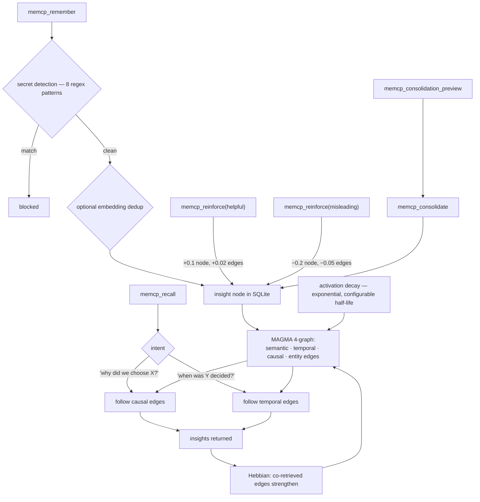

## 1. Executive Summary

MemCP is an MCP server giving Claude Code an external memory: a SQLite knowledge
graph with four edge types, 24 tools, and **only two required dependencies**
(`mcp`, `pydantic`) with everything else optional and "progressively better".
It implements the RLM framework ([arXiv:2512.24601](https://arxiv.org/abs/2512.24601))
— "an active exploration model where content stays on disk and Claude decides
what to load, rather than passive RAG retrieval".

**The mechanism worth taking is the feedback asymmetry.**
`memcp_reinforce` marks an insight helpful or misleading, and the two are not
mirror images:

```python
helpful=True:  feedback_score += 0.1, boost connected edges by 0.02
helpful=False: feedback_score -= 0.2, weaken connected edges by 0.05
```

**A report that a memory misled you moves its score twice as far as a report that
it helped, and weakens its edges two and a half times as hard.** One bad
experience outweighs two good ones, and the penalty propagates into the graph
structure rather than stopping at the node.

That asymmetry is correct and almost nobody implements it. A memory that helped
is worth a little more; a memory that *actively misled an agent* is a different
kind of object, and treating the two symmetrically means a claim that burned you
once and helped twice ends up net positive. The edge propagation matters for the
same reason — a misleading insight usually sits in a misleading neighbourhood.

**And the benchmark report undermines itself** — section 10.

## 2. Mental Model

Insights are nodes in a four-relation graph — semantic, temporal, causal, entity.
Co-retrieval strengthens edges, disuse decays them, and feedback moves both the
node and its edges. Retrieval picks a traversal by the *intent* of the question.



## 3. Architecture

"3-layer delegation: `server.py` (MCP endpoints) → `tools/*.py` (orchestration)
→ `core/*.py` (business logic)", with SQLite for the graph and the filesystem for
contexts and chunks.

**Two required dependencies** is the constraint worth noting, and the README
frames the rest as progressive: spaCy NER, embeddings and sub-agent extraction
all unlock capability without being required to start. A memory server that
installs with `mcp` and `pydantic` and works is more likely to be tried than one
that needs a model server first.

14,300 lines of Python. Docker, a Makefile, a `SECURITY.md`, an `agents/`
directory and templates.

## 4. Essential Implementation Paths

**Feedback** — `src/memcp/tools/feedback_tools.py` (`do_reinforce` and the
asymmetric constants `:11-40`), `src/memcp/server.py` `:520-527`.

**Benchmark** — `tests/benchmark/test_context_rot.py` (the hardcoded baselines
`:146`, `:273`, `:372`, `:462`), `tests/benchmark/metrics.py`
(`native_value` and the derived `savings_pct` / `ratio` `:259-279`),
`tests/benchmark/report.py`, `benchmark_output/`.

**Graph** — `src/memcp/core/memory.py` (`_compute_effective_importance`),
the edge manager's `reinforce_edges`.

## 5. Memory Data Model

An insight node with a `feedback_score` clamped to `[-1.0, 1.0]`, an importance
with an effective-importance computation, and four typed edge relations.

`feedback_score` is the closest thing to an epistemic field and it is a float
rather than a state — a memory at −0.9 is ranked down, not withheld, so an
insight repeatedly reported as misleading still competes. Given the asymmetry
already built into the update, a threshold at which an insight stops being
returned would be a small addition and a large improvement.

Secret detection runs on the write path with eight regex patterns, blocking
storage rather than redacting — the same side of the boundary as
[mnemos](../mnemos/) and [vir](../vir/).

## 6. Retrieval Mechanics

**Intent-aware traversal** is the distinctive part: "'why did we choose X?'
follows causal edges; 'when was Y decided?' follows temporal edges". Choosing the
*relation to walk* from the question's form is a cheap and legible alternative to
scoring everything and hoping the ranker recovers the structure — and it is only
possible because the edges are typed at write time.

Hebbian strengthening on co-retrieval and exponential decay by configurable
half-life run over the same edges, so the graph's shape tracks use.

**No scope key was found on the read path**; the store is one directory per user.

## 7. Write Mechanics

`remember` with secret blocking and optional embedding dedup;
`consolidation_preview` then `consolidate` for merging near-duplicates; `forget`
for removal.

**The preview-then-apply split was read as earning `human_review`. The mark is
withdrawn.** `memcp_consolidation_preview` and `memcp_consolidate` are separate
tools, and the first reading took that separation for a gate on the grounds that
two tools beat one tool with a `dry_run` flag, "because the flag defaults
somewhere". Reading the signatures inverts the argument:

```python
@mcp.tool()
async def memcp_consolidation_preview(threshold: float = 0.0, limit: int = 20, project: str = "") -> str:
    # "Dry-run — no changes made. Use memcp_consolidate to merge."

@mcp.tool()
async def memcp_consolidate(group_ids: str, keep_id: str = "", merged_content: str = "") -> str:
    # "Merge a group of similar insights into one ... redirects edges, and deletes duplicates."
```

`memcp_consolidate` takes a comma-separated list of insight ids and nothing
else. No token, handle or preview reference links the two calls, so the merge
does not require that a preview ever happened. Both carry `@mcp.tool()`, which
means both are in the schema the model is handed, and the model can call the
destructive one first. The sentence *"Use memcp_consolidate to merge"* is an
instruction to the agent, not a constraint on it.

A `dry_run` flag at least has a default a reviewer can argue about. Two unlinked
tools have nothing to default and nothing to check: the approver the capability
asks for would have to be the same actor that proposes the merge. This is the
shape recorded against [Wax](../wax/) — a proposal whose approval rides with the
proposer — and it fails the same test.

What remains, and is worth keeping in view: the preview exists, it is honest
about being a dry run, and a *person* driving MemCP from a terminal has a natural
two-step. The mark asks whether the shipped path puts someone between the
proposal and the deletion, and nothing here does.

## 8. Agent Integration

24 MCP tools — "remember, recall, forget, search, chunk, filter, traverse,
reinforce, consolidate, and more" — plus hooks, templates and an agents
directory. The `/compact` framing is concrete about the problem it solves:
Claude Code loses everything after a compaction, and an external store does not.

## 9. Reliability, Safety, and Trust

**One mark: human review**, for the preview-then-consolidate split.

**Trust state — withheld.** `feedback_score` is a float; nothing withholds.

**Tombstone, bitemporal, audit log, scope, negative eval — no.**

**The feedback asymmetry is the strongest thing here** and it deserves to be
separated from the benchmark problem below, because they are independent: the
asymmetry is a real design decision, implemented, with the constants visible in
one short function.

## 10. Tests, Evals, and Benchmarks

`benchmark_output/benchmark_report.md` and `benchmark_results.json` are committed,
dated, and formatted as a head-to-head:

| Scenario | Metric | Native | RLM |
|---|---|---|---|
| Context Rot: Single Compaction | Knowledge retained after `/compact` | 5.0% | 100.0% |
| Cascading Compactions (3×) | Knowledge retained after 3 compactions | 2.0% | 100.0% |
| Cross-Session | Session-1 knowledge from session-5 | 0.0% | 92.0% |
| Importance Decay | Critical insight retention at 60 days | 0.0% | 100.0% |

**The "Native" column is not measured.** In
`tests/benchmark/test_context_rot.py` the values are literals:

```python
native_value=5.0,   # Typical ~5% retention
native_value=2.0,   # ~0.05^3 ≈ near zero
native_value=0.0,
native_value=0.0,   # Native has 0% after session ends
```

The second is derived from the first by cubing it, in a comment. The JSON then
computes `savings_pct` and a `ratio` from those constants — `-1900.0` and
`"0.1x"` for the first row — so a report that reads as an experiment is one
measured column, one asserted column, and two columns of arithmetic on the
assertion.

**And the measured column is not measuring retrieval.** The Native side of the
first row runs a `ContextWindowSimulator` and grades it on whether the questions
can still be answered — `total_found / total_expected` over twenty queries. The
RLM side of the same row is:

```python
rlm_retention = min(100.0, round(status["total_insights"] / len(insights) * 100, 1))
```

— a count of rows in SQLite, with the comment above it saying so outright:
*"Even if query matching isn't perfect, status confirms all insights exist."* So
the two halves of one comparison use different numerators. The baseline is asked
whether its knowledge is still reachable; the product is asked whether its rows
are still present, which is a question `remember()` answered at insert time and
nothing since has threatened.

One more detail sits in the same file. The native test's own assertion is
`assert result["retention_pct"] < 50  # typically ~5%` — so the simulator may
retain 49% and the test still passes, while the published column says 5.0. Even
the half of the comparison that runs does not pin the number the report prints.

**Two things should be said fairly.** These files live under `tests/benchmark/`,
and as *regression tests for the RLM side* — does the store still return what it
stored after these operations — they are reasonable; the problem is
`report.py` rendering them as a comparison and the output being published as
`benchmark_report.md`. And the underlying claim is true: an external store does
survive `/compact` and an in-context-only baseline does not.

**But that is the problem.** "Knowledge retained after a context wipe" is a
property every external memory system has by construction — a plain text file
scores 100% — so the table cannot distinguish a good memory system from a bad
one, and the 100%s are guaranteed by the architecture rather than earned by it.
The questions that would discriminate — does the retrieved insight answer the
question, does intent-aware traversal beat flat similarity, does the feedback
asymmetry improve ranking — are the ones this codebase is unusually well set up
to ask, since it has the graph, the intents and the feedback scores already.

Elsewhere: `tests/benchmark/test_scale.py`, `test_token_efficiency.py`,
`test_context_window.py`, with datasets and metrics modules.

**I ran nothing.** The constants above are read from the test source.

## 11. For Your Own Build

### Steal

- **Weight negative feedback heavier than positive.** `+0.1` for helpful against
  `-0.2` for misleading means one report of being misled outweighs two of being
  helped — which is the right ratio, because a memory that misled an agent is a
  different kind of object from one that merely did not help.
- **Propagate the penalty to the edges.** `-0.05` on connected edges against
  `+0.02` for a positive: a misleading insight usually sits in a misleading
  neighbourhood, and node-only feedback leaves the neighbourhood intact.
- **Clamp the score and let it go negative.** `[-1.0, 1.0]` rather than `[0, 1]`
  means "actively harmful" is representable.
- **Type your edges at write time and choose the traversal by intent.** "Why did
  we choose X" follows causal edges, "when was Y decided" follows temporal ones.
  Cheap, legible, and impossible without the typing.
- **Split preview from apply as two tools.** `consolidation_preview` then
  `consolidate` for a destructive merge, rather than one tool with a `dry_run`
  flag that defaults somewhere.
- **Require two dependencies and make the rest progressive.** NER, embeddings and
  sub-agent extraction as optional upgrades means the server installs and works
  before anyone configures a model.
- **Block secrets on the write path** rather than redacting on read.

### Avoid

- **Do not publish a comparison column you did not measure.** `native_value=5.0
  # Typical ~5% retention` becomes a "Native" column in a dated benchmark report,
  with a savings percentage and a ratio computed from it. Either measure the
  baseline or label the column an assumption.
- **Do not derive one assumed constant from another.** `2.0  # ~0.05^3 ≈ near
  zero` is a model of the baseline, not an observation of it.
- **Do not benchmark the property your architecture guarantees.** Every external
  store retains 100% across a context wipe; the table cannot tell a good memory
  system from a bad one, and this codebase has the graph, the intents and the
  feedback scores to ask a question that could.
- **Do not let a negative feedback score only re-rank.** At −0.9 an insight is
  still returned.

### Fit

Worth a look if you want a graph-shaped memory for Claude Code that installs with
two dependencies and grows capability as you add optional pieces. The feedback
asymmetry and the intent-typed traversal are the two ideas to take.

Treat `benchmark_output/` as an illustration of the architecture rather than as
evidence about it.

## 12. Open Questions

- **Does `feedback_score` ever exclude?** It is clamped to −1 and re-ranks.
- **Has the RLM side been compared against a flat store?** That is the comparison
  the graph and the intents exist for.
- **What sets edge half-life in practice?** Configurable, with no guidance on
  choosing it.
- **How is intent classified?** The routing is described; the classifier was not
  traced.

## Appendix: File Index

**Feedback** — `src/memcp/tools/feedback_tools.py` (`do_reinforce`, the
asymmetric constants in the docstring and the code `:11-40`),
`src/memcp/server.py` (the tool contract `:520-527`)

**Benchmark** — `tests/benchmark/test_context_rot.py` (the module docstring
`:1-11`, `native_value=5.0` `:146`, `native_value=2.0` with its cubed derivation
`:273`, `:372`, `:462`), `tests/benchmark/metrics.py` (`native_value` and the
computed `savings_pct` and `ratio` `:259-279`), `tests/benchmark/report.py`,
`tests/benchmark/{datasets,conftest,test_scale,test_token_efficiency,test_context_window}.py`,
`benchmark_output/benchmark_report.md`, `benchmark_output/benchmark_results.json`

**Core** — `src/memcp/core/memory.py` (`_compute_effective_importance`),
`src/memcp/core/context_store.py`, `src/memcp/core/errors.py`,
`src/memcp/tools/`, `src/memcp/server.py`

**Documentation** — `README.md` (the RLM citation, the 24 tools, the MAGMA
4-graph, the progressive-dependency framing), `SECURITY.md`, `docs/`

## History

**2026-09-18** — [`81c7177d4374cd7aecca8f6a8da43e229cadefee`](https://github.com/maydali28/memcp/commit/81c7177d4374cd7aecca8f6a8da43e229cadefee) — re-read at the same commit. Nothing upstream had moved, so every change is the atlas's own.

**`human_review` is withdrawn.** The first reading treated `memcp_consolidation_preview` and `memcp_consolidate` as separate tools and therefore a gate, reasoning that two tools beat a `dry_run` flag because a flag defaults somewhere. The signatures invert that: `memcp_consolidate(group_ids, keep_id, merged_content)` takes a comma-separated list of ids and nothing that links it to a preview, both functions carry `@mcp.tool()` so both are in the model's schema, and the model can call the destructive one first. Two unlinked tools have nothing to default and nothing to check. Same shape as the Wax withdrawal: the approval rides with the proposer. The report now carries no marks.

The benchmark finding also got sharper. The Native column being a typed constant was already recorded; what the first reading did not note is that the RLM column is not a retrieval measurement either — `status["total_insights"] / len(insights)` counts rows, under a comment reading *"Even if query matching isn't perfect, status confirms all insights exist"*, while the Native simulator is graded on query answerability. The two halves of one comparison use different numerators, and the product's half cannot fail once the inserts succeed. And the native test's own assertion is `< 50` against a comment claiming ~5%, so the measured half does not pin the published 5.0 either. `stack_source` goes from seeded to reviewed.

**2026-08-09** — [`81c7177d4374cd7aecca8f6a8da43e229cadefee`](https://github.com/maydali28/memcp/commit/81c7177d4374cd7aecca8f6a8da43e229cadefee) — first reading. Screened before reading; the tree was read, never installed, and no benchmark was run. The hardcoded baseline values in section 10 are read from the test source.
