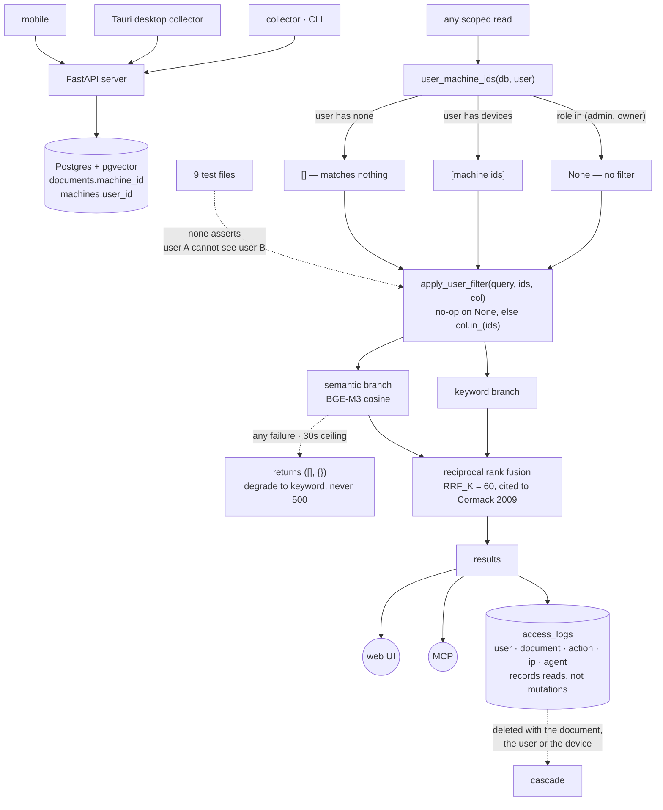

## 1. Executive Summary

Memento collects AI coding conversations from the tools and machines a person
already uses, aggregates them on a self-hosted backend, and serves them back
through a web interface and an MCP server. Python and Next.js over Postgres with
pgvector, AGPL-3.0, 457 files across a server, a collector, a Tauri desktop
collector, a mobile app and an embedding service.

**One mark: `scope_enforced`**, and it is earned on a shape this atlas asks for
by name: **one filter, written once, applied by every read path.**

`server/server/services/user_filter.py` is thirty lines and does the whole job.
`user_machine_ids` returns the machines a user owns, and its docstring states
the tri-state exactly: *"Returns None for admin/owner (no filtering needed —
they see everything). Returns empty list if user has no devices (sees
nothing)."* A user with no devices gets `machine_id IN ()`, which matches
nothing — the empty case fails closed, and it does so because someone decided it
should rather than because SQL happened to behave that way.

What is missing is the assertion. Nine test files sit beside it and **none of
them establishes that one user cannot see another's documents.** The closest,
`test_device_filter.py`, mocks the database and checks that a device lookup
returns `None` for sentinel values. The property the helper's own docstring
describes is the one property nothing exercises.

## 2. Mental Model

Ownership runs through devices. A collector on a machine ships conversations to
the server; the machine belongs to a user; a document belongs to the machine it
arrived from. So "your memory" means "documents from your devices", and every
scoped query filters on `machine_id`, not on a `user_id` column on the document.

That indirection is why the filter is a helper rather than a `where` clause: the
set of machine ids has to be resolved first, and resolving it is the only place
the user's role is consulted.

## 3. Architecture

## 4. Essential Implementation Paths

**The filter** — `server/server/services/user_filter.py`. Two functions.
`user_machine_ids` returns `None` for `admin`/`owner`, otherwise the user's
machine ids, which may be an empty list. `apply_user_filter` is a no-op on
`None` and otherwise appends `machine_id_col.in_(machine_ids)`. The admin
bypass is a return value rather than a branch at each call site, which is why
it cannot be forgotten in one place and remembered in another.

**Both search branches** — `server/server/api/search.py:128` resolves `mids`
once, `:153` applies the filter to the keyword query, `:189` to a follow-up
query, and the semantic ranker takes `mids` as an argument and applies the same
`in_` at `:72-73`. One resolution, three applications, no second derivation.

**The entity surface** — `server/server/api/memory.py` scopes differently and
more conventionally, composing `KnowledgeEntity.user_id == _user.id` directly at
`:29`, `:51`, `:72`, `:99`, `:220`, `:242`, each guarded by `if not admin`, plus
an ownership check on the by-id path at `:150`. Two scoping idioms in one
codebase — the helper on documents, inline predicates on entities — is worth
knowing before extending either.

**The degradation rule** — `search.py:33-37`. The semantic ranker returns
`([], {})` on *any* failure, with the reason stated: *"a missing/slow embedding
server must degrade this endpoint to pure keyword search, never 500 it. The
keyword branch is the floor; semantic is strictly additive."* The 30-second
timeout carries its own justification — BGE-M3 is CPU-only on Apple Silicon and
a cold cache with Chinese tokenization takes 5–12 seconds, so a shorter ceiling
*"produces false 'unavailable' and silently drops users back to keyword-only on
a healthy server."*

## 5. Memory Data Model

Documents carry the conversation content and a `machine_id`. A separate
knowledge layer holds `KnowledgeEntity` and `KnowledgeRelation` rows with a
direct `user_id`. Embeddings live in `DocumentEmbedding` for pgvector cosine
search.

`AccessLog` records `user_id`, `document_id`, `action`, `ip_address`,
`user_agent`, a JSONB metadata blob and `created_at`, indexed by user and by
document, both newest-first.

There is no status field, no supersession, no validity window and no
confidence: `grep -rl "tombstone\|supersede\|deleted_at\|confidence\|valid_from"`
over the Python returns nothing for any of them. A memory here is a record of
what was said, not a claim the system holds a position on.

## 6. Retrieval Mechanics

Hybrid: a keyword branch and a pgvector cosine branch, fused with reciprocal
rank fusion. `RRF_K = 60` carries a citation and a reason —
*"the value from the original RRF paper (Cormack et al. 2009) and the de-facto
default in Elasticsearch/Vespa: large enough that the top few ranks don't
dominate outright, small enough that rank-1 still clearly outranks rank-10."*

## 7. Write Mechanics

Collectors parse tool-native conversation formats and ship them. The parser
handles Anthropic `redacted_thinking` blocks by recording their size rather than
their content — `[redacted thinking: N bytes]`.

## 8. Agent Integration

An MCP server mounted on the API, a web UI, and collectors for several coding
tools across desktop and mobile.

## 9. Reliability, Safety, and Trust

**`scope_enforced`.** One helper, both search branches, and the empty case
failing closed by design rather than by accident.

Two limits belong on the record beside it. The bypass is broad: `admin` and
`owner` receive `None` and see every user's documents, which is a deployment
decision rather than a bug but is worth knowing for a multi-person instance. And
the boundary is device ownership — a document is yours because it arrived from
your machine, so re-assigning a machine moves its history with it.

**`audit_log` is withheld.** `AccessLog` is a genuine audit and it records the
wrong verb for this mark: it captures reads — who viewed which document, from
what address — not mutations of memory. Rows are also deleted when the document,
the user or the device is removed
(`admin.py:201`, `:235`, `devices.py:184`), which is the right behaviour for a
personal-data store and not the property "append-only" describes. The export
endpoint coarsens IP addresses to a /24 or /48 when audit rows are included,
which is a careful default.

**`negative_eval` is withheld**, and this is the finding of the page — section
10.

**`trust_state`, `tombstone`, `bitemporal` and `human_review` are withheld.**
Nothing carries an epistemic state, nothing records a rejected value, there is
one clock, and nothing waits for a person.

## 10. Tests, Evals, and Benchmarks

Nine test files under `server/tests/`, covering the conversation parser, session
compaction, orphaned subagents, title healing, workspace extraction, update
checks and the AI provider. Nothing was installed and nothing was run.

**No committed case asserts the isolation property.** `test_device_filter.py` is
the only file that touches the ownership code, and what it tests is lookup
behaviour with a mocked session: that `find_machine_by_id_or_hash` returns
`None` for the sentinel values `auto`, `ask_only` and `all` without issuing a
query (`db.execute.assert_not_called()`), and that it resolves a machine by
token hash, by name and by UUID fallback.

None of that exercises `apply_user_filter`. Seeding two users with one machine
each and asserting the second user's search returns nothing of the first's is
about fifteen lines, and it is the assertion the rubric describes as *the
cheapest catastrophic failure in the set* — one that costs nothing to write and
is unrecoverable once material has reached a prompt.

The gap is sharper here than in a project with no tests, because the helper's
docstring already states the property in words. What is written down as intent
is not written down as a case.

No benchmark and no paper.

## 11. For Your Own Build

### Steal

- **Resolve the scope once and pass it, rather than re-deriving it.**
  `user_machine_ids` runs a single query and every branch takes its result, so
  the keyword path and the semantic path cannot disagree about who the caller is.
- **Make the admin bypass a return value.** `None` meaning "no filter" is
  decided in one function; an `if is_admin` at each call site is decided at every
  call site.
- **Say what an empty scope means, in the docstring, before you need to.**
  *"Returns empty list if user has no devices (sees nothing)"* is the sentence
  that stops someone later "fixing" the empty case into a no-op.
- **State the reason for a timeout in the timeout's comment.** The note that a
  shorter ceiling *"produces false 'unavailable'"* is what keeps the next person
  from tuning it down.
- **Record the size of redacted content, not the content.**

### Avoid

- **Two scoping idioms in one codebase.** A shared helper on documents and
  inline `user_id ==` predicates on entities means a new surface has to know
  which half it belongs to.
- **Documenting an isolation property you never assert.** The docstring is
  precise and the suite is silent; the next refactor has nothing to fail against.

### Fit

Take it for a single-person or small-team self-hosted archive of coding
conversations. Before running it for more than one person, write the two-user
test.

## 12. Open Questions

- `admin` and `owner` see every user's documents. On a shared instance, is that
  intended to stay unconditional, or to become a per-action grant?
- Ownership is by device. What is meant to happen to a machine's history when
  the machine is transferred between users?
- The entity layer scopes by `user_id` and the document layer by `machine_id`.
  Are the two meant to converge?
- `AccessLog` rows are deleted with their document. Is a retained,
  document-free access record wanted for a shared deployment, or is deletion the
  privacy position?

## Appendix: File Index

| Path | What it holds |
| --- | --- |
| `server/server/services/user_filter.py` | the whole scoping mechanism, in two functions |
| `server/server/api/search.py` | both branches applying it, the RRF constant and the degradation rule |
| `server/server/api/memory.py` | the entity surface's inline `user_id` predicates and by-id ownership check |
| `server/server/db/models.py` | `AccessLog` and the document/machine/user chain |
| `server/server/middleware/access_log.py` | the read-audit writer |
| `server/tests/test_device_filter.py` | the only test touching the ownership code, and what it does not cover |

## Appendix: Recorded Searches

Run from the root of the checkout at the pinned commit.

| Claim | Command | Result at this pin |
| --- | --- | --- |
| Both search branches apply the filter | `grep -n "apply_user_filter\|mids" server/server/api/search.py` | Resolved once at `:128`, applied at `:153` and `:189`, and inside the semantic ranker at `:72-73` |
| No test asserts cross-user isolation | `grep -rln "apply_user_filter\|machine_ids" server/tests/`; then read the file | `test_device_filter.py` only, and it exercises `find_machine_by_id_or_hash` against a mocked session |
| ~~`search.py` does no scoping~~ — **false, a first pass grepped the wrong symbol** | `grep -c "user_id" server/server/api/search.py` returned 0 | The scoping is by `machine_id` through the shared helper; grepping the concept rather than the imported symbol produced a zero that meant nothing |
| No epistemic vocabulary exists | `grep -rl "tombstone\|supersede\|deleted_at\|confidence\|valid_from" --include='*.py' server mcp_server memento_brain` | Nothing for any of the five |
| The access log records reads, not mutations | read `server/server/middleware/access_log.py:1`, `db/models.py:301-317` | *"records document/page views to audit log"*; the row carries an action, an IP and a user agent |
| Access rows are deleted with their subject | `grep -rn "delete(AccessLog)" --include='*.py' server` | `admin.py:201` and `:235`, `devices.py:184` |

## History

**2026-09-20** — [`9f25d7fbc446b5dc94e3f484111e4fb1d712522d`](https://github.com/ddong8/memento/commit/9f25d7fbc446b5dc94e3f484111e4fb1d712522d) — first reading, at 457 files. Screened before reading: no auto-run surface, one build-time execution point, three unpinned surfaces and nothing inside the cooldown; nothing was installed and nothing was run. AGPL-3.0. One mark, `scope_enforced`, on a single shared device filter both search branches apply and whose empty case matches nothing by design. `audit_log` is withheld because the log records reads rather than mutations and its rows are deleted with their subject; `negative_eval` because no committed case asserts the isolation the filter's own docstring describes. One correction was made during the reading and is recorded in the appendix: a first pass grepped `search.py` for `user_id`, found none, and would have published a scope-leak claim about a file that scopes correctly through an imported helper by `machine_id`.
