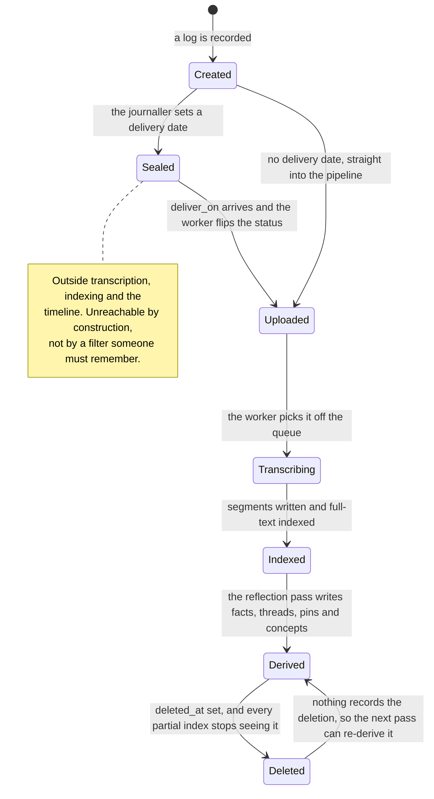

## 1. Executive Summary

Memento is a personal video journal — record a log, have it transcribed and
indexed, and let an agent derive structure from it. Its memory layer is a
208-line Postgres schema and a 1,231-line Python worker, and it earns a place
here for one mechanism the atlas has been looking for and one it did not know it
wanted.

**Licensing note.** The repository is under the **PolyForm Noncommercial License
1.0.0** — source-available, non-commercial, so you may read and use it but not
build a product on it.

**The mechanism worth the visit is the time capsule.** `entries.status` has six
values, and one of them is `sealed`. A sealed entry has been recorded and stored
and does *not* enter the pipeline: transcription, segmentation, full-text
indexing and the timeline all key off later statuses, so a sealed entry is
invisible to every read path in the system. Then, in the worker loop:

```sql
UPDATE entries SET status = 'uploaded'
 WHERE status = 'sealed' AND deliver_on <= current_date
   AND deleted_at IS NULL
RETURNING id, sol
```

`deliver_on` is a date column added in a later migration with the comment
`-- time capsules`. On its delivery date the entry becomes `uploaded`, which is
the head of the normal pipeline, and it is transcribed, indexed and surfaced as
if it had just been recorded.

This atlas has a section on **prospective memory** — the category almost nothing
models — occupied by two systems that remember *intentions*: a trigger-based
reminder and a durable to-do. Memento holds the other half of the idea. It is not
remembering to do something later; it is *content deliberately unreachable until
later*, enforced by a status the entire read path already respects rather than by
a filter someone must remember to apply. A user recording a message for a future
self gets a memory the system genuinely cannot retrieve, and then can.

**The second thing is quieter and more transferable.** `profile_facts` carries
`source_entry_id uuid REFERENCES entries(id)` — so a derived fact about the
journaller points back at the recording it came from — alongside a `source` of
`agent` or `user` and a `category` from `value | goal | person | preference |
sensitivity | context`. That `sensitivity` category is unusual: the system models
"things to be careful about" as a first-class kind of fact rather than as a tag.

**And the deletion model is enforced by index design.** Every table carries
`deleted_at`, and every live index is declared partial: `WHERE deleted_at IS
NULL`, `WHERE status = 'open' AND deleted_at IS NULL`, `WHERE status = 'active'
AND deleted_at IS NULL`. The read path cannot forget the predicate, because the
index that makes the query fast is the one that already excludes the dead rows.

The weakness is at the same join. `source_entry_id` is `ON DELETE SET NULL`, so
deleting the recording a fact came from leaves the fact in place with its
provenance silently erased — the fact outlives its evidence and nothing records
that it once had any.

## 2. Mental Model

Memory here is **layered derivation over an immutable recording**.

At the bottom, an `entry`: a video or audio log with a `sol` day-counter, a
duration, a media URI and a status. Above it, `segments` — transcribed spans with
timestamps and a `tsvector` under a GIN index. Above that, four derived stores,
all of which point back down: `annotations` on a segment, `concepts` joined to
entries with a `salience`, `threads` that stay open across days, `profile_facts`
about the person, and `pins` that are reminders or notes.

The recording is the evidence and everything else is a projection of it. That is
the [evidence before belief](../../patterns/evidence-before-belief/) shape, with
the unusual property that the evidence is a video file rather than a message log.

### How a thing becomes a belief

The worker moves an entry through `created → uploaded → transcribing → indexed`,
or into `error`. Only `indexed` entries participate in anything downstream — the
daily-summary compiler explicitly requires `status = 'indexed'`.

Once indexed, a reflection pass derives the upper layers. Facts, threads and pins
can also be created by the live agent's tools or by the user directly, and each
carries `source` recording which.

### How a belief stops being one

By soft delete: `deleted_at` set, and every partial index stops seeing it. By
status: a thread moves `open → resolved | dropped`, a pin moves `active → done |
dismissed`, and the live indexes cover only the first value in each case.

Nothing is superseded and nothing is tombstoned. A profile fact that becomes
wrong is deleted, and the next reflection pass over the same indexed entries can
derive it again — the deletion is not recorded anywhere the derivation consults.



## 3. Architecture

A Next.js web application over Postgres, with a Python worker beside it. No
vector store — retrieval is Postgres full-text over `segments.ts` with a GIN
index, plus category and status listings over the derived tables.

**The worker is the whole background story** and it does five things in a loop:
pick up uploaded entries and transcribe them, index the segments,
`unseal_due_capsules`, `compile_daily_summaries`, and run the reflection pass.
The daily-summary compiler is careful in a way worth noting — it deletes a
summary for any day whose entries have all gone, so a derived artifact does not
outlive the material it summarised. That is exactly the discipline the profile
facts do not get.

**Scope is `user_id`**, present on every table and inside every partial index, so
the scope key and the liveness predicate are enforced by the same object.

### Deployment and ergonomics

Postgres, a Node app and a Python worker, plus whatever transcription backend is
configured. Heavier than a local-first journal and lighter than a platform.

The store is SQL and the schema is 208 readable lines, so repair is a query.

The licence is the operative constraint: PolyForm Noncommercial means this is a
design to read and a tool to run personally, not something to build on.

## 4. Essential Implementation Paths

**Schema** — `db/schema.sql`: `entries` (`:15`) with the six-value status,
`segments` and the FTS index (`:55`), `annotations`, `concepts` and
`entry_concepts`, `threads`, `profile_facts`, `pins`, `daily_summaries`, and the
`deliver_on` migration at `:188`.

**Time capsules** — `worker/worker.py:466` (`unseal_due_capsules`), with the
sealing side in `web/src/app/api/entries/route.ts`.

**Derivation** — `worker/worker.py`: the transcription and indexing steps, and
`compile_daily_summaries` at `:480`.

**Read paths** — `web/src/app/api/` (`entries`, `threads`, `pins`, `profile`),
each filtered by `user_id` and relying on the partial indexes for liveness.

**Briefing** — `scripts/briefing.py`.

## 5. Memory Data Model

Nine tables, and the interesting columns are the ones that connect them.

`annotations.source` and `profile_facts.source` and `pins.source` all take
`agent | user`, so every derived object records whether a person or the model
asserted it. `profile_facts.source_entry_id` and `pins.source_entry_id` point at
the recording behind them.

`entry_concepts.salience` is a float on the join rather than on either table,
which is the right place for it — the same concept can matter a great deal in one
entry and barely in another.

**Temporal modelling is record time plus one exception.** `recorded_at`,
`created_at` and `updated_at` are all bookkeeping; `deliver_on` and `pins.due_on`
are the two columns that refer to the future, and they are what makes the
prospective half of this system work.

## 6. Retrieval Mechanics

Full-text over transcript segments, and listings over the derived tables filtered
by category, status and user.

The failure modes are the ones a journal has:

- **Transcription quality is the ceiling on everything.** Every downstream store
  is derived from segments; a mis-transcribed name is a wrong concept and
  possibly a wrong profile fact, with no path back.
- **There is semantic retrieval, and the first version of this report said there
  was not.** `segments.embedding` is a `vector(768)` filled by the worker with
  nomic-embed-text, indexed `USING hnsw (embedding vector_cosine_ops)`, and
  `web/src/lib/search.ts` runs the lexical and vector lanes concurrently, then
  appends the semantic hits the lexical lane did not already return. `/search`
  shows the literal matches; the semantic lane exists for Ask and the live
  agent's `search_journal` tool.
- **The distance ceiling is the part worth copying.** `SEMANTIC_MAX_DIST`
  defaults to 0.33, and the comment records how the number was chosen: without a
  ceiling a nearest-neighbour query returns its full `LIMIT` however far the rows
  are, and the nearest distance *for pure gibberish* was measured at ~0.47 on a
  90-segment corpus against ~0.34 on a 600-segment one, so the ceiling sits under
  the larger corpus's noise floor. The same comment notes that the nomic task
  prefixes are omitted on both sides and that adding them roughly tripled the
  signal-to-noise gap in testing, but would require re-embedding every segment.
  That is a measured threshold with its own corpus-size caveat written down,
  which is rare.
- **A missed embedding is missed forever.** `embed_texts` returns `None` on any
  failure — *"search degrades to FTS without these"* — and the indexer's
  `if embeddings:` then skips the `UPDATE`, while the entry still advances to
  `indexed`. No query anywhere in the repository looks for
  `embedding IS NULL`, so nothing backfills. A transient embedder outage during
  indexing removes those segments from the semantic lane permanently, and the
  `AND s.embedding IS NOT NULL` in the search query makes the loss invisible
  rather than an error.
- **A sealed entry is invisible to search by design**, which is correct, and
  means a user who forgets they sealed something has no way to find it.

## 7. Write Mechanics

The write path is a pipeline with explicit statuses and a queue index
(`entries_queue ON entries (status, created_at) WHERE status = 'uploaded'`) —
a partial index that *is* the work queue, which is a neat way to avoid a separate
job table.

Derivation is deferred to the worker, so nothing blocks a recording. The lag
between recording and retrievability is the transcription time plus the worker's
poll interval, and for a sealed entry it is however long the user chose.

There is no deduplication of derived facts, and no conflict handling: two
reflection passes that derive the same fact differently produce two rows.

## 8. Agent Integration

The agent writes through tools that create annotations, pins and profile facts,
and each write records `source = 'agent'`. That is the cleanest part of the
integration: the agent's contributions are distinguishable from the user's at
every layer, permanently, in a column rather than a convention.

The live agent also has `create_pin`, which is how a conversation turns into a
dated reminder.

## 9. Reliability, Safety, and Trust

**Provenance is real at the schema level** — `source` on three tables and
`source_entry_id` on two — and this is the strongest column.

**And it is undermined by one clause.** `source_entry_id ... ON DELETE SET NULL`
means deleting a recording leaves every fact derived from it in place with a null
provenance. The fact survives, its evidence does not, and nothing distinguishes
"derived from an entry that has since been deleted" from "never had a source".
`ON DELETE CASCADE` would be wrong too — a user deleting one video should not
silently lose a preference — but the third option, a tombstone on the link, is
the one that would let the system say what happened.

**And the clause only fires on the one path that matters.** `deleted_at` is a
soft delete, so `ON DELETE SET NULL` never triggers from the trash — the only
hard `DELETE FROM entries` is `api/vault/purge`, which requires the row to be in
the trash already, is scoped to the user, and collects the object keys before it
deletes the rows because *"a stray object is recoverable, a half-deleted row is
not"*. Its docstring also states the consequence outright: *"pins, threads,
profile_facts and story_topics keep their rows with a null source"*. So the
orphaning is a decision, not an oversight — and the decision is that the only
way a user can truly erase a recording leaves everything the system concluded
from it still asserting itself, with the evidence gone. For a journal whose
`profile_facts` categories include `sensitivity`, that is the sharpest edge in
the system.

**Deletion is soft everywhere and enforced by partial index**, which is a genuine
strength: liveness cannot be forgotten because the index that makes the query
viable already encodes it.

**The seal holds, and it holds structurally rather than by a filter.** Eleven
queries across the web layer carry `status <> 'sealed'` — the timeline, the
entry read, the media GET, the calendar, the day view, the export, the counts —
and two carry `status = 'sealed'` deliberately, to show a capsule count without
its contents. Neither search lane carries the predicate, and does not need to:
`deliver_on` is written only by the `INSERT` in `api/entries`, the media upload
decides `sealed` against it once, and the worker polls `status = 'uploaded'`, so
a sealed entry is never transcribed and has no segments to match. The invariant
rests on an insert-only column rather than a read predicate, which is sound here
and would stop being sound the moment a delivery date became editable.

**One write is missing the user key the rest of the codebase applies.** The
media `PUT` in `api/entries/[id]/media` updates `media_uri`, `media_mime`,
`status` and `error` `WHERE id = $3` — no `user_id`, where the `GET` three lines
below it and every other statement in the repository carry one. With the app
pinned to a single `USER_ID` constant nothing exploits it today; it is the one
place in an otherwise uniform pattern where the boundary is absent.

**There is no trust state**, and the status columns that look like one are not.
`threads` carries `open | resolved | dropped`, `pins` carries
`active | done | dismissed` and `story_topics` carries
`pending | done | skipped` — three workflow vocabularies about whether a task is
still being pursued, none of them a statement about whether the content is
believed. `source` is provenance, not status; `profile_facts` has no
supersession, no validity window and no status at all, so nothing marks a
derived fact uncertain and the reflection pass can re-derive anything a user
deleted.

**Profile facts dedup semantically and never supersede.** Before inserting, the
reflection pass embeds the candidate and refuses it if any live fact sits within
cosine distance 0.35 — *"LLMs rephrase known facts despite instructions"* —
falling back to an exact lowercased string match when the embedder is
unreachable, which is a much weaker filter at exactly the moment rephrasing is
most likely to slip through. Two consequences follow. The probe is
category-blind, so a `sensitivity` fact can be suppressed by a near-identical
`context` one. And a fact that has *changed* is by construction further than
0.35 from its predecessor, so it is inserted alongside it and both stay live:
the profile accumulates contradictions rather than correcting them, and nothing
in the schema can express which one is current.

## 10. Tests, Evals, and Benchmarks

No test suite was found. For a system whose correctness lives in a status machine
and a set of partial indexes, the absent tests are specific and cheap: that a
sealed entry does not appear in the timeline or in search; that
`unseal_due_capsules` fires on the boundary date and not before; that a
soft-deleted thread leaves the open-threads index; that deleting an entry does
not delete the facts derived from it.

The first of those is also the one negative-retrieval assertion this system most
obviously needs, and its absence is why `negative_eval` is withheld.

## 11. For Your Own Build

### Steal

**Seal a memory until a date, and make the seal a status the read path already
respects.** `sealed` is not a filter applied at query time — it is a state
outside the pipeline, so the entry has no segments, no index entry and no
timeline row until it is unsealed. That is much harder to leak than a
`WHERE deliver_on <= now()` predicate that every query must remember.

**Point a derived fact at the evidence that produced it.** `source_entry_id` on
`profile_facts` is one column and it turns "why does it think that?" from a guess
into a join.

**Put liveness in the index, not the query.** Declaring every live index
`WHERE deleted_at IS NULL` means the fast path and the correct path are the same
object, and a query that forgets the predicate is also a query that misses the
index.

**Delete a derived summary when its source rows are gone.** The daily-summary
compiler removes summaries for days that lost all their entries. Most systems
here let derived artifacts outlive their evidence silently.

**Calibrate a distance ceiling against gibberish, and write down the corpus size
you measured on.** Memento's semantic lane caps neighbours at cosine 0.33, and
the comment beside the constant says the nearest distance for pure gibberish was
~0.47 on a 90-segment corpus and ~0.34 on a 600-segment one. That is the right
experiment — the noise floor moves with corpus size, so a threshold without a
corpus size attached is not a measurement — and almost nothing else in this
atlas records both numbers.

**Model sensitivity as a category of fact.** `sensitivity` sitting beside `value`
and `preference` gives the agent somewhere to record "be careful about this"
that is not a tag on something else.

### Avoid

**Do not `SET NULL` a provenance link.** It converts "derived from a deleted
recording" into "came from nowhere", which is indistinguishable from a fact the
system invented. If the parent can go, record that it went.

**Do not let a reflection pass re-derive what a user deleted.** Soft-deleting a
profile fact removes it from every read and from nothing else, so the next pass
over the same indexed entries produces it again. This is the recurring shape in
this atlas and the cheapest fix is a rejection record the derivation consults.

**Do not ship a status machine with no test on its boundary.** The whole time
capsule mechanism is one date comparison, and nothing asserts it fires on the
right day.

### Fit

This suits a person who wants a video journal that understands itself — a daily
log that turns into threads, facts and reminders without being asked. It is a
personal tool and the licence says so; the schema is the artifact worth reading,
and it is short enough to read in one sitting.

It is not a memory layer for an agent product, and not only because of the
licence. The unit is a recording, the derivation is one-way, and correction means
deleting a row that the next pass may recreate. Take the sealed-until-a-date
mechanism and the provenance column; leave the rest where it is.

## 12. Open Questions

- **What happens to a capsule sealed for a date that has already passed?** The
  unseal query uses `<= current_date`, so it would unseal on the next tick — but
  whether the API prevents setting a past date could not be read off the schema.
- **Does the reflection pass re-derive facts the user deleted?** The mechanism
  suggests yes and nothing records the deletion, but observing it would need a
  run.
- **How are sealed entries presented to the user before delivery?** They are
  outside every read path this report traced, which raises the question of how
  someone cancels or edits one.

## Appendix: File Index

**Schema** — `db/schema.sql` (entries and the status vocabulary, segments and the
FTS index, annotations, concepts, threads, profile facts, pins, daily summaries,
and the `deliver_on` migration).

**Worker** — `worker/worker.py` (`unseal_due_capsules` at `:466`,
`compile_daily_summaries` at `:480`, the transcription and indexing steps).

**API** — `web/src/app/api/entries/`, `threads/`, `pins/`, `profile/`.

**Briefing** — `scripts/briefing.py`.

**Licence** — `LICENSE` (PolyForm Noncommercial License 1.0.0).

## History

**2026-09-18** — [`f8e1dc14235f74602ebc7d5a2c5d108901ff3b6b`](https://github.com/xD4O/memento/commit/f8e1dc14235f74602ebc7d5a2c5d108901ff3b6b) — re-read at the same commit. Nothing upstream had moved, so every correction is the atlas's own, and the largest was a negative existence claim: section 6 said there was no semantic retrieval. There is. `segments.embedding` is a `vector(768)` written by the worker with nomic-embed-text, indexed with HNSW, and queried as a second lane beside Postgres full text with a measured distance ceiling; `profile_facts` carries embeddings too, and the reflection pass uses them to refuse a fact within cosine 0.35 of a live one. `stack_retrieval` goes from `lexical` to `lexical, vector` and `stack_source` from seeded to reviewed.

Three further findings. A segment whose embedding failed is never re-embedded — `embed_texts` returns `None`, the indexer's `if embeddings:` skips the update, the entry still reaches `indexed`, and no query anywhere looks for `embedding IS NULL` — so an embedder outage during indexing silently removes those segments from the semantic lane for good. The fact dedup is category-blind and has no supersession, so a changed fact is inserted beside its predecessor and the profile accumulates contradictions. And the media `PUT` updates `WHERE id = $3` with no `user_id`, the one statement in the repository without the key that every other one carries.

Two of the previous reading's claims were sharpened rather than corrected. The seal was verified across every read path: eleven queries carry `status <> 'sealed'`, neither search lane does, and it does not need to, because `deliver_on` is written only at `INSERT` and a sealed entry is never transcribed — the invariant rests on an insert-only column rather than a predicate. And the `ON DELETE SET NULL` orphaning fires only from `api/vault/purge`, whose own docstring states that `profile_facts` keep their rows with a null source — so it is a stated decision, and the decision is that the only path a user has to truly erase a recording leaves every conclusion drawn from it still asserting itself.

**2026-07-31** — [`f8e1dc14235f74602ebc7d5a2c5d108901ff3b6b`](https://github.com/xD4O/memento/commit/f8e1dc14235f74602ebc7d5a2c5d108901ff3b6b) — first reading.
