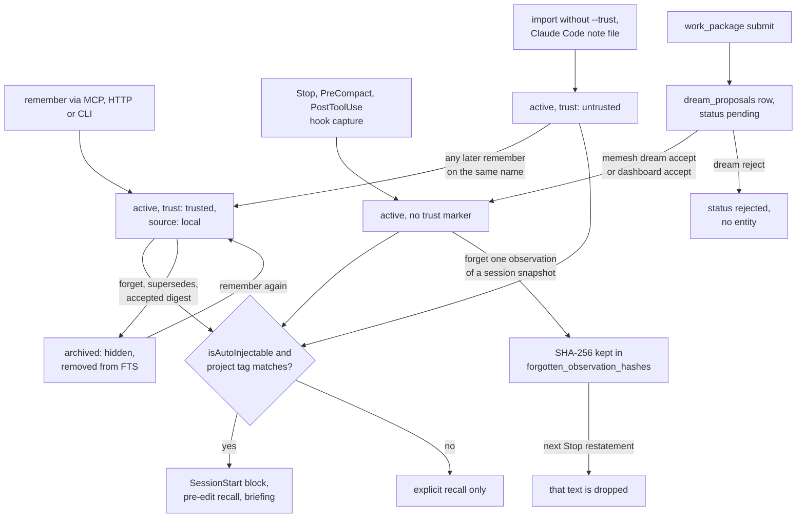

## 1. Executive Summary

MeMesh is a local memory and messaging layer for coding agents, shipped as a
Claude Code plugin, a Codex plugin, an MCP server, a CLI and a loopback HTTP
API over one SQLite file. Memories are named entities with observations,
tags and relations. They come from explicit `remember` and `learn` calls, from
deterministic hooks that capture session snapshots and commits, and from
imports. A SessionStart hook injects a project-scoped block of them into every
session.

What is notable is the discipline around what reaches a model unasked. One
predicate, `isAutoInjectable`, decides it for every automatic path: the
session-start hook, the pre-edit hook and the MCP `briefing` tool. Imported
memories are recallable and never injected. A forgotten observation in a
session snapshot is kept as a hash that the Stop hook's next restatement
refuses. Agent-prepared consolidations wait in a proposal queue with no accept
verb on the agent's tool surface.

What is weak sits at the edges of those same mechanisms. A plain `remember` on
an imported memory's name stamps it trusted and local, so one appended
observation promotes it. Ingested Claude Code note files are stamped untrusted
and so never reach the briefing their ingester says they reach. Two proposal
kinds, guard and relation, have appliers and no writer at this pin.

The codebase is heavily commented with the defects each line fixed, often with
the measurement that found them. The messaging subsystem — durable
exact-recipient agent messages, native Codex delivery, a local router — is as
large as the memory layer and is not covered here, because a message is not a
claim that can be corrected.

Five marks: `tombstone`, `trust_state`, `scope_enforced`, `human_review` and
`negative_eval`. Section 9 names the two withheld and qualifies each award.

## 2. Mental Model

A memory is an **entity**: a unique name, a type such as `decision`,
`lesson_learned` or `session-insight`, an optional title, and a list of
observation strings. Tags carry the project (`project:` plus a derived
identity) and file references (`file:`). Relations are free-form labels, two of
which act: `supersedes` archives its target, and `contradicts` annotates both
ends as a conflict whenever they are recalled together
(`src/core/operations.ts:362-373`; `src/storage/conflicts.ts`).

**A memory holds two independent states.** `entities.status` is `active` or
`archived`, and every read filters archived rows unless asked not to.
`metadata.trust` is `trusted` or `untrusted`, and an untrusted row, or one whose
`provenance.source` is `import`, is withheld from every path that injects
without being asked (`src/core/work-topology.ts:122-128`). It stays reachable by
explicit recall. The first state answers whether a memory is current; the
second, whether anything has vouched for it.

**Becoming a belief is the write path's choice of marker.** An explicit
`remember` through MCP, HTTP or the CLI stamps `trusted` and
`provenance.source: 'local'` (`src/core/operations.ts:37-51`). Hook captures
carry no marker, which the gate reads as allowed. A JSON import stamps
`untrusted` unless the operator confirms `--trust` (`src/core/serializer.ts:538-545`).
Note files ingested from Claude Code's own memory directory arrive through
`remember` with `trustOverride: 'untrusted'`, which the same function writes as
the read-side marker (`src/core/note-ingest.ts:602-620`).

**Promotion is implicit.** `buildLocalMetadata` sets `trust` to the caller's
override or `'trusted'`, and no transport exposes the override. Any later
`remember` on an untrusted memory's name therefore makes it trusted and local.
The JSON importer is careful not to do this on append
(`tests/core/import-trust.test.ts:109-124`); the ordinary write path does it by
default.

**Agent-prepared memories take a third route.** `work_package` hands the agent
a bounded, redacted package of recent transcript turns or a week's cluster of
memories, and its `submit` action inserts a `pending` row in `dream_proposals`
(`src/core/dreamer.ts:225-386`). A pending proposal is not an entity, and no
read path consults it. `memesh dream accept` or the dashboard's accept route
turns it into one, and for a calendar digest archives the sources it
summarises.

**A memory stops being one in four ways.** `forget` archives the entity and
removes it from the FTS index; a `supersedes` relation archives the target; an
accepted digest archives its sources; `replace: true` rewrites the
observations and files the old ones under `metadata.replaced_history`, at most
20 versions and 64 KB (`src/core/operations.ts:89-116`). A plain `remember` of
an archived name reactivates it. Entity rows are hard-deleted only by the demo
reset; observation rows are deleted by observation-level forget, by `replace`
after the copy, by `import --merge overwrite` with no copy, and by the Stop
hook's wholesale restatement of a snapshot.

**Observation-level forget leaves a hash behind on one class of entity.** The
Stop hook restates three per-session snapshot entities from the transcript on
every turn. Removing one observation from such a snapshot writes the SHA-256 of
its text into `metadata.forgotten_observation_hashes`, and the next restatement
drops any observation whose hash is listed (`src/knowledge-graph.ts:1219-1230`;
`scripts/hooks/_shared.js:1947-1953`).

Confidence is a float from 0.01 to 1.0. It rises by 0.05 when a trusted write
adds a new observation to an existing active memory, decays by 0.9 for rows
unaccessed for 30 days, and ranks. It filters nothing.

## 3. Architecture

Everything runs locally on Node 22.13 or later. The store is one SQLite file,
`~/.memesh/knowledge-graph.db`, opened by the MCP stdio server
(`src/mcp/server.ts` → `src/transports/mcp/handlers.ts`), the CLI
(`src/transports/cli/cli.ts`), the Express HTTP server behind the dashboard
(`src/transports/http/server.ts`) and the ten hook commands `hooks/hooks.json` registers.
All four share `src/core/operations.ts` for memory CRUD.

The schema lives in one module, `src/storage/schema.ts`, which a build step
copies into `scripts/hooks/_generated/` so the hooks and the core open the same
bytes; a CI `git diff --exit-code` guards the copy. Memory tables are
`entities`, `observations`, `relations` and `tags`, with `status`, `confidence`,
`namespace`, `title`, access counters and recall-hit counters added by
per-column migrations (`src/storage/schema.ts:20-66`, `:408-442`). Proposals
live in `dream_proposals` (`src/db.ts:290-306`). The messaging tables beside
them are out of scope here.

The keyword index is a **contentless FTS5 table**, `entities_fts`, over name,
title and observations with `unicode61 remove_diacritics 1` and CJK bigram
pre-segmentation (`src/storage/schema.ts:349-359`; `src/storage/fts-index.ts`).
Contentless means a delete must repeat the exact text that was indexed, so every
mutation that changes indexed text reads the old text and rewrites the row
inside one immediate transaction. Several comments record what went wrong when
it did not, including 213 archived entities still present in the index on the
maintainer's graph (`src/knowledge-graph.ts:453-470`).

Nothing runs in the background as a process. Opening the database runs the
migrations and a confidence decay throttled to once a day
(`src/db.ts:150-156`; `src/core/lifecycle.ts:17-55`). The hooks are short-lived
processes with 3- to 10-second timeouts.

### Deployment and ergonomics

- Running: nothing beyond the SQLite file. `memesh serve` starts the dashboard
  and HTTP API on 127.0.0.1:3737 when wanted.
- Offline: fully. The README states this version calls no LLM, embedding or
  vector provider, and the retrieval code has no such call.
- API key: none. A bearer token is created only when the HTTP server binds a
  non-loopback address (`src/transports/http/server.ts:144-160`).
- Install: `/plugin install memesh@pcircle-memesh` in Claude Code, or
  `npm install -g @pcircle/memesh`. The plugin does not install the CLI.
- Repair: the store is SQLite, `memesh export` writes JSON, and `memesh doctor`
  probes hooks, capture liveness and index health.

## 4. Essential Implementation Paths

**Explicit write.** MCP `remember` validates with Zod and calls
`remember({ ...args, sourceHost })` (`src/transports/mcp/handlers.ts:646`).
`remember` runs `rememberInTransaction` inside `db.transaction(...).immediate()`
(`src/core/operations.ts:77-87`). It refuses `replace` on an archived memory
(`:222-227`), captures the old version and clears it for `replace`
(`:262-289`), calls `kg.createEntity` (`:305-311`), stamps metadata through
`buildLocalMetadata` (`:322-338`), creates relations, and archives every
`supersedes` target (`:362-373`). `createEntity` is `INSERT OR IGNORE` on the
name, reactivates an archived row (`src/knowledge-graph.ts:445-451`), bumps
confidence under the trust rule (`:504-527`), dedups observations by content
except for the lesson family (`:581-621`), and rebuilds the FTS row (`:624`).

**Hook capture.** `session-summary.js` (Stop) derives up to three snapshot
entities per session from the transcript by rule — `session-ID-files`,
`-fixes`, `-summary` — and writes each with `captureEntity(..., replace: true)`
(`scripts/hooks/session-summary.js:434`, `:468-510`). `captureEntity` refuses to
touch an archived row (`scripts/hooks/_shared.js:1822-1823`), clears the old
observations, filters forgotten hashes and exact repeats (`:1947-1953`), and
reindexes. `pre-compact.js` and `post-commit.js` append per-session and
per-commit entities through the same function.

**Search.** `recall` → `recallForAgent` → `recallWithConflicts` →
`recallEnhanced` → `searchAndScore` → `KnowledgeGraph.search`
(`src/core/operations.ts:447-514`). `search` runs a strict all-terms FTS5 match
ordered by BM25 `rank` with an id tiebreak, falls back to OR when the strict
pass is empty, and filters `status = 'active'` plus an optional tag and
namespace (`src/knowledge-graph.ts:860-930`). `rankEntities` then reorders by
the five-factor score (`src/core/scoring.ts:74-109`). The agent view caps each
entity at 8 KB and the response at 32 KB (`src/core/recall-agent-view.ts`).

**Context assembly.** The SessionStart hook assembles the block in SQL
(`scripts/hooks/session-start.js:1250-1420`): project candidates joined on the
project tag, the newest decisions first, up to five lessons, a separately
budgeted global section at level `full`, five foreign rows at `full`, and the
project's session handoff. Every candidate passes `isTrustedForAutoContext`.
The MCP `briefing` tool reaches the same selection through
`src/core/briefing.ts:403-432`. `pre-edit-recall.js` injects memories tagged
with the edited file's name and project, then confirmed FTS hits
(`scripts/hooks/pre-edit-recall.js:288-440`).

**Correction and forgetting.** `forget` with an `observation` calls
`removeObservation`, which deletes the earliest matching row, records the hash
for a session snapshot and rewrites the FTS row
(`src/knowledge-graph.ts:1179-1246`). Without one it calls `archiveEntity`
(`:1150-1177`). `replace` keeps the prior version. `import` with `overwrite`
deletes the prior observations and tags without archiving.

**Proposals.** `executeWorkPackage` prepares a package, stages a submission and
returns `review_authority: 'human'` (`src/core/dreamer.ts:225-386`).
`applyProposal` dispatches by kind to relation, guard, product-improvement,
transcript or calendar-digest appliers (`:646-960`); `rejectProposal` sets
`rejected` with a reason (`:975-980`). Their callers are `memesh dream accept`
and `reject` (`src/transports/cli/cli.ts:2563-2612`) and
`POST /v1/dream/proposals/:id/accept` and `/reject`
(`src/transports/http/server.ts:1058-1110`).

**Integration.** `hooks/hooks.json` registers the ten hook commands;
`.claude-plugin/mcp.json` starts `dist/mcp/server.js`. `extensions/hermes-memesh`
and `extensions/memory-memesh` adapt the store to Hermes and OpenClaw.

## 5. Memory Data Model

| Field | Where | Notes |
| --- | --- | --- |
| name | `entities.name` | unique; the idempotency key, derived from the text for the `note` form |
| type, title | `entities` | free-form type up to 100 characters; `lesson`, `mistake` fold into `lesson_learned` |
| status | `entities.status` | `active` or `archived`; filtered on every read by default |
| confidence | `entities.confidence` | 0.01–1.0; bumped by trusted new observations, decayed daily, ranked |
| namespace | `entities.namespace` | `personal`, `team` or `global`; `global` rows get their own section at level `full` |
| access and recall counters | `entities` | `access_count`, `last_accessed_at`, `recall_hits`, `recall_misses` |
| valid_from, valid_until | `entities` | declared, never written |
| observations | `observations` | one row per string, `created_at` each |
| tags | `tags` | `project:`, `file:`, `source:` and free tags; unique per entity |
| relations | `relations` | typed edges; `supersedes` and `contradicts` act |
| metadata | `entities.metadata` JSON | `trust`, `provenance`, `replaced_history`, `forgotten_observation_hashes`, `pin`, `signal_score`, `previous_namespace` |

**Scope is a tag, not a column.** The project identity comes from
`getProjectName`: the canonical git remote, else the repo root, else the cwd,
each rendered as a readable label plus a 128-bit hash prefix
(`src/core/paths.ts:121-151`). Hook captures stamp it. The MCP `remember` tool
leaves it to the caller, whose description tells it to copy the `project` field
from `briefing`. A memory with no project tag and no `global` namespace is
reached by explicit recall and, at level `full`, the foreign section.

**Provenance is metadata.** `source_host` is stamped on first insert only, so a
second host's re-remember cannot rewrite it (`src/core/operations.ts:326-336`).
Note files record a relative path and content hash. Imported bundles are
filtered through a deny-list of bookkeeping keys, and a bundle cannot set
`forgotten_observation_hashes` on an entity that already exists
(`src/core/serializer.ts:239-275`).

**There is no temporal validity.** `valid_from` and `valid_until` were added by
a migration and are written by nothing; `src/core/scoring.ts:9-13` says so and
records that the factor built on them was removed because it scored a constant.

## 6. Retrieval Mechanics

Explicit recall is FTS5 only. A query of one or two terms is OR-matched; three
or more try all terms first and fall back to OR. Terms present in most of the
corpus are dropped through an `fts5vocab` view, and at most 32 terms survive.
The window is ordered by BM25 before the `LIMIT`, then `rankEntities` scores
relevance by BM25 position (0.30), recency (0.25), frequency (0.18), confidence
(0.17) and a Laplace-smoothed recall-impact ratio (0.10).

The session-start block has no query. It ranks the project's candidates in SQL
on recency, frequency and confidence with the same proportions, over-fetches a
wide window because the trust filter runs in JavaScript afterwards, and gives
decisions and lessons their own slots. The handoff, task state, ranked memories,
global memories and an index of durable memories share a 4,000-character
budget. The block sits in `additionalContext` at session start, and after
compaction, when SessionStart fires again.

**Recall impact is measured, not assumed.** Injected lines carry `[mem:ID]`
handles, and the Stop hook matches injected names against the transcript to
increment `recall_hits` or `recall_misses`, the one writer of both
(`src/storage/conflicts.ts` comment on `trackAccess`). A memory the agent keeps
ignoring sinks.

The failure modes are the ones keyword search has. A paraphrase with no shared
term misses. `cross_project` reads as a scoping switch and is not one: its
description states that `false` keeps a caller-supplied tag and "does not
implicitly limit results to the current project"
(`src/transports/mcp/handlers.ts:194-197`). Recall without a tag spans every
project in the file.

## 7. Write Mechanics

Explicit writes are synchronous: one immediate SQLite transaction, no model
call, retrievable by the next query. Hook captures run at Stop, PreCompact and
PostToolUse with 5- to 10-second timeouts and are retrievable by the next
session start. Work-package proposals wait for a person indefinitely.

**Dedup is by name and by exact observation text.** Re-remembering a name
appends only observations not already stored, except for the lesson family,
whose ordered `Error:`/`Fix:` blocks may repeat (`src/knowledge-graph.ts:553-580`).
The `note` form derives the name from the text, so the same note twice is one
memory.

**Conflicts are declared, never inferred.** `contradicts` must be written by a
caller; nothing compares content. The tool description says so, and says the
same about causal relations.

**Filtering is for credentials and control characters.** The `note` form strips
control characters and credential-shaped strings before storing. Nothing
screens a claim for truth or for injected instructions on the MCP path; the
OpenClaw adapter carries its own prompt-injection refusal
(`extensions/memory-memesh/index.ts:391`). Injected blocks are fenced as
untrusted background data.

### Operational cost

- Write: synchronous and local; no extraction step exists.
- Background: a daily confidence decay on open. No pass rewrites the store.
  Accepting a calendar digest archives its sources, once per accept.
- Read: bounded. The session-start block is capped at 4,000 characters for
  memories plus a 40-line, 3,072-byte index; recall is capped at 32 KB. The
  block is injected at session start, so it sits ahead of the conversation and
  changes only between sessions.

## 8. Agent Integration

Claude Code gets the most: the plugin registers nine hook commands in
`hooks/hooks.json`, the MCP server and a `/memesh` skill. SessionStart injects
the block; PreToolUse on Edit and Write injects file-relevant memories and
evaluates lesson guards; PreToolUse on Bash evaluates guards; Stop captures
snapshots and blocks once per waiting agent message; PreCompact saves;
PostToolUse records commits and nudges a `remember` after a plan or a question;
UserPromptSubmit detects "remember this" in five languages and nudges. The
tenth command registers Codex sessions for messaging. The README states which
of the other hooks fire under Codex is unverified.

The MCP surface has twelve tools: `work_package`, `remember`, `recall`,
`forget`, `export`, `import`, `learn`, `task_state`, `briefing`,
`user_patterns`, `improvement` and `message`
(`src/transports/mcp/handlers.ts:62-400`). The agent is expected to call
`remember` for decisions and `learn` for lessons; the hooks do the rest.
`task_state`'s description instructs the model to record only what the user
stated and never to infer a goal from edits.

Adapting it to another agent means calling `briefing` at session start and
`remember`/`recall` explicitly, which the README describes for MCP-only
clients.

## 9. Reliability, Safety, and Trust

**The auto-injection gate has one owner.** `isAutoInjectable` is a leaf module
the hooks import through a generated copy, so the session-start hook and the
MCP briefing cannot diverge on what reaches a model unasked. It fails closed on
unparseable metadata, which a committed case pins
(`tests/core/briefing.test.ts:716-730`).

**Implicit promotion undercuts it.** `buildLocalMetadata` writes
`trust: overrides?.trust ?? 'trusted'` and `source: 'local'` on every
`remember` (`src/core/operations.ts:37-51`). No MCP, HTTP or CLI schema exposes
the override. An agent that appends one observation to an imported memory's
name therefore makes the whole memory, including the imported text, eligible
for injection. The importer guards the same transition on its own append path
and tests it. This was read, not reproduced.

**Ingested note files never reach the briefing.** `note-ingest.ts` says a note
written in Claude Code's memory directory becomes "eligible for the briefing
without a second write". It writes through `remember` with
`trustOverride: 'untrusted'` (`src/core/note-ingest.ts:602-620`), which
`buildLocalMetadata` stores as `metadata.trust`, which `isAutoInjectable`
refuses. The dreamer's transcript applier separates the two markers on purpose
and says why (`src/core/dreamer.ts:614-626`); `remember` still sets both from
one argument. Read, not reproduced.

**Declared and unwired, twice.** `applyGuardProposal` writes `metadata.guard`
on a lesson, which `guard-check.js` and `pre-edit-recall.js` evaluate before a
command or edit. `applyRelationProposal` creates relations. The three
`INSERT INTO dream_proposals` statements write digest and product-improvement
kinds only, so at this pin guards and relation proposals exist only in
databases that held them before the proposer was retired. `valid_from` and
`valid_until` are the third unwired declaration.

**Concurrency is taken seriously.** Ten hook processes, the MCP server, the
HTTP server and the CLI share the file. Migrations run inside immediate
transactions with a 24-hour backoff, read-only opens stay readers, and
`safeAlter` tolerates the one expected race (`src/storage/schema.ts:361-378`,
`:631-706`).

**Entity deletion is soft; observation deletion is not.** `forget` on a name
archives, and the text stays in the row and in exports. `forget` with an
`observation` deletes that row outright, keeping only a hash and only for a
session snapshot. `import --merge overwrite` deletes observations and tags with
no copy, which its tool description states.

**The loopback API has no authentication**, by stated design: process-owner
semantics are the boundary, and a same-site check blocks browser pages
(`src/transports/http/server.ts:144-160`, `:216-260`). Any local process,
including an agent's shell, can call every route.

Capability marks:

- `tombstone` — awarded, narrowly. The key is the SHA-256 of the removed
  observation, stored on the snapshot entity, consulted by the Stop hook's
  restatement and by untrusted writes, and cleared only by a trusted explicit
  write. It covers the three per-session snapshot entities and exact text. An
  entity-level forget is archival keyed on the record, and a plain `remember`
  reactivates it.
- `trust_state` — awarded. Two values plus an import source, filtering every
  unasked read. The limits are the ungated explicit recall and the implicit
  promotion above.
- `scope_enforced` — awarded on the automatic read paths, each of which joins
  the project tag as a predicate. Explicit recall carries no project predicate
  unless the caller passes a tag, and the MCP `remember` tool does not stamp
  one.
- `human_review` — awarded on the `work_package` queue: the producing agent
  holds `prepare`, `submit` and `defer`, and the accept and reject verbs are on
  the CLI and the dashboard's HTTP routes only. Neither checks the actor, so an
  agent with a shell can reach them. The `improvement` tool's receipt names
  the accept command to the agent that staged the proposal, so that channel
  fails the test on its own. `remember` bypasses the queue entirely.
- `negative_eval` — awarded; evidence in section 10.
- `bitemporal` — withheld. The columns exist and nothing writes them.
- `audit_log` — withheld. Memory mutations leave no event record.
  `replaced_history` keeps up to 20 prior versions on the row and drops the
  oldest; `dream_proposals` keeps reviewed proposals with `reviewed_at` and a
  reason; `hook-outcomes.jsonl` records hook runs, not memory changes.

## 10. Tests, Evals, and Benchmarks

Nothing was installed, built or run for this report; everything below is from
reading the tests and committed result files at the pin.

**The negative cases.** `closes the block with the durable-memory index`
(`tests/core/briefing.test.ts:633-688`) seeds three project memories, one for
another project, one global, one archived and one commit, asserts the three are
in the index section, then asserts the other four are not, at level `full` so
the foreign and global pools are ranked. `excludes what the auto-injection gate
blocks` (`:732-749`) asserts an imported memory is absent from the assembled
briefing while a seeded decision is present, and that MCP `recall` returns it.
Both put the positive assertion on the same output, so an empty block fails.
`tests/cli/remember-relations.test.ts:99-110` asserts a superseded memory drops
out of `recall` and returns under `--include-archived`.

**The tombstone.** `observation forget survives Stop for the %s snapshot`
(`tests/hooks/session-summary.test.ts:1012-1056`) spawns the real Stop hook
three times across a forget, asserts the text stays out of the observations
and the FTS index, that a later edit still lands, and that an explicit
re-remember clears the hash and lets the next Stop restore it.

**Harnesses around the suite.** `scripts/audit/memory-invariants.mjs` runs
read-only SQL invariants against a real graph, written after three defects
passed seven diff reviews. A monthly workflow runs sampled mutation testing.
`vitest.config.ts` sets coverage floors and explains why its include globs
widen the denominator. About 70 cases skip on Windows only, most in the host
runtime and messaging suites.

**LongMemEval.** `benchmarks/longmemeval/` commits the runner, methodology and
nine per-question result files. The newest mode A file,
`results/mode-A-2026-07-31T04-52-22.json`, recomputes to R@5 95.60%, R@10
97.80% and MRR 0.8929 over 500 questions, matching `RESULTS.md`. The task is
session retrieval from a haystack of about 50 sessions on a fresh database, so
only relevance does any work. `RESULTS.md` states that until July 2026 the
runner carried its own schema and ranking, and that the shipped path, measured
then, scored 5.20% R@5 before the fix. Its baseline table attributes Zep and
Mem0 figures to the LongMemEval paper
([arXiv:2410.10813](https://arxiv.org/abs/2410.10813)); this reading did not
check that paper for them.

**Not covered.** No test asserts that a `remember` on an imported memory leaves
it untrusted, or that an ingested note reaches the briefing. No committed case
asserts explicit recall keeps another project's memory out. No paper describes
the system.

## 11. For Your Own Build

### Steal

- **One predicate for "may this be injected unasked", owned once and imported
  by every automatic path**, failing closed on metadata it cannot parse.
  Explicit recall is a different question and can stay open.
- **Keep a hash of what a person removed from anything a hook restates.** A
  snapshot rebuilt from a retained transcript will reassert the removed line on
  the next turn otherwise.
- **Separate the write-side trust policy from the read-side marker.** The
  transcript applier here keeps a dreamed memory from lifting confidence
  without also hiding it from the briefing.
- **Stage agent consolidations as proposals the agent cannot apply**, with the
  sources retained beside the digest for the reviewer.
- **Measure whether injected memories are used.** Citation handles in the
  injected block and a Stop-time match against the transcript turn ranking into
  feedback.
- **Record a stamp for a hook that ran and found nothing.** `hook_runs` exists
  because a quiet day and a dead capture loop were identical in the database.

### Avoid

- **A default that promotes.** A write path whose trust argument defaults to
  trusted turns every append into a vouching, including on content that entered
  as untrusted.
- **One argument setting two policies.** The note ingester wanted "do not lift
  confidence" and also got "never inject".
- **Appliers with no producer.** Guard and relation proposals keep a review UI,
  an accept path and a PreToolUse evaluator alive for rows nothing creates.
- **A review receipt that tells the producer how to approve.** Put the accept
  command in the reviewer's surface, not in the agent's tool result.

### Fit

This suits a developer running Claude Code or Codex on one machine who wants
decisions and lessons carried between sessions and tools with no service to
run and no model bill. The single-file store, the deterministic hooks and the
FTS-only recall make its behaviour predictable and auditable by hand. The
maintenance budget is the other side: a 43,000-line TypeScript core plus hooks,
a dashboard and a messaging router is a lot of surface for what the memory
itself is. Teams needing per-user isolation, semantic recall or an event
history of memory changes will not find them here.

## 12. Open Questions

- Is the promotion of an imported memory by a plain `remember` intended as
  "an explicit write vouches", or an oversight beside the importer's guard?
- Is the untrusted stamp on ingested note files intended, given the ingester's
  header?
- Do databases in the field still hold guard proposals or active guards from
  the retired proposer, and does anything plan to produce them again?
- Which hooks fire under Codex; the README says it is not verified.
- Do the Zep and Mem0 figures in `RESULTS.md` measure the same session-retrieval
  R@5 as MeMesh's own row?

## Appendix: File Index

- **Schema and storage:** `src/storage/schema.ts`, `src/db.ts`,
  `src/storage/fts-index.ts`, `src/storage/conflicts.ts`,
  `src/storage/graph-repairs.ts`.
- **Write path:** `src/core/operations.ts`, `src/knowledge-graph.ts`,
  `src/core/note-ingest.ts`, `src/core/serializer.ts`,
  `src/core/lesson-engine.ts`, `src/core/delegation.ts`.
- **Hooks:** `hooks/hooks.json`, `scripts/hooks/_shared.js`,
  `scripts/hooks/session-start.js`, `scripts/hooks/session-summary.js`,
  `scripts/hooks/pre-edit-recall.js`, `scripts/hooks/guard-check.js`.
- **Retrieval and assembly:** `src/core/scoring.ts`, `src/core/briefing.ts`,
  `src/core/briefing-index.ts`, `src/core/work-topology.ts`,
  `src/core/recall-agent-view.ts`.
- **Review:** `src/core/dreamer.ts`, `src/core/product-improvements.ts`,
  `src/core/guards.ts`.
- **Background:** `src/core/lifecycle.ts`.
- **Transports:** `src/transports/mcp/handlers.ts`,
  `src/transports/cli/cli.ts`, `src/transports/http/server.ts`.
- **Tests and evals:** `tests/core/briefing.test.ts`,
  `tests/hooks/session-summary.test.ts`, `tests/core/import-trust.test.ts`,
  `tests/cli/remember-relations.test.ts`, `scripts/audit/memory-invariants.mjs`,
  `benchmarks/longmemeval/`.

### Recorded searches

Checked against the checkout at the pinned revision.

- `git grep -n -E 'valid_from|valid_until' -- src scripts/hooks ':!scripts/hooks/_generated'` — the two `addColumn` lines in `schema.ts` and three comments; no writer or reader.
- `git grep -n -E 'INSERT INTO dream_proposals' -- src scripts ':!scripts/hooks/_generated'` — `dreamer.ts:187` (calendar digest), `dreamer.ts:331` (transcript digest), `product-improvements.ts:270`; no guard or relation kind.
- `git grep -n -E 'applyProposal\(|rejectProposal\(' -- src scripts extensions ':!scripts/hooks/_generated'` — `cli.ts:2582`, `:2609`, `server.ts:1069`, `:1101`, plus the definitions and one internal reject in `dreamer.ts`.
- `git grep -n -E "^    name: '[a-z_]+'" -- src/transports/mcp/handlers.ts` — twelve tools; none accepts or rejects a proposal.
- `git grep -n -E "trust: 'untrusted'|trustOverride: 'untrusted'" -- src` — importer, note ingest, dreamer and lifecycle; no match under `src/transports/`, whose `remember` schemas carry no trust field.
- `git grep -n -E 'isAutoInjectable|isTrustedForAutoContext' -- src scripts/hooks ':!scripts/hooks/_generated'` — the leaf, the hook wrapper, `briefing.ts`, `briefing-index.ts`, `session-start.js`, `pre-edit-recall.js`, and comments in `db.ts` and `lesson-engine.ts`; not `operations.ts` or `knowledge-graph.ts`, so explicit recall is ungated.
- `git grep -n -E 'forgotten_observation_hashes' -- src scripts/hooks ':!scripts/hooks/_generated'` — writer `knowledge-graph.ts:1225-1228`; readers `knowledge-graph.ts:587-594` and `_shared.js:1948`; import validation in `serializer.ts`.
- `git grep -n -E 'CREATE TABLE IF NOT EXISTS' -- src` — `dream_proposals`, the four memory tables, `memesh_metadata`, fifteen messaging tables and `hook_runs`; no memory event or audit table.
- `git grep -n -i -E 'arxiv|bibtex|@article|@misc|doi\.org' -- . ':!dist' ':!*package-lock.json'` — one hit, the baseline table in `benchmarks/longmemeval/RESULTS.md`; no `CITATION.cff`.

## History

**2026-09-28** — [`dd77d78ec061be4757e43c5a244de88a88a69649`](https://github.com/PCIRCLE-AI/memesh/commit/dd77d78ec061be4757e43c5a244de88a88a69649) — first reading, at the head of `main`, a commit dated 28 September 2026 (UTC). Five marks: `tombstone`, `trust_state`, `scope_enforced`, `human_review`, `negative_eval`. Screened before reading: 3 auto-run surfaces (`.claude-plugin/`, `hooks/`, `hooks/hooks.json`), 2 build-time execution points (npm `prepublishOnly` in two manifests), 5 dependency files inside the cooldown — every file in a depth-1 clone dates to the tip — and 3 floating surfaces; `AGENTS.md` and `CLAUDE.md` were read as data. No `filter=` in `.gitattributes`, no submodules. Read with `git grep` and `sed`; nothing installed, built or run. The agent-messaging subsystem is out of scope and only the memory layer is covered.
